# LLM Identifies Information Stealer Infection Vector and Extracts IoCs [WQFIfORignI]

Alright， everyone。 Thank you for being here。 We have a really packed agenda。

 So we will start right away。 Thank you for the introduction。

 This is a slide just for reference for people downloading the Pdf later。 Let's get right into it。

 So this agenda is what we're gonna cover today。 and I'm gonna get back to it from time to time。

 So no need to memorize it。 You'll be rolling along and it should be fine。😊，So first。

 information Steeler malware， it， what is the phenomenon？

So a user downloads a piece of malware usually cracks software。

 sometimes something else we' see later then that piece of malware is executed on the victim's computer and that malware。

 this is why we call them information stealer malware。

 it steals everything that it can access on the computer doesn't require administrative rights。

 although if it has it it will steal even more， but so it grabs credential crypto wallets。

 password managers information like everything and it can give about the system。

 clipboard and many other things。 these things are then packaged up and then upload it to C2 infrastructure。

 most often telegram。And so these are the artifacts of an infection of information Steeler malware。

 which is what we're going to focus today。 and these individual logs。

 they are packaged together and resold by cyber criminalrials again on telegrams。

 So there's like two levels of telegram stuff happening over here。Now。😡。

The the way it it's packaged up is you buy a subscription to a specific threat actor telegram on a telegram and then this person will daily give you a zip that contains all of the individual infection of that the stealer campaign did and so today what we're doing is we're looking at these artifacts。

 post infection artifacts we're looking at individual stealer logs and and stealer log would contain all types of information like what I previously mentioned like processes password system information and stuff like that but today's talk we're focusing on screenshot and then why screenshots these are the midhist selfies right so threat actor thought at some point like oh it would be nice to take a screenshot of the computer while the malware is detonating。

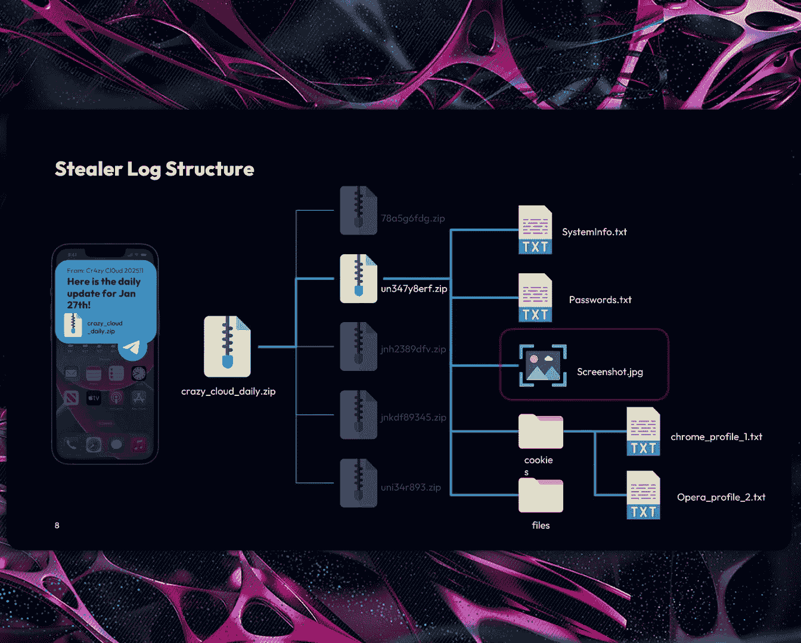

Probably it would add it to detect sandboxes because a sandbox is really easy to spot if you have a screenshot of the victim。

 and maybe it also gives them more context， more information。 And so when they added that feature。

 They were probably like this。 Like they were like， oh， yeah， this is so great。 you know。

 But when we look at it for us。 This is more like this。

 this is like they are taking a selfie of a crime scene， there's so much information。

 we can extract from that screenshot。😊。

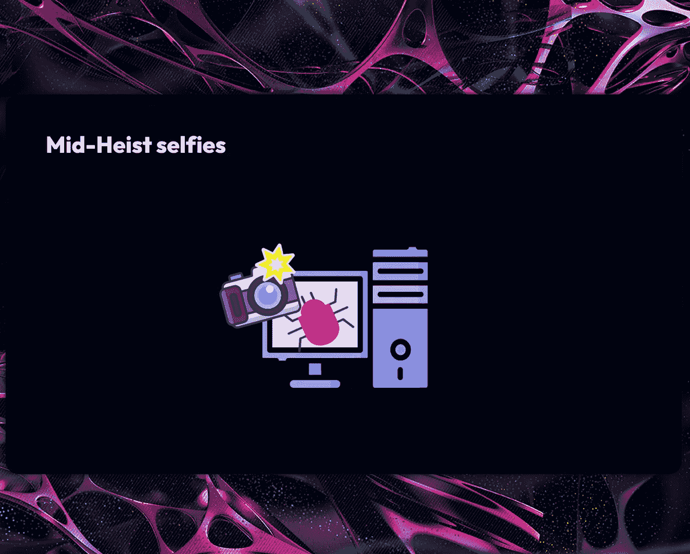

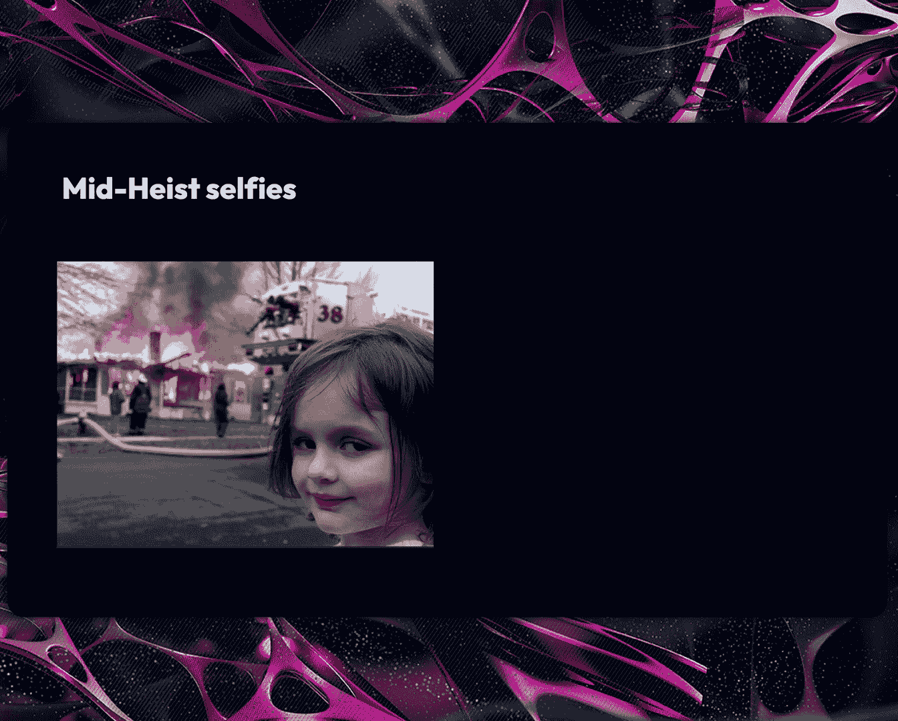

And and and or like this， right， they are basically over there， you know， pushing their crime。

 So what does such a screenshot look like， Here's one。

So you can see here this is YouTube it talks about crack Fortnite software。

 it talks about the fact that it's undetected you know and it has a link to download and a password here's another one So here you have a mega link with a link to the zip and it says that it's an office suite crack you have the holding is visible and you can extract it automatically if you do the OCR stuff and so when we realize that or when we wanted to apply that a scale we were like oh my God the thread actor are basically giving us you know something we need in order to protect our customers or you know people online。

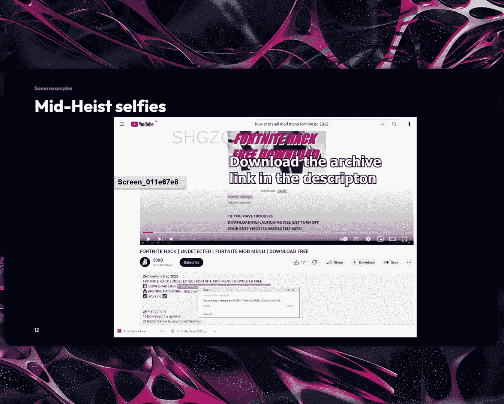

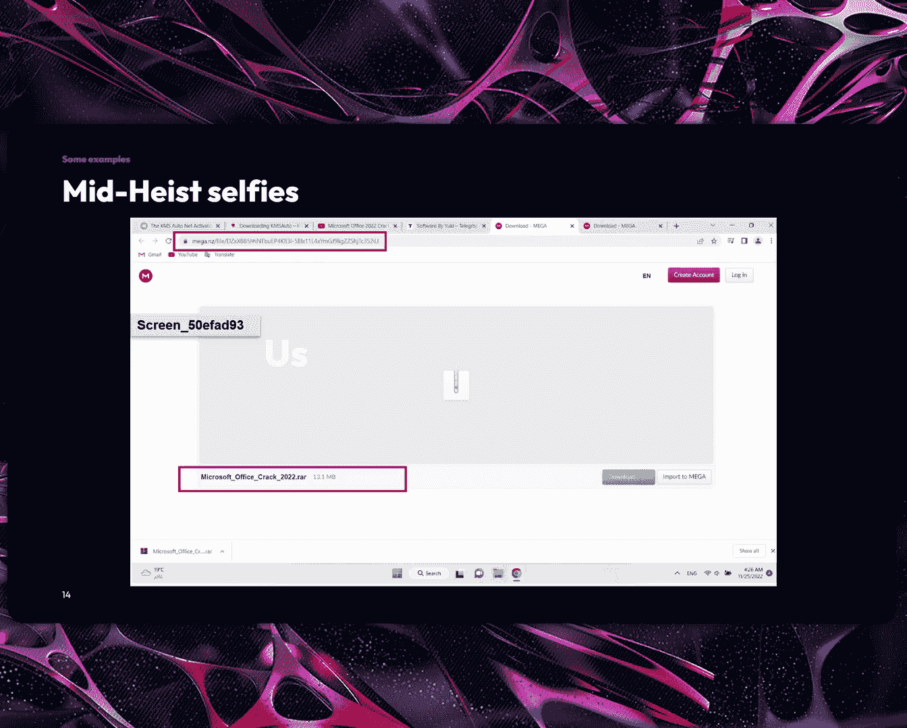

So the screenshot， it contains all the clues and hintmp needed to solve the story of what happened for the infection。

 and we happen to have a ton of them like by being infiltrated on these telegram and cybercrime groups。

 we have over 11 different Maer families， 15 million screenshots。But so then we realize， oh my God。

 analyzing a screenshot by one by one is is time consuming and it's difficult right it's too much information but then we're like。

 oh， we're 2025， everything is solved by AI and LLM So why not do it right？

 we should use an LLM for that problem And so this is where Eselleelle's genius is coming in she built something that she's gonna talk about。

Oh， I'm sorry。Oh， yeah。Thank you。 so I'll walk you through the LLM pipeline to show you what it looks like actually。

😊，So we do have the screenshot that we feed into a first LLM layer。

It outputs a formatted description that we then use for the second LLM layer to identify the infection vector。

 as well as the theme of the infection。Then comes an IocC checking pipeline to discriminate between live Iocs。

 those that are just dead， and those containing only the theme of the infection。

But if you look at the pipeline， you can see we have two LLM layers。And you might be wondering， why。

 too。And that's a very good question。 And I will tell you the story of why we came up with two LMnas instead of just one。

When I came into this project， I thought， as any human not familiar with LLM would do。

 I just translated my thoughts to the LLM as if it was a human that would carry the task and the project was pretty simple。

 we had a simple task and it was identify the infection vector。

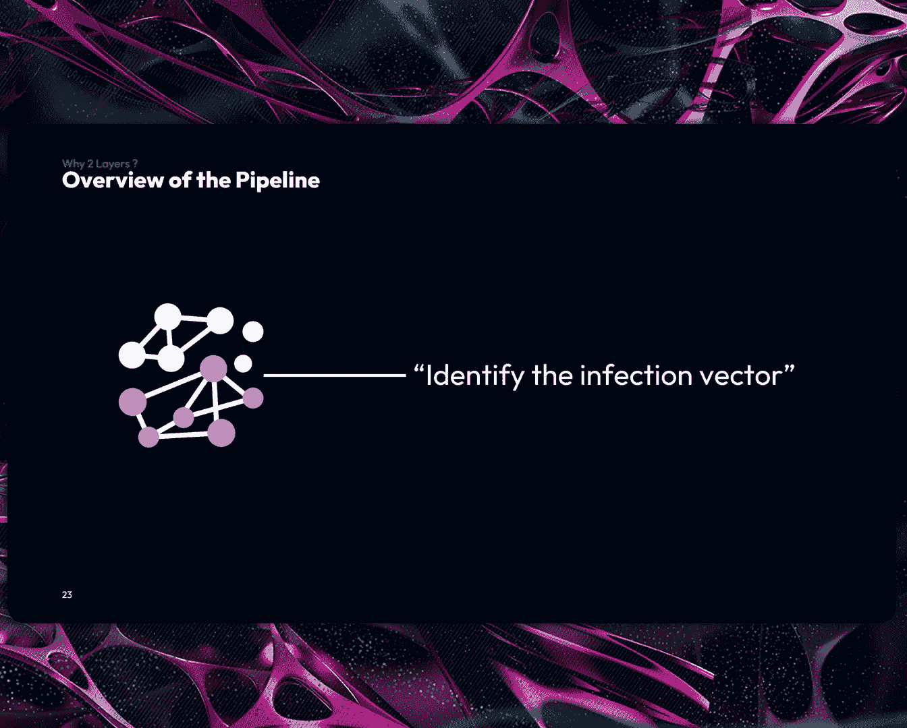

So at first， the pipeline was just one single layer of LLm。

But the LLM did not think nor act as human do。And I will explain to you why with this simple screenshot。

 the one we saw just a few moments ago。As humans， when you see a screenshots。

 you first assess what's going on。So you see it's a YouTube video。You see it's about a fortnite。

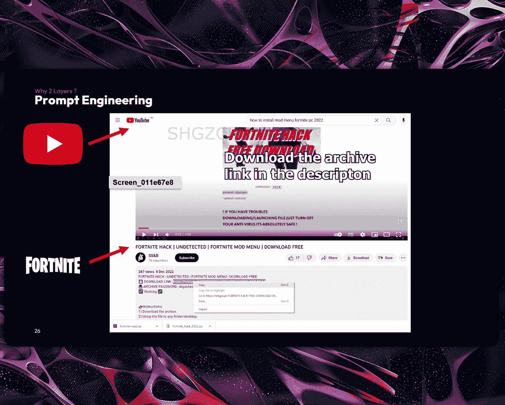

And you can see it involves a download。Now， as humans。

 what we did was to visually assess what is going on inside the screenshots。

Then once we're familiar with what's happening inside， we look in the details。

 So you can see there's a download link。And we can see at the bottom that the archives have already been downloaded。

And based on field knowledge， we know when reading the names of those archives that iss suspicious and is probably how the device was infected。

What we did here is a second task。 We pointed out the infection vector based on field knowledge。

And now we understand why the single layer LLM pipeline did not work。Because with a single layer。

The LLM has to carry out two tasks disised as one task in the human mind。

And that brings us to a very important key insight for you guys about LLM。

An LLM can't just figure it out。 You have to translate your analyst intuition into instruction if you want the LLM to carry out the task properly。

So now we have two layers， one for the first task， visually assessing the screenshots。😊。

And a second to point out the actual infection vector。Now that we know this lesson。

 we came to prompt engineering。Let's talk about the first layer。

We visually screened the screenshot we analyzed first。

 and we saw that we could categorize them into three classes， web based contents。

 so it's screenshot only displaying a web page。File system。

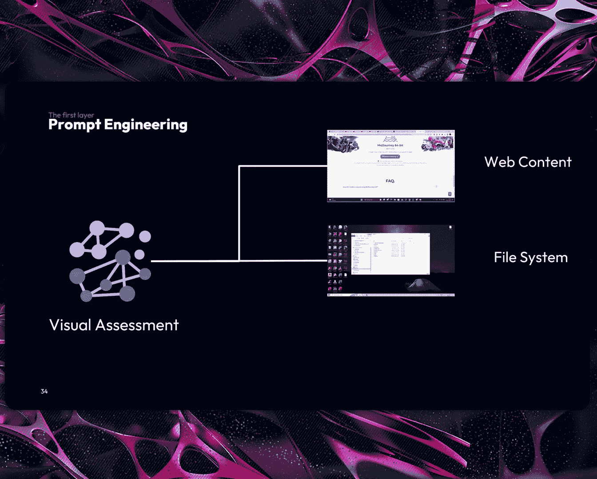

And the last one was hybrid， so you have both content。For the web content。

 we wanted to capture the details about the page to see if it was suspicious。

 so we asked for a general description。In your link， that could be visible。

And the browser tabs in the screenshot。

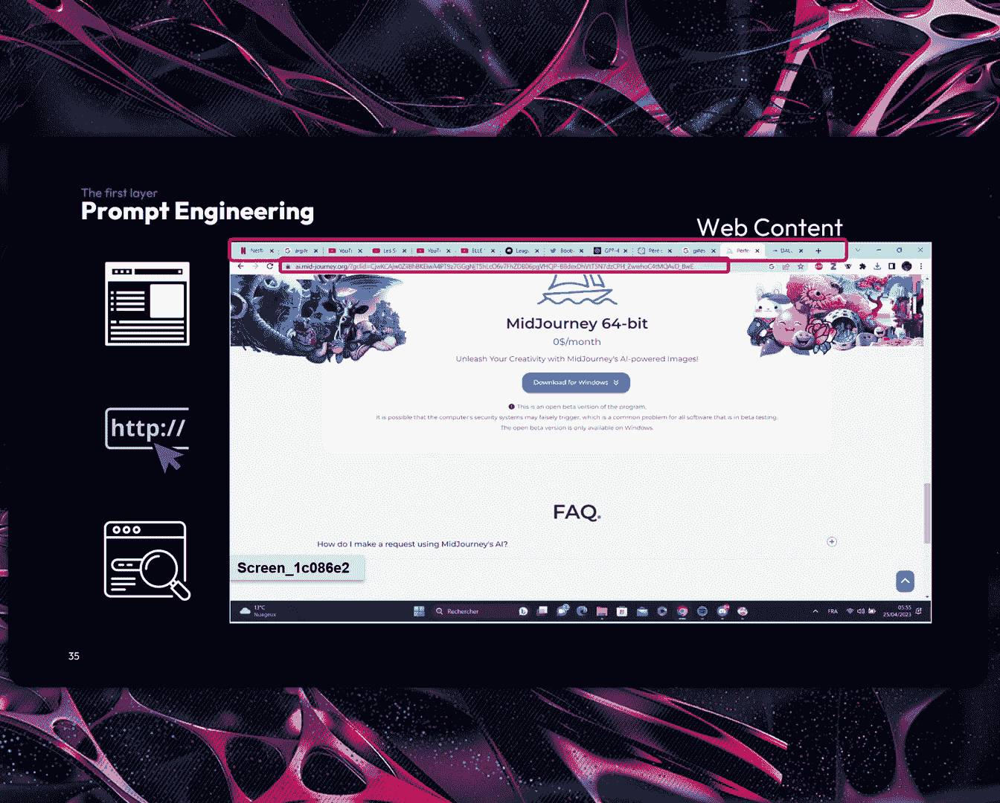

For the second type， the file system， we asked to again the description。

 but also the names of the file in the file Explorer。😊。

And in case it was an installer on the screenshot， we asked to pick up which software was being installed。

And for the hybrid， we asked all of the above。

So now we have four elements。 We ask the first layer to pick up。Sing description。

 file Exper and installer links and browser tab identificationification。

Before launching the first layer， we thought。We might need to instruct or at least hint the second layer what could be suspicious。

 So we added a fifth element， and we asked the LL M to point out anything that looks suspicious。

 And we explained how to point those out。 So any links with sharing in YouTube video mentioning a crack。

 for example。

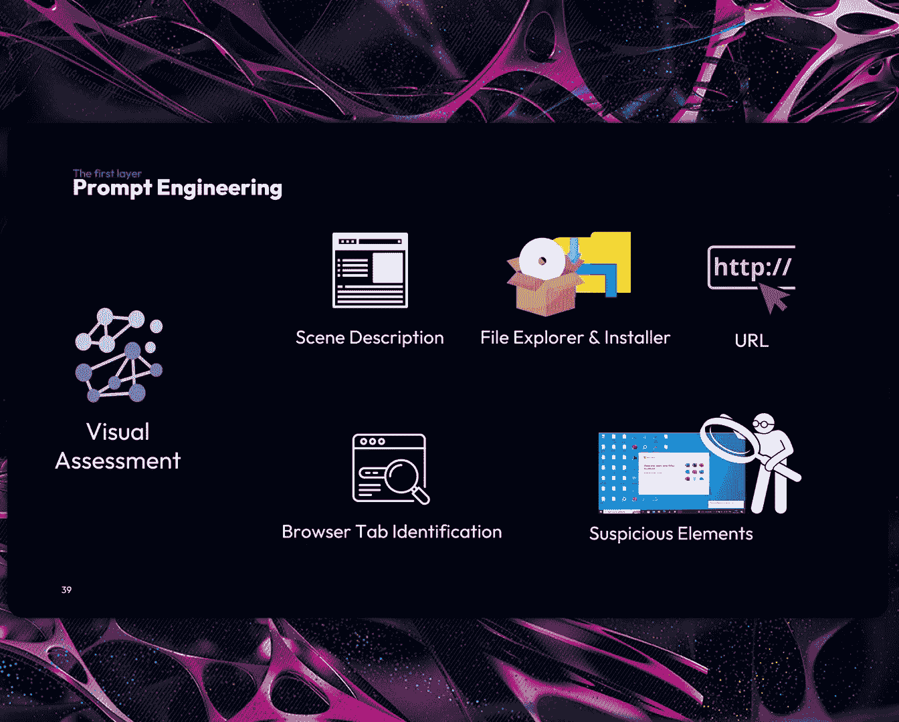

Anything like that。And this is how the prompt was basically designed。At the top。

 you can see we ask for the main content what's happening in a screenshot。😊。

Then you have the part about the files end program。Under anything about the links。

Then the browser tabs。 and finally， the suspicious element。

And if we feed this screenshot to the first layer。😊，We get this output。In the main content。

 it identified the Eet security window as well as the YouTube video。😊。

The FA program was also identified as well as the YouTube video。😊。

We have both tabs and in a suspicious element， it highlighted the YouTube video as well as the license key entry prompt。

So that's great。 We have our first LLM layer doing the formatted description。😊。

And now we can feed this description into the second LLM layer。However， if you're familiar with AM。

Or any machine learning， you know that the input you give has to be perfect if you want to get good results in the end。

And since the inputs to the second is the outputs to the first layer。

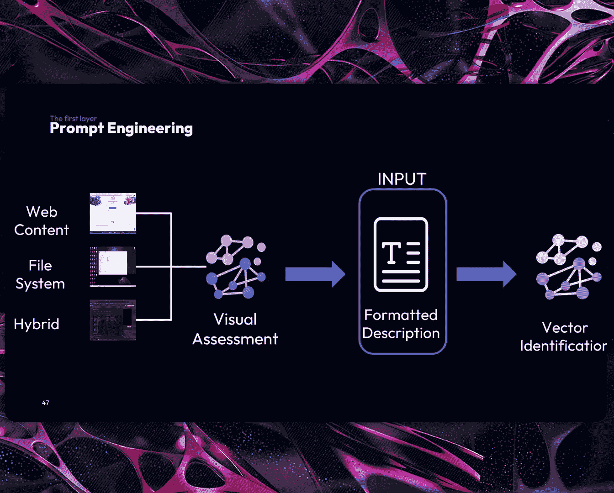

We want to avoid that kind of scenario where the first layer output sabotages the second layer because it could be just plainly wrong。

So as much as we wanted to go straight into the second layer。

 we had to assess how good the first layer performed。😊，So we jumped into the assessment。😊。

We assessed the first layer on a thousand0 screenshots and the results were pretty good。

For scene description， 96% of those screenshots were really correctly described。

We had 100% accuracy for fileile Explorer as well as for links。

And the suspicious sermons were greatly in unified 95% of the case。However。

 browsing tab identification was very inconsistent。

And what I mean is it only identify correctly everything and 30% of the screenshots。In 32 of them。

We were missing information， and in 36 of them it was plainly wrong。

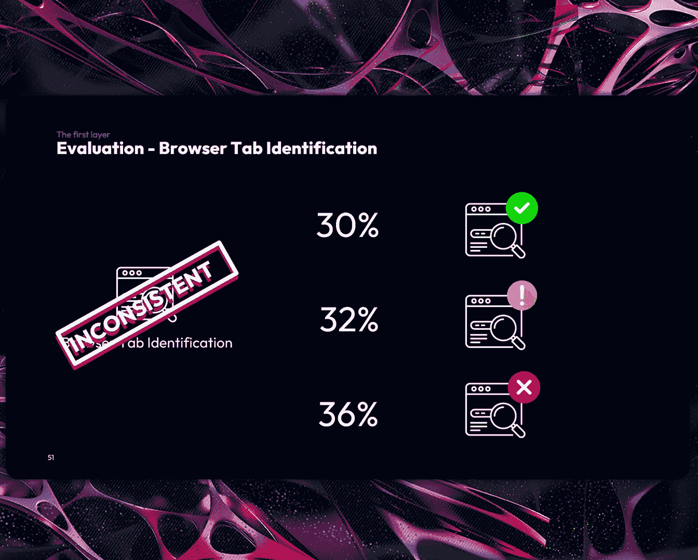

So if we see an example on a failure for a screenshot and we zoom in to the red。

Forum。We have three。Correctly identified browsing tabs。

 and then the LLM resorted to identifying the bookmarks。Which was an unwanted behavior。

And it even failed to identify the last browsing term。So it was indeed， very inconsistent。

We had to do something about it， And we began to think how to make it better。

And before putting in the effort， we had this crazy thought。

 what if we just try to delete it before trying to correct it and see how the whole pipeline would basically perform？

😊，And so， we did。And we rerun the assessment。

And the accuracy did not change， so we decided to just delete the browser type identification。

So we have the assessment of the visual。And the form in the description。

 And now we can jump in the second layer of the am。

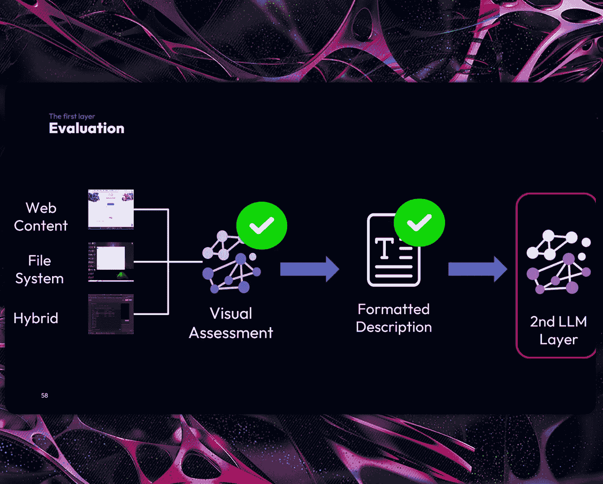

The second layer is purpose to identify the vector as well as the theme from the formatted description。

We also asked it to basically format it so we could exploit it later on。

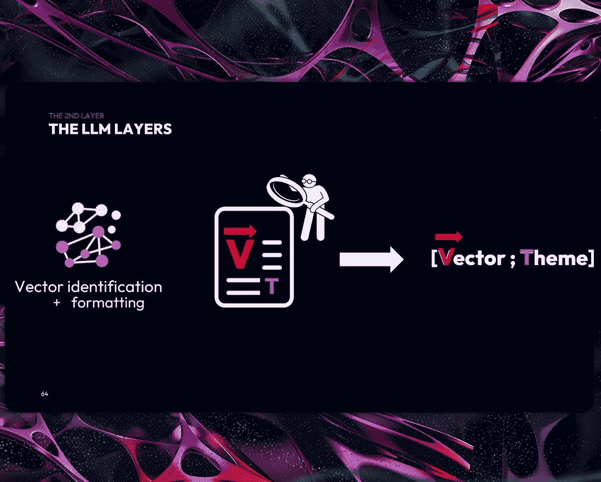

And if we look at the outputs， first， you have the vector。 in this case， the file sharing platform。

And the theme is basically the name of the software that was downloaded from the platform。

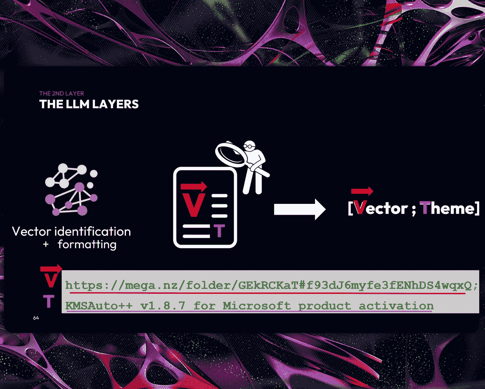

Now that's gray， we have the second layer as well as the outputs formatted。Great success。

 Now we went and run the pipeline。And when we went to check the Iocs， it returned。

Many of them were just plainly dead。And that was a big problem。

Because having an ISC feed is interesting only if it's live。

 because then you can study and maybe remediate it。

So I realized the OCF was not so great in the beginning。😊，So， we had to introduce。

The ISC checking to solve that problem。The ISC checking would aim to discriminate between the live。

 the theme and the date IOC is， so it could curate basically the IC the。😊。

And this is me so yeah when looking at discriminating the IOC problem we were dealing with a bunch of URLs so most of these URLs were part of three different categories file sharing platforms YouTube videos and then everything else so we had heuristics specifically per type of category fortunately for us the file sharing platforms they have really clear error messages and they respect HtTP status codes so we we were able to discriminate live and dead based on these messages so we could label them directly as the IO we still keep them in case for IR purposes or whatnot。

 but we're clearly labeling them as such then theres when it's live and it could ask for a descriptionryption key or there could be some social and engineering ploy but we will still consider it live because the user will enter。

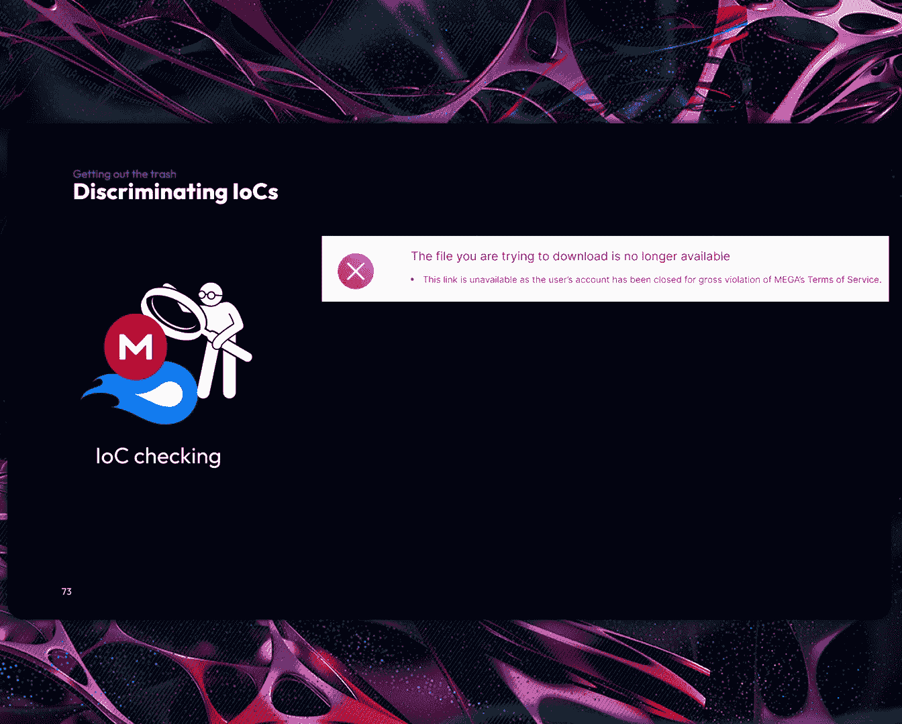

the descriptionption key， as you'll see later in many of the examples like the key is oftentime in the YouTube description。

 but then the password the file is able to be download it from mega so you need to copy the password and then put it in mega which makes the takedown process and the detection harder for for these platform but as a human is very easy to carry on a password。

 especially if you're trying to crack an expensive piece of software you will be able to do it but so all of these are considered live because eventually the person can infect themselves。

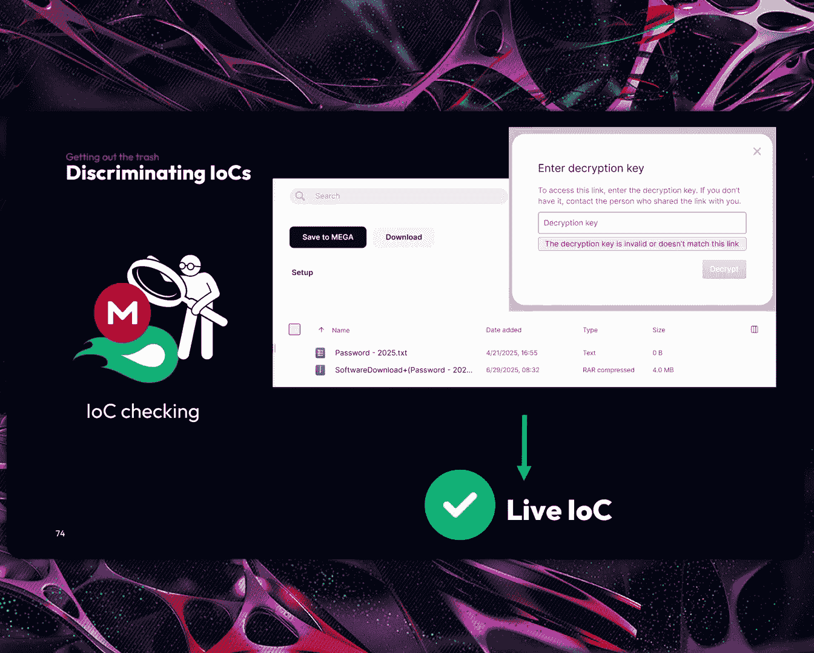

And then the last one， others。 so we are we are hunting for things that are indicators of a download。

 so download buttons and stuff like that。 and then we will consider them live if we are able to do so。

For YouTube now again， there's clear error message so very simple heuristics to say the video is no longer available。

 so we are able to to label them as that we need to support the platform differently and file sharing because of that but still very easy to do then theres the when it works when the video is still up we if there is a download link this is what we're gonna store not necessarily the YouTube video So we have you know another thing that goes in and extract that。

 So this would be considered live。 but then sometimes the download link is removed and like。

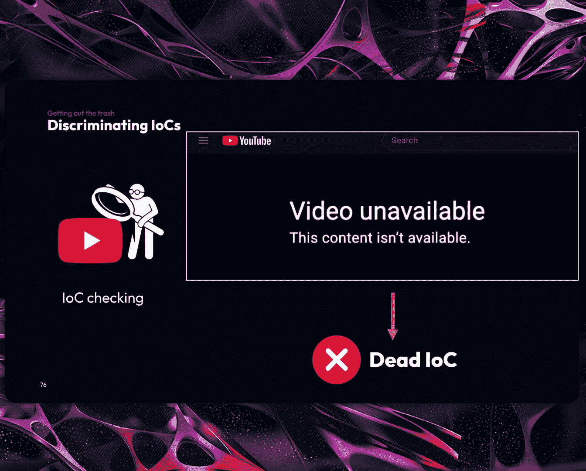

I think these guys are trying to avoid being detected by Google and and so they will like change the the video description in order to fool whatever Google' is trying to do when trying to prevent fraud like that。

 But so if there's no link， then what we will do is we will consider it a theme。

 And why theme is important is because it allows us to track campaign and like with any fraud。

Telling people， a， this is happening like office， crack office is infecting people。

 If people are aware of it， the behavior will change and it will reduce the chances of them infecting it。

 So storing that theme and tracking campaign and talking about campaign is something important for our online protection。

Now， let's show you a demo。I rigged the demo a little bitca normally like this runs on a server and has no output。

 So what I I did with the demo is I put in like show us the screenshot when you analyze it and also show us the answer of of chat GT on the the console so we can look at it。

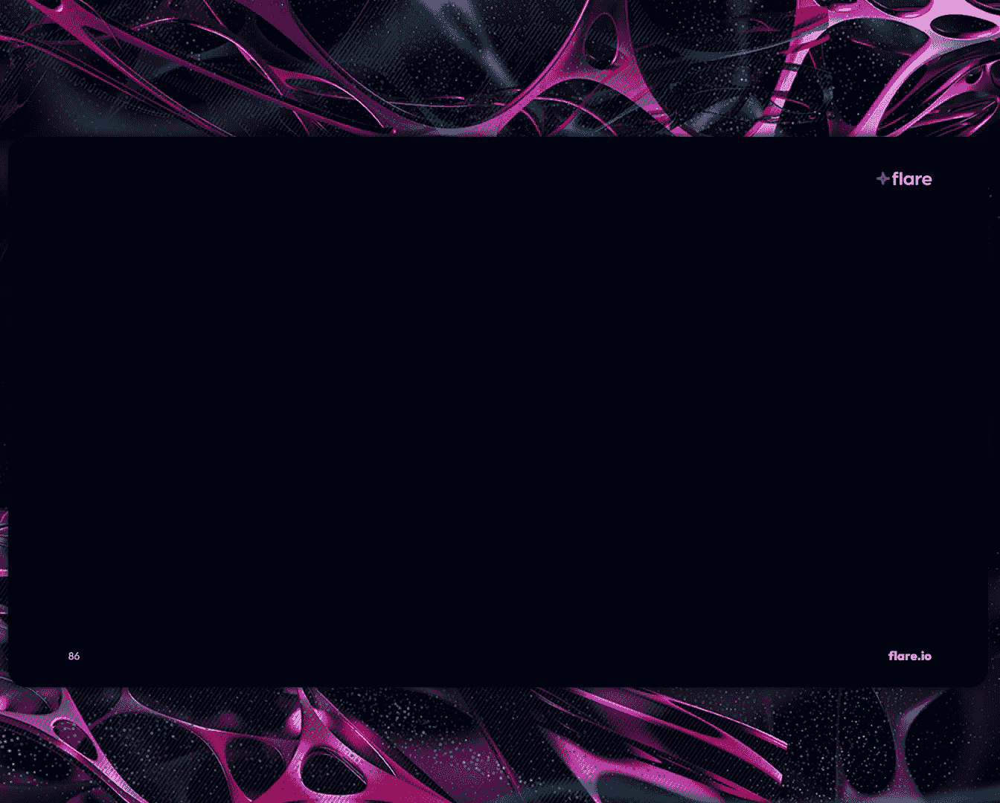

Alright， here it goes。 Is it automatically playing， no。

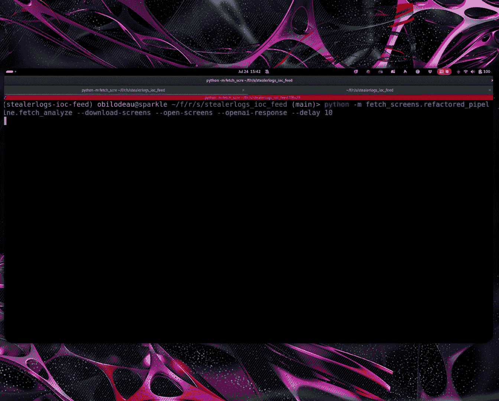

Let's try that。okay， you， I hope Internetnet works well。Alright， so it's starting。

 we're passing it the first screenshot。 Okay， so this is a screenshot of someone looking at a zip file。

 And so we have the the crack。 and it's a one GB file。 this avoids detection。 Now。

 if we look at what open AI Cha GP responded the DLLM responded。

 So it says Microsoft Office 2019 specific version。 this is open， this the file installer layer。

 the URL was extracted。 And so that's the result of the first layer。

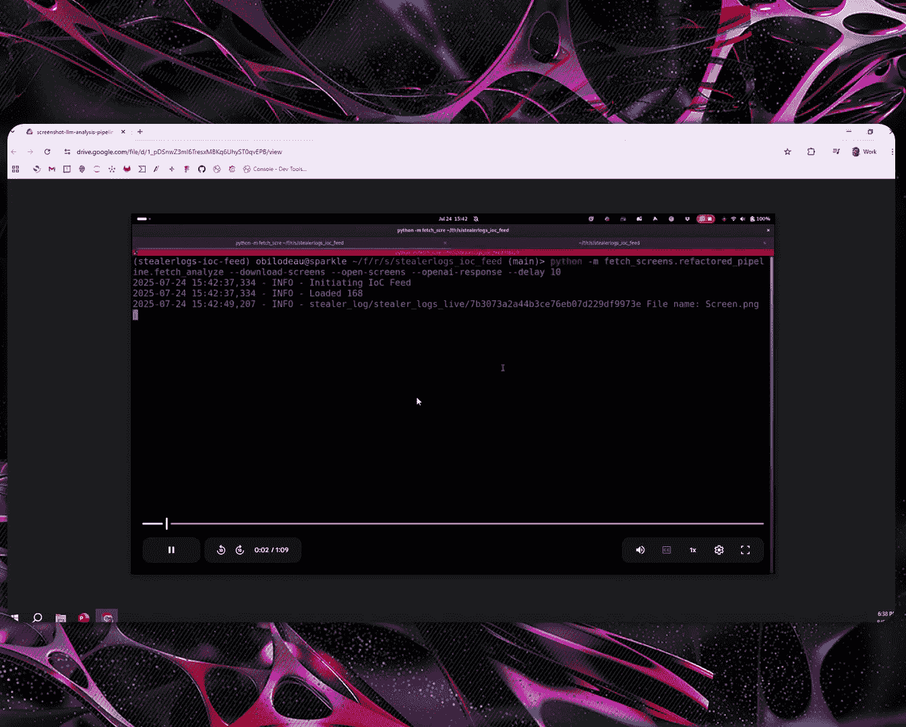

Now if we continue it will say that iO so that link didn't yield the download link and it will say though the vector was Microsoft Office crack software now the second screenshot its just tooless so stick with me so this is clearly Adobe Photoshop cracked again software and so the LLM managed to extract the URL and extract the context Adobe Photoshop plus neural filters and then says this is likely what's happened here so's just doing that you know in a loop keeping looking at it and so here's a look at the JSON files that that it outputs and so we add in like malware family the information that we already have from the Steel log but so the URLs are in there and then all of the links that the crawl chain that we will do will also be part of the output and so with this this is basically like the whole thing。

We builtil。

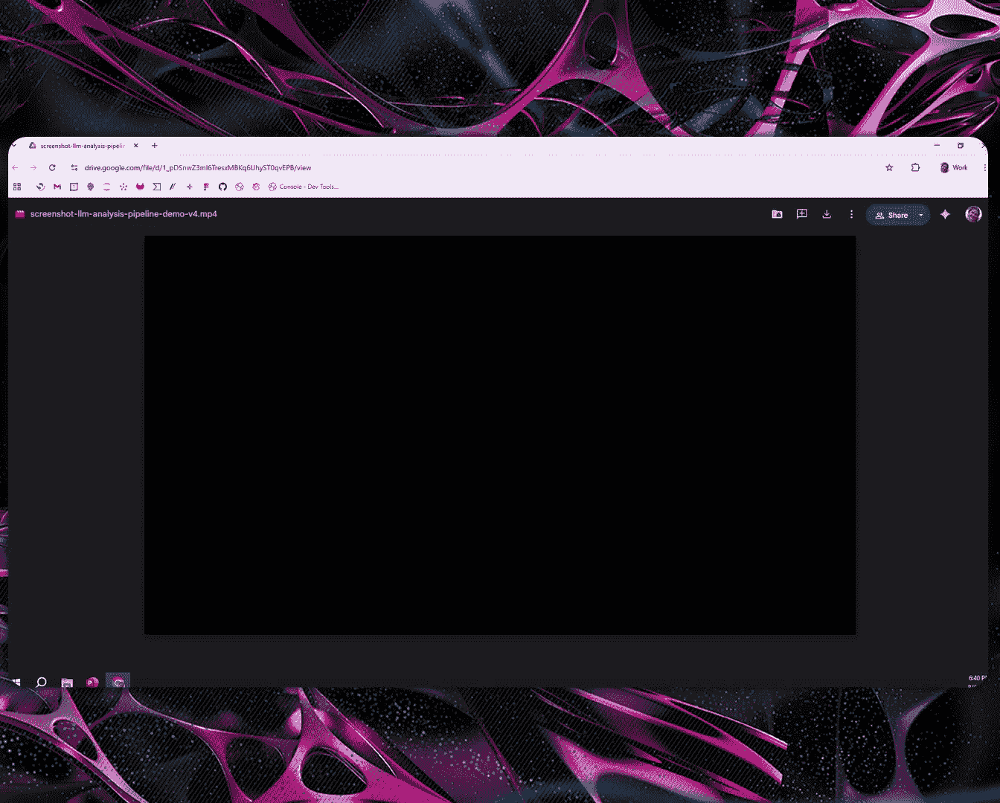

Okay， that's gonna be tough。Can I put the slides back on。😔，Oh。啊，干嘛？

And so this， this was delayed。 We had added sleeps in it so that we could all see。 But still。

 this is like several calls to the the L model。 And so it it takes a bit of some time， you know。

 to to to do。 But then once we let it run for weeks， we had tons of stuff to look at。

 And so Eselle is going to talk to about some of the the campaigns。

So we let the pipeline run on tens of thousands of screenshots。

 and we were able to track some of the campaigns， but most importantly。

 see the tactics for actors used to infect the most people。So we entered the info Steeler playbook。

 basically。Two things we noticed inside that playbook is Leretheme used to bait the user into downloading the software。

And the first theme was。Cracked software。Theilit software and mainstream software are often costly。

And many people want to avoid paying for those licenses。

And that's great because crack softwareft costs zero。But， it has a twist。And so in the human mind。

 they would compromise their own security because they don't want to pay for something they could technically get for free。

So here if I actually prey on users' willingness to bypass those legitimate licensing fees at the cost。

Of their very own security。The software we saw the most open in screenshots were mainstream ones and creative ones。

 such as theof Su， Vegasgas Pro， midjoney， and sometimes Fiora among those。

And all of those are mainstream。And targeting a mainstream software means you have a lot of potential victims。

 And that's a very strategic decision here。

Because targeting a mainstream product ensures a large pool of potential victim worldwide。

The second year theme we saw in the screenshots were gaming cheats and modes。

Those cheats and most targeted mainstream games again to ensure maximum pull of victim。

And you had games like Fortnites， vorrant and Minecraft。

And truth those types of games is， again， a very strategic decision。

Because they are gateways for people of all ages into gaming。

 They are relatively simple of access and simple to play。 And most importantly。

 the graphics are suitable for a younger audience。😊，Interestingly， they all have skins， weapons。

 and sometimes mows， and they're introduced very frequently。But they are paid for。

And considering the younger demographic playing those games。

 they often lack the intent or even the mean to pay for them， but they still want them。

And this makes the demographic ideal to be a victim of those information Datalogues。

So the gaming lesson here is， if it's free and shady。You are likely the victim。

 And dare I say even the product。

Next， after leretheme， were also seeing distribution strategies。And the first one we saw was YouTube。

 and it was used as a massive distribution system。We've seen titles of YouTube videos like those。

And it's often emphasized as genuine。 it worked。 And most importantly， it's 100% safe。

It looks like this， you've seen these screenshots already thrice today。😮。

But they often emphasize and contain a download link。 the password to the archive。

And instructions coupled with the video。And we have three command denominators among all those YouTube videos we've seen。

One， it's always free。Two， it works， even if it's free。And 3， disabling A V is needed。

 and it is safe。

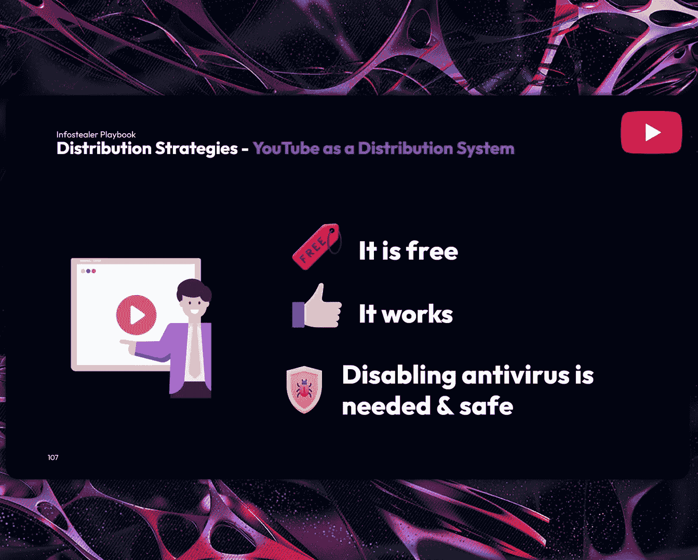

Again， Sims legit。Here， YouTube's reach and tutorial driven content makes it the perfect launchpa for infofert malware。

 because humans often seek visual guides to guide them through any installation and any procedures they're not familiar from。

The second distribution strategy we saw is leveraging Google ads to sponsor malicious websites。

I'm sure you're familiar with Google adss when a actor builds a maliccious copy of our websites。

Deliverage Google ads to place it at the top of a user's results。

So they're most likely to click on it。 and that's very interesting tool because you can target a time frame sometimes and even the location。

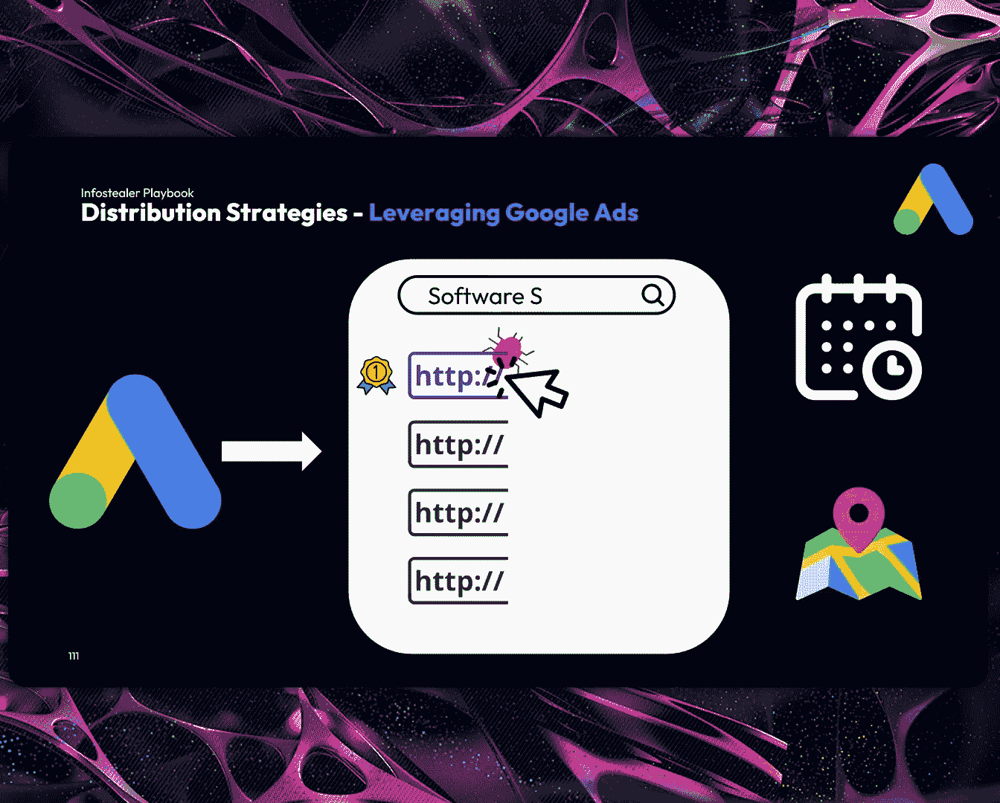

And here， Google Ads give the full actors a fast lane。The users trust。

 because they place mal content where users expect。Safety， which is at the top of the results。

Now there we've seen the lure and the distribution techniques。

We could track successful campaigns using those techniques。

 And those are two case studies or textbook examples so you guys can understand how powerful those techniques are。

How we found the two campaigns， we simply looked at the IocC fi and the same ICN theme came back over and over and over again。

 And when we looked at the screenshots。

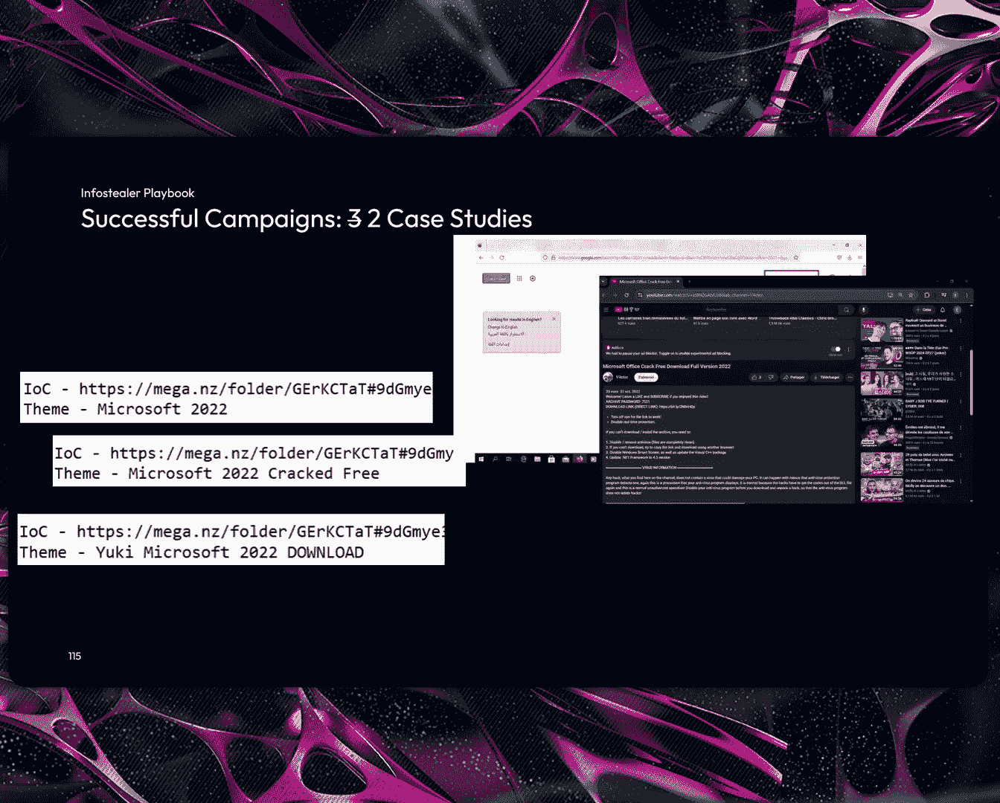

We could piece together the history。Behind what happened。On top of this。

Both campaigns were omnipresents in the screen analyzed。

It consisted of more than 5% and 6% of all infections we had。

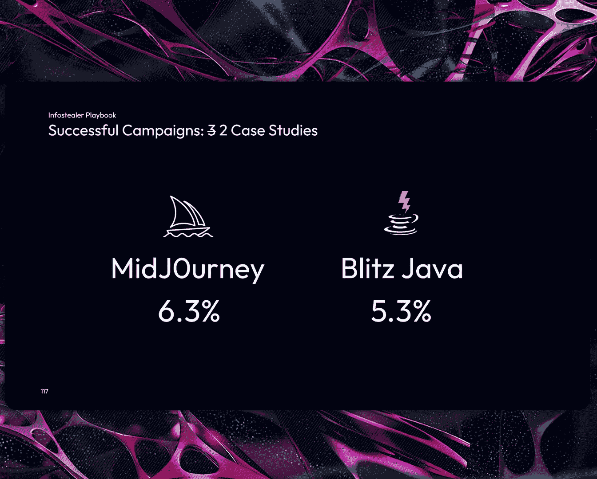

So we decided to show them to you guys。 First， the mid journey。

Each screenshot I will present to you is from a different infected device。

So the infection start by the user searching for a journey。Then to get hit with a sponsored ad。

 and you can see at the bottom the legitimate sites is here。

But the user still chooses to click on the sponsored one。

They're presented with a very well made copy of the website。

 but there's one little detail that's important。It is possible that the computer security system may falsely trigger。

Here the thread is playing with your mind when you enter this page。

 is's preparing you to accept that you will have to disable the AV for it to work。But well。

 the user believes in that and they click on the download。😊，And they're given an executable。

 which they click again。😊，And then they launch， but it doesn't work。Which is suspicious。

But then you remember you were worn and a threat did its job very well because now you say， oh。

 it's normal， it doesn't work。 the AV wasn't disabled。So you search on how to disable the AV。

You just say it。And it still doesn't work。And it doesn't work。

So you search because you become anxious。And you discover it was indeed not really a journey you got。

But， I didn't feel a stealer。Here the Majorjo campaign shows a trending AI image generating。

 which will attract most users it created a copy layed tomorrow in it。

 created a copy of the official websites。Leverage Google adss to place it at the top。

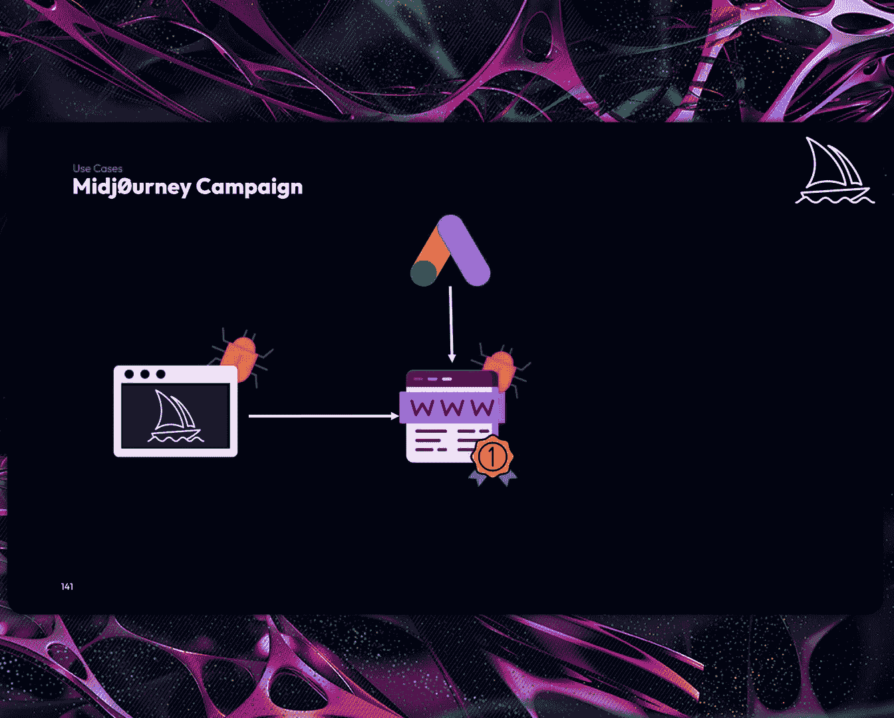

So they infected the most people they could。The second campaign was bit other。At first。

 we saw many screenshots with the Java installer。Were even so some with the official looking website。

😮，And I was very suspicious because we thought， okay， was Java compromised？

Because that would have been the be coop。No， again， the same old trick。Sponsor that。

Here you have two different languages， meaning two different countries。And if you look。

 it's the same domain。 and under again， you have the official and legitimate website。

Here is one page of Java。And here's another one。And I'm sure you couldn't tell which one was the legit one。

 even if you could compare now。

But if you look at the details， you can see some of them。We're missing developer our resources。

Some elements on the left， some spacing。

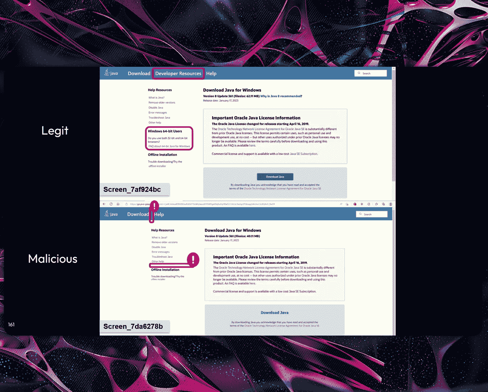

The front end of the button is different。You're missing a hyperlink。And the file size is different。

But if you're a user and you only clicked on one of them and you couldn't compare them。

 you can't possibly know it's a fake one， you will definitely fall for it。

 and that's the art of it because it's very well made。So if we recap。

 the user clicks on the sponsor then。Gets presented with a well made copy。Download the software。

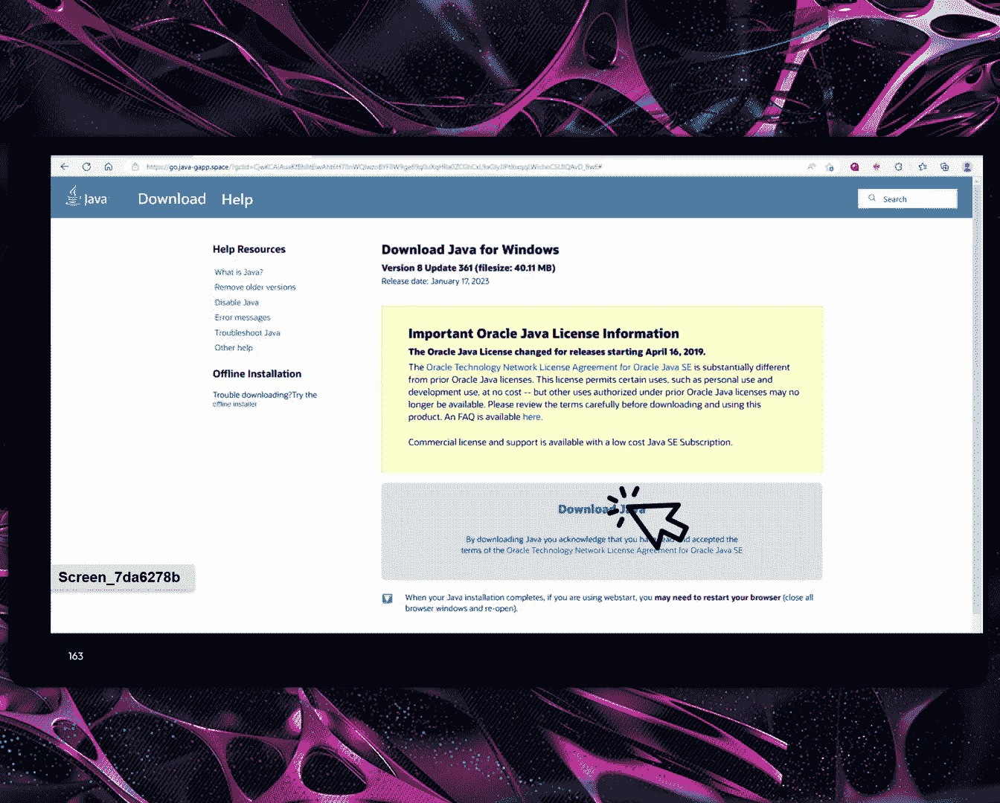

And they get an archive just suspicious in itself。 But then you have the executable inside。

So you click。And then you have a legit looking installer。But if you can look closely。

The logo of the executable is not the right one， it's a different one。

So when you let the installer go and it doesn't work。Then you get anxious again。So your search。

I tried installing Java， but it doesn't work。And again， it doesn't work because you're pond。

We decided to name the campaign Blitz Java， because all the infections happen all around the world and in a time frame on only 19 hours。

And when we looked at the days， those 19 hours spanned。We're from February 11th until the 12th。

 and if you look on the calendar closely。It falls on a weekend。

And a decision to use a weekend for the sponsor ad is a strategic one。

Because weekend means more leisure time。More time away from work。 More time away from school。

More time to go on the computer。And more time response for any security teams。That saw the infection。

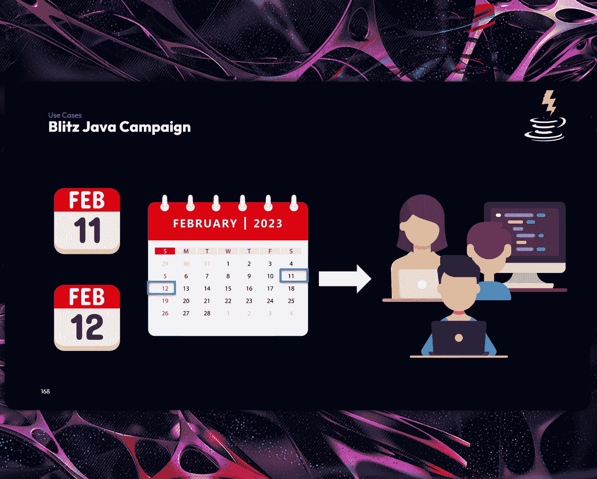

So these two successful campaigns used simple tricks that we discussed before。

He targets a mainstream software and its legitimate sites。Create a copy of both。

Then you leverage distribution strategies， either in Google Ad to place it at the top of results。

Or you prox it using a YouTube video？And this brings you。The most potential victims。

The key insight here on how they infect people is that forctor still rely on simple psychological tactics because they simply still work so well。

Why would you pain yourself by doing a technical exploits What all you need is just manipulate people and it's so easy。

So moving on to the strengths and limits of what we built which we need to recognize。

 So the screenshot is the biggest strength， but also the primary limitation right So what is advantage of the screenshot is that this is like agnotic of code changes。

 So let's say you have traditional malware analysis where you need to look at the code and make sure and the bad guys with the packer。

 they will like the malware will change a lot and so you need to have generic signatures and all that stuff expensive work But so if you rely on on signatures。

 you will be bypass and you will stop detecting the threat whereas with the LLM analyzing the screenshot。

 we are still able to track campaigns across malware changes because we are after the fact that they got infected So it's robust against the code changes。

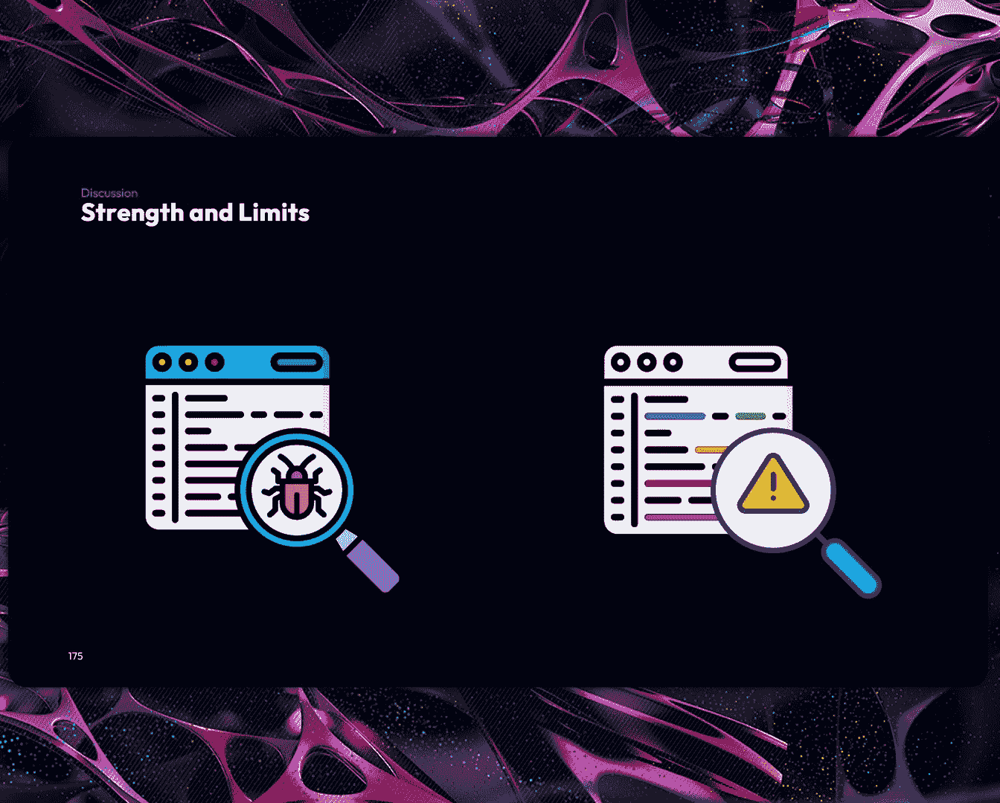

Now， so tracking different malware families， as long as they have a screenshot， we're good， right。

 we， we're good to track them。 So it works across different malware families and across code changes。

 However， as you can guess， you know， if we don't have a screenshot。 If bad guys listening to this。

 recognize， you know what， this feature is not that useful。 people are not buying our logs for this。

 we will remove the screenshot entirely。 And then we like this stuff is gonna make us blind， right。😊。

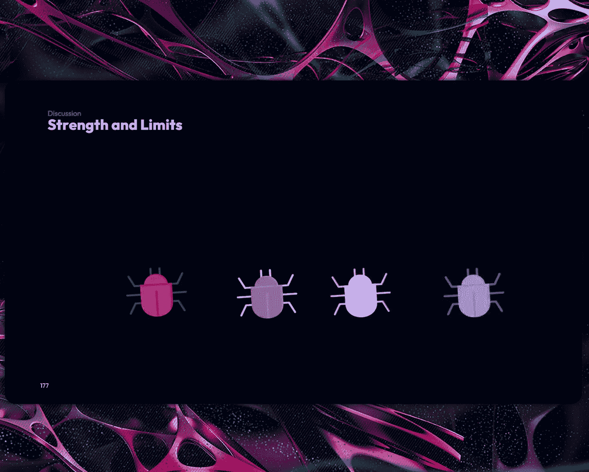

But also more so than just the existence of the screenshot themselves。 There's the quality。

 In some cases， there's nothing to be said about the screenshot。 You know， it looks like a victim。

 You know， the desktop has， you know， someone's clearly using that computer。

 But we have no idea of what happened。 And so this is another， you know， part of the， of the。

 the pipeline where were just like， we have no clue。

 that's a limit of the approach and we can't do anything in these cases， right。

 so we rely on the the quality is something important for this to work。

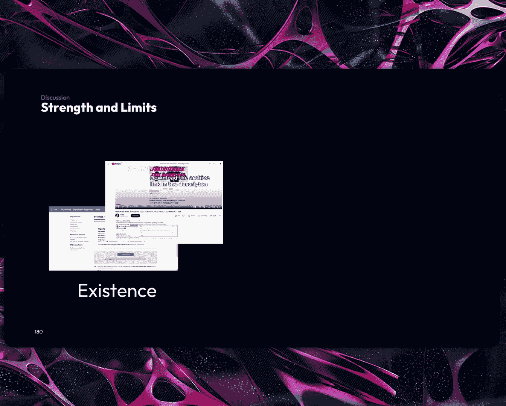

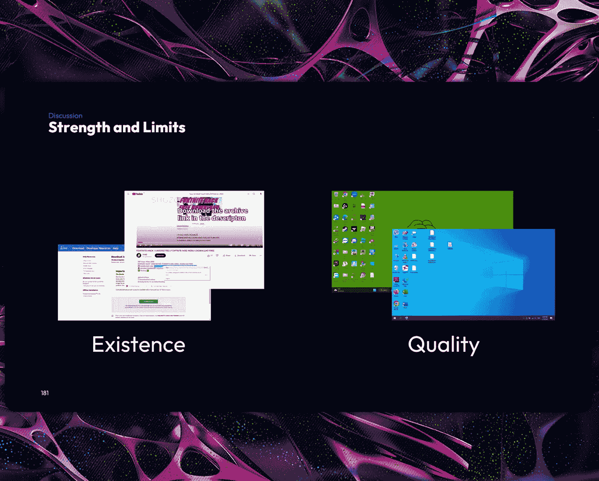

Here's the table summarizing it。 Now you're asking how much does this cost right？

 you you're spending all that that LLM money So it takes five second to process a screenshot 5 to 10 seconds。

 And it's 0。3 cents per image。 So all of the prompting， the two layers。

 everything included is about 。3 cents per image。 And you know with cloud。

 this thing is probably likely to go down and yet the results are probably going improve with the new models and everything。

 So yeah。

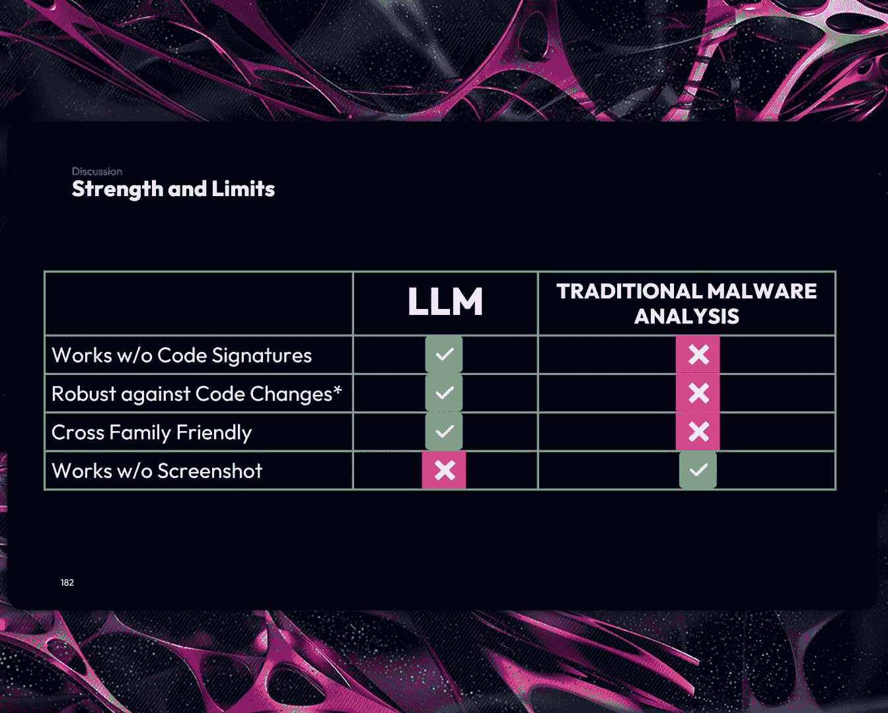

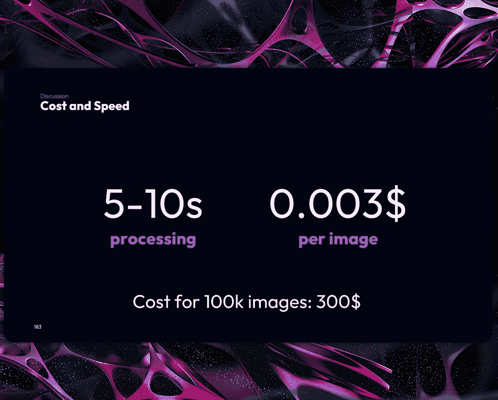

Moving on to the conclusion and the takeaways。 Okay， and we have a little surprise at the end。

 but so。Infor Steeler are quite the threat， right， We heard about， I have five minutes。 Alright。

 we heard about， you know， red line and Luma C2 being taken down， but they're still super active。

 Luma is still isn't we are collecting more Luma after the take down than before。

 So something something's happening online right now with information stealer malware for sure。

But so it's trending。 but as long as the threat actor， the key sharing screenshot。

 right we will be able to track the campaign and the themes and so we do so using those the different layers and it allows us to identify ioc at scale and to track campaigns now taking having a nice takeaway slide for you here So I think awareness is really important like and you saw we mostly talked about crack software。

 but we think that organizations should more insist on having their user have safer behavior online including being aware that crack software is dangerous and a lot of the victims are IT people who think they know better or we crack software you know20 years ago and think it's okay this is all malwareridden nowadays and also disabling AV should be something that triggers your response you should be like oh if I need to disable A somethings going。

Somethings wrong here we think also that all like we applied LLM to one cybersecurity artifact。

 but I think everyone here can apply LLM to their own cyberse artifact that matters to them and they need to encode the analyst intuition and very specific instructions and so this is a step that you need to take very carefully but if you do that you'll be successful at applying LLM。

So what we did today was focusing on the screenshot， but now。

What we want to work on next is like all of the other artifact part of a steeler log right one LLM four screenshots。

 how about the software installed， the processes， the history。

 the system information if we analyze all of these and we apply the analyst mindset on every one of them because they're very different artifacts you need to apply a very different mindset for it then we combine this and we ask the LLM what happened how did they get compromise right and we're calling this project and it's already in a working state we're calling it share log or Sherlock and when we intend to submit it at Black Ha Europe。

 the CFP closes next week or this week So this is gonna be something we we'll talk about later and we want to share it sharing is car so one more thing closing out all of the results that you saw today were in a paper that was released and it's available on。

Arive so Estel wrote the paper， including the evaluation and all of that。

 so if you're interested in learning more you can check that out and with so we will be we will have time to take a couple of questions and I have a special gift from Nor Se for questions Nord Se Bage hardware badge if you are interested so thank you for your time。

😊，yes，免费。That's incredible。Can you help me understand a little bit about what that means。

 what this inster context means beyond。The initial attack or talk about the threats。

 tell me a bit more about why we might care。So so okay so knowing campaigns and like the infection vectors and letting people know like with the URLls。

 you can do you can block them with corporate proxy the campaign is more of an awareness thing we'll be able to write line right blog posts and say oh right now they're targeting this software make people aware of it if you're using it or whatever But and then with with the downloads。

 we intend on eventually like detonating them。 And so if it's not covered by AV because in some cases it's not covered by AV And so if we detonate them or upload into virus total then the community will be able to defend ands like all of things cybersecurity it's a cost game So if we're fast and we're analyzing quickly and reacting quickly we're gonna make them spend more money on Google ads and their campaign will be shorter lived and it will cost them more because we're。

I fightight back to the bad guy。 So its that's the the context。Any other questions？ Hi。

 thank you for the lecture。 Do you guys report it to the authorities or to。

Whoever to mitigate it and take it down。So some cases we do， but usually not really。

 and like so some stuff to like big brands like you know， YouTube， Github and and stuff like that。

 But most of the time it's quiet for months。 And then some we get an automated response like months after。

 but we don't have good contacts necessarily， I think at this point。

 So maybe someone from Google would like to chat and we would be happy to send them everything we extract the the YouTube videos and everything。

 But so。😊，And again，15 million screenshots， right， Something will have to be automated。 But so。

 and then is there appetite for us to build this or not， we have to figure out。 but， but， but I。

 I obviously a feed of high， high signal would be something good to build for these partners eventually。

 yeah。I think we'll have to go to the wrapper room because the time is up。

 So we're gonna get called if we stay too much， will Id be happy to answer any question you guys。

 so wrap up is down at the end of the hall over there。 So just。

 just walk us walk up there and we'll be there in a couple seconds。 Thank you。😊，嗯。

