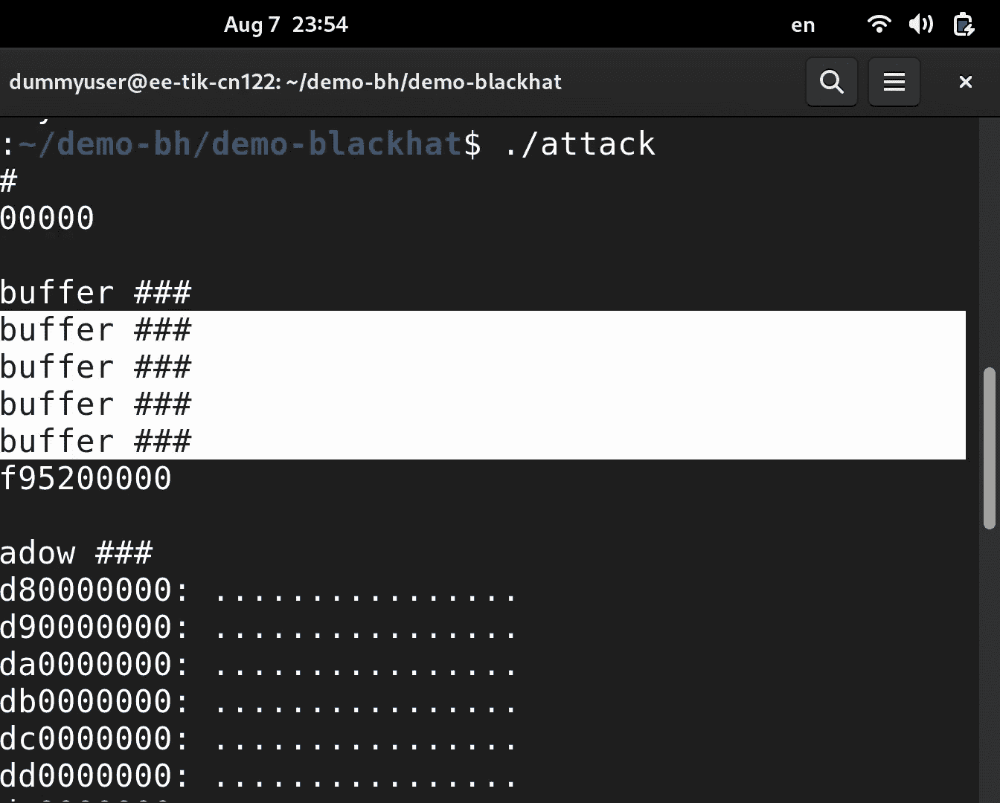

# 课程：利用微架构竞态条件从任意英特尔系统泄露特权内存 [ULXuhxj-WgA] 🔓

## 概述

在本节课中，我们将学习一种名为“推测执行”的漏洞利用范式。我们将深入探讨一个具体的攻击案例，该攻击利用英特尔处理器微架构中的一个竞态条件，绕过名为“增强型间接分支限制推测”的安全缓解措施，从而能够从高特权域（如操作系统内核）中泄露任意内存信息。

---

## 背景故事：幽灵漏洞的诞生

上一节我们提到了推测执行漏洞的威胁。本节中，我们来看看这一切是如何开始的。

2017年，英特尔召开了一次紧急会议，召集了全球行业内的专家。会议主题是一种新型的漏洞类别，它能够突破各种安全边界，包括执行环境、操作系统内核与用户空间之间，乃至云环境中的客户机与宿主机之间的边界。这个漏洞就是**幽灵**。

幽灵漏洞存在于处理器的**微架构**中。微架构是CPU核心的一部分，包含**分支目标预测器**和**缓存**等关键组件。程序执行时，其行为会反馈到这些微架构结构中。例如，分支指令的目标地址会被缓存到分支目标预测器中，以便后续快速预测。

问题在于，这些微架构结构在不同程序、甚至不同特权域之间是共享的。对于缓存，通常使用物理地址进行标记，可以避免冲突。但对于分支目标预测，它使用虚拟地址进行寻址，这就导致了不同虚拟地址空间之间可能出现**别名**或**冲突**。

以下是幽灵漏洞的基本攻击流程：
1.  **注入预测**：攻击者程序训练分支预测器，使其记住一个特定的目标地址。
2.  **准备缓存**：攻击者将缓存置于一个已知状态（例如，清空特定缓存行）。
3.  **切换到受害者域**：通过系统调用等方式，进入高特权域（如内核）执行。
4.  **触发误预测**：如果受害者域执行了一个分支指令，且其虚拟地址与攻击者训练时使用的地址发生冲突，CPU可能会错误地使用攻击者注入的预测。
5.  **执行披露小工具**：在短暂的推测执行窗口中，被劫持的控制流会执行一段“披露小工具”代码。这段代码通常形如：
    ```assembly
    mov rax, [rsi]      ; 读取一个秘密值到寄存器rax
    mov rbx, [rdi + rax] ; 以该秘密值为偏移量访问内存
    ```
    第二个内存访问是秘密值相关的，它会根据秘密值不同，触及不同的缓存行。
6.  **传输信息**：攻击者返回自己的上下文后，通过测量缓存命中/未命中的时间，就能推断出受害者访问了哪个缓存行，从而泄露秘密信息。

---

## 英特尔的缓解措施：EIBRS

上一节我们看到了幽灵漏洞的原理。本节中，我们来看看英特尔提出的解决方案。

英特尔最初的缓解方案称为“间接分支限制推测”，但效果不佳。最终的长期解决方案是**增强型间接分支限制推测**。

EIBRS 可以看作一个开关。通过向一个特定的模型特定寄存器写入，可以启用它。一旦启用，它会在分支预测条目中额外记录一个**预测模式**信息，用于标识该预测是属于虚拟机监控程序、内核还是用户空间。

这样，当从用户空间切换到内核执行分支时，由于预测模式不匹配，CPU 将不会使用来自用户空间的预测，从而理论上阻止了攻击。

---

## 发现问题：竞态条件

上一节我们介绍了EIBRS的理论防护。本节中，我们通过实验来检验它是否真的有效。

我们设计了一个实验：
1.  在用户空间训练分支预测器。
2.  准备缓存。
3.  通过系统调用切换到内核模块。
4.  在内核中触发分支，尝试造成误预测并泄露信息。

当EIBRS启用时，实验失败，这似乎是好消息。但当我们尝试在更新的处理器上，偶尔（百万分之一）会观察到微弱的泄露信号。更奇怪的是，即使启用了EIBRS，这个信号依然存在。

为了探究原因，我们进行了大量实验。一个关键发现是：**将缓存准备步骤移到内核空间执行后，泄露信号变得非常强**。这不合逻辑，因为缓存操作本应与分支预测无关。

进一步的测试表明，**系统调用本身**与分支预测注入的成功与否密切相关。如果在训练分支后立即执行系统调用，注入就有效；如果在两者之间加入足够长的延迟，注入就会失效。

---

## 根本原因：延迟更新与特权切换

上一节我们发现了系统调用的关键作用。本节中，我们提出一个可能的硬件层面的解释。

我们认为，在英特尔处理器上，分支预测的更新不是瞬间完成的。执行分支指令后，预测信息的收集、存储到预测器数据结构中这一过程可能存在一个**延迟队列**。

我们的假设是：
1.  攻击者在用户空间执行分支指令，一个预测更新被放入这个延迟队列。
2.  在预测信息被正式写入预测器**之前**，攻击者执行了系统调用，导致CPU特权级从用户态切换到内核态。
3.  当延迟队列中的预测条目最终被写入分支目标预测器时，它错误地携带了**当前**（内核态）的特权模式，而不是分支执行时（用户态）的模式。
4.  这样，一个来自用户空间的预测就被“注入”到了内核的预测器中，绕过了EIBRS的预测模式检查。

这本质上是一个**微架构竞态条件**：在预测更新完成前切换特权域。

---

## 攻击构建：从理论到实践

上一节我们理解了漏洞原理。本节中，我们来看看如何构建一个完整的攻击。

我们的目标是让一个用户空间程序攻击操作系统内核，并泄露受保护文件 `/etc/shadow` 的内容。攻击需要：
*   本地代码执行能力（例如，通过浏览器漏洞、共享CI runner等）。
*   知道目标内核镜像（在标准系统上通常可以获取）。


攻击在内核中的工作流程如下：
1.  找到一个间接分支指令（如 `call [rax]`）。
2.  找到一个披露小工具（能执行 `mov rax, [rsi]; mov rbx, [rdi + rax]` 这类模式的代码片段）。
3.  利用内核地址空间布局随机化找到这些代码在内存中的实际地址。
4.  找到要泄露的秘密（`/etc/shadow`）在内存中的位置。
5.  找到一段攻击者和内核都能访问的共享内存，用于通过缓存侧信道传输信息。

我们利用发现的漏洞构建了一个工具，它能将分支预测注入内核，并让内核在推测执行中为我们运行任意代码。我们将这个工具当作“锤子”，把其他复杂问题（如地址发现）都变成“钉子”来敲打。




以下是简化的攻击步骤：
1.  **定位内核代码**：通过分支预测器碰撞，探测内核代码的可能位置。
2.  **定位共享内存**：同样使用推测执行工具，探测并确认共享内存区域。
3.  **定位秘密**：`/etc/shadow` 文件开头有已知字符串（如 `root:$`）。我们可以在可能的内存页中搜索这些字符。
4.  **泄露数据**：一旦找到所有必要组件，就使用我们的工具触发完整的泄露链，逐字节地将 `/etc/shadow` 内容通过缓存侧信道传输出来。

我们在一个搭载第13代英特尔酷睿处理器、运行最新Ubuntu LTS且启用了所有缓解措施的系统上进行了演示，并成功泄露了 `/etc/shadow` 文件的开头部分。

---

## 影响与结论

本节课中，我们一起学习了一种利用微架构竞态条件的新型攻击。

**主要结论如下：**
1.  **漏洞核心**：我们发现了英特尔处理器分支预测器更新机制中的一个竞态条件。通过在分支训练后立即执行特权切换（如系统调用），攻击者可以绕过关键的硬件安全缓解措施**EIBRS**。
2.  **广泛影响**：此漏洞影响了自第一代包含EIBRS缓解措施的英特尔CPU以来的大量处理器，甚至包括一些尚未发布的型号。它不仅破坏了EIBRS，也破坏了另一个重要的隔离机制**间接分支预测屏障**。
3.  **攻击扩展性**：利用此漏洞，我们演示了从用户空间攻击操作系统内核的能力。理论上，该技术也可用于虚拟机逃逸，攻击宿主机。
4.  **缓解措施**：英特尔已通过微码更新提供了修复。然而，由于微码是加密的“黑盒”，其完整性和有效性难以独立验证。
5.  **更广泛的启示**：推测执行漏洞的攻防是一场持续的“猫鼠游戏”。硬件厂商提供的黑盒缓解措施本身也可能包含软件中常见的漏洞类型，如类型混淆、竞态条件和未初始化结构，因此需要持续地评估和审视。

这项研究表明，在追求高性能的微架构设计中，安全边界依然面临严峻挑战，需要研究人员、厂商和开发者持续保持警惕。

---
**论文与代码**：关于本研究的更多细节、完整论文以及攻击代码，请访问我们的项目网站。