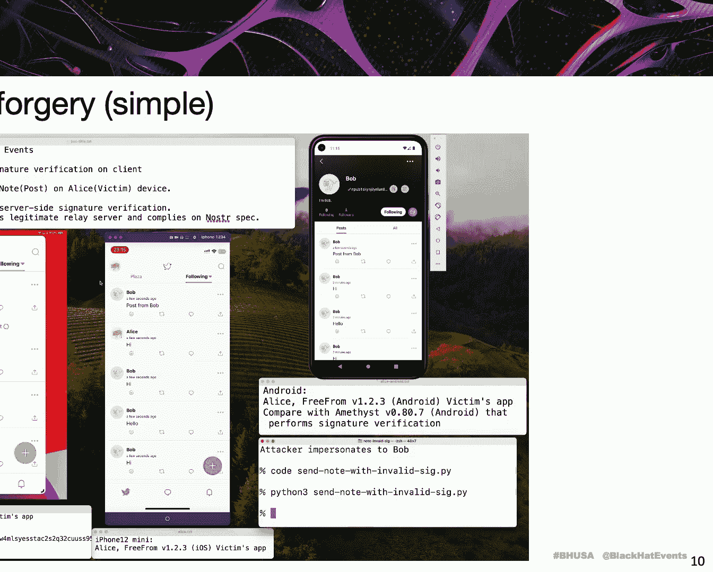
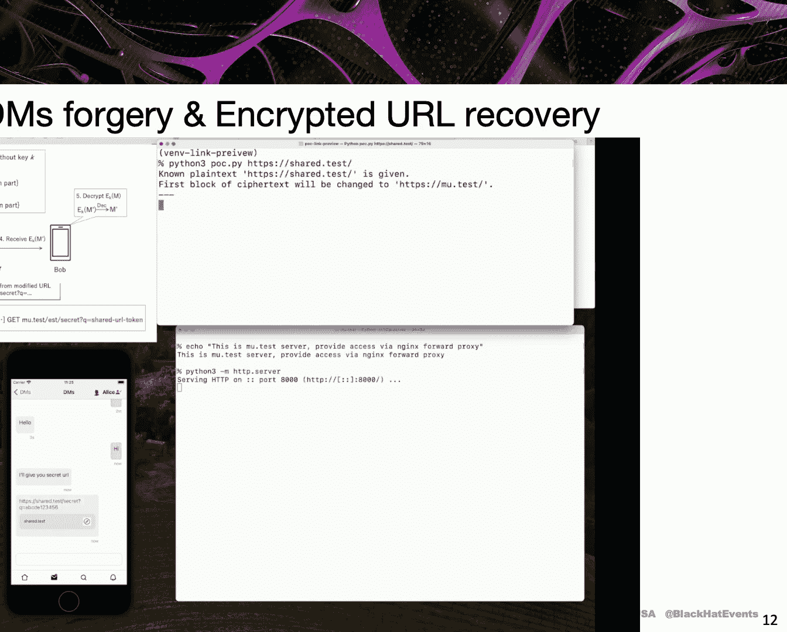
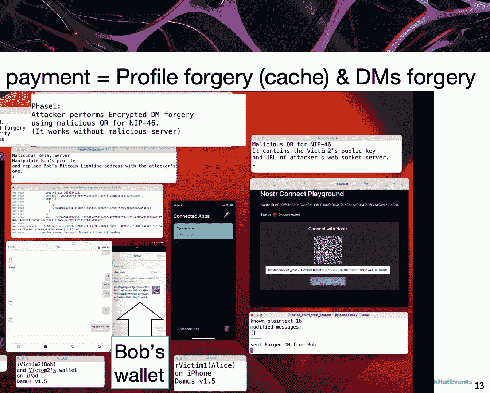
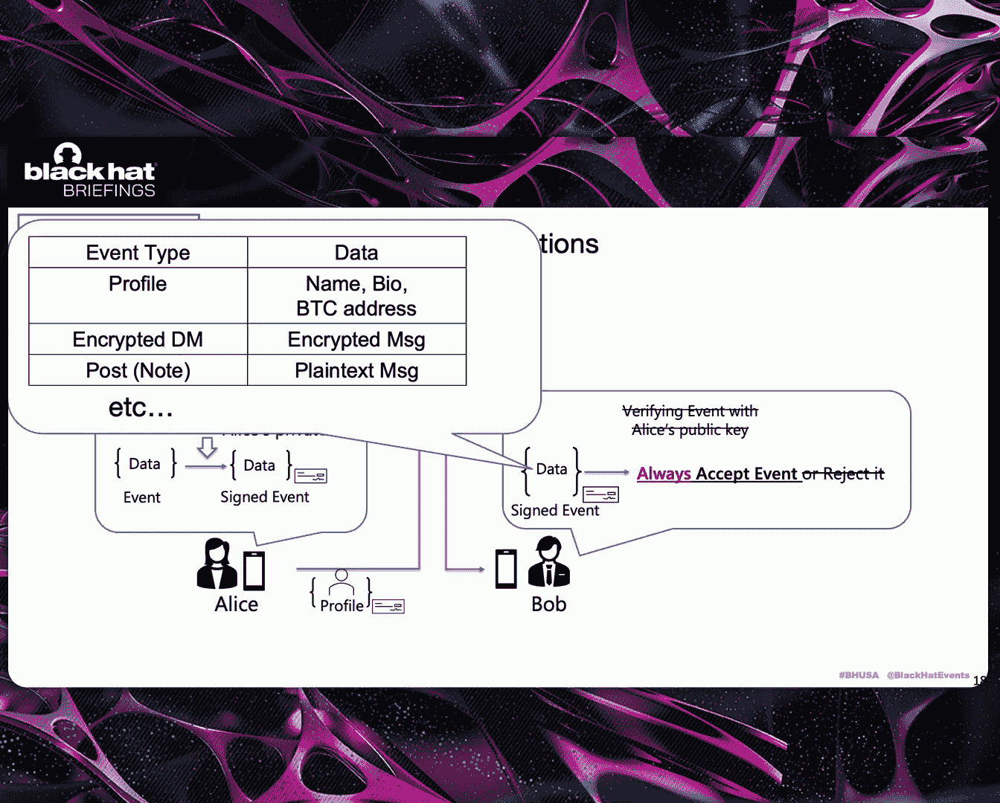
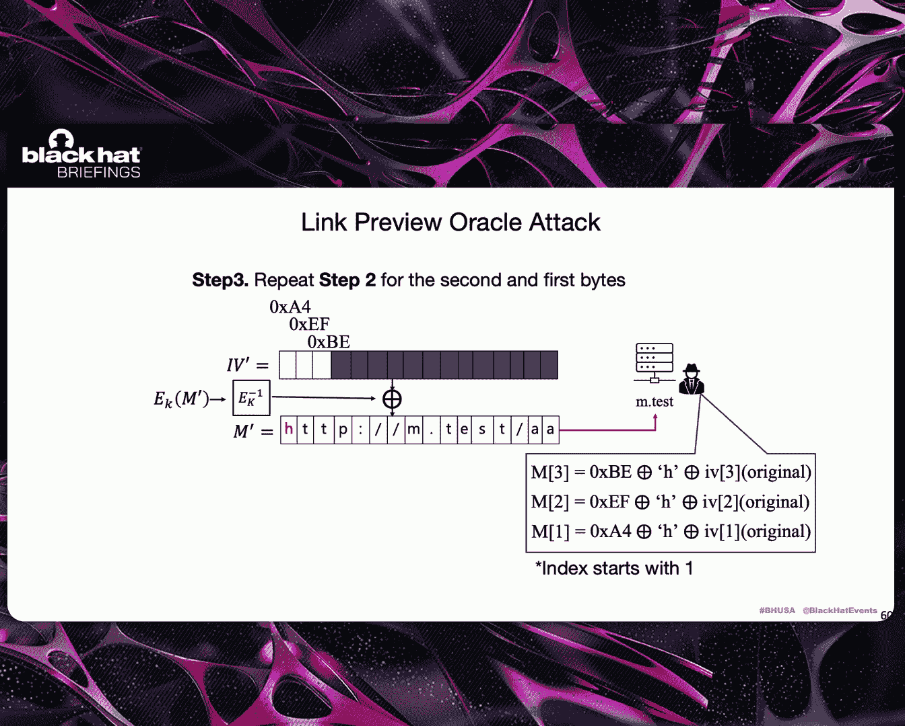

# 课程 01：Nostr 去中心化协议的实际攻击分析 🔓

在本课程中，我们将学习一个名为 Nostr 的去中心化、抗审查协议。我们将探讨其设计原理，并深入分析在实际客户端实现中发现的安全漏洞。这些漏洞并非理论上的，而是可以被实际利用的。我们将通过具体的攻击示例和代码片段，理解这些漏洞如何破坏数据的**完整性**、**机密性**和**可用性**。

---

## 背景介绍

中心化的社交媒体平台可以随时更改政策或审查内容。因此，出现了像 Mastodon、Bluesky 和 Nostr 这样的替代方案，它们旨在让用户控制自己的数据和身份。

本次研究聚焦于 Nostr，这是一个基于密码学的分布式社交网络协议。

分布式社交网络主要有两种模型：
*   **联邦模型**：例如 Mastodon，不同的服务器相互连接，但用户身份仍然锚定在特定服务器上。
*   **自托管模型**：例如 Nostr，用户持有自己的密钥，身份不由服务器拥有。服务器仅负责中继消息。

在 Nostr 模型中，信任的重心转移到了客户端验证上。这带来了自由，但也将所有责任转移给了用户。这引出了两个核心问题：
1.  在没有中心服务器的情况下，客户端能否正确验证消息？
2.  这种模型是否会带来新的攻击面？

我们通过深入研究 Nostr 的规范和客户端代码验证来回答这些问题。

---

## Nostr 协议概述

Nostr 是一个简单、开放、无中心服务器的协议。用户拥有私钥，公钥即其身份。目前有超过 110 万用户账户，任何人都可以运行中继服务器，用户可以选择应用商店中的任何客户端。

它支持以下功能：
*   公开帖子
*   个人资料
*   加密私信
*   小额支付
*   多设备签名


Nostr 规范包含一系列模块，旨在使不同的实现能够互操作。从密码学角度看，关键的规范包括：
*   **NIP-01**：定义了基础事件结构、中继和加密签名。
*   **NIP-04**：定义了使用 ECDH 密钥协商和 AES-CBC 加密的私信。
*   **NIP-46**：用于多设备签名，其加密结构与私信类似。
*   **NIP-57**：提供小额支付功能。



---

## 研究发现概览



我们的研究主要有三项贡献：
1.  我们分析了 56 个中继服务器和 9 个客户端（包括开源和专有软件），发现了 7 个漏洞，并演示了 8 种攻击手法。
2.  我们为每个漏洞构建了概念验证，并成功实施了破坏机密性、完整性和可用性的攻击。
3.  我们提出了缓解措施，并与开发者合作了两年多来修复这些问题。

我们将发现的漏洞分为三大类：
*   完整性破坏
*   加密私信的机密性破坏
*   小额支付劫持



这些都不是理论漏洞，而是可以实现实际攻击的。

---

## 攻击演示

以下是三种攻击的概念验证演示：

**1. 伪造 Nostr 事件**
攻击者可以轻易创建并广播伪造的事件。在演示中，伪造的事件成功出现在受害者的客户端屏幕上。

**2. 破坏加密私信的机密性**
攻击者可以篡改加密的私信内容。在演示中，攻击者将消息中的 URL 替换为包含自己服务器地址的恶意链接。当受害者客户端尝试预览该链接时，其中的秘密令牌（如认证令牌）就被发送到了攻击者的服务器。

**3. 劫持小额支付**
这是伪造事件攻击和篡改私信攻击的组合。攻击者拦截包含受害者比特币地址的个人资料事件，将其替换为自己的地址。当用户试图向受害者付款时，资金实际上被发送给了攻击者。

---

## 漏洞根源分析

要理解这些漏洞，我们需要从设计和实现两个层面来看。



**设计层面：**
*   协议视图密钥管理是一个重大问题。
*   像 AES-CBC 这样的加密模式选择也存在重大问题。

**实现层面：**
存在一些常见错误，包括：
*   跳过签名验证
*   不完整的验证逻辑
*   缓存验证违规

这些错误出现在不同开发者开发的不同客户端中。我们认为，部分原因是规范中某些部分不够清晰，导致不同客户端行为不一致，从而放大了安全风险。

---

## 具体漏洞剖析

上一节我们概述了攻击类型，本节我们将深入每个漏洞的具体实现细节。

### 1. 签名验证缺失

首先，我们来看看 Nostr 中签名验证的正常流程。
每个事件都应由作者的私钥签名。例如，Alice 使用她的私钥签名一个事件。Bob 收到后，应使用 Alice 的公钥验证该事件。

**核心问题在于：Nostr 规范并未强制要求中继服务器验证签名。**
一些中继服务器会进行验证，但这主要是为了防止垃圾信息，而非为了保护客户端。规范明确指出，服务器无需被信任。


因此，我们假设服务器不验证签名，事件直接从发送者中继到接收者。

以下是实际客户端实现中的一个简单示例，许多客户端甚至省略了签名检查：
```python
# 伪代码示例：缺少签名验证的客户端
def receive_event(event):
    # 许多客户端直接处理事件，跳过了 verify_signature(event) 步骤
    display_event(event)
```
这对于个人资料事件尤其危险，因为个人资料中可能包含用户的比特币地址。缺乏签名强制执行，使得恶意事件能够在网络中传播。

**小结：** 缺乏签名验证是一个简单但影响巨大的问题，它为多种攻击打开了大门。

---


### 2. 利用缓存绕过签名验证

接下来，我们看看另一种情况：客户端虽然实现了签名验证逻辑，但存在可被绕过的缺陷。我们以流行的 Nostr 客户端 `damus` 为例。

起初，`damus` 似乎有正确的签名验证逻辑。但经过分析，我们发现它在验证前会先检查缓存：
```python
# 伪代码：damus 的缓存检查逻辑
def verify_event(event):
    if event.id in cache and cache[event.id].verified:
        return True # 如果缓存中存在且已验证过，则直接返回真
    # 否则，执行标准的密码学签名验证
    return standard_crypto_verify(event)
```
攻击链可以总结如下：
1.  当事件不在缓存中时，`damus` 会进行严格的密码学验证。
2.  攻击者需要控制决策点，使验证函数在未经验证的情况下返回 `True`。
3.  攻击者通过注入一个具有伪造内容但**相同事件ID**的事件来实现这一点。事件ID是事件内容的哈希值。

**攻击步骤：**
1.  正常通信：Bob 收到 Alice 的真实事件 `Event_A`，其 ID 为 `ID_A`，内容包含 Alice 的比特币地址。
2.  攻击：攻击者创建一个伪造事件 `Event_A‘`，其内容被替换为攻击者的比特币地址，但**保持事件 ID `ID_A` 不变**（这意味着攻击者需要精心构造内容，使其哈希值与原来相同，这通常通过暴力碰撞实现，对于短文本是可行的）。
3.  当 Bob 收到这个伪造事件时，客户端在缓存中找到了 `ID_A`，并认为它已经过验证，于是直接接受了伪造的内容。

**小结：** 将缓存机制与验证逻辑错误地结合，可能导致签名验证被完全绕过。

---

### 3. 密文完整性破坏 (AES-CBC 问题)

在中心化平台中，即使密码学检查失败，服务器仍可能提供帮助。但在 Nostr 这种完全自托管的去中心化系统中，客户端必须在设备上自行检查所有内容。这对分布式社交网络的安全性提出了更高要求。

一个简单但严重的问题是加密私信的完整性。NIP-04 使用 ECDH 进行密钥交换，使用 AES-CBC 进行加密。但正如我们所见，许多客户端跳过了签名验证。这意味着私信只是经过 AES-CBC 加密，**没有任何完整性保护**。

攻击者可能想将消息 “Send Bob 1 BTC” 改为 “Send *Attacker* 1 BTC”。虽然他们没有共享密钥，但在 CBC 模式下，攻击者可以通过修改密文来操纵解密后的明文。

**CBC 模式的工作原理是：** 每个明文块在加密前会与前一个密文块进行异或操作。
攻击者翻转初始向量或前一个密文块中的某些位，可以导致解密出的对应明文块发生可预测的位翻转，而无需知道密钥。

**有两种利用方式：**
*   **随机前缀攻击**：攻击者无法控制修改结果，解密出的明文是乱码。
*   **非随机前缀攻击**：如果攻击者能控制或预测明文的前缀（例如固定的消息开头 “Hi, ”），他们就可以计算差异，从而注入特定消息。

关键在于如何在真实系统中获得或控制明文前缀。我们的解决方案是**跨协议攻击**。
例如，利用 Nostr 的 `NIP-46`（远程签名）协议。在该协议中，授权过程会建立一个会话并加密一些已知的元数据。攻击者可以从这个会话中获取到已知的明文和对应的密文，从而为攻击其他私信会话创造条件。

**本节要点：**
1.  必须使用认证加密或消息认证码来提供密文完整性。
2.  必须为不同协议使用不同的密钥。

---

### 4. 通过链接预览破坏机密性

在讨论具体攻击前，我们先了解链接预览功能。许多 Nostr 客户端支持自动链接预览，即当消息包含 URL 时，客户端会尝试获取该网页的元数据。

预览生成有两种方式：
*   **服务器端生成**：由客户端后台服务生成。
*   **客户端生成**：由接收者设备生成。



已知的问题是，接收者生成的预览可能泄露隐私，但这通常不直接破坏机密性。我们思考：这种行为是否能帮助攻击者恢复加密私信中的明文？

答案是肯定的。即使加密算法本身是强安全的，我们也可以利用**链接预览**作为“预言机”。

**攻击场景：** 私信中包含一个敏感 URL，例如会议邀请链接或云存储共享链接，其中包含秘密令牌。

**攻击步骤：**
1.  攻击者拦截加密私信。
2.  利用 CBC 的位翻转特性，篡改密文，使得解密后的 URL 域名部分指向攻击者控制的服务器（例如，将 `example.com/secret-token` 变为 `attacker.com/secret-token`）。
3.  受害者客户端解密消息后，尝试为这个 URL 生成预览，于是向 `attacker.com` 发起请求。
4.  攻击者的服务器收到请求，从而获得了 URL 中的秘密令牌。

**更进一步：恢复非 URL 明文**
如果攻击者想恢复消息中 URL 之外的普通文本怎么办？
假设攻击者知道消息以 “https” 开头，但不知道前三个字节的具体内容。他可以：
1.  通过翻转 IV 中的位，暴力猜测并强制解密后的第一个字节变为 ‘h’。
2.  观察受害者客户端是否向攻击者服务器发起 “http” 请求（因为解密后以 ‘h’ 开头，客户端可能错误地尝试将其作为链接预览）。
3.  重复此过程，依次猜测第二个、第三个字节，最终可以逐字节恢复出完整的明文前缀。

**本节要点：** 与密文完整性一样，客户端侧的链接预览功能可能泄露隐私信息，甚至帮助攻击者恢复加密消息内容。必须谨慎处理此类功能。

---

## 总结与启示

本节课我们一起学习了针对 Nostr 协议的深入安全分析，涵盖了密码学设计和实现缺陷。

**主要发现总结：**
1.  **去中心化放大了风险**：责任转移到客户端，但许多客户端未能履行验证职责。
2.  **实际攻击路径**：我们演示了如何伪造事件和资料、利用 CBC 模式篡改密文、通过链接预览窃取令牌和恢复明文。这些问题源于有缺陷的设计和实现。
3.  **强密码学并不足够**：我们的结果表明，仅靠强大的密码学算法是不够的，需要安全的协议设计、清晰的规范和正确的代码实现。

**如何设计更安全的去中心化系统：**
*   **清晰的规范**：规范必须明确规定**如何**以及**何时**进行签名验证，而不仅仅是“应该”验证。
*   **密钥分离**：客户端必须为消息、身份和远程签名等不同用途使用不同的密钥。
*   **零信任客户端**：客户端必须验证来自中继服务器的所有内容。协议应用密码学替代信任。
*   **升级挑战**：去中心化系统的更新比中心化系统更耗时，因为涉及众多独立的中继服务器和由不同社区开发的各种客户端实现。因此，从一开始就做好设计至关重要。

**最终结论：** 构建安全的去中心化系统，不仅需要强大的密码学基础，更需要良好的代码实践和审慎的密码学协议设计。