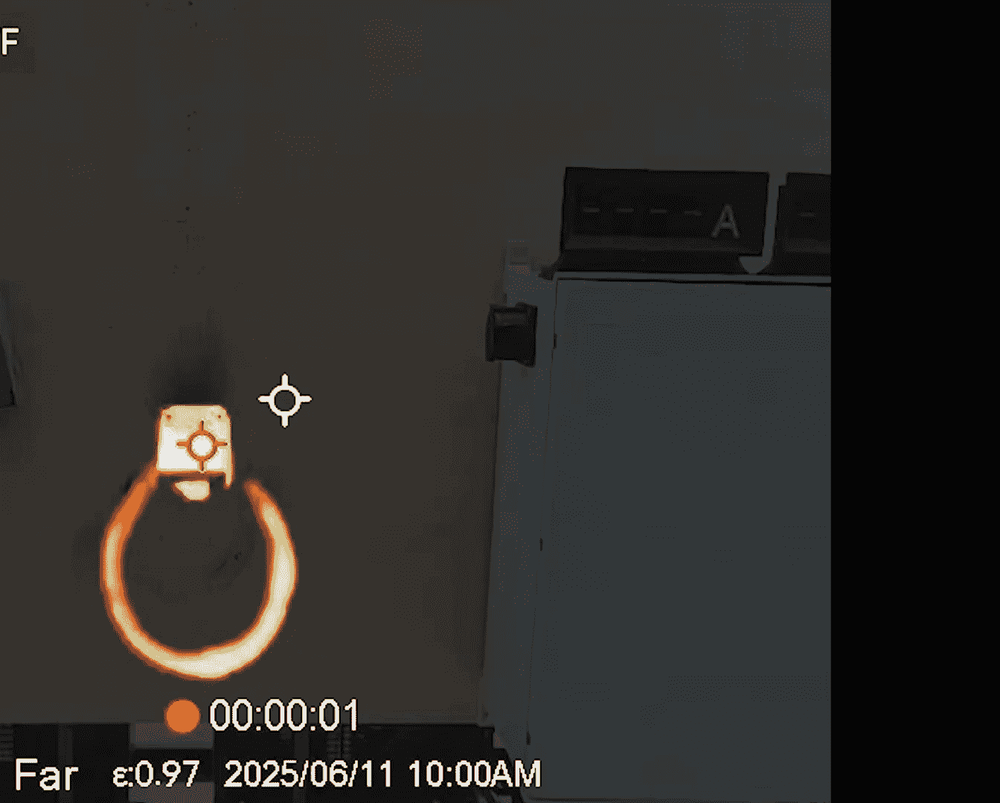

# 课程 4l6hsv8IlWE：电动汽车充电桩安全与防护失效调查 🔌⚡

在本课程中，我们将深入探讨电动汽车充电桩的安全与防护问题。我们将分析其攻击面，回顾在安全竞赛中发现的漏洞，并通过实验研究当充电桩被恶意控制时可能引发的物理安全风险。课程最后将讨论可行的缓解措施。

## 攻击面概览 🎯

上一节我们介绍了课程主题，本节中我们来看看电动汽车充电桩的典型攻击面。

电动汽车充电桩通常包含以下核心组件：
*   **主处理器**：运行操作系统（如Linux、Android或RTOS），负责用户界面、网络通信等主要子系统。
*   **辅助处理器**：通常负责控制电源开关和测量。
*   **多种外围设备与连接**：包括Wi-Fi、蓝牙、蜂窝网络、RFID读卡器、云连接等，共同构成了庞大的攻击面。

此外，充电桩通常配备移动应用程序。该应用程序用于配置Wi-Fi凭证（通过蓝牙传输给充电桩）、进行远程控制和遥测。对于安全研究人员而言，从分析应用程序入手是了解系统工作原理的有效途径。

## Pwn2Own竞赛中的发现 🏆

了解了攻击面后，我们来看看在实际安全竞赛中发现了哪些问题。以下是我们在2024至2025年Pwn2Own竞赛中观察到的一些关键结果和漏洞类别。

**关键发现：**
*   漏洞数量并未减少。
*   新增了“充电协议修改”类别，参赛者若能篡改充电桩与车辆间的通信协议，将获得额外奖励。去年有4支队伍成功实现了这一点。
*   新增了“充电接口直接入侵”类别，即通过充电枪的物理接口直接入侵充电桩。

**漏洞类型统计（CWE分类）：**
*   **CWE-121/122（缓冲区溢出）**：两年间共发现8-9个此类基础漏洞。
*   **其他高频漏洞**：包括身份验证绕过、证书问题、命令注入等。

总体而言，发现的漏洞级别较低，反映了行业整体安全状况不容乐观。

## 深入分析竞赛案例 🕵️♂️

上一节我们概述了竞赛中的发现，本节我们来深入剖析几个具体案例。

以下是几个具有代表性的漏洞实例：

1.  **特斯拉壁挂连接器漏洞**：攻击者使用树莓派和CAN控制器将固件降级到一个包含调试服务的旧版本。利用该调试服务获取Wi-Fi凭证后接入网络，再利用调试服务自身的全局缓冲区溢出漏洞（该设备无内存保护）实现远程代码执行。
    *   **核心问题**：`无内存保护机制`。
2.  **某品牌充电桩USB漏洞**：该设备侧面的塑料挡板下有一个USB接口。攻击者发现其USB设置包存在越界读取漏洞。代码仅检查缓冲区长度非零，但未检查最大长度。缓冲区后方恰好是关键函数指针，通过写入这些指针即可控制程序流，同样由于缺乏内存保护而实现远程代码执行。
    *   **核心代码逻辑**：`if(buffer_len != 0) { copy_without_bounds_check(); }`
3.  **某品牌充电桩RF卡漏洞**：设备附带的用于恢复出厂设置的RFID管理卡是MIFARE Classic 1K卡，极易克隆。更严重的是，此卡能重置**所有**同型号充电桩。重置后，在配对过程中可提取固件加密密钥，并利用一个未公开的固件更新功能，通过发送加密的JSON数据包来安装恶意固件。
4.  **某品牌充电桩云服务漏洞**：研究人员发现一个云服务漏洞，允许攻击者访问所有已连接的该品牌充电桩，并可能安装恶意固件。该漏洞修复耗时很长。

这些漏洞包括远程漏洞、本地漏洞乃至整个产品线被完全控制的漏洞。它们通常简单直接，无需利用漏洞链，且缺乏有效的缓解措施，令人担忧。

## 后续研究问题 ❓

在见证了Pwn2Own竞赛中的各种攻击后，我们提出了一系列更深入的研究问题。

我们已确认电动汽车充电桩存在广泛漏洞，攻击面多样，且充电协议可被篡改。同时，我们还需考虑电网和车辆电池本身所蕴含的巨大能量，这些都可能被恶意攻击者利用以制造危险。

**我们的研究问题如下：**
1.  在**未被入侵**的充电桩上，其内置的软件安全机制（安全基线）是什么？
2.  在**已被入侵**的充电桩上，是否存在独立于软件之外的次级硬件安全机制？如果软件被攻破，这些机制能否生效？
3.  如果缺乏次级保护，充电桩能否承受过载电流？会造成多大程度的损坏？损坏是否会超出设备外壳，影响周围环境，甚至对基础设施或人身安全构成威胁？

## 充电桩技术与测试方法 ⚙️

为了回答上述问题，我们首先需要了解相关技术并建立测试方法。

电动汽车充电桩和车辆遵循J1772标准，该标准规定了最高80安培的二级充电。充电枪上的黄色引脚是高压导电极，绿色是保护接地，还有两个控制信号：接近引导信号和**控制引导信号**。控制引导信号是一个1 kHz的脉宽调制信号，其**占空比**用于告知车辆当前允许的最大充电电流（标准规定10%占空比对应6安培，96%占空比对应80安培）。攻击者的目标就是最大化这个电流值。

典型的充电桩硬件架构包括：处理用户界面和通信的主处理器、负责底层功能（如控制导引信号生成）的辅助处理器、控制主电路通断的继电器、电流测量传感器和温度传感器等。辅助处理器通常也可通过功能丰富的接口（包括固件更新）进行访问，因此我们认为其与主处理器同样易受攻击。

我们的研究任务包括：
*   **任务一**：模拟攻击者，击败充电桩的软件安全机制。
*   **任务二**：让充电桩输出超出其设计规格的电流。

为此，我们构建了一个测试平台，使用电阻负载元件来模拟车辆，最大可提供27.5千瓦的负载。平台包含断路器、充电桩（被测设备）、负载银行控制器以及测量电压电流的仪器。我们使用多组不同功率的加热器来产生不同等级的测试电流。

为了统一测试8款不同设计的充电桩，我们采用了硬件修改的方法来“模拟被入侵”状态。我们通过逆向工程，定位到软件控制继电器的最终输出点（通常是处理器的一个引脚），然后切断这条线路，并将两端引到外部。这样，我们可以通过跳线恢复原状进行基线测试，也可以断开跳线，使软件安全机制失效，从而测试硬件是否具备独立的过流保护能力。

## 测试结果与分析 📊

上一节我们介绍了测试方法，本节中我们来看看具体的测试结果。

首先进行**未入侵状态（基线）测试**：缓慢提升电流，大多数充电桩能检测到过流状态并断开继电器停止充电。但有两款设备未能响应：其中一款进入了“寿命终止”状态（虽未继续恶化，但对用户无益）；另一款设备虽然其应用界面显示具备多种保护功能（如接地故障中断、继电器粘连检测等），但过流保护似乎未启用，可能是配置问题或默认关闭。

在**模拟入侵状态测试**中，我们移除了软件保护。测试视频集锦显示，所有充电桩在持续过载（约80安培）下均发生了严重故障：

**观察到的故障现象包括：**
*   **电缆过热与失效**：电缆成为最薄弱的环节。由于发热与电流的平方成正比（`P = I²R`），过载导致电缆温度急剧升高（超过350°F/177°C），足以造成烧伤、熔化电缆护套并将其从墙壁上熔脱。所有测试电缆均失效，或剧烈故障，或熔融、冒烟，无一可安全复用。
*   **电弧与爆炸**：电缆内部短路产生电弧，引燃设备内部产生的有毒且可燃的挥发气体，导致剧烈的爆炸和火焰喷发。
*   **内部电路损坏**：高电流窜入控制导引信号等低压电路，将其完全烧毁。至少三款充电桩出现类似损坏，这可能也会对连接的车辆造成损害。

**测试结论：** 所有受测充电桩在软件被控制后，均**缺乏有效的独立硬件安全机制**来防止这种危险的过载破坏。半数充电桩在1.5小时内失效，最快的在1小时内失效，其余的也在5.5小时内失效。

## 缓解措施与行业建议 🛡️

面对这些风险，用户和行业可以采取哪些措施呢？

**关于电路断路器**：常见的误解是断路器在电流超过额定值时会立即跳闸。实际上，断路器（特别是热磁式）的跳闸需要时间。对于典型的48安培充电桩，专业安装会使用60安培断路器（留有裕量），加上断路器本身的特性，可能导致充电桩在**41%的过载下持续运行**，或在短时间内承受近**双倍**的额定电流。环境温度、不当的断路器升级建议或用户自行升级以“未来验证”等行为，都会恶化这一情况。

**关于电缆管理**：
*   切勿将电缆盘绕在充电桩下方（火焰向上蔓延会加剧风险）。
*   充电时，确保电缆未盘绕且未接触易燃物。
*   较短的电缆相对更安全。
*   升级电缆可能只是将风险转移到下一个薄弱点。

**其他缓解建议**：
*   **用户层面**：将车辆端的充电电流限制设置为与充电桩额定值相同（如果车辆支持此功能）。
*   **购买选择**：考虑购买额定电流为80安培的充电桩，这样即使在入侵状态下达到最大电流，也在其设计范围内。但这类产品通常价格昂贵。
*   **高级保护**：使用特殊断路器（如ZS断路器或电子断路器），但成本高昂。

**根本解决方案在于制造商**：设备应实现**本质安全**，即使在软件被完全入侵的情况下也能防止危险过载。这需要通过独立的硬件安全机制来实现，例如：
*   在软件控制点之后，增加一个**硬件电流检测电路**。
*   该电路在检测到电流超过预设的硬件阈值（设定为设备最大额定值）时，直接**切断继电器**。
*   此安全系统应被锁定，一旦触发需断电才能复位，且软件无法干预。

一个简单的**保险丝**也能提供基础保护。这些硬件解决方案的成本并不高昂。制造商需要承担起责任，设计并内置这类无法被软件漏洞绕过的安全机制。

## 总结 📝

本节课中，我们一起学习了电动汽车充电桩的安全现状。

我们通过研究表明，当充电桩被入侵时，可能引发财产损失甚至人身伤害。尽管关于漏洞普遍性和可能性的讨论会继续，但风险确实存在且非零。

行业对漏洞的响应参差不齐，同时市场上不断涌现的新产品往往重复着相同的低级漏洞。在任何情况下，设备都不应持续输出数倍于其额定值的电流，这是一个严重的安全设计缺陷。

制造商不应仅仅依赖我们敦促其改善软件安全，而应主动采用**不受软件漏洞影响的、可被独立测试验证的硬件安全设计**。过去我们讨论漏洞影响时，可能忽略了最重要的一点：**你的房屋可能会起火**。

希望行业能正视这些问题并做出切实改进。我们已证明漏洞广泛存在，设备可被过载，行业亟需改变以提升安全水平。

---
**扩展阅读**：关于电动汽车充电桩攻击态势及更多技术细节，请参阅ZDI博客上的相关文章。