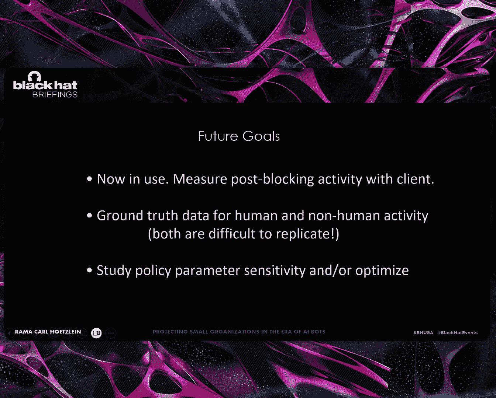

# 课程：AI机器人时代下小型组织的防护策略 [S5DJtN1FDYo] 🛡️

## 概述

在本节课中，我们将探讨在AI机器人流量日益增长的背景下，如何保护小型组织的网络服务器。我们将从一个具体的案例出发，分析问题根源，并介绍一种基于行为分析和子网聚合的非AI解决方案，以有效区分并过滤机器流量，保障服务器对人类用户的响应能力。

---

## 互联网流量的现状：机器成为主导

根据Imperva 2025年的《恶意机器人报告》，目前互联网上**51%的流量是非人类流量**。这意味着我们已经跨过一个阈值，机器成为了互联网的主要组成部分。

更严峻的是，根据2021年的一项观察，**高达80%的恶意机器人IP地址并未被列入流行的公开IP封锁列表**中。因为这些恶意IP地址变化非常迅速和频繁，传统的静态封锁列表难以跟上其变化速度。


上一节我们了解了全球性的流量趋势，接下来我们将视角缩小，看看这对一个具体的小型组织意味着什么。

---

## 案例研究：社区科学研究所的困境

我们合作的对象是社区科学研究所，这是一个位于纽约州中部的非营利公益组织，致力于促进科学素养、组织志愿者进行水质监测并提供经过认证的实验室分析服务。

该组织规模很小，只运行着少数几台服务器，并向公众免费提供所有数据。然而，他们发现其中一台服务器在20天内收到了**超过15万次页面点击**，平均每天超过7000次。

如此巨大的流量严重**降低了服务器的性能**，影响了已知用户和客户的正常访问。通过初步查看服务器日志，我们发现问题根源在于：尽管该数据库只包含纽约州中部的数据，但访问流量却来自**全世界各地**。这清楚地表明，有成千上万的机器在尝试抓取数据，很可能是用于训练AI模型的网络爬虫。

---

## 传统防护工具的局限性

在寻找解决方案时，我们评估了多种常见工具，但发现它们对于应对当前的AI爬虫浪潮效果有限。以下是我们的发现：

*   **速率限制**：效果不佳。我们发现大多数爬虫会主动遵守服务器设置的速率限制（例如，每分钟不超过20页），以避免被传统限流机制封锁。
*   **公开封锁列表**：如前所述，覆盖率很低，高达87%的恶意IP未被收录。
*   **`grep`命令搜索**：过于底层和繁琐，效率低下。
*   **`GoAccess`等日志分析工具**：它们提供的是摘要统计信息，**无法区分人类和机器流量**。例如，其报告明确注明“包含蜘蛛爬虫”。
*   **实时监控**：通常不分析历史日志模式，难以识别持续性的机械访问规律。
*   **基于AI的检测**：这类新技术通常需要大量优质的、已标注好“人类/机器”类别的训练数据，这对于许多组织来说是一个挑战。

因此，我们决定**采用一种非AI的方法来解决这个由AI引发的问题**。核心问题是：我们能否从访问模式上区分人类和机器？

---

## 核心理念：像声纳员一样“聆听”流量

想象一下潜艇里的声纳员，他通过聆听声音模式来区分敌方潜艇（有规律的机械声）和鲸鱼（自然、随机的声音）。我们借鉴了这个思路。

我们的方法是：**分析访问日志，寻找那些听起来像“机器”的、机械的、重复的模式**，并将其与更像人类的、随机且不可预测的访问模式区分开来。

为了“看到”这些模式，我们受到一篇2018年论文《Web服务器日志可视化》的启发，采用了**时间 vs. 主机IP** 的可视化方法。

---

## 可视化分析：一眼识别机器模式

我们将社区科学研究所20天的日志数据绘制成图：横轴是时间，纵轴是主机IP地址。

这种可视化方法有两个关键优势：
1.  **一览无余**：在一张图中呈现所有日志数据，没有任何统计摘要造成的信息隐藏。
2.  **人类直觉**：人类非常擅长从图像中识别模式。

观察生成的图像，那些形成**笔直横线、虚线或极其规律点阵**的IP，就是典型的机器访问模式——它们以固定的频率持续访问。而图像中那些**分散、随机、无规律**的点，则更可能来自人类用户。


我们还发现了更复杂的机械模式：它们虽然不像直线那样持续全天，但依然呈现出明显的规律性“声学特征”。我们的目标是识别**所有机械访问模式**，无论其意图是善意还是恶意。

---

## 引入人类行为指标进行评分

既然速率限制（“你有多快？”）效果有限，我们引入了来自人机交互领域的理念，从行为层面进行区分。

我们设计了一套评分算法，基于以下人类行为指标对IP地址进行每日评估：

*   **访问频率**：人类不会连续多天、每天长时间地访问同一个服务器。
*   **每日活跃时长**：大多数人每天工作不超过一定小时数，长时间持续访问很可疑。
*   **每日点击量**：对单个服务器而言，一天内浏览超过数百个页面极不寻常。

算法将这些指标加权组合，为每个IP计算一个“非人类”评分。公式的核心思想是：
`评分 = f(访问频率权重， 每日时长权重， 点击量权重)`

以下是应用不同过滤规则后的效果对比：

*   **应用“连续多日访问”过滤**：有效清除了那些在连续多天内长时间访问的IP。
*   **结合“每日时长”与“频率”过滤**：即“智能限流”，能捕捉那些在一天中特定时段规律访问的IP。
*   **应用“每日最大点击量”过滤**：清除那些试图在短时间内获取海量页面的IP。
*   **综合过滤结果**：将以上所有规则组合应用后，图像中的机械模式大部分被清除，流量图看起来更接近人类访问。

---

## 应对数据中心攻击：子网哈希聚合

然而，综合过滤后图像底部仍残留一些“虚线”模式。放大观察发现，这并非单个IP，而是**来自一个C类子网（如192.168.1.xxx）内的多个IP**，它们以一致的频率发起访问。这就是典型的**数据中心攻击**——利用整个IP段来分散请求，规避针对单个IP的检测。

为了自动化识别此类攻击，我们引入了**分层子网哈希聚合**算法：

1.  首先，对单个IP进行评分和过滤。
2.  然后，将IP地址**屏蔽掉最后一段**，聚合到C类子网级别，并对该子网的整体行为进行评分。
3.  进一步，**屏蔽掉最后两段**，聚合到B类子网级别并进行评分。
4.  最终，汇总所有级别的过滤结果，生成最终的封锁列表。

```python
# 算法概念性伪代码
def hierarchical_subnet_hashing_and_scoring(log_entries):
    # 1. IP级别评分
    ip_scores = score_individual_ips(log_entries)
    block_list_ip = filter_based_on_score(ip_scores)

    # 2. 聚合到C类子网并评分 (掩码 255.255.255.0)
    c_subnet_aggregates = aggregate_by_subnet(log_entries, mask=24)
    c_subnet_scores = score_subnets(c_subnet_aggregates)
    block_list_c = filter_based_on_score(c_subnet_scores)

    # 3. 聚合到B类子网并评分 (掩码 255.255.0.0)
    b_subnet_aggregates = aggregate_by_subnet(log_entries, mask=16)
    b_subnet_scores = score_subnets(b_subnet_aggregates)
    block_list_b = filter_based_on_score(b_subnet_scores)

    # 4. 合并去重，生成最小化封锁列表
    final_block_list = merge_and_minimize(block_list_ip, block_list_c, block_list_b)
    return final_block_list
```

应用子网封锁后，我们得到了最终结果。对比原始流量图（左）和过滤后流量图（右），机械访问模式被极大清除。

---

## 效果评估与政策考量

通过行为评分结合子网哈希，我们实现了**94%的流量削减**，远超单纯速率限制33%的效果。各阶段贡献如下：
*   速率限制：-33%
*   连续访问过滤：-9%
*   每日时长过滤：-9%
*   每日最大点击量过滤：-3%
*   C类子网封锁：-14%
*   B类子网封锁：-26%
*   **总削减：94%**

这对于小型组织至关重要。我们发现，**即使行为良好、遵守限速的AI爬虫，其绝对数量也足以压垮小型服务器**。我们的方法不分析具体请求内容（如SQL注入），而是解决**流量规模**这一根本问题。


从政策角度看，社区科学研究所的目标**不是保护数据**（数据本身免费公开），而是**确保服务器对人类用户保持响应**，并鼓励“人在回路”的数据使用方式。此外，准确的、剔除机器流量的访问统计，对于依赖“用户量”数据来申请资助的非营利组织也至关重要。

---

## 解决方案：LogGrip工具介绍

基于以上研究，我们开发了 **LogGrip**——一个轻量级开源工具，用于基于访问日志生成封锁列表和策略可视化。

**工具特点：**
*   **输入简单**：仅需服务器访问日志和一个定义日志格式及封锁策略的配置文件。
*   **处理快速**：处理15万条日志仅需不到一分钟。
*   **输出丰富**：一次性生成多种结果，包括：
    *   原始/过滤后流量可视化PNG图
    *   按IP和子网统计的指标CSV文件
    *   页面点击详情
    *   **可直接使用的分层封锁列表**（可用于`iptables`等）
*   **开源易用**：基于Apache 2.0许可证，命令行操作，无需图形界面。


**工具局限性：**
1.  **无法防御DDoS攻击**：图中出现的**贯穿整个IP范围的垂直短线**，代表分布式拒绝服务攻击。这种使用海量随机IP短时轰炸的方式，无法用封锁列表有效应对。
2.  **存在漏网的“温和”爬虫**：一些爬虫设计得非常像人类（低频、随机、在合理时间访问），可能无法被过滤。但从策略上讲，只要它们不影响服务器性能，允许其访问也可能是可接受的。


---




## 未来方向

*   **实际效果监测**：在客户生产环境中部署，测量封锁后的实际影响。
*   **获取基准数据**：构建“人类”和“机器”流量的基准数据集用于更精确的验证和优化，这目前很有挑战性。
*   **策略参数优化**：研究12个策略参数的敏感性，并探索（在基准数据支持下）使用机器学习进行自动优化。
*   **增强功能**：集成地理围栏信息、更深入分析请求内容等，以提供更精细的过滤能力。

---

## 总结

本节课中，我们一起学习了如何在AI机器人主导流量的时代保护小型组织。我们认识到，即使“行为良好”的AI爬虫，其庞大数量也会对资源有限的小型服务器构成威胁。通过**结合人类行为指标评分**和**分层子网哈希聚合**的方法，我们可以有效区分并过滤机械访问模式，显著降低非人类流量（本案例中达94%），从而保障服务器对人类用户的可用性和响应性。最后，我们介绍了实现这一理念的**LogGrip工具**，它提供了一种低成本、易用且开源的实践方案。

---
**（注：文中的视频演示、问答环节及具体命令行操作细节已根据要求整合或简化到上述教程正文中，未单独列出。）**