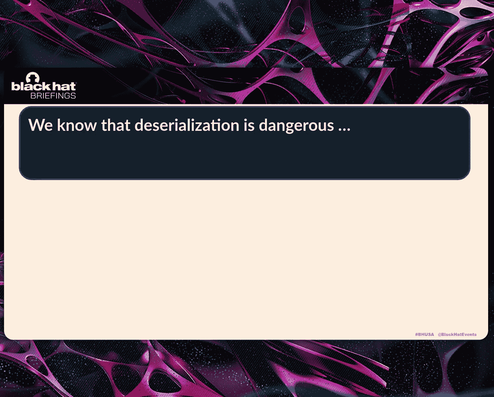
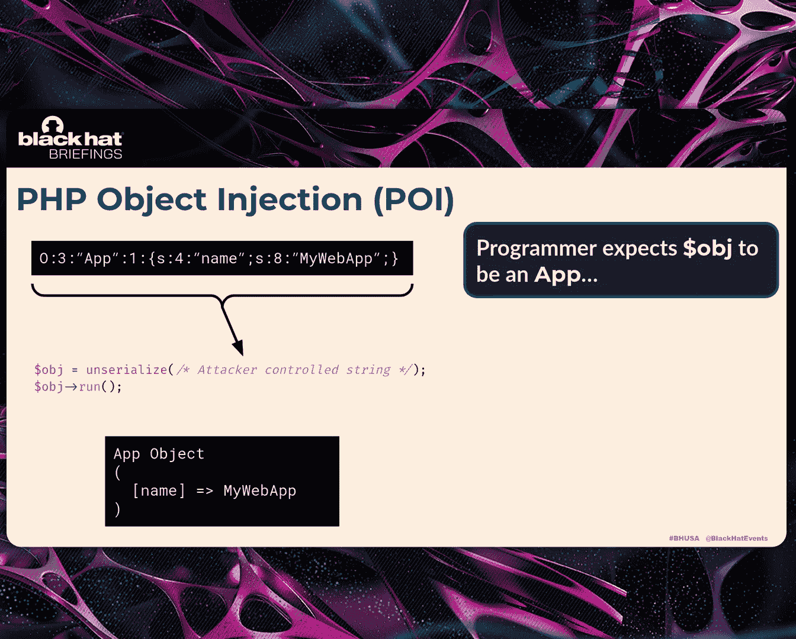
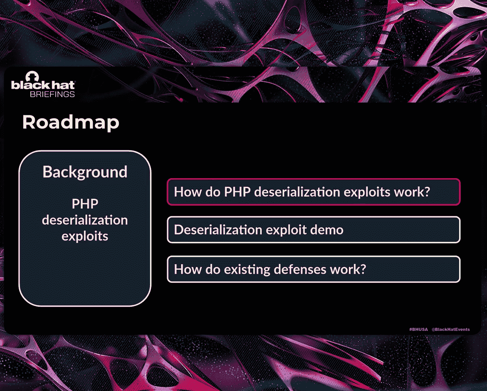
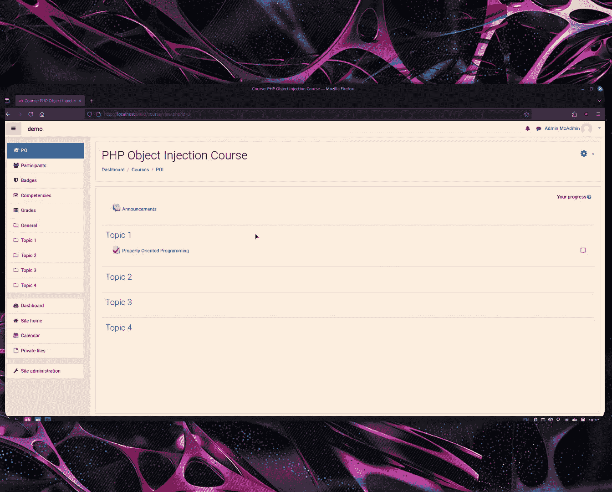
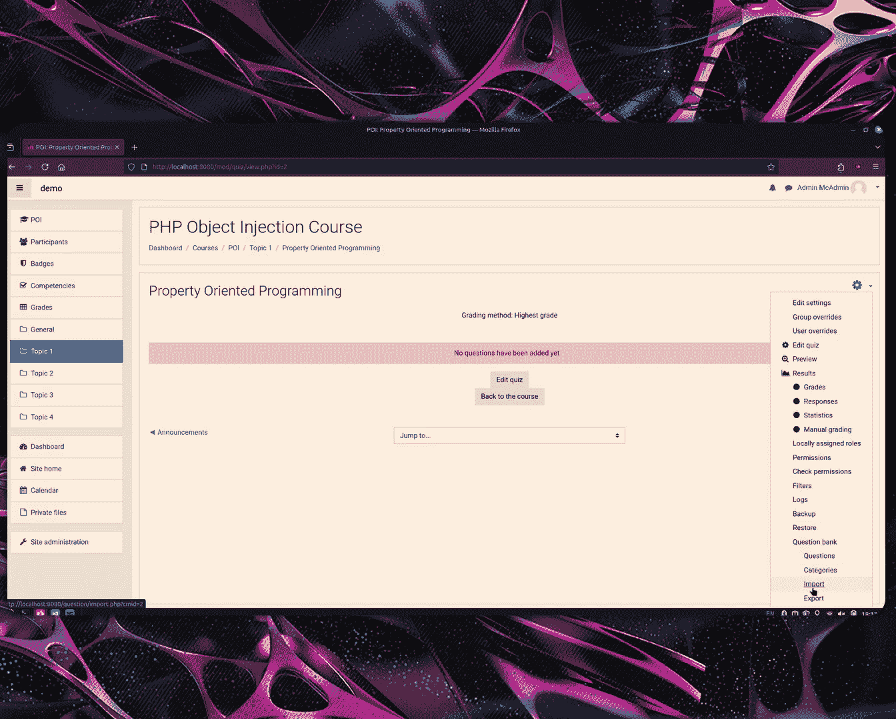
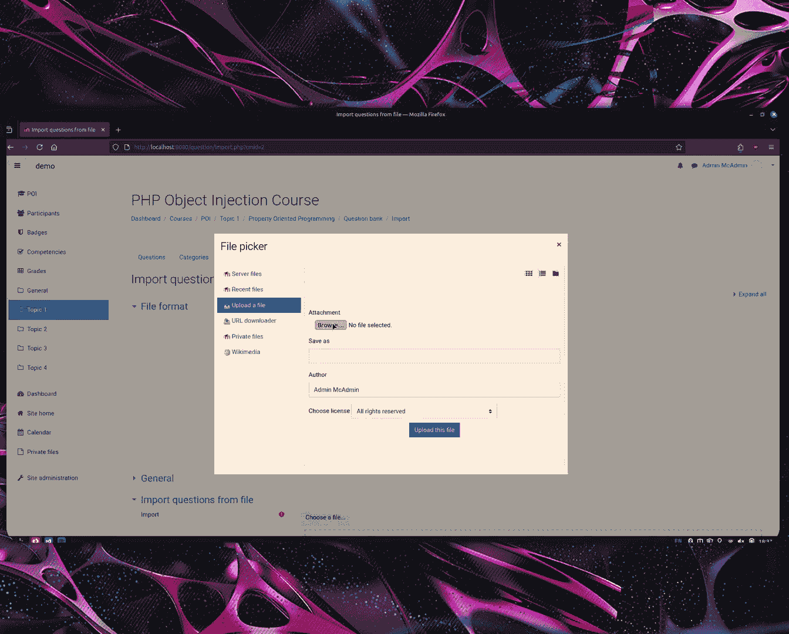
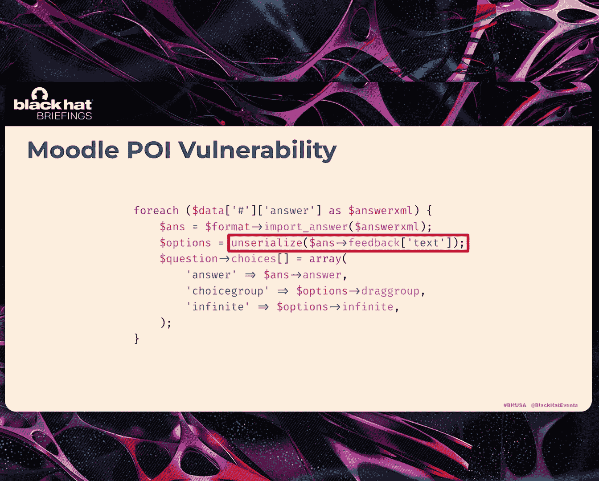
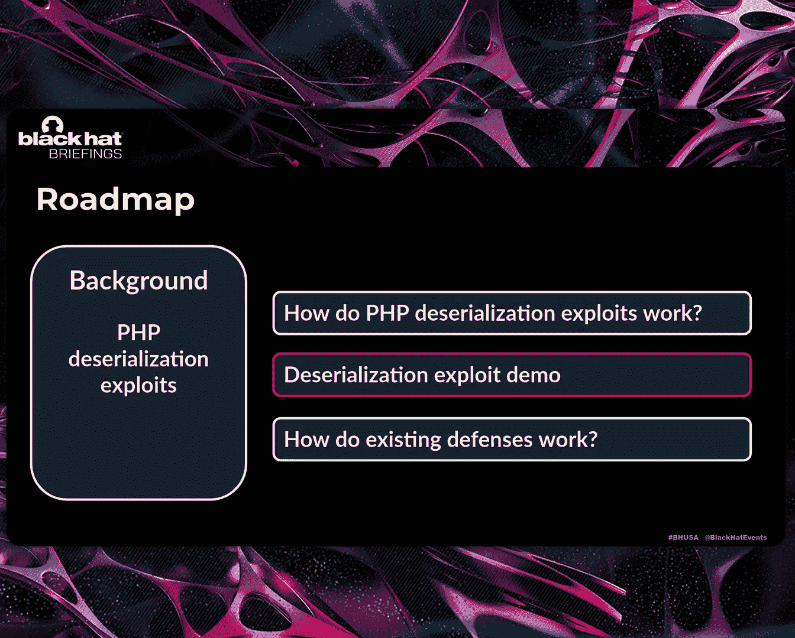
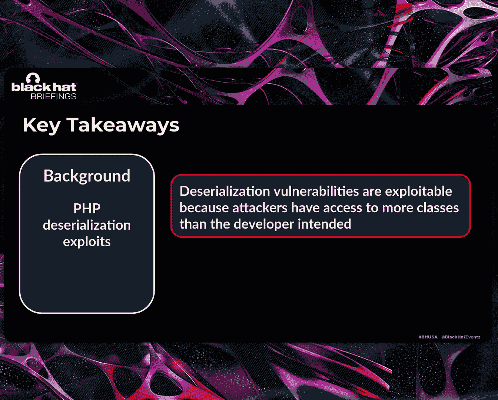

# QUACK： Hindering Deserialization Attacks via Static Duck Typing [hrtVuYfswCg]

Hello， thank you everyone， for being here with us at the last briefing session。

The title of our talk today is Quack hindering digitalization of attacks via stack typing。

So let's start off with some introductions。I'm Neil， I'm a PhD student at Brown University。

 I do research in system security， including program analysis。

 speculative execution attacks and more， and I'm presenting today with Andreas。😊，Hi I'm Andreas。

 I'm a PhD student at Columbia University。And like Neo my research applies program analysis techniques。

 techniques to solve security problems， and this presentation today will be an example of that。

 but this work was done collaboratively with Ynive who led this work but can't be here today and our advisors Vaciilis and Zhufeng。

So over the years， we've seen numerous talks about the dangers of decalization within our applications and passing untrusted inputs to them。

But what we'll notice is that many of the talks with few exceptions are about attacks。

 and our defensive advice tends to be a warning to developers not to do this。

 resulting in CVEs over the years regardless。And so。

We set out to design a mitigation that can be applied as a defense in depth to help prevent the exploitation of these attacks。

 and this resulted in a system that we called quack。

 specifically implemented to solve this problem in PhP applications。

 which we'll use throughout this presentation。And it was published in an academic venue called NDSS。

And so the goals for our talk today are to one， introduce quack to the security community and try to help it escape the lab and be put to more practical uses。

And to just continue to raise awareness about the risks of deserilization and attacks and hopefully give you a new way of thinking about how they might be mitigated and defended。

So to get into the details of what quack is and how it works。

 we'll begin with some background on how these PhP decsialization attacks work。

And then we'll get into quack and we'll describe how it uses static program analysis techniques to harden applications against these attacks。

 and then we'll end with some takeaways about where quack can go and the future of deselilization exploits。

Cool so let's start off with the exploits。So most people here have probably at least heard about decentralization vulnerabilities。

 There are still a pretty common type of vulnerability， muscu CV is issued every year。

 These are just some recent examples of PhP decentsralization vulnerabilities。

 which is what quag is concerned with。So PhP provides this function called unseized。

 takes in a string representing a serialized object。

 and then it just reconstructs the object and returns it back to the running program。

And as you can see at the bottom， there's a big red warning that at some point says that a malicious user may be able to exploit this。

So let's assume we have a PhP application， has a call to unseize somewhere。

 and the input to it comes， ce data coming from the user。

And let's say that when the programme wrote this obligation。

 they expected this culture and serialized to return an object of this class called app。

And this would look something like ways。So at the top you can see what the input string would look like。

 you don't need to worry about the exact syntax of it。

 the important part is that it encodes information about the type of the object and its properties。

So when this is， this runs with this input， it would create something like the object at the bottom。

 So it would be of type up and with one property with the value my web app。

However， if this input is controlled by that tier， they can first of all。

 change the properties of the decLized object， so for example。

 they could just change the value to some different value。But beyond that。

 they control the whole type of the decized object。

So instead of decentizing the type of the object that the developer intended， they can just。

Make the app visual realizeize a completely different type。And they can even go a step beyond that。

 and they can actually cause it to dissize a whole object hierarchy consisting of nested objects by just setting the properties of other objects to new objects so they can dissize a bunch of different objects。

However， their actual goal is not to just deserralize and inject random objects in their run time。

 They want to actually divert control flow and execute something mal issuesious。

 so let's see how the ability of injecting arbitrary objects allows them to do that。

So continuing with this application that Neil's introduced。

 imagine that it also has a class shown on the screen named command Executor， which has。Two very。

 very convenient properties for an attacker。One， it has a method that directly overlaps with a method that's called on the decentsalized object。

And two， it has a trivially malicious implementation such that an attacker that controls the command property of this object invokes system on these objects。

嗯。And so when an attacker provides a string like this。

 the attacker achieves their goal of invoking some new method that the programmer did not intend and executing some malicious functionality。

 but this is quite a contrived example and trivially exploitable if it exists in the application。

So making this one step more realistic， imagine that this run method doesn't exist。

 there's no direct overlap with something that is invoked on the decalized object。

 What is the attacker to do Well PhP has a feature named magicic methods。

which are methods that begin with a double underscore and have special purposes that are automatically invoked in certain circumstances in this case。

 the wakeup method is invoked automatically when an object that invokes this method is decialized and other such useful magic methods。

Will be called when the object is destroyed or when it's convertedver to a string。

And so these are useful for an attacker to identify locations and events and invoke new methods。

But still， this class has a pretty trivial trivially useful for an attack or implementation of this magic method that probably won't exist in a real application。

And so making this again， one step more realistic， what we are more likely to see are classes that implement these magic methods。

 but with some more realistic limitation that doesn't directly hand an attacker the ability to implement calls to system。

So what is an attacker to do in this scenario and how does the PhP Gization exploit proceed from here？

The technique that's been used for years is called property Oriented programming or P。And。

The general idea here is that the attacker will instantiate or create a string that when Deized creates some top level object that is strategically chosen because it has a magic method that will begin executing as the attacker needs it to。

And then the attacker will nest objects within the properties of this top level object that are chosen such that their methods are executed in sequence after the the initial top level magic method is。

 and this kicks off a chain of attacker chosen functions that will eventually reach a malicious function of the attackers's choosing。

And this is a high level explanation I'm about to illustrate it with an example， so if this。

 it's not clicking right now， don't worry。But we've known about this technique since at least 2010 in a black hat talk by Stean Esser。

So again， just to illustrate this。We've taken some classes from an application with known or with a real CV that is exploitable with a decserilization attack。

And we'll step through an example of how this pop chain would work。And so。

Each box here represents a class within or a small subset of classes within this application。

 and within one of them， there is a method that has a vulnerable call to unseerialize。

The programmer really only intended for one class to be decalized at this program point。

 and that's this program highlighted on your screen。

And every other class within the application should not be represented in the serialized string。

But the attacker is able to recognize that there's another class in the application that has a useful method for them。

 it's this method named current。And。Within the implementation of this method。

 it invokes some callback that the attacker could potentially set for themselves with some argument that the attacker can control as well。

 The problem here is that。This current method isn't directly invocable by the attacker。

 it's not a magic method and there isn't a convenient invocation of current on the DCLized object。

 so the attacker's question is how do I invoke that method and what they do is they'll strategically identify some other classes within the application。

And。Create a serialized string that encodes one of these classes that has a magic method。

Like this lock class that has a destruct and then set the properties of them。Initial object。To。

Objects of types of these other classes。And invoke the methods of those classes through the deization process after that destruct is invoked。

 eventually reaching the current method with attacker controlled values， invoking a callback。

 hear that system with the command of the attackers choosing。嗯。

And so the key takeaway here is not necessarily how this works。

 but that the attacker is able to pull off this attack by having access to more classes than the programmer intended to be instantiated at this deserilization point。

Cool， so now let's go and take a look at what Andreas just explained。

 But let's see it in an actual demo。So the what I just described is a slightly simplified version of an exploit for a real C against an application called Moodle is basically like an in learning platform。

And it contains thisnipped， as you can see there's a call to unseize and this is the vulnerable part and basically part it's in a part of the code base where a user can upload an XML and then a field of that XML is a serialized object that's going to get passed to this unseerized call。

 So let's see how that's gonna work。😊，So。呃。是。搞好。

对。So first， let's take a look at the actual X XML that contains the exploit。

It's very similar to what Andrea showed。 It's slightly more complicated。

 There's just a few more classes， but the basic idea of how it works is the same。 And as you can see。

 the attacker has set the call back to be called to system。 and then the arguments to it。

 they're gonna just echo something nice。So we have running instance of the model application。

So the way the vulnerability is in a part of the code where the user can upload a quiz。

So we just select the vulnerable formats and then。

Upload the XMl file we just looked at。And now when we click import。

 the exploit chain Andreas described should run， and if it draws successfully。

 we should see something printed on the screen。And indeed， as you can see。

 the exploit runs successfully and it printed a nice logo。

嗯。so。We've seen how the attacks work， whatever the abilities work。

 so now let's talk about mitigations。

There's a few different ways recommended ways to mitigate these types of attacks first one is to just not use unseerize and instead use a s representation like JSO to store your data and this kind of work pretty well but it only works if you want to store simple data like array array and primitive types and it doesn't really work pretty well if you actually want to store complex PhP objects。

Another recommendation is to ensure the integrity of the serial data using cryptographic caches。😊。

Again， again， this can be a good solution if the application itself produce data， however。

 again that's not always the case。And the last recommendation actually is provided by the un serialized function itself。

 and it's an optional argument you can pass to it called All classes。😊。

And the way it works is it takes in a list of class names and when that specific call to answerize happens。

 PhP will only dissize objects if there are instances of one of these classes that were provided to allow classes and if it encounters a different object it's just going to replace it with a duming object that has no methods and no properties。

So if we go back to our little example where we assume the developer wanted to only visualize an object of the app class。

This time they provide the allowed class argument and they set the list to only class。

 so the attacker's input that was trying to decize a different type of object is not going to get instantiated anymore。

 so direct is not going to work because no method calls will happen。And in this specific instance。

 eventually， the application we will crash because there's gonna be a method inro on it。

 like the run method， which doesn't exist on the dummy object that was created。 But still。

 the attack exploit is gonna be prevented。Now， unfortunately。

 even even though this mitigation works pretty well。

 as long as you provide a small set with only the classes you wanted to digitalize。

It's not really used very much。 We found that only around 0。

1% of calls to un serialializing Github repositor is even use this argument。

 there's probably two main reasons why。 first of all。

 developers probably are just not aware of the dangers of civilizationization how they can be exploitd。

The second reason is that it's probably pretty tedious to manually go through your code。

 go through every single culture and serial and figure out what classes you actually meant to this serialise。

 especially if you've already written your application and you weren't aware of this。

 It's very hard to go back and figure out what you meant to do。

So there's two main takeaways we want you to remember from all these first is that these types of vulnerabilities are exploitable because attackers have access to and can create objects of more classes than what the developer actually intended。

And second， that there are some mitigations， but they either don't always apply or are not used very much。

Okay， so let's get into what quack is and how it works。And we'll begin with its overall design goal。

So after studying how these attacks work and the existing landscape of mitigations for them。

What we decided was that if we could build a system that could automatically infer that programmer's intent for the classes that should be allowed to be decialized at a given point。

 we'd be able to restrict the application using that allowed classes argument to break these exploits that the attacker is using in Pchains。

Now inferring a programmer's intent perfectly is a challenging to impossible task。

 but what we do instead is try to use program analysis techniques to learn about what this programmer may have intended through the way the details object is used。

So at a high level， what CC does is given an application with some set of classes declared within it。

It first determines a set of the available classes that are loaded at that decsialization point or could be loaded intuitivetuly。

 this is effectively the classes that are included in all the files that are part of aninced statement within the points in the program that this unseerialized is invoked it's a bit more complicated than that because of dynamic nature of loading and PhP。

 but that's the idea。Then quack will statically analyze the program and observe how the object。

 the DCized object is used within the program to infer a set of possible classes that the programmer may have intended the object to represent。

And then Cck will take the intersection of those two sets。

 leaving just a set of the classes that are candidates to pass as allowed classes to restrict the behavior of that unseeralized call。

And as a system crack looks like this， you input the PHP application source code。

 it analyzes it in two passes to create these two sets。

 and then it will output a set that can be passed as allowed classes。And as an implementation detail。

 Quack is built on the J Sta program analysis framework。

 which if anyone in the audience does program analysis， you may be familiar with。

Now let's look at some details about how quaAG actually works。

 so as we mentioned the first thing Quag needs to do is identify the set of available classes at each unseerialized call by available we mean the classes that can be imported at that specific point in the program so to do that QuaAG starts by analyzing the file that includes the actual call to un serialerize it adds all the classes included in that file to the set of available classes and then it visits all the files that are included by the current file adds the classes defined in those to the set as well and just continues doing that recursively until there are no more files to visit。

After doing that， it goes back to the original file， and then it does the same process but backwards。

 meaning that it visits the files that themselves include the current file。

And add the add the classes are defining those to the set as well。

 And the intuition behind this last part is that we could have reached un serialized starting from many of these files。

 So we have to consider all the classes defining these available as well。

Cllouds loading in PhP is slightly more complicated than this。

 There's something called autoloading where clouds can be imported without explicitly being included in the file。

 but Quack takes that into consideration as well。So for the next one component。

 Quaag needs to figure out the possible types of the object based on how it's used in the code。

To do that， it's based on a concept calledduct typing。

 which is a concept in dynamic languages that basically says that an object is of a given type。

 if it has the methodsho and properties that are required by that type。So in this simple example。

 we have here， there's there's an object called An， and there's two method im locations on it。

 swim and fly。And what duck typing tells us is that this animal object can only be used as a type duck because duck is the only class here that actually defines both of these methods。

So the way Quack works is it static analyzes the source code of the application。

 sees how the object is being used， and it collects evidence about what its possible types are by using typing inference rules that are based on thisduct typing concept。

So let's take a look at some examples of those rules。First， basically the example we just saw。

 so in this case quag would look at the first use of the DCized object。

 it would say that this can either be of type quag or whale because both of these classes define the swimming method。

Then it's going to take a look at the second use， it's going to see that only the D class has the flying method and because both of these uses were on the same variable。

 it's going to say take the intersection of them and it's going to say the only possible class that should be allowed to be decized here is the class D。

Quag also looks at property accesses on the object。

 same concept as before here is' gonna look that the federal color properties accessed on the DCLase object It's gonna say that only the Dg method has that。

 So these objects should be of type D as well。Quag also looks at whether the object is being passed as an argument to function calls and deduces the type of the object from that as well。

 So here the object is being passed to that function， which has a type annotation。

 So Qua can just say this again is of type deck if there was no type annotation。

 Quag would just continue looking at the code inside the body of the function and collect more evidence for the use of the object inside that as well。

And our final example， Quack takes into consideration known PhP operators that indicate type information。

 for example， here is going to see that the object is passed to the instance of operator and it's going to say its type should be dark because that's a type on the other side of the operator。

And these are just a few examples of our rules。 We have a bunch more rules in the paper。

 which you can go to check out if you're interested。

Now beyond just looking at the type of the othermost object。

 Quag also takes into consideration any possible nested objects that could be set as properties of other objects。

 So in this case here quagg would look at the first two uses of the digitized object So it's there's gonna be a method colon it and the property access So it's gonna say these object is of type human because that's the only class that defines this method in poverty。

 but then it's also going see that there's a method call on one of the objects' properties So it's going to collect more type of formation about the type of that property。

 So it's gonna say that should be of type dog。So the final set of possible classes here contains both human and dog because both of these needs need to be part of allowed classes when we call unsealize。

pTo put it all together。Quak has collected a set of developed classes and the set of possible classes based on typing inference rules。

It's just going to take their intersection and say that this is the final set of a lot of classes。

So we ran quack on the mill application we looked at earlier。

 as you can see the serialized object is being used to ice， there's two property accesses in it。

So when we run run quag， this is part of its actual output。 On the left。

 you can see the type evidence it has collected based on the type inference rules。

 There's one for each property access。 As you can see。

 there's only one class that defines both of these properties。

 And that class is also part of the available classes set。

So Quaagul just set the allowed class argument to only that one single class that contains both properties。

Okay， and so to see quack defending this Moodle CV in action， let's return to it。

 So here's the exploited instance。

He'll reset it。And now we'll come， and we'll take a look at the。

This output that after analyzing this application， quas， quack has produced an output for us。

 which Nes。呃。Neil has showed us。And it looks like this。

 it's a JSON file that tells us that within this application。

 there is a file that has a call to on serialized on line 93。

Whose type should be restricted to the Q type DDWTOSOS underscore choice。

And so we can take this type now， come into the running instance of this application。

And we will go and modify that call to unseerize and update it to allowed classes。Let's do that。

 Hopefully I remember where we're going。Okay， on line 93。

You'll see this vulnerable call to unseerialize that quack has identified。

And we will add ourselves this allowed classes' optional parameter。

Now you'll notice I'm manually making this change like quack has recommended。

We could also add a post processing pass A the fact quack to analyze AST and make these adjustments itself as well。

Let me just make sure the prehees are matching。 And I think we're good。 We'll save this。

 need to add cliff。 thank you。Yes。Okay， we'll get the class of that type， save it。

And now when we come back into our application。We will load the exact same exploit file。Sorry。

and before when the application was vulnerable， when this exploit file executes， it executes system。

 and we saw the ASCIR of the black hat logo， what we expect to see this time is for quaAQ to have prevented the execution of that system command and the rest of the XML file will parse and the functionality here is that it imports a quiz into this learning platform。

And so we import， and we do not see that ASIA print out， the exploit chain did not execute。

And now we can learn from this quiz cool。

嗯。No。So let's close out with some takeaways。First of all， how effective is quag。

 we evaluated quag only 11 more applications other than the one we just looked at that had actual Cs and among them。

 they had 15 total vulnerable calls to unseeralize。

 and we also run an automated exploit generation tool that I was able to generate x rays for five of the Cs。

😊，And then when running quag and applying the allowed Tra set that it deuced。

 we were able to block all methods for 12 out of these 15 vulnerable calls。

 what this translates to effectively is that there were no classes that should be allowed for these 12 calls so the developer didn't actually even need to use uncize and overall across all 15 calls we able to block 97% of the methods that the attacker had available to them。

And the automated exploit generation tool was no longer able to generate any x rays for the 5 Cs。

 It used to be able to。Okay， so how can quack still be improved？

Well crack improvements I think fall into two broad categories。

 one is improvements to the correctness of its outputs。

 as with any program analysis tool and especially those created as research prototypes to demonstrate an idea there are some warts to smooth over PhP is a large language of many features and we don't necessarily know like which features we still fail to to accommodate and so what we really hope from this talk is to build perhaps an interested community of folks who have problems and real PhP code that could be protected by this and we'd love to get your feedback on if you try this on code that you care about。

 does it work does it not please raise some issues on our GiHub repository so we can identify those gaps in what would in the implementation right now。

And then this other category is usability， we would love to get to a point one day in like an ideal deployment where CRrarack could be perhaps directly integrated into an ID such that as a developer is typing on serialize and using the object Crarack can make on the flyer recommendations right at that point so that the developer locks down their application before it's deployed and has the opportunity to be exploited。

And so where does this leave us with decserilization does quack solve the problem entirely。

 What we've shown today is quack can effectively restrict the number of classes available to an attacker during in an exploit chain。

What crackrack is not designed to do and cannot do is prevent what we'll call data only attacks。

Wwhich would be one where the attacker can perfectly respect the classes of the intended programmer。

 but manipulate the properties in a way that violates security issues or has security issues。

 simple example might be a user class that is admin property and if an attacker creates an object of this and sets that admin to true。

 that's clearly a security problem that quack can't necessarily mitigate here。

So Kck kind of joins a set of mitigations for these types of attacks that has a use case but leaves us with us still needing to be deliberate about what our use cases are when we write our applications。

 either use case one that an HMAC could apply to， is it one where we can restrict the set of classes within available to an attacker？

AndSo again， just we're trying to add a defense and depth tool here to help manage these problems。

I think another quick question is， so we've shown an implementation for PP。

 Can this work for other languages And while we didn't study the。

 the desization As of these other languages as closely as we did with PP。

 our understanding is Java and C sharpp have similar。

Deserialization APIs that could allow quack to like the idea behind quack to extend to。 And in fact。

 at the exact same venue where we first published quack， a very similar paper was published。

 kind of demonstrating this idea for job applications。 So I think there is some。

Evidence there that we can extend there， buty Python's pickle module in particular is notably much more expressive than what pickle than what PhHP provides。

 and so a crack technique would not apply to a decsalization interface like that。

So that concludes our presentation introducing Queck。

 what we've spoken about today are how these deselization exploits work。

 and in particular pointing out that they tend to use more classes than the programme are intended。

We've introduced quack and shown how it works by trying to infer that programmer's intent to identify just the classes that are needed through the static program analysis techniques that we call static duct typing。

And again， if nothing else， we hope to leave you， especially developers with the reminder that you should always be deliberate about your calls to unseerialize。

 and if you are using them， please think about using allowed classes and quack and help identify the classes to set that policy。

If you're interested， please check out our GitthHub and further our paper。嗯。

And we'll also be available for questions in the wrap room， South Pacific D。 Yeah。

 thank you for your time and your attention and that's correct。对。

I I should also invite you to ask questions now， I believe if you have any。原这个。等他吗。Hello。

 I had a question。 It looks like you built it on like SMmL and Ocal's kind of type inference。

 but you took it way further with more modern static analysis。

 I'm not familiar with the latest and greatest， but is there some way you could do like a type checker that isn't actually enforced or you just。

I don't know， something to make it restrict more classes of errors。

So the question as I understand it is like we have type checking from Ocael and you know like we have literature on how do you type checking well in these other languages。

 we've updated and implemented our own kind of type checking rules for this problem。

 could we have done more to and missed that last piece like well to have the program automatically figure out that there's certain types of transformations。

 decentializations that are just invalid or that maybe you have to explicitly say， yes。

 I want to do this in the allowed classes or something like that？嗯。He again， like。

Correct me if I'm understanding this wrong， but basically could we add annotations in the program to provide some hints that yes。

 this is what I intend versus not the double check just to get rid of some extra errors that might pop up definitely andck so one of the challenges with like static analysis of PhP has a very dynamic language is you can't soundly type check it the way that you can with Ocal is an undecidable problem to do this perfectly but PhP like Python has things like type annotations where you can as a developer basically say even though this is a dynamic language this should be of this type just kind leave these sprinkle throughout the code and quack does use these type annotations as hints within with it's an analysis to infer that as well So quack is using that and it really does help when developers do do that。

Thankfully， I think we are seeing more of that happening in like modern code bases。

 especially in the Python world as people are adding type annotations to things yeah。

 it definitely does help and yeah does use that Well thanks great project thank you。Okay。Great。

 thank you。 Thank you， everyone。