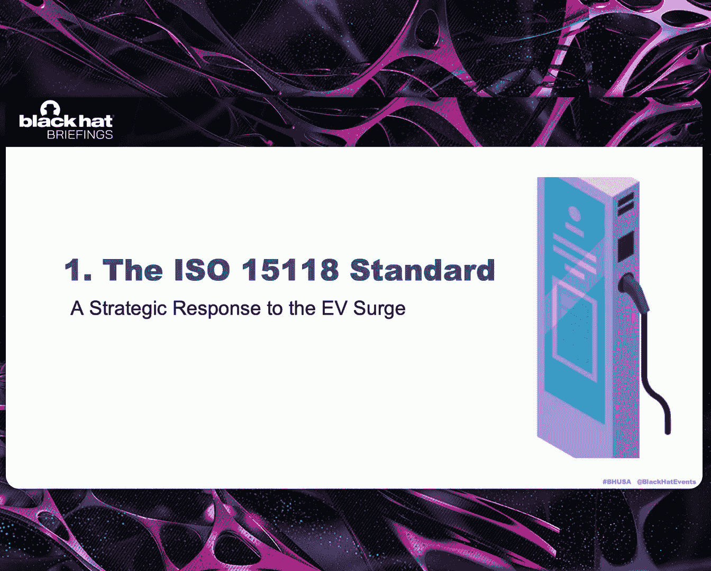
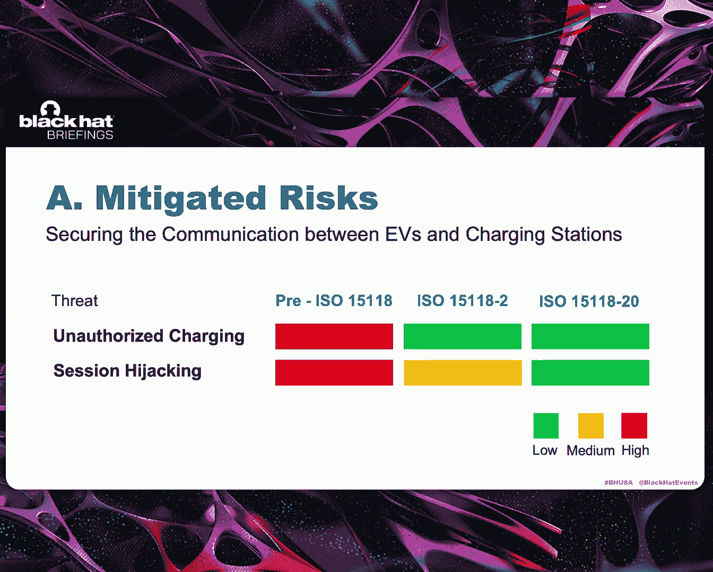
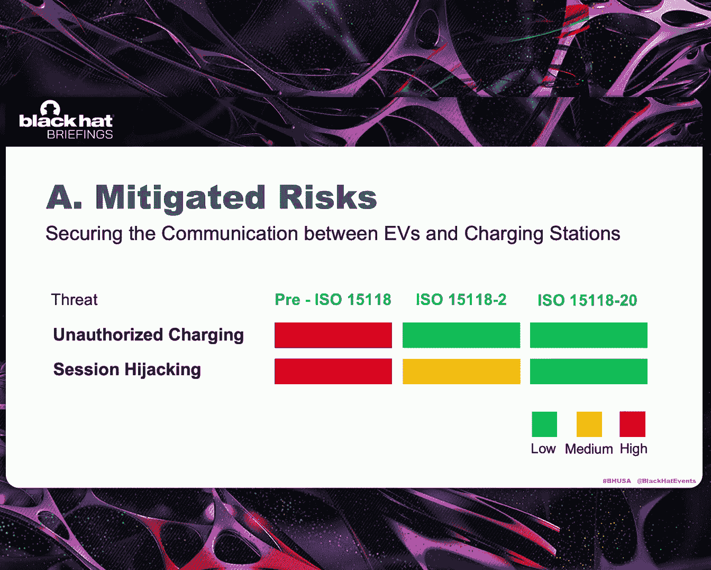
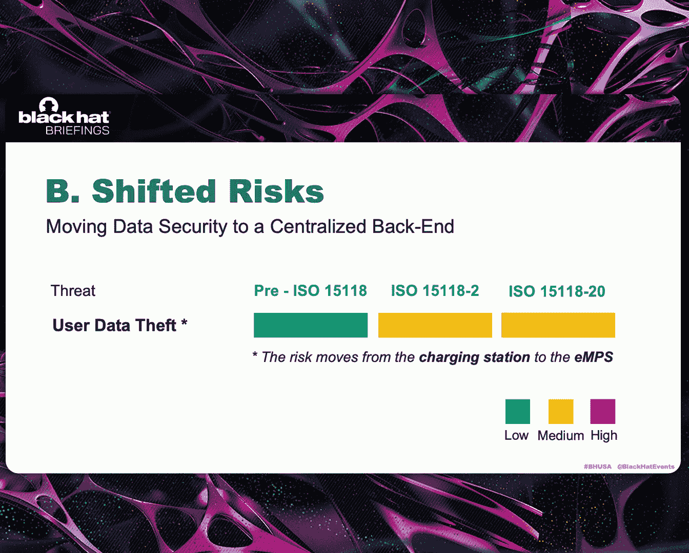
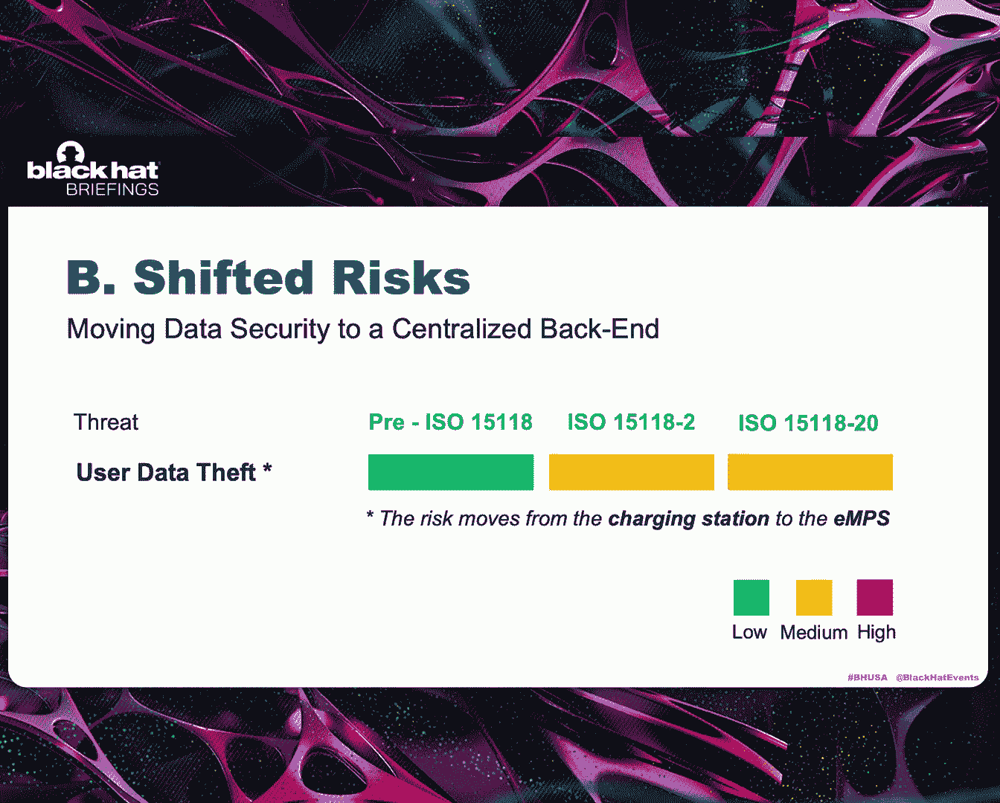
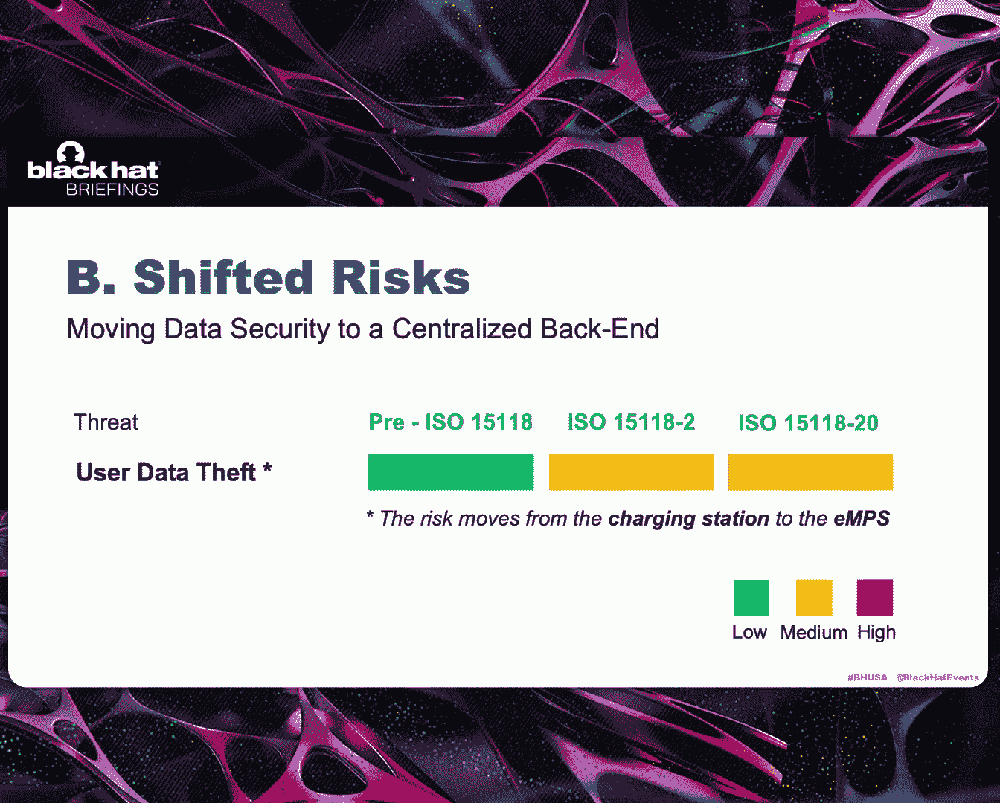
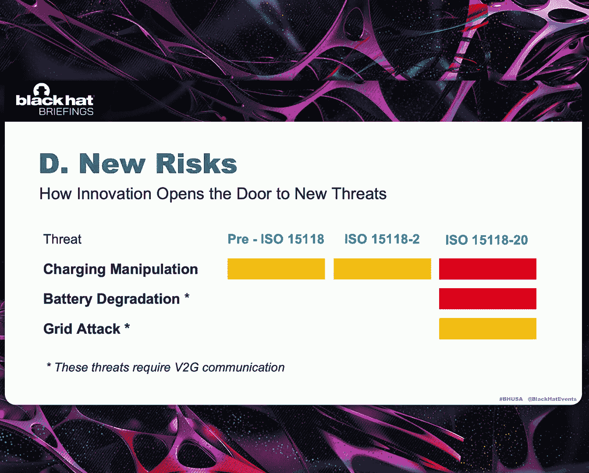
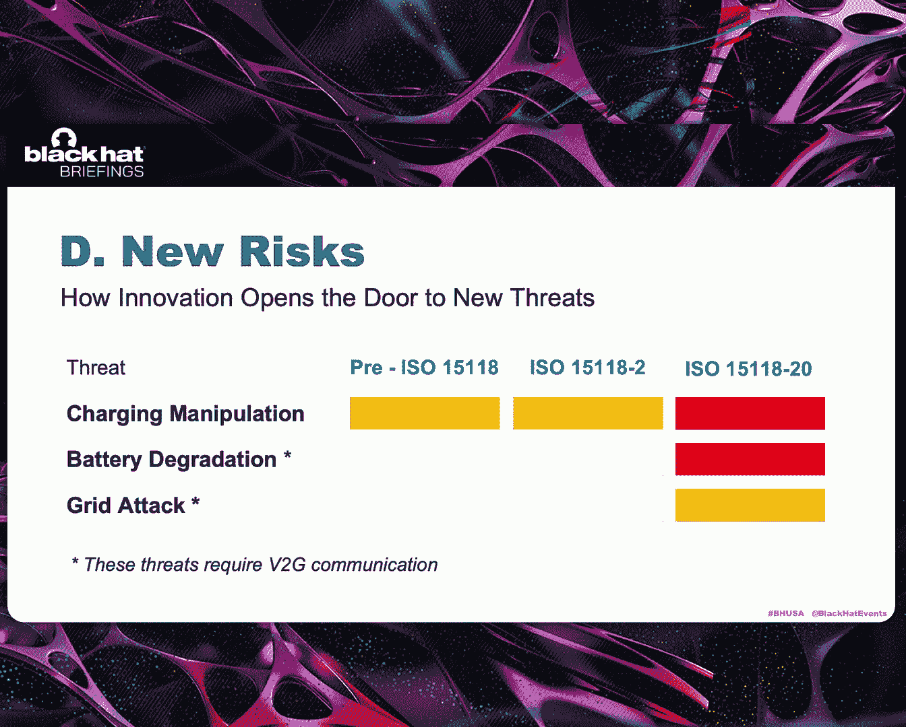
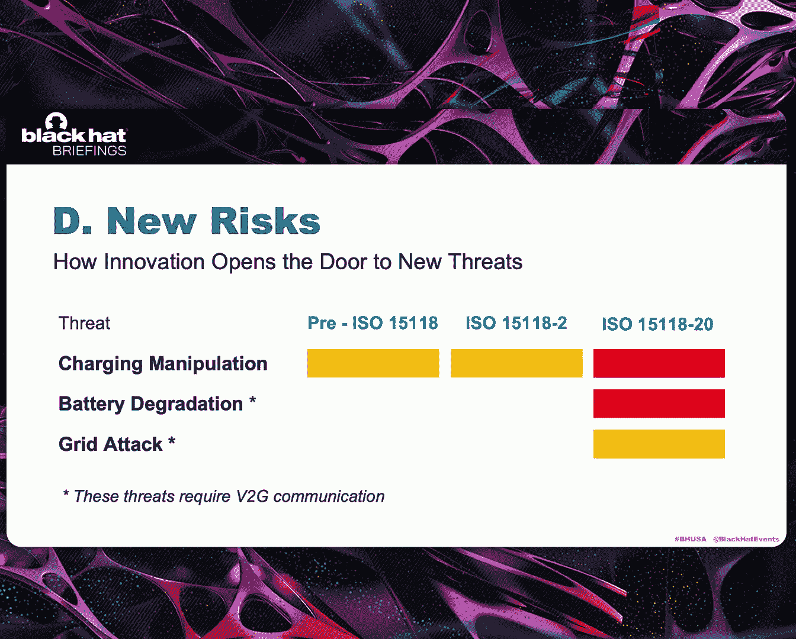
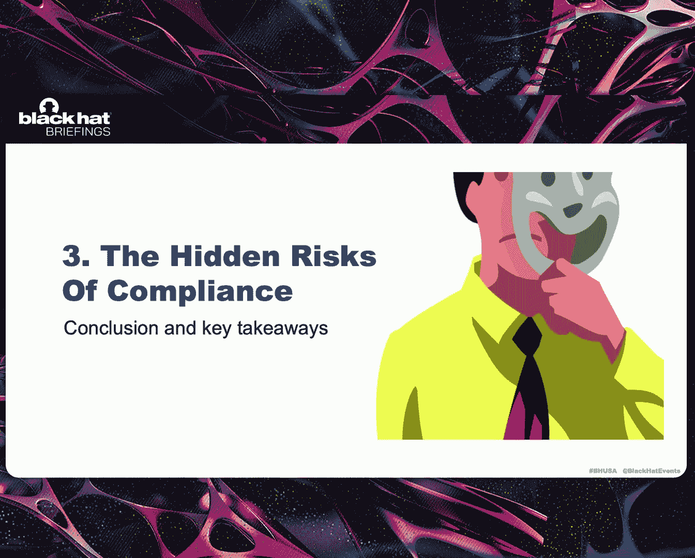

# 课程 01：智能充电，更智能的黑客：ISO 15118 的潜在风险 🔌⚡

在本节课中，我们将要学习 ISO 15118 标准。这是一个旨在提升电动汽车充电效率、便利性和安全性的通信协议。我们将探讨该标准如何改变威胁格局，它解决了哪些问题，以及更重要的是，它可能遗留或引入了哪些新的安全风险。

## 第一部分：什么是 ISO 15118 标准？🤔

上一节我们概述了课程内容，本节中我们来看看 ISO 15118 标准本身及其引入的背景。

全球电动汽车数量正在急剧增长。有预测表明，到 2040 年，电动汽车数量可能达到 6 亿辆，占全球汽车总量的 30% 至 40%。这对脱碳来说是极好的消息。

但与此同时，电动汽车数量的激增也带来了挑战。这是因为我们的电网并非设计用来在同一地点同时为大量电动汽车充电。当这种情况发生时，电网会面临一种称为“电网压力”的挑战性局面。我们可能会开始经历电压下降。本地电力变压器可能开始损坏，这甚至可能导致局部电网完全断开，即全面停电。

我们还需要理解讨论电网时的第二个问题。这个问题并非由电动汽车引起，而是我们生产和消费电力方式的副产品。如今，我们越来越依赖太阳能和风能等可再生能源。这当然是极好的消息。但与此同时，这也带来了挑战。

因为我们的电网依赖于电力生产量和消耗量之间的脆弱平衡。可再生能源存在风险，因为通过风能和太阳能产生的电量会随天气快速变化。这意味着可再生能源可能在电网中产生电力过剩，我们必须找到使用或储存它的方法。如果我们无法做到，可能会面临严重后果，因为这种情况会使电网频率（即电网的“心跳”）超出安全运行限值。

那么，如果我说电动汽车可以成为解决这两个问题的方法呢？因为我们估计，如今私家车平均有 95% 的时间停在路上。因此，我们实际上可以将停在路上的电动汽车用作分散式存储电池。这将避免西班牙发生的情况。

以下是实现这一目标的两项主要技术：

*   **智能充电**：这是一种创新的充电方式，允许充电站改变充电模式。充电站将确保电动汽车仅在电网允许时从电网获取电力，从而解决第一个问题。
*   **车辆到电网通信**：这解决了第二个问题。因此，停在我们街上的汽车可以在电力过剩时从电网获取电力。这些车辆将来也可能在电网需要时将电力输送回电网。

ISO 15118 标准的引入实际上是为了让电网更高效，因为该标准支持智能充电和车辆到电网通信这两项技术。这是我们今天的起点。提高电网效率只是该标准的主要目标之一，因为该标准同时也用于通过一项新功能——即插即充——使用户的充电过程更加便利。同时，该标准的引入也是为了改善电动汽车充电生态系统的安全性。

以下是关于标准版本的一些细节：
*   **ISO 15118-2 (2014)**：支持屏幕上显示的所有功能，但车辆到电网通信除外。
*   **ISO 15118-20 (2022)**：完全支持车辆到电网通信。

## 第二部分：标准如何改变威胁格局？🛡️➡️🔓

上一节我们介绍了 ISO 15118 标准的目标和功能，本节中我们来看看该标准如何影响安全威胁格局。

该标准实际上改善了电动汽车充电生态系统的安全性。它专注于电动汽车和充电站之间的通信链路，并保护一项新功能——即插即充——的通信。如今，如果一辆电动汽车支持 ISO 标准，车辆会存储一个数字证书。该数字证书通过 PKI（公钥基础设施）颁发，并与用户账户绑定。这意味着，当我们将支持该标准的电动汽车插入支持该标准的充电站时，充电站会自动识别电动汽车。如果你拥有电动汽车，你不再需要使用信用卡或实体令牌来验证充电会话，这将通过即插即充自动完成。即插即充还允许充电站从数字证书中提取支付和计费所需的所有信息。同样，我们不再需要使用信用卡。电动汽车和充电站之间流动的所有信息都通过 TLS 加密。

这在威胁方面意味着什么？在标准引入之前，困扰电动汽车充电生态系统的最重大威胁之一是**未经授权的充电会话**。这是因为充电站严重依赖像 RFID 卡和信用卡这样的实体令牌，这些组件可能被窃取、侧录或克隆。如今这不再可能，因为所有信息都来自数字证书。

只要电动汽车和充电站之间通信链路上的加密保持有效，恶意用户的选项就非常有限。他们需要篡改电动汽车的物理硬件以提取与数字证书关联的私钥，或者他们需要攻破证书颁发机构本身以开始签发欺诈性证书。这非常难以实现。

但该标准也以一种更间接的方式改善了电动汽车充电生态系统的安全性。因为所有支付信息都来自数字证书，这意味着如今有了 ISO 标准，不再是充电站负责管理支付。我们将此责任转移到了后端一个新的集中实体，称为**电动出行服务提供商**。

这在威胁格局方面意味着什么？这一点尤其重要，因为在标准引入之前，我们将管理数据的责任留给了充电站，这导致了一个非常分散的生态系统。一些充电站确实使用了强大的安全措施，但有些则没有。如今，我们将此责任转移到了一个集中实体——电动出行服务提供商，它可以在大规模上强制执行网络安全策略。然而，这种责任转移伴随着一种权衡。在标准引入之前，充电站层面的泄露可能暴露数百或数千辆电动汽车的用户数据。如今，电动出行服务提供商层面的泄露可能同时暴露数百万条数据。但尽管如此，安全性的提升仍然是显著的，因为我们正从一个分散的生态系统转向一个更强大、更紧密的架构。

## 第三部分：标准遗留与引入的风险 🚨

上一节我们探讨了标准如何改善安全性，本节中我们将视角放大，审视标准范围之外以及因其创新而可能产生的风险。

如果我们只关注标准所做的事情，改进是显著的。这意味着我们会认为电动汽车充电生态系统因为该标准而实际上是安全的。但事实并非如此。我们必须放大视角，尝试理解由于标准的存在，生态系统其余部分发生了什么。

我们要看的第一个部分是**充电站**，因为充电站是标准范围之外的组件之一。这里我们必须小心，因为这不是标准设计上的缺陷，而是一个深思熟虑的选择，因为标准只关注车辆和充电站之间的通信链路。但标准做了一个假设，这是一个非常危险的假设。标准假设充电站是一个可信实体，充电站是安全的。这个假设可能会适得其反。

事实上，最近的一些审计表明，一些充电站仍然依赖现成的组件（如树莓派），它们仍然有开放的维护接口、开放的后台端口、不安全的远程路径访问。这意味着充电站仍然非常容易受到持续性的入侵。我们不要忘记充电站是公开可访问的，这意味着恶意用户可以去那里进行物理篡改，可以上传修改版的操作系统，可以提升权限以获得完全的 root 访问权限，并通过此实施各种攻击。

如果恶意用户控制了充电站，他可以轻易实施**拒绝服务攻击**，因为如果我们控制了充电会话，我们可以直接禁用功能。你可以开始意识到标准的第一个矛盾：标准保护了电动汽车和充电站之间的通信链路，但同时，充电站可能完全无法使用。

现在我们可以转向第二个威胁：**不安全电力输送**。更糟糕的是，我们不要忘记充电站是网络物理系统。这意味着对充电站的攻击将对现实生活或我们自身的现实产生后果。这一点现在尤其危险。ISO 15118 标准实际上有一个协商机制，电动汽车和充电站必须共同协商一个可接受的功率水平。但标准缺乏的是一个强制执行合规性的机制。这意味着在此协商之后，如果充电站被入侵，充电会话可以简单地覆盖设置，并开始输送对电动汽车危险的功率水平，这可能对用户造成安全隐患。

还有第三个威胁：**未经授权的充电会话**。我们曾认为这种威胁通过标准的引入已完全缓解，但事实并非如此。我们引入了即插即充和数字证书，但标准留下了一个漏洞，因为标准缺乏让充电站与可信时间源同步时钟的机制。这意味着恶意用户可以简单地控制充电站，修改本地时钟，这将诱使充电站接受已吊销或过期的证书。因此，如果我们从更大的视角来看，一些我们认为已解决的问题实际上仍然存在。

现在还有第四类也是最后一类需要分析的风险：**新风险**。这意味着这些风险在标准引入之前并不存在。这些风险是标准创新（智能充电和车辆到电网通信）的意外后果。为什么我们将这些功能视为攻击向量？再次是因为充电站容易受到入侵。

让我们考虑第一个风险：**充电操纵**。充电操纵意味着恶意用户试图让他人为他的车辆充电付费。这在智能充电引入后成为可能。如果我们有一个被入侵的充电站，恶意用户可以简单地模拟电网拥堵，这将人为抬高充电站的价格，并迫使许多电动汽车停止充电。你可以想象电动汽车车主返回车辆时发现电池完全没电时的沮丧。

但也有恶意行为者可以实施的更复杂的攻击，其中之一例如是**电网攻击**。这是一种由车辆到电网通信实现的攻击。让我们想象一个恶意用户同时控制多个充电站。显然，这特别难以实现，但这并不会排除此类攻击，只是将攻击者类型缩小到那些拥有预算、技能和手段的人。如果我们有多个被入侵的充电站，并且它们都连接到同一个本地电力变压器，这些充电会话可以同步进行持续的充电和放电。

这对我们的现实尤其危险，因为这种攻击有可能使电网频率超出安全运行限值。因此，我们将能够人为诱发类似今年早些时候西班牙发生的停电，显然，拥有技能和预算的攻击者能够断开部分或整个国家电网。

## 总结与关键要点 📝

本节课中，我们一起学习了 ISO 15118 标准及其对电动汽车充电生态系统安全格局的双重影响。

我想要留给大家的主要信息是：首先，我们必须小心。我们必须理解 ISO 15118 标准确实显著改善了电动汽车充电生态系统的安全性，这一点不可否认。但如果我们放大视角，我们也会意识到标准遗留了一些风险，其中一些风险特别危险，并且标准也可能因其创新而引入新的风险作为意外后果。

当我们有一个系统或像电动汽车充电这样的生态系统被标记为符合某个标准时，我们可能会感到安全，但这可能是一种虚假的安全感。你可能感到安全，即使生态系统并不安全。因此，我们必须认识到，真正的安全不仅仅是遵守一个标准。真正的安全需要思维方式的转变。因此，我们不应该只问自己“标准解决了什么？”，而应该问自己“标准改变了什么？”。我们必须放大视角，理解由于标准的存在，整个生态系统中正在发生什么。我们还应该问自己“标准遗留了什么？”，因为新的风险或漏洞常常出现在无人关注的空白地带。

我希望大家离开时记住的三个关键信息如下：

1.  **标准可以改善安全，但也会制造漏洞和安全盲点**。
2.  **整个生态系统通常基于一系列不同的标准网络**。ISO 15118 标准只是我们讨论的生态系统中的一个环节。但今天我们意识到，即使生态系统中有一个组件被某个标准排除在外，整个生态系统的安全性也会面临风险，无论各个组件本身的安全性有多好。
3.  **我们需要超越合规的行动**。制定标准是好的，因为它们为我们提供了行动的指导方针。但我们也必须理解，通常一个标准是不够的。我的建议是，所有在电动汽车充电生态系统中工作的利益相关者，如电动汽车制造商、充电站制造商、电动出行服务提供商、电网运营商，都需要团结起来。他们必须理解，我们需要实施超越标准所提供的安全措施。这是我们保证真正安全的唯一途径，也是我们避免因仅仅遵守标准而产生的虚假安全感的唯一途径。