# 追踪拖拉机：分析与利用智能农业自动化系统 [OxnY_25suS8] 🚜

在本节课中，我们将学习如何分析一个流行的智能农业自动化系统。我们将从市场背景开始，逐步深入到系统的网络通信、硬件交互和安全漏洞，最终展示如何远程控制拖拉机转向系统。本教程旨在让初学者理解物联网设备安全研究的基本思路和方法。

## 概述与背景 🌾

上一节我们介绍了课程主题。本节中，我们来看看智能农业自动化兴起的背景。

农业数字化是当前的热门话题。现代农场的各个方面如今都可以通过数字化技术进行增强。例如，目前最常见的增强技术是GPS辅助耕作。

GPS辅助耕作的范围很广，从仅仅获取田地的GPS信息，到实现拖拉机在田地里自动行驶的全自动化。

除了自动化，该领域也有积极的研究。因为这些组件的技术表面正变得越来越互联。该领域完成的大多数汽车研究也是经典的汽车研究，例如针对CAN总线或ECU的攻击。

但也有更专门和具体的研究。例如，在某个会议上，有研究者展示了他能够入侵一台拖拉机并在上面运行《毁灭战士》游戏。

除了主动研究，也有实际的攻击案例。例如，瑞士的一位农民遭遇了勒索软件攻击。但中招的不是他的普通电脑，而是他的挤奶机器人。

## 系统如何工作？🔧

上一节我们了解了农业自动化的背景。本节中，我们来看看这类自动化系统具体是如何工作的。

一个典型的自动化系统如下图所示。在屏幕右侧，你可以看到一个转向系统。这是一个售后解决方案，可以帮助你实现拖拉机自动化。

整个装置由一个方向盘、一个作为人机界面（HMI）的平板电脑和一个GPS天线组成。它的价格并不昂贵，大约在5千到1万美元之间。这与一台起价往往高达百万美元的新拖拉机相比非常便宜。

为了让你更好地理解系统如何集成，下图展示了其布线方式。你安装一个平板电脑，替换掉某个部件，再安装一些传感器，然后就可以出发了。这样基本上就把任何主要品牌的拖拉机变“智能”了。

它适用于各种跟随式农机。你还可以集成像犁或其他附加硬件到拖拉机上。

剩下唯一要做的就是定义你的田地，决定你想在田地里以何种模式行驶。下次你开着拖拉机去田地时，只需点击播放，就可以自动耕作你的田地。

## 市场与目标系统 📊

在真正开始研究这些主题和设备之前，我们做了一些市场调查，看看哪些系统更常见。因为我们住在中欧，我们关注了在中欧销售的系统，有两个主导品牌。

一个是**AgroDynamics**，另一个是**Alice Vi/Viacmo**。如果你再往东看，例如在俄罗斯，你会看到**Navomo**。这是一个不同的供应商，但系统类似。

我们设法弄到了一台**F.G.T.**和一台**React**系统。结果发现，它们是同一个系统。因为F.G.T.是系统的制造商，而例如Svak只是同一系统的贴牌产品。

这对我们来说实际上是个好消息，因为我们知道现在问题不仅影响一两个设备，而是影响了自动化市场的很大一部分，因为这是两个主导品牌。

## 系统架构与通信协议 📡

上一节我们确定了研究对象。本节中，我们来剖析目标系统的架构和通信方式。

我们对目标系统（82系统）有一个粗略的概述。我们有三个组件：
1.  82 HMI 平板电脑，基本上是农民从驾驶舱操作的界面。
2.  我们的电机和方向盘。
3.  拖拉机顶部的GPS天线，它从卫星获取GPS坐标。

系统通过**HTTPS**和**MQTT**协议与位于中国的Aerodynamic云服务器通信。你还可以使用一个蓝牙遥控器来远程控制你的82平板电脑。

**MQTT**是一种轻量级的发布/订阅消息传输协议，常用于物联网产品中，用于在不同MQTT客户端之间交换消息。我们有一个中央代理服务器。

我们最初的焦点是监控外发流量。我们有一个加密的MQTT协议连接。通信是加密的。

我们遇到的问题是，我们想查看流量中发生了什么。但由于设备是租用的，我们不能修改它，必须归还。所以我们面临需要解密流量的问题。

我们做了常见的尝试，比如重定向流量，并验证是否存在某种TLS利用问题，因为这是在不修改系统本身的情况下最简单的方法。

结果发现，TLS验证根本不存在。系统不验证任何类型的TLS证书。

这对我们来说是个好消息，因为这样我们就获得了客户端设备连接到代理服务器的凭证。

## 凭证提取与云访问 🔓

上一节我们发现系统不验证TLS证书。本节中，我们来看看如何利用这一点获取访问凭证。

我们只是打开了一个原始网络套接字，并将MQTT流量重定向到那里。这是一个原始十六进制转储的MQTT数据包。

在绿色字段中，你可以看到客户端ID。这类似于HTTP中的用户代理，是一个任意文本字段。在底部的蓝色字段中，你可以看到产品名称和密码。

但真正奇怪的是，设备没有使用其序列号，而是使用了产品名称“82”。所有设备都使用相同的用户名和相同的密码。这已经有点可疑了。

然后我们想，好吧，我们只用MQTT Explorer（一个常用的客户端）来使用这个协议，输入密码和用户名，应该就能行了。结果发现不行。

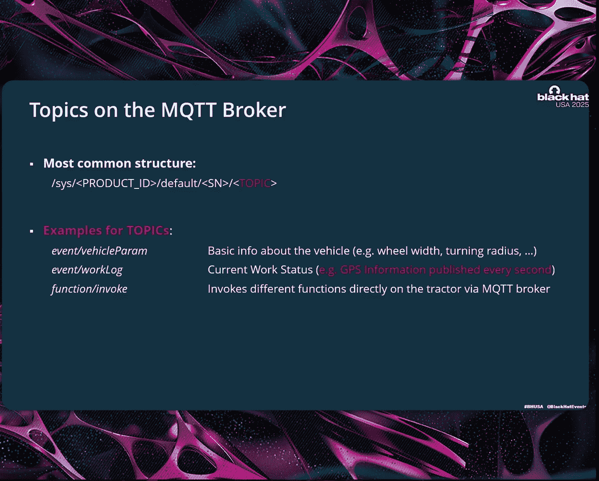

因为他们也使用了客户端TLS证书。这是我见过的最奇怪的TLS组合之一，因为一方面他们没有TLS验证，但另一方面他们在使用用户名和密码之前却使用了客户端TLS证书。

所以我们的下一个任务基本上是提取证书以进行身份验证。

我们有两个选择：要么实际逆向整个应用程序，或者至少是处理证书的部分，但它被混淆了；要么使用**Frida**。Frida是一个用于各种动态二进制插桩的非常酷的工具。所以我们使用该工具的自定义脚本来从应用程序中转储各种TLS密钥。

这样，我们就得到了TLS客户端证书。现在我们能够访问代理服务器了。我们现在能够访问云基础设施，并查看发送到代理的是哪种消息。

例如，在下图的红色区域，你可以看到系统将其GPS坐标发送到代理，并通知“我已移动”，然后更新系统的地图。

在这个代理上，有各种不同的主题。例如，我们有位置更新的主题。例如，如果车辆参数发生变化，比如农民在拖拉机上安装了不同的系统或硬件。

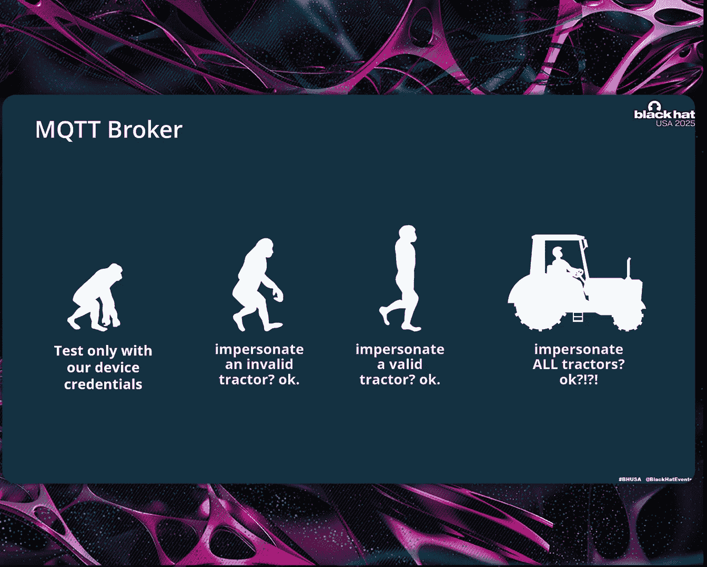

还有“函数调用”功能。这有点意思，因为它暴露了许多不同的函数。

## 安全漏洞与影响 ⚠️

上一节我们获得了云系统的访问权限。本节中，我们来探索其中存在的安全漏洞及其潜在影响。

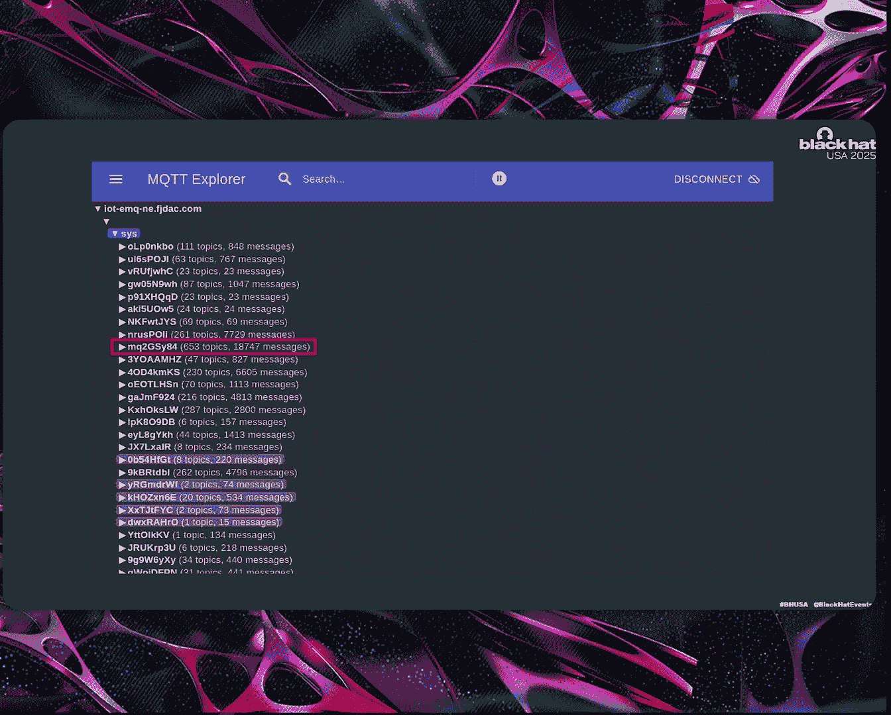

但现在的问题是，我们进行这项研究已经超过一年了。在这一年里，基础设施发生了变化。最初的情况要弱得多，因为最初只是所有设备使用相同的用户名和静态密码。

密码只有两个字符和数字2020。后来他们改成了销售注册服务。所以现在所有设备都使用自定义密码和自定义用户名向代理注册。

然而，这对我们来说是个好消息，因为最初我们只能访问欧洲的代理，因为我们只有欧洲的设备。但现在，我们突然可以访问他们在不同地区的所有代理了。所以我们现在能够访问美国、中国和俄罗斯等地的数据。

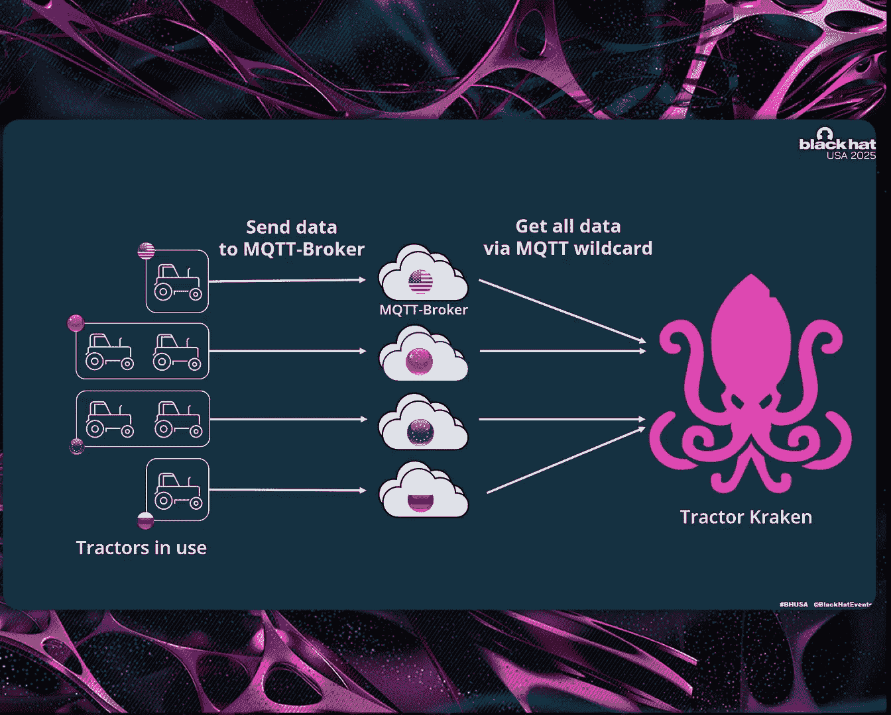

然后我们想，我们现在能做什么？我们测试了不同的测试用例。例如，我们测试了如果使用一个不存在的设备序列号会发生什么。系统直接接受了。你可以用一个根本不存在的序列号、密码和用户名登录。所以它只依赖于你提供的密码。然后你就可以说“嘿，在这个设备上”，系统会说“没问题”。

我们还可以尝试冒充不同的拖拉机。例如，我们从朋友那里知道不同拖拉机有不同的序列号。我们有一些这样的序列号。我们尝试了，结果成功了。你可以登录并冒充另一台拖拉机。

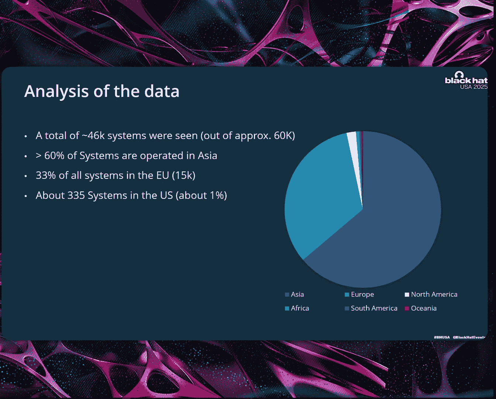

但事实上，如果你能冒充一台拖拉机，为什么不冒充所有拖拉机呢？

结果发现，两个字符就搞定了。这是一个MQTT多级通配符，它基本上告诉代理：“嘿，代理，我现在想要所有主题和所有消息。”

代理回答说：“好的。”

于是我们突然获得了大量数据，并访问了连接到这个代理的数千台设备。

例如，在红色区域，有600台拖拉机连接，产生了80000条消息。这只是打开50秒的数据量。

数据量如此之大，以至于我们遇到了真正的问题，因为突然之间，我们的系统开始崩溃，因为内存耗尽，因为我们收到了如此多的MQTT流量。

所以我们不得不为此构建一个自定义工具。我们称之为“Tractor Hackney”。它基本上就是接收所有这些MQTT数据并摄取它们。我们必须处理每秒大约10万条消息。

下图展示了架构。我们有连接到其本地云代理的所有拖拉机，然后我们使用我们的工具连接到这个代理并获取所有数据。

由于他们有自助注册服务，我们现在可以访问所有这些代理。

## 数据分析与隐私泄露 📍

既然我们获取了数据，我们现在可以进行一些分析了。在几个月的时间里，我们看到了大约44,000个系统。

大多数系统在亚洲运行，因为这是中国供应商的产品。但排在第二位的是欧盟，那里有大约5,000个这样的系统。在美国，目前只售出了大约300个系统。

我们看到的数据包括各种不同的GPS数据。所以我们知道农民在他的日常操作中在做什么。我们知道他住在哪里，他耕种哪些田地，他使用什么对等地址，有时还知道他使用什么电子邮件地址（例如，当他们彼此共享田地时）。

所以这里面有各种隐私数据。

但我们也进行了可视化。例如，在美国，你可以看到它们在全国各地行驶。也在不同的州。在左边，你可以看到一个放大的例子，例如，他们也在公共道路上使用该系统。所以并不是他们用系统主动驾驶，而是他们没有正确关闭它。所以它也在公共道路上使用。

在欧盟国家，如果你在公共道路上行驶，必须关闭这个系统。但根据我们掌握的GPS状态，我们知道农民们没有这样做。所以他们不是主动驾驶，只是没有正确关闭电源。

然后我们开始查看拖拉机的位置。我们看到这些拖拉机出现在一些疯狂的地方。例如，其中一台距离乌克兰前线20公里，时间大约是凌晨3点。

所以你可以看到，这带来了各种影响，我们现在突然可以追踪世界各地的拖拉机。我们还看到一台拖拉机靠近朝鲜，在韩国行驶。

## 主动攻击：锁定与通知 🚫

上一节我们看到了被动读取数据的风险。本节中，我们来看看如果主动向拖拉机发送数据会怎样。

问题是，你能发送给拖拉机的命令相当有限。你只有一些命令可以发送。但这些命令是“锁定”和“发送通知”。

“锁定”基本上会锁定设备，你无法再操作它。拖拉机仍然可以正常操作，但自动化功能完全消失。你可以发送通知，所以你可以骚扰他们，例如发送一些消息。

问题是，代理服务器没有适当的授权机制，所以每台拖拉机都可以向其他任何拖拉机发送通知。

我们有一个简短的演示视频。你可以看到系统处于正常操作状态，驾驶员处于自动模式，正在正常的田地里操作。

突然，你看到一个弹出消息“拖拉机现在被锁定”。你可以指定任何你想写的内容。然后自动化功能就消失了。

这对于所有连接到系统的拖拉机都是可能的。所以突然之间，所有系统都可能瘫痪。只有供应商可以恢复系统，所以每个农民都必须打电话给供应商来解锁。但攻击者可以再次发送这个命令，然后你又会被锁定。

所以代理服务器有一些非常严重的漏洞。

## 深入硬件：转向系统接管 🎮

上一节我们展示了云端的攻击。本节中，我们更进一步，看看如何攻击转向系统本身。

我们也想到，系统在公共道路上使用。如果我们能入侵方向盘呢？如果我们能接管方向盘，例如把拖拉机开进沟里，或者突然让它偏离道路。

所以我们开始更多地研究转向系统本身的工作原理。

转向系统由HMI、方向盘和一些GPS传感器组成。HMI本身只是一个安卓平板电脑。然而，供应商对其进行了锁定。所以你不能只启动任何应用程序，它只启动供应商的默认应用程序。

但它没有正确实现锁定。所以你可以启用ADB访问来获取系统设置，然后你至少拥有了一些shell访问权限。

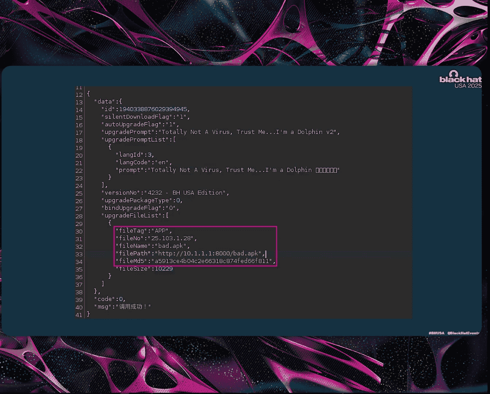

在普通的安卓设备上，你现在需要利用一些漏洞来获取完整的root权限。但是，这不是一个普通的安卓设备，因为事实证明，设备基本上是root了的。

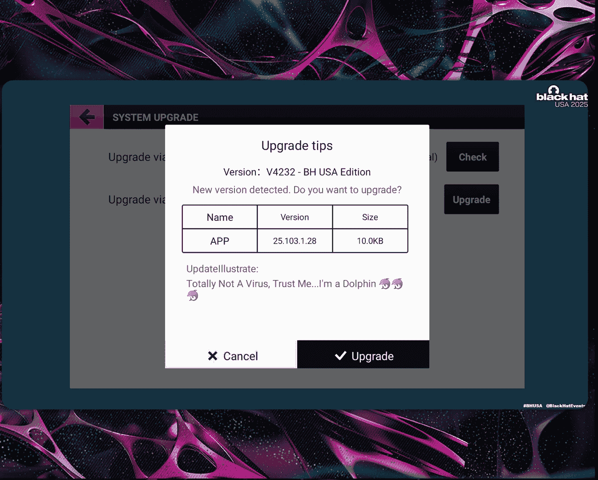

因为我们只用了大约五分钟就root了设备。我们把它放在桌子上，启动，点击用户界面，连接USB-C，然后我们就有了root权限。因为供应商需要root权限来运行他自己的代码。

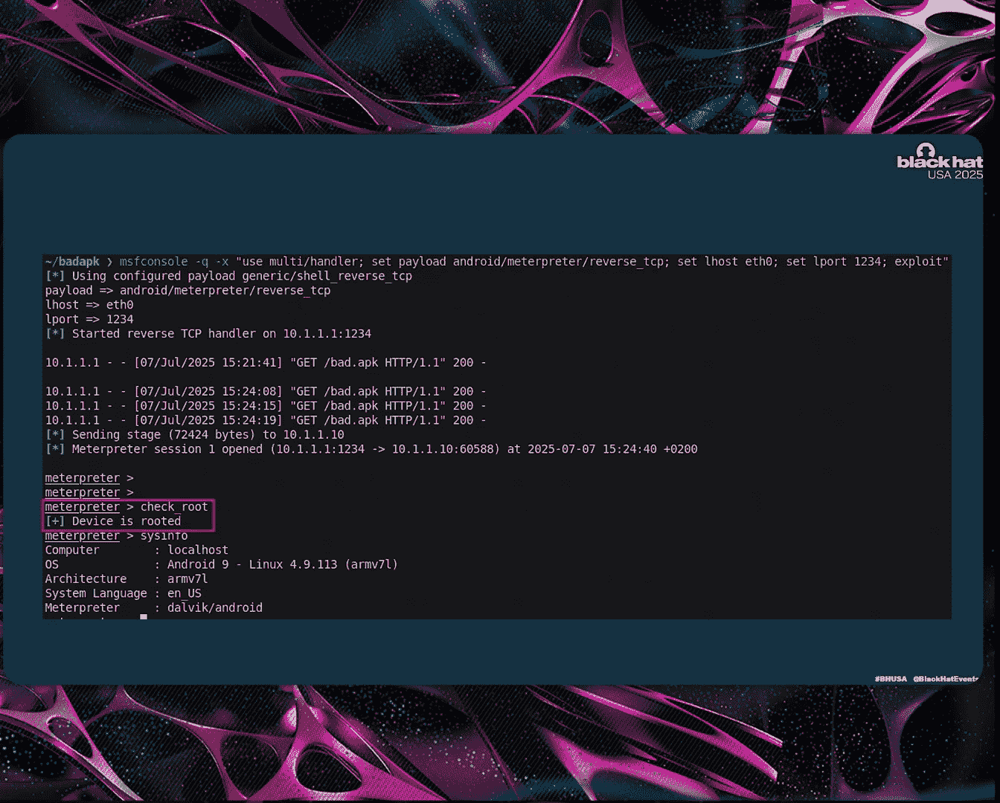

我们查看了代码，想知道为什么他们无论如何都需要root权限。结果发现，在安全功能方面他们有点懒，因为他们没有为访问安卓系统内的其他设备实现适当的授权机制。

所以他们在里面有子系统。在安卓中，这些只是原始串行设备。要访问它们，你需要一个适当的权限系统来进行适当的授权。但他们没有，他们只是放了SU二进制文件，然后执行他们自己的代码。

但这对我们来说是个好消息。所以我们拥有了安卓系统的root权限。

但我们想远程实现这一点。

## 远程Root与OTA漏洞 📲

我们遇到了很多死胡同。我们尝试了很多方法。例如，我们尝试通过代理发送恶意消息来获得某种代码执行。然而，你可以从代理发送的命令相当有限，而且它也只落在安全的Java代码中，这些代码不容易受到任何内存损坏或其他问题的影响。

我们还尝试通过网络。例如，它是否暴露了任何服务？没有，它没有暴露任何服务。

这给我们留下了以下三种攻击途径：
1.  通过物理访问，我们可以直接root，但这不能构成一个技术攻击向量，因为我们需要物理接触设备。
2.  通过蓝牙进行RCE。系统本身已经过时，容易受到一些众所周知的安卓蓝牙漏洞的影响。而且有公开的漏洞利用程序。然而，你需要蓝牙配对，而且漏洞利用程序导致系统崩溃的次数比给你shell的次数要多。
3.  我们开始研究一些我们可以进行中间人攻击并替换服务器响应的方法，从而触发HMI本身的代码执行。

这就是OTA（空中下载）更新的用武之地。出于某种原因，供应商在这方面真的搞砸了，因为他们没有为此进行传输加密，也没有任何形式的验证或签名。

通常，当你有某种固件更新或OTA更新时，你会有某种强非对称签名来防止篡改镜像。在这种情况下，他们只使用MD5校验和。我想我们可以计算那个值。

在屏幕右侧，你可以看到一个典型的请求。它说：“嘿，是时候更新了。我们正在更新到版本25。这是你需要下载的URL。”

这就像教科书般的“路过式下载”例子。所以如果你在中间，你可以用任何你想要的二进制文件替换它。因为设备是预root的，这导致了完整的root代码执行。

但是中间人攻击总是很难实现。你必须处于相邻位置，而且扩展性不好。这对我们来说扩展性不好，但众所周知，例如国家行为体或高级威胁组织能够对互联网连接执行中间人攻击。

所以虽然我们不能大规模利用这个漏洞，但他们很可能可以。

攻击本身非常简单。你成为中间人，替换响应。例如，在这种情况下，你只需将其替换为自定义URL。你必须计算MD5校验和，替换底部的代码。这很重要，否则客户端不会接受。

你还可以添加自定义消息，比如“这是一个病毒，相信我，我是海豚”。如果你这样做，用户会看到这个有趣的对话框。如果农民说“哦，状态实例是合法的”并接受它，我们就获得了完整的root权限。

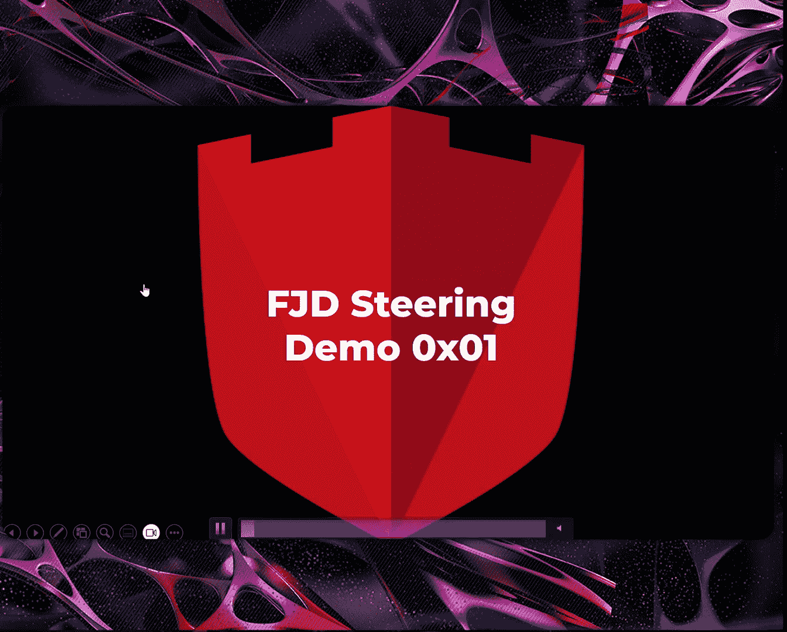

这是一个有趣的例子，但真正的攻击者可以使用更恶意的内容，或者结合社会工程学来让农民安装系统或更新。

作为概念验证，例如，我们使用Metasploit作为一个简单的PoC。你可以看到APK正在从网络下载，然后Metasploit会话启动。所以远程root这个设备也相当容易。

因为它已经root了，我们已经拥有了root访问权限。

## 转向协议逆向与最终控制 🛠️

在这一点上，我们通过网络拥有了完整的root权限。但问题是，距离转向系统还有很长的路要走，因为转向系统本身由多个组件组成。

你有这个安卓平板电脑，然后你有一个ECU，这是一个嵌入式设备，它接收来自安卓平板和IMU（惯性测量单元）的多个输入。IMU是方向传感器，用于了解拖拉机的水平程度。

ECU结合其输入，然后做出转向决策，该决策随后被发送到电机控制单元（MCU）。然后MCU是实际转动方向盘的设备。

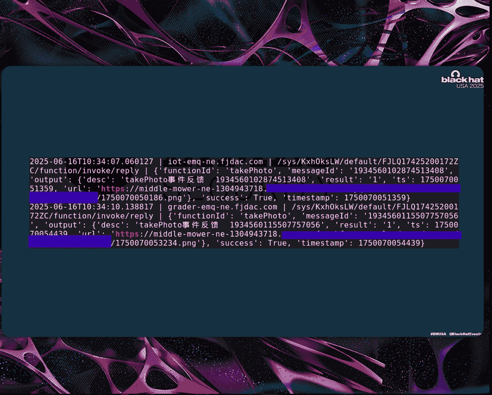

所以我们的下一个任务是技术问题。然而，这是一个租赁设备。通常，我们会打开它，连接JTAG，或者获取某种闪存转储来进行分析。但这对我们来说不是一个选项。

所以我们唯一的选项要么是直接刷新安卓平板电脑，要么是逆向用于转向的协议。

所以我们选择了安全的方式，逆向工程了协议。但这花了我们一些时间，因为二进制文件只是200KB的原始ARM汇编，没有符号，没有字符串，什么也没有。我们不知道它采用的确切指令集，也不知道里面使用了什么操作系统。

我们的策略基本上是寻找一些具有高密度条件语句和高密度魔数（magic bytes）的函数，因为这通常是数据包处理程序的样子。在某个时刻，我们找到了一个基本上指定了协议外观的函数。

我们逆向了这个子函数，清理了代码，并得出了以下协议规范。

在这里，你可以看到可能用于转向系统的各种命令。至少我们认为这些是正确的命令。在右侧，你可以看到不同的数据包或数据包结构。

数据包总是以`0xEC91`开头，有一些头部。最重要的字节是第16个字节，因为第16个字节是命令字节，它基本上告诉转向系统你发送的是哪种命令。

例如，这是一个航点配置命令，它指定你从A点行驶到B点。所以在命令字节之后，你有命令负载，在这种情况下是四个浮点值，代表两次的纬度和经度。

重要的是，仅仅发送像左转或右转这样的命令是不够的，因为那是不可能的。你必须指定一条特定的路线，说“嘿，我们从A点行驶到B点再到C点”。然后ECU决定如何到达那个点。所以系统本身对方向盘没有直接控制。

所以如果你想创建一个劫持方向盘并只是左转或右转的PoC，我们必须计算一个相对于当前位置的90度角来实现，例如，一个急转弯。

## 整合攻击：演示与影响 🎥

有了协议规范，我们离接管方向盘很近了，因为我们还需要一样东西：正确的通信流程。

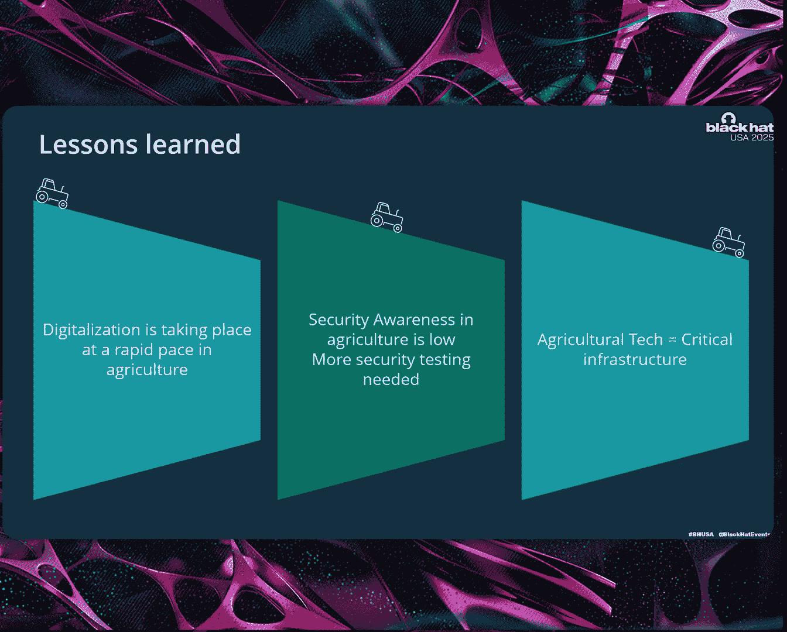

因为事实证明，你需要多个数据包来控制方向盘，因为你需要向ECU发送心跳包。如果你停止心跳，ECU会关闭。你需要指定航点，例如，告诉转向系统从A点行驶到B点的配置，指定一些配置参数，然后是执行命令。

但在你发送这些类型的命令之后，方向盘开始转动。如果你想要一个完整的攻击者控制，你还需要注意必须停止原始应用程序，否则它会干扰转向。

我们把所有这些整合到了这个演示中。

在这里，例如，系统处于操作状态。它处于被动模式。例如，有些人在公共道路上使用它。你可以正常使用拖拉机，但它是预root的，只需轻按开关，转向就被接管了。

问题是，转向电机相当强大。所以你现在有两个选择：要么开始与方向盘争夺控制权，要么你足够快地关闭系统。但这基本上只需要一瞬间就能把拖拉机开进沟里或导致翻车。

## 意外发现：割草机与机器人 🤖

但在开始，我们说过我们最终到达了某个不同的地方。事实证明，供应商还有很多其他设备连接到同一个代理。

在某个时刻，我们看到一个函数调用叫做“拍照”。我们想，这是怎么回事？为什么，谁在拍照，为什么拖拉机会拍照？结果发现那不是拖拉机，而是更多东西。

同一个供应商也在制造连接到同一个云基础设施的割草机。割草机如何操作？它们基本上只是用摄像头拍一张照片，上传到云存储，然后通过代理发送云存储URL。因为我们正在监听代理，我们看到了这些云存储图片的URL。

通常，当你有云存储时，会有某种签名或令牌来保护你，这样你就不能直接从那里下载图片。供应商在这方面也搞砸了。

所以突然之间，我们拥有了来自世界各地、不同大陆的多个割草机的完整摄像头访问权限。我们突然有了来自不同割草机的一系列视频流