# 课程 1：揭露与应对 TJ Actions 供应链攻击 🛡️

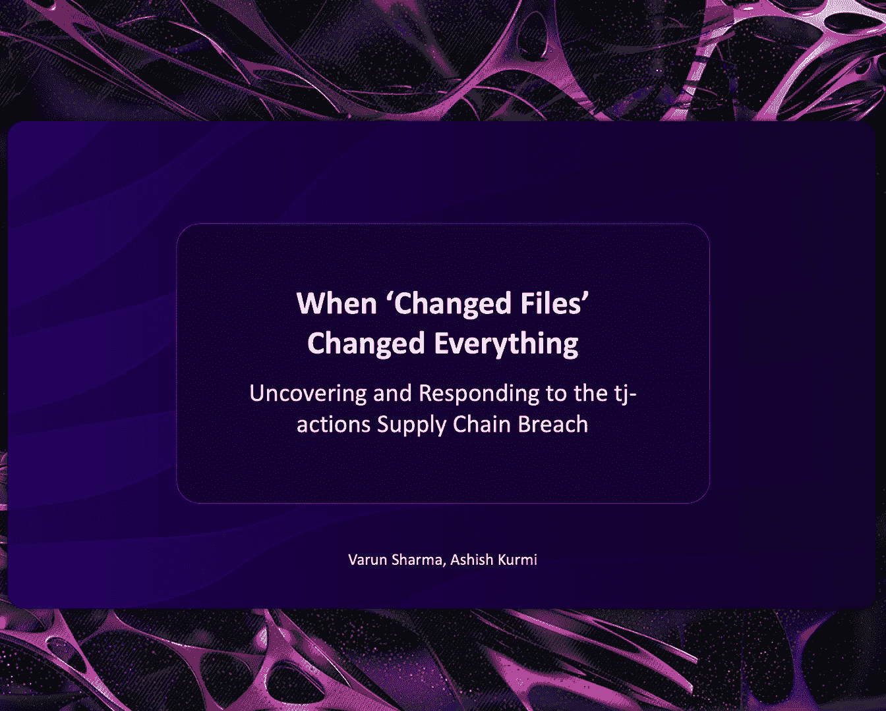

在本节课中，我们将学习一起真实的 GitHub Actions 供应链攻击事件。我们将了解攻击是如何被发现的、攻击者的具体手法、事件的影响范围，并从中总结出关键的防御经验。

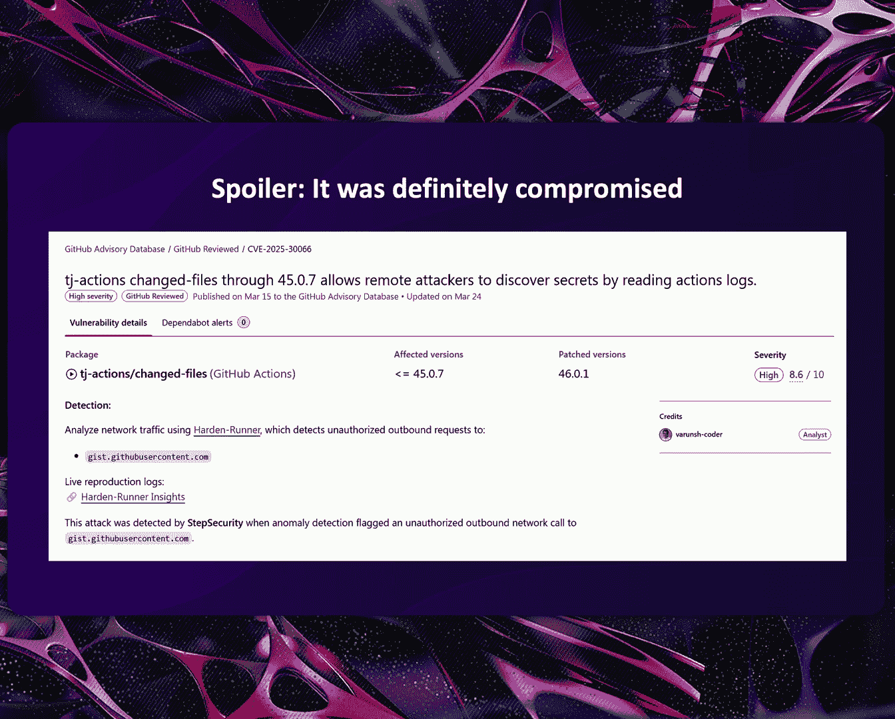

---

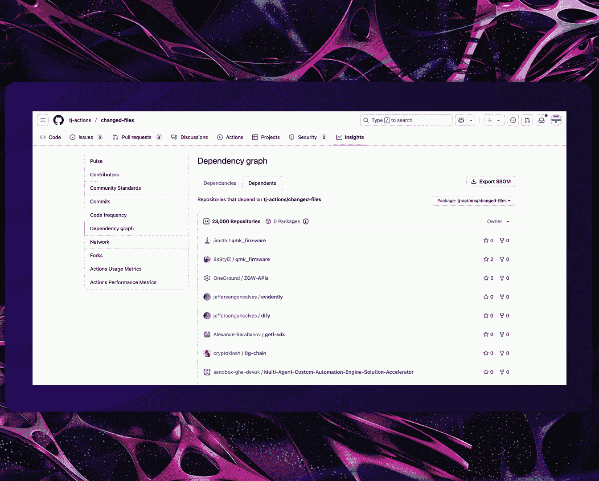


## GitHub Actions 与 TJ Actions 简介 🚀

上一节我们概述了本次课程的主题，本节中我们来看看事件的核心组件：GitHub Actions 以及被攻击的 TJ Actions “change-files” Action。

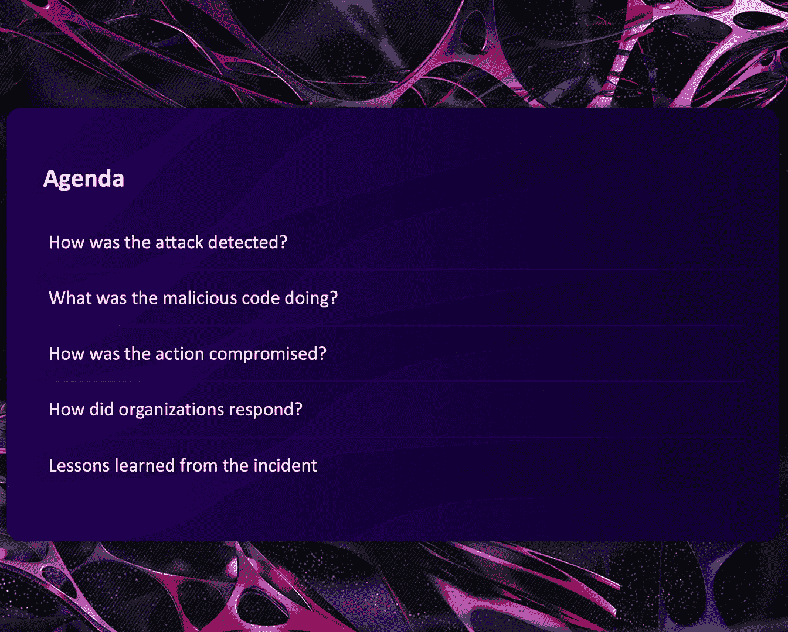

GitHub Actions 是 GitHub 于 2019 年 11 月推出的 CI/CD 平台。它迅速成为托管大量开源和企业 CI/CD 管道的默认选择。

以下是一个示例的 GitHub Actions 工作流：


```yaml
name: Sample Workflow
on: [push]
jobs:
  deploy:
    runs-on: ubuntu-latest
    steps:
      - uses: actions/checkout@v4
      - uses: tj-actions/changed-files@v44
      - run: echo "Deployment steps..."
```

这个工作流运行在 GitHub 提供的 Ubuntu 虚拟机上。它包含多个步骤，其中前几个步骤使用了来自 GitHub Actions 市场的现有 Action。GitHub Actions 市场拥有超过 25000 个可复用的 Action。

GitHub Actions 工作流可以消费机密信息，例如云凭证、发布密钥等。当工作流需要机密信息时，GitHub 会将其提供给运行在虚拟机上的 `runner.worker` 进程，然后该进程再将其提供给工作流中的相应步骤。关键在于，所有第三方 Action 都运行在同一台虚拟机上，因此它们本质上共享主机内存空间。

请注意，工作流通过发布标签（如 `v44`）来引用这些 Action。GitHub 标签默认是可变的，这意味着攻击者可以在创建后将 `v44` 这样的标签重新指向另一个提交。

---


## 被攻击的 Action：TJ Actions Changed Files 🔍

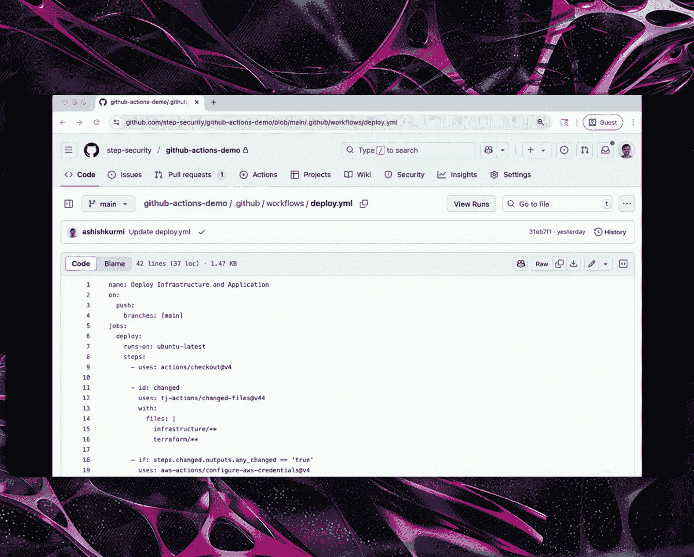

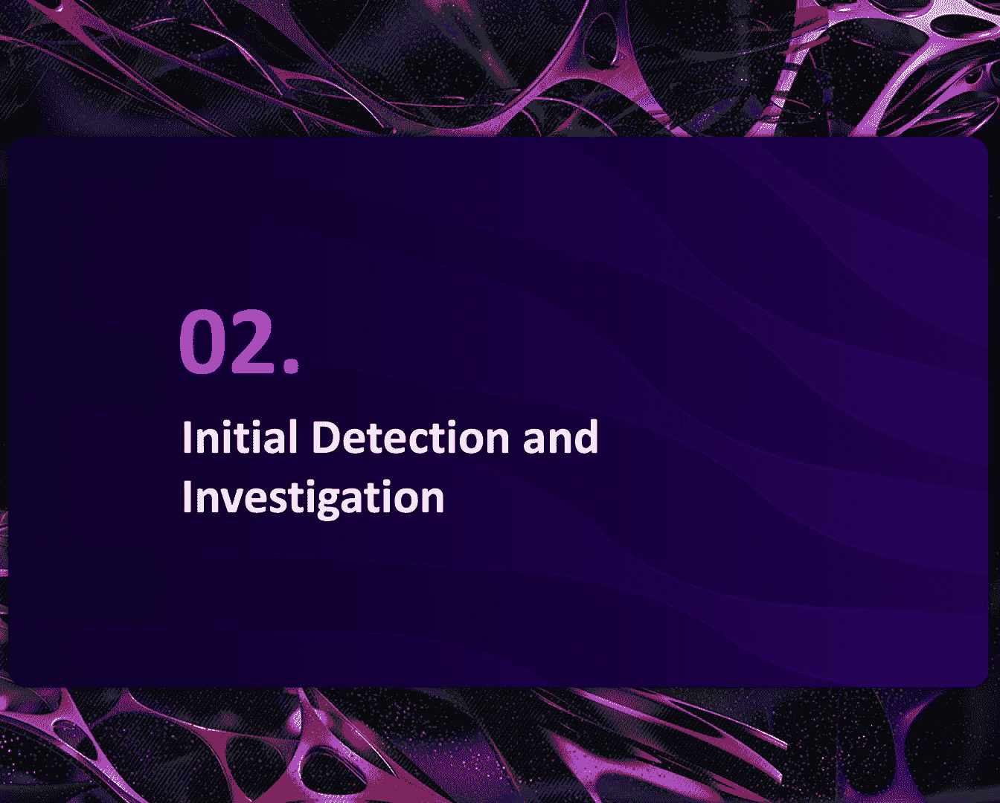

现在，让我们聚焦于本次事件的核心——TJ Actions “changed-files” Action，并理解它为何如此流行。

该 Action 的功能是：找出在给定提交或拉取请求中被修改的文件列表。在我们的示例工作流中，如果 PR 修改了 `infrastructure` 或 `terraform` 目录中的文件，它就会执行 Terraform 部署步骤，否则跳过这些步骤。这本质上节省了计算时间和资源，因此该 Action 被广泛用于从内部工具到生产管道的各种场景。


---


## 攻击是如何被发现的 🕵️♂️

上一节我们介绍了被攻击的 Action，本节中我们来看看这次攻击是如何被安全产品检测到的。


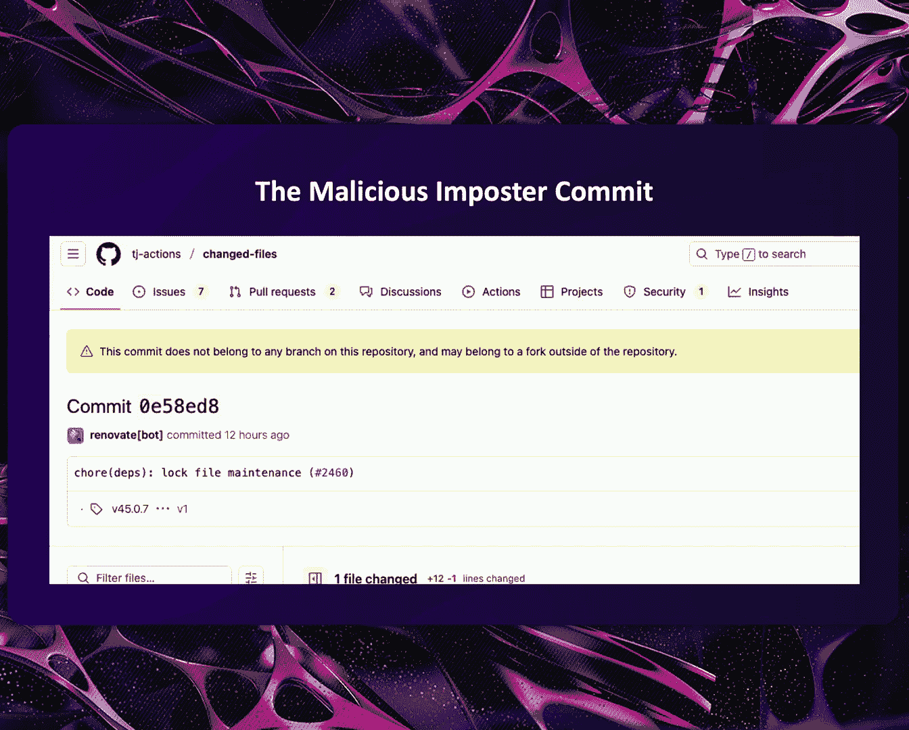

如果你反复运行那个工作流，并从 CI/CD Runner 监控其出站网络调用，你会看到类似下图的基线。这张截图来自我们的产品 Step Security Harden Runner，但重点在于方法论而非工具本身。


在正常情况下，工作流会调用 `github.com`（由 `actions/checkout` 发起）以及 `aws.amazon.com` 或 `hashicorp.com`（部署步骤）。然而，在 3 月 14 日，同一个任务发起了一个对 `jsdkgithubusercontent.com` 的新调用。由于该任务从未向此目的地发起过出站调用，这触发了检测。

调查发现，这个调用来自 TJ Actions Changed Files Action，并且是通过 `curl` 下载一个名为 `mem_dump.py` 的文件，这非常可疑。

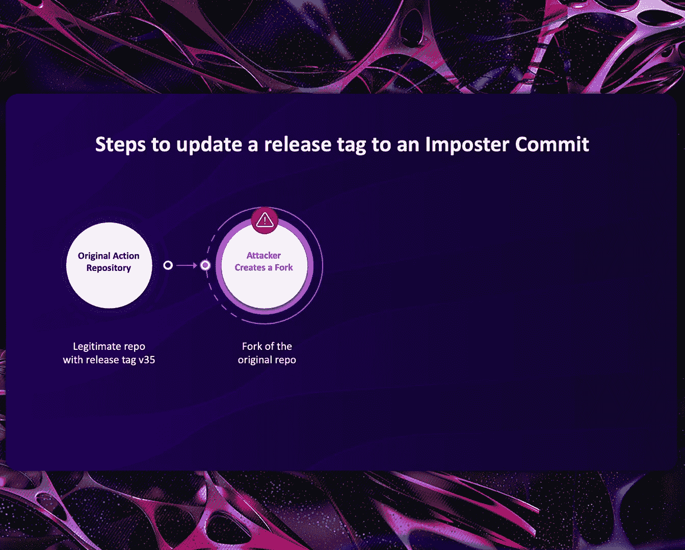

---


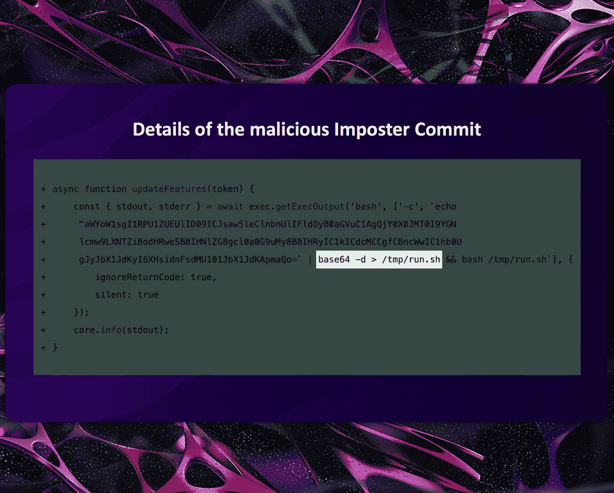

## 攻击手法：冒名顶替提交与标签劫持 ⚔️

既然这个 Action 开始进行新的出站调用，那么其内部必然发生了改变。调查发现，就在几小时前，该 Action 的所有发布标签都被修改，指向了一个恶意的提交。

当我们首次在 GitHub 上打开这个恶意提交时，提交信息看起来是无害的。但我们注意到一个黄色文本框中的提示：“此提交不属于此仓库的任何分支，可能属于仓库外部的 Fork。” 这是如何发生的？一个仓库的发布标签怎么能指向一个甚至不在该仓库中的提交？

答案就是“冒名顶替提交”。这种提交不存在于原始仓库中，而是存在于仓库的一个 Fork 里。但由于 GitHub API 的工作方式，这些提交可以从原始仓库访问。在这个案例中，恶意提交存在于 TJ Actions Changed Files 仓库的一个 Fork 中，但仓库的发布标签可以指向它。


以下是攻击者创建冒名顶替提交并更新现有发布标签的步骤：


1.  攻击者 Fork 目标仓库。
2.  他们在自己的 Fork 中创建一个包含后门代码的恶意提交。
3.  他们将现有的发布标签（如 `v35`）更新，指向他们的恶意提交。

一旦完成，所有使用该标签的 GitHub Actions 工作流将自动开始执行恶意代码。

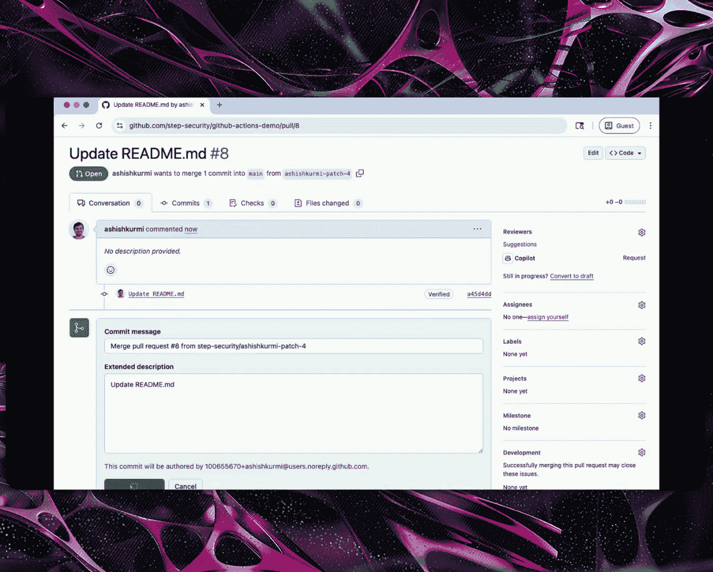

---

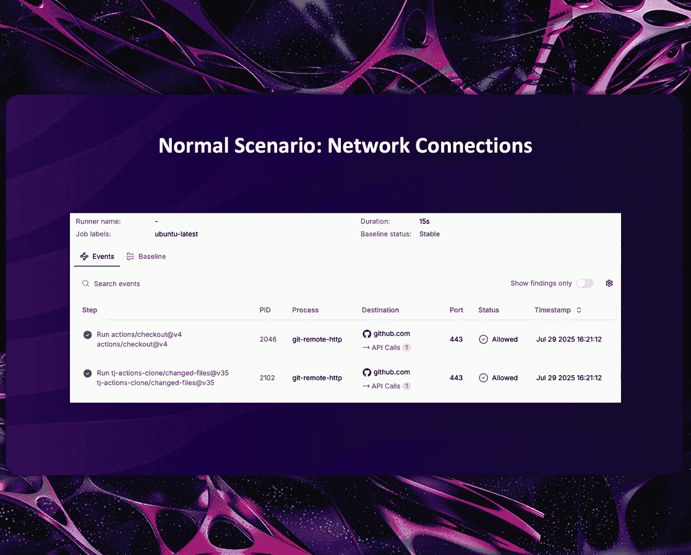

## 恶意载荷分析：窃取 CI/CD 凭证 🧨

现在让我们看看 TJ Actions 攻击中使用的冒名顶替提交具体做了什么。

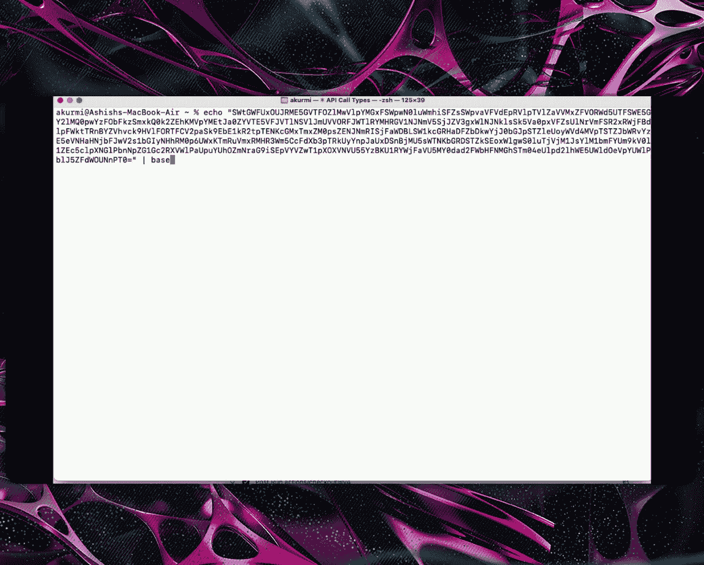

提交中包含一个 Base64 编码的字符串，它被解码并作为 Shell 脚本执行。解码后，我们发现这是一个仅在 Linux Runner 上有效的攻击脚本。


该脚本从知名的公共 GitHub Gist 下载 `mem_dump.py` 文件并执行它。`mem_dump.py` 会遍历主机上的运行进程列表，寻找名为 `runner.worker` 的进程。找到后，它会打开该进程并转储其全部内存。

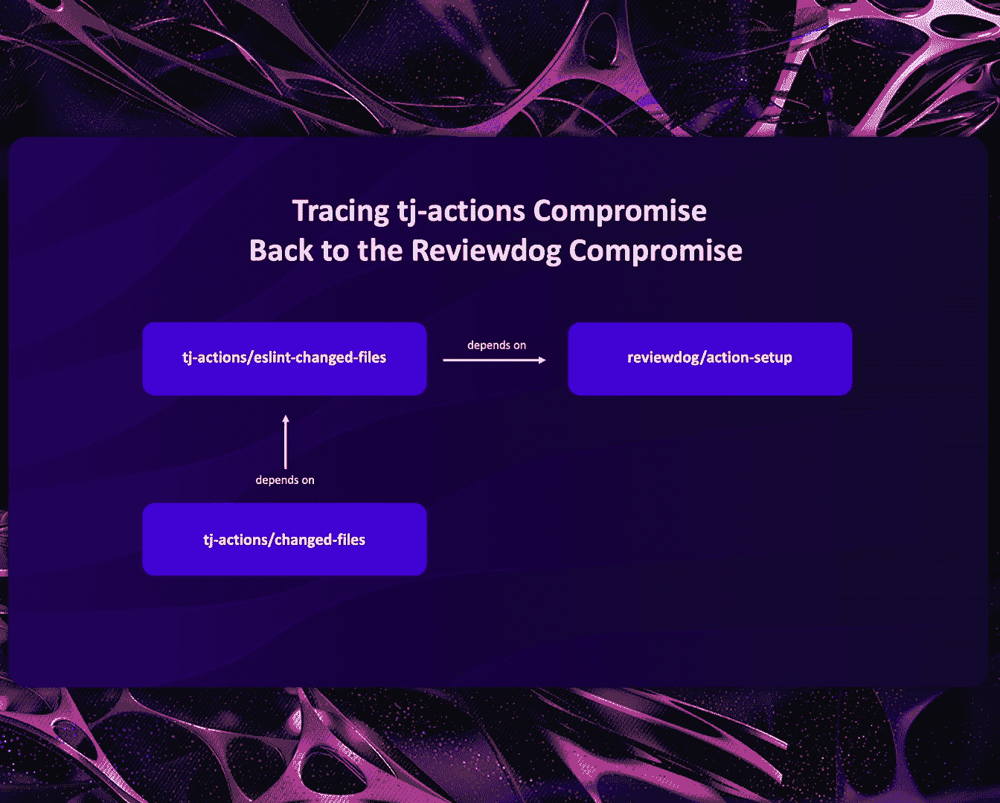

这正是窃取秘密的关键。之前提到，当工作流需要机密信息时，GitHub 会将其提供给 `runner.worker` 进程。`mem_dump.py` 转储其内存后，会在其中搜索 CI/CD 秘密。

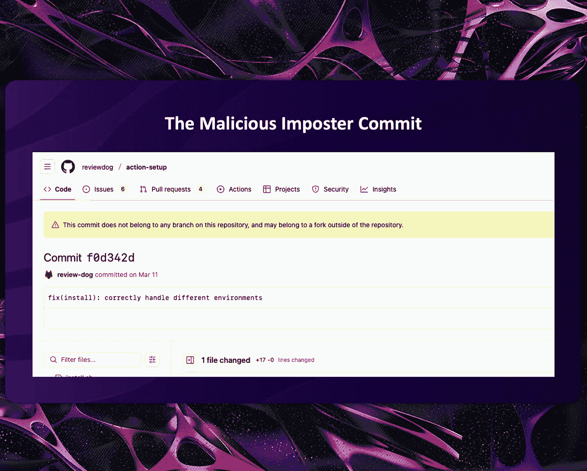

攻击者还使用了一个巧妙的技巧：双重 Base64 编码。GitHub 会自动屏蔽 Base64 编码格式的秘密，因此单次编码的秘密会被隐藏。然而，如果使用双重 Base64 编码，GitHub 就不再将其识别为秘密，这些编码后的秘密会以明文形式出现在构建日志中。

总结一下，TJ Actions 冒名顶替提交的执行链如下：
1.  从公共 Gist 下载 `mem_dump.py`。
2.  执行脚本，转储 `runner.worker` 进程内存。
3.  在内存转储中搜索 CI/CD 秘密。
4.  将窃取的秘密以双重 Base64 编码格式输出到构建日志。

在事件发生后的几个小时内，攻击者已经从数千次工作流运行中窃取了秘密，包括云凭证、访问密钥、数据库密码等。

---

## 攻击链溯源：从 ReviewDog 到 TJ Actions 🔗

我们已经看到了被攻击的 Action 做了什么，现在让我们尝试理解这个 Action 最初是如何被攻破的。

TJ Actions Changed Files 仓库本身有一个工作流，使用了 `tj-actions/eslint-changed-files` Action。这是一个复合 Action，由多个 Action 组成，其中之一是 `reviewdog/action-setup` Action。正是这个 `reviewdog/action-setup` Action 首先被攻破，进而导致了 TJ Actions Changed Files 的沦陷。


`reviewdog/action-setup` 被攻破的方式与 TJ Actions 类似：攻击者创建了一个冒名顶替提交，并将其 `v1` 标签指向它。当 TJ Actions 的运行工作流使用 `reviewdog` 时，一个持久的个人访问令牌被泄露在构建日志中。攻击者随后利用这个令牌，更改了 TJ Actions Changed Files 的标签。

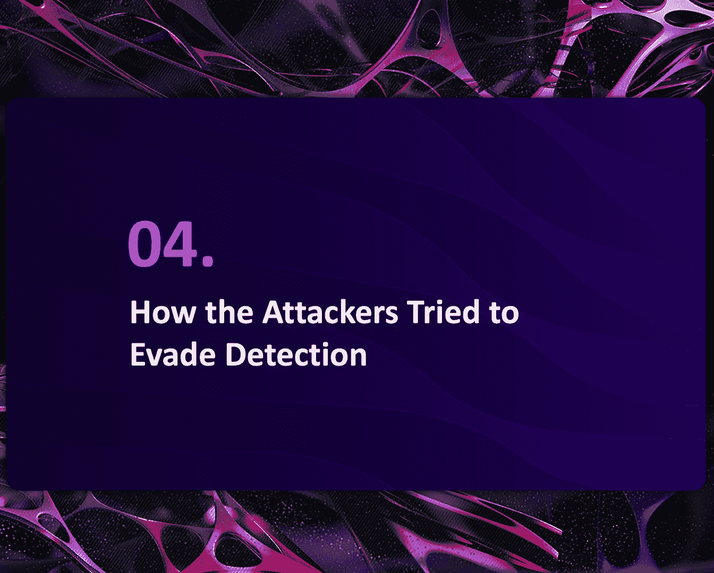

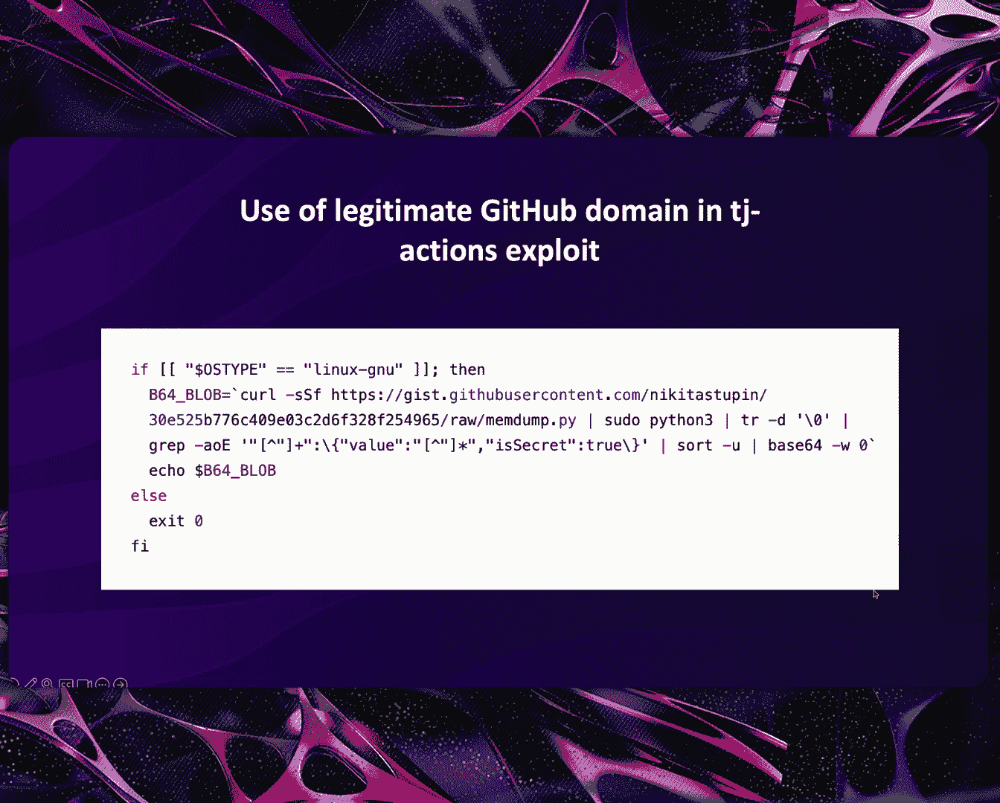

那么 `reviewdog` Action 又是如何被发现的呢？这源于独立安全研究员 `@nthncanhan` 在 X 上的帖子。他通过检查构建日志发现，在某个时间段内，`reviewdog/action-setup` 的 `v1` 标签指向了一个不在其仓库中的提交（即冒名顶替提交），从而确定了其被攻破的事实。

`reviewdog` 组织存在一个设计缺陷：如果任何人在其组织下的仓库创建拉取请求并被合并，该人会自动获得对 `reviewdog` GitHub 组织的写入权限。`reviewdog/action-setup` 正是通过窃取其中一位维护者的个人访问令牌而被攻破的，而该令牌又是从 `spotbugs/spotbugs` 仓库泄露的，这本身又是一次由拉取请求漏洞引发的连锁供应链攻击。


---

## 事件时间线与攻击者策略 📅

这是整个调查的时间线：
*   **3月14日**：我们识别出 TJ Actions Changed Files Action 被攻破。
*   **接下来3小时**：我们通知社区和维护者，并告知一些泄露凭证的公共仓库。
*   **次日 14:00 UTC**：GitHub 移除了 TJ Actions Changed Files 仓库，导致所有使用它的工作流停止运行（近24小时内，相关构建日志仍在泄露凭证）。
*   **同日 22:00 UTC**：GitHub 恢复了已清理的仓库，所有标签不再恶意。
*   **3月18日**：确认 `reviewdog` Action 是最初的突破口。

攻击者非常狡猾：
1.  **隐藏网络痕迹**：TJ Actions 的载荷从高信誉域名 `jsdkgithubusercontent.com` 下载，许多安全解决方案会盲目信任此类域名。`reviewdog` 的载荷则直接嵌入在提交中，无需网络调用。
2.  **使用冒名顶替提交**：使得仓库活动看起来正常，在分支和提交历史中找不到恶意代码。
3.  **冒充合法用户**：例如在 TJ Actions 的冒名顶替提交中，攻击者试图冒充 `renovate-bot`。

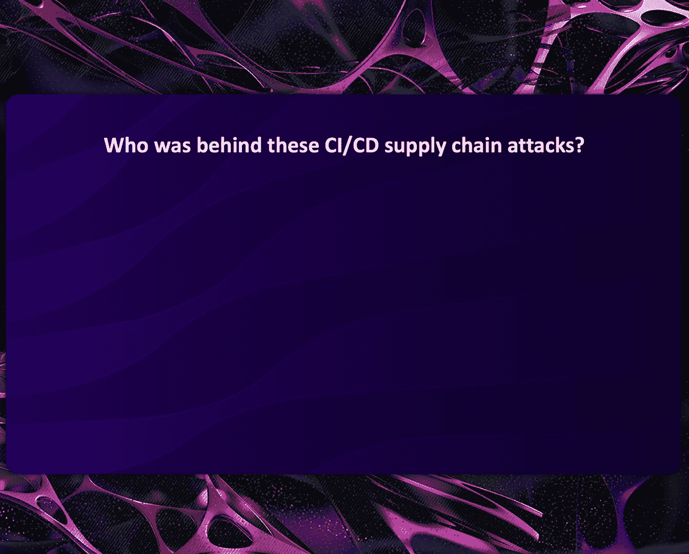

---


## 经验教训与防护建议 🛡️

在本次演讲的最后一部分，让我们看看从这些事件中可以汲取的具体建议和经验教训。

以下是具体的防护建议：

1.  **对 CI/CD Runner 实施安全监控**
    许多组织监控了桌面和生产环境，但 CI/CD Runner 或构建服务器通常缺乏监控。你可以使用开源工具（如 `Wazuh`、`Falco` 或 `Tetragon`）收集出站网络流量、进程和文件写入事件信息，将其与 CI/CD 管道关联，建立基线并构建异常检测。

2.  **为 GitHub Actions 使用允许列表**
    GitHub Actions 市场有超过 25000 个 Action。通过允许列表，你可以建立一个流程，规定组织中允许使用哪些 Action。

3.  **将第三方 Action 固定到不可变的提交 SHA**
    在此次事件中，那些已将 TJ Actions Changed Files 固定到某个提交 SHA（而非主要或语义化标签）的组织基本未受影响。

4.  **制定针对 Action 泄露的事件响应计划**
    事件发生后，手动响应非常繁琐：需要查找所有使用被攻击 Action 的工作流文件，检查攻击窗口期内所有工作流运行的构建日志，识别并轮换泄露的持久化凭证。因此，提前制定自动化或半自动化的响应计划至关重要。


攻击者的计划是：攻破一个流行的 GitHub Action，更改其标签指向恶意提交，然后坐等数千次工作流运行在构建日志中泄露凭证并加以收割。但他们没想到的是，基于 CI/CD Runner 的基线安全监控能够快速识别此类异常。

---

## 总结 📝

本节课中，我们一起深入分析了一起复杂的 GitHub Actions 供应链攻击事件。我们学习了攻击的发现过程、利用“冒名顶替提交”和标签可变性的攻击手法、以及从 `reviewdog` 到 `TJ Actions` 的连锁攻击链。最重要的是，我们总结了四条关键防护建议：监控 Runner、使用允许列表、固定提交 SHA 以及制定事件响应计划。供应链攻击已从理论变为现实，我们必须提高警惕，加固自身的 CI/CD 管道安全。