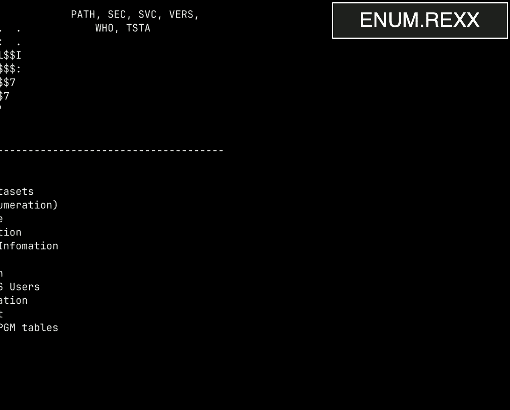

# 课程名称：Unix Underworld：探索z/OS的黑暗面 [课程编号：3wQHhGxVTuo] 🔍

## 概述
在本节课中，我们将学习IBM大型机操作系统z/OS中一个关键但常被忽视的组成部分——Unix子系统。我们将探讨其安全模型、常见的攻击路径，以及如何利用已有的Unix知识来理解和测试这个平台的安全性。你会发现，你对于“入侵”大型机所了解的知识，可能比你想象的要多得多。

---

## 演讲者介绍

我是Chad Rikansrud，一名软件安全研究员，就职于Broadcom。我的工作是发现大型机软件中的漏洞。我成长于90年代的“黑客小子”文化，热衷于逆向工程和突破限制。

我是Philip Young，Netsby公司的大型机渗透测试总监。很多人也叫我“Fortran战士”。同样，我也是一名90年代的“黑客小子”，并且是大型机网络安全的狂热爱好者。

我们两人在这个领域合作已有十年。此外，我们还要感谢Mark Wilson，他在我们之前就开始了这方面的工作，是我们进入这个领域的引路人。

---

## 什么是大型机？

早期的“大型机”指的是装满CPU的“主框架”，其余部分只是输入输出设备。如今，整个系统可以集成在一个机柜中。这样的系统每天都在处理价值数十亿甚至数万亿的交易。

金融、政府、大型零售商、医疗保健、航空和航运等行业都依赖这个平台。它的高可靠性和稳定性使其默默无闻地支撑着现代社会。

---

## 关键术语

在深入之前，我们先了解几个核心术语：

*   **RACF**： 外部安全管理器。你可以将其类比为Active Directory，负责控制身份验证和授权。它是IBM的产品，本课程主要讨论它，但原理也适用于其他ESM（如ACF2、Top Secret）。
*   **APF授权**： 授权程序设施。这是一个操作系统控制机制，决定你的进程是否能在CPU层面获得超级用户权限。
*   **特殊属性**： 用户在RACF中可能拥有的特殊权限。拥有这些属性，你在RACF中的权力几乎是无限的。
*   **Key 0**： 大型机上所有内存都有一个关联的存储键。进程也有一个键。通常，进程只能读写相同键的内存。**Key 0**是一个特殊的键，允许读写**任何**内存。

了解这些术语有助于我们理解后续的攻击路径。

---

## 破除神话

十年前，当我想开始测试这个平台时，经常听到这样的说法：“大型机不可能被入侵”、“它有神奇的防护”。如今，这种观念正在改变，但仍有部分人认为这个平台固若金汤。

本课程的目标之一就是打破这个神话。

---

## 攻击路径概览

如果你在其他平台（如x86、ARM）上进行过安全测试，那么大型机的攻击路径对你来说会非常熟悉：

1.  **网络攻击**： 使用TCP/IP、Web应用等，与其他平台完全相同。
2.  **文件系统攻击**： 针对MVS数据集和Unix文件，原理相同。
3.  **外部安全管理器配置错误**： 安全设置不当，与其他平台无异。
4.  **z/OS Unix子系统**： 这是我们本节课的重点。

**z/OS Unix**（也称为Unix System Services、OMVS或z/OS UNIX）是z/OS的一个Unix-like接口。它不是一个容器，也不是独立的操作系统，而是一个接口。对许多人来说，这是了解大型机的“入门途径”，因为它非常熟悉。

---

## 探索Unix子系统

在z/OS Unix中，你会发现熟悉的元素：
*   **Shell**： 例如 `sh`。
*   **分层文件系统**： 从根目录 `/` 开始。
*   **文件系统权限**： 采用三组八进制位（读、写、执行），与Linux/Unix相同。

你可以通过TSO的 `oshell` 命令或直接使用 `ssh` 访问它。运行一些命令，你会发现操作方式与你熟知的Unix环境几乎一致。

---

## 枚举工具

在渗透测试中，第一步通常是信息枚举。以下是一些可用于z/OS Unix的开源工具：

*   **`enum.rex`**： 一个REXX脚本，从内存中提取信息（如安全配置），有时能访问到通常无法直接获取的数据。
*   **`OMVSEnum.sh`**： 基于LinEnum，用Shell编写，进行大量检查，包括在RACF中的访问权限，帮助从Unix内部分析系统。
*   **`ZShog`**： 类似于TruffleHog，用于在Unix文件系统中搜索密码、令牌等敏感信息。

所有这些工具都是开源的。我们通常会将所有脚本打包成一个JCL文件上传，以解决文件传输和编码（EBCDIC/ASCII转换）的问题。

枚举时，我们还会尝试进行“出站测试”，扫描外部网络。令人惊讶的是，许多大型机拥有直达互联网的开放连接。

---

## 枚举结果分析

通过枚举脚本，我们可能会发现以下问题：

1.  **RACF数据库信息**： 例如，密码是否仍在使用较弱的DES-based算法加密，而非更强的AES-based算法（KDFAES）。
2.  **无需密码切换为root**： `su` 到root用户时不需要密码。
3.  **危险的文件权限**： 例如，在 `/bin` 目录下发现全局可读、写、执行（777）的shell脚本或配置文件。
4.  **特权挂载能力**： 拥有进行特权文件系统挂载的权限。
5.  **APF授权能力**： 能够成功执行 `extattr +a` 命令，为程序添加APF授权位。

`ZShog` 工具可能会在文件中发现明文存储的凭证，例如 `.properties` 文件中的用户名和密码。

---

## 演示攻击影响

发现漏洞后，我们需要证明其影响。

**攻击1：利用存储的凭证**
最常见的问题是凭证以明文形式存储在权限设置不当的文件中。例如，一个被设置为777权限的脚本中包含数据库凭证。攻击者可以直接读取并使用这些凭证。

**攻击2：SSH密钥注入**
如果我们能 `su` 到root（即使无需密码），我们可以在root的 `.ssh/authorized_keys` 文件中添加我们自己的公钥，从而获得持久的root shell访问权限。这在Unix层面是“游戏结束”。

**攻击3：利用APF授权实现权限提升**
这是更高级的攻击。首先，我们需要理解APF授权。

*   **CPU状态**： z/Architecture CPU有两种状态：**问题状态**（普通）和**管理状态**（特权）。特权指令（如切换内存键）只能在管理状态下执行。
*   **APF控制**： 操作系统通过APF授权控制哪些程序可以切换到管理状态。在Unix中，程序通过 `extattr +a` 命令获得一个APF授权位。
*   **攻击流程**：
    1.  通过枚举发现拥有运行 `extattr +a` 命令的权限（需要访问 `BPX.FILEATTR.APF` 配置文件）。
    2.  编写一个汇编程序，其核心是执行 `PC`（程序调用）指令切换到管理状态和Key 0。
    3.  在Unix中汇编、链接该程序。
    4.  使用 `extattr +a` 命令为该程序添加APF授权位。
    5.  运行该程序。成功后，进程便拥有了Key 0权限。
*   **绕过RACF**： 仅拥有Key 0还不够，因为RACF仍在检查你的权限。RACF将用户权限缓存在一个称为**ACEE**的控制块中。我们的攻击程序可以利用特权，在内存中为另一个高权限用户（例如Phil）伪造一个新的ACEE，然后修改我们进程的指针指向这个伪造的ACEE。这样，当RACF检查权限时，就会认为我们是Phil。

**攻击4：特权挂载攻击**
z/OS Unix的文件系统挂载点背后是MVS数据集。APF授权位存储在这些数据集内部。
*   如果我们拥有**特权挂载**的能力（通过特定RACF权限或root身份），就可以进行以下操作：
    1.  在测试环境中创建一个ZFS文件系统。
    2.  在其中放置我们编写的攻击程序，并为其设置APF授权位和setuid位。
    3.  卸载该文件系统，并将其打包。
    4.  在目标系统上上传、恢复并**特权挂载**这个文件系统。
    5.  运行其中的程序，系统会认可我们在其他系统上设置的APF授权，从而实现权限提升。

---

## 缓冲区溢出

许多Unix程序是用C语言编写的。长期以来，人们认为大型机上无法进行缓冲区溢出攻击，直到有人证明了其可能性。

如果存在缓冲区溢出漏洞的程序**同时是APF授权的**，那么利用该溢出就可以直接获得我们之前讨论过的管理状态和Key 0权限。你可以使用 `find / -type f -ext a` 命令轻松查找所有APF授权的程序。

关于大型机缓冲区溢出的深入技术细节，可以参考Jake Laperruque和Chad Rikansrud在Defcon上的演讲，以及他们提供的Github workshop材料。

---

## 其他攻击面

*   **ESM权限覆盖文件系统权限**： 如果配置了RACF来管理Unix文件系统安全，它可能会**覆盖**文件本身的权限位。这可能导致两种情况：1) 文件显示为777但你无法访问（更严格）；2) 文件权限正确但RACF给了你访问权（更宽松）。这可能会造成混淆。
*   **全局可写的关键文件**： 例如，在 `/bin` 中发现全局可写的shell脚本，该脚本在用户登录时执行。攻击者可以直接编辑它以获得持久化访问。
*   **Web应用漏洞**： 大型机上也运行Web应用。我们曾发现存在本地文件包含漏洞的Web应用，通过它可以访问原本无法读取的Unix文件。

---

## 防护与检测建议

**防护措施：**
1.  **检查文件权限**： 定期审计，避免全局可读/写/执行的文件。
2.  **限制高危权限**： 以下RACF权限应严格控制，最好仅用于“应急”账户，而非日常账户：
    *   `BPX.SUPERUSER`
    *   `BPX.FILEATTR.APF`
    *   `BPX.DAEMON`
3.  **启用Unix文件系统审计**： 使用 `ls -E` 查看文件的审计属性。管理员可以配置系统，对关键文件的**所有**访问尝试（成功和失败）生成日志。将审计属性从默认的 `f`（仅失败）改为 `a`（全部）。

**检测措施：**
1.  **分析系统日志（SMF）**： 关注成功和失败事件。
    *   频繁的 `su` 到root成功记录。
    *   频繁的APF授权操作。
    *   对文件的大量未授权访问尝试（表明有人在扫描）。
    *   大量的出站TCP连接（表明可能存在扫描或数据外泄）。
2.  **实施出口过滤**： 严格限制大型机直接访问互联网，避免开放SMTP中继等风险。

---

## 社区与致谢

大型机安全社区正在不断成长。我们要感谢所有为此做出贡献的研究人员和社区，如Moshax的YouTube频道和Discord、Share上的大型机网络安全社区等。同时，也要感谢IBM等公司与我们进行的建设性合作，共同提升平台安全性。

---

## 总结

本节课我们一起探索了z/OS Unix子系统的安全世界。我们了解到：
*   大型机并非无法入侵，它面临着与其他平台相似的安全挑战。
*   你的Unix知识是理解和测试这个平台的强大基础。
*   常见的攻击路径包括配置错误、权限滥用、APF授权漏洞和缓冲区溢出。
*   通过使用现有的工具和方法论，并理解平台特有的概念（如RACF、APF、Key 0），你可以有效地对大型机进行安全评估。

记住，安全是一个持续的过程，在这个古老而关键的平台上也不例外。