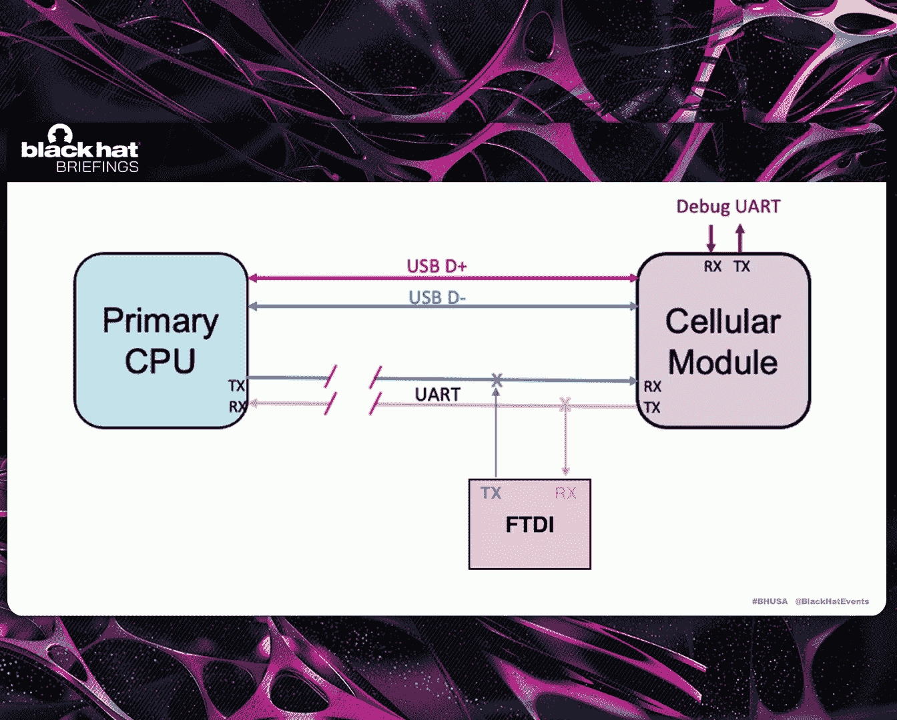
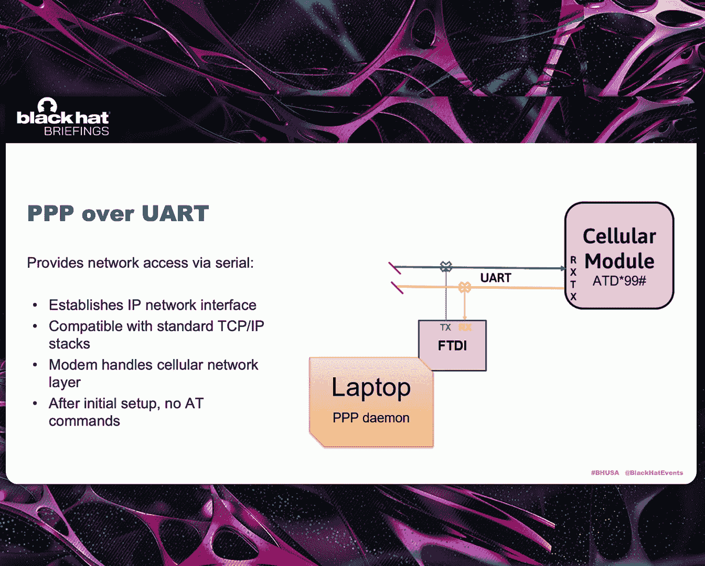
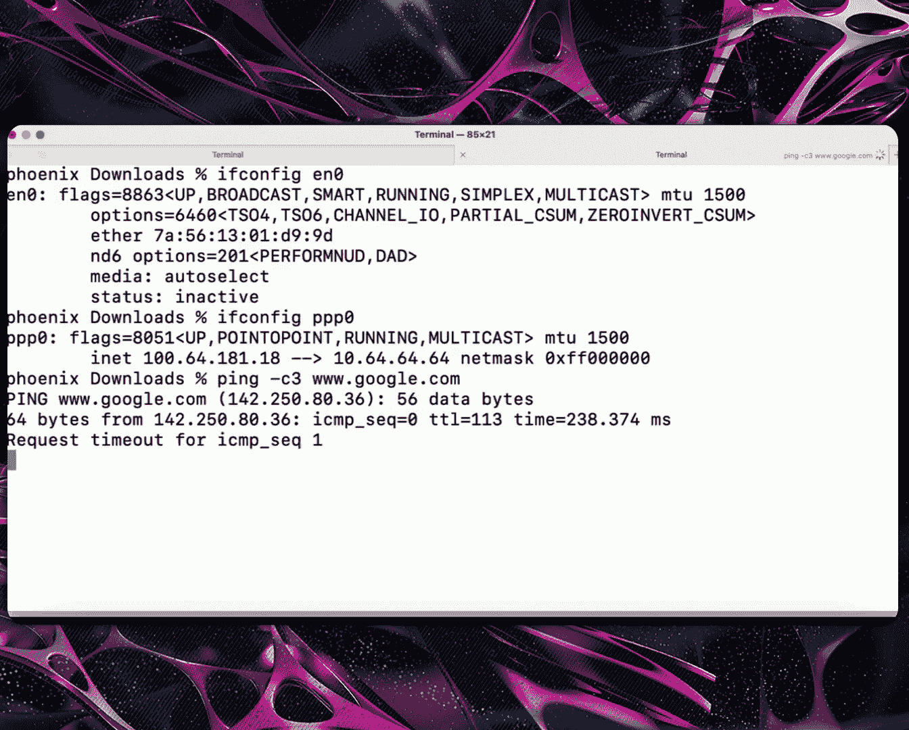

# 课程 01：基于蜂窝物联网技术的武器化——利用智能设备建立立足点 📡

在本课程中，我们将学习如何利用物联网设备的蜂窝通信模块，通过物理硬件交互和AT命令控制，将其转变为攻击跳板，从而访问其信任的网络资源。

---

## 项目介绍

我和Carlotta大约在两年前开始这个项目。项目最初源于我们的观察。多年来，我们都从事物联网评估和渗透测试工作，注意到蜂窝技术在物联网中的应用日益增长，但我们严重缺乏有效的知识和测试方法。

我们的目标是深入研究，理解蜂窝物联网的含义，构建测试方法，并解答相关的安全问题。

我们的研究主要聚焦于两种技术：
*   **NB-IoT**：半双工，高延迟。
*   **LTE-M**：速度更快，低延迟，全双工，常用于传输语音、图像、视频等数据量更大的设备。

当我们深入研究时，考虑到蜂窝通信通常是加密的且受FCC监管，为了有效测试，我们将重点转向了**芯片间通信**，即设备主CPU与蜂窝模块之间的通信。这部分通信在大多数设备上通常不加密，使我们能够更深入地与设备交互。

随着研究的推进，我们开始关注这些物联网硬件的**信任关系**。这些设备能访问什么？它们能获得什么访问权限？它们可以访问云服务、互联网，甚至通过私有APN访问私有网络。

我们接下来的目标，也是今天要讨论的，就是**瞄准这种信任关系**。我们将通过控制芯片间通信，从而完全控制蜂窝模块来实现这一目标。

---

## 硬件通信基础

上一节我们介绍了项目的宏观背景，本节中我们来看看如何与蜂窝模块进行硬件层面的通信。

在硬件层面，主CPU与蜂窝模块之间主要有两种通信路径：
1.  **USB**：通常指实现USB基本功能的USB 2.0高速接口。
2.  **UART**：通用异步收发传输器。蜂窝模块上通常有两个UART接口，一个是用于登录或查看启动日志的调试接口，另一个主UART则连接到主CPU。

当CPU与蜂窝模块通信时，它们使用**AT命令**。AT是“Attention”的缩写，最初于1981年为智能调制解调器设计，至今仍用于蜂窝模块。这是因为它们是一种简洁的文本字符串命令接口。

AT命令用于配置设备连接到蜂窝网络、进行管理更改、诊断以及更新设备固件。请注意右侧的AT命令手册截图，我们稍后会提到它。

AT命令大致可分为四类：测试、读取、写入和执行。有些命令可能同时具备测试、读取和写入功能，或者仅用于特定配置。执行类命令则用于让蜂窝模块执行特定操作。

虽然AT命令有四种类型，但3GPP（制定电信标准的组织）只要求制造商在设备上实现某些基本的AT命令，主要用于连接蜂窝网络和拨打电话。然而，物联网设备使用多种协议，因此制造商开发了各自特定的命令来实现更高级的功能，例如执行HTTP命令、打开套接字等。

右侧列出了部分制造商及其自定义命令前缀，例如Quectel使用`AT+Q`，ublox使用`AT+U`。这只是其中一部分，还有更多制造商有自己的自定义命令。

正如之前提到的AT命令手册，你可以在其中找到特定蜂窝模块的几乎所有信息。制造商通常会为特定模块型号发布AT命令手册，其中包含参数、命令说明，甚至命令运行后的响应示例。

---

## 物理交互与硬件破解

现在我们知道了与设备通信的协议（AT命令），接下来让我们看看如何在实际设备上进行物理交互。

为了能与设备上的蜂窝模块交互，我们需要能够接入设备。我经常使用的一种方法是**透视图分析**。具体做法是拍摄电路板正反两面的图像，然后将它们叠加在一起。这样可以同时看到电路板的两面，有助于识别芯片、表面走线、过孔等。

接着，我们获取实际的数据手册，并将芯片的焊球阵列图覆盖到实际设备图像上。这样就能更容易地识别出UART、USB等接口的位置，从而知道在电路板的哪个位置尝试接入通信。

但事情并非总是如此简单。我们经常会遇到无法直接访问的情况。这时该怎么办？看看幻灯片，你可能会想：“用针灸针？”答案是：没错。

以下是一个例子：如果能把模块侧立起来，看到焊球阵列的边缘，就可以使用针灸针插入芯片或蜂窝模块主体下方，从而访问USB和串行通信。

如果这种方法行不通，情况会变得更复杂。我们可以将设备拆开，使用热风枪进行IR回流焊，将模块从电路板上取下，然后绘制我们自己的电路。这是一个概念验证的测试样本，难度如何？实际上相当简单。使用焊盘修复套件，我能够在模块下方布线，并使用UV固化掩膜覆盖以防止短路。然后重新焊接芯片或模块，这样我们就能够接入那些关键的通信电路，从而使用AT命令与模块通信并控制它。

下一步是，如果这些方法都不奏效呢？这时就需要深入电路板内部。我成功过几次。关键在于确定你认为走线所在的位置，切割电路板，找到实际的电路走线，并在电路板的子层上接入它们。这要复杂得多，但如果你耐心细致，是能够成功接入这些关键通信电路的。

---

## 通过UART进行武器化

现在我们已经知道如何与调制解调器对话，也了解了如何进行硬件破解，接下来我们将结合这两者，看看如何通过UART进行武器化。

这张图展示了一个连接UART并能够向蜂窝模块发送命令的简单设置。我们实际上切断了主CPU和蜂窝模块之间在UART上的连接，并用我们的FTDI设备取而代之。在中间截图中，我们在TX和RX线上找到了两个位置并焊接了导线，然后切断了它们之间的走线。

接着，你可以将导线连接到一个分线板上。注意分线板中间有开关，这允许我们控制主CPU和蜂窝模块之间的全部通信。当开关打开时，设备可以继续按预期运行；当我们关闭开关时，就可以接管控制并开始发送AT命令。

我之前提到制造商为HTTP和打开套接字提供了大量命令。因此，我们实际上创建了一系列脚本，利用AT命令来重现我们在渗透测试中通常使用的工具，包括端口扫描器、HTTP代理等。接下来我将演示一个使用AT命令实现的S3存储桶扫描器。

现在我在一个串行终端中，等待模块启动并响应。它显示“Ready”，我发送了一个`AT`命令，它回复了`OK`。

这个脚本可以接受存储桶名称（单个名称或文件列表）、要查找的文件扩展名、目标S3端点以及你笔记本电脑上连接的串口。我还加入了`--assume-on`选项，这样如果设备已经启动，它就不会一直等待。

通过使用AT命令创建这些工具，我们可以复制功能，并攻击设备所连接网络内的内部资源或互联网上的主机。如你所见，它正在遍历目标S3存储桶（这是一个专门为此演示设置的存储桶）。所有信息都被保存到一个文件中。最后，我们在那个S3存储桶中找到了`flag.txt`文件，结果被保存到一个JSON文件中，之后可以用`jq`进行解析。

虽然用AT命令重现工具很棒，但由于AT命令的简单性，也存在一些限制。更复杂的身份验证和负载交换有时会变得困难。因此，我们转向了**通过UART的PPP**。

这允许我们通过蜂窝模块建立网络访问。蜂窝模块作为PPP服务器，我们运行PPP守护进程作为客户端。你会被分配一个IP地址，实际上是通过蜂窝模块上网。`ATD*99#`就是我在演讲前面提到的那个执行命令。

为了让设置更容易（因为在实际系统上设置PPP有时会很麻烦，且有很多不同的参数），我创建了一个简单的Python脚本，并在这里进行演示。

在演示中，我展示了当前没有`ppp0`接口，我连接着家里的无线网络并有一个IP地址。我还对Google运行了`ping`命令，稍后你会明白为什么——`ping`命令的往返时间大约是43到46秒。

这是`cell_ppp.py`脚本，它接受你连接的FTDI接口、波特率以及为蜂窝模块配置的APN。现在它正在确保模块就绪，`ATE0`命令是为了确保所有命令都打印出来以便查看。它正在建立`ppp0`接口连接。我们被分配了一个IP地址，甚至还有DNS。脚本随后会将其更改为我们的默认路由。我禁用了Wi-Fi，所以不再有家庭网络连接，但我有一条通过`ppp0`的路由。

让我们再次运行那个`ping`命令。一开始出现了大约67%的数据包丢失。不幸的是，情况确实如此，但随着持续运行，情况会有所改善。现在我通过PPP over UART运行一个不那么安全的AWS枚举脚本（来自某个枚举仓库）。这个演示被加速了，因为我实际运行这个工具的时间大约是40到45分钟，而在我的家庭网络上运行可能只需要3分钟。但它确实有效。如果你有足够的耐心，愿意在它运行时去喝杯咖啡，你实际上可以通过PPP over UART对云主机进行枚举或运行任何其他工具。

那么，使用UART和AT命令的优缺点是什么？
*   **优点**：所需努力程度较低；PPP over UART在某些情况下可用。
*   **缺点**：速度慢，数据吞吐量有限；有些蜂窝运营商已停止对PPP的支持。

还有一种替代方案是使用USB。接下来我将把演讲交回给Darll，让他谈谈如何通过USB进行武器化。

---

## 通过USB进行武器化

正如演示中提到的，有两种通信通道：串行和USB。通常在这些设备上，即使模块都支持，大多数产品也不会同时实现两者，产品要么使用一种，要么使用另一种进行控制和通信。在我们研究的案例中，设备是一个摄像头系统，它使用的是USB。

当我开始思考如何以任何真正可用的方式与之交互时，我会遇到什么样的技术问题？我们甚至从哪里开始？我上网查阅了大量资料，试图理解这意味着什么。我们需要处理一些问题。

在USB通信中，电路中可能存在终端或阻抗匹配电阻。因此，如果你要开始修改USB电路，需要考虑这些因素。你还需要处理差分线对（D+和D-）之间的走线长度偏差，不能一条线比另一条长太多。对于USB 2.0协议，其容错性很强，所以你可以轻松做到这一点而不会有大问题。但如果是USB 3.0设备，要保持在偏差距离内就复杂得多。

我们还有走线分支的问题。如果要修改电路，必须考虑不要在板上留下任何不从一点到另一点的走线，这会导致信号反射。因此，你必须处理信号衰减、阻抗匹配、串扰噪声和信号反射等问题。

我开始研究如何实现交互。我找到了一个德州仪器的设备，它是一个多路复用器，具体是1对2的（在我们的案例中是2对1）。这个芯片有很好的手册，我可以开发自己的板子。进一步研究后，我发现中国有一款预组装的板子。这块板子大约有一角硬币大小（在电子世界里这实际上非常巨大），试图将其接入设备可能会带来问题，但它确实解决了我的一些电气或电子要求。

然后我开始思考如何有效地将其接入实际电路。从电气原理上看，我们有蜂窝模块、设备的主CPU，我们想把多路复用器放进去。我们想要实现的是**切换主机**的能力——从CPU切换到我们的笔记本电脑。作为这种针对性攻击的一部分，目标是利用硬件的信任关系。这个硬件在启动时，会经历完整的身份验证过程，通过其APN，可能通过VPN功能进行外部验证，也可能验证各种云服务或功能。我们希望能够利用这一点。所以目标是：我们保持连接CPU，让蜂窝模块和CPU为我们完成所有身份验证和协商。一旦我们认为这些已完成，我们就希望通过多路复用器将设备切换到笔记本电脑，控制电路并实际用它来路由我们的数据。

这是实际的电路板。我们需要小心设备上的悬空走线。你看到那里的USB走线，我们切断了这些线路，将它们完全从电路中移除。然后我们在这里焊接导线，需要保持连接到我们设备的导线长度合适，以避免因长度偏差导致电路错误。

完成后，我们将设备接入。我们有一个开关S，用于在线路1和线路2之间切换。OE接地以确保设备上电。当OE接地时，多路复用器设备将上线并工作。目标是将整个东西接入，我们在设备上安装了一个高的夹层接头，使其更远离主板，因为所有东西都需要放在蜂窝设备和实际设备的主电路板之间。

从这里，我们将导线连接到多路复用器，接通电源，并连接下方的导线。在这个过程中，我的初步目标是先别管USB的线路2，先让这个多路复用器在电路中工作起来。所以我这样连接，给设备上电，让CPU保持连接，通过多路复用器路由所有流量。设备启动运行，验证其服务，开始发送图像和图片，此时功能完全正常。

下一个目标是尝试接入这个多路复用器，看看能否利用它。我做的第一件事是使用一个预制的USB插头单元。我将其接入电路，将D+连接到D+，D-连接到D-，然后启动，但什么也没发生。只有噪音。于是我接上一个USB在线嗅探器检查，发现它不断尝试协商到更低的速度，但全是错误。经过研究，这种错误的常见原因是D-和D+接反了。我不确定这些线是否标记正确，所以我放弃了，把它扔进了垃圾桶。我直接焊接了一个插头到设备上，我知道插头上的接线标准和颜色编码。我将其接入实际电路。我们能够插上它，我通过USB线连接到我的笔记本电脑。当你用这种线连接时，长度有限。通常USB标准允许很长的线缆，但如果你直接将长线缆连接到蜂窝设备模块上，如果不保持短线，电路负载会很快增加。所以我们在中间接入了USB在线嗅探器。

现在让我们进行演示，看看我们能用它做什么。当我们启动时，那是我的串行控制台，我可以看到它是否就绪。那是我的多路复用器和USB捕获设备。你可以看到，当我切换到我的笔记本电脑时，通信发生了。此时，我没有连接到任何网络服务，所以我们得到“网络不可达”。我还在我的Mac上运行了一个特定命令，可以看到没有任何迹象表明存在蜂窝设备。

现在让我们开始操作。我们给设备上电，它进入就绪模式。我发送一个`AT`命令给它，确认正常。让我们拨动开关看看会发生什么。我们拨动开关切换到线路2，瞬间我们得到了数据，它给了我们一个网络接口卡。现在，我们正在通过这个物联网设备的USB，利用电路中的多路复用器，路由整个Mac笔记本电脑。

我们可以`ping`通。如果我们跳过去查看设备上的USB，可以看到我们有`ecm0`。让我们再深入一点。我们将通过物联网设备的蜂窝功能，对一个设备发起SSH Metasploit暴力攻击。我们将进行四次尝试，最后一次是正确的密码。它为我们建立了一个Metasploit会话。我们看到会话已启用，让我们使用那个会话。现在我们连接到了设备。至此，我们整个笔记本电脑都通过这个物联网摄像头进行路由，通过利用电路中的多路复用器实现了这一点。

这个设备有能力连接出去。现在关键要考虑的是，在这个特定的测试设备上，我们是在互联网上，所以我们可以访问互联网。但如果我们处理的是一个使用公共APN或私有APN的物联网设备，并且它连接到某个内部网络的内部服务，我们将能够利用这个设备路由所有流量。

这个LTE-M设备上的USB功能恰好是ECM（以太网控制模型）。它基本上就是一个以太网端口。当你插入时，任何操作系统都会检测到它，就像你买了一个蜂窝调制解调器插到设备上一样，它会将其检测为一个实际的网络接口卡。

因此，硬件破解的复杂性在于，你必须拆开设备，切割线路，焊接元件，进行修改。有一些限制：并非所有设备都有ECM功能，一些NB-IoT设备可能不支持ECM，即使支持，也可能需要处理某些设备的高延迟问题。但无论如何，你可以看到这比通过串行端的点对点协议要快得多。

说到这里，我们需要讨论一些安全缓解策略。我将把演讲交给Carlotta，她会阐述我们的一些想法。我也想问一下，如果你们有自己的想法，请在会后与我们分享，我们对于如何修复或至少缓解这个问题持开放态度。

---

## 安全缓解策略

那么，设备制造商可以做些什么来缓解这方面的风险呢？是的，攻击者确实需要物理访问设备，但也存在供应链攻击等可能性。

我们认为，**防拆保护**，特别是外壳触发机制，会比环氧树脂灌封更有效。部分原因是，如果你有足够的耐心和决心，环氧树脂灌封是可以被去除的。外壳触发机制（无论是电子还是物理的）会在设备被打开时使设备失效。

禁用USB或UART。正如Darll提到的，设备通常只使用一种通信线路（无论是物理上还是通过软件）。终止另一种线路，防止其被用于通信，是另一种可能的缓解措施。

**加密芯片间通信**，使我们无法轻易看到通信内容。

在蜂窝运营商方面，可以进行**APN监控**、蜂窝带宽使用情况和行为监控。你的蜂窝摄像头或其他物联网设备不应该扫描互联网或内部网络。

对于实际的设备提供商网络，进行**内部网络安全监控**、**网络分段**以及**产品安全**，因为即使你实现了这些措施，有时它们可能不如预期那样工作，或者有人可能找到绕过的方法。

---

## 总结与思考

最后我想做几点评论，其中一点不在幻灯片上。在我们今天的演示中，我们使用的是Quectel的EG91模块。这绝不是针对任何特定供应商或产品，这在我们研究过的几乎所有NB-IoT或LTE-M模块上都适用。

我想说的最后一点是，我们一直在讨论利用这个设备，将其武器化，用它来获得对其信任资源的立足点，无论是云服务、互联网服务，还是通过私有APN、内部网络、VPN连接进行攻击。那么，如果这些设备在**供应链**中被植入呢？记住有两种通道：USB和UART。设备通常只使用其中一种，我从未见过两者都使用的设备。这些设备很容易被植入小型计算机系统，从而为恶意活动打开大门，能够回连、接收命令和控制功能、进行监视、远程触发等。这是一个需要认真思考的问题。我们讨论和研究的是一个方向。但也有人向我提到，反过来也是我们需要关注的。

总结几点：
1.  **蜂窝模块的AT命令结构易于构建工具**，AT命令手册广泛可用，有很多数据，很容易构建并接管这些设备。
2.  **存在信任关系问题**需要关注。这些设备有权访问某些资源，这种访问是基于信任的，可能被用来攻击这种信任。
3.  当攻击方式就是设备正常的工作方式时，你如何缓解威胁？我们实际上是在利用这些设备的正常功能。你如何保护自己免受正常功能被用于攻击？这通常需要你考虑**良好的安全实践**。

这些设备的访问权限应该受到**限制**。这意味着，如果它们要连接出去，设备之间不应该共享资源。假设外面有一万台摄像头，如果每台都有自己的数据，但由于某种原因（因为是机器对机器通信），你失去了信任因素，那么一台设备可能潜在地获取其他设备的信息。或者，如果是一个私有APN，它应该只能访问它应该访问的内容——单台设备、单个端口来来回回传输数据，而不能在你的网络内部进行Nmap扫描或扫描，并进行暴力攻击。**网络分段**是解决之道。同样，实施分段以防止这类事情发生。

再者，**监控**。你可以在哪里部署监控以检测行为变化？对于你知道其流量模式的设备，你知道它应该做什么，应该与什么通信，通常也知道应该来回传输什么