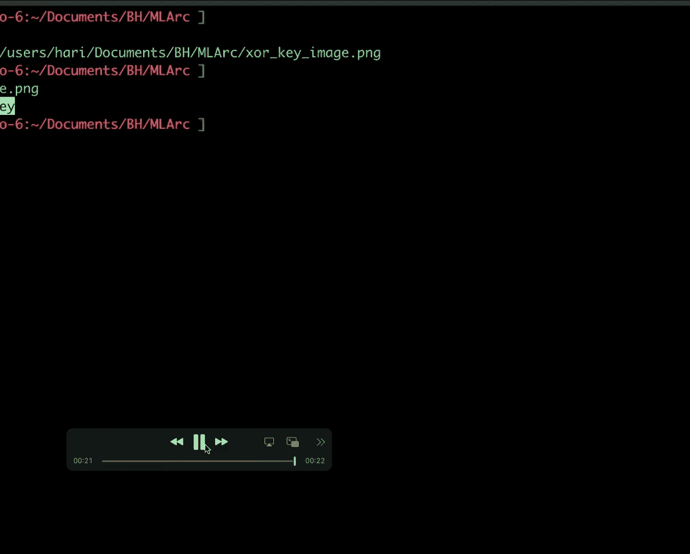
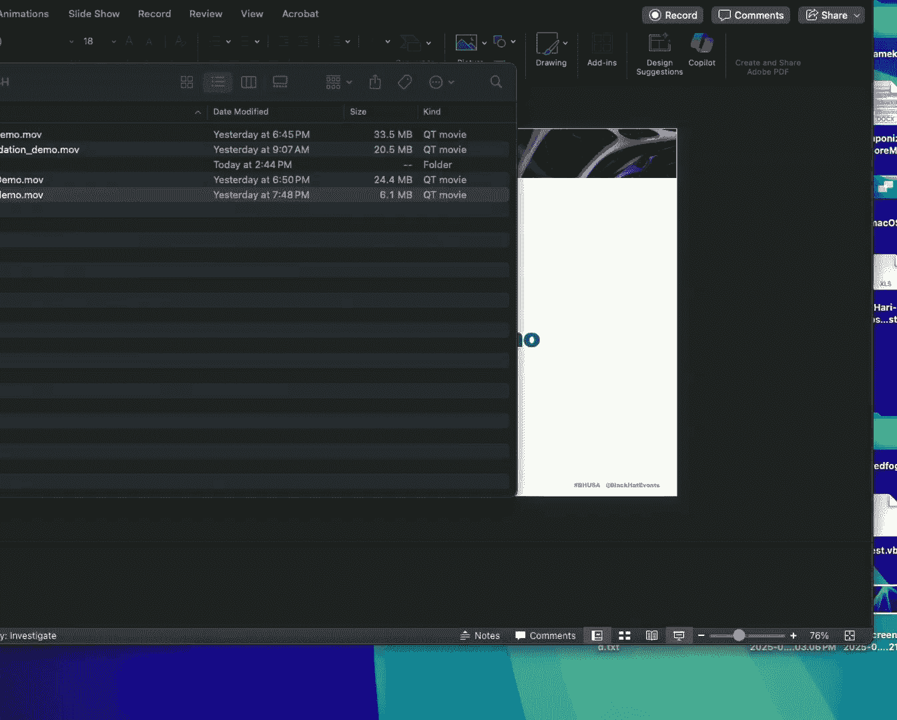
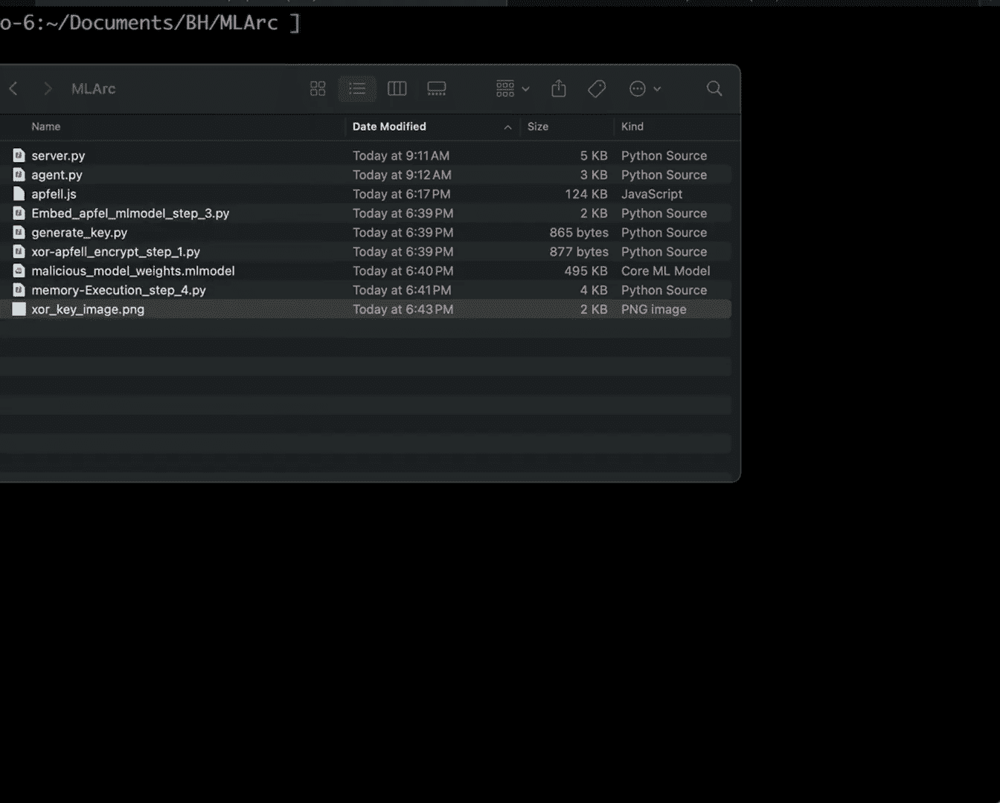

# 课程 01: 利用 Apple AI 栈进行攻击操作 🍎⚔️

在本节课中，我们将学习如何利用 Apple 的原生 AI 框架（如 Core ML、Vision 和 AV Foundation）进行攻击操作。我们将探讨如何将恶意载荷嵌入到模型文件、图像和音频中，并利用这些框架的合法功能来加载和执行载荷，从而绕过安全检测。

---

## Apple AI 栈概述

上一节我们介绍了课程主题，本节中我们来看看 Apple AI 栈的构成。Apple AI 栈包含多个组件，其中核心是 Core ML 引擎。它是一个轻量级框架，预装在 iPhone 和 Mac 上，用于日常任务，例如 iPhone 照片处理。此外，还有较新的 Apple Foundation 模型，用于大规模任务，但它是 Apple 私有的。因此，我们的重点将放在仍广泛可用且可被武器化的 Core ML 引擎上。在此之上，还有 Vision、AV Foundation 等原生框架，我们也将探讨如何利用它们。

---

## 什么是 ML 模型文件？

上一节我们介绍了 AI 栈，本节中我们来看看攻击的核心载体：ML 模型文件。Core ML 模型文件（`.mlmodel` 或编译后的 `.mlmodelc`）是轻量级文件，随应用程序分发，用于在设备上快速执行 AI 任务。这些文件通常未经过签名验证，因此 Gatekeeper 或公证服务不会检查其安全性。文件内部包含模型描述、类型、参数（权重）和元数据。攻击者可以将载荷隐藏在模型权重或元数据中。

---

## 各框架如何工作？

以下是 Apple 各 AI 相关框架的基本工作原理：

1.  **Core ML 模型工作流**：开发者训练模型，生成 `.mlmodel` 文件，编译后随应用分发。应用运行时，模型文件被加载到内存中执行。
2.  **Vision 框架**：用于图像处理和文本识别等视觉任务。它提供原生 API 来处理图像数据。
3.  **AV Foundation 框架**：用于音频和视频处理，被许多应用程序（如 Zoom、iMovie）使用。

---

## 滥用各层进行攻击

上一节我们了解了框架的工作原理，本节中我们来看看如何滥用每一层来隐藏和传输恶意载荷。

以下是各层的攻击方法：

*   **模型文件层**：可以将载荷放置在模型描述、元数据或模型权重中。例如，将载荷放入权重层会显示为浮点数数据，难以直接识别。由于读取模型文件需要 Core ML 库，传统的 EDR 或杀毒引擎通常无法检测其中隐藏的内容。
*   **Vision 框架层**：可以将数据编码到图像的像素中。例如，设置像素的透明度为 15%，人眼仍能看到图像，但恶意载荷已嵌入像素数据中。攻击者可以在运行时使用 Vision API 读取像素并提取载荷。
*   **AV Foundation 框架层**：可以将载荷编码到音频文件的振幅中。例如，将载荷转换为二进制（0 和 1），用不同的振幅值代表 0 和 1。播放时，音频听起来像是正常的蜂鸣声，但使用 AV Foundation API 可以读取音频文件、提取振幅数据并解码出原始载荷。

---

## 演示：Vision 与 AV Foundation

以下是利用 Vision 和 AV Foundation 框架隐藏数据的简单演示：

1.  **Vision 演示**：一个 Python 脚本生成包含加密密钥的图片。另一个脚本使用 Vision 库读取该图片，并从像素中提取出密钥。
    
    
2.  **AV Foundation 演示**：一段 Swift 代码将字符串 “hello world” 转换为二进制，并根据比特位（0 或 1）设置音频振幅，生成一个音频文件。另一段代码使用 AV Foundation 读取该音频文件，提取振幅数据，解码后还原出 “hello world”。
    
    

---

## MLR C2 框架

上一节我们看到了如何隐藏数据，本节中我们来看看如何利用这些技术构建一个完整的命令与控制（C2）框架。我构建了一个名为 MLR 的轻量级 C2 框架，它完全基于 Core ML，使用 FastAPI 进行通信，并使用模型文件作为载荷传输机制。

其工作流程如下：
1.  **注册**：在受害者机器上运行 Dropper（Python 编写），它会向 MLR C2 服务器注册并创建一个会话。
2.  **命令下发**：C2 操作员发送命令（如 `whoami`）。C2 将命令进行十六进制或 Base64 编码，放入一个模型文件的元数据中，在内存中创建该模型文件，并将其二进制数据发送给 Agent。
3.  **命令执行**：Agent 接收二进制数据，在内存中重建模型文件，使用 Core ML 库提取并解码元数据中的命令，然后执行它。
4.  **结果回传**：Agent 将命令执行结果以同样方式编码到新的模型文件元数据中，将其二进制数据发送回 C2。C2 使用 Core ML 解码并显示结果。

该框架完全依赖原生库，在测试中能够绕过最新的终端检测与响应（EDR）和杀毒（AV）引擎。

---

## 集成现有载荷：Mythic Apple

如果你不想使用新的 MLR C2，也可以将此技术应用于现有载荷，例如著名的 Mythic C2 的 Apple 载荷。

以下是集成步骤：
1.  **生成密钥并隐藏**：使用 Vision 技术，生成一个加密密钥并将其隐藏在图片（如应用图标）的像素中。
    
    
2.  **加密载荷**：使用该密钥对 Mythic Apple 的 JavaScript 载荷进行加密，得到一个加密的文本文件。
    
    
3.  **嵌入模型**：使用 Python 脚本和 Core ML 库，将加密后的载荷嵌入到一个 Core ML 模型文件的权重中，生成 `.mlmodel` 文件。
4.  **加载执行**：Loader 程序运行时，会执行以下操作：
    *   使用 Vision 库从图片中读取密钥。
    *   使用 Core ML 库在内存中加载模型文件，并提取出加密的载荷。
    *   使用密钥解密载荷并执行。
    
    执行后，Mythic C2 将收到上线通知。
    

---

## 防御盲点与缓解建议

上一节我们探讨了攻击方法，本节中我们从防御角度看看存在的盲点和应对策略。模型文件、图像文件和音频文件通常是静态文件，当前的 EDR 或 AV 引擎很少深入扫描这些文件格式的内容，因为它们看起来是合法的，且解析需要特定框架。

作为缓解措施，防御者应：
*   **监控模型文件加载**：关注哪些应用程序加载了模型文件，以及这些文件的来源是否可疑。
*   **分析 API 调用**：检查应用程序的 API 调用序列。如果一个文本编辑器调用了 Vision 库来读取图片，或者一个计算器应用加载了 Core ML 模型，这些都是异常行为。
*   **警惕供应链攻击**：开发者可能从不可信的公共仓库下载并集成模型文件。应审查第三方模型文件的来源。
*   **制定自定义规则**：安全团队需要编写针对性的检测规则，来识别这类滥用原生框架的恶意行为。

---

## 总结

本节课中我们一起学习了如何武器化 Apple 的原生 AI 栈（Core ML、Vision、AV Foundation）进行攻击操作。我们探讨了将恶意载荷隐藏于模型文件、图像像素和音频振幅中的技术，并介绍了基于此的 MLR C2 框架以及如何将技术应用于现有的 Mythic Apple 载荷。最后，我们从防御视角分析了当前安全检测的盲点，并提出了相应的监控和缓解建议。