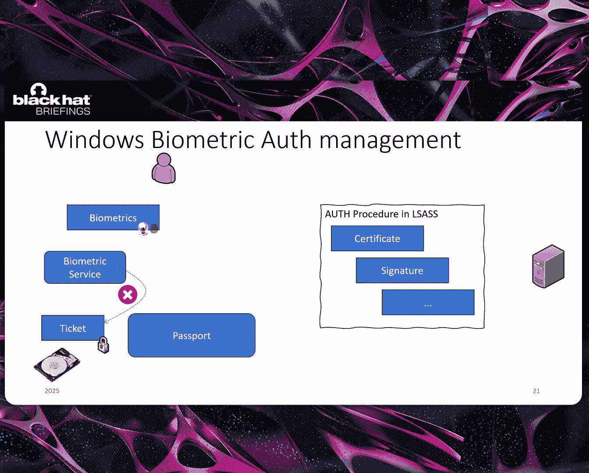
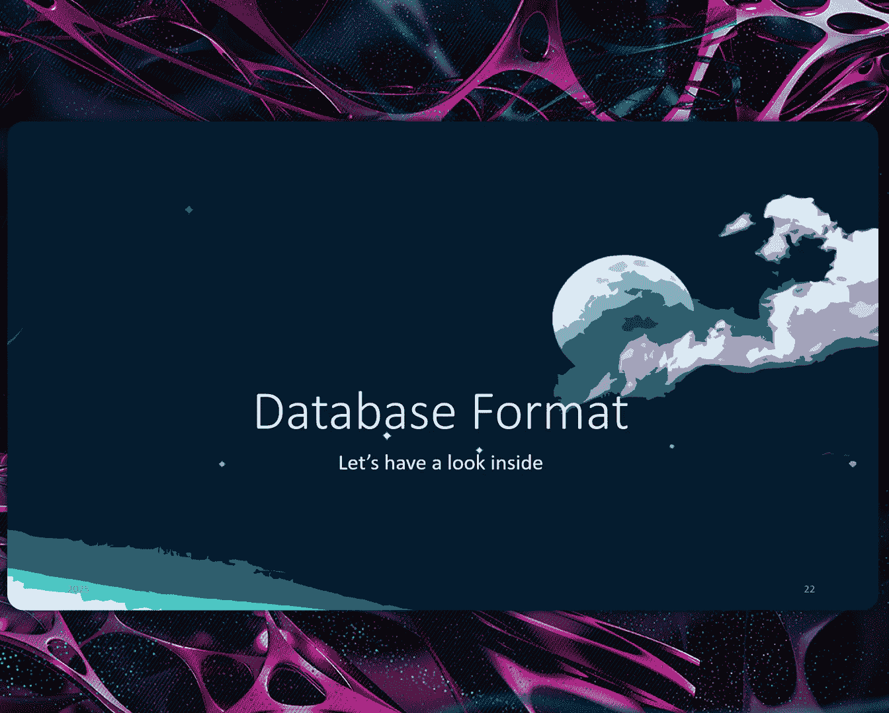
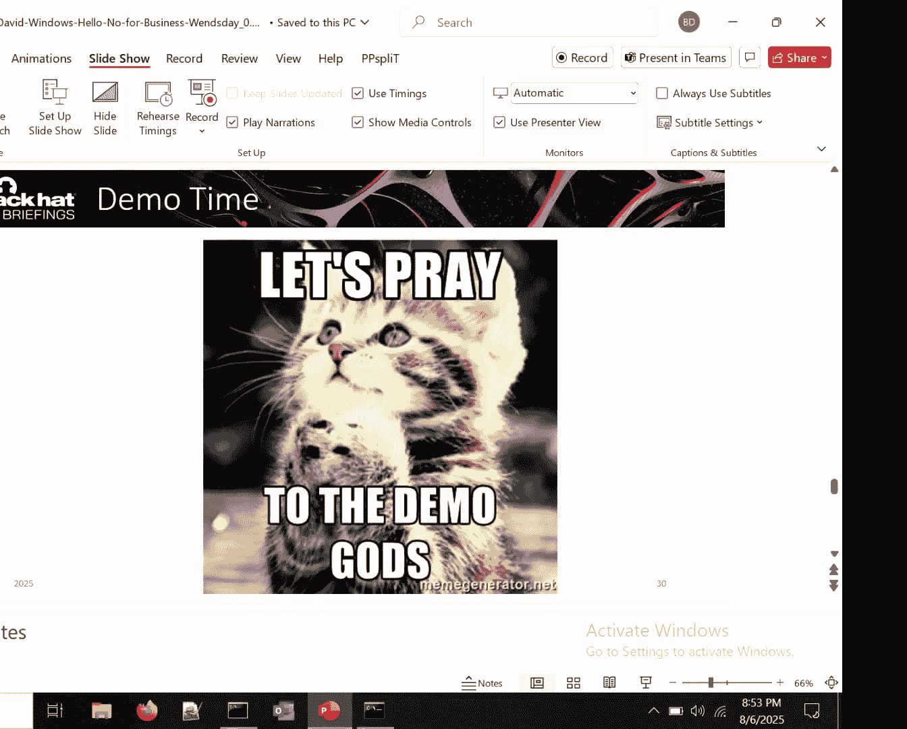
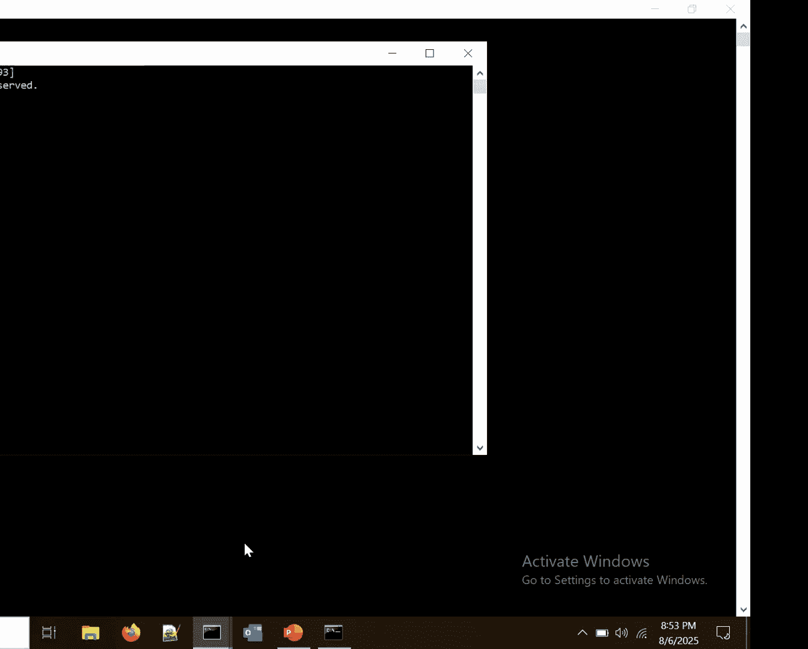

# Windows Hell No for Business [SkWZ5KcelD4]

So hello， everyone。 Welcome to our talk。 Nice to see you all here。 Nice to be here at Blackheadt。

 Our talk is about Windows hellello for business。 or as we call it Windows hell， no for business。😊。

So maybe a bit about the project， as and already said。

 we're doing for quite some childhood lot of reverse engineering on Windows components。

 And most of our work we're doing is actually funded by the Sherman Federal Office for I T security。

 which is pretty nice because they do not want to hunt for bucks once in a while， the government。

 but they want to understand how Windows works。Essential， we work for I And W， a Germanman company。

 and we're contracted to conduct various indth security analysis of security critical components and functions in Windows。

 That' a component is Windows hellello for business。

 The biometric authentication that's new in Windows with face recognition and everything。

 This project has started last year， and it's going to end in the spring of next year。

 and hopefully soon we will have a homepage where we will publish all our reports。

 because we not only work on Windows hellello for business。

 where we will publish an extensive report of around 170 pages with all our reverse。😊。

worse engineering work with all the details because we omitted quite a bit in our talk to make it fit in the time frame。

 But we also will。Discuss or no work on control for in this project， for example。

 code and check to policy。 So a lot of interesting stuff will come up there in the future。

 So as I that， I'm Ti， and I'm from Germany， and I am over to Baptist。And baptist， I'm French。

 but I will for German company。And today， with， we would like to share Jone with us in Windows L for business as a whole。

 First of all， say hello to Windows L。 in 2015，10 years ago。

 Microsoft introduce a new features in Windows operating system to remove more and more passwords and to use instead of biometrics。

 Why removing passwords。 Well， it's quite simple。 password are forgetttable。

 you can lose your password sometimes without knowing it。

 And it's a bit tricky to for an everyday life， because it' you need to type it and so on。

 It's quite complex。 But using biometrics is something you never lose。

 It's something which is very hard to store you， except by cutting a finger or something like that。

And， in addition。Well， it's in a way， sort of user experience can when you are in front of of your computer and everything is accessible a bit like magic。

 And in this journeyna of a password password less live in Windows。

 Microsoft is going to push more and more this features of Windows hello everywhere。

 Just give you two example。 So first one， Windows recall was introduced one or two years ago on Windows preview。

 Windows recall is quite simple Fi very short words about it takes regular screenshot of your screen activities and it does everything the database。

 And with the power of artificial intelligence。 The goal is to be able to say， oh。

 we could make some sort of indexing of what you did So that if you have a research。

 like what did I do two weeks ago when I watch this YouTube video。

 Windows recall is quite able to tell you， you watch that video based on your screenshot activity。😊。

On the first release of these features on Windows preview。

The database where all the screenshot we are told was very easily accessible。

 which creates a lot of issue from a previous point of view， as you can easily guess。

 And in this situation in the new which has been published on Windows preview。

 Now the access to this database is locked by Windows。

 So you need to use Windows to be able to authentic and go further in this direction。

 Another example， Pasky。 Paskey is the same I。 But instead of logging on your laptop with Windows。

 you can use Windows to log on a website would look Facebook Gmail and so on。

 if they support the protocols of the cryptographic protocols between the website and your laptop。

 it's possible to use your biometrics indirectly。 But in a way to create a sort of crypto challenge to be able to authentic with the website。

 So as you can see， Windowso is going to be more and more important in the life of Microsoft users。😊。

Windows  A for business is built on two key principles。

 So first one is the identification to be able to say that person in front of that machine is this one。

Giving a name to that person is inification part。 The Windows L of Windows L for business。

 And on the other side， the for business side is for authentication to say that users who know the identity。

As access to this kind of resource online。 So that's the authentication part。

 The rest of the procedures once the identification has been performed。

Let me explain to you how this kind of authentication。 Let's dive into the for business part。

 Once the enrollment has been performed part of these enrollment procedures。

 once the biometric has been taken， the system is about to create user I D keys。

 user I keys is a set of two keys。 One public key，1 private key from asymmetric cryptography。

 And the goal is to use these keys to make a cryptographic challenge to make the authentication。

 So public key is share directly with an identity provider， It can be active director on I and so on。

 And the idea is to link that name of the users to these public key So that we will be able to check with a cryptographic challenge。

😊，That the user identified is really the one it pretend to be。And then on the machine。

 we have the private key。 This one can be stored directly on the machine。

 and it we should never leave the machine because it's used for the cryptographic challenge。

 If your machine has a TPM trust platform module。We still the private key directly in the TPM。

 Otherwise， according to Microsoft documentation， it's up to the software to manage it for Win loggan。

 for instance， is directly in the registry of Windows with a protect memory。

 So very sort of weak cryptography procedures easy to detectcode anyway。

So that's how it works for the enrollment。 And now when we make a full procedure of identificationification of authentication。

 what happens。 First of all， the user provides a gesture to Windows hell。

 gesture is the set of all the possible device able to collect biometrics。

 So you have face recognitions， voice recognitions I recognition。 if you have or lens。

 you can have also fingerprint。 but the most maybe an important one is the TPM pin。 In fact。

 in the password less runna of Microsoft。 we still have a TPM pin， a sort of very short password。

 If we we want to get access to the TPM。 So the gesture is the general name to give biometrics to the system。

 And then we use a biometric templates stores in the system。

 So the list of users associated to biometrics already collect during enrollment to check that we know that users。

😊，Each gestures has access directly to a protector key。 So a protector key。

 which is unique per gestures。 and each protector's key cipher and authentication key。

 So protector keys are all different for all gestures， but the authentication key is。😊。

The same for one given users。 So it means that it just use as its own way to get access to the Z authentication key in the middle。

 Okay， so let's sum up Windows hello， we have the face recognition。 For instance， it's me。 okay。

 knows me。 So give access to the protector key。 The protector key gives access to the activation key。

 and the activation key， give access to the user I D key。

 That's the pre key we mentioned just before。 De stored in the TPM。 by the way， And for short story。

 It's possible also to have the user key of pass keys in the same place。😊，And then with the user key。

 we can make the cryptographic challenge with the identityT providers。

 The identityT provider use a public key to check that everything is fine and give a feedback to Windows 1。

 That's the story of Windows 1 for business， with everything together。😊，Now。

 we propose to dive on the local machine on the machine directly。 Let's make some Windows ands。

 but just for Windows L。 we have two possibilities to do so。

 So first one is the user is directly providing biometrics to a device。

 and that biometrics is directly transferred from hardware point of view。

 to canal mode to the operating system。 If you prefer with a drivers， Let's take， for example。

 the USB driver。Then we have a manufacturer driver。

 which is used to take the biometrics from the device that the manufacturer world knows because they design it。

And then make the condition so that the data is accessible to the biometric drivers。

 as Microsoft documentation expected it。And then the biometric driver transfers this information in user mode to the Windows biometric service。

 This is a service running automatically in session 0 with system under system users。

 That's the first possibility。 We can have another possibility with another kind of device。

 We provide the same way as the biometric to the device。

 But the device directly process the biometrics either to make directly the conversion for the biometric service or directly to make the notification If the device is capable of onor directly to say that's this。

 this is that user。😊，Ste abused rivals。Technically speaking， it's still possible to have。

Manufactial drivers， but it's optionable in this case， directly to the biometric drivers。 And we go。

To the Windows service directly。 Okay， great。The Windows biometrics service directly is not alone to make an not of the users。

 He uses third party software， usually the manufacturer of software provided。

 The goal of this software is to help to make the notification because face recognition is different from finger and printing and so on。

 So sometimes we need some。Flexibility in the way we can under the code。 And， of course。

 the Windows biometric service is also in connection with the template database by template database。

 This is exactly a folder in the system where all the biometrics of user enroll on this machine belongs。

😊，And， of course， everyone has interaction with the template and so on。Now。

 let's consider a case where an application would like to access。

The identity of the user in front of the system。It used a windowbi API。

 The window API is the one which is responsible of this smallgui that we all know when using Windows alone。

And then this API is designed to make A PC connection with the service。

 A PC connection is just a way to talk with the service。 And that way。

 the service has its own memory space and the user application has its own memory space。

 It means that the template and the biometrics never leaves the memory space of the Windows biometric services and any client application looking for identity never directly access to the biometric data。

 Keep the privacy in a way。😊，Okay， so we are going to focus our analysis on the first kind of device because they transfer directly the biometrics to the system。

 which， of course， lies a lot of concerns in the notion of privacy then。

We will dive into the Windows service。 And， of course。

 we are going to talk about the templateplace database and the sub partyy manufacturers。

 But let's come back to the Windows biometric service， please。

As any service is start by initial by making the initialization of the service control on。

 which starts by loading the configuration of the system。

 And then three main procedures are loaded the initial the initialization text from the registry of Windows。

 All the information for every kind of sensor registered in the system。 For instance， voice。

 face recognition and so on。 We have also focus initialize in the middle。

 because the application which is going to text the id， the one which has a focus。

 less potatoes always， the one which is in foreground， the one which has access to the keyboard。

 if you prefer。 Then there is some T PMM check， which are form， and we apply the policy like that。

We have what we call， what we， what is internally call an account manager。 So， in fact。

 many application can talk directly with the service and all the application talking with the biometric service are correctly separated from notifications。

And then we have the windbe unit creation view unit creation。 We are going to talk about it。

 but you can see that as a provider of service inside the Windows biometric service to provide the specific access to the face recognition。

 I recognition， voice recognition and so on。 It's something which is very software in a way。

 And in the end of the day， they are all sort of internal server in the service。😊，Then last stuff。

 we are going to create an RP PC dispatcher so that we can communicate with A PC。

 as we explained just before。 And the PC is， of course， set up correctly。

 Last operation is hardware manager。 The hardware manager is going to set up a lot of procedures to be notify when there is a plug and play notification。

 if there is a power event and so on。 so that we can manage also the hardware from a generic point of view in this position With that illustration。

 you've got all the initialization of the service directly。 We talk about initialization。

 and we talk also about configuration。 So configuration of the service is in H K M。😊，System。

 current control set， service， windbi service。 And， for instance。

 we have the key database where all the database of the biometrics belongs。

 You have the path of the database and the type of the database。 Number  two means face recognitions。

We have also the service providers with all the name of the service providers， bootsottap。

 face features， fingerprint and so on。 The name of self explain it。

 except for facial features and bootstpped。 In fact， facial features is totally empty。

 And what makes the face recognition is bootst。 If people from Microsoft in the rooms school explain why they use that names。

 we would be glad to know。😊，And then you have Vi2 So configurations。

 which gives you a lot of information， like description like Windows L phase V2 software device。

 So we know where we are。And we have also the notion of adapter in the configuration。 Techly。

 we can have more than one configuration per Vi console so， but from our experience， we only saw one。

 So it's like that。 And you have the DLL， which represent what they call internally。

 the notion of adapter。 you can see on adapters， Sun cell adapters， storage adapter。

Let's talk about the notion of adapter。We have the Windows biometric service。

 And as we explained before， some cell party software can be used in the Windows biometric service。

 It's not a must。 Windows provides by default， some very generic adapter。

 some very generic code to do the work But it means that the device manufacturers needs to follow the norms written by the Microsoft documentation。

 And if that manufacturer wants to do something differently， it needs to provide this own adapter。

 So we have a sensor and un and a storage。 The sensor。

 is's everything to manage different kind of sensor。 you print face and so on。

 The un is used to make the match So that when we ask for this biometric data captured by the sensor from the one of the storage providers。

 So the database where all the biometrics belongs。 does it match or not And of course。

 as I mentioned， the storage providers。 So possibility to have different kind of database according to the Sun type。

 for instance。😊，Everything all together communicate with a specific structure。

 which is called a pipeline。 Oh， it's not a pipeline like in the command line。 No， no no。

 It's more structurals full of pointer of functions And each components。

 And also the Windows biometric service make a call between all the different elements via this pipeline。

😊，But， there is。3 adapters all together to make a biometric unit。 But there is a secret one。

 the framework adapter。This one is totally undocumented by Microsoft。

But it's used in the context of virtual based security。

When we use the Ep Vi of Microsoft Windows to make the security so that we have two little virtual machine in the system。

 one for the regular user， where we have the explorer。

 when we can click and everything works correctly。 And one very secure one Once only the APIp Vi can access that for very secure operation。

 And in a way， that framework， it's a bit the sensor。 you on the storage all together。

 But mostly the storage stuff to make communication with the rest of the system。😊。

This is very specific。Aapter， the framework one comes with the un uncid sign in security E， S。

 S mode。 So that's the most secure mode that we can that we can use。With Windows L， normally。

 when we use Windows L without E S S， you have loggan U E， which makes the record to the window API。

 which makes a connection with the biometric service。

 And this one makes the transition with the biometric drivers。

 which itself makes a transition with all the device like TM or biometric device。😊，But when we use E。

 S S mode， ZR Vior is there to make the protection。

 And now ZR Vior is taking care of the hardware request。

 which are directly addressed to the biometric device。

 Rerouting this stuff between two different world V T L 0， V T L 1， as we explain。

 the two little V 12 machine。 V T L 0 is where everything is fine。 I would say。

And V T L 1 is where we have the maximum security， where only V T L 1 components can access to this memory and not V T L 0。

 despite your outri or not。And in this situation， the visa reros the operation to the secure driver。

 which is equivalent to the biometric driver in V T R 0。

 And we transfer that information to the isolated Windows biometric service。Very long name。

 Make it short。 B I iszo that X A in system 32 is the executable where the E， S S mode belongs。

And inside is the same logic as we have seen。 We have the Windows biometric service。

 We have a biometric unit with a sensor on engine and the storage。 And when we have a request。

 the sensor gives information to the engine。 the engine needs to make a comparison with the storage。

 we take from the database directly the information。

 the storage give back the information to the engine。 There is a match or not。

 the sensor adjust proxy we give back the information to the B service。 And if there is a match。

 we have an exchange of information the isolated version of the service and the Windows biometric service technically speaking。

 you have a full cryptographic protocol communication。 But for the check of simplicity。

 Let's just consider it forward the identity of the users。

 And then we have a lot of components in Windows， you have add the instance。

 L S do you the authentication， which happens with the providers。 So like that。

 you have the full story of E S S mode。 E S S mode is very nice， very cool， very effective in a way。

 But it only works。 if your device。😊，Is capable of supporting it recognitions。

 It means that your device must have the secure device capabilities in from the from the configuration it can provide to the system。

So we have talked about E， S S。 Let's see how work the capules internally at the beginning in the Windows biometric service。

 there is a fresh of all the operation。 And then we start the capules。

 This is where we ask the sensor to do theule to take the biometrics。

 Then we have a sort of feedback control to check that everything is correct。

 And this is also where the calib， for instance， we have face recognition。

 So if I turn my ads is automatically rec my ads correctly also the brightness control and so on。

 And when it's finished， we have a finished operation which happens。

 And then we the information from the sensor to the engine directly。

 If the engine is happy with that we continue the Otherwise there is a possibility to make a calibration so that the engine as a sensor agrees on which to use on which shape to format the information that the engine is able to understand them。

 And then we have the presence monitor local update procedures with that name which is a bit ugly。

 This is。😊，Exactly where the identification happens in case of success。

 the TPN can be used if you are in E S S mode without E S S mode。 There is no direct TPM access。

 based Microsoft documentation。 And then we have a cache system so that if we have already find someone in front of the machine。

 we can directly reuse this information for that user， we don't need to remake all the procedures。

That's how it works。 Let's dive into the identification procedures directly inside。 At the beginning。

 we have occurred to the identify all from the engine。 And， in fact。

 we take the information from the sensor， which has been given by the perge data to engine。

Andgi matching is going to add the biometric database via the storage adapter to provide template place to compare with。

 And the comparison is perform with artificial intelligence。 So it's a lot of math。

 And in the end of the day， it just gave us threshold So the value in floating point value between 0 and1。

 And if the value is I enough， you are identified。 But we cannot explain with artificial intelligence。

 If it's the eyes a mouth knows， which is very relevant。 It just train model and did with that。

 So this is where the artificial intelligence in Windows are。😊，Then with the identify all。

 we have a list of windbe presence structures， and some of the windbeill presence structures can have windbe identity structures。

 And in the windbe identity， This is where we have the seat of the user。

 This is exactly where we have the identity of the users at the end。

 Then the procedures continue report observations。😊，We update the cache。

 and we have a presence object which represents a user in front of the machine。

 Not that it's possible to identify more than one user at a time。Okay， thank you。

 Baptists for clarifying how the authentic of how the identification works。 But as we that。

 it's also about the authentication。 So let's take a look at it。 First。

 we want to look at the thing we already know the traditional authentication management。

 In the beginning， a user provides this password into the system。

 This password can serve as an entropy No cryptographic procedure that produces a hash。

 which is then used for the authentication with the identity provider。 So to curbos。

 And then now here we have a strong coupling between the entropy。

 the password and the authentication procedure and authentication itself。

 This is pretty well known And in the biometric case。

 it's a bit different because here we do not provide any real entropy。 The user provides his face。

 for example， as biometrics to the biometric service Now we have this identification Baptist talked about But this one here stands for itself。

 We only have an identification procedure。 In the end。😊，Will get a ticket that says， yep。

 I identify this person。 That's okay。 But then we have a key release mechanism。

 This is one of the essential parts of the Windows。

 hellello for business part that we need a key for authentication。

 So we need some way to release this key。 And this is done with data provided on the hard drive。

 And this one is then passed to the passport infrastructure。

 which is used to handle all the keys that we have like the past keys。

 authentication keys to active directories and other identity providers。 And then we， of course。

 access in the end， the key protected by the TPM， to create a signature and the context of L S I S in Kbers authentication with in it。

 for example。😊，To authenticate against the identity provider。 But in this case。

 we do not have a strong coupling between the biometrics we provide and the key release。

 And there's no entropy coming from anywhere， so。We have now talked about the authentication。

 which relies on the identification。 One really important part of this identification is the template that is stored on the database。

 So we need to look， how is this done， because this is what's doing the matching against。

So。Let's talk about the database and especially the database format， because in the end。

 were reverse engineers and we reverse both code and data So far as it was really interesting to dive right in into the database format。

So， of course， you do not start like out of nowhere。 You typically read some documentation。

 So let's see what Microsoft has to say So who has access to Windows biometric data。

 only the Windows hello service should have access to the templates。 Okay， this sounds nice。

 even though there is no real service named Windows hellello。

 but it's meant to be the biometric service。 So and also there's protection in place。

 So we already know from the documentation， the location where it's saved。

 And then it says that it's encrypted with a per base key when IS CBBC mode。 and there's also a hash。

 this hash is then used to ensure the integrity to make a long story sure。

 So this sounds really good。 We have per database encryption and we have inity， okay。😊。

So biometric data in the end， is the holy cril of mobile device security。

 So we need really strong encryption for this。 And as we said。

 we're coming from an identification point。 So we need something that identifies the user in Windows。

 this is typically the sit， which we would get， for example。

 from the presence data that participants mentioned previously。

 and we use the sit to authenticate a user and user authentication is the holy cril of domain security。

 If you fail this， you fail your whole domain。😊，And we know that the biometric unit uses this template saved in the database to perform a match。

 but we need to have an decryptive template to perform this match。

 So there needs to be some way to decrypt it。 But we cannot provide any entropy into the system beforehand。

 because were doing passwordless stuff。 So the big question is。

 where is now this key coming from to provide us the entropy。

So let's take a look at the database format in a broad overview。 We have multiple parts of it。

 The first one is an encrypted header。 This is like the security header that ensures all the security of the database。

 and it itself is encrypted。 This one ensures the integrity of the database using a shot 256 hash。

 It essentially hashes all the rest of the database and stores the hash encrypted。

 Then there's also this per database I S key that's used to encrypt the templates。 Also。

 the initialization vector there saved as well。😊，And then there's an un encryptcpted header following this one。

 This one holds more like management information and metadata， like the version number。 but also。

 as I said， management， like how many records are in the database， How many free records are there。

And then lastly， we have records。 A record is the thing that ties the template to the user。

 So the record consists of a sit， most essentially， and encrypted template itself。😊。

So let's take a look at such a record。 Now。 we start with the record header。

Which has a lot of entries， and it then follows directly the payload itself。 And most importantly。

 here is that we reference the encrypted template and the decryed template by size。

 So we know what we're dealing with。 And the other important value in this one is the wind bio identity。

 the identity of the user that is tied to this template。

This identity holds a sit， as you can see as an example。

 this is what identifies as as a user in Windows， typically。So the database security。

 we now know that theres an encrypted header that ensures the integrityity of the database and the confidentiality of the biometric data。

 So this is really the important thing where everything comes together。

 And But we not yet talked about how this one is secured because which has shifted it from here's a key to here's a key。

 So there needs to be some way to access this one。 And this is typically done in a Windows with to encrypt protectect data and unproect data functions。

 And they provide a means to do encryption without providing additionally an entropy。 typicallyyp。

 this uses the user's password in interactive session。 But in our case。

 we're talking about the system service。 So all the data is already present in the system and this essentially means that local administrators can access to the system can call these functionalities and decrypt and encrypt the data So essentially encrypt this header。

😊，So this means that local administrator break the security of the database。

 They can decrypt the data， read the templates of all the enrolled users， the key。

 change the database， update the hash and break the integrity。

 So to make it like really concrete what's this means。 For example。

 if we would have two users that are enrolled into the system。

An administrative attacker could just exchange the seats。

 and they couldn't authenticate as one or another。The attacker could decrypt the templates or even bring their own biometrics to the system and。

 in the end， authenticate as every enrolled user on the system。

So we developed the tool to decrypt the data， which you can see here。 But， of course。

 we want to go one step further and let's pray for the demogots because face recognition with dogy lights is not so ideal。

 But yeah， please log in， Baptist， okay。😊，So， life demo。So we log the screen and normally。

 with the camera and my face。 welcomee back that is the see。 Well come。 Yes。

 and then I connect myself and yeah I am。 so only me on the laptop can do it you want maybe show which user you are。

 which oh， yeah we we can， of course。 So we， we can see that。

 Butist is log look that's the wrong one。 that that will be me the attacker。😊。

So let's try with another one， if you want。 So come prompt。W am I。

So just to quickly show we are now in the domain context。

And now， maybe there's an account for me as well。 Let's try。 you want。 Yeah， I want to authentic yes。

That doesn't walk come making sure it's me。 Okay， call make sure it's me。 Oh it it cannot。 Okay。

 please， please love it again。You see， it's better with my face。 U H books。 Okay， okay， so。

Now。I'm a local administrator at Tras， you can see。That's nice。 So I have a lot of capabilities， so。

😊，Let's take a look into the database。 What's in there So my face， at least， Yeah， your face。

 but not only your face。 Like we can hear see now the headers。

 like we have the heh we talked about here， We have the ination vector here。 We have the key here。

 Then we have this lockbox file header， which is like the management header。

 then we have one record where we have， for example， Baptist identity here。

 And then we have the first part of the decryptive template。 So this is the decryption part。

 That's nice to have。 But that's not what we want， because in the end， I want to become baptist。

 What do you mean by becoming me。 I mean， like plastic surgery。 Get your face。😊。

There are some walks， and it could be painful。 no， no， trust me。 It's not painful at all。 Just。

 just give me a second。 So what I know want to say。

 I just want to inject my own biometrics into the system。And thankfully。

 I already have my biometrics storagelash yeah。😊，呃。Here。

 so I now I just in checked my decrypted template into the system， which was successfully injected。

 So I just replaceded his blob with my template， encrypted it， updated all the values that I need。

 like the size and so on。 It's just like tedious work to do but nothing fancy。 And it's enough to。😊。

B me， yes， sure。And's take a look。8。走。😡，That's me。 I'm baptist now。呃我 can you make个 this station。

Okay， so demo of the gods of demo they were with us。 Yeah， the the light was well， so。😊，To conclude。

 So just a few major takeaways for you。 Windows Hello for business is here to stay。

 We have seen it with new security products， like Windows recall。😊。

They use Windows hello for business now as a security feature to authenticate it。 Also。

 there's more of a trend to like online accounts with Microsoft。

 So I think we can see a bit of a shift here more and more to not the old thing。

 but more than new thing。 And I think Windows hellello for business will play a major role in that。

 So it's essential to understand how it works and understand its problems。

 And local administrator to domain to the main user is still a big threatret。

 as we have just seen now， I became Baptist。 And I'm now in the domain。 not more。

 not anymore only on the local machine。😊，So in the worst case， this could lead， for example。

 to local admin， to domain admin。That， I think。We did not make a lot of fun about the database。

 its encryption。 So， but we need to see what's Microsoft facing as a challenge because they're securing really heteroous clients because and that's a big challenge。

 If you consider， for example， your mobile phone。Noile device owners do not support that many devices as Microsoft is doing。

 and maybe they is only support the highest security features on their flagships。

 which Microsoft is more less doing also with their surfaces。 But with some devices。

 they do not have control over everything that's in there， so。

They try to do to provide more security， but it's hard for them because they have no control over the hardware。

 because in the end， for E， S S mode， which we already discussed。

 where we would then have the isolated kernel where we can handle the keys for the templates。

It's isolated from the user。 So it would be fine。 So we need hardware support。 But， for example。

 we bought these thinkpas here around1，1 and a half years ago。 But sadly。

 they do not have a secure sensor for the camera because they use AM D chips and not intel chips。

 So yeah， you might face some challenges。 And you have not even fall about yet that much。 And also。

 you need virtualization based security。 And in some cases。

 if you're running your stuff on a hypervisor， which does not support nest virtualization you cannot use it。

 But if you can， and theyre using Windows cell for business， yes， use it， try to use yes S mode。

 that's the key takeaway， I think。And so to make the world a bit of safe for place。

 maybe some recommendations。 So in any case， I would suggest。

 or we would suggest only one user per client， just like your toothbrush。

 don't share with other people， only one user per client。😊，And also。

 if you are restricted because you cannot use E S S mode， you can consider， for example。

 using only pin authentication， because in this case。

 the pin can be used as an entropy and it's actually then protect it via the TPM， the key release。

 And you have the anti hammering features from TPM。

 This is one of the cases where I see that it makes sense as Microsoft is pushing for a mandatory TPM。

 If you want to monitor for changes of the database。

 you should consider that essentially only the biometric service should be able or should access the database and read it and change it。

 So if you want to do monitoring do it there。 So thank you。

 here we provide the full database if you want， And I think we have like four minutes for questions now。

 but we will also had to the wrap up boom later in case you have more need for discussions with us。

 Thanks， Thank you for your attention。😊。

