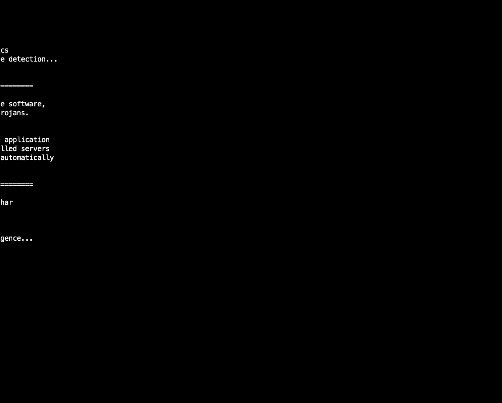
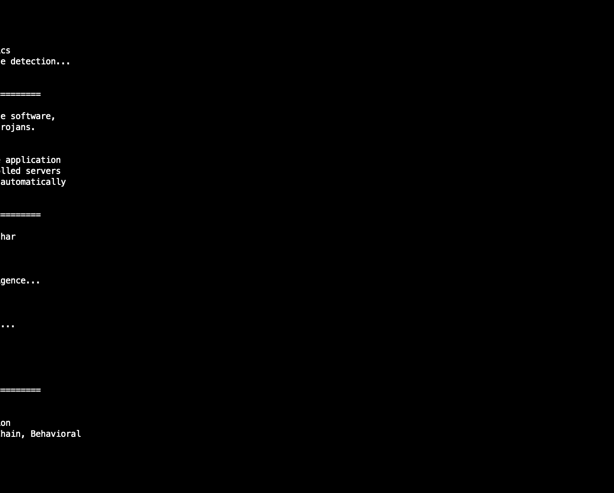
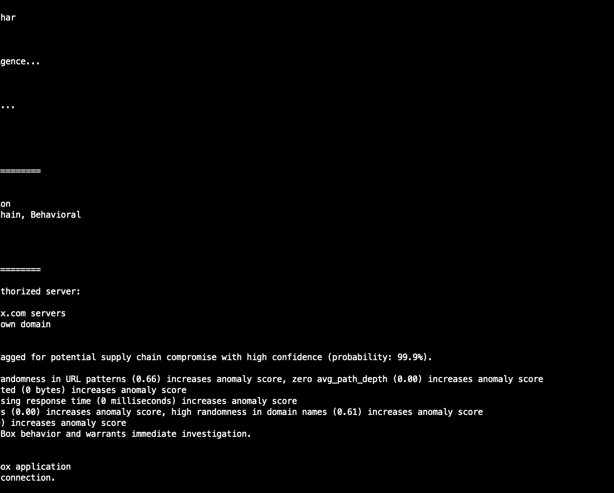
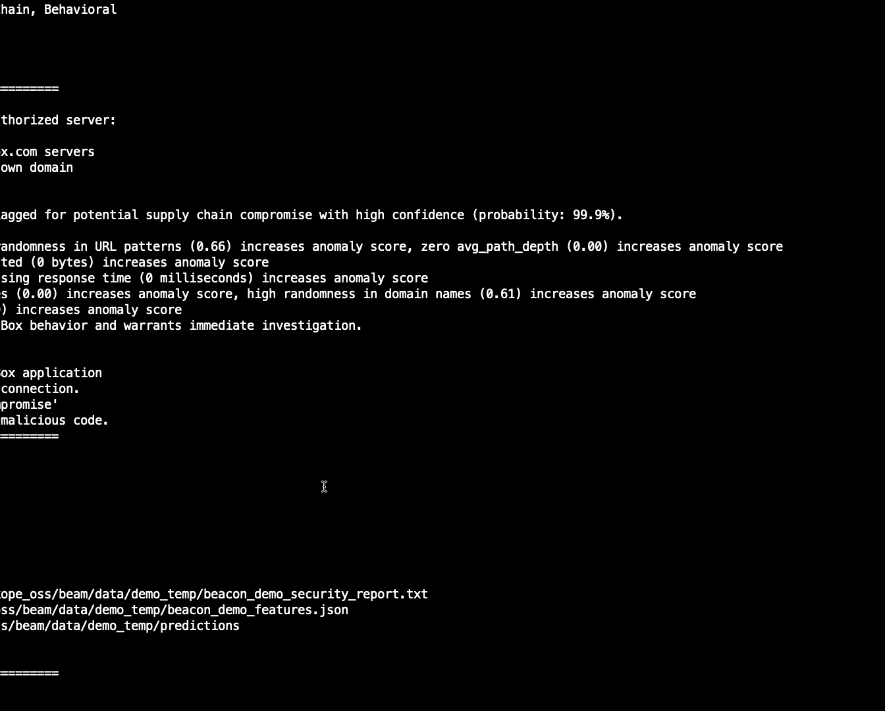

# 课程 1：你的流量不会说谎：通过应用行为揭露供应链攻击 🕵️♂️

在本节课中，我们将学习如何通过分析应用程序的网络行为来检测供应链攻击。我们将介绍一个名为BEAM的开源工具，它能够分析网络流量，为应用程序建立行为模型，并识别潜在的恶意活动。

## 概述

供应链攻击，例如SolarWinds事件，对成熟的安全组织也构成了严重威胁。传统的安全措施（如漏洞扫描、渗透测试）有时无法检测到这类攻击。我们的研究旨在通过监控应用程序在部署后的网络行为，来识别异常和潜在的恶意活动。

上一节我们介绍了供应链攻击的严峻性，本节中我们来看看我们的研究在整个安全领域中的定位。

## 研究背景与定位

在讨论我们的研究之前，了解当前的安全态势很重要。如果我们观察软件开发生命周期，从开发者编写代码到软件在客户环境中运行，威胁可能存在于多个环节。

以下是软件供应链中可能存在的威胁点列表：
*   开发者的凭证可能被泄露，代码可能被修改。
*   攻击者可能直接攻击源代码管理系统并破坏它。
*   攻击者可能绕过上一步，在代码进入CI/CD系统时进行修改。
*   攻击者可能直接破坏CI/CD系统本身。
*   攻击者可能在软件分发到分发端点的途中替换构件。
*   攻击者可能直接破坏分发端点本身。
*   攻击者可能完全跳过整个过程，直接在软件到达客户环境的途中替换应用程序。

如果软件有任何依赖库，那么所有这些威胁也存在于依赖链中。因此，Colin和我开始构思将检测器放置在何处。我们注意到，理想的检测位置是在“使用”阶段。我们希望建立一个控制措施，能够在应用程序行为异常、可能恶意或出现值得进一步调查的偏差时进行识别，并且能够解释发生了什么。

接下来，我们将看看这种检测的理想形态。

## 检测目标

我们希望检测器位于软件部署之后，即在真实环境的用户设备上运行。在大多数情况下，你会看到像Box客户端这样的应用程序在运行并与服务通信。我们的目标是发现应用程序突然不再只与B通信，而是开始与其他可能恶意的端点通信的情况。

如果我们真的在网络中发现了这种情况，我们希望看到什么样的信息呢？

在我们的理想场景中，我们希望看到类似这样的信息：`主机 dgmai.io 的通信是异常的`，并且它有一个特定的置信度（例如99%确信这是Box客户端的异常）。我们还希望看到原因解释，即它是如何得出这个结论的，具体哪里异常。

以下是我们在幻灯片上希望看到的三个解释示例：
*   **URL熵值**：此URL中字符的随机性与Box通常看到的URL不同，这使异常的可能性增加了5倍。
*   **应用程序主机**：与此Box应用程序通信的典型主机列表中，没有出现过这个主机，这使异常的可能性增加了4倍以上。
*   **路径深度**：Box与服务器通信时通常会访问包含文件哈希或API版本信息的路径，但这次通信的路径长度不同，是一个根路径，这使异常的可能性增加了3倍。

这听起来可能有些困难：监控一个拥有数千名员工、使用无数不同应用程序、每天进行各种活动的大型组织，并找到那根“异常的针”。然而，我们发现，如果我们将问题分解，单独为每个应用程序建立档案，问题就变得更容易处理。

基于这种思路，我们创建并发布了一个开源工具。

## BEAM工具介绍

我们创建了一个名为**BEAM**（行为评估应用指标）的开源工具。BEAM分析网络流量捕获文件，为其中的应用程序建模，并检测这些应用程序中可能发生的入侵。该工具从今天起可用。

BEAM内置了8种不同常见应用程序的模型。在Netcope，我们的客户遍布全球各行各业，我们能够看到他们使用什么。因此，我们选择了8个最常见的应用程序。这意味着你可以进入我们的代码仓库，下载软件并部署，今天就可以检测这些应用程序的异常，而无需学习期。

但我们真正想讨论的是这项研究本身。接下来，让我们深入了解研究的数据基础。

## 数据基础

当我们谈论投入BEAM的研究时，必须从数据开始。我们通过分析数据获得了许多见解。在Netcope，我们整理了大约2000个组织的数据，产生了约560亿次“事务”。这里的一个“事务”指的是一个HTTP请求-响应对。例如，一个客户端应用程序向服务器发送GET请求，服务器返回200状态码和一些JSON数据，这个请求-响应对就是我们所说的事务。

这些事务来自420万台不同的设备（用户笔记本电脑、台式机、服务器等）。这些设备上运行着150万个不同的原生应用程序（不是浏览器或云服务网站，而是像Discord、Box客户端、Slack、Spotify等人们下载安装的应用程序）。这些应用程序有750万个不同的用户代理字符串。因此，在接下来的讨论中，当我们提到数据时，指的就是这些。

有了数据之后，我们遵循一个三步法来构建检测器。

## 三步法构建检测器

我们遵循一个三步法来构建检测器，并将在接下来的内容中逐步讲解。

**第一阶段：归因**。我们拥有这些事务，首先要做的是识别事务来自哪个应用程序。为此，我们从事务本身获取一些信息，并用应用程序信息为其打上标签。

**第二阶段：建模**。一旦我们拥有了某个应用程序的所有事务，接下来就是像Colin说的那样，建立一个档案。我们想要捕捉应用程序的本质：它是做什么的？对于这个特定应用程序，典型的数据模式是什么样的？

**第三阶段：检测与解释**。一旦我们有了应用程序的模型，对于任何新来的事务，我们对照已知的正常行为进行检查，看是否存在偏差。如果存在偏差，它是否大到足以构成异常？如果是异常，原因是什么？它是否恶意？这些见解最终被塑造成检测器。

接下来，Colin将详细介绍归因步骤。

## 第一步：归因

归因意味着我们查看一些网络流量，并希望识别是哪些应用程序生成了这些流量。在BEAM中，我们有一个组件负责这项工作。

我们首先在流量捕获中利用**用户代理字符串**。通常，安全专业人员会避免使用用户代理字符串，原因有几个：首先，它是可编辑的，用户可以修改它；其次，用户代理字符串没有标准结构，只是一堆文本，难以处理。

然而，正如我们提到的，Netcope拥有大量来自全球各地组织日常活动的数据，这些用户不会每次使用Slack或Asana时都修改他们的用户代理字符串。因此，我们对大量流量的原始用户代理字符串有很高的置信度。

我们如何应对用户代理字符串的非标准性呢？我们发现，通过实验，一些**大语言模型**能够很好地总结用户代理的含义。在BEAM中，我们包含了一个Llama模型，但也构建了一个连接器，可以连接到Gemini API（如果你有Gemini账户）。这是我们尝试将用户代理字符串转换为应用程序名称的一种方式。我们还使用了一些Python库来做同样的事情。我们最终想要得到的是一个应用程序名称和版本号，例如 `Chrome 134` 或 `Box`。

完成归因后，下一步是建模。

## 第二步：应用程序建模

现在我们已经有了事务，并用其来源的应用程序为这些事务打上了标签。接下来我们要做的是，正如我们讨论过的，为这些应用程序建立一个模型。我们通过一个模型训练阶段来完成。

当我们开始思考要从这些事务中提取哪些信号时，Colin和我开始列一个清单。我们肯定希望识别任何不寻常的域名连接（类似Sunburst恶意软件），看到任何异常的代码仓库访问（类似3CX攻击），并且绝对希望看到任何大型的、意外的出站数据传输（类似MOVEit事件）。

当我们列出这个清单时，最终得到了**185个不同的信号**，多到无法放在一张幻灯片上。我们这里只挑选了几个有代表性的例子。完整的列表可以在我们开源的代码仓库中找到。

以下是几个示例特征：
*   **请求耗时**：客户端发送请求到收到响应的时间。我们提取其最小值、最大值、中位数、偏差等统计信息。
*   **请求间隔时间**：请求之间的时间间隔。是固定的、机械的，还是更突发、更接近人类使用模式的？
*   **请求序列**：应用程序是否遵循特定的请求模式（例如，先GET到A服务器，再POST到B服务器）？
*   **典型的HTTP方法和状态码**：应用程序通常使用哪些HTTP方法（GET, POST, DELETE等）和状态码？
*   **传输的文件**：是否有文件被移动？文件类型是什么？例如，云存储应用Box和音乐流媒体服务Spotify传输的文件类型会非常不同。

一旦我们有了这185个特征，下一步就是测试这个思路是否可行。

## 初步建模测试

我们选取了20个在几乎所有组织中都能看到的应用程序，还加入了一些我们已有的恶意软件流量。我们建立了一个简单的**多分类随机森林模型**，每个应用程序作为一个类别。这是一个快速测试，看看这种方法是否有效。

我们发现，即使数据量不大，模型也能相当好地区分不同的应用程序。在热力图中，纵轴是真实值，横轴是预测值。你可以看到从左上到右下有一条蓝色的阴影对角线，表明大多数时候我们都能正确区分是哪个应用程序。当然，也有一些难以区分的情况，例如Chrome、Edge和Box有点难以区分，Microsoft Word和Excel也有点难以区分。但总体而言，我们做得不错。恶意软件类别（从上往下数第四或第五个）也能与其他应用程序区分开来。

这给了我们继续构建检测器的信心。我们希望这个检测器不仅能给出预测，还能解释为什么会有这样的预测。接下来，我们进行了更大规模的建模。

## 大规模建模与可解释性

我们使用了尽可能多的数据，从560亿次事务中，为每个应用程序使用了50万次观察数据（而非之前的5000次）。并且，我们没有使用一个随机森林模型，而是改为为每个应用程序建立一个**XGBoost模型**。这样每个应用程序都有自己的模型，能更好地捕捉其真实行为。更多的流量、更好的模型、更好的设置。

以Box客户端应用为例，我们实际上能很好地判断哪些观察数据属于Box，哪些不属于。关于可解释性，模型到底捕捉到了什么？为了帮助我们理解，我们使用了**SHAP图**。SHAP图允许我们看到哪些特征对这个特定模型是重要的。

对于Box模型，重要的特征包括：
*   **客户端字节数**：客户端应用程序发送到服务器的数据量（平均值、中位数、最小值、最大值）很重要。
*   **目标域名**：`box.net`、`api.box.com` 等域名很重要，因为那是Box通常发送数据的地方。
*   **服务器响应内容类型**：服务器以JSON响应，这个特征也很重要。

所有这些特征帮助我们深入了解Box的行为方式，从而能够捕捉其本质。其他应用程序也有类似的结果，每个应用程序都有自己的模型、特征集和重要的信号集，并且都有较高的准确率、检出率和较低的误报率。

这给了我们很大信心进入下一部分，也是我最喜欢的部分：实际威胁检测。

## 红蓝队演练：实战检测

接下来的阶段是：很好，我们可以识别应用程序并为其建立档案，但这有用吗？我们能用它检测到真正的威胁吗？

为此，我们在内部进行了一次红蓝队演练。我们找到了一位在Netcope内部经常进行红队演练的同事Mohanraj，他同意帮助我们。我们告诉他：“我们正在做这个项目，分析这些常见应用程序。我们希望你在其中选择一个，设置一个场景：入侵它并与你自己的C2服务器通信。不要告诉我们你入侵了哪个应用程序，也不要告诉我们关于你的C2服务器的任何信息，什么都别说。只管做。然后我们看看能否在网络流量中找到它。”

我们的任务是对这些常见应用程序建模，然后检测这种通信。

Mohanraj最终选择了**Spotify**。他在一个叫做 **GitHub Codespaces** 的服务上设置了他的命令控制服务器。这是一个简单的示意图：受害机器运行，Mohanraj感染了它，Spotify在运行，它像预期那样与Spotify通信，同时也与GitHub Codespaces通信。如果只是聚合地看这个流量，可能不会引起任何警觉，因为这看起来就像是开发人员在听音乐并使用GitHub Codespaces。

在受害机器上，我们可以看到客户端在运行，并使用一个名为 `superduperchains.github.dev` 的服务器（即C2 URL）。攻击者控制台显示，攻击者成功获得了受害机器的远程代码执行权限，可以运行 `whoami`、`pwd` 等命令。

然后我们获取了网络流量，并运行我们的概念验证工具。果然，我们的工具显示Spotify正在与这个 `github.dev` 域名通信，并以94%的置信度判定其为异常。我们成功了。

当我们把这个结果展示给Mohanraj时，他的反应让我们像小学生一样咯咯直笑。接下来，让我们解释一下这个异常检测背后的原因。

## 异常解释

Mohan设置了攻击，我们获取了流量，并通过早期版本的BEAM成功检测到了它。但检测具体依赖于什么呢？

这里我们再次使用了**SHAP图**。简而言之，SHAP图给出了对这个预测重要的特征列表，以及它们的影响方向：是将其推向“异常”一侧，还是推向“正常”一侧。

图中列出了所有将预测推向“异常”一侧（增量）的特征，也有少数蓝色特征将其推向另一侧。由于时间有限，我们无法深入讲解每一个，因此挑选了5个快速说明：
1.  **请求耗时**：对于Spotify来说，这次通信的请求耗时与我们通常看到的Spotify通信模式不符。
2.  **客户端字节数**：总和、平均值和最小值都与Spotify的典型模式不符。这是客户端发送到服务器的数据量。
3.  **（补充）** 值得一提的是，Mohan试图保持“低调缓慢”，因此我们观察到的事务数量与Spotify的正常通信模式一致，这稍微将预测推向了“正常”一侧（蓝色部分）。
4.  **（补充）** 但总体而言，所有其他特征都将其标记为异常。
5.  **（补充）** 因此，即使他试图低调，仍然出现在我们的雷达上，我们能够以94%的置信度将其标记为异常。

接下来，Colin将演示BEAM工具目前是如何操作的。

## BEAM工具演示

到目前为止，我们展示的都是这项研究的前期工作。我们也想展示一下这个工具目前是如何操作的。我将运行一个演示，这个演示在GitHub代码仓库中也是可用的，每个人在下载后都可以运行。

演示包含了一个我们一直在讨论的场景的网络流量捕获：有一个Box客户端，突然开始与 `dgmai.io` 服务器通信。

在屏幕顶部，可以看到一个HAR文件正在被BEAM分析。它解析了300个网络事务，将它们映射到对应的应用程序，然后运行特征提取和我们的检测器。基本上，它会说：“在这个网络流量捕获中发现了7个应用程序，我为其中一个（Box）建立了模型。BEAM会自动运行检测器。”

在这个案例中，它运行了检测器，并发现了一个“严重入侵”。这正是它发现的与 `dgmai.io` 的通信。然后，它给出了前几个原因。我们不想在输出中添加过多文本，所以只显示了贡献于该异常概率的前几个指标。任何流量捕获文件都会以相同方式运行，显示前几个原因。如果你想查看更多，可以查看在文件系统上生成的SHAP图。

现在，让我们回到幻灯片，看看这个SHAP图。

## 深入分析SHAP图

每次我们运行那个演示都让我有点激动。我们快速浏览这些幻灯片，很容易让人以为研究进展得很快，但事实并非如此，其中有很多试错。不过，正如Colin所说，所有这些现在都可以在BEAM中实现。

如果你下载并运行它，你会得到一个类似下面的SHAP图。我们再次挑选了前四个特征来重点说明：
1.  **URL熵值**：URL的香农熵值与Box通常的通信方式不符。Box的URL通常包含更多用于识别文件、文件块更新等信息。
2.  **服务器字节数**：服务器返回给应用程序的数据量也不符。
3.  **请求耗时**：请求花费的时间与Box应用程序的行为不一致。
4.  **关键主机名**：通常，当我们看到Box与服务器、主机通信时，这不是我们看到的通信主机类型。这不仅不是我们见过的任何主机，而且与任何已知主机都无关，因此非常异常。

由于这四个以及许多其他原因，我们以约99%的置信度将其标记为异常。

当我们讨论这些“推动”值时，需要强调它们是以**对数几率**表示的。例如，一个特征推动值增加0.05，实际上使异常的可能性增加了1.05倍；推动值增加1.7，则使异常的可能性增加了5.47倍。这是一个非常显著的增长，表明该特征与Box流量的偏离程度非常大。

回到Colin在介绍中提到的，我们希望构建一个能标记类似以下情况的检测器：`与该域名的通信是异常的，置信度很高`，并且我们想要其背后的可解释性。为什么是异常的？
*   URL随机性不符，这使异常的可能性增加了5倍。
*   通信的主机不符，不仅不是典型主机，而且与任何已知主机无关，这使异常的可能性增加了4倍。
*   路径深度不符，这使异常的可能性增加了3倍。

由于这些以及许多其他原因，我们将其标记为异常通信。

接下来，Colin将谈谈如何为你自己的应用程序添加模型。

## 支持自定义模型

你们可能会想：你们能用8个应用程序做这些很棒，但我运行的其他应用程序呢？

我们希望通过在BEAM中加入添加更多模型的能力来解决这个问题。你可以将自定义或专属模型添加到BEAM运行的模型组合中。你所需要的只是网络流量捕获文件（PCAP或HAR文件）。

我们有一个**无监督机器学习组件**，它会获取这些流量捕获，寻找任何非浏览器应用程序并为其建模。需要注意的是，像任何机器学习一样，数据越多越好。我们为任何应用程序设置了一个至少100次事务的阈值。如果你的流量捕获想训练一个新模型，里面需要至少有100次该应用程序的事务。如果没有，BEAM会发现该应用程序，但不会为其生成模型。

那么无监督训练是什么样的呢？它是一个集成模型，包含**隔离森林、一类支持向量机和自编码器**。这三者共同作用，能够在你提供的网络流量中发现异常。这与我们在Netcope离线做的略有不同，但这是我们今天能提供的最佳版本。

让我带你过另一个场景：假设我想为Notion创建一个模型。我创建了一个Windows客户端，下载了Notion客户端和Proxyman（用于捕获流量）。我设置好客户端和Proxyman，然后运行它。它在与Notion通信时捕获了流量，生成了一个HAR文件。现在，我将这个HAR文件作为输入提供给BEAM，并告诉它进行训练。它就会继续为我创建一个新模型。

另外请注意，我们有一个最小事务数的阈值。在这个例子中，不仅Notion在运行，VS Code也在运行，但它的流量不足以创建模型，所以我们只得到了Notion的模型。

到目前为止，我们一直在演示入侵检测。我也想展示一下如果没有入侵会是什么样子。我使用一个HAR文件为Notion创建了一个新模型，然后重用同一个HAR文件并通过检测器运行它。在这种情况下，它没有检测到任何异常，一切看起来都很好。

接下来，让我们谈谈未来的改进方向。

## 未来工作与改进方向

每次我们进行尝试和测试，当有成功的事情发生时，总会伴随出现两三个需要改进或做得更好的地方。由于时间有限，我们无法涵盖所有，因此挑选了目前我们最关注的三个方向：

1.  **高熵值应用程序**：我们提到的8个应用程序，我们检测异常做得很好。但某些应用程序（例如**浏览器**）则相当困难。因为很难跨多个设备捕捉它们的本质或建立档案，每个人使用