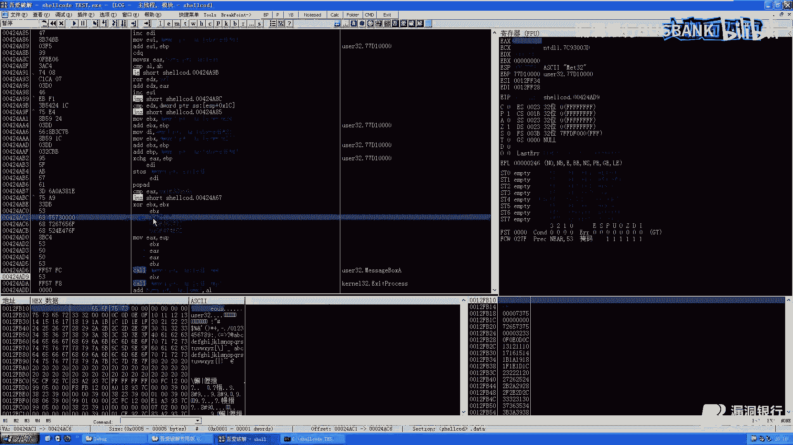
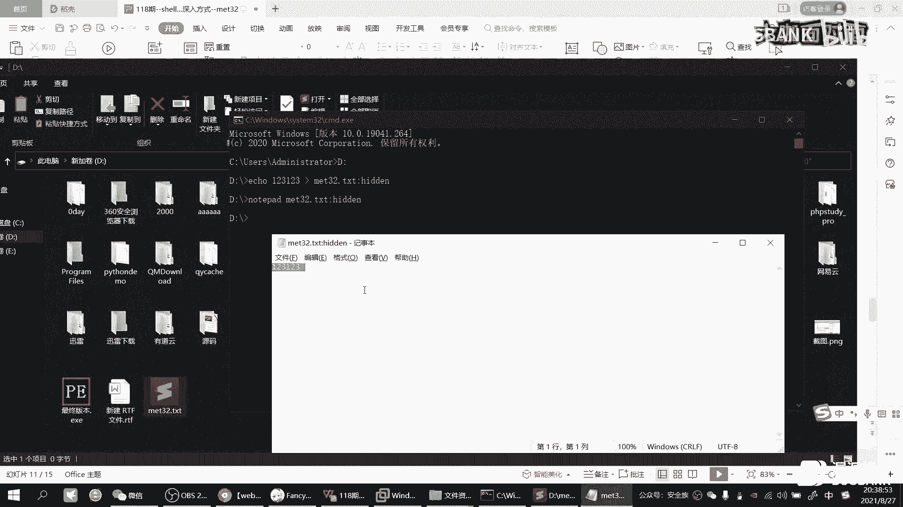
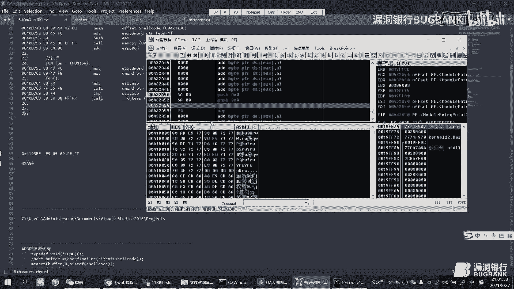
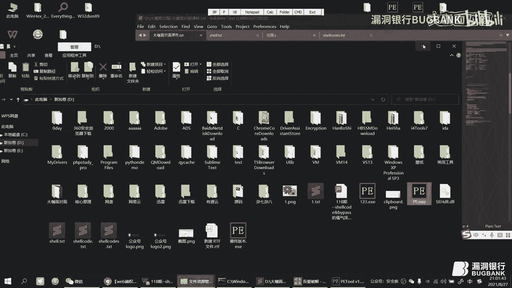

# 课程 P1：Shellcode原理、编写、绕过与权限维持详解 🚀


在本节课中，我们将要学习Shellcode的核心原理、如何编写简单的加载器（Loader）、多种绕过安全检测的思路，以及如何利用Shellcode进行权限维持。课程内容由浅入深，旨在让初学者也能理解并掌握这些概念。

## 概述 📖


Shellcode是一段可以独立执行的机器码，通常用于利用软件漏洞获取程序控制权。理解其原理是后续编写、绕过和利用的基础。


---


## 第一部分：Shellcode原理分析 🔬


上一节我们概述了课程内容，本节中我们来看看Shellcode的基本工作原理。


Shellcode的原理类似于摩斯密码。摩斯密码通过敲击的长短组合来转换为特定字符。例如，字符“1”对应的摩斯电码是“一短四长”。接收方翻译这些信号就能得到原始信息。




**Shellcode与此类似，它将特定的字节序列（机器码）翻译为CPU可以直接执行的汇编指令。** 与摩斯密码不同，CPU无需“翻译”，直接执行这些字节。


一个简单的利用场景是栈溢出漏洞。攻击者通过缓冲区溢出覆盖函数返回地址（EIP），将其修改为Shellcode的起始地址。当函数执行`ret`指令时，EIP就会跳转到Shellcode并执行。

在调试器（如OD）中查看时，左侧是原始的Shellcode字节，右侧是对应的汇编指令。**CPU实际执行的是左侧的字节码。**


我们可以通过分析Shellcode的汇编指令来修改其行为。例如，一段弹窗的Shellcode会通过多个`push`指令将字符串压入栈中。通过修改这些被压入的字符串内容，或者直接替换`push`指令对应的机器码，就能改变其执行效果。

**核心概念公式：**
`被覆盖的返回地址 (EIP) = Shellcode起始地址`


**核心概念代码（栈溢出原理示意）：**
```c
// 假设存在缓冲区溢出漏洞的函数
void vulnerable_function(char *input) {
    char buffer[64];
    strcpy(buffer, input); // 未检查长度的拷贝，导致溢出
}


// 攻击者构造的输入
char exploit[] = {
    ... // 填充缓冲区的无用数据
    ... // Shellcode 机器码
    ... // 覆盖返回地址为Shellcode地址
};
```

---

## 第二部分：简单Loader的编写 💻

上一节我们介绍了Shellcode的原理，本节中我们来看看如何编写加载器来执行一段已有的Shellcode。

获取Shellcode后，需要编写加载器（Loader）来加载并执行它。不能直接交给管理员去运行。加载器的主要思路是：申请内存、拷贝Shellcode、跳转执行。


以下是几种常见的编写方式：


### 方式一：使用C语言内存操作函数


这种方法通过`malloc`申请内存，`memcpy`拷贝Shellcode，最后通过函数指针调用。


**示例代码：**
```c
unsigned char shellcode[] = "\xfc\x68\x..."; // 你的Shellcode

int main() {
    // 1. 申请可执行内存
    char *buff = (char*)malloc(sizeof(shellcode));
    // 2. 拷贝Shellcode到申请的内存
    memcpy(buff, shellcode, sizeof(shellcode));
    // 3. 定义函数指针并执行
    void (*func)() = (void (*)())buff;
    func();
    return 0;
}
```
**流程简述：**
1.  `malloc`申请一块大小为Shellcode的内存空间。
2.  `memcpy`将Shellcode字节码复制到这块内存。
3.  定义一个函数指针指向这块内存，然后调用该函数指针，CPU即开始执行Shellcode。


### 方式二：使用内联汇编


内联汇编更灵活，是更常用的方式。它直接操作寄存器和内存。


**示例代码（使用`jmp`或`call`指令）：**
```c
unsigned char shellcode[] = "\xfc\x68\x...";


int main() {
    __asm {
        lea eax, shellcode  // 将shellcode地址加载到eax寄存器
        jmp eax             // 跳转到eax执行
        // 或 call eax
    }
    return 0;
}
```
**其他内联汇编变体：**
-   **`push` + `ret`组合**：将Shellcode地址压栈，然后用`ret`指令跳转。
-   **直接操作栈指针**：通过`mov`和`jmp`等指令灵活跳转。




**总结对比：**
使用C库函数的方式步骤清晰，但代码稍长。内联汇编方式更简洁、更底层，也更为常用。无论哪种方式，最终都是让CPU跳转到存放Shellcode的内存地址去执行。


---


## 第三部分：Shellcode Bypass 思路 🛡️


上一节我们学会了如何加载Shellcode，本节中我们来看看如何让Shellcode绕过安全软件的检测。

这里介绍几种绕过（Bypass）安全检测的思路。


### 1. 基于文件的Bypass


将Shellcode存储在外部文件中，Loader运行时读取并执行。这能有效分离恶意代码与加载器本身。


**以下是两种具体方法：**


**a) 文件加密存储：**
先将Shellcode与一个随机数进行异或（或加减）加密，存入文件。Loader读取文件后，进行解密还原，再执行。
```c
// 加密写入
for(i = 0; i < shellcode_len; i++) {
    file_buffer[i] = shellcode[i] ^ 0x49; // 简单异或加密
}
write_to_file("shellcode.enc", file_buffer);

// 解密读取
read_from_file("shellcode.enc", file_buffer);
for(i = 0; i < shellcode_len; i++) {
    shellcode[i] = file_buffer[i] ^ 0x49; // 异或解密
}
// 执行解密后的shellcode
```
**注意：** 写入文件的是加密后的**字节**，而不是Shellcode数组的字符串表示（如`"\\xfc\\x68"`），否则会引入额外字符导致解密失败。

**b) 分段存储：**
将完整的Shellcode分割成多段，分别写入文件的不同位置或不同文件。Loader读取所有分段后，在内存中拼接还原，再执行。这种方式可以规避对连续恶意代码特征的检测。

### 2. 基于ADS数据流的Bypass


NTFS文件系统支持备用数据流（Alternate Data Stream, ADS）。可以将数据（如Shellcode）隐藏在一个正常文件的ADS中，极其隐蔽。


**操作流程：**
1.  **写入ADS：** `echo shellcode字节 > 正常文件.txt:隐藏流名`
2.  **从ADS读取：** Loader使用文件API读取`正常文件.txt:隐藏流名`的内容到内存。
3.  **执行：** 跳转到内存执行。


在资源管理器中查看宿主文件，其大小显示为0，内容为空。只有通过特定命令或程序才能访问其ADS内容。删除宿主文件，其ADS也会一并消失。


### 3. 基于Socket的Bypass


采用客户端-服务器（C/S）架构。攻击者将Shellcode放在客户端，服务端（可能运行在目标机器上）只包含一个Loader。


**流程：**
1.  服务端监听网络端口。
2.  客户端连接服务端，并发送Shellcode字节流。
3.  服务端接收数据，将其写入内存或文件，然后加载执行。






这种方式下，服务端程序本身不包含任何Shellcode特征，静态检测难以发现。流量分析可能发现异常连接，但Shellcode本身在传输过程中也可能被加密。


**补充思路：注册表存储**
将Shellcode加密后写入Windows注册表的某个键值中。Loader运行时从注册表读取、解密并执行。执行后可删除该注册表项以清除痕迹。


---


## 第四部分：利用Shellcode进行权限维持 ⚙️


上一节我们探讨了绕过检测的方法，本节中我们来看看如何利用Shellcode实现权限维持，即让恶意代码在目标机器上持久化运行。


一种常见的方法是将Shellcode植入到正常的可执行文件（PE文件）中，使其随原程序启动而执行。


### 核心概念：程序入口点（OEP）


OEP是程序被加载执行时第一条指令的地址。它由**映像基址（Image Base）** 和**入口点地址（AddressOfEntryPoint）** 共同决定。
`OEP = Image Base + AddressOfEntryPoint`
可以理解为：Image Base是“哪栋楼”，AddressOfEntryPoint是“几楼几号”。


### 植入方法


**a) 利用PE文件空白区域：**
1.  使用PE编辑工具（如WinHex、PE Tools）查找PE文件的空白区域（通常由00填充）。
2.  将Shellcode机器码写入这片空白区域。
3.  修改PE头中的`AddressOfEntryPoint`，使其指向Shellcode的起始地址（RVA）。
4.  在Shellcode的末尾，添加一条跳转指令（如`jmp`），跳回原始的程序入口点（OEP），以保证原程序功能正常。

**b) 新增节区：**
如果文件没有足够大的空白区域，可以新增一个节区（Section）来存放Shellcode。
1.  在PE文件末尾新增一个节区，并设置其属性为可读、可写、可执行。
2.  将Shellcode写入这个新区。
3.  修改`AddressOfEntryPoint`指向新节区的起始地址。
4.  同样，在Shellcode末尾添加跳转指令，跳回原OEP。

**自动化工具：**
可以编写程序自动完成上述过程：解析PE结构、寻找/添加节区、计算地址、修补文件头、写入Shellcode和跳转指令。

通过这种方式，每当用户运行这个被植入的程序时，都会先执行我们的Shellcode（例如，反弹一个Shell），然后再正常启动原程序，从而达到隐蔽的权限维持效果。

---

## 总结 🎯

本节课中我们一起学习了：
1.  **Shellcode原理**：类比摩斯密码，是CPU直接执行的机器码，通过修改EIP跳转执行。
2.  **Loader编写**：掌握了使用C库函数和内联汇编两种方式加载执行Shellcode。
3.  **Bypass思路**：了解了基于文件（加密/分段）、ADS数据流、Socket通信以及注册表等多种绕过安全检测的技术。
4.  **权限维持**：学习了通过修改PE文件入口点，将Shellcode植入正常程序，实现持久化控制的方法。


这些知识环环相扣，从理解到编写，再到隐藏和持久化，构成了利用Shellcode进行安全测试（请注意合法合规用途）的一个完整基础链条。希望本教程对你有所帮助。