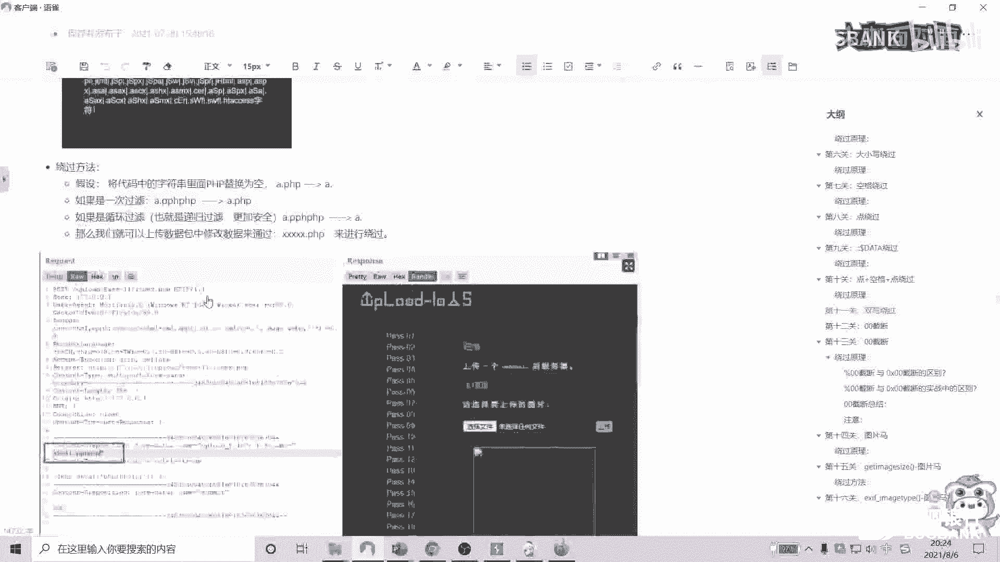
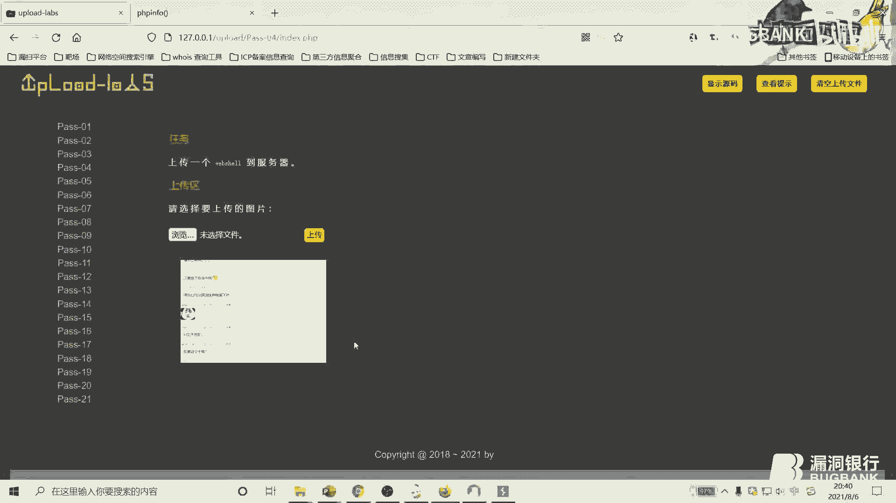
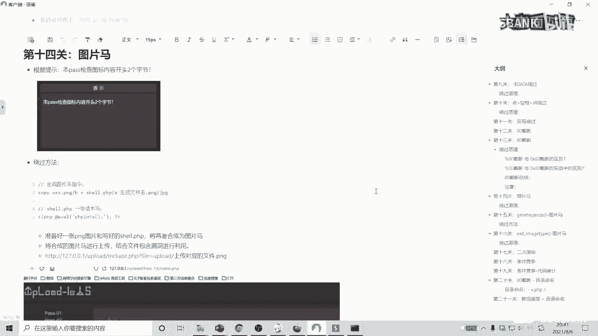

# 文件上传漏洞与黑白名单绕过技术详解 🛡️


在本课程中，我们将系统性地学习文件上传漏洞的常见验证机制，并深入探讨如何绕过基于黑白名单的防护策略。课程内容涵盖从基础概念到实战演示，旨在帮助初学者理解文件上传漏洞的原理与利用方法。

## 概述 📋

文件上传功能是Web应用中的常见模块，如果验证机制不完善，攻击者可能上传恶意文件（如Webshell），从而获取服务器控制权。本课程将首先介绍常规的验证机制，然后重点分析黑白名单验证的绕过技术。


## 一、常规文件上传验证机制


文件上传的验证机制通常存在于客户端和服务端，目的是确保上传文件的合法性。以下是几种常见的验证方式。

### 1. 客户端JavaScript验证
客户端验证通常在浏览器端执行，用于快速检查用户选择的文件格式是否符合要求。其原理是通过JavaScript代码检查文件扩展名。


**示例代码：**
```javascript
function checkFile() {
    var file = document.getElementById("file").value;
    var allowedExtensions = /(\.jpg|\.jpeg|\.png|\.gif)$/i;
    if (!allowedExtensions.exec(file)) {
        alert('仅允许上传图片文件！');
        return false;
    }
}
```


**绕过方法：**
由于客户端验证完全依赖于浏览器脚本，攻击者可以通过禁用浏览器JavaScript或使用代理工具（如Burp Suite）直接发送请求来绕过。


以下是两款常用的浏览器插件，可用于禁用JavaScript：
*   **Disable JavaScript**：功能简洁，一键禁用。
*   **NoScript**：功能更强大，但配置相对复杂。


### 2. 服务端MIME类型验证
服务端通过检查HTTP请求头中的`Content-Type`字段（即MIME类型）来判断文件类型。例如，图片的MIME类型可能是`image/jpeg`或`image/png`。

**绕过方法：**
使用抓包工具（如Burp Suite）拦截上传请求，将`Content-Type`修改为服务器允许的类型（如将`application/x-php`改为`image/jpeg`），即可绕过验证。


### 3. 服务端文件扩展名验证（黑白名单）
这是本课程的重点。服务器通过检查文件扩展名（如`.php`, `.jpg`）来决定是否允许上传。
*   **黑名单**：明确禁止上传某些危险扩展名（如`.php`, `.asp`, `.jsp`）。
*   **白名单**：只允许上传某些安全的扩展名（如`.jpg`, `.png`, `.gif`）。白名单通常比黑名单更安全。

### 4. 服务端文件内容验证
服务器会进一步检查文件的实际内容，以确保其真实性，常见方法包括：
*   **文件头校验**：检查文件开头的特定字节（魔术数字）。
*   **文件加载检测**：例如，对于图片文件，尝试进行二次渲染，如果渲染失败则判定为非法文件。


上一节我们介绍了文件上传的常规验证机制，本节中我们来看看如何利用一句话木马进行测试。


## 二、一句话木马简介与利用 🐚


一句话木马是一种简短的Web后门脚本，攻击者上传后可通过它向服务器发送指令。


**PHP一句话木马示例：**
```php
<?php @eval($_POST['cmd']); ?>
```
*   `$_POST[‘cmd’]`：接收来自POST请求中名为`cmd`的参数。
*   `eval()`：函数将接收到的字符串作为PHP代码执行。
*   `@`：错误控制运算符，用于抑制执行过程中可能产生的错误信息显示。


**利用流程：**
1.  将上述代码写入一个文件（如`shell.php`）并上传至服务器。
2.  使用中国菜刀、蚁剑等连接工具，或直接使用`curl`等命令行工具，向该文件地址发送POST请求，并在`cmd`参数中携带要执行的系统命令。
3.  服务器会执行命令并返回结果。


**连接测试与排错：**
如果无法连接一句话木马，可先通过浏览器直接访问该文件，并在URL中传递测试命令，例如：`http://target.com/shell.php?cmd=phpinfo();`。观察是否能正确输出`phpinfo`信息，以验证脚本是否被执行。


接下来，我们将进入实战环节，首先演示如何绕过客户端的JavaScript验证。


## 三、绕过客户端JavaScript验证 🎯


我们以Upload-Labs靶场的第一关为例。该关卡在前端使用JavaScript验证文件扩展名。




**绕过步骤：**
1.  尝试上传`.php`文件，浏览器会弹出警告，阻止上传。
2.  使用之前提到的`Disable JavaScript`插件，禁用当前页面的JavaScript。
3.  再次上传`.php`文件，即可成功。

**原理分析：**
前端验证代码通常会提取文件名后缀，与白名单数组进行比对。禁用JavaScript后，这段检查逻辑完全失效，请求会直接发送到服务器端。


成功绕过前端验证后，我们面临的是服务端的MIME类型检查。


## 四、绕过服务端MIME类型验证 🔧

我们以Upload-Labs靶场的第二关为例。该关卡在服务端检查`Content-Type`。


**绕过步骤：**
1.  使用Burp Suite拦截文件上传请求。
2.  在HTTP请求体中，找到`Content-Type`字段。原始上传PHP文件时，其值可能为`application/x-php`。
3.  将其修改为服务器允许的类型，例如`image/jpeg`。
4.  转发请求，文件上传成功。

**源码分析：**
服务端验证代码会从`$_FILES[‘uploaded’][‘type’]`中获取MIME类型，并与一个允许的列表（如`image/jpeg`, `image/png`）进行比对。修改请求包中的类型值即可欺骗该检查。

现在，让我们进入核心环节：如何绕过更严格的文件扩展名黑白名单验证。

## 五、绕过黑名单验证 ⚫

黑名单机制明确禁止上传特定扩展名。以下是几种常见的绕过方法。


### 1. 后缀名大小写绕过
某些服务器在比对黑名单时，没有统一将用户输入的后缀转换为小写。


**绕过方法：**
将后缀名改为大小写混合形式，如`Php`、`pHp`、`pHP`。在Windows服务器上，文件系统对大小写不敏感，`shell.PHP`依然会被当作`.php`文件解析。




### 2. 特殊后缀名绕过
利用服务器配置或解析漏洞，尝试一些可能被解析为目标脚本的后缀。
*   **PHP**：`php3`, `php4`, `php5`, `phtml` (当服务器配置了相关解析器时)。
*   **Apache**：`.htaccess` (目录配置文件，可覆盖解析规则)。





### 3. 操作系统命名规则绕过
利用Windows系统的文件命名特性。
*   **空格绕过**：在文件名后添加空格，如`shell.php `。系统保存时会自动去除末尾空格。
*   **点绕过**：在文件名后添加点，如`shell.php.`。系统保存时会自动去除末尾的点。
*   **`::$DATA`绕过**：在文件名后添加`::$DATA`，如`shell.php::$DATA`。这是NTFS文件系统的流特性，保存时会去除该部分。


**绕过步骤：** 使用Burp Suite抓包，修改`filename`为上述格式即可。

### 4. 双写后缀绕过
当服务器采用简单的字符串替换来过滤黑名单关键词时，例如将`php`替换为空字符串，可能只进行一次替换。

**绕过方法：**
上传文件名为`shell.pphphp`。服务器过滤掉中间的`php`后，剩下的部分组合起来恰好是`shell.php`，从而绕过检查。

在掌握了黑名单绕过技巧后，我们来看看防御更为严格的白名单机制如何突破。

## 六、绕过白名单验证 ⚪


白名单只允许指定的少数扩展名，因此绕过难度更大，通常需要结合其他漏洞。


### 1. 截断上传绕过
在特定条件下，通过注入截断字符（`%00`，即空字符）来截断文件名，使服务器只检查截断前的部分。


**条件：**
*   PHP版本 < 5.3.4。
*   `magic_quotes_gpc`配置为`off`。


**绕过方法（GET请求）：**
上传文件时，将文件名改为`shell.jpg%00.php`。经过URL解码后，服务器在检查扩展名时看到的是`.jpg`（在白名单内），但在保存文件时，`%00`会告诉系统字符串在此结束，最终保存的文件名实际为`shell.jpg`，但其内容会被当作`.php`执行。**注意**：在Burp Suite中修改时，需要先对`%00`进行URL解码（选中字符，右键选择`Convert Selection` -> `URL` -> `URL-decode`）。

**绕过方法（POST请求）：**
POST请求中的数据不会自动URL解码，因此需要直接使用空字符的十六进制形式`00`。在Burp Suite的Hex视图中，找到文件名后缀前的点号`.`，将其后的字符修改为`00`。

### 2. .htaccess文件攻击
针对Apache服务器，如果允许上传`.htaccess`文件，攻击者可以自定义该目录下的文件解析规则。

**攻击步骤：**
1.  上传一个名为`.htaccess`的文件，内容为：`AddType application/x-httpd-php .jpg`。这行配置告诉Apache，将本目录下所有`.jpg`文件都当作PHP脚本来解析。
2.  上传一个内容为一句话木马的`shell.jpg`文件。
3.  访问`shell.jpg`，它将以PHP方式执行。

本节课我们一起学习了文件上传漏洞的各种验证机制及绕过技术。从简单的客户端验证到复杂的白名单结合解析漏洞的绕过，理解这些原理对于Web安全测试至关重要。

## 总结 📝


本节课我们系统性地探讨了文件上传漏洞的攻防：
1.  **验证机制**：了解了客户端JS验证、服务端MIME类型验证、扩展名黑白名单验证及文件内容验证。
2.  **黑名单绕过**：掌握了大小写、特殊后缀、系统特性、双写后缀等多种绕过手法。
3.  **白名单绕过**：学习了利用截断上传（`%00`）和`.htaccess`文件攻击来突破限制。
4.  **实战工具**：熟悉了Burp Suite、浏览器插件等工具在测试中的使用。


文件上传漏洞的防御需要采取多层次、综合性的策略，包括但不限于：使用白名单、重命名文件、校验文件内容、将上传目录设置为不可执行等。对于安全研究者而言，深入理解这些绕过技术，才能更好地发现和修复漏洞。