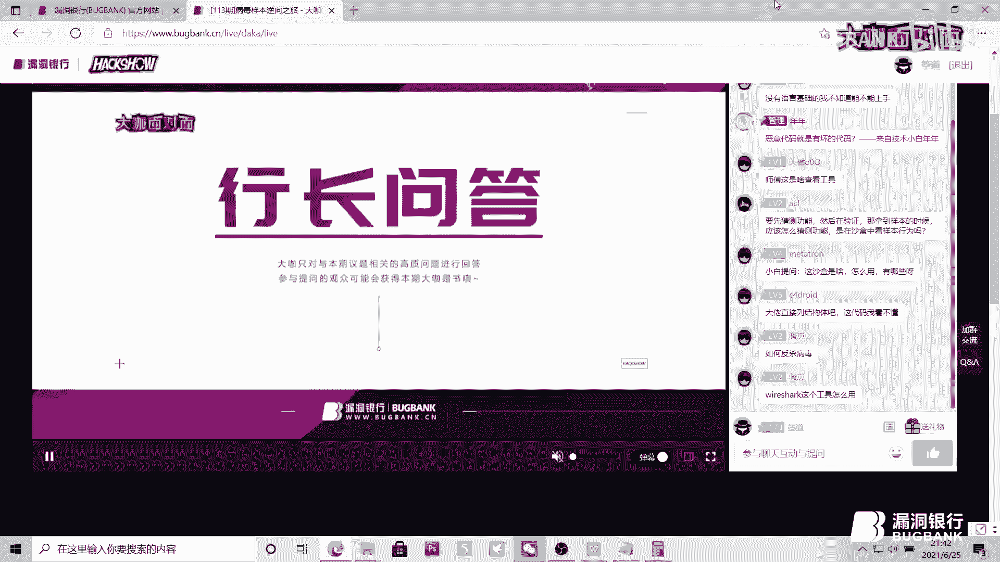
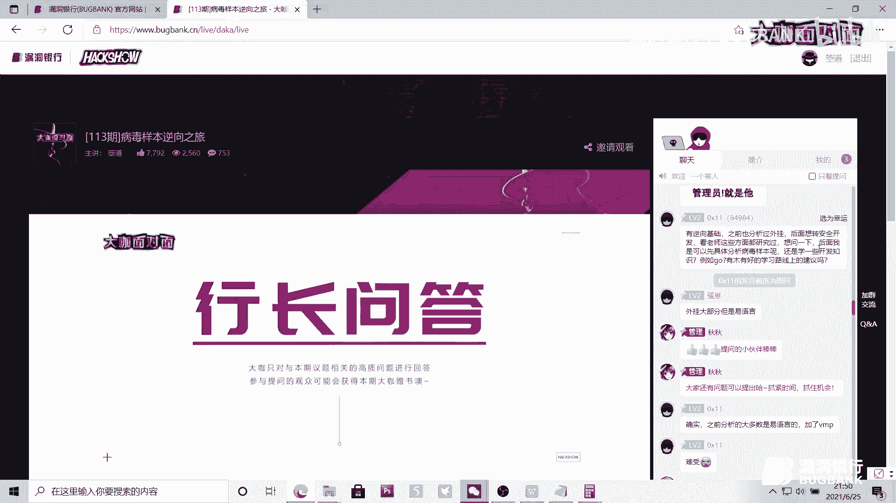

# P1：【发布】病毒样本的逆向之旅-箜道-大咖面对面113期_x264 - 漏洞银行BUGBANK - BV1Yo4y1C7QX

为知舌而存，因技术而生。各位小伙伴们，大家晚上好。欢迎参加第113期漏洞银行安全技术直播大咖面对面。我是今晚的主持人年念。今天晚上要给大家做技术分享的大咖，是有着1余年安全攻防经验。

并且有着丰富实战经验的空道大咖。他带来的技术议题是病毒样本逆向之旅。擅长对病毒木马外挂样本，立进行逆向分析的他。今天晚上要给大家带来不一样的病毒逆向之旅。那本期议题难度系数三颗星。

感兴趣的小伙伴们可要做好笔记，听到最后哦。那同时欢迎各位小伙伴们登录直播间在聊天区进行交流互动。听讲的过程中有任何疑问的话，可以随时在聊天区提出，大家演讲完毕之后。

大咖会在行长问答环节集中解答小伙伴们的疑问。同时呢。😊，今天晚上的听讲福利也将在问答环节结束之后，挑选一位幸运观众送出，是由空道大咖亲自挑选的书籍加密与解密。第4版。

那么下面就让我们有请空道大咖开始今晚的直播分享吧。啊，各位小伙伴们，大家晚上好啊，我这边分享之前，我先简单的做一下我自我介绍。啊，我目前算是一名安全研究员，我这边的话主要擅长于安全对抗技术的研发。

对安全对抗技术的探索和实现研究，其已经有到今年的话已经算第11年了。啊，通过这这么多年的工作积累，其实让我对病毒木马外挂的攻防技术有了一定的一些见解。当然我在安全的道路上还是在不断的学习。

OK那这是我的一个简单的一个自我介绍。那接下来我们就进行做一下晚上的一个分享。

嗯，晚上的分享，其实我主要把它分为做四部分。第一。病毒样本分析一的准备。第二，病毒基本信息的。分析。第三也是一个关键的部分。病毒关键功能的分析。啊，最后一部分是。对病毒样本人有解决方案的一点思考。

那么我就开始第一个话题。我们对于。以我这边以那个。武侠来说，武侠的话题来开点。那其实一个大侠在江湖上行走，那其实如果能在江湖上。不被人家给那个攻杀，包括能够称为大侠。

那么他就需要具备一定的内功以及熟练使用各种兵器或一样的那对于我们的样本逆向的话，其实也是具备这样的一个。特性的那对于我们的内功，对于内向人员的内功是需要哪些呢？那我这边的话列了几个点。第一。

需要在逆向之前，需要有一定的开花能力。因为有功才有房，你具备了一定的开花能力。那么对于你的逆向水平以及你的逆向过程，那是事半功倍的。第二，逆向嘛，那我们所接触的对象就是会编语言。那这个会编语言呢。

就相当于我们在开挖过程开挖学习开花的C语言一样的性质，这是逆向的必备也是。考验一个人的一个能力的部分。第三，需要熟悉一下。windows环境下的PE文件结构。因为。在windows系统下所有的。

文件能可运行的，包括。模块BL模块都是基于PE文件结构而存在的这是。三个三个点，那么最后也就是一个内功的一个关键点。在做逆向的过程中。需要具备足够的时间以及耐心。因为逆向逆向他这个过程中是很枯燥。

而且是。嗯。没有准确性的逆向过程中是更多是通过猜测，然后进行。验证猜测的一个过程。那在这个过程中，很多会有遇到很多门槛，或者说很多的一些。坑在里面，那其就需要我们在这过程中不断的越过这些坑以及这些门槛。

那这需要有一定的耐心和时间。这是一个我所罗列的作为逆向来需要一个具备的一些内功点。第二。有了一些内功，包括一些招式后，那接着呢。就需要一些武器或者说兵器。那兵器呢我们需要什么呢？在逆向的过程中。

需要熟练的使用各种工具，基于这些工具，再加上自自身已有的内功结合下，才能更好的对一个样本去做一些做一个逆向，包括一些功能的还联这块的一些事情。那接下来呢。我给大家分析分析一下呃。分析一下。

我们在逆向过程中。常需要常常用到哪些工具？OKDPID工具。这个呢这个工具呢。我们。不仅是要了解使用这个工具，最好也对这工具的原利有一定的了解。这个PID呢其实是基于PE文件结构的去。去实现的。

通过PE文件的结文件结构，解析出这个E差异或者DN的文件。它所。所具有的一些关键信息，包括区段信息呀，还有那个文件文件的一些字符信息等等。那它还有一个比较关键的一个功能。它可以进行做查壳。

查壳的特查壳它是基于特征来匹匹配的。你可以看到它在这PUPID这些工具下，它都有存储的一个啊。夹壳后夹壳的那些对应的特征码，其实这个特征码话沿用下来，很多场景都会用到这个特征码匹配的。包括。

你们在在游戏过程中游戏过程中很多检测外挂。也是基于这块特征码的，通过特征码去匹配外挂样本，从而进行验证外挂样本。这一块的。具体实现。这是一个。第二个呢啊。第二个呢是。用于分析。P语文件的依赖关系。

它所一个一差异，它能够运行，往往需要即需要有多个功能实现。那么在功能实现的过程中呢，需要往往需要会具备。调用系统的API那调用系统API那同样就需要依赖一些系统的一些de了模块。那通过第二个工具呢。

CFF工具这个我用的会比较多，可以很清晰的看看到它这个工具可以。快速看到这个样本样本的。啊，依赖关系它里面就具有导入几个de了模块等等的信息。第三，那这个工具就比较强大了。

这个工具是作为安全安全立项人员，或者说作为安全的都会应用到了他。名称呢就不用说了，大家都会知道IDA这个工具在于强大的一个点在于它有一个将汇编代码转化为伪伪代码的一个强大功能。

通过IDA静态分析可以熟熟悉啊样本的一个流程流程关系。通过流程关系。可以快速的。进行了解这个样本的一些功能点，功能实现的点。第四。这个呢是逆向的的也是一个必备工具，叫onit bug。

也就是也简称叫OD。那它这个工具呢是主要是用于做动态分析的动态分析呢。因为我们在IDA的时的静态分析的过程中，只能分析它静态的一些结构。

那么在过程中的一些函数的参数的传递以及函数返回值的一些传递过程中呢，是在IDA是没办法进行获取到的那就需要结合一下OD进行做获取的。这是1个OD的一个工具。那第五。行为监控工具。那我这边列的三个的话。

主要的话是做。做一下那介绍他第一恐龙剑，他其实这个工具跟。最后一个PC hunter是一样的，它呢可以监控。样本运行过程中，它所加载。加载的跌了，或者说他所一些释放了，还有一些他在样本。运行过程中。

它会做一些钩子。ho可点这些都可以做一些监控，包括他在进程中启动了几个线程，这些等等进行做一些行为的监控。中间的这个呢是用于网络监控，在样本启动过程中呢。

我们可以进行监控一下那个样本有没有做一些网络行为，包括一些文件释放行为。等等这一块的一些功能点。那第六。这个这两个工具呢主要是用于。分析协议，包括一些抓包分析的那在网上的这个分析过程中呢。

是我没有应用到。因为在那个分析的实际过程中呢。这个。样本的那个危害性是挺强的，在这个实际网上应应用中是没有进行应用，进行做分析它的一些协议包的。网上的主要功能是做一些样本的基本关键功能的分析。

OK那前面铺垫了这么多，有了内功，也有了武器兵兵器的一些。熟练谁熟练，那就是万事俱备。那接着就开始。进行实践做样本的分析喽。OK那我往下走了。啊，拿到一个样本，我们。分析的话。对于分析做样本分析的。

人都会知道我们在分析需要分析哪些信息，哪些点。那我这边的话简单罗列了几几个点，在于第。分析样本的属性。包括文件名称、文件大小、MD5哈希值以及文件所有进行签名等等。这些文件信息。

这个文文件的基文件的样本的基本信息在于。通过这个对应的属性值，可以确认这个对相关联的样本的一些。数据因为在一个样本，它名称可以一直变动，名称可以随便改。但是如果不进行重新编译。

以及没有进行做二进制的修改的话，那么它的MD5。以及他那些。哈西值它是不变的，它这些值是为了啊起重用的，或者说为了定确认这个样本的一些信息用的。或再延伸一下，在开发过程中，其实很多样本。Yeah。

通过MDU作为指纹，作为一个啊比对的一个标准。这是延伸点，这是一个需要分析的样本的一基本属性。第二，需要分析一下样本的结构。样本的结构呢，其实这个话是。看一下这个样本具有哪些属性。第一，样本是否有夹壳。

因为这个夹壳那是个。很重要的话题在于，如果说没加壳，那么对于逆向人员来说，它这个的难度就马上就降低了。因为没加壳，那这个就少了一个很很重要的环节。因为有加壳了，那么这个应用程序呢。

关键的信息都会保护的那。接下来动作就不是直接去弄逆向做分析了那第一步呢，他就就需要先找到壳的入口点，然后通过。通过脱壳把真正的让本人功能点。找到那这个的难度就比较大了。因为市面上现在市面上那些。

壳呢都很多都会用到虚拟机壳，虚拟机壳这样拖起来的话，难度就很大了。拖拖拖出那个C哩机壳的话。那这个就需要对虚拟机壳有一定的了解，这个呢就把门槛给对分析样本的门槛给提高了，这是一个点。第二。

分析一下样本的依赖关系，就是因为一个样本，它不可能仅仅是一个一差异文件。它有有些会把关键的一些功能点都会放在一些它自己实现的一些跌了模块上。通过跌了模块上的导出接口去实现那个关键的功能点。第三点。

了解一下这样本的一些开花语言，通过这个开花语言的特性，可以有可以提高我们作为逆向的一个入口的一个快速点，或者说作为一个逆向的一些。嗯。更更有更有针对性的去做分做逆向。第三呢。样本的基本立向。

基本逆向分析。因为我们拿到一个样本，其实。嗯，如果说能运行的起来，包括嗯。能够正常的跑，那可以直接在运行过程中去看到功能。但是在现实中，往往很多样本是。没办法运行的，那么就需要我们进行做静态加动态分析。

结合去。分析它的结构功能以及它的关键的一些实现点。那这个就需要做一个静态的分析。第四，样本的行为监控刚才说过了，刚才说到了。我们样本可以启动的过程中呢，可以重点监控一下文件的创建。

其实也就是样本会释放哪些敏感文件，或者说释放哪些配置文件等等。那还有就是样本的网络功能。他有没有进行做一些嗯网络通信这一块的？还有呢接着就是样本有没有实现挂钩一些系统的API函数，然后实现一些。

安全的保护或者隐私的一些措施，这是第四点需要关注的。🎼啊，第五呢就是一个比较重要的，就是做样本动态分析。样本的动态分析呢在于。通过样本的静态分析过分析过程中呢，把一些。明关键的一些。参数传递。

比如说压住了函数的一些参数以及。实现完返回。函数的返回值等等这些的一些数据传递以及加密解密的执行流程。通过样本人。的逆项的动态分析可以。很清楚的掌握这些数据的一些传递过程。这是一个比较繁琐。

也是比也是需要也是一个常规的一个流程。对一个样本分析的一个一个准备。那有了这些准备，以及我们这些的目流程的目标确定了。那我们就开始做一下下面的一个分析。O。那我们呢样本的基本信息分析。样本的基本信息呢。

前面你也说了，我们需要。对文件的一些信息。做。记一录。以以及作为一些对抗点。那我们我这边罗列了有关键的有6个点，那这个其实。这是一个常规或者是关键的那在。分析样本时候，其实还有更多的一些需求点。

那这个就是看具体的需求进行做记录了。那我这边列了有6个点，分别于是文件的名称，但是这文件名称是不是唯一性的，因为名称随时可以改的那我网上分享的这个样本名称呢，这也是我我改的。

因为我所得到的那个样本名称是无序的那为了更好的识别它，我把它直接从命名为病毒样本。OK那第二样本的大小。这个。是一个简单的区分的一个样本的信息。第三，样本的修改时间。我这个样本呢是修改时间是两两个月前。

其实因为我这个样本得到的是5月5月份得到的，但是呢这个样本是。最后一次的修改时间是4月4月份的。第四。MDUDCRC。第。第六，哈西值，那这个的三个的一个获取呢。是为了。匹配可以匹配一下它样本的一些。

属性通过这个三个属三个属性呢可以。准确的确认不同名称下的样本的是否是同一个。那。我们获取这个3个456这3个MB5哈CRC以及哈RC值这三个的话，可以通过市面上的一些工具直接去获取的那这个是。

前面的一些文件样本的基本文件信息。那接下来还有一个。一个。对于我们逆向来说，需要关注的一些一些点。那前面也罗列了，也也也有提到了。那受有加壳，这个是很重要的话题。这个壳的话。这个是因为有加壳了。

那对于你的逆向成本是大大。增加的，而且加了个壳的话，如果说加了一个强壳虚拟机壳的话，那么。这个对于逆向出发关键的功能的。的把握性，或者说他的一些。准确性那就是会大大的降低。因为有了这些虚拟机。

通过制定一些它的。虚拟机哇，我们把它。脱完壳其实还是要做做很多的工作。那这个就是。很大很大的一个时间成本的，这个是很关键。因为有了一些夹壳，除非说非有一些啊非常兴趣点，或者说或者说工作需要。

那不然这夹壳会把一部分作为逆向分析爱好者，这些人。会把它寄之门外，因为有夹壳了，那么对应的他们所具备的一些能力就要有一定的。提升这是一个点。第二。

这个样本呢它是基于C加加语言开发的那C加加语言的话开花它这个呢语言的话其实也是有一定的难度。为什么？因为因为它这个的话。语言。相对底层那做起来的话难度比较大，就是开发起来。

而且现在对C加加从业从业人员也相对会比较少。现在的对于现在的所所进行做从事开发的，很多就直接用高级语言，比如说购语言啊，python啊等等这些语言做开发的。第三啊它这个样本是基于VC6。

0工具去开发的那这些其实它能识别出来的的这些属性呢，这些其他信息它都是。基于特征码信息去做匹配的。那么。这个也是通过PEID去做。查询的这前面这些样本的基本信息呢都是。基于PEID的工具去做查询的。

那么它这些匹配出来值呢都是通过特征码方式的。它这些需要进行做大量的分析，大量样本分析，同样样本分析提特征码，然后在特征码上做匹配。这些是题外化，而且也是延伸。那这是一个样本的基本信息。

那接下来样本基本信息分析完了，那我们就看一下样本的流程。关键功能。嗯，这个样本的。功能呢其实是不多，但是又是很多。这个是怎么理解呢？因为它这个样本呢是一个勒索病毒的样本。可以，大家通过我网上的分享。

大家可以。应该是可以很很轻，很很熟悉，有做逆向人有很熟悉。或者说嗯有那么一点感觉能猜出它是属于哪一款勒索病毒的样本。那我这边就先卖个关子。

直接不直接说它是属于哪个病毒样本的那我就先嗯以样本的功关键功能进行做分析。那好了，OK我们回回过来。第一，我们的样本的流程这个不难可以看到一下，看到它样本启动起来后。

首先是通过HTTB访问指定的域名或者是网址。访问完了再开启进行恶意代码的服务程序。那这里面呢开启后呢，它有进行做一个服务的判断。判断。判断它服务是否有存在以及服务是有是否有打开。如果这个服务呢有存在。

那么就把它这个服务给打开，打开完呢，它是做了什么去释放真正的勒索病毒的应用程序以及模块，这是一个一个流程，那么如果说这个服务是没有存在的，直接在你系统上注册这个服务。注册完服务呢，就开启。

内网以及外网445端口漏洞了传播尝试以及。的一个功能。这个内网外网渗透。渗透漏洞尝试的个。的尝试完呢就会进行做最后一个工作，自销毁进程。就是因为他这个的。功能已经实现了，已经已经他的一个。

他的一个关键的一些事情已经做完了，做完，那么他就进行做自销毁的一个过程。销毁完。那么对这个音样本，它就退出这个就结束了。那这是它的一个关键流程。那我下面呢就开始做它关键代码的一些分析。

为了因为网上的分享嘛，为了更好的看效果，把下面的截图都是以IDA静态结构进行做。截取的，因为IDA可以更清楚的看它的依赖关系以及它的那个流程关系。OD呢只能去做一些关键函数的一些调试。

所以呢下面的下面所看到的图都是以我IDA进行做截起的。OK那我们来看一下那个这个样本的。的理功能点。嗯，可以看看到那个。IDA附加进去通过不是IDA说错了。IDA通过把它载入进去后。

我们可以很清楚的看到它一个流程。这个的对于逆向人员来说，它这个功能点其实很很清楚可以看到它其实是不难的。因为它一个内函数下来就有四五个空空格，一个对应的关系。第一个呢其实它是一个字符串信息。

也不是一个函数。那这个这些是可忽略的。第二个呢SUBSUB在IDA里面它是表示的是一个。函数的一个功能是自己实现的一个函数的功能。接下来呢后面的三个可以看到是一个红色的，而且这个可以。

如果说大家有做开花的话，它可以很清楚了一下子就可以看到它其实是对于啊操作网网络的网络的一个一个系统API。那它这个同时在IDA里面呢，它也有几个比较。人可就是比较人性化的。

他把系统一些能识别到的AP函数。用红色标红，那么你这个流程的话看了一下其实就是一个函数，前面一个字符串，后面三个。三个调用三个系统的API这是一个一个样本的。一个主要的流程。那这个看到了后。

那其实我们在分析样本的过程中呢。那这个比较。量就比较小。那我们话工作量就可能就一下子就会。缩小很多了。那可能在分析的过程中，大家可能会问。就是说我们怎样去就是说在一个一拿到一个样本。

该怎样去做一个分析呢？那。怎样去用IDA去做一个分和OD进行做一个分析呢？那下面说一下我个人的一些平时的一些一些方方方法。我平平时拿到一个样本的话，首先会通过IDA先去看一下流程结构，先多看它几遍。

第一，我不一定马上通过它的一个一个一个跳转。因为它这个跳转过来以话，是可以看到对应的流程结构以及汇编代码，通过多次的。看它的流程结构，可以对一个样本有一个大概。大概有一个脑脑子里面有一个大概的一个结构。

那这样有助于我们对这样本的功能的猜测。因为我们做逆向嘛，更多的更更多的是进行做不断的猜测以及不断验证猜测的一个过程。那这是一个。我的一个小小的一个小小的一个。平时小小的一个一个方方方式。

那接下来我们往下走，切切切到。下一个。嗯，刚才看到的是一个。关键的一个流程就是这个样本的一个流程。那。大家可能会问。对吧问我现在说了这么这么久，或者说这么多样本长什么样，那样本是什么样的？那这个呢。

晚上呢。为了为了让大家能够带着这个问题。去看后面的分享，那我这边还是继续卖瓜子，我就直接不我就先不展示这个样本。我主要晚上做一个样本的关键功能流程分析，好吧，那我们可以。看一下。呃。

这个样本刚才看的是流程结构，那我这边的话像切换过来呢，直接可以按着IDA中直接用快捷键按ent键就可以进行按k那个空格键就可以进行做啊流程结构以及代码的切换。那OK我这边进行切换到那个汇编代码。

汇编代码的话可以更。清楚了一个那个。那个看到它对所对应的一个一个的实现功能。那可以首先可以看了一下，我们前面有看到，刚才有说到了，它其实是由5部分组成的。第一部分是自无创信息。OK第一个自主创信息呢。

这个是一个对应的一个。域名或者说一个网网站网址。那这个网址呢其实现在已经还是可以用。但不过呢这个这个域名呢，这个网址呢已经被重新注册了这个通过啊。🎼工具去查询。

目前是一个是被一个英国的一个安全人员进行注册的，所以他这网址呢还是可以访问的，但不已经不不是原来的那个病毒的一个网网址，这是一个。接下来呢第一个呢第一个是通过内存段拷贝，将这一串。

这一串的那个字符串进行拷贝到那个。前面的这个变量里面，那接着通过拷贝完呢，可以看到，刚才也有提到呢，下面呢三下面的4个红红色的部分。

它这四个部分呢是调通过调用系统API这些API呢是都是windows下已经实现了，我们直接可以用了，不需要去自己实现了。像第一第一个那蓝色部分呢，它是通过。也也是有也是系统的。但不过呢它是通过一些。

通过实现的。所以呢这个是前面的一个工作呢，其实就是一个打开访问网址的一个流程或者一个过程。那其实他这个。在开发过程中呢，其实它这个也是一个怎么说呢？我以安以开发人员来说，它这个也是一个不安全的开发方式。

为什么呢？为什么？因为他这个也都没进行做一些判断，不管有没有打开成功，都往下执行。那我们在正常的开发过程中呢，应该要对通过。调用调用完了进行做一些判断，对吧？进行做一些判断有没有进行有没有执行成功。

那他这个是应该在在开发人员来说，它是一个不负责任的一个一个流程，反正我就功能执行了，成不成功，那就看看运气了，对吧？这个是。延伸一下，因为我毕竟是。是做安全开发的那网上的分享呢。

包除了这个分享这个样本的一功能外，我也会参插进去做一些。安全开发的一些一些想法，对吧？那由那回回到主题，回到回到这个样本的点。那接下来呢。访问完网址，接下来呢才是关键的一个功能。嗯，关键的功能。

关键功能呢红色下面呢最下面有一个F。SUB下划线。那这个呢在IDA刚才我有提到SUB呢在IDA里面它表示的是一个函数函数的一个功能，后面跟上了对应的是一个地址。那接下来我们看一下它这个函数做了哪些功能。

或者做了哪些。哪些恶意？因为在右边我已经做了个简单的标识或者注释，它其实就是开启恶意代码的服务。那我们往下走，看一下他开启怎样的恶意代码。喂。恶意代码嘛怎样什么情况下叫做恶意代码这个。

不知道大家怎么去理解，那这个。这个恶意代码呢，平时呢我的理解是这样的，在。在分析过程中呢，他其实操作一些敏感的信息，我我们就会通常会帮他操啊算。一个恶意贷码。就是说一些常规的。

因为我们在通常的一些常规的软件开发过程中是不会做一些。一些很敏感的，包括获取系统权限啊，以及啊以及做一些控制控制系统一些信息功能的这些一般都把它作为定义为恶意代码，这是我的理解，但是可能理解起来。

别的理别人的可能有一些一部分人的理解，可能会。会有有所差异。但。这些理解呢其实是。叫做什么？叫做万变不离其宗。即实是。字面上的说法不一样，但是他。真正本本质的东西是一样的。O那话有点多。

那我们接下来看一下他这边的恶意代码的功能有哪些。那我我在这个IDA汇编代码上可以。的右边已经最每一行了。代码功能做了一个注释。第一呢。需要获取病毒文件和路径，这个呢就是为了做。后续的释放。

以及做一些配置的读起的作用的。的功能。那他可以看我们刚才也说了他。系统API在IDA里面，它的表现形式呢都是以红色标识的那。那我们呢如果在分析的过程中呢，就需要对这些API函数有一定的了解。

如果不了解的话，可以到。网网络上去搜索一下。那第一个呢，那我这个就。每个函数大概说一下。第一呢它是通过获取文件的路径，获取完了去判断一下。有没有那个服务，因为他这个样本的主要的。点在于。

通过服务方式进行做控制的。那就我们要看。看到这些嗯红色的一些API函数。需要如果说不懂了，需要继续去做做一些啊分析。那我们来看一下关键的吧，看一下那个。这个202829行这这两行这两行呢。

大家可以看到一下，它是比较一个比较特殊的，它不是红色的对吧？不是红色的呢？那可以看一下，那其实它这个呢？就是一个结构体的一个负值的过程。为为什么那个我能猜测出为什么我能知道它是一个结构体呢？啊，第一。

我们刚才在开篇之前，我也有说过，我们在做逆向的时候，最好具备一些那个一定的一些开发的一些能力。通过这些开发的开发的自身的一些开发开发的一些能力的话，可以快速的定位，定位到快速的定位确认这个样本的功能点。

第一，可以看一下，它第一个它是通过负值的负值。因为。这个绿蓝色部分的这个值呢是怎么获取的呢？这个就是要。因为这个样本呢就是要去结合一下。结合一下去OD去立向。OD逆向的那其实也是一样跟IDA差不多的。

它也有两个，它有两个方式，一个是用载入的方式，一个是用附加的方式。那在动态过程中，这个我我这边是用附加的形式，在虚拟机环境下进行做。附加逆向分析。通过这个分析呢，它这个是传递的进去的，是一个。啊。

索要进去跳转就是啊在这里面呢，直接按在IDA里面直接按ent键，可以进行做这个关键函数的一些。O我们接下来呢，其实对于这个嗯每个函数的进每个函数，对吧？那对于那个的话直接可以跳转进去做分析。那到最后。

这两个复值完，这个是通过获取那个函数的一个。名称，然后去做。实现的OK那他这个呢刚才也说了，也也在这边注事上也也有也有。也有可以看到右边的注释，它其实就是一个。创建服务以及开启服务的一个一个流一个流程。

那这个呢这个代码呢是刚才也说了，是通过前面往前走。OK是通过前面这个函数跳转过来的这个函数呢怎么跳转呢？直接按IDA里面按ent键就可以直接跳转过去，通过这个进行做分析？它的一个功能。

那这个它的功能我这边就已经简单的做了一个讲解。OK那我接着往下走。接下来呢它是一个这个是算一个比较。比较关键的这个也算一个比较关键的，就是会对那个。45端口一个漏洞的一个一个尝试。

那这个函数是怎么来的呢？大家可以，刚才我有没有给大家在上一上一个上页霹例上有没有给大家说了那个两个函数，2个2829行这两个负值的过程。那这个呢就是这个函数呢就是前面的一个负值过程。那这个呢分析之前呢。

其实也就是我们在分析的过程中呢，它在IDS是层层递进的。所以呢这个分析就是需要基需要有足够的耐心，一行一个函数，一个函数跳转，然后切换机进去去做调试，去做猜测，去做验证的一个过程。嗯。

接下来呢这个函数呢做了关键的一个一个操作，今年开了两个县程。呃，第一个呢，前面。前面呢是一个网络初始化，它这个呢是通过TCP。通讯方式。那TCP通讯方式呢就需要去做一些。初始化工作。

那前面这个呢就初始化完了，初始化完呢。进行开启线程，线程中的第三个又是1个SUB下划线，它这个呢是一个线程的回调函数，通过回调函数去实现啊这个执行线程的功能。可以看到它这个呢流程下来呢。

其实就两个关键的。一个县城。去做操作。那么在右边我这边。也有注释了。第一个呢是通过内网IP进行做漏洞。传播尝试的。第二个呢是通过外网。外网的一个。漏洞尝试的那我们接下来呢这个两个县程呢，我们来看一下。

因为它这两个是。关键的功能点关键的功能点呢，我们来看一下对应的线程回调函数是怎么实现的。我们看一下407720，就是第一个线程的回调函数的实现部分。OK我切换。切换下来了。嗯，这个呢。45端口呢其实。

在前段时间应该大家都会有所了解。那它这个端口呢是利用微软的SNB漏洞。去做尝试的那这个样本也是这个也是这个的那通过这个那这个45端口这个那可能大家应该会猜测到它这个样本是什么是哪个样本的。这个样本呢？

其实是前段时间比较火的，或者说前段时间爆发出来就是动荡比较大的，它就是一个永恒之蓝的勒索病毒的样本。那晚上呢其实就是我对它一个关键功能提起的一个分享。好吧，那这个呢通过445端口呢，我们把前面的那个我。

给大家留了留留留的那个。闲念呢给大家。做了一个解释。那我们来看实际的功能，它这个实际的功能呢其实是。很简单的。是通过呢内网呢是怎怎么实现呢？是通过获取内网网卡信息。

然后再进行做判断系统里面的445端口是是否有开放，然后在内网里面不断的去尝试去做做攻击，因为在内网那个如果说有有有开放这个端口的话，那么它就会进行做感染的一个传播的一个过程。那如果说445这个端口没开。

O它这个功能就过不去了。就它这个内网的一个内网的一个尝试的一个话，就。长就失败了，这是一个那。关键的功能是这样，那我们来具体看一下。这个可以看一下我们。我我们这个题列出来的它的几个关关键点。

他可以看到一下，他进行了一个在读Y。循环里面不断的尝试。而且。他那个尝试。也没有。多没有尝试说错了，没有进行无限尝试，进行次数了5次以下的线尝试，对吧？尝试尝试完。如果说它这个端口有开放。

OK它进行接着就是感染的一个操作，也就在最下面的这个函数的下面下面的一个函数操作，函数的实现。操作完了，他其实也就是。这个线程了这个因为这个列出来是一个线程的一个回调函数。那么结尝试完了。

那么它就的这个线程就可以结束了。因为它的这个功能点就已经实现了。那延伸一下这个呢。通过这个样本的内向，其实我们也可以看到，我们在实现一个可以提高一下我们在开发过程中创建一个线程是怎么实现的？

线程的回调函数是怎么去实现的。线程通过这个线程里面去无限去做一个读 wire去多次尝试的一个一个一个一个步骤。好吧，这是题外化，简单的一个题外化。那内网尝试完呢，刚才前面有说了。

它是开启两个线程进行做漏洞尝试的那内网尝试完呢，它会进行做外网的尝试。我们可以看一下。看一下那个。外网他怎么去怎么实现的？Yeah。呃，外网呢它是通过自己去拼接随机的地址。因为我们知道1个IP地址。

它是有4个4个部分组成的。OK它这个就是四个去做拼接4个每。每一个去做随机匹配并做拼接，然后拼接出1个IP地址，然后接下就去做尝试。继做尝试尝试呢一样的，它也是在它因为这个刚才说了。

它两个内网和外网那个尝试。那这外网呢，它前面呢现成的回调函数，里面进行做IP地址拼接拼接完了，它再进行做开启一个线程进行做。445端口这个也就是前面的一个工作，进行做外网的一个。尝试。

不断的一个尝试的过程。因为它这个病毒的功能，其实因为。它也是在一个一个一个不断的一个尝试不断推测的一个过程。那它这就是通过一个一个一个内网与外网的一个尝试。那关键功能分析完了，我们来看一下它的一个效果。

呃，可以看一些看一下我这边列出来的这个呢，只是它一小部分。它这个呢地址IP以及什么，它一直在做。做那个拼接，就是一直在做尝试。其实很恐怖的，因为它这个呢是。一直在尝试45端口，他这个呃我在。分析。

验证它流程的时候，可以看到它无一直在把一直在把它这个。量是非常大的。如果说大家有有感兴趣的话，可以。也可以去尝试一下，让他跑一下，看一下实际的效果。好吧，这是一个。

前面两个关键功能的的一个一个实际的一个效果。因为它。我们分析功能也需要是验证功能。我们刚才说过做逆向分析，就是其实就是一个不断的一个猜测验证的一个流程，对吧？那。这个呢。我直接就。就把前面的功能分析完。

以及他怎么去实现，实现完了，它就直接去展示出来的。通过这个呢是直接在虚拟机环境下进行做跑进行做验证的。OK验证完功能后，我们往下走。再回顾一下。回顾一下，因为我们在。

开篇的时候就是在讲解那关键功能的时候，我们有说到它呢其实就主要是两个。功能点，一个是判断有没有开启这个服务，有没有这个服务。有了服务，那么就是进行开启服务，释放病毒样本。真正的核心的病毒样本。

那前面呢是没有开启服务，媒去没有开启服务的一个流程。没有开启服务的话，那。已经实现完了，那这个呢是已经在主机上已经有跑过一次，那在主机上已经有有这个服务了。

那服务呢就是进行做释放样本的一个一个释放一个真正的一个核心的一个病毒样本的一个一个功能点。O你可以我们可以看看一下它呢这个其实。看到这么多密密麻麻的。

这个呢代码是通过IDA通过F5为代码实现出来的那通过看到这么多密密麻麻的代码，那可能就有点。有有有有点累，对吧？那我们可以通可以。可以关键的看一下。看一下，比如说把它稍微区分一下哪些是函数。

哪些是变量的负值就OK了。那我们可以看一下，第一，前面的话。从字眼上就可以看到，它是通过加载资源释放数啊。加载资源数据。

拿到计算资源数据的那我们就可以猜测它这个真正的那个病毒样本是存放在那个这个应用程序的资源段部分。那通过资源段部分去把。病毒样本释放出来释放出来呢，它这个呢又有一个其实通过这个样本，其实我们又可以。

可以在开花过程中，或者说在逆向过程中，又有有一些值得我们利用的。他直接把它进行释放到那个。系统目录下，因为在系统目录下，在一般用户或者说一般人的情况下，他是不会去动它的，而且也是不会去修改它的。因为。

他可能就直接就理解为它就是属于系统自带的那一般人是其实是一个11个。一一个不会就是一个对他的一个身份的一个就是一个。确认。😡，那这呢也就说明了它这个也是相当于一个这个样本的一个自保护的一个功能点。

因为我往上是进行做这样本的关键功能与流程分析。那这个这个呢其实也是一个关键的功能点。那在一关键的一个保护的它保护自己把它释放丢丢在那个系统目录下，那其实这个呢就是。伪装保护自己。的一个一个过程。

如果说呢我们如果说把它直接释望在。谁比如说在C盘直接的C盘目录下，那可能。这样的话大家看到哈，可能或许就觉得它不是一个一个安全的东安全的应用文器，他可能直接就把它删掉，或者整或者把它。

移除掉了的一个操作。那他这个就是。一个一个保护的一个功能，通过将。啊，样本中从资源部分释放出两个两个两个模块，一个是。病毒样本的一个核心模块，也就是一这个一加E1加E接着是。

一个跌了就是这个一加一所所要依赖的这个跌了模块。释放完了。那最最下面来个启动的过程，通过创建进程的方式进行做启动。在最下面最下面倒数第第三行，这边就是通过创建进程的方式进行做启动的。

这个呢其实也可以延伸一下。我们在开发过程中，其实在程序启动话。创建进程的方式是用的会比较多一点的。好吧，那这是一个它的一个释放的一个释放一个功能一个11个一个展示。那我们实际看一下效果吧。

因为我现在是功能点，那那在实际过程中是什么样的的情况呢？标题。第一。第一个可以看到。第一个呢是通过前面前面有介绍了，他是通过行为监控工具去做。监控的那可以看到它实际运行过程中呢。有释放出这个。这个的。

样本。也是真正的核心的一个一个病毒样本的一个功能。那在下面呢是一个展示。实际呢因为它前面呢是一个监控它的行为，行为监控完了，实际目录上它其实下面就是一个。一个实际的一个产出，以及实功能的实现。

下面呢释放出这两个样本。那第一个呢是我把它随机命名掉了，它其实也是从我是分析的过程中是把其他样本也做参考进来，然后把它。

做替换参考的那实际呢是释放下面的第两两个下面的一个2个1个一加E以及1个DL的模块，这是一个样本的一个释放功能。那接下来呢。我来我们来看一下这释放出来的这个E差异到底做了什么。嗯。

这个一加1呢也就是这个。也也就是这个实际的过程中的一个真正的一个。行为。那我们看一下，我这边已经将这一加E的主要的功能罗列出来了。呃，我需要强调一下，它这是主要的功能，它有一些细的一些功能点呢。

我没有进行一些罗列。好吧，那这个E叉E呢主要功能，第一是进行创建临时目录文件夹。第二，操作病毒的服务系统服务进行做自启动病毒程序。就先就是前面已经做好了。

前面那个E叉E已经把那个服务没有服务的情况下创建服务，有服务的话，已经打开了。这边呢在应用程序接着进行再启再进行操作系统服务。第三。还进行做释放病毒文件。第四。😊，也就是这个敏感的部分进行。权限的更改。

然后获取到你主机的完全访问权限。其实就是把你。新增一个用户新增一个用户，然后在用户的属性是超级管理员权限的。第五。解密以及加载。存放勒索病毒的比特币相关的一些信息数据。第六。

通过调用这个模块进行触发这个模块的导出函数功能，这是它一个主要的一个功能点。那这个一加E呢在运行过程中还会进行做动态释放。动态释放这个DLDL呢主要进行做哪个哪个功能，也就是前面第六点，它进行做触发的。

触发完它主要做哪些功能呢？它主要我罗列了有三个点，第一是通过进行监控是否有新磁盘进行插入。然后如果有磁盘进行。插入到主机上，那就是将直接将你的那个。插入了磁盘，直接进行全部呃178种文件进行做加密。啊。

第二，对前盘178种后缀文件名进行做加密。第三。😊，通过启动这个应用程序进行尝试删除文件，删除一些。嗯。一些敏感的一些关键的文件，把你些采删除，这是一个争议差异，落罗列出来一些关键功能点。

OK那我这边的话就。提起主几个关键的功能去给大家展示以及做分享这个。有这个呢就没有完全展示这其中的一些啊其些功能点。那我们来看一下。一个应用程序呢也跟前面一样，拿到一个应用程序呢。

我们可以看先看一下它的流程结构。okK我们来看一下。相对于。这个流程结构相对于前面的那个流程。发现这个就复杂了。那么碰到这个呢，这个就。很懵啊。这个工这个分析起来的那个工作量。

那就是相当复杂的那这个就是前面我我我提到了，我们在分析的过程中呢，就需要有。🎼足够的时间和耐心。因为在这么多，那这个是需要一定的时间成本进去的那我们看一下。

通过这个话按空格键IDA中通过空格键将它切换成汇编代码。汇编代码实际看一下我们它的一个功能点。流程东能点。嗯。第一。Yeah。在我们看到这么多功能的话。我将来已经大家注释好，但是呢可以看到其实。

我们在注这些注释的过程中，其实都是有结合OD进行做一些它的一些参数的一些分析的。我们刚才。这个过程呢我就没有罗列了。那我们直接来看实际看一下IDA中的效果。刚才有说了，红色的部分呢都是属于系统API。

系统API那前提就是要我们对这些API做了解了。而且他他这种了解起来的。成本很低，直接我们就可以。如果熟悉的系统和API那直接就这道意思。如果不懂，okK直接百度一查就可以搞个定了。那我们就列了几个。

你看这个前面前前面部分都是属于红色的部分，我么这个部分呢？这些部位呢主要做哪些？第一，进行操作。电脑的名称获取名称，获取名称生成一一个。属于唯一的一个字符串信息。第二，做了什么？

在C盘的windows目录下创建。两个目录，然后进行释放文件拷贝文件。一个过程。再接着呢进行做一个启动服务的一个过程。服务启动完了，接着就是开始它真正的一个一个操作了。我这边罗列了下几个D。

广注册表写入当前建程名称的属于病毒的一些它的一些名的关键信息。第二，在释放资源里里面的压缩文件，它的解压密码。是这后面这个带有2017的这这这串，就是相当这个应用程序里面呢，其实里面还包含压缩文件。

压缩文件里面呢存储的是。他的一些关键的一些信息，他还还还进行了啊压缩文件的密码的设置。第三呢，接下来呢他在这个释放出来的那个刚才说了资源文件里面呢。有存储了一些它敏感的一些关键的配置文件去。

那这个文件呢里面存放了3个比特币账户。接下来呢可以看一下，它呢是通过命令行方式进行隐藏病毒文件的，就相当于。自保护的一个这也是一个自保护的一个一个行为。隐藏完文件呢，他呢想控制操作电脑呢。

他就是要进行获取这个系统主机的一个。完全访问前限，也就是。管理员权限。接下来呢就开始进行对那个加密解密的一些操作。那这个呢主要是进行。操作解密解密一些它对应的一些一些敏感的一些信息。那解密完了。

其实刚才我们也也有说过呢，它就通过触发那个跌那个那个。DL模块的导出接口函数去进行做系统的一些加密。以及对这些。名以及对那个。真正病毒样样本功能的那个界变的一个。呃，展现与展示。

这是一个他的一个111个大的一个流流流程。然后呢，这个流程完了，我们看一下吧，看一下。几个关键的功能点吧。第一。我为什么列出这三个功能点呢？这三个不是这个功能点呢？这个呢其实我是为了想说明哪什么事情呢？

想说明至于这种方式，就是这种。直接用硬编码的方式把它写到应用程序上，是一个相对不安全的一个111个做法。因为对于这种敏感特特别这种什么那这种敏感的一些信息的话，在正常的。的情况下应该是在。作为一些。

正常做法是一些内存的一些做释放啊，以及说一些啊一些。信息的保护。那他在这实际过程中呢，是直接是暴露在这里的。虽然说他这个信息是。不不怕被人知道了。但是呢相对于我们的开挖过程中，他这个信息我们是需要。

稍微做一些保护的这是一个它的一个光能点，这也是我罗列出来的，罗列出来的他通过这个呢进行。缓思我们开花的一些一些。安全点。OK这是一个他的一个比特币账号的一个关键功能，111个实一个账号信息。

接下来呢前面刚才有说说到。嗯，他呢。有调用了通过直接通IDN它，我们可以看到它有采用了ISAAES的加密方式，还有往下看看到它其实在。在下面的这个这些函数里面呢。

这些是系统微微软提供于用于加密的一个内库。可以从那个函数的一个名称或者字眼上就可以看到它是。一个用于加密解密的一个函数的那这个函数呢是微软提供的，它是用于。加密的解密的一个内裤。

主要是用于ZIP压的压缩算法的一个加密解密操作。这是一个它的一个一个我体验出来一个它的一个关键点，我们可以借鉴和实用呃适用的。OK那。另外一个关键点。就是对PE文件的判断。那这个是怎么得来呢？

这个呢首先呢是通过前面。这个呢通过前面那个释释放出来的那个DL文件去实现出来是里面的实现部分的那我体验出这个对PE文件结构的判断的话，主要是想给大家分享一下它这一个我们对P议文件是怎么进行做判断的。

OK我们对于一个评议文件结构。它其实主要有几大部分，其实有三大部分。第一，它是由dos头部分组成的。第二是由ND头ND头呢，它里面有几个关键的信息。第一PE文件签名信息。第二，PE文件的文件头。

第三PE文件的可选头。这是ND头部分。那第三部分呢是P文件的切段信息。极端信息。那对于一个怎么样去判断一个文件是属于PE文件呢？那我们来看代码，实际看一下代码怎么去怎么去判断呢？

这个也是可也是一个一个一个。常规或者说一个通用的判断方式。首先呢。对于判断一个BE文件结构呢有两个关键点。第一，判断它dos头部分。dos头部分呢。首先一个PE文件。

它的关键dos头第一项也相当第一个部分呢，它有一个关键字MZMZ呢。也就是对应了23117，23117是十进制的那我们在实际过程中呢。可以看到这个对应的十6进制呢，就是5A4D5A4D呢。不道这个。

这个有没有大家有没有看，不知道能不能看得清楚。那。这个呢就。就不那个了。23117呢是十进制，十进制转化为十6进制呢，就是。MZ的字母的一个。对应的数值。第一个判断人到死头部分呢。

接着是要判断我们刚才说了。PE文件呢有几大部分组有dos头NT头七段信机组成的那倒s头已经过了，接着需要判断一下它NT头部分的PE签名。所谓的PE签名呢，其实就是两就是PE的关键字。

也就是下面看到了17744。它这个呢对应的就是1个PE的关键字。通过这两个判断，他就可以进行判断出那个这个。文件是否是属于PE文件结构的？判断完，因为他这个我提炼出来，他这个呢是实际病毒样本。样本呢。

实际样本中他还是要判断一下。因为它要运行，那他就需要做一些环境，就是运行环境的判断。那它这里面呢在他的判断是通过ND头ND头下面的那个机器字段去做判断了。那我这边有给他简单罗列一下，它呢。16金制。

14C对应的是I386，也就是。也就是我们通常说了32位的系统。200呢16进制的200呢对应的是。64位的系统。最后一个呢，8664它对应的是MD。下的64位系统。嗯。

那这个呢还有更详细的对于这个环境的判断，那就不再罗列了。我这边提炼出来了，只是为了给大家展示，给大家分享一下对于P语文件的一个一个判断的一个流程。OK这是关键的功能点。那我已经把一些。

关键的功能部分都已经进行分享完了。最后分享一下。对这个病毒样本的一个一个思考。也在思考前呢，也给大家简单做一个回顾，好吧，回顾一下我们这病毒呢，其实这样本呢其实做了哪些功能。第一，首先也就是它的载体。

也就是原运用程序，它呢会进行。判断。判断有没有那个服务。如果有这个服务，OK。就。进行做释放病毒的操作。如果没这个服务呢，就进行。创建服务，然后开启服务。

接着进行内网4以及外网45端口的一个渗透的过程呃，一个尝试的过程。那是那这个是一个一个流程。第二。嗯，通过释放下来的样本样本呢主要可以大家可以把它理解为。

其实就是进行做主机加密以及那个勒索病毒的呃账号以及一些加密的一些操作。这是一个网上的一个主要的一个功能以及流程点。那。分析完这么多了，那个提炼的这么这几个关键点。OK那我有对一些病毒有一点想法。

样本的有点想法。第一，在预防部分呢。建立在主机上进行做。安装杀毒软件，这是一个常规做法。那这边呢建立是安装火龙。混龙软件为什么至少说呢？广告比较散，而且它没有相对其他的一些杀毒软件的话，不会那么猥琐。

好吧，第一第二。不要进行在网上随意的下载第三方软件，下载第三方软件呢尽也尽量进行做一些区分最简单的方式，最那个一个方式。可以看一下它文件是否有签名，或者说他文件这些尽量先做一些查科查杀病毒的操作。

因为在杀毒软件会已经帮我们把这些事情做做好了。那第三呢，这个也是一个比较可比较关键的一部分。我们电脑上一些。一些敏感的一些或者是些关键的资料，最好做一下，随时备份。做一些可以说是网盘上啊。

或者说在做一些其他硬盘上的一些一些备份。防止呢像我同事一样，怕十几年的的一些关键的一些工作资料，以及个人资料都匪于一旦了，这是一个1一个。我的一个一个点。那对于。分析病毒的情况下。的几个点。第一。

首先呢一定得在。一个非主机环境，或者说我。在虚拟机环境下，那最好在这虚拟机环境下。做一些隔离，只是说把网络。断掉以及这些。那个。以及对这些。嗯，一些敏感一些通信方式就是往说白了。

其实就是把它一定要把它在分析的时候，在新拟机环境下，最好做一些隔离网断网断断网络的情况下去做分析的这是第一第二。我们在分析的过程中呢。就会涉及到静态分析以及动态分析的一个。因为我们在分析的时候。

静态分析只能让我们了解大概的一个关键结构。那结合一下动态分析呢，是可以把这些结构。更细化，更更准确的分析出来。第三，可以监可以进行一些行为方面的做监控。行为监控下，他这个病毒所进行操作的。

但是不建议是这样做，建建议在我们分析的过程中去做分功能分析一下。因为这是在监控中，你如果没做好，它你的电脑可能就直接感染病毒了。你虽然在心拟机环境下感染病毒了。你如果说虚拟机环境下。

这个45端口没关OK那你有可能你内网下你的主机也也有可能感染病毒了。这是分析病毒的一点想法。第第三个部分呢，对病毒的个人解决方案。那这个呢就是通过从样本实际功能上去做分析而得出了一一点点想法。

因为第一因为他这个样本呢是主要是通过嗯S微软的SMB漏洞，也就是一些端口的一些尝试。那我们呢如如果非必要情况下，把这些端口都关闭了，防止。病毒感染。第二。因为这个病毒样本呢会进行做复制体的判断。

那这个我该在实际的过程中是实际分享过程中是没有没有进行做罗列的那那但是他里面具备这个功能，通过创判断有没有存在复制复制复制体。那如果说这个复制体存在他那个程序就病毒样本就不会去做运行。

那我们我一个一个一个。通过这分析过程中，那我们也可以直接这样，我在实际启动一个程序。把这个复制体给占用了。OK它的样本其实就样本功能就是没办法就能启动起来的这是针对分析的过程中做了一个两个思考方式。

那最后呢，其实。对病毒样本的一些通用的解决方案。也就是现在已经因为这些解决方案，其实已经帮我们，人家已经帮我们做了，而且是免费的。只要我们随手点一点就OK了。那主主要做哪个呢？更新系统补丁及时做更新。

第二就是做病毒查软件查杀啊。在可以在一段时间一段时间进行做查杀病毒系统和查杀。这是一一些一些我这边的一些想法。那其实呢晚上分享完这个病毒样本，那我可给给大家再。延伸一下，提几个。

也不是说延伸再巩固一下吧，提几个点吧。那对于。病毒样本分析了几个，可以关注几个维度。可以从几个维度上去做分析的。第一可以。从病毒样本的自启动部分，也就是因为这个目前的从常从平时来看。

其实能够样本中自启动，又就两个方式。第一，通过系统服务去启动的。第二是通过注册表方式进行做自启动的。那么可以关注这两个点进行做分析。第二，可以关注一下病毒样本呢所释放出来的一些文件。那通过这些释放文件。

可以进行做一些。真正的一些操作。那我们可以进行这个释放文件的一些维度的分析。第三。现大部分的样本他都会进行网络通讯方式。那这就是我们需要可以监控一下他的网络行为。

也就是可以通过行为监控以及网络抓包的去做监控。通过这网络行为监控可以抓出可以抓抓提炼出一些他的关键敏感信息。最后一个维度呢。就是进行做。加密解密的分析。通过分析他的一些加密解密算法。

从而去做对应的对抗功能。这是我我的一个一个对样本分析的可以侧重的几个维度。给大家再重复一下。第一其实就是样本的自启动部分。第二，样本的释放功能部分。第三，网络通信。第四其实就是加密解密部分。

其实就是四部分去重点去分析一个样本。通过样本呢这个四部分维度来分析，那它的关键功能点其实就可以提炼出来。如果说通过这几个点分析，那晚上其实因为网上分享其实我也主要是侧重这四个点呢去做分析。

OK那这是差不多的一个情况。那由于时间年龄，那我晚上的分享就差不多就到这里了，感谢大家在百忙之中能够抽出。宝贵的时间来参与这次的。活动希望我晚上的分享能给大家在后续的逆向实践中带来一点点启发或者一些。

一些方向。接下来呢我简单打个广告。啊，这是我个人的一些公众号，公众号，我在空余的时间会进行啊做一些安全开发逆向破解黑客技功文技术的一些梳理总结。那如果大家可以感兴趣的话，可以关注一下我的公众号。

那我们以后一起一起交流，大家共同进步。那好了，晚上我的分享就到这里了。嗯，好，那感谢空闹大咖的精彩分享。听完本期直播内容，相信大家都学到了不少有关逆向病毒样本的干货内容知识了吧。那话不多说。

接下来就是即将进行我们的行长问答环节。我看各位小伙伴们在认真听讲的过程中都提出了许多疑问，那如果现在还有疑问的话，也可以继续在聊天区提出我们的空闹大咖将会来解答大家的疑问。那在稍后的福利赠书环节。

大咖会根据聊天区的交流情况选出一位幸运观众，所以大家可以抓紧机会提问啦。我们也请空闹大咖打开一下直播间查看一下观众的聊天页面，呃，右上角只看提问来查看一下问题。那我们请空闹大咖开始解答疑问吧。

OK那我先从第一个问题开始吧。一般没。😊。

没有符号的样本应该怎么分析？这个呢其实就是嗯我们通常的做法，因为。常规的做法呢，直接是通过字符算进去，就是做温析。那如果没有呢，那我们可以。先看一下。可以看一下它这个样本中的导入关系。

也就是他所依赖就是说他所调用哪些系统API通过API进行做猜测。然后这个再接结合。结合一下那个OD的一些动态调试的过程去做一些分析。因为因为我们做样本分析，最主要最主要先找入口点以及突破点。那就可以。

如果说没有符号的话，那可以就是通过。关键函数就是它的导入表，导入表，也就是它的依赖关系。那通过这些导入表的函数在OD里面通过下断点，然后进行做分析，这是一个我的一个思路。嗯，能不用看F5嘛？

我想了解一下汇编分析的技巧。呃，为什么不看呢？因为这个已经工地上已经支持了这个东西。可以大大提高我们的个分析效率。我们为什么不看呢？这是我的一个说法想法。那分析会。了解看汇编的技巧。

那这个其实在汇编实际的过程中呢，可以。还是结合一下会比较好F5要结合一下。然后通过嗯如果说在OODIDA里面那个。分析不出来话，可以进行。定位到OD里面去做动态的分析。一样啊。其实晚上给大家做分享的。

的，都是需要进行做静态和动态分析的。没有这两者相结合分析，其实很多所猜测出来的功能点都没办法得到验证，这是我的一个1111个1个解答。那。第三，没没有语言基，没有语言基础，我不知道能不能上手。

那这个的话其实。我可能我晚上的。的说法可能有点那个有。有有有一点那个没说清楚，有开发语言基础的话，那是对逆向来说。会有一个更大的帮助。那么如果没有语言开发基础，其实也可以分析的，只不过是分析起来。

过程中话会可能会走的弯路会相对会比较多一点。这是一一个那个都可以的。其实。只是说有开发语言基础可以提高分析的效率。呃，以及深分析的深度。如果没有语言基础的话，也不要。不要灰心，哦也是可以做分析的。

那接下来我分析呃，再回答。几个问题吧，再接下来再回答这个。查看工嗯，可以，6啥这是啥查看工具，这个可能我没没法没办那个那我简单说一下吧，查看工具。那其实这个查看工具的话是挺多的，因为。

你可以到那个有一个那个I破解，它有一个工具包，他已经都帮你集成了，你可以直接去下载。通过这个集成工具，你可以做可以。可以进行做什么做。直接分析已经不用去做做做做这些工具的筛选。他已经帮你罗列好了。

比如PEPE文件的工具是哪些以及静态分析工具，动态分析工具有哪些？好吧，那就是那我在。我刚看到了一个一个一个。一个问题点。外挂大部分都是一都是一言。那这个确实是因为因我这边也时常跟这个外挂打交道。

他确实是一元就开发了。而且他这一言开发起来做起来话，其实是。难度比较小，因为它呢其实。已经都集成到一个模块上了，那直接很多都直接可以调用到模块就搞定了。而且一言是中文语言，那这个开发门槛就更低了。

对于那个话这个而且它做出来功能效果是。一样的是跟跟其他言是一样的这是1111个。

一个一个一个一个情况。那我再回答最后一个吧，最后一个问题啊，如何反杀病毒？那这个的话就是。其实在现实中，已经如果说我们不是作为单作为一个逆向，以及那个话，我们如果说对于普通的一些用户的话。

那个市面上一些杀毒软件已经帮我们做好了这个工作，已经会帮我们做好了那个查杀以及做维护的工作。那如果说我们作为逆向，作为我们安全从业安全开发人员来说，那我们做如何做反杀呢？那这个呢就需要我们去做分析。

通过分析，然后得出对应的功能点，对应的功那个对抗点，只有通过实际的功能来分析，才有才有办法做一些对抗的以及做它的反杀。那问题就就差不多回答到这里。如果有一些没回答到的话。那大咖你需要交流嗯。呃。

刚刚有一个呃表哥问了一个蛮长的一个问题，你看。对你看把那个只看提问取消，看看。

OK稍等稍等一会。嗯。可能要拉到很很下面哦，OK我有看到是不是啊？对对对，有立想基础。之前你分析过外挂，后面想转安全开发。那看老师这方面你都研究果想问一下，后边可以先分析具体样本吗？还是学一些开发知识。

例如够我没有学习上的建立。啊，这边的话可以这样的，如果说有逆向基础，也有做一些也有分析过一些外挂，那主要其实还是还是想你做安全开发的话，那还是要学一定的开发开发语言。那一那你如果说例如啊开发语言的话。

在学习路线方面的话，其实网络上很多。而且呢培训机构，其实你可以看培训机构已经帮我们都做好这方面的工作，你可以通过培训机构那些目录可以找到他的你你你想要的学习路线。那那这是一个。那如果说。分析一的话。

因为如果说安全开发，像我们因为我这边就是一个属于安全开发的一个岗位，对吧？那我们这边的话其实是逆向以及开发，基本上是五五开这样的一个一个一个操作。那这个的话。可以两者相结合一下。

但不过呢建立是可以先把逆向的这些点。学习一下，比如说逆向，因为我们在逆向过程中是遇到的不是晚上单纯的晚上这样的一个小流程。首先我们在逆向过程中可能可能会碰到加壳以及加款调试。

以及后边会有一些阿3阿0城的一个驱动保护这一块的那这块可能都是要做一一定的了解。那那这个就需要大家花时间以及耐心的去学习的。那最好的这种学习方式，我个人的一些学习建议的话，可以就是说以通过实践去做学习。

通过一些实际的一些一一些项目去做去做学习提高。因为通过。通过去逆向过程中，把这些他的那个逆向的过程中，你会碰到很多很多问题。那你通过这些问题的针对性的去学习。那你。这样的提高会更快。

这是我的网上的一个这11个一个讲解，不知道有没有人能够帮助到您。嗯，应该已经替大家解答了许多，应该也对小伙伴也有一些帮助。那我觉得今天晚上的这个问答环节也差不多了。那非常感谢我们空闹大咖的耐心解答。

由于时间有限呢？大家如果后续还有问题的话，可以到我们的技术社群里继续交流。那接下来就是今晚的福利放送环节啊，空道大咖亲自挑选的书籍加密与解密第4版即将要送出。呃。

我们可以请空道大咖说说为什么想要送这本书给大家。😊，OK那其实我我选这本书的话，其实有几个因素，几个原因。第一，他这工这个书籍的话是应该也算。安全立项以及做安全的一些算工具书。

它里面所涵盖的知识点是非常多的。而且它这个已经是算是一个抗起安全论坛里面一些一些精华帖，就相当于一些关键的一些一一些知识点。那通过这个话。也可以延伸一下，发其实就是市面上的技术。

其实就是在这里面这些点上其实做延伸的。在平时过程中，其实在过程中是很很有需要的，很很。对于我们的一个逆向一些思路，以及一些一些。操作其实都里面都已经帮我们有有理论加实践实践的一个1一个部一个一些例子的。

那OK这是我的一个一个选这本书了。因为它是其实一个一个安全一安全立向人员的一个算一个工具书，真的是很不错。工具书。我自己因为我自己也有买，我是觉得是不错，所以也就选了这本作为晚上的一个礼物。嗯，好。

那希望这份礼物的加持也能让各位小伙伴们在学习逆向的路上啊越更慢一步。好吧，那究竟这份幸运的礼物要落到哪位观众头上呢？我们就有请呃大家弹幕可以刷一下，然后有要我们有请空道大咖来挑选幸运观众。空闹大咖。

你可以在你想要送书观众的ID边上点那个设为幸运，然后给我报一下他的ID名字。呃，我们运营小姐姐后台也帮忙记录一下。OK那我这边的话写的话是。选为选一个那个可能有需要的人，好吧。

那就选那么回答了最后问题的这个人，他是想进行做样本分析的这个。人，那他的名称叫。0X11这个用户希望能够这本书能够提高，能够在你后续的学习过程中能够对你有所帮助。好的，看看来大家还是要多提问，多问问题。

大咖才眼熟你是不是那？让我们恭喜这位直播间ID为。呃，直播间ID为0。X11的这位小伙伴，你将获得这本加密与解密第四版，需要你根据直播间的获奖提示，在相应的区域留下正确的收获信息。

或者在直播后私聊运营小姐姐，我们会尽快把书给你寄出，希望小伙伴耐心等待。那么到这里，今晚的直播就要结束啦，空闹大咖还有没有什么想跟大家说的。嗯，希望大家在安全的这道路上能够越走越好，越走越远。啊。

那我就没了。嗯，好，那再次感谢空道大咖的用心准备和精彩的演讲，希望本期支持大家都能学有所得，有所启发。如果你想回顾本期的直播，我们将在下周五的时间发布录屏。敬请关注官网的更新，还有群里的录屏更新通知。

那今后也请大家多多关注我们的空道大咖，还有他的微信公众号小道安全，最后感谢所有观众伙伴们的守候，还有对开面的支持和喜爱，如果你也想像大咖一样直播分享，欢迎找我报名。

大咖面对面是一个展示白报光彩和传播技术的舞台，不具年龄不为资利。只要你有才花感分享，我们都欢迎。那如果想进群交流的话，可以在本直播间页面的底部找到群号。直播间的地址是固定的，大家可以收藏到浏览器。

那今天晚上的直播就到这结束了。😊。

8感谢各位小伙伴们的积极参与大咖面对面，周五8点见，我们下次再约吧。

