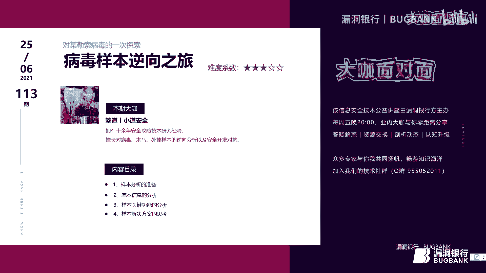
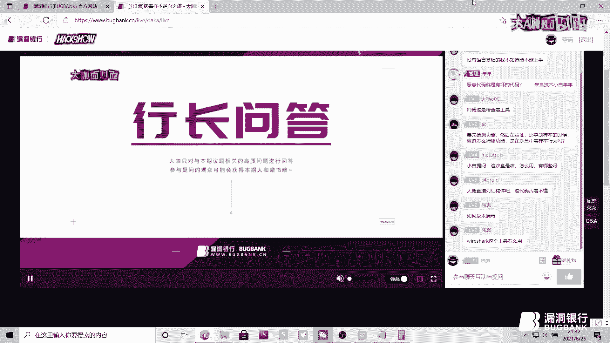

# 逆向分析入门教程：永恒之蓝勒索病毒样本分析之旅 🔍




在本教程中，我们将跟随安全研究员“箜道”的分享，学习如何对一个真实的勒索病毒样本（永恒之蓝）进行逆向分析。我们将从准备工作开始，逐步深入到样本的关键功能分析，并最终探讨防护与解决方案。本教程旨在为初学者提供一个清晰、直白的逆向分析入门指引。

---

## 第一部分：病毒样本逆向分析的准备 🛠️

在开始逆向分析之前，就像武侠高手需要内功和兵器一样，逆向分析人员也需要具备相应的“内功”和熟练使用各种“兵器”。

### 逆向分析人员需要具备的“内功”

以下是进行有效逆向分析所需的核心能力：

1.  **一定的开发能力**：理解程序如何被构建，有助于更高效地分析其被拆解的过程。具备开发能力能让逆向工作事半功倍。
2.  **汇编语言基础**：这是逆向分析的“必修课”，就像开发需要懂C语言一样。它是理解程序底层逻辑的关键。
3.  **熟悉Windows PE文件结构**：在Windows系统下，可执行文件（.exe）和动态链接库（.dll）都遵循PE（Portable Executable）文件格式。理解此结构是分析的基础。
4.  **充足的时间与耐心**：逆向分析过程往往是枯燥的，充满了假设与验证。遇到困难和“坑”是常态，需要耐心去逐步攻克。

### 逆向分析中常用的“兵器”（工具）

工欲善其事，必先利其器。熟练使用工具能极大提升分析效率。

以下是分析过程中常用的几类工具：

*   **查壳与基础信息分析**：
    *   **PEiD**：用于识别文件是否加壳，并解析PE文件的基本信息（如区段、编译器信息）。其原理是基于特征码匹配。
*   **依赖关系分析**：
    *   **CFF Explorer**：可以快速查看可执行文件依赖了哪些系统DLL模块，以及导入了哪些API函数。
*   **静态反汇编分析**：
    *   **IDA Pro**：功能强大的反汇编工具。其核心优势在于能将汇编代码转化为更易读的伪代码（F5功能），帮助理清程序逻辑流程。
*   **动态调试分析**：
    *   **OllyDbg (OD)**：用于动态调试分析。当静态分析无法获取运行时数据（如函数参数、返回值）时，就需要用OD进行跟踪调试。
*   **行为监控分析**：
    *   **Process Monitor / Process Hacker / PC Hunter**：监控程序运行时的行为，如文件创建、注册表修改、进程线程操作、加载的DLL等。
    *   **Wireshark**：监控程序的网络通信行为，分析其网络协议和数据包。
*   **协议与抓包分析**：
    *   **Fiddler / Burp Suite**：主要用于分析HTTP/HTTPS等应用层协议。在本病毒分析中未直接使用，但在分析有网络功能的恶意软件时很重要。

---

上一节我们介绍了逆向分析所需的内功和兵器，本节中我们来看看拿到一个样本后，具体要分析哪些内容。

## 第二部分：病毒样本的基本信息分析 📋

在深入代码之前，我们需要先对样本有一个整体的了解。这包括文件属性和结构特征。

### 需要分析的样本属性

首先，收集样本的基础信息，这些信息如同样本的“指纹”：

1.  **文件名称**：可随意更改，不是唯一标识。
2.  **文件大小**：一个基础的区分属性。
3.  **文件修改时间**：记录样本的最后修改时间。
4.  **MD5值**：重要的哈希值，只要文件内容不变，MD5就不变。常用于样本唯一标识和比对。
5.  **CRC校验值**：另一种校验文件完整性的方式。
6.  **SHA哈希值**：与MD5类似，是更安全的哈希算法，也用于唯一标识。

**公式/代码示例**：获取MD5的命令行工具（如`certutil`）
```bash
certutil -hashfile 病毒样本.exe MD5
```

### 需要分析的样本结构

其次，分析样本的构成，这决定了逆向的难度和入口：

1.  **是否加壳**：这是关键。如果样本被加壳（尤其是虚拟机壳），核心代码被保护，逆向难度会剧增。第一步就需要先“脱壳”。
2.  **依赖关系**：分析样本运行时需要哪些DLL文件。有时恶意功能会封装在独立的DLL中。
3.  **开发语言**：识别样本是用什么语言编写的（如C++、Delphi、.NET）。了解语言特性有助于快速定位关键代码逻辑。

---

## 第三部分：病毒样本的关键功能分析 ⚙️

现在，我们进入核心环节，分析这个勒索病毒样本的具体行为。本次分析的样本是著名的“永恒之蓝”（WannaCry）勒索病毒。

### 样本主程序流程分析

该病毒样本的主程序逻辑清晰，主要流程如下：

1.  **访问指定网址**：启动后，首先会尝试通过HTTP访问一个硬编码的域名（作为“自杀开关”，已被安全人员接管）。
2.  **服务判断与操作**：
    *   检查系统中是否存在特定的恶意服务。
    *   **如果服务已存在**：则启动该服务，由服务来释放真正的勒索病毒核心模块。
    *   **如果服务不存在**：则在系统中创建并注册这个服务。
3.  **网络传播尝试**：服务运行后，会尝试利用MS17-010（永恒之蓝）漏洞，通过内网和外网的445端口进行传播感染。
4.  **自销毁**：完成上述操作后，主程序进程自我销毁退出。

### 关键代码分析（使用IDA静态分析）

以下是使用IDA Pro对主程序部分逻辑的分析：

*   **访问网址**：代码中直接硬编码了域名，并通过`InternetOpenUrl`等API进行访问。这是一种不安全的编程实践，未对访问结果做充分判断。
    ```c
    // 伪代码示意
    char url[] = "http://www.iuqerfsodp9ifjaposdfjhgosurijfaewrwergwea.com";
    InternetOpenUrl(hInternet, url, NULL, 0, INTERNET_FLAG_RELOAD, 0);
    ```
*   **创建服务**：程序调用`CreateService`和`StartService`等API来创建并启动一个Windows服务，实现持久化驻留。
*   **漏洞传播线程**：程序创建了两个线程，分别负责内网和外网的445端口漏洞扫描与攻击。
    *   **内网线程**：获取本机网卡信息，生成内网IP段进行扫描尝试。
    *   **外网线程**：随机生成公网IP地址进行扫描尝试。
    *   线程函数内部是一个循环，尝试连接目标的445端口，若成功则进行感染。

### 释放核心勒索模块

主程序的服务功能会从自身的资源段（Resource Section）中解密并释放两个核心文件到系统目录（如`C:\Windows\`）下：
1.  一个`.exe`程序（`tasksche.exe`）。
2.  一个`.dll`库（`tasksche.dll`）。

**行为监控验证**：使用Process Monitor等工具可以清晰地捕获到文件创建和写入的过程。

### 核心勒索模块功能分析

被释放的`tasksche.exe`是真正的勒索执行者，其主要功能包括：

1.  创建临时目录。
2.  操作服务确保自启动。
3.  释放更多病毒文件。
4.  **提升权限**：在受害主机上创建具有管理员权限的新用户，获取完全控制权。
5.  解密并加载勒索信息（比特币钱包地址等）。
6.  调用`tasksche.dll`的导出函数，执行核心勒索操作。

`tasksche.dll`的核心功能是：
1.  监控新插入的磁盘，并对其加密。
2.  对磁盘上178种特定后缀的文件进行加密。
3.  尝试删除系统备份和卷影副本，防止恢复。

### 加密与PE文件判断

*   **加密算法**：在代码中可以看到对`AES`等加密算法的调用，以及微软提供的加密库函数（如用于ZIP算法）。
*   **PE文件判断**：病毒在感染前会判断文件是否为有效的PE可执行文件，避免破坏系统。判断逻辑基于PE文件头：
    ```c
    // 伪代码示意：判断DOS头签名 ‘MZ’
    if (*(WORD*)pFileBuffer == 0x5A4D) { // “MZ” 的十六进制
        // 判断PE签名 “PE\0\0”
        if (*(DWORD*)(pFileBuffer + dosHeader->e_lfanew) == 0x00004550) {
            // 是有效的PE文件
        }
    }
    ```

---

上一节我们详细剖析了病毒的行为，本节中我们一起来思考如何防范和解决这类威胁。

## 第四部分：对病毒样本的思考与解决方案 💡

### 回顾与总结

本节课中我们一起学习了“永恒之蓝”勒索病毒的逆向分析过程。我们了解到它的攻击链：通过漏洞传播 -> 释放载荷 -> 加密文件 -> 勒索赎金。其关键技术点包括利用系统服务持久化、通过网络漏洞横向移动、以及复杂的文件加密和反分析手段。

### 防护建议

对于普通用户，可以采取以下措施进行预防：

1.  **安装可靠的安全软件**：并保持实时监控开启。
2.  **谨慎下载软件**：从官方或可信渠道下载，运行前可检查文件数字签名或用安全软件扫描。
3.  **定期备份重要数据**：将关键数据备份到移动硬盘或云端，并确保备份设备与主机隔离。

### 分析病毒时的注意事项


如果你打算进行病毒分析：

1.  **必须在隔离环境中进行**：使用虚拟机（VMware/VirtualBox），并确保**断开虚拟机的网络连接**（使用Host-Only或NAT模式并禁用适配器），防止病毒逃逸感染真实网络。
2.  **静态与动态分析结合**：先用IDA进行静态代码阅读，再用OD进行动态调试验证。
3.  **谨慎进行行为监控**：在确认可控的前提下，使用监控工具观察行为，避免触发不可逆的破坏（如加密）。

### 通用的解决方案


1.  **及时更新系统补丁**：此病毒利用的MS17-010漏洞早已有官方补丁。保持系统更新是最有效的防御。
2.  **关闭非必要端口**：如无必要，应在防火墙中关闭445、135、137、138、139等端口。
3.  **使用安全软件全盘查杀**。



### 逆向分析的四个核心维度

最后，总结一下分析一个恶意样本时可以重点关注的四个维度，这能帮助你系统性地开展工作：

1.  **自启动方式**：样本如何实现持久化？是通过服务、注册表、计划任务还是启动文件夹？
2.  **文件释放行为**：样本运行后释放了哪些文件？释放到了什么位置？
3.  **网络通信行为**：样本是否连接了远程服务器？通信内容是什么？协议是怎样的？
4.  **加密解密算法**：样本是否对数据、字符串、配置文件进行了加密？使用了什么算法？密钥如何生成？

通过从这四个维度深入剖析，你就能相对完整地掌握一个恶意样本的主要行为模式。

---


**本节课总结**：我们完成了一次从准备、基本信息收集、到关键功能逆向分析的完整旅程。我们不仅学习了具体的工具和方法，也建立了分析恶意软件的系统性思维。逆向分析是一门需要耐心和实践的艺术，希望本教程能为你打开这扇大门。