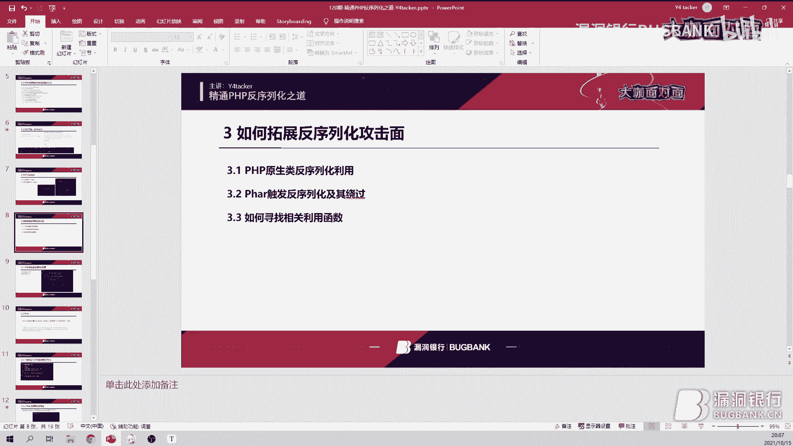
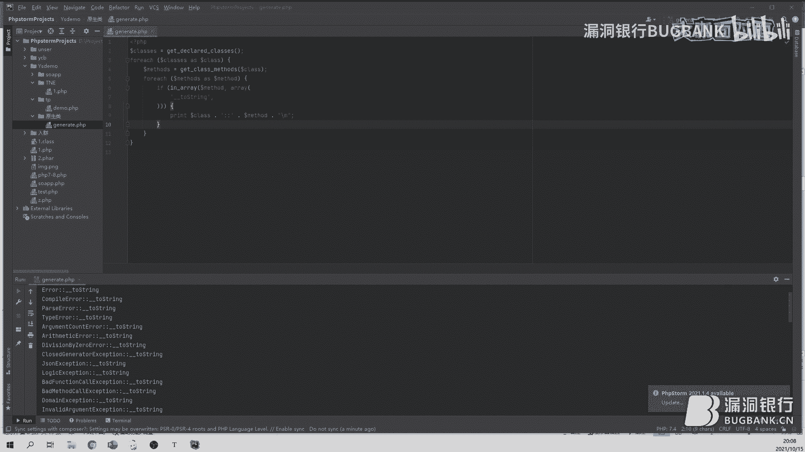

# 课程 P1：精通 PHP 反序列化之道 🚀


在本节课中，我们将要学习 PHP 反序列化的核心概念、攻击链（POP链）的构造方法，以及如何通过 Phar 反序列化等方式拓展攻击面。课程内容从基础概念入手，逐步深入到实战利用，旨在让初学者能够理解并掌握 PHP 反序列化的基本原理和利用技巧。

---







## 序列化与反序列化基础


序列化和反序列化是一个相对的过程。序列化的出现是为了解决如何在网络传输或持久化存储中保存一个对象的问题。序列化对应的函数是 `serialize`，它的作用是将一个对象转换成一个字符串。反序列化对应的函数是 `unserialize`，它的作用是将字符串恢复成原来的对象。


以下是 PHP 中一些常见的魔术方法，它们在反序列化利用链中扮演着关键角色：
*   `__destruct()`: 对象销毁时自动调用。
*   `__toString()`: 对象被当作字符串使用时自动调用。
*   `__get()` / `__set()`: 访问或设置不可访问属性时自动调用。
*   `__invoke()`: 尝试以调用函数的方式调用一个对象时自动调用。
*   `__wakeup()`: 在反序列化时自动调用，常用于修复或安全检查。


上一节我们介绍了序列化的基本概念，本节中我们来看看如何寻找和利用反序列化链。


---


## 寻找与利用 POP 链


很多时候，反序列化漏洞的利用代码并不会直接出现在像 `__destruct` 这样的魔术方法里。它通常隐藏在普通的类方法中。这时，我们就需要构造一条属性导向编程（POP）链来连接这些方法，最终达到执行任意代码的目的。


POP 链的构造思路是：从一个可触发的魔术方法（如 `__destruct`）开始，通过控制对象的属性，使其调用另一个类的方法，该方法又可能触发另一个魔术方法（如 `__toString`），如此串联，最终到达我们想要执行的危险函数。


例如，考虑以下简化场景：
1.  类 A 的 `__destruct` 方法会打印其 `$a` 属性。
2.  如果我们能将 `$a` 设置为类 B 的对象。
3.  那么当打印 `$a` 时，就会触发类 B 的 `__toString` 方法。
4.  在类 B 的 `__toString` 方法中，我们可以放置执行系统命令的代码。


这样，我们就通过 `__destruct` -> `__toString` 这条链，实现了从对象销毁到命令执行的过程。


---


## 拓展攻击面：Phar 反序列化

在实际的 CMS 或应用中，很少会直接将 `unserialize` 函数暴露给我们。通常，它会通过其他方式间接触发，例如文件包含。这时，Phar 反序列化就成为拓展攻击面的重要手段。

PHP 5.3 以后支持类似 Java JAR 的打包方式，称为 Phar。它能将多个 PHP 文件打包成一个文件。关键在于，**许多文件操作函数（如 `file_get_contents`、`file_exists`、`include` 等）在通过 `phar://` 伪协议处理 Phar 文件时，会自动反序列化其 `metadata` 部分的数据**。


这意味着，只要我们能上传一个精心构造的 Phar 文件，并让应用通过 `phar://` 协议去包含或读取它，就可能触发反序列化漏洞，即使代码中没有直接的 `unserialize` 调用。


以下是受影响的函数举例（部分）：
*   `file_get_contents`
*   `file_exists`
*   `fopen`
*   `include`/`require`
*   `unlink`
*   `copy`
*   `file` 等


---


### 生成与利用 Phar 文件


生成一个基本的 Phar 文件很简单，代码如下：


```php
<?php
    class TestObject {}
    $phar = new Phar("test.phar"); // 生成的文件名
    $phar->startBuffering();
    $phar->setStub("<?php __HALT_COMPILER(); ?>"); // 设置stub
    $object = new TestObject();
    $phar->setMetadata($object); // 将对象存入metadata
    $phar->addFromString("test.txt", "test"); // 添加要压缩的文件
    $phar->stopBuffering();
?>
```


执行后，会生成一个 `test.phar` 文件。当应用使用 `file_get_contents(‘phar://./test.phar’)` 时，`TestObject` 对象就会被反序列化。


---


### 绕过过滤：编码 Phar 文件


直接生成的 Phar 文件，其 `metadata` 部分是明文存储的序列化字符串。如果应用对反序列化的内容进行了关键词过滤（如过滤了 `system`、`exec` 等函数名），我们的攻击就会失败。

为了绕过过滤，我们可以对 Phar 文件进行编码。一个有效的方法是：先创建一个包含 `.metadata` 文件的目录结构，将序列化数据写入该文件，然后将整个目录打包成 `tar` 格式，最后再用 `gzip` 进行压缩。


```bash
mkdir .phar
cd .phar
echo ‘序列化后的字符串’ > .metadata
cd ..
tar -cvf test.tar .phar
gzip test.tar
mv test.tar.gz test.phar
```


这样生成的 `test.phar` 文件，其内部数据是二进制格式，而非明文，可以有效绕过基于字符串的过滤。

---


## 实战案例：ThinkPHP 6.0.9 反序列化链


上一节我们介绍了利用 Phar 拓展攻击面的方法，本节中我们来看一个具体的框架反序列化链案例。我们以 ThinkPHP 6.0.9 为例，分析一条简单的文件写入利用链。


**利用链核心思路：**
1.  起点在 `think\cache\Driver` 类的 `__destruct` 方法。如果 `$this->autoSave` 为 `false`，它会调用 `$this->save()`。
2.  `think\cache\Driver` 是一个抽象类，我们查看其子类 `think\cache\driver\File`。在其 `save` 方法中，会调用 `$this->has($name)`。
3.  在 `think\cache\driver\File` 的 `has` 方法中，会调用 `$this->getCacheKey($name)` 来生成完整的文件路径。如果文件不存在，则返回 `false`。
4.  回到 `think\cache\Driver` 的 `save` 方法，如果 `has` 返回 `false`，则会调用 `$this->set($name, $value, $this->options[‘expire’])`。
5.  在 `think\cache\driver\File` 的 `set` 方法中，最终会调用 `$this->write($cacheFile, $data)`。
6.  `write` 方法使用 `file_put_contents($filename, $data)` 写入文件。其中 `$filename` 和 `$data` 我们都可通过构造的链进行控制。


**构造利用：**
通过精心构造对象属性，我们可以控制写入的文件路径和文件内容，从而实现任意文件写入，如果写入的是 Web 目录下的 PHP 文件，即可造成远程代码执行（RCE）。


---


## 总结

本节课中我们一起学习了 PHP 反序列化的核心知识。我们从序列化的基础概念讲起，理解了 `serialize` 和 `unserialize` 的作用。接着，我们探讨了如何构造 POP 链，将分散的魔术方法和普通函数串联起来，形成完整的攻击路径。

为了应对真实环境中反序列化入口不直接暴露的情况，我们深入学习了 Phar 反序列化技术，了解了如何通过文件操作函数间接触发反序列化，并掌握了生成及编码 Phar 文件以绕过过滤的技巧。


最后，我们通过分析 ThinkPHP 6.0.9 的一个实际反序列化链，将理论知识应用于实战，理解了从漏洞发现到利用链构造的完整过程。希望本课程能帮助你入门 PHP 反序列化安全研究，并激发你进一步探索的兴趣。