# P1：【发布】红队工作“保姆级”教学指南-泉旁树-大咖面对面119期_x264 - 漏洞银行BUGBANK - BV15q4y1o7KJ

为知识而成，因技术而生。各位小伙伴们，大家晚上好，欢迎参加第119期漏洞银行安全技术直播大咖面对面。我是今晚的主持人fancy。今晚要给大家做技术分享的大咖是有着多年攻防实战经验的全盘数大咖。

今天我们有幸邀请到他来开面做客。在国内各大安全论坛是专栏作家的他这次带的议题是红队工作保姆教学级的一个指南。感兴趣的小伙伴可要做好笔记，听到最后哦。同时欢迎各位小伙伴登录直播间。在聊天区进行交流互动。

听讲过程中有任何疑问，可以随时在聊天区提出，在演讲完毕后，大咖会在行长问答环节，集中解答小伙伴的疑问。同时，今晚的听讲福利，也将在问答环节结束后，挑选一一一位吸引观众送出有全盘数大咖。

亲自挑选的书籍网络安全攻防技术实战。那下面就有请我们全房书大咖开始今天的直播分享吧。谢谢fancy啊，谢谢fancy好好嗯谢谢大家哦，真的是。怎么讲呢？这个是我觉得是挺亏欠漏洞银行和大家的。

因为这个嗯我在漏洞银行呢，这个听课也算是嗯老呃这个怎么叫啥。这个算是骨灰级的这个听众了。嗯，而且这个在大咖面对面获得证书应该是全国也是算是最多，应该是有4次吧。所以的话嗯表姐面说是那个有些秋秋嗯。

他就说你应该做一个分享。所以的话我也有这种有这种想法，能给能给大家分享一下。当然的话，我自己本身觉得自己这个技术呢也是比较嗯不是特别的那个过硬吧。就是在过程当中不免有一些疏漏。

而且本次呢就是所讲的内容呢，可能更多的还是适合一些小白嗯去如何成长的。这样的那今天我讲的内容呢主要是有呃这么几个方面吧。就是首先第一个就是如何去成长呃，一个作为一个小白来说，如何去呃入圈嘛。

我们讲这个呃所有的嗯行业也好，嗯事业也好，是首先我们要如何去呃进入这个圈圈子。呃，安全圈也一样。如果你想成长的话，那必须要先进入这个圈子。所以这块的话。

我给大家进行一个就是我自己本身的这样一个呃一个学习经历。第二点呢就是这个红队，因为近几年这个随着国家政策呀要求呃，以及各个呃省省市自治区都有这种呃这个呃红蓝对抗攻方演练相关的比赛或者是实战。嗯。

所以这方面呢嗯就是呃我也自己有一些自己的一些经验。呃，想跟大家做一个分享。当然的话，并不是说。完全的完整，希望大家能够互相交流。呃，第三点的话就是就是我对我自己就是在红队当中呃做这种红红。

包括我也做过蓝队，然后就是工作当中一些总结嗯，哪一块我们疏漏的，需要补充的。每次下来的话都是有收获的这样三个议题嗯，进行一个讲解。

首先呢第一个议题呢就是呃就是入行先入圈。呃，就是我特别印象深刻的，就是我打开这个吐司的一个APP它有一句话，特别嗯我觉得是对我特别有触触动作用，就是没有土司账号，好意思说自己是做安全的。

意思就是说我们如果要做呃作为网络安全人员的话，如果不知道我们国内甚至国外有什么样的一个网络安全的这个论坛也好，呃，如何去学习，从哪能学到呃这些知识呢，就是我觉得这个是非常重要的。

所以的话我就写了一呃一个就是呃一个总结了一个国内的比较呃我觉得对我来说比较重要的一个就是叫国内网络安全论坛的简介。啊，或者是叫安全小白的福音书啊，这这样一个一个一个就是一个文章，然后可以看一下。嗯。

那这篇文章呢大概就呃就介绍了我们呃我们国内啊，就是各个呃就是尤其呃就是我们网络安全行业呃的这个众多的论坛。嗯，其中我们呃来挨个来看一下这些论坛都有什么特点。如大家如何去入圈。第一个的话就是漏洞银行了。

我觉得这个每周啊以前是周四，现在是周五啊，每周五的这样一个这个咖面大咖面对面呢对我是非常大。过去的话，我几乎是每每周五都会守在这个电脑旁，然后去看呃每周的大咖面对面，而且积极的回答。

也获得了好多的这个就是大咖的证书，而且这个平台呢是开放的，对小白的话非常友好。而且他有这种大咖证书和免费的这种直播教学。所以说这个因为怎么讲呢？就是这些大咖呢肯定上来直播的话都是自己最最擅长的一些点。

所以的话这个是学习，对于我们来说是非常非常的有那个好的一个呃好的一个就是论坛嘛。第二的话就是土司。我觉得这个土司啊算是国内啊这个气氛最浓厚的啊这个叫黑客技术论坛了。

当然这里面呃这个而且这里面有可以问好多的问题，嗯，就是这这些大佬我们也会随就是会呃给大家进行一一些回答吧啊，这是土司论坛。呃，注册的话也特别简单，就是你只要投稿，嗯，然后注册就OK。

然后就是他的激励政策的就是通过土币。因为现在嗯那个土司也通通过了也是使用了一个这个区块链的to币抗，然后进行一个虚拟货币的一个就是一个就是将来可能升值吧，这一个虚拟货币，然后来那个做这个吐司。

我觉得非常棒。而且的话这个兑换的话，嗯，你想嗯这个还是非常非常好的。而且但是那个就有一点呢，就是要长期的不定期的要发一些稿子，不然的话时间长，如果是那个关水没有那个啥，就是没有发稿的话，可能会被拉黑。

呃，然后呢就是这个5I5I破解。我相信做软件的啊，尤其搞开发的，这个是一个我觉得算是天堂了。5I破解也算是老牌老牌的这个论坛了，它主要是集中在这个呃二进制逆向软件破解这个方面这个方面，如果想找软件的话。

就来5I破解。然后注册方式呢，每年都有这个开放的注册时间，也可以呃投稿进行注册。然后还有就是激励政策的话，就是5IB了。嗯，这个也是就是通过5IB可以买好多的资源，比方软件就是等等。呃，还有就是圈子。

我觉得除了圈呃主除了吐司吐司以外，呃，圈子还是非常不错的，而且以实战为主。嗯，比较新的论坛，我觉得这个是一个，而且这里面的工具呢，我和那个吐司应该好多都是那个同步更新的。激励呃那个也是通过投稿进行注册。

嗯后激励政策的话，就是定期不发稿嗯，就会被清理清理。当然这个没有土司的一点就是他可能这个在讨论和交流问答方面还是相对来说那个嗯没有土师做的好一点。但是还是不错的一个实战的，对于实战的。

就看文文档文档的这个小伙伴非常适合。然后就是看雪看雪这个的话就是属于二进制的一个论坛啊，这个就搞逆向呀，搞这种这个嗯代码分析啊，就是在嗯就是可以通过这个看雪看雪逆向二进制还是最好的一个选择。嗯进行学习。

然后那个嗯。注册方式呢也是开放的激励政策看雪碧啊，可以这个上来去看一下好多的这个大佬的嘿，就是尤其是这种那个像呃一些windows，就是系统级的这种漏洞，呃，内内核级的漏洞啊。

这这这这上面就第一时间会有大佬发出来。即克黑客或者叫freebuff，这个也是我自己学习的一个就是一开始入门的时候学习的一个呃比较好的一个论坛。啊，在这上面呢，我学习到了好多。而且他的注册方式开放。

然后如果你写作的话，他可以投稿的话，可以那个金币嗯和现金的这样的鼓励。这就是我之前写过呃一篇一些文章啊，有苏莓派内网圣投资展，这就给了我原创的这种金币啊，或者是这个现金的奖励啊。

当然这个漏洞盒子这是涉及众册了，众策有好多呃国内有这个啊漏洞盒子，然后还有这个那个。Yeah。补填对吧？那都可以进行一个那啥。然后安全牛安全牛是一个，我觉得搞视视频培训。

如果你要是对视频的培训感兴趣的话，安全牛是不二选择，但是它是需要会员充钱的。我比较幸运，就是我们公司给了我一个一个这样一个免费的一个账号。然后就是嗯然后给我们充的钱，大概这个三年的时间。

可以一直去听上面的课程。90我觉得呃也算是比较老牌的一个嗯比较早的这个安全论坛论坛，也是通过投稿就可以嗯可以上了，这是地址。屌。嗯，当然现在不是呃狼组，狼组也算是新型的比较好的一个嗯社区。

但是现在好像最近一段时间它更新比较慢。嗯，刚开始气氛特别好的。他这最吸引我的地方就是免杀。嗯，通过狼币呀，可以购买这这些免免杀的这个一个一个功能，啊，这样的话就是我们就不需要自己去开发。

因为大家都知道搞安全，就是这个免杀，因为不断需要对抗呀，去绕过呃杀毒软件，这个是很费费力，所以的话通过这样一个平台，我就还是呃能事半功倍吧，就不不需要花大大量的时间来进行这个免杀相关的这个研究了。

尤其对于我们小白来说，这个毕竟这个C加I还不是太友很友好的。所以的话而其他的那个就是像这个勾够勾浪呀，还有这种python呀，派on效果不是太。还好狗浪呢你觉得嗯还是懂的人不多吧，还是比较陌生。

所以的话这个平台是非常不错的，能通过狼币去兑换这样一个免杀的一个功能。啊，这块有免杀的功能，他说每每天上来就可以去登录了以后去去点击这个嗯去这个点击签到就可以领到狼币。先知社区的话。

对于这种漏洞啊分析啊是非常非常那个就是这类的文章啊，如果有大佬觉得哎就是腹泻了对漏洞这个腹泻了以后嗯觉得不满足，还要知道他因为什么去产生的知器人要知气所以人啊就通过这个先知社区去了解这个漏洞的细节。

而且是这个先知社区，我觉得这是一个领队的一个启蒙啊。领队漏洞的启蒙啊，也是非常棒的学习的一个地方。爱春秋啊，这几年这个搞得风生水息，尤其各各大的这个CTF赛事啊，在这个爱春秋投的。

而且还有一些视频培训视频也非常棒。爱春爱春秋呃，当然的话，因为我们呃这个知道这个安全圈的这个论坛还还有好多的。嗯，这里面就是介绍了好多的这个国内的，还有其他的这种论坛嗯。我就不一一的那个就是介绍了。呃。

当然还有一些国外的一些论坛啊，这个大家如果要是拿到这个文档呢啊，就可以或者是去这个土司上啊，土司上去看一下。呃，应该就是这样一个题目。

国内网络安全呃论坛简介啊这样一个题目就可以收到这这个相关的这个文档了。那如果要是搞安全的话，大家都知道这搞安全是需要方方面面的知识的。嗯，所以的话就是嗯就是就像这个猪猪侠说这句话。

就是说拥有快速学习能力的白帽子是不能有版本的。所以在我们要学习这个网络安全的话，就需要知道这个方方面面的知识。那这块的话嗯我这好就是也是嗯在去年的时候考的这个CSP。

我觉得CSP呢是一个对于嗯对于这个网络安全从业者来说是非常非常棒的一个学习的一个指南。嗯，他虽然每一个点都不是太精啊，不是不是太细，但是大概的介绍了我们网络安全所面临的所所要学习的。

或者是学要所要用到的一些知识点，基本上都囊括了。就包括这种这个系统安全呀呃计算安全呀那个信息安全呀等等。这个如何是什么是评估。

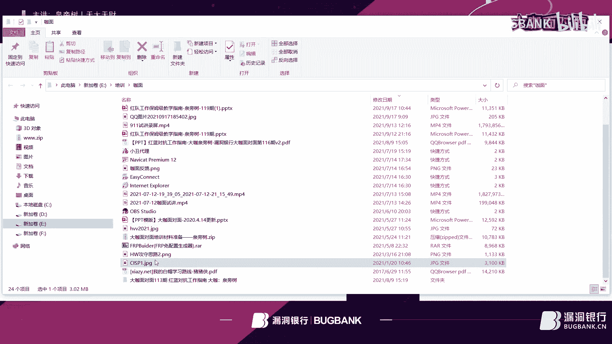

什么是承果？呃，什么是这个软件的开发的这一些这个测试的软安全以及审计，甚至呃非常非常的细详细啊。呃，这个这个文章呢，这篇文章呢也我又放在了我们的公众号上。嗯，叫天大天才，也可以大家可以去去下载。

包括物理的这个其实从那个最底层的物理网络，然后再到上层的这个系统，然后再到应用以及数据嗯，讲的介绍的非常非常的详细。

这篇文章呢呃就是而且我我觉得感慨的就是我当时学这个CISP这遇遇到了非特别好的一个老师是安恒的一个呃一个呃这个比较好的一个老师，他他讲的呢也特别细，尤其像这种就是讲的这种蓝牙呀，还有这种无线方面。嗯。

他有一些实验。可以进行一个学习。

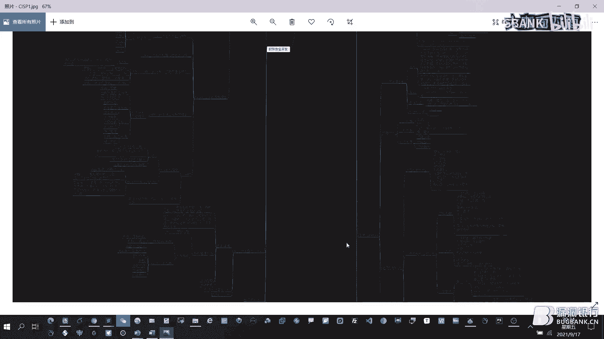

Yeah。那今天呢我主要的其实的主题呢就是这幅这个思维导图了，叫红蓝对抗思维导导图。这呃这幅图呢也可以在我们的公众号上，然后去下载下来，然后进行一个呃一个查看吧。

就是因为我们知道这个对于呃就是尤其是搞这个红队的人啊，嗯我们每次这个就是呃打这个红蓝对抗的时候，就知道觉得自己呃永远都没有准备的充那么充分啊。所以的话这个这块的话就总结了一下。

然后我们大概准备啊我们人员怎么去安排工具怎么去安排，如何去部署这个环境，大概这样一个工作的一个思路。当然这是我自己总结的然后也也有肯定是有更好的这一一些那个就是啊佬我们有有更好的这种办法呃。

这种总结的方式。一个人一个看法，嗯，也有这种防守的。我觉得就是嗯红红方和蓝方呢，就是呃随着这这几年推进啊，红方其实就觉得哪儿都打不进去。为什么就是特别的难？然后兰方呢也觉得就是怎么守都守不住。

你那在这个过程，其实就是就像我们国家领导说的，说是这个就是人与人之间的博弈啊，这个往安全在于这个啊就是博弈啊，这个人与人之间对抗嘛，在于对抗。所以的话这个就是不断的去提升自己的能力了。呃。

遇到了什么问题。每一次的这个比赛下来呢，就要呃对自己进行一个总结。然后归纳出来我们到底在哪一块是缺失的。然后重新梳理思路，然后重新上路，我也是不断的从这个失败当中吸取经验和交情，然后进行一个成长的。嗯。

这是这这幅图。那对于红队来说，那首先第一个的话，我觉得在任何情况下，就是我们呃不管开始还是结束。嗯，小伙伴尤其参加过这个呃官防演练的小伙伴们都知道，这是就是不管怎么样，都是觉得人人员不够用，安抚人员。

尤其不够用啊。呃，这样一这样一个一个一个一个一个困难。呃，所以的话这个这个网络安全啊是说白了就是人与人之间对抗，就是就是人才和人才的对抗，就是人在这里面是最重要的。呃，那那红队红队的话。

那就是需要准备的人员呢，就包括了我嗯总结了啊五5个小组啊，或者是五五类人啊，当然不是说是5个人，有有的时候啊，如果是一个大佬厉害的话，那这这五五类工作呢，就是一个人就可以都干了。啊。

也有一些团队呢是来20来20个人也没有办法把这些事情能能够搞好的。所以的话是需要一个技术的惩建。那首先的话，首先第一个就是环境的准备了，环境的准备的话就是我们这这项工作呢就是呃至关重要。

所有的准备工作肯定是最重要的嘛。呃环境的搭建，包括这个VPS的搭建呀，恶意文件的生成呀，团体服务器的维护呀等等这些啊，这这都是这个环境准备小组来做的。第二点呢就是情报的收集，情报的收集。

我们知道这个信息呃，这个渗透测试啊，本身本质上就是信息收集嘛。啊。就包括这种领队的收集，这种呃漏洞的情报是非常非常重要的。嗯，那个如何去收集这些漏洞情报。

这个这个也是也是其实是我每一个网络安全工作者是我觉得是核心的工作内容，或者是核心的要要去注重的啊一个内容。如果要是没有这种途径，没有这种方法的话，你肯定是你的团队是很难去呃去进行一个精进啊。

技术的精进和提升的。包括打比赛，也是这个是我觉得是领队漏洞还是。肯定是是最最拿得出手的吧，或者是就是最事半功倍的啊一个一个东西。啊，第二方面就是这种信息收集，包括个人呀、邮箱呀，还有这个个人信息呀。

这个呃这种这个联系方式啊等等啊，包括地址等等啊，这这都是需要我们收收集的，以及这种系统目标的这个目标系统这个这种啊指纹啊，包括网络架构呀系统呀，还有这种那个CMS的版本等等啊。

这都是呃情报收集小组啊来进行做的。应用攻击应用工击呢就是负责挖口子啊，就是我们讲到这个就是挖这个漏洞。挖到漏洞了以后，就是他的工作主要就是打点。我们讲打点，打到点了，然后才是后渗透。

们叫内网渗透小组进行做的呃，内网渗透的话，包括这种搭阶梯者什么呃反向代理正向代理内网漫游，然后查找目标呃，是进行后渗透的一些工作。然后APT这个社工小组呢，是在所有这些啊这个应用小组啊。

应用攻击小组没办法的时候，我们展开对人的攻击啊，社工嘛，然后通过这种钓鱼啊啊这个主要现在主流的我们用的都是这种邮件钓鱼，邮件钓呃那个域多啊。

当然我相信呃未来的话呃就是肯定是这个前端啊前端的钓鱼嗯应该是会成为。网络安全的主流。呃，所以的话这个在这个社工这块的话，需要做的工作是非常非常庞大的，包括免纱和远控呀等等，这些都是非常非常精细的学科。

所以的话作为一个小白的话，如果他要选择你要是选择这个红队的话，那你你要认准你是你是能在哪一方面能干的好。当然的话，在每一个方面都能干好，这个是这也是非常非常肯定是非常非常吃香的。那红队的准备。

工具的准备呢，就是上面我们讲的是人员的准备啊，然后就是工具的准备。工具的准备主要有有这么几项，我觉得是木马肯定是各种的免杀的木马，包括这种CS的码呀，明些的大小码呀。

这个web呀power这种木马都是需要进行一个准备。这块的话，我简单啊那个拼接了一个power的一个免杀的一个木马啊，大家可以参考一下。另外的话就是这种代理。我觉得代理也是非常重要的。

包括这种免杀的代理。因为现在知道就是好多的这个系统上都装了杀毒，对这种一般的代理软件都进行了一个查杀病毒查杀。像这种FRP的话默认的话，好多都会会有一个一个提醒。

但是如果你要想想呃想啊不让他啊那个查杀的话，那就就要需要进行一个加密的隐藏隧道隐藏呀，这个脚本的隐藏啊，另外的话就是这种IP代理词，嗯，这个其实非常重要的。

就是就是我们知道这个红队呃攻击南方蓝方要防守是吧？防守的话这个如果要是一旦这个IP地址被办了是吧，被被这个防控制列表给禁用了，不让访问了。那这个时候你就没有办法继续工作了嘛，继继续打了嘛？

这样的话咱们就必须要准备一个代理代理啊，代理词。然后嗯然后就是字典了，字点我觉得这个不用说，我觉得就是好多的大厂和这个我们这个这种小的呃团队不一样的核心。我觉得应该是在这个字典上。

甚至是你那个信息收集方面得来的字典。嗯，就包括这个用户名字典、密码字典以及目录字典，这些都在get up都是能找到的。然后最核心的东西要准备的就是这种漏洞利用工具以及漏洞库，嗯，包括一些领队呀一队呀。

小风的这种衣队呀，还有历史的这个漏洞啊，这个也是需要准备。那在呃这个环境准备小组过程当中，我这块也是做了一些。嗯，就是这个红队的总备小组要要做的事情呢。首先这个VPS上VPS上的话要做的是什么呢？

就是我觉得首先优选你选择这个VVPS的话，我觉得我建议是选择这个linux。因为的话相对来说比windows可能是反正我感觉吧是要稳定一点。而且二个的话就是对于这种呃就是嗯这个这个软件的安装。

它只要命令去安装就行了。呃，这个渗透S用这个呃运，然后那个呃欧班图用这种APT啊这这种方式直接就装上了。嗯，我是可能喜欢用linux。

当然也有嗯人喜欢用windows windowsdows的话最主要的就是呃可能是要这个价格要高一点。因为它那个配置一般的话嗯你要买一个差不多点的这VPS的话啊。对，而且你必须要买，好的。

这个是讲到重点了，必须要有一个很好的VPS啊性能我觉得起码也得这个4个G的内存是吧？两核的这个CPU啊这样一个配置，最起码的再低了就没法用了。因为之前我用过，然后更低版更低配的这种那个VPS。

然后最后比会发现我的团体服务器啊，就CS团体服务器就老是报错各种各样的问题。所以的话这个要相信金钱的魅力。然后就是这个这种恶意文件的准备啊，嗯这块的话我嗯我推推荐了一些这个就是一些这个插件这块的话。

就是CS的。因为咱们现在用的这个在互联网上去去打CS都是各个团队比较青睐的一个工具。嗯，然后除了这个以外呢，就像这种啊就是我们要如果要是做社工的话。

就是嗯就用到这种officeoffice的话有两个漏洞，一个是恶门公司，1个DDE这个大家去百度去一查就知道了。还有而那个就是压缩包也有相关的漏洞，也可以进行一个利用吧。

PDFAPK这些都可以做成这种恶意文件进行一个投递。插件呢就是因为这块的话嗯我觉得比较好用的就是嗯污呃这个插件我觉得是非常好用的。而且它是中文的。

另外的话就是嗯就是K8哥哥开发的这一款那个就是down嗯是非常非常那个强大的，而且它实时更新，有些最新的漏洞都可以利利用到。嗯，然后这块的话还有其他的嗯，这块的话重点提提下还有这个免杀的插件啊。

CS这种免杀的这种呃这样一个一个一个插件CSload。Yes。那就是呃VPS和这个我们讲这个团体等于是现在建起来了。然后我们还要装一些其他的工具。当然呃就是除了这一这些以外。

其他的工具还是都要在我们的VPS上进行一个安装或者一个准备的。啊，你要知道这个准备工作是永远是不足够的。这这一点，所以的话不断的去思考我们到底哪块嗯缺失了啊进行弥补。

然后当然的话我们还要有一个很好的攻击机这块的话集成的比较好的，像这种阿里啊，这个这当然这开开源的，还有选建选建的话，现在那个是4。0啊，我觉得我我可像之前用过3。0的啊，也是非常不错的啊。

这个是呃如果是在这个呃我们工房页里，如果用自己电脑都算了。如果用人家那个呃这个。组织方所提供的这个电脑的话，咱们只只需要直接把这个镜像导进去就O了，就可以进行使用了。那情报收集小组呢。

这块的话就是我我的建议就是买一个起码是佛法的高级会员吧。因为过去我也买过这种普通会员，后来升级套其是这个东西它既然是终身的，其实倒买导造收益，这个也是很重要的啊。嗯还是又提到了金钱的这个呃这个。魅力了。

呃，当然还有360快科啊，这个也非常不错，这两个是互补的。当然你要是那个预算不不足的话，呃，用一种就可以了。OK了。然后还有准备的就像子域名和这种子域名这种呃还还有资产收集的这样一一些工具，或者是网站。

因为现在除了这个咱们手头的工具以外，还有一些。嗯，就是网站上他就部署了这样的一个工具，也可以啊进行一个这个收藏。然后各类的这个新旧入漏洞啊，厂商的设备的新进录，这个就不必提了。啊。

对于外博挖土织小组的这块，我有一个建议啊，就是首先。我觉得就把这个一le这个工具就弄弄上，我觉得这个是特别特别棒的。嗯，然后另外的话就是这种爬虫也要也要做上一个嗯，弄一个。

然后还有这种各类的OOA的EXP工具，这个很重要的。因为这几年报的OA的这个呃漏洞是颇多的。然然后这个web的话，这个就嗯这个肯定是必须要准备的。你要打点的话，肯定是必不可少的。冰些啊，还有天蝎啊。

这可能写错了。嗯，然后还有以介，还有菜刀的各类的菜菜刀的免杀的菜刀嘛啊这个漏洞的就不用再我再提。这肯定是挖口子必备的东西。那对于内网来说，内网的这个小伙伴来说，那我们主要的工作就是内网渗透了。

内网还有网络渗透代理搭建，还有隧道的这种搭建和隐藏。这时候就是正向正正向在代理，学会正向代理的方法，这个很重要。因为有些环境呀嗯，当是就是无法通网的那这个时候你就学会正向代理。呃。

当然代理的工具有好多种啊EWFRP嗯，那个就是通过这种协议也是可以代理的。呃，这推荐1个NPS这块的，这个我觉得是非常好用啊。我我反正用的用开NPS，我就不喜欢用FRP了。因为啥呢？

这个呃就是讲一下区别，NPS的话呃，它是直接通过一个K，就可以进行一个运行，而不需要把配置软件放在这个呃叫目标网站的服务器上。那FRP就不一样了。它。嗯，就是默认版本的。当然讲这个默认版本。

它这个原始版的，它是需要放一个这个配置文件的。在内网漏洞扫扫描的话，极力推荐嗯那个F scan啊，这个是。这个是一个神器啊，特别棒。他对于扫内网来说呃，非常非常的这个作用大。呃，对于这个如果正向代理。

刚刚其实我们正向代理我们讲的这个turnno加regan。然后这个呃这样一个turnnel其实就是REG啊，去百度啊，就可以找到这样一个方法。现在其实最好的一个工具，其实就是那个NEO啊。

那个是加密的方式啊，直接加密了以后再传到这个服务器上，你连接的时候也是非常简单啊。啊，这块的话，我觉得不如呃想想。啊，这个是总总归结的还好啊，往往后讲吧。那你在呃红队在这个我们进讲这个信息收集阶段的。

我推推荐一款就是这个网站链接这个抓取啊，这这样一个东西，只要把这个域名输进来，然后点击这个呃抓取，然后获取网址链接。这样的话就抓到能抓到这个子域名，呃，或者是这个他这个网站的这个里面的一些这个链接。

这样的话你进行收集信息收集的话，呃每个页面的话去这么抓一下，呃，就会得到一些这个呃这个。这个系统相关的目标系统相相关的一些这个网站。啊，那这个呃一喉啊，这就刚刚我讲到这个一喉。

它这个好处呢就是直接嗯当然这个需要佛法的联动，联动以后，然后把你的目标就就就就像刚刚这个爬虫啊，爬到了这些呃这个。就是这些这些URL，然后进行一个保存，保存到TIT里头以后，然后进行一个扫描。

它就会直接把这个相关这个目标呃就我们这系统的这个指纹甚至是漏洞啊，直接就会进行一个高量显示呃，尤其是对这种ro呃，我觉得这个还是一一扫一下就明白了。而且这个是被动的啊，呃，通过这样一个方式。呃。

当然这块的爬虫除非爬虫进行了一个阻端。呃，当然也一般情况下，网站防爬爬虫还是比较弱的。一般的网站比较弱的。而这个呢这个工具呢就是以ho这个工具呢，它是呃被动的收藏的。因为它是通过佛法的一个配置。

需要进行呃佛呃佛法的一个配置啊，配置文件里面配置完以后，然后这样据一扫，它其实你本身和这个目标站点是没有任何交互的。通过佛法就直接把这些信息是进行了一个被被动收集。那这样的话就就直接就拿到一个。

比如说点了吧。啊，有的时候就是点啊，就直接进行一个用其他的工具进行一个利用。那在外部打点打点方面的话，呃，当然这个就是我们呃给出了以下这个几几种思路啊。当然不止这些啊，只是我本人总总结的一些。

就是比较算是个皮毛吧。首先第一个就是说命令执行的这种漏洞，这个是所有的这个我觉得白帽子红帽子啊最青睐的一个漏洞，就是命令执行啊。

包括这zero呀 web logic和这个struct two啊所以的话这种工具还是很必要的啊，这个这种这种刷书呀，还是zero的这种工具啊啊很必要的。而且这种K啊。

这种我们我们知道这个呃zero的这个形成，它就是主要是通过这个K啊泄露了这个K就是呃形成的，所以的话大家一定要多多的收集这样的K。进行一个破解。那这样的话就其实一个点就已经拿下了啊。

这等于是如果是你嗯这个这个点是存在漏洞的，直接就可以拿到el。当然的话也也可以通过这种web logic啊we logic啊进行这样一个呃。打点啊也也是也是可以搜。

就是呃这这也是我觉得最快的方式的打点啊。还有这种刷 two啊，这个我觉得就是。你看这个图就比较嗯怎么怎么讲的，比较low吧，就是大家应该都都用过吧，希望都用过啊。嗯。

要知道这些漏洞的这种就是刷图的什么04呃046045啊这样一个呃漏洞，让大家要了解一下。然后就是OA了。OA的话，包包括这种致远的OA啊，只是致远的O啊CO啊这样的一个漏洞。

蓝领的通达的万户的拥有的是吧？呃，通过这样呃OA的这种零队或者N队的漏洞呢也进行一个打点，也是非常非常那个在这个每年的这个我们的工防演列上湖南对抗上也是呃非常重要的。尤其一些零队啊。

零队漏洞是更是备受这个白帽子青睐的。呃，这个右侧就是一个嗯那个就是我们叫这个资远的一个一个一对漏洞。通过一个嗯这样一个方式反弹一个就是返回来一个这个命令啊，执行一个命令。嗯。

这这通过这个的话也可以是执行那个反弹这个cel啊这样的一个操作。这块的话，这是一个范围的一个OA的，这个也是存在一个这样一个漏洞。大家可以去去搜一下这个是。今年报出来的。嗯，这个拥有的命令执行。

就直接可以执行执行出这个系统的这个呃账号啊，系统账号。当然了，就是有些小伙伴就就觉得这个肯定是只能执行命令到websse，其实还是有段距离的，需要不断的去尝试，看是去下载一个木马呢。

还是直接去进行一个写入一个木马了，这个这个就需要很深的这个系统里面的这个命令的功底了。然后还有一个思路就是通过入口令的后台上传，可以说这是在盲册当中啊，是最最受欢迎的。我觉得是最常用的一个手段。

就是通过这个后呃入口令，然后后台上传webs呃，这个也是非常的多的啊，就比方说啊打比方啊，就是像这种catcat就是如果他是开启了这个后台。然后把那个注释都去掉的话。

它就可以直接进行一个tmca默认账号密码。tmcat，然后直接登录，然后部署外包，然后就从而访问之后就得到了一个websel啊。呃，当然也呃我们今年遇到了一个什么情况呢，就是。

他是那个没有那个就是是是个弱口令，但是它是是一个空密码，没有口令的一个空密码，就是直接Ad密就可以登录了。然后我们我们朋友呢就是我们就是算是友商吧，然后他们就他们那个字典做的太好了，太好了。

从而就是没有这个空密码。最后我们报出来，我说这个最简单的世界上真是最简单的事情反而是最难的是吧？这个空密码，所以呃建议大家在自己的字字典里面，首先苹果这节课呢别的记不住能记住先敲个回车。

让他有个空密码啊，这个是非常重要的啊，因为在实战当中确实遇到这样的情况了，是字典太好了。啊，甚至是二十几位的字字典都有，但是就是没有空密码。这个时候。😊，真的是路过了这个这个路过了这个洞。

真是太可惜了吧。所以的话这块的话就是嗯建议大家敲个回车啊，让自己的字典呢更充实一点，有这样一个空密码。呃，还有各种各样的绕过的思路啊，就是web打解绕过的思路。这个咱们不作为重点。

因为这个我相信只要上传这个漏洞的话，需要呃需要各种各样的方式啊，包括这种双文件名呀啊，还有这种这个我们将这个因为阶段呀等等这种上上传漏洞的方式啊，我就讲个大概嗯细节呢呃大家去去百度一下嗯。

所就拿到个c啊。当然还有这种情况啊，就是外部打点的时候啊，就有的时候做信息收集，突然发现一个注册的点啊，注册点就像一个这样的一个注册的点啊，注册成功以后呢，他说不定就有这样一个上传的个。啊。

在近期呢我们也是搞一个这个系统测试，就遇到了这样一个情况，结果就直接上传了we，然后从而就拿到了一个这个一个sstem的一个权限，甚至是然后从而就是可以直接就进入了一个后渗透的一个呃一个一个阶段了。

然后呢，还有就是是这种高危端口啊，我们指的高危端口端口。当然这里面给出了是FTP这种的话，除了FTP以外，因为还有这种呃这个acle呀啊这个甚至数据库的，还有系统的SSH。

还有这种远程桌面的3389这种端口。当然有的时候是高高端口，像这种这个39267这种高端口。那这时候怎么办呢？你识识别不不知道它是什么端口呢，那就通过这样一条命令通过 map，然后使用这样一条命令。

把那个端口写上，然后把那个IP地址写上后面加个SSV大V啊，这样的话就是能精确的识别出来它的服务啊啊以及版本。啊，这样的话就是可以知道呃这个服务以后，然后就可以尝试相应的啊相应的工具啊。

或者是字点进行一个暴力破解，甚至是像这个FTP的话，当时是匿名的，直接就登录了。登录后发现它是直接是网站的这个后台的一个管理后台管理呢，然后从而就是直接部署了那个木马websc，然后直接就把个系统拿下。

那还有一种方式呢，就是通过cir口注入。因为cirle注入的话，这几年随着这个技术的更新啊，好多的这个这个网站都使用那个GSP，但是也也不免有些这个ci口注入啊，因为GSP知道那个通过这种函数啊。

全局函数就可以过滤掉绝大部分的这种注入。那嗯之前就遇到这样的就是一个环境呢，就是当然这个需要这个绝对路径啊，这个绝对路径还是很重要的。在信息收集的时候不要故意。那搜库注入不但可以跑出数据来。

它是还是可以写呃写这个我们叫web saleG cell的。那直接一口，然后就写入到一个呃这个路径下的一个啊就是添加这么一个文本啊，这个GSP的脚本，然后从而就拿到了这样一个web的权限。

这个也是一一种思路啊。呃呃当你那个拿到这个呃住的这个点的时候啊，那你一定要试一下杠杠SOOS杠c看看能不能进到这样的命令行执行的这样一个一个权限啊，拿到这样一个权限。还有这种录录便利呃。

其实目录便利也是非常常见的一个漏洞。这个主要是出出现于配置文件配置上。但是有的有的网站开发呢，他就把直接把这个呃就是我们这个叫备份网站备份啊，就直接放在了一个网站的目录下。呃。

从而直接进行一个呃就是远程的一个代码下载，从而嗯我们就可以对这个代码进行一个审计，审计完后呢，就是可以读到一些信息。像这块的话，就是呃直接读到了这个数据库的账号嗯账号和密码。

然后正好他的那个呃叫这个数据库端口呢，对外是泄露的，然后直接登录数据库，而且它的那个登录数据库以后呢，他有一个因为我们知道oracle是有一个这样一个提全漏洞，通过这样一个工具呢。

直接就可以创建一个账号，从而而且它正好啊，这个所有的巧合，这个无巧不成不成书嘛。这个正好他的3389端口啊，这个远程桌面是开启的。对对互联网看起，从而直接就啊通过这样一个新建这个账号就登录了啊。

从而这个就是搭建啊，不但外部搭建了，而且是最后是拿到了一个系统的一个权限。Yeah。但目录便利还有很多啊，目录便利也可以通过这种目目录便便利呢可以找到这种上传点啊。嗯这块的话就是找到一个这样一个上传点。

从而上上传了那个websel啊，最后达到一个。音些的一个呃，除了以上的大部分都是集中于这个webs webb层面的，还有这种通过网络设备的攻击。然后这块的话网络设备的话主要有就是两类啊。

因为今年的话爆出来的网络设备的漏洞是特别多的。呃，就是这种方式啊，就是呃尤其像这个锐捷的路器啊，它这块就是有这样一个漏洞，直接可以写入这个websel。这是一种一种方式。啊，这是写入bs以后。

然后进行一个后台登录。当然登录后台你得知道账号和密码，然后你通过这个websel，然后执行这样一条命令，然后就抓取到了他的账号密码，从而登录登录以后就可以创建VPN是吧？然后直接就连到内网了。

这是一种思路啊，网络设备的攻击，然后还有一种的话就是像这个华为这防火墙的话，如果你拿到一个热口令啊，但这个华为这块没没说是漏洞啊什么的，就是入口令那这样的漏洞。

我认为啊就是入口令算是就是我遇到的最多的漏洞了。而且这种漏洞我觉得是永不会消灭。所以的话大家一定要在这方面可以下下功夫。我觉得这个是只要抓住这一点的话，应该是不会失业吧。所以入口令是很重要的。

就是我觉得是永不会消失的一个漏洞。啊，再回来这个话题就是通过这种网络设备，然后直接登录了设备以后，然后创建VPN，然后从而就是直接啊当然我这个这个是给了一个步骤啊。嗯，然后如何去创建创建用户啊。

然后最后就直接就可以登录呃，就是登录内网了，进行内网渗透了。呃，还有就是你也可以通过这种嗯呃那个net方式，netnet方式直接把呃服务器的端口或者内网映射出来啊，那种方式也是可以的。

那8T的我们讲到内网，就是我们刚刚讲了这个把这个点已经拿到了如何进行下一步的这个渗透呢？那这个时候就需要这个我们讲这个8T的。嗯。大题的这这块的话，我给出来一个正向代理的一个一个脚本。

我觉得这个脚本是那个比这个以前的turn的更好一点。这块给出getget up的下载地址啊，它更稳定更呃杀一点。作为正向代理的话，正向代理用在什么时候呢？就是不出网的环境里头。呃，用这个。

那反向代理的话，这个就用NPNPS这块前面也提到了。然后还有个就是现在不是那个有些有个大佬，然后在那个土司上发了一个这样一个帖子，然后就是一个RP的一个免杀版的，而且不留配置文件。

这个去这个相关的这个链接上嗯，大家可以去找一下这个呃这个工具啊，当然的话提现的有土司账号。炫彩车这个我针对linux的话，而且图形化的也是也是挺好的。呃，也也可以用吧。当然我我用的不是太习惯。呃，对呃。

这还有一点就是呃呃N呃MSF对呃，这个炫彩车里面有这个工这个工具可以直接使用嘛。啊，直接使用了，甚至可以打点了，就通过MSF。然后嗯搭建代理的话就是通过这种端口映射了，嗯，或者是这种呃F2RP的。

当然就是我呃就是可以进行这种直接一对一的端口映射，也可以进行一个全网映射。啊，就是sK这样一个映射。啊，就是包括NPS也是啊，也是一样的，可以就是单端口啊，就就映射一个端口出来。

也可以把整个全局内网全部映射出来，等于是他只要你本地设置了sK的5以后，然后进行一个全局的一个对内网的一个访问。那啊这块我还用了这样个工具啊，但后来我发现这个我可能用那个版本稍微有点码。

这个就是现在不推不推荐大家使用了呃，以及其他的吧，我就把其他的归类为其他了。但作为那个window本身的用户来说，或者是那那啥就是我们本地的用的这个代理工具呢。

用这个呃嗯proox啊这个这样一个工具或当然其他的也有啊也可以。Oh。NC也可以啊，这个当然这个我们在NC主要是我们在前期打点的时候可能用的比较多啊。F scan作为内网内网扫描的神器啊。

在这个时候在呃我们说打点了，然后也做了代理了。这个时候我们就可以用上F scan，直接一扫OOK这个这个报告就OK了就出来了。呃，那那口令他这也也也可以给你跑出来，入口令跑出来。

然后把这个漏洞也可以给你进行一个出来是非常好的一个升奇啊。这块有一个下载地址，大家可以去去下载试一下，甚至网络安全检查的时候，我们做蓝队的会员。

我们可以用这个 scan找一下我们自己内网是不是有什么点啊即即使是被打穿了是吧？打进来了以后，我们看看还有什么点，这个也也可以用这个去给自己进行了个自查非常棒。

那以上呢基本上就把这个红队的这个工作呢基本上就讲完了。讲完了以后，那个呃我就进行一个这个嗯总结吧。因为我每次就是打比赛也好，搞这个红对抗这个演习也好啊，这个渗透测试也好就自己当然就就惨自己一家的话。

我们自己给那个做的话，这这还无所谓。只要有对比啊，就没有对比就没有伤害，就发现人家别的大佬嘛，人家就做的特别好，好多点咱们没有做到，那就进行一个呃进行一个这个怎么讲。

就是一个查漏补缺吧虚心的向人家请教和学习，像这块的话，我之前遇到一个一个比较比较那个啥的点，就是其实我的工具也好就觉得不太好用。而且对于识别这种框架呢是比较呃比较差的。

后来我就找到这个个HAE这样一个插件是上面的一个插件啊，进行。可以进行一个高量显示。然后的话就是之前前面不是介绍了一款工具，就是以后那个呃也也是可以识别这个Cro的。呃。

当然后来就是也这个cro的工具呢，也也有这种批量的这种查询的这种工具啊，当然这个就是根据大家的这个喜欢，就是能多多的收集这样的工具，这个还是很重要的。呃，这块。

然后第二点的话就是对这种上传上传点的这个注注册上传的这种思路，其实嗯嗯之前跟一个大佬聊，他就其实是一个怎么讲呢？这个算是呃就是体制内的一个大佬啊，人公安的，然后人家说你这个信息收集实际收集全了嘛。

这么说吧，就是你所有的工作你都做到位了，你这个才才能毫不留遗憾嘛。所以的话当时我记得就是有一个注册注册的一个上传点就没有收集到呃就是其实就在庞站了。稍微扫一下端口，然后再扫一下目录就OK了。

但是这个就没有没有找到。这个也是很遗憾的。当时。嗯，然后另外的话这种解析漏洞这个也是需要需要不断的去积累的。不然的话你怎么呃就是你呃也是需要积累的嘛。我觉得另外的话跟大家说一下，就是这些漏洞呢。

就是像我自己本身的话嗯可以给给给大家就是叫麦麦观者啊，就是我自己本身呢就是做这种常见这搞这漏洞研究呀什么的，就收集了好多好多这样漏洞啊，这个这个也是长期长期做的工作。

另外的话笔记的话建议大家使用这样一个myb啊，myb进行一个这个就是对自己的笔记的一个记录啊。Yeah。呃，其实。呃，这个他的好处就是即使你哪一天那个哪一天的那个呃我们讲这个断网了，没有网络。

那这个时候他这个笔记就能用上各个方向的对吧？你都可以用上，甚至这种就是直接可以用来去操作嘛，对吧？就不不用去在百度了，这个时候是非常方便的这是一个建议吧，我自己的一个思路。

然后对于呃当然还有一些就是真的是实在没有办法的，就是有些一对或者呃漏洞，咱们没没办法获取到这种也是存在的那这个怎么去总结呢？那无非就是你你看怎么样能跟大佬能换换得这样的一个领队漏洞了，是吧？

一样的啊一样的啊，然后还有这种目录扫描工具，这个预见室我觉得比较比较好好用。当时可能就是没有用这个工具吧，然后还有嗯。这这种这个我觉得有些难点啊需要平时去突破的。就就比方说这个小树叶。

这个是今年我们打这个我们这个比赛啊，就是我们遇到我我就叫他小树叶吧，我觉得。我我我我以后每次看到这个小树叶的这这种形态以后，我就会不断的想起来我当时没有拿到拿下那个站点少小树叶这是一个什么呢？

它其实就是一个呃这个我们讲这个嗯。

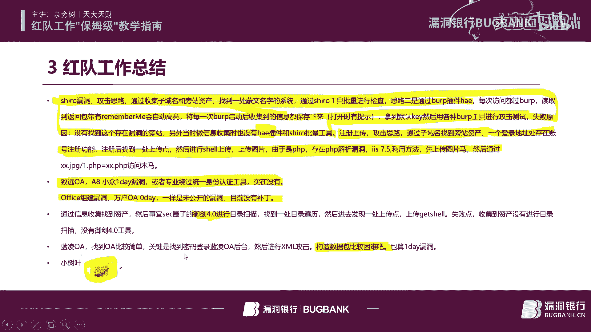

呃，就是这个我突然。断电了。fat对fasonfa的话这块的话，我也是做了一个笔记吧，就是所有的工作，所有的事情呢都是就是呃所有的呃互联网上的这些知识啊，像百度比方说。

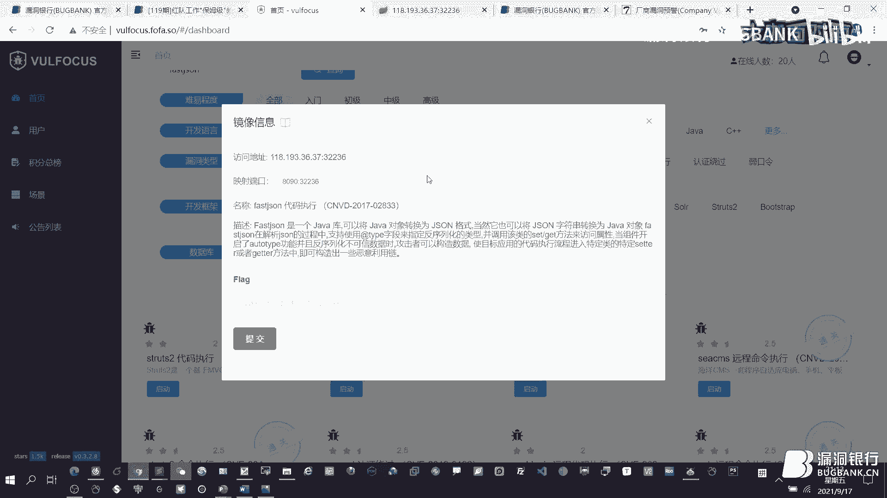

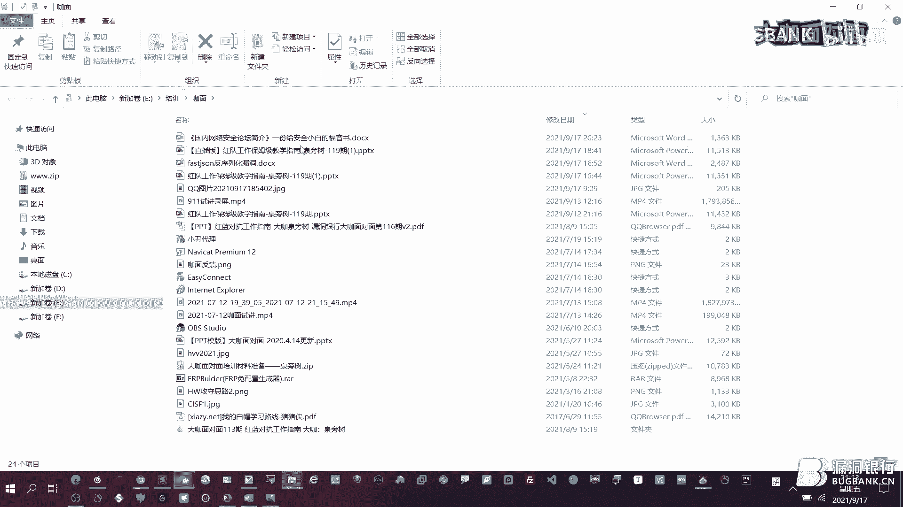

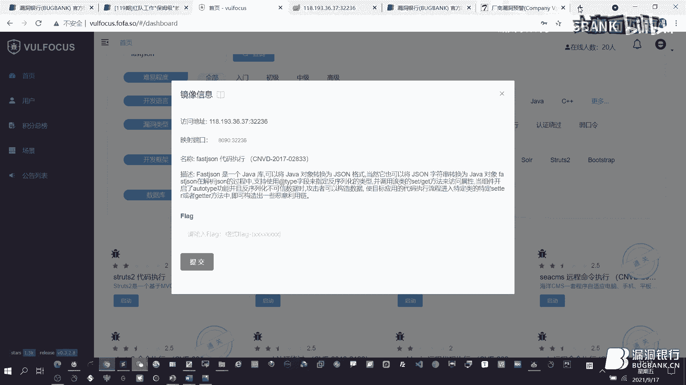

百度。我发的计生。那所有这些嗯这些文章呢，它其实都是别人漏的了。嗯，这些漏洞呢都是别人，只有你自己实战实操过的是自己的。所以的话我就是每一次呃就用这这样一个这是佛法的白猫会他们的一个平台。

在这上面的话就可以看到这些我觉得也挺有意思啊，就平时就是有有这样一个竞争。然后然后就嗯。这样一个漏洞一个环境啊，可可以跟大家比一比是吧？然后就非非常好吧。这个我我总的来说，我我也不知道想表达什么。

总的来说就是呃希望大家能够哎平时就积累这些知识吧，而而不是单靠这些互联网上的笔记。而且的话对我来说，我自己学习的话，就是会。把这些呃我感兴趣的点，尤其像这种这个论坛呀呃各类的漏洞啊，尤其这块啊。

各类的漏洞啊，就是都会收收藏下来啊，以及代码审计的呀啊这些啊后都会收藏下来软件的对吧？各类软件的CTF的啊，这个以及安抚啊，因为我我是搞安全服务的这个每一个每一个点它都需要很大的功夫嘛。像这种外部的。

这个点特别多。都需要进行一个学习吧。但这些呢都要啊经过一些实战，然后转化成自己啊，这块就是一个我今天做的一个这个嗯。呃，这个fast的一个漏洞一个实验。通过这种实战。

然后去锻炼自己在这个红队方面的这个技能吧。然后呃再往下讲。对，这个就是发基神了。那个我觉得是对我来说呃以后看到这个小小这个小树叶啊，我就会想想到那个发基神是吧？

那就希望大家也能看到这个小小那小树叶以后就不能不那么心慌了。我当时现在我我老是不知道这是到底是什么，但是很眼熟，知道它有漏洞，他是不知道是什么漏洞，这个就在于平时的积累。

那总结呢我觉得对于一个红队工作工作人员来说或者个技术来说，呃，这个打对抗比赛啊，他这个不单是拼的是技术，我觉得是一颗决绝的心态，信心特别重要。嗯，我记得我头一次参加这样一个比赛的话。

就是一开始就没有信心了。一开始因为平时的工作和这个好像就是有一定差距的。因为大家都在好像别人已经拉到洞了，但是咱们咱们还是零，对吧？那这个时候就不要慌，哎，要决决的心态，我要我就要超过谁。

要树给自己树立目标。然后另外的话，每次赛后的话，都向友伤学习。这个其实每一次这种大型的比赛啊，都是特别好的一个学习机会，要跟这些大佬们进行一个哎互通有无，甚至认识，呃，你只有给别人，别人才能给你嘛。

这个我觉得也是就是我觉得是做人的初衷也是安全。呃，玩尔法则个就我觉得是要要给给别人要做分享，然后别人才给你。然后把事情呢也也分个轻重缓急。

像我就是一般情况就把难把把难搞的事情又又觉得不是那么太重要的时候，就就找些代替的方式，然后把重要的事情呢，但又又很简单的事情放在前面，这样的话不po嘛，而且能尽快的去找到状状态。

然后第四点的话就是通过这种对我发发现一个就是有有次打点，然后呃那个找打内网的时候，然后找到1个MSF，就是应该有有有有商直接是装到了这个一个目标站点的另ux上啊，这个也是一个思路吧。

尤其打这种内网这种那个有个自然漏洞，是也是可以的啊。啊，当然有会用这个CS的也可以啊。然后第五点，这个就是嗯我觉得这种魔改版的冰鞋呢也要多多收藏。这个就是之前打sro的话。

一般的冰鞋都是上传木马都上传不了，最后就是找了一个魔盖魔盖版的这个冰鞋上传。然后我觉得在这个关键的坑点上要跟裁判也要理论理论。我觉得就有的时候这个比赛啊，就像篮球比赛，因为我我是喜欢打球。呃，NBA嗯。

然后好多的这个这个。嗯，球手呢就就跟这个裁判也要理论理论啊。对啊，这个是不是判的法呢，是不是公正，对不对啊，是不是这个这个也要提出抗议啊，是吧？好汉处在北，好妈出在。而是在任何情况下。

我觉得尤其是带队的，不能默不作声了。然后第七点是梳立一个超越的目标。这个其实就是要把自己的思路定进的更呃宽广一点。比方说呃因为这几年我了解这就是嗯比方说政政务哎，这个这个市面有点敏感。呃。

当然的话就是就比方说呃打一个一个系统的话，你要你要把他这个庞战也都算在你的这个目标范围之内。这样的话才好打嘛。你要就单打单打一个点呃觉得哎就是这个主战，我虽然他没有漏洞啊。

你这个时时间在那口肯定是没有没有效果的。你要把这个目标啊，要要放大放大，只要没有思路，你就再放大，对吧？没有办法。而且今天今年我做了个什么事情呢？就是我打一个应该是一个门市。

然后那个就就把一个门市的其他的一个好像路由器打，那也给分，他只要提提提上这个webel，他都都给分。即使是一个民用的一个路由器太给分啊，这个也是很有趣的一个事情跟大家分享一下。

因外的话就是我觉得作为一个领队啊，真的是要带好团队很不容易，而且要要给团队要有这个积极性和方向，这个树立这个信心和这个方向，不能让都有乱搞瞎搞，就是我们曾经就是我们团队就有以前有过这样的现象。

就是没等没等对方人家有有这个密罐了的情况下，就直接就是绕进去就出不来了。一直在这个在这个网，因为拿下内网了嘛，就是一直在里面搞这样的话，时间就是浪费了嘛。大家就是我觉得是能及时的把这个报告提了就。

再嗯不再做了，然后再继续下一个目标。因为这个要想取得好成机，还是需要不断的去呃那个提高效率吧，提高效率。然后第九点我觉得是很重要的一点，就是呃该花的钱，嗯让你们领导花一花，这个是不会让你失望的。

一分钱哪怕是一分钱，真的是我我之前的这个这个在这方面我也吃过亏，也是很感慨的一件事，尤尤其是这种代理啊VPS一定要是买最好的。呃，你不是说最好的话，差不多能用的话，你平时实战就像我前面我说那个建议的啊。

一定要有起码第一要有。第二的话，也不要太差的啊。然后另外的话，我也是补充自己，我觉得我在这个CS方面也是比较需要这个去学习学习的。这个还是这个金验总结，就是就是我们在这个网上觉得哪块薄弱了下来啊。

下来这一年好好的在这一部分去弥补。我记得在这个19年的时候，嗯，当时这个内网渗透突然就火了，以前好像不太听说后来我就嗯叫苦学吧，学废它对吧？把这个把这个CS这个内网渗透废它。啊。

当然这块好像少了些什么了，尤其这种windows的这种那个呃如何去获取这种密码，如何进行后生透制这种那个呃这个呃密码的获取啊，尤其内呃读内存，然后破解密码，那个也是需要需要人做的。

但然我这块没有太多的讲啊，点到为止，大家嗯下去去好好的那个去那个呃去补充一下这方面的知识就行了。你百度就OK了，就出来了。🎼啊，当然这块的话，我可以呃会一的笔记。把我的笔记啊，然后给大家看一下啊，这个。

本内网渗图这一块。呃，内网渗透的话，我放在预渗透里面了啊，这个如何去从这个内存里面啊内存里面去提取这个。

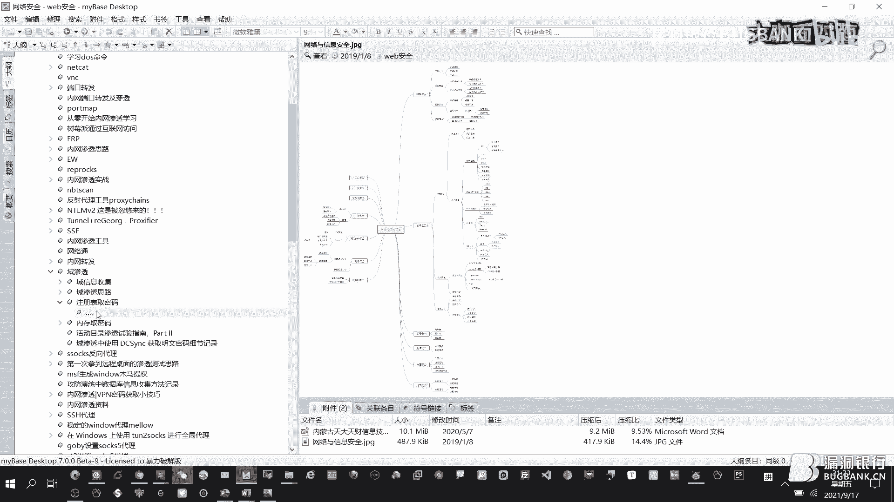

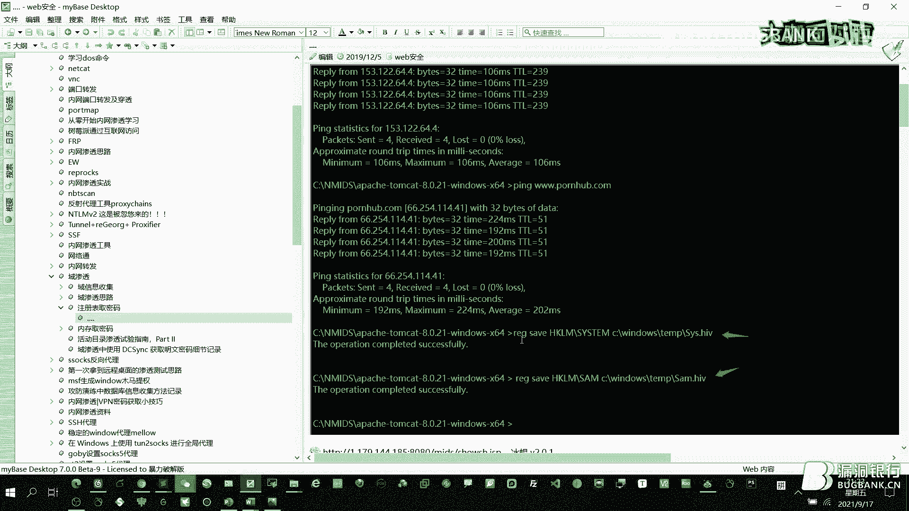

啊，提取这个那个。我们将这个。密码啊，通过这样一个方式啊，要命令，然后这样勾取出来。啊，这这是一种方方法。然后这个用呃通过这样一个工具啊呃mini cat啊，然后进行读取呃，以及通过这种呃。嗯。

拉s啊 dumpump啊这样这样一个工具啊，我这个英语真是不太好啊。啊，还有这个。这个特别好啊，这个这个是我觉得是我是最常用的一个呃minic，然后进行破解。然后通过这个去抓取密码，把这个密码。

然后通过这样在这个进程里面嘛，不是密码，一般内存嘛，然后读读出来1个DMP这样一个文件啊这样的话就是进行一个破解命令的话就是其实两条命令，这样两条命令就O了。啊，这样两条命令。啊。

这是这个关于这个密码这块的。简单就是忘了哪块，我再补充一下。然后的话就是呃这个前面好多的都基本上讲完了吧。然后还有一些这个趣蚊，当然这个就不是太重要了。嗯，这个基本上我今天着讲的话题应该是也差不多了。

嗯，谢谢大家。好的好的好的好的，好的，fancy fancyancy，我来了，大咖先喝点水休息休息一下。哎，谢谢。那个哎哦，对了，咱们那个该打的广告，最后一页还是要打一下。

来打开来打开那个二维码可以介绍一下哦。对，那个左侧呢是我嗯我团队的，我公司的那个微信公众号，是那个我维护的天大天才，嗯，这上面也放了一些漏洞腹泻的一些嗯那个。算是一些文章吧，然后右侧是我个人的微信。

如果感感兴趣的话，可以我想聊的话，可以跟我聊一聊。因为我自己本身我觉得自己水平特别菜，能跟大家能有这样一个机会呢，跟大家去取得一个联系也是更好的。咱们可以互通有无嘛，谢谢。嗯，我觉得大咖谦虚了。

而且大咖在讲讲课的时候，讲授的时候，这个话风非常稳稳扎稳打。我所以说我相信表哥们在听完了以后，对红队的这种打法的思路啊，还有就是这种整一一条线路一定是更加明朗了。然后谢谢哎大咖。大家先喝点水。

先休息一下。我我呢我们今天我们今天乐多银行，因为这个网络一点点网络问题呢，咱们这个直播的时间呢有一点延迟。所以说呢我我现在就是擅擅自做主发一个隐藏性的小福利啊，这个隐藏小福利就是嗯不是送书送书是必须的。

然后还有个隐藏性的小福利，就是马上要到中秋了，如果有表哥呢在中秋的时候，在学校或者在忙工作，没有跟家人啊，朋友啊，团圆团聚的话呢，心里难免失落啊，什么情况。

反正就是或者是被家长回家要逼呃就是逼着相亲啊之类的情况，那个时候心里心里难受的时候可以来找我们豆动银行运营四美，秋秋年年薄荷和我我们除了睡觉时间，16个小时在线给你送上贴心的问候，好不好？

就是这个哎这个所以说所以说这个这个这个隐藏福利啊。在这个时间段我来说出来呢，就是说听到这个时候的就是真爱了。所以说我一定要给表哥们一个就是心与心的一个问候，好不好？好好。

现那我们现在那个大咖可以呃打开一下直播间对。对，然后我们来看一下表哥们的提问。直播间啊。等等啊，我刷新一下。哎，对对对，的确要刷新好多好多问题。😊，哇好到啊。对。这看只只看提问吗？对对对，只看提问哦。

那我就可以答了吗？对，可以开始了可以开始了。这是第一个看怎么进入红队啊，怎么讲呢？这个我觉得是正常嘛，怎么进入红队，真的还是一个我觉得红队，有的时候是可遇而不可求的事情。有的时候是有的人吧。

像像我都参加了好几年了，我就现在不想打了。因为那个红队是特别累人的。嗯，但是进入红队的话，只要你是参加网络安全，尤其渗透测试的话，就就很有机会成为这样红队一个队员。不然的话就看你的最技术水平。

一般情况下，如果比较大的公司的话，就是有专门的红队人员。我了解的像这种大厂是专门去打打这个我们叫样互网比赛或者是攻防演练的。呃，是这样这样的，所以的话这个得得看自己啊，自己能力足够。

然后那个各个方面你你看你而且红队的话，你得选选对自己的方向，你是内网还是外部打点这方面，有的大佬就都会。啊，这个是很重要的。而且嗯对于这种一线城市来说，进行竞争压力比较大。像我们这算三四线城市。

那压力就好嗯，小多了，可以来我们这边试试啊，我是内蒙人。欢迎联系我啊。😊，然后哪个那个土司好进吗？写一篇文章复泻可以吗？嗯，这个好进嗯，特别好进啊，那个复泻的可以。

但是一定要原创这个土司进来也是需要原创的。因为我我记得我我好像好几个后，土是我我我好早就有了，但是一直没利用起来，它比较好进啊，那个只要你写写写一些文章啊就可以了。嗯，感觉现在学的比较杂。

有什么系统性学习的地方。嗯，怎么讲呢？其实网络安全就是我我搞这么多就哎呀，很难说系统的学学哪一块只有是不断的去摸索我们哪块缺失了，去学哪一块，而且是有这个放式。我一般情况下都是遇到问题去解决问题的。嗯。

系统性学习的话，建议是报个班啊，报个班是最呃最适合你的啊，这个报个班，然后去学习一下。而且这个也不一定系统吧，这个我最最有感触的就是因为我团队里面有好多报班出来的，但是感觉基础还是比较差。

尤其在网络和系统方面，因为我们知道安全这个涉及的东内容特别特别的广泛。这样的话不可能每个地方都找着握，但是系统学就报这种包包还是很重要的。我觉得从网络和系统学起，然后再逐渐把衍生衍伸到这个安全。

然后这样会比较好一点。当然你有代码能力是更好的。现在不是我觉得就是一见到会代码的人就很有这种从崇建感。当然我也在不断的学习。嗯这个是对于这个然后想入门一种语言够好还是这个python好。

因为我自己本身就代码水平比较low啊。我现在还是青睐于on，因为啥呢？现在的教程。多嗯，python，而且现在这个在咱们国内呀也比较火嘛，python那个什那啥，但是看你用什么呢？

如果你是呃搞这个漏洞的复线，你就学pathon。如果你搞免杀，那当然够好了，都比pathon好了啊，当然这里面还没有其他什么C呀C加加呀的没提提其他的那当然你都会更好了。

有些大佬人家就每一个都会每种语言触类旁通了。呃，大佬能不能把工具分享一下，这个是怎么讲呢？有些工具我可以分享有些工具ub上有我本身有的东西也不是太多啊。

这个是我觉得就就在那个PPTT里面那个本身的那个链接，大家就可以下载，只不过是需要访问下geub嘛，怎么自己访问不了getub那就没办法了。这个得需要入门啊，学学习学习入门啊。

这个那个有有些东西基础性的东西，别人还是有些很难帮你的。嗯，一定要自己去去学会，怎么去访问getub好吗？打开浏览器，百度getubO了。然后工具。呃，被识别了咋办？

那就像我前前两天就是我们这周啊上周上周我们搞了一个工行营联，就是对方然后把我们的边线嘛识别了，识别了以后，然后我们就进行了一个加密啊，当时呃因为是正向代理嘛？就是我呃我我这个PPT里面好像也讲到。

就是那个NO呃NEO的那那个就是正向代理的工具啊，通过那个加密，那也O了。呃，肯定是要不断的去提升自己的工工具了。这个里面我呃过程当中也讲了这个工具的免杀啊，以以及工具工具只能这个隐藏也是很重要的啊。

需要咱们去不断去提升的，而不是说我一下子给你个什么工具，你就能呃能是百思不爽的。我是这样的啊，这个是需要积累的。第一次进入红队初级应具备哪种程度的技术呢？呃，第一次进入红队的初级呃，应具备哪程度的技术。

这个程度有浅有深。因为有些红队刚开始参加的时候，只是负责写报告的。我了解的是后来呢组建是会使用一些工具进行漏洞扫描。因为现在货呃工方演练你都得。IP都老办的不行嘛，那那具备什么技技术。

那你就得手手工了嘛，通过这种bar培啊，或者这种甚至这种对嘛领队嘛，就打的就是就是你打打的比赛是什么？就是对马领队嘛，是吧？那那你这要掌握掌握这种平时要多练习嘛。

我我说了这个靶场还是挺不错的从这个佛法这个这个百猫会这把场可以上面练习吗？可以进行一个排行嘛？你跟这些大佬竞升竞争，你什么时候能排到前十啊，那就不错了。我现在目前是排到第九。然后红队和实验室有什么区别？

这个呃实验室搞的更更更多的是研究就是提供这种工具。呃，因为我呃之前因为我我我遇到的实验室的大佬还是比较少的那个但是接触过，就是人家确实有这种实验室。

能把这种一个小时之内能挖到一个we logic这这种零队啊，这个真的是那个没没法比啊，但是人家就是帮助某个红队，然后进行一个比赛，这个是肯定是有区别的。红队的话是在前面嘛，前面嘛。

实验室更多的是搞研究啊，能把这种代码进行一个深度的挖掘代码审计以及这种我觉得工具啊这是实验室要要做的做的一些一些内容。红队搭搭建需要掌握什么能力呢？这个前面我本节课其实本身讲的这样。呃。

能力就是我我觉得就是会各种的领类，会各种的这个打点的方式，思路。要要除了我我所讲的这种这些思路呢，要过充自己的思路啊，那个不断的去学习，去掌握。除了web以外啊。

还有这种设备的这种啊这个这个相关的这种打点的能力啊，这个也是很重要的。当然web是现在目前是主流。还有一点的话就是这种社会工程学，这个是需要掌握，嗯需要掌握的太多了，这个就这个话题有点大啊。

大佬平时平常呃少端口是长少少常见的端口还是全端口，这个得积累了啊。我给大家看一下我自己的这个端口。Yeah。呃，肯定是常用端口要自己去积累，我大概就是积累了这么这么多的这个端口。

这个可以到时候分享给大家啊，大家也可以那个啥呃，我觉得这个就不断的在实战实战里面去记录嘛。哪些端口，哪些指纹啊，就是也根据你的自己的环境，你你的甚至你的把标的环节，有时候要收集的收集呀。

不断的收集收集的包括这种什么目录呀，呃入口令呀，还有这种用户名。都端口，这都是你平时就要积累的东西，自己太太怎么学习呢？本地搭建搭建服务器去佛法呃。自己搭建也可以啊。

dockerdocker其实有两条命令特别好啊，就是我觉得docker推荐一下。docker可以可以用这个啊，用这个它这个本身就就是docker做的。然后其实命令的也超级简单，本地就可以搭建嘛。

本地可以搭建，然后服务器就不需要了，我觉得本地就够用就行了。另外的话就用这种靶层，用人家已经已经有这种靶层。呃，内帘柱是呃，然后过万府有啥柱字可以，有的不行，内联注视。

cicle注入过为啥有的数字可以有的不行啊，那个怎么讲呢？这个circle注入我我说实话了，到目前为止，cicle注入比较烂啊，而且现在觉得用的用的比较怎么讲呢，还是菜着菜着缘故，这个我也回答不了你呃。

我估计啊就是你是那个人家做了过滤，做了过滤呢，那那你就就就绕不过去吧，你还得去去去找嘛，找你是怎么回事，我觉得这个通常如果用circle map的话，这种指纹都嗯呃都做了一些处理。嗯。

就是我就是指呃ci的指纹啊，哎，我对了，我我我给大家介绍一个那个cicle map的应该用的常用的一个一个一个方式嘛。然后我写一个啊，就是像这种呃杠P，然后比方说你的要注的是ID，然后。呃。

常用的这种这个就是那个注入的话，像芒助的话，就是TUBSE啊这这几种。然后你把这个级别也加上，一般是到5吗，瑞科就是它的风险值，你也可以删。然后还有这种那个呃如果你知道它的那个呃是oracle的数据库。

那你可以这样指定一下。然后如果你知道它是时间锚住的，你可以加个这样的一个参数。啊，这样的就就就可以了。然后你然后如果你要是绕wa的话，肯定是嗯用到用到temper了啊，这个是最常用的。

而且通用的这种的嗯，还有什么的？对了，还有一个什么A这个U userus什么杠A进的，哎，我忘了，好像是这样的啊，那那这这个就是绕过那个就是应该是circlecicle map的指纹的啊这样一个方式。

然后呃怎么进行免杀啊，这个有免杀版本的，这个可以去呃去那个应该是图示上好像有一个免杀版本的，可以下载一下。呃，应该是用够，因为我这块应该是收收藏了一个，我不知道，看找一下嗯。嗯，如果可以的话。

给大家分享一下。嗯，对。

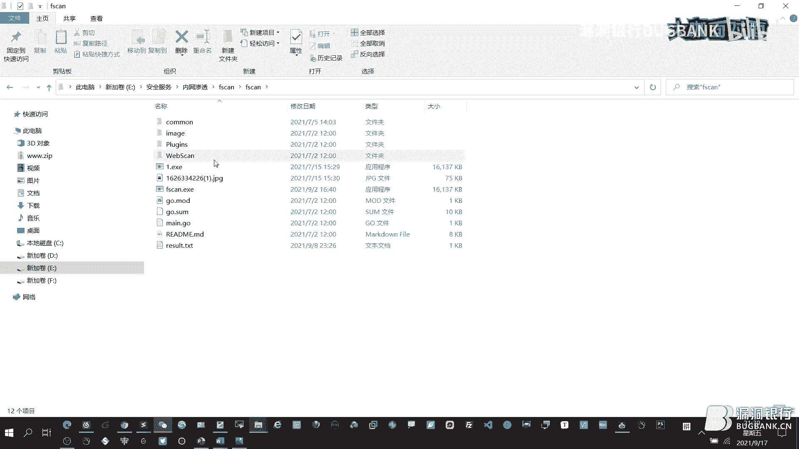

啊，对呃，就通过一个编译，然后就这样勾语言写的，然后编译编译完了以后就生成这样一个。

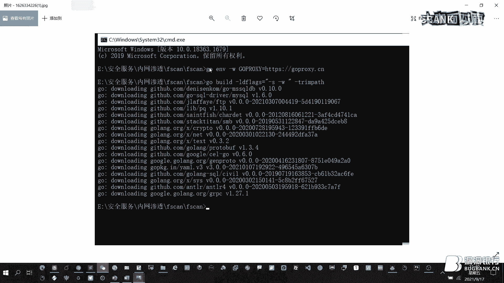

面纱版本的那个那啥这个这个源代码是在哪下的，我看看。是。嗯。应该盖他不上。嗯。啊，平时就把这些文章多多的那个那什么下来，这个回头吧，回头我把这个这个文件不行，分享给大家啊，F again。

这个就是免杀版的。然后嗯到方块传输和嗯的区别。今天绕过时看到我可以放的做一个什么原理。这个你考我考的太细了，我给你答不了啊，因因为我 map。这个这个作用的，这个应该是手工注入吧。

然后加这样一个注释符啊，这是注释符啊，你可定有有些语句是需要注释符的，然后这样要进行一个绕过嘛，等于是把后面的语句进行一个注释嘛，有的就不需要，有的就需要嘛。嗯，可以分享一下好的资产梳理的思路嘛。

互网的时候给资产站点防护的很严。对这个因为互网每次做的时候都要进行一个最小化。嗯，每一个呃。做了最小化以后，那肯定是容易的点都都被隐藏了。那那怎么办法？

这个就是嗯就通过我我连各件里面介绍了个一口那个那个工具，可以试一下啊。如果要是就是办法那个佛法佛法是咋说呢？就是我我个人觉得还是差点吧，还是要需要自己去扫描一下啊，端口进行一个扫描，这才能嗯。呃，行。

OKOKOK这我刚才看了一下，就是呃大看你在回答问题的时候，又有两个新问题。然后我这样子我再念我念一下，我念一下，咱们来都台了，就就满足一下表哥们那个就是黑虎阿福提问的，如何找实际的预渗透环境。哎呀。

这个问住我了，因为我遇到这一生头几乎灵。呃，我还没遇到过一生过了啊，不好意思啊。好，没关系没关系，就过咱们这这个问题就过。然后还有一个问题是，最近遇到了很多的跨站漏洞，不好利用。想问问大概有什么技巧？

😊，哎，我我我也讲了这个前端跨站啊，是嗯是最我觉得是未来最好的发展方向。但是我呢也比较菜啊，当然这个利用方式呢就是我我可以大概讲一下思路啊，如果是反反射型跨站呢，那这个这个怎没办法。

你得只能是发在人家这个管理员那那边才能才能执行了嘛。那这样的话呢，你难度是你可想而知，个别大的，除非你发这个调度邮件，人家能点嘛，对吧？如果不点的话，就没办法了。但是对于这种那个呃呃存储型跨站。

存组存储型跨赞的话，你就可以那个就是那个。进行一个后台啊，在后台，然后进行这这样一个一个利用，就直接可以进行一个权权限维持吧，配合S呃那个CSRF呃，就是进行一个利用的话，可以达到个权限维持。

另外的话就是我这建议就是土司里面不是有一个。稍等啊，我登录一下。哎哎，股子里面好像有一个那个就是我看一下啊。好像有个叉4平台嘛，这样X4平平台的话，可以那个利用一下。

另外的话通过这种呃这个这个这个文件特别好啊，就是打内网的时候可以用用到就是呃那个叉S是蠕虫啊，这样一个功能啊，也可也可以利用啊，就是通过这样一个。当然这个的话。嗯。还得自己搭。

我觉得好东西还得还得自己去尝试，不断的搭。因为前两天我我们一个朋友，然后就搭了一个好像对境外的这种赌博的一个系统，然后进行一个非法打击。然后就通过这个前端的方式，然后就就拿到了一个就是他的那个管理。

然后管理员的那个嗯这个叫终端的管理电脑。嗯，打打到了以后，有的时候是需要需要拿出来这个就是我们讲这个就是呃浏览浏览器的漏洞呃，浏览器的漏洞，有的时候要拿出来拿出来进行一个就是。

打浏览打浏览器这样的一个思路吧。但是我自己本身实践的话这块还是比较少。我觉得我也是需要从这方面未来肯定是前端的未来啊，这个这个是我觉得是。也也是高精阶的这这种那个。呃，技术吧，我觉得是只有这样才能呃。

就是应该应该是一个怎么讲的？就是前端应该是很很吃相的未来。对，就这样的。再往后啊。好好的好的，今晚的呃请问情况也差不多了。我天包书大咖你呃喝口水和口水休息一下，待会儿就要进入到激中人心的那个抽奖环节了。

然后由于时间有限呢，大家如果后续还有问题的话，可以到技术社群里继续交流。那接下来就是我们今晚的福利放松环节了。全帮书大咖亲自挑选择书籍，内网安全攻防。然后那个将要这本书这样呃送出天包书大咖可以说一下。

为什么选择这本书呢？呃，因为跟我的主题相关嘛，我我好像我记得之前我想送一本啥了，然后来好像那个买不到哎呀这这本还是能买到的。而且我觉得是那个秦安信出出品的，应该是质量上没有没有问题的。

而且他更多的是注重的是那个。😊，更更多注重的是那个搞这个思路。哎，思路很重要。我们我们搞这个工防演练，那不就是主要是思路嘛？呃搞这个安全的主要是思路。对，他那个思路要嗯。那那大咖先把那个只看提问。

那个勾勾给勾去。我们现在进因为马上大家现在可以做一件事情了，就以前咱们都是扣一，对不对？那我们马上中秋节了，我们不扣一，我们扣中秋节，中秋快乐好不好？勾吧，我来等我来等啊，我来等我看看因为有点延迟。

所以说中秋快乐。😊，表哥们，我们这我们我们今天不扣一哦，我们扣中秋快乐。祝大祝大咖中秋快乐。谢谢谢谢好，那那大咖可以。😊，开始开始那个看一下，你看留到留留留到最后的表哥们真的还蛮多的，很感动很感动。

等一下啊，看看啊，看看谁最积极是吧？😊，哎呀，我我老看见这个屠户张一德。嗯要不。啊，这个这个我我我觉得谁努力，因为我是但是这个这么多年这个大咖面对面应该是获得证书最多的。我这块再分享一下这个嗯。

嗯为什么获得这么多？我觉得就是我挺努力的，不断的去不断的去发这个问问问题是吧？然后也为为难了不少的大佬。然后我觉得这个嗯这块我也是希望能能找一个比较努力的一个小伙伴吧。好，我明白你意思了，可以可以。

对对对，可以可以，所以的话我的答案是。😊，可以的可以尊重大咖的选择。可以的，不糊张一德。😊，好好好，嗯，大卡对选为幸运。屠户张一德这个名字也让人印象深刻。好。

恭喜这位直播间ID为屠户张译德的小伙伴将获得这本呃大咖亲自嗯赠送的选书，需要你根据直播间的获奖提是在相应的区域留下正确的收货信息，或在直播后私聊我兑奖哦，我们会尽快将书籍给你寄出，希望小伙伴们耐心等待。

今晚的直播到这里就要结束啦。嗯，大咖还有什么想和我们大家说的呢？呃，我觉得这个卡面特别好。那个希望再有机会吧，谢谢哦好好我讲的话欢下次对，谦虚谦虚下下次下次可以讲蓝队吗，对吧？哦安排安排。😊，啊，好。

那这个都准备了半年嗯。😊，没关系，我们我们我们这个大咖一直都在，随时欢迎你来。那再次感谢全盘书大咖的用心准备和精彩演讲，希望本期知识内容大家都能学学有所得，有所启发。如果想回顾本期直播。

我们将在下周五的时间发布录屏。敬请关关注官网的更新或者群里录屏更新通知。最后大家也可以多多关注啊。全盘数的呃，刚才那个呃团队的那个二维码。到时候对，到到时候到时候。😊。

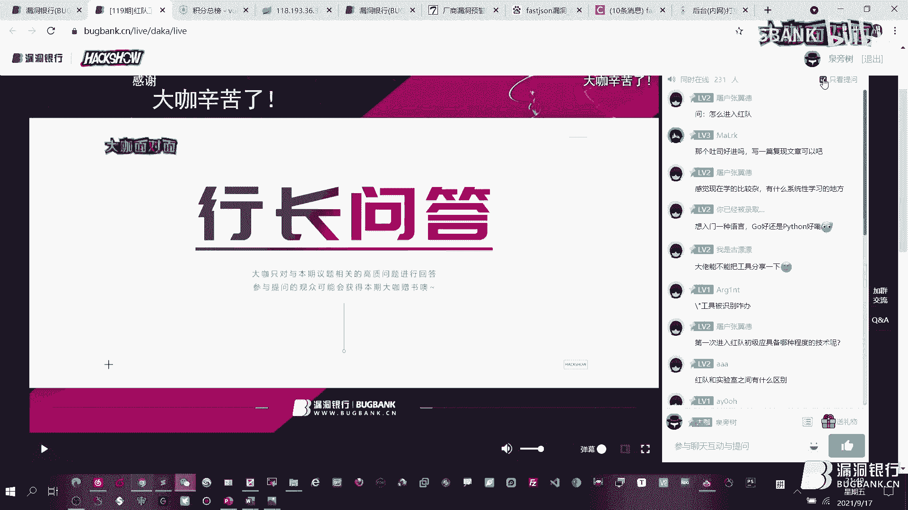

最后时机大家扫一扫。好，最后感谢来，我现在在念的时候，那个表哥们的那个手机可以扫一扫开起来了。感谢各位观众朋友们的守候，还有对咖面的支持和喜爱。如果你也想像大咖一样直播分享，欢迎找我报名。

大咖面对面是一个展示白毛风采和传播技术的舞台，不惧年龄不畏资立，只要你有才华敢分享，我们都欢迎。如果你想进群交流的话，可以在页面底部找到群号。本直播间地址固定，大家可以收藏到浏览器哦。

那今晚的直播到这里就结束了。感谢各位小伙伴的积极参与。大咖面对面，找五八点见，我们下次再约吧。😊。

