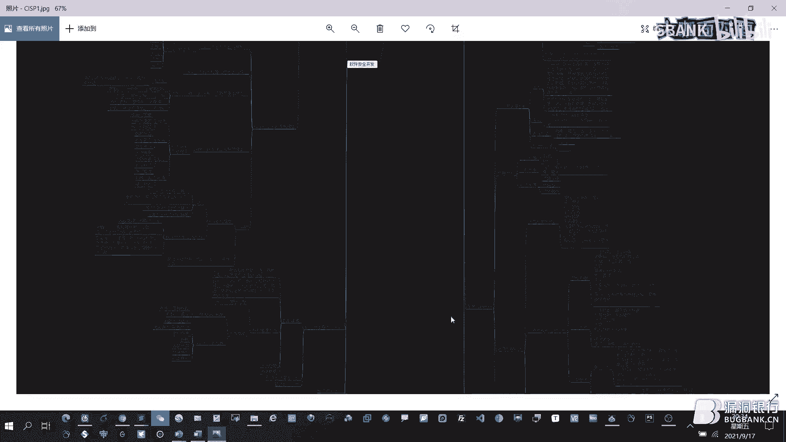
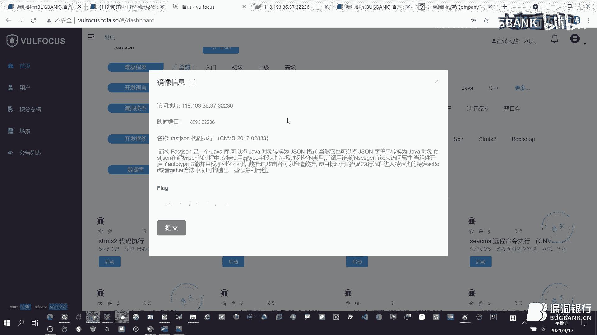
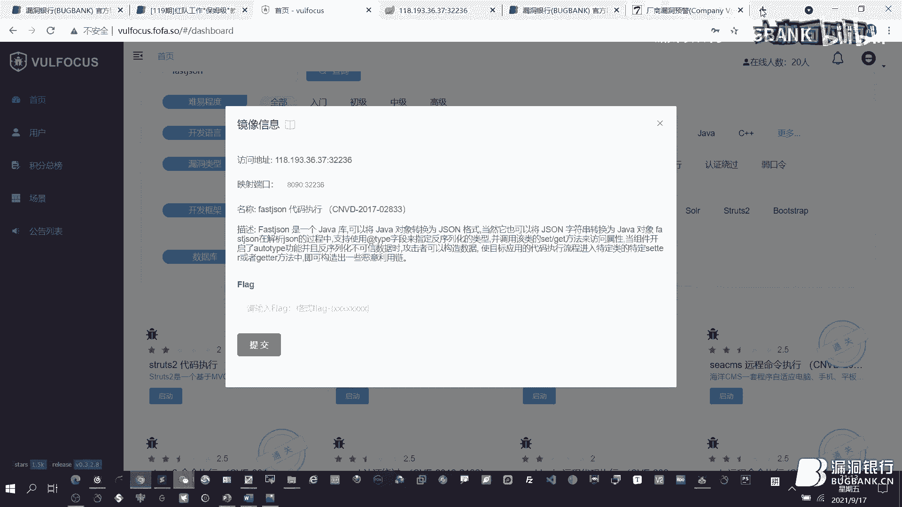
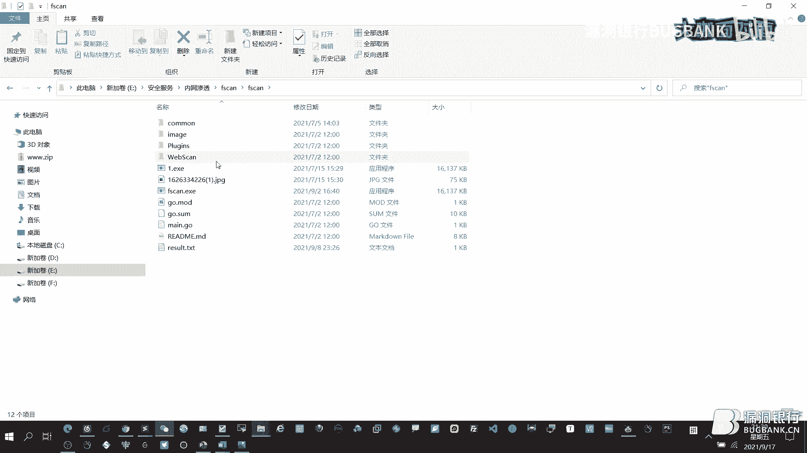
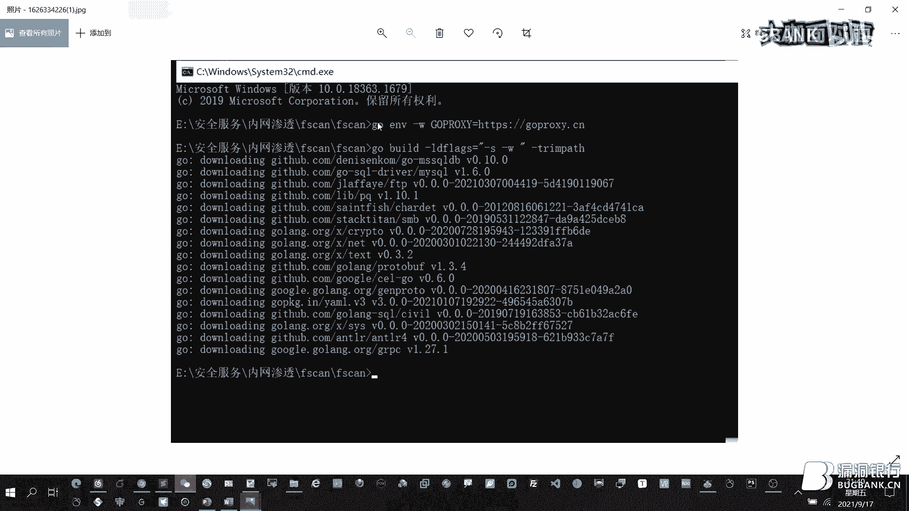

# 红队工作“保姆级”教学指南 🛡️


## 课程概述


在本节课中，我们将学习红队工作的完整流程与核心思路。课程内容源自漏洞银行第119期“大咖面对面”直播分享，由资深安全专家“泉旁树”主讲。我们将从如何进入安全圈开始，逐步深入到红队的人员分工、工具准备、实战打点技巧以及内网渗透方法，旨在为初学者提供一个清晰、系统的红队工作入门指南。

---

## 第一部分：入行先入圈 🌐

上一节我们概述了课程内容，本节中我们来看看如何迈出进入网络安全领域的第一步。对于安全从业者而言，了解并融入专业社区是学习与成长的关键。




以下是国内一些重要的网络安全论坛简介，它们是安全小白的“福音书”：

1.  **漏洞银行**：每周举办“大咖面对面”免费技术直播，对新手友好，是学习最新技术的好地方。
2.  **土司论坛**：国内气氛最活跃的黑客技术论坛之一，注册需投稿，通过“土币”激励机制鼓励分享。
3.  **52破解**：老牌的二进制逆向与软件破解论坛，每年有开放注册时间。
4.  **圈子社区**：以实战为主的新型论坛，工具更新快，注册需投稿。
5.  **看雪论坛**：专注于二进制逆向、漏洞分析的论坛，是学习系统底层安全的好去处。
6.  **FreeBuf**：综合型安全社区，注册开放，对投稿文章有金币或现金奖励。
7.  **安全牛**：提供大量高质量的视频培训课程，但需要会员付费。
8.  **90Sec**：老牌安全论坛，可通过投稿注册。
9.  **狼组安全社区**：特色在于免杀技术分享，可通过“狼币”兑换免杀功能。
10. **先知社区**：专注于漏洞原理深度分析，是学习漏洞细节的优质平台。
11. **i春秋**：提供丰富的CTF赛事、视频教程和实战演练环境。

除了掌握社区资源，系统性的知识体系也至关重要。CISP（注册信息安全专业人员）认证的知识体系大纲，涵盖了从物理安全到应用安全的广泛领域，为安全从业者提供了一个全面的学习框架。

---

## 第二部分：红队工作全流程思维导图 🧠

上一节我们介绍了如何融入安全社区，本节中我们来看看红队工作的整体框架。红队工作的核心在于充分的准备和清晰的思路，下图展示了一个完整的红蓝对抗思维导图，涵盖了从准备到攻击的各个环节。

（思维导图概要：红队工作主要分为**人员准备**、**工具准备**、**环境部署**、**情报收集**、**外部打点**、**内网渗透**、**社工攻击**等阶段。）

### 2.1 红队人员分工

红队工作需要多角色协作，以下是五个核心小组及其职责：

1.  **环境准备小组**：负责搭建和维护攻击基础设施，如VPS、团队服务器、生成恶意文件等。
2.  **情报收集小组**：负责收集目标信息，包括子域名、资产指纹、漏洞情报、人员信息（邮箱、社交账号）等。
3.  **应用攻击小组**：负责外部“打点”，即利用Web漏洞、系统漏洞等打开进入内网的突破口。
4.  **内网渗透小组**：在成功打点后，负责内网横向移动、权限提升、代理搭建和数据窃取。
5.  **APT/社工小组**：当技术攻击难以奏效时，负责通过钓鱼邮件、伪装网站等方式进行社会工程学攻击。

### 2.2 红队工具准备

工欲善其事，必先利其器。以下是红队需要准备的核心工具分类：

1.  **木马与免杀**：准备各种免杀版本的木马，如Cobalt Strike的payload、MSF的shellcode、PowerShell木马等。一个简单的PowerShell免杀示例：
    ```powershell
    powershell -ExecutionPolicy Bypass -WindowStyle Hidden -NoLogo -NoProfile -EncodedCommand [Base64编码的payload]
    ```
2.  **代理工具**：准备加密、免杀的代理工具，用于隐藏流量和穿透网络边界。例如：FRP、NPS、Neo-reGeorg等。
3.  **代理IP池**：准备大量的代理IP，防止攻击IP被目标封禁。
4.  **字典**：收集和整理高质量的用户名字典、密码字典、目录字典、子域名字典等。
5.  **漏洞利用工具与库**：收集各类公开和未公开的漏洞利用工具（EXP），并建立自己的漏洞知识库。

---

## 第三部分：实战技巧与思路 🔍

上一节我们梳理了红队的组织架构和工具库，本节中我们深入各个实战环节，看看具体如何操作。

### 3.1 外部打点思路


外部打点是红队攻击的起点，目标是在目标外部网络找到一个可利用的漏洞入口。以下是几种常见的打点思路：






1.  **命令执行漏洞**：如Struts2、WebLogic、Shiro等框架的漏洞，利用工具可直接获取Shell。
    *   **Shiro漏洞关键**：在于找到并破解泄露的加密密钥（Key）。
2.  **OA系统漏洞**：致远、泛微、蓝凌、通达等OA系统的历史漏洞利用频繁，是演练中的重点目标。
3.  **弱口令与后台getshell**：通过弱口令进入系统后台，利用文件上传功能获取Webshell。
    *   **重要提示**：在爆破字典中务必加入**空密码**（直接回车），实战中常有意外收获。
4.  **注册功能上传点**：在目标系统的用户注册等功能处，可能存在文件上传点，可直接上传Webshell。
5.  **高危端口爆破与服务利用**：对开放的高危端口（如FTP、SSH、RDP、数据库端口）进行爆破或利用匿名访问等漏洞。
    *   使用Nmap识别服务：`nmap -sV -p [端口] [目标IP]`
6.  **SQL注入写Shell**：在拥有绝对路径和写权限的情况下，通过SQL注入写入Webshell。
    *   MySQL示例：`SELECT ‘<?php @eval($_POST[cmd]);?>’ INTO OUTFILE ‘/var/www/html/shell.php’`
7.  **目录遍历与信息泄露**：通过目录遍历找到备份文件、配置文件，从而获取数据库密码等敏感信息，进一步利用。
8.  **网络设备攻击**：利用路由器、防火墙等网络设备的漏洞（如锐捷、华为设备的历史漏洞）或弱口令，获取设备控制权，并以此作为跳板进入内网。

### 3.2 内网渗透与代理搭建

成功打点后，下一步是进入内网进行横向移动。关键步骤是建立代理通道。

1.  **正向代理（不出网环境）**：当内网主机无法主动连接外网时使用。推荐使用稳定免杀的工具，如`Tunna`或改进版的`reGeorg`。
2.  **反向代理（可出网环境）**：更常用的方式。推荐使用`NPS`，配置简单，支持加密隧道。
    *   NPS优势：客户端仅需一个执行文件，无需配置文件，更隐蔽。
3.  **内网扫描**：建立代理后，使用内网扫描神器`Fscan`快速发现内网资产、漏洞和弱口令。
    *   命令示例：`fscan -h 192.168.1.0/24`
4.  **密码抓取与破解**：在获取Windows系统权限后，可从内存中抓取哈希或明文密码进行破解。
    *   常用工具：`mimikatz`
    *   常用命令：
        ```bash
        privilege::debug # 提升权限
        sekurlsa::logonpasswords # 从内存抓取密码
        ```


### 3.3 信息收集强化

高效的信息收集能事半功倍。

1.  **网站链接抓取**：使用工具爬取目标网站所有链接，发现隐藏的子域名或管理后台。
2.  **被动信息收集**：使用`EHole`等工具配合`Fofa`等网络空间测绘引擎，被动识别目标系统的框架、组件及可能存在的漏洞，避免主动扫描触发告警。

---

## 第四部分：经验总结与成长建议 📈

上一节我们探讨了具体的攻击技术，本节中我们来总结红队工作的心法和持续成长之道。

1.  **心态至关重要**：红蓝对抗不仅是技术比拼，更是心态和毅力的较量。开局不利时需保持冷静，树立信心。
2.  **赛后复盘与学习**：每次演练后，积极与友队交流，学习他人的思路和技巧，弥补自身不足。
3.  **分清任务优先级**：将简单重要的任务优先处理，快速取得战果；复杂次要的任务可寻找替代方案或稍后处理。
4.  **善用成熟工具**：在关键节点使用经过验证的“魔改版”工具（如特定版本的菜刀、冰蝎）可能突破防守。
5.  **扩大攻击面**：主站防护严密时，尝试攻击其关联系统、旁站、子公司资产，甚至供应商系统。
6.  **团队协作与效率**：作为领队，需明确团队方向，避免队员在已控内网中盲目漫游，浪费时间。应及时提交成果，转向下一个目标。
7.  **投资必要资源**：在代理IP、高性能VPS等基础设施上不要吝啬投入，稳定的环境是攻击成功的基础。
8.  **针对性强化训练**：定期评估自身短板（如代码审计、免杀、内网技巧），进行专项学习和靶场练习。
9.  **建立知识体系**：使用笔记软件（如`MyBase`）系统化整理漏洞利用方法、命令、工具使用技巧等，形成个人知识库。
10. **拥抱分享精神**：安全社区崇尚分享与交流。乐于分享，才能从他人那里获得更多。





---

## 课程总结

本节课中我们一起学习了红队工作的完整路径。我们从**如何进入安全圈**开始，介绍了国内外重要的安全论坛和学习资源。接着，我们通过**红队工作思维导图**梳理了整体流程，明确了人员分工和工具准备。然后，我们深入探讨了**外部打点**的多种实战思路、**内网渗透**的代理搭建与横向移动技巧，以及**信息收集**的强化方法。最后，我们总结了红队工作所需的**心态、经验和持续成长**的建议。

希望本教程能为你打开红队工作的大门，记住，网络安全之路在于不断学习、实践、总结和分享。祝你学习顺利！


> 注：本教程内容基于公开技术分享整理，所有技术仅用于合法授权的安全测试与学习研究，请遵守相关法律法规。