# P1：【发布2.0】那些年你未知道的MYSQLi Bypass Waf-舟长-大咖面对面115期_x264 - 漏洞银行BUGBANK - BV1pM4y1N74x

为知舌而存，因技术而生。各位小伙伴们，大家晚上好。欢迎参加第115期漏洞银行安全技术直播大咖面对面。我是今晚的主持人年年，今晚要给大家做直播分享的大咖是来自极客方舟。

且曾在我们漏洞银行平台举办过小白外部安全入门专题的D咖。他将自己的团队极客方舟比喻成在新安海洋上前行的一夜方舟，而自己则则是与大家同行，分享着新安技术与大家一起驶向远方的人。

所以熟悉的小伙伴都亲切的称呼他为州长。那么今天我们有幸邀请到他来做客咖面。他带来的议题是，那些年你未知道的my by pass。那擅长web渗透。

且长期在B站和游管分享原创技术的他今晚要给大家讲解有关bypa。的技巧，感兴趣的小伙伴们可要做好笔记。听到最后哦。那同时欢迎各位小伙伴登录直播间在聊天区进行交流互动。听讲的过程中有任何疑问。

可以随时在聊天区提出待演讲完毕后，大咖会在行长问答环节，集中解答小伙伴们的疑问。同时，今晚的听讲福利也将在问答环节结束后，挑选一位新运观众送出室由大咖，我们的州长精自挑选的书籍逆向工程核心原理。

那么下面让我们有请州长开始今天的直播分享吧。哦，那么今天给大家讲这个那些年你未知道的my circle by passwa。呃，那这个议题呢为什么要这么取啊，就是你要知道我做任何事情它都是有一点目的的。

并不是说随便取的。当然耐心点你未知道这个可能就是吧是给你们听的那my by什么意思？就是我今天要做的是什么事情呢？就是这个基于这个my circle对吧？并不是基于啊或者其他的数据库的。

我只是做my的对吧？然后的的一个注入的一个pa对吧？那pas是什么呢？是我们的接下来给大家讲了好吧那我们先简单介绍一下，我是你们的周长就的就是极个方舟的一个始大家以前应该听过对吧？

啊希望大家对对我这个视频感兴趣要帮忙关注一下对吧？那我们今天给大家讲的是什么是bypas还有bypass的现状还就是怎么学习，然后就是一个实战了那我们今天就赶快的看我们的这个PPT啊。

首先我们要看看是啊什么是bypass，对不对？你要去bypass一些东西。那你最起码知道什么是bypass或简而言之就是说你要bypass什么。我相信大家bypass这个东西一定是知道就绕过嘛吧？

绕过你在绕什么东西，你在绕什么东西，你在绕什么东西，重要的话说三遍，你在绕什么东西，你是在绕这个语言特性的这种拦截circle住的，比如说这些PDO之类的东西嘛，还是说你在绕这些框架。

有自己过滤函数这些函数呢，比如说这个有些什么比如说这个框架，它可能利用的这个防助的点，可能就是这些PDO是吧？比如说一些thon或者其他构语或者任何的这种后端的框架，它可能啊我说可能有自己的过滤函数。

它把这个circle的这个东西给过掉了，这个也是有可能。比如说你们键它经常会有这样帮你去过掉对不对？过滤掉对吧？你要知道你在过滤什么，对吧？要知道你在bypas什么。

那么这个像这样后端的这种框架过滤啊等大家。CF经常会遇到的，为什么呢？因为CF他喜欢做这么个东西。好吧。

那么还看看还有什么你要pass要那么今天我们要讲的就是这些基于这个客户端也就是服务器上安装的这些客户软件吧？说比云比说360比如说很多对吧？比如你们做这个的时候，他会要做首先做的就是一个个探测，哎。

那那个那个列表有很多对吧？我马上就给大家讲到了，不在这里讲就是在其他课程里面会讲这里只是告诉你他这个有很多而我们今天仅仅是绕过这个你绕过了可不见得你能绕过其他的对吧？

以我们今天要做什么的是绕个my数据库绕过这个要知道我们要做什么因为很多人他问问题，在群里问问题他都不知道自在问什么这是不好的你知道你的目标是什么是绕过我们的数据库是什么。mycicle好。

那么看一下那bypass现状是什么呢？就是大家这个拿到一个网站是吧？circle慢打开circle circlecle杠U，然后呃发现这么个东西，然后关闭对吧？

或者打开一个浏览器按一等于一and一等于2啊，关闭发现这个拦截。那这个思路是首先是不对的，好吧，你以后会遇到任何的问题，任何的问题，不论是生活还是工作还是这个技术问题，无论什么问题，你可能都会遇到问题。

那人一辈子就是遇到问题解决问题嘛。那你这只是个小问题，对吧？你遇到了问题，你要去逃避，你解决不了的对吧？我们要怎么办呢？我们要正式问题，对不对？证实它那怎么证式呢们后面慢慢给大家讲的。

那么现在大家在干什么？遇到这样的问题，就是这个拦截这样的问题，你无从下手，你们要怎么做，你们可定就是搜一搜吧。大家是怎么绕过的。但是这样的方法是没有问题的。因为汲取一下呃大佬们的经验。

这是没有问题的对吧？西天取经对吧？是没有问题的那我们。他们是怎么做？他们是比如说有这种什么注释绕过大小小绕过内联注释关键字啊编码就很多，对吧？然后你就拿过去绕，哎呀，发现有的还可以啊，哎呀。

发现有的不行，然后这就是你的学习思路嘛，你这样学习有什么意义呢？你又不知道为什么能绕过又不知道为什么，假设他绕过，你又不知道为什么能拿过。假如他绕过，你又不知道为什么绕不过。

所以说对你来说这个页面永远在你的心里永远都没有打破它好吧，你只是你也不知道为什么，对吧？你面对了一些未知的事情，又操作了一些你不知道的东西，然后就得到了那肯定是不能说正确错误，肯定是很模糊的东西。

你觉得有意义嘛，我觉得是没有意义的，所以我们一定要把它确定下来，对吧？还有比如说你们看到这样注释的绕过，凭什么他能绕过呢，你告诉我，假设你绕过，你知不知道他凭什么能绕过嘛？或者假设他绕不过。

你又为什么绕不过，他都是有原因的。这个世界啊就是有原因结果组成的好吧，所以说这个计算机也是一样，都是都是这样子好，所以说凭什么他能。这样子绕过对吧？那大小写那同理凭什么可以，对吧？

所以说你们的现在做的是什么？黑盒的盲猜啊？黑盒的盲猜第一它是如果你是新手的话，一定就是猜的不太够够准确，为什么？因为你是新手，本来对这个东西就不太了解，对吧？然后你就去瞎猜，可能猜的中。

但是猜不中的概率还是蛮大的，对不对？好，如果你是个老手的话，那你去猜，我觉得问题没有那么大，当然也是有问题的，因为不够完美嘛的，那问题没有那么大，因为你有经验，你可能猜的比较准确一点，对不对呢？好吧。

所以说黑盒的盲猜它是不是有有些问题呢，所以它会导致你嗯为什么是这样的Y，对吧？不知其所以然，这是不行的，这不是一种学习的方式，对吧？当然你做工程什么，这当然你可你猜对了，这个还是蛮好的，对不对？

但是你要学习的话，这这就不是好思路了，对吧？所以我怎么学习呢？或者说我们怎么学习呢？我们一定是要从黑到白，对不对？因为黑的东西我们是琢磨不透的，我们永远不知道它哎，它到底是个什么东西。

我们我们我们没法看清楚它，那么怎么办呢？我们想想想想办法能不能把它变成一个白的东西呢？就是没有源码，能不能把它变成有源码的东西，然后我们去看是不是就好看了，对不对？你一个外部程序。

如果它有不论是外部程序还是二进程序，它有源码总比没有源码好。哎，这时大家一定可能有源码一定比有比没有源码好。所以我们要怎么办呢？我想办法把黑盒的东西变成白盒的东西。

也就是说还白盒的这个测试一定是大于这个黑盒，也就是呃可能对我们来说是比较比较简单的，因为相对来说，因为黑盒它是它就相当于一个你什么都不知道，对他来说，那么把它变成白盒，就是你最起码有了一些源码。

或者有一些呃能从它这个程序里看出一些猫腻了，对？所以我们想办法把这个黑的转成这个白的好吧。那具体怎么转呢？我们就慢慢给大家讲，首先你要猜它对不对？那拿到一个比如说 dog，你要猜他怎么去。

我们就说sfe dogg他怎么拦你的，他有没有自己的引擎，对吧？有没有自己的规则性的引擎，或者有没有机器学习的引擎，或者有没有正则表达式的一些引擎去拦你呢那么这里为什么要说正则表达式。

因为我这里我我分析过他他是有这样的，所以说他是用正则表达式去拦你的对吧？所以说那他还有没有其他的方式去拦你呢，那你不知道他可能就这么一些，但是他用了哪些，你又不知道所以你大概猜猜他有哪种？

你就可以去具体分析分析他到底是用了哪种方式，好吧，所以你要干什么呢？你要首先要知己知彼，对吧？那知己的话，就是你要熟悉正则表达式。因为我们今天讲fe dog吧？

他的拦截是通过正则表达式拦的你所以说你你都看不懂正则表达式，那你怎么绕呢那觉得也很有点不太好，对不对？还要熟悉这个的语法，尤其是这种偏的语法。为什么呢？因为写这些wa的人，他也是人，对吧？他不是神。

对吧？他也不是什么呃神仙什么之类的。他和我们一样都是人，所以说他也熟悉这个语法。那他要用一些他的这个正的表达式去过滤到你的这个语法，他也知道哪个该过滤哪个不该过滤，对不对？那么假设你了解的语法啊。

可能比他多。比如说有些偏文的冠门的，哎，那你是不是就可以比他呃知识量多一点，他是不是他只知道拦哪些，但是你你有更多的这个呃这这种语法，他是拦不了，对吧？所以说你要了解这些东西，好吧。

那么还有这H写这个是很常见，这这个就不说了，他就是熟悉一些软件的底层运行的原理，为什么呢？因为你要大家都知道这个跑到这个成就操作系统上面，他是一个软件，对吧？他是这个二进制的东西。

所以你要尽可能了解这么个东西。好吧，那么很多人又说了。很多人又说了会有很一些疑问，对吧？那搞外部渗透。那么为什么为什么搞得搞搞搞来搞去搞逆向了？那逆向就比外部强嘛？大家不要有这样的思维啊。

这样的思维是错误的，就相当于你是个厨师，你非要和你非要和什么司机去比哪个好，这个没有办法可比性的，对不对？我们在做什么，我们这节课在做分析问题，解决问题，在做什么，遇到问题，分析问题解决问题，对吧？

我们遇到了问题，我们干什么要解决问题。至于怎么解决，你要有思路，至于说这个思路里面你可能会涉及到一些点，你不懂我们慢慢学会就行了呗。那么但是你一定要知道有这样的思路才行，好吧。

就相当于你要从这里回去北极，你可以说你没有钱坐直升直升飞机去，但是你一定知道坐直升飞机可以去好吧，你可以假如你没有钱你去打工赚走钱人可以去了，但是你都不能不知道啊，做直升飞机可以去了北极。

这是你要知道的好吧，我们一定要有思路对吧？思路是什么知己知彼呗。我假设我们已经做了知己了，就是了解自己是个什么样的。😊，那么支笔怎么去支笔呢？就是我们要想想bypass的东西，它是怎么拦我们的。

也就是那个页面，对吧？这个东西怎么跳出来的？他凭什么他就跳个这么个页面，他一定是写好代码了，对不对的？他凭什么呢？对吧？这是你要知道的好，那我们看一下哎，到哪了？好，所以我们要知道他是怎么拦我们的。

你要分析分析他怎么拦我们那么这里我分析了他有两种拦截的方式啊，一种就是他有这个自己的这个正则表达日拦你的这个rcle还有一种就是正则表达日就过滤你的URL的这个这里和大家说，大家可能听不懂。

因为我后面给大家仔细的讲，这里又想说的什么，你要做到知己知彼，知己知彼就是说渗透无非就是你要对一个东西了解的很深入的你对他了解的越多，你就知道他可能有什么缺点，什么优点，这个人是怎么样子。

那对程序来说也是一你对了解的越多，他就可能你就知道他有什么bug有什么可能有什么漏洞，对吧？对所以你要做知己知彼，好吧。然后知己知彼，比如说我们的这个呃这些东西，哎，比如说这些东西是怎么来的。

然后你就一眼就能看到了，对不对？好，那我们来实战一下，这是实战了。好吧，实战也是大家最喜欢的。好，那我们看一下，那么实战的话，我这里是用的一个虚拟机啊。呃，这里是跑的一个呃sft dog这个版本啊。

其实版本的其实版本的这个什么版本其实并不重要。因为不同的版本可能拦截的效果也不一样。因为我没有分析过不同的版本，对吧？我只分析我们几个，可能感觉还都都都差不多，所以说这个版本呢，你是无需关心的。

你只要知道它是这个好像是最新的嘛。你但是你要知道它是我是怎么样去哎去分析它的，对不对？还有就是我今天讲了sft dog，那你说其他的东西，你可能说你不会，这很正常。

但是你一定要知道知道思路是怎么样子的对吧？这是非常重要的啊，我这里跑了个这个。

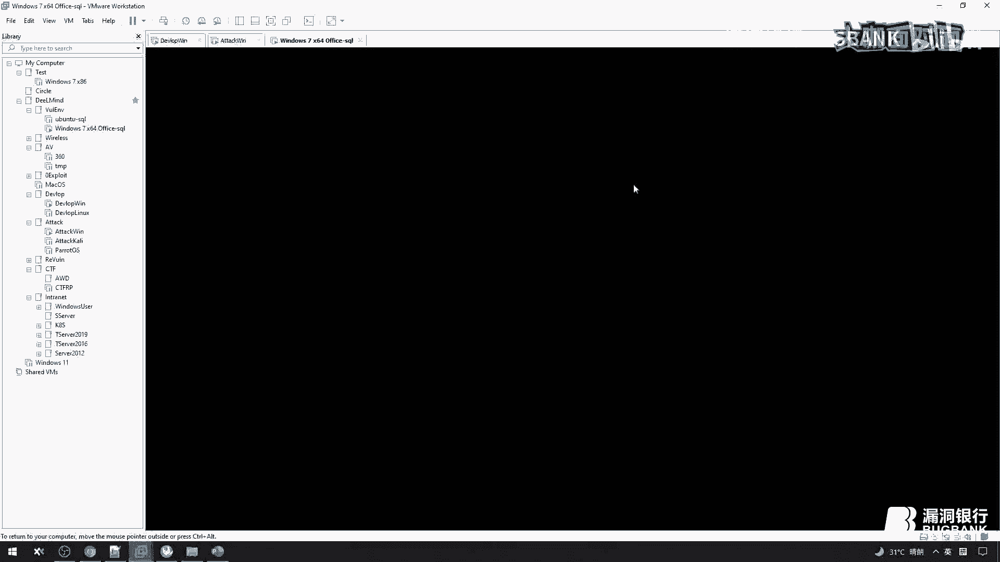

然后我这边呢它是就是对我这边写了个页面，就是这样，这就是我的这台192。168。13193130啊，也就是我们呃这台电脑的IP可能fi一下。好吧，看到没有？这就是这个电脑IP地址。

所以我访问这台电脑搭的服务器数据库就是丢慢的。然后下面的这个DU的啊，就是这个好，这个东西你一定得知道你不知道这个东西说明你新太新手了，你可能要接触接触以前的简单的知识了。好吧，好。

那么看一下大家的绕过，我们看一下，这里给大家总结了一下大家的绕过，比如说大家在绕过什么，最简单的。大家绕过什么？就是按一等于一是吧？拿到一个网站也不知道为啥，我就想按一等于一。好。哎，他他被拦了。

被拦了的情况下，你要干什么呢？你首先是要干什么？你要分析分析他为什么拦你对吧？好吧，那我这里已经分析出来，我等一会儿教大家。好，你为什么要用and一等于一呢？你也不知道为什么。

那你那你可不可以用and对吧？44等于44呢，对吧？比如你再执行一下，你看到他就不拦你了，他就不拦你了，对吧？我这里给大家有写啊，这都是我自己分析出来的，或者-44-144，对吧？Yeah。好。

-144，他也不会拦，你，对不对呢？哎，这是为什么呢？好，这是为什么呢？哎，这都是有原因的。我现在给大家说一说啊。

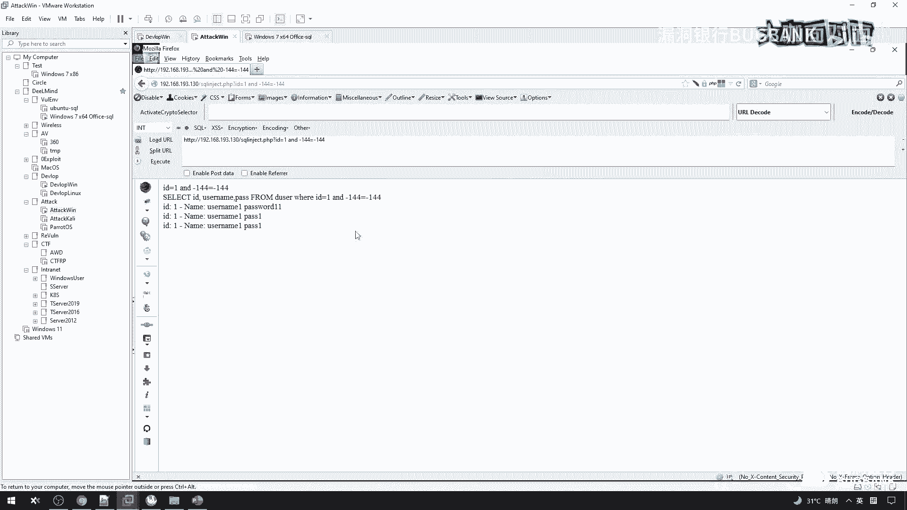

好。首先我们这个嗯挂一个调制器啊。

调试器呢这个叫做叉64Gbug。我以前讲逆向课程，大家应该或多或少，虽然没有讲过特别系统的，但是嗯或多或少在课程里面讲过一点。

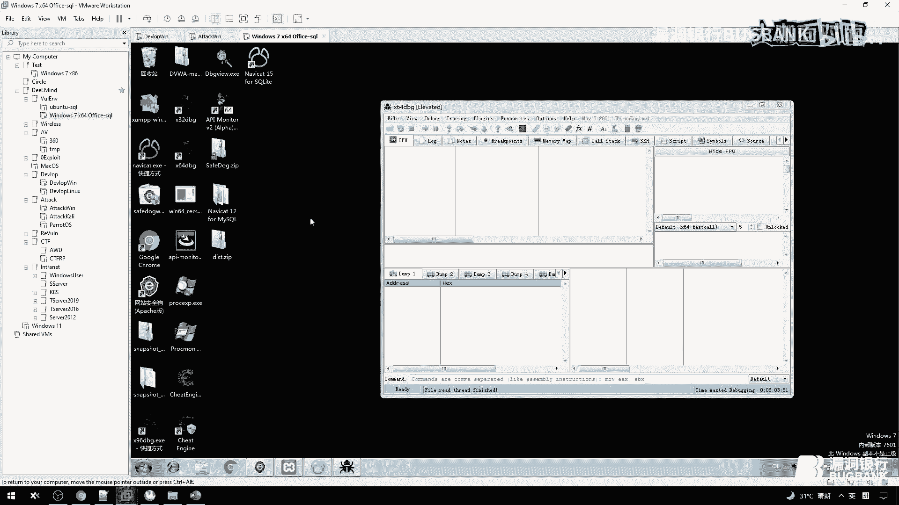

呃，比如我们可以附加附加，就是你要调试哪个程序，我们调试的程序不是安全狗的程序啊，安全狗它是这样做的。他是把它的动态链接库，把它的这些就是这些代码。比如说我们可以找到这个安全狗啊，安全狗我安装到C盘。

然后有一个什么。哎。好，safe dog它是把它里面的这个。哎，把它里里面的一些动态链接库写成一个插件，插到这个插到这个插到这个HDP也就是我们的阿帕奇里面了。所以我们要附加的是谁？阿帕奇。好吧。

你看到它有两个，那你一定要用这个，因为下面这是个起了个服务，应该上面这个就是我们正儿八经起的程序，好吧，那我们把它探示一下。呃，探索完的话，它会就是就这样子运行起来。

它就会就runrunning就运行的。希望大家不要产生这样的误解啊。就是说啊发现我又在这说个逆向，人家逆向就比外部渗透要强什么的，不要有这样的思维。你有这样的思维，说明你的想法错误了。

他只是他只是我在解决解决什么。解决我这个问题需要的用到的一些手法而已。如果以后你分析的问题，你比如说他拦你了，它不是用的这种这种底层的这种二进制拦你，他就是一个外b的拦你。

那你就没有必要去这样这样去分析这个底层东西。那你就分析那些外b怎么拦你的就行了呗。那种比呃比如说后端代码，对吧？好，所以说你不要有这样的想法，你要知道我在做什么，我只是遇到一个问题，我要解决问题。

只我解决这个问题过程中，我需需要用到一些工具呃一些其他的知识点，好吧，那这些知识点和工具你能不能学会呢？一定是可以学会的，好吧。但是你没有思路，那就没有办法，你有了思路，你就知道去学这个东西了，对不对？

好，那么看一下附加完了之后，这个sybol这里呢symbol它这个符号，比如说我们看一下，这就是它的这个呃这叫什么动态链接库，它里面有个导出函数啊呃。我们走走过这里，哎，下个断点，然后我们这边干什么呢？

我们去execcuse执行一下，你看到没有它正在转圈，说明什么？这边已经下了断点，他已经代码已经走到这里了，对不对？你看到没有？他走过来之后呢，你有没有发现这里啊哎我们把它copy出去啊。哎。嗯。😊。

好，看到没有？我们的代码以前是什么来着？我们的代码我们把这个东西都给它删一删嘛，知道大家能应该是看不清我们的代码以前是什么。and哎呀and一等于一啊，不是and这个这个这个44等于44。

但是为什么到了这里它变成and，好像没有什么，等于没有什么了，就是空等于空了呢。哎，对吧，所以说它是有变化的，但是你一定要知道它是有变化的，对不对？它是有变化的。他你看它正儿八经到了。

它这个这个函数就是判断它判断这个语句有没有注入点的那我们输的语句是什么？输入的语句是这个114114，对不对？我妈拷贝出了。我们说的语句是11-114-1，但是它进入正正儿八经进入它那个circle。

哎，就是判断它有没有circle注的函数，它居然把这个-114给去掉了，那去掉为什么就可以不拦了呢？我再大家看一下。呃，在哪呢？好and。首先我们看一下safe dog。

也就是and一等于一这个东西它是谁拦的？你，我们看一下是哪个规则拦的，你对不对？好，比如说我们在这里我们这边先把它跑起来啊。跑起来之后呢，我们比如说加上我们的and一等于一，然后我们再excuse。

excuse之后又断下了，因为为什么呢？这边下好断电了，看到没？它这里是按一等于一，对不对？也就是说你输入按一等于一的时候啊。安全狗啊，就是sft dog并没有把你这个一等于一去掉。

而是他把它源源不动的原封不动的对吧？交给这个circle injection那个函数，让他去判断它有没有有没有问题。那那个那个函数怎么去判断呢？那我们看一下呃，这里我记录了一个断点。呃。

叫做这个呃这是我分析找到的一个断点啊。但是你可以记住这个地址，你可以自己回去去尝试一下，也是没有问题的，好吧。他这个断点能看看到什么呢？你只要你再走一步，他就过来，他能看到它的这个拦截的规则。

也就这条规则是蓝的那这条规则我就不往出拷贝了，因为我已经拷贝出来了，好吧，它是用的哪条规则呢？也就是这三条，因为。因为它有好几条拦你，比如说他有这条。哎，假设我们第一假如我们现在是看到哪条呢。

这个新开头的对吧？也就是这里就这条规则是拦得你的好，也就是这一条对吧？那我们去看一看这是什么代码呢？这是正则表达式啊，记住这正则表达，为什么让大家学正则表达式呢？你看到没有？知己知彼的时候。

知己知彼在哪呢？呃，找找哎，要熟悉正则表达式，为什么呢？因为他是这样拦你的，你不熟悉它，那还搞个毛线，对不对？那我们去到我们的虚拟机里面去看一下。然后比如输入我们的正则表达式。

然后输入我们的这个I哎and一等于1。

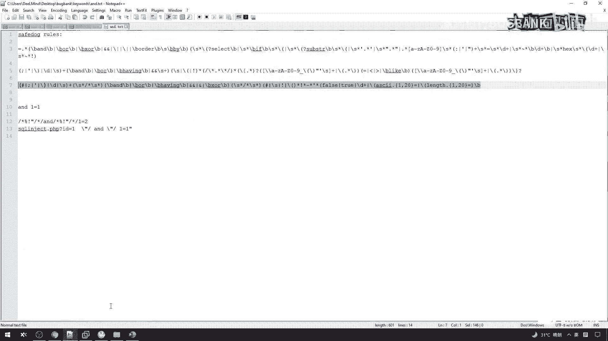

比如说PP问号ID等于一and一等于一，这个为什么没有呢呃。这个他可能是这个这个这个什么号，这是。Yeah。可能是这个这个这个一。哎，这个杠好是有问题吗？我们看一下，我们看一下我们可以把那个拷贝出来。

可能这里我拷贝的有问题了。

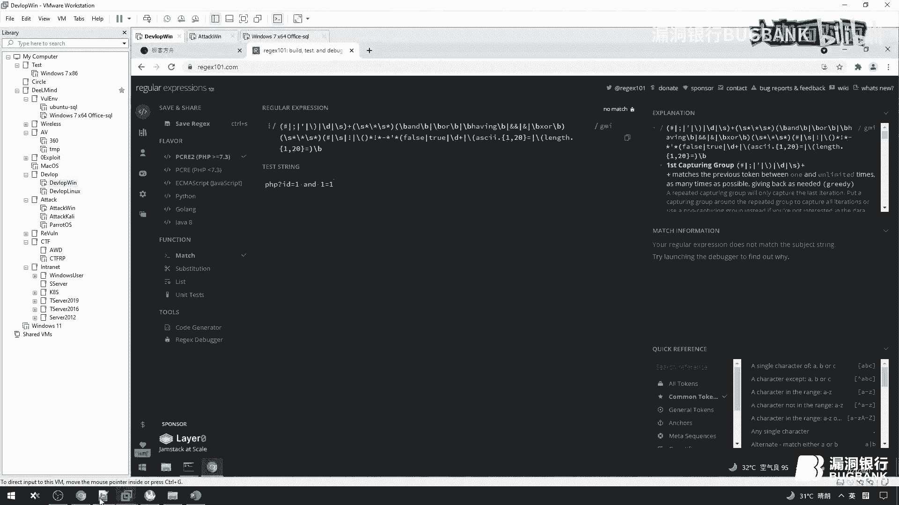

好，把它的拷贝出来。哎，我记得没有问题啊，应该好，我就不拷不拷贝这里了。因为这里拷证你看到没有？它有双就两个杠，它会转移，我就是操作的比较麻烦。那么这里呢它的规则呢，我已经都弄出来了。它的规则在哪呢？

在这里呢给大家找一下，这是它 dog那个目录里面有一个这个gennuary confi。然后这个最大的这个东西就WPCDC defineine circle点da这就是它的规则，它的规则是加密的。

你拿出来说解一下密。我们可以解下因解密的工具我已经写好了。呃，我们打开们CMD我已经把这个东西拷贝出来了。因为我我为什么做这么一步呢？是这步也无所谓，要不要做，因为为什么呢？因为我想拷贝出它来。

但是它这个两个两个斜线就转移了，你就我我我要操作啊，特别麻烦，对不对？所以说我们先把它整个的规则都解密出来，我写了一个de，就这个工具，然后这个输入我们的WP，然后随便输出一个circle点TT。

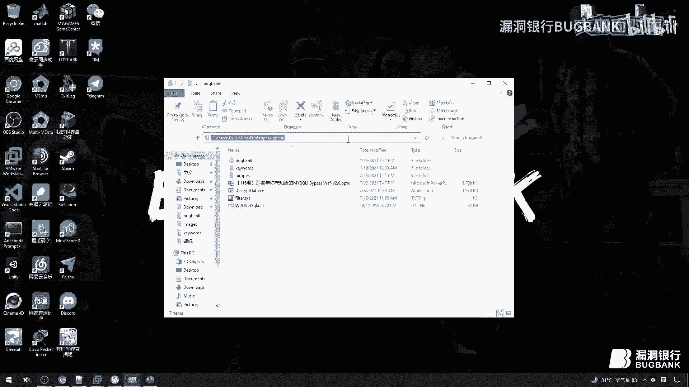

啊，就就这个他这个规则就出来了，这就是它的规则。

好，我们看一下他们的规则，这就是安全狗。它凭什么拦你的规则，这规则都是有很多，对吧？呃，我们这个都不重要，我们看一下它的这个。はい。好，哎，这就是它的circle看到没？有很多条去拦你，对不对？

那我们找找那一条，刚才那条是什么来着？呃，这个应该是怎么会错误呢？Yeah。嗯。嗯，我们去找一下他。啊，就是这一条对吧？对这个哎，这个会错误吗？我也不知道他这个是什么鬼，有问题吗？好。

我们把这条规则拿拿到我们的虚拟机里面去看一下。

呃，他是个什么鬼啊？

呃，先不管它，我们去试一下其他的，是我这个拷贝有问题吗？

Yeah。嗯。

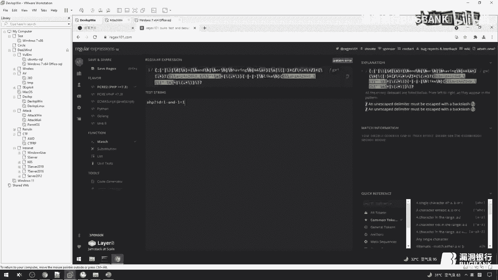

呃，看一下啊。应该没问题吧。好，那我们等一下再看，我先给大家说一声，就是这个规则在哪呢？哎，就是这些规则就是他要绕过，就是他要拦你的一些规则，就是这么多对这么多，你看他也没有想象那么多嘛。

就好像就100来条100多条，对吧？也没有那么多，所以说这些都是正则表达式写的，你要写你要懂正则表达式，对不对？然后你看的这个正则表达式，你就能有一点点的想法，怎么去绕过它好，怎么去绕过他。

这是你要想到的东西啊，你不能说我靠我也不知道他怎么拦我的，我就去绕它，这个就是有点不太好，对吧？最起码对我们学习来说不是好的事。那么拿到规则了之后，我们要看看是谁拦了我们按一等于一是谁拦，也就这条规则。

那么co贝出来看看嘛？这没办法了，我也不知道为什么会出错。嗯，拷贝出来。系。好，这就是它的规则，但是它有两个双引号哎呀这个东西。

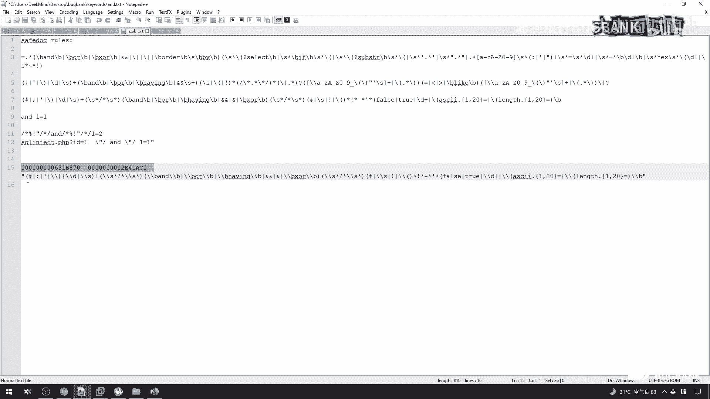

我们去用这个工具看看吧，那可能是那个。呃用这个其实这也是个正则表达式的匹配工具啊，也没有什么，就是和里面那个web页面是一样样的，和这个是一样一样的。只不过可能这个东西有问题了。呃。

这个东西哪里有问题呢？在这里啊，它这里有个设置啊。这个设置呢可能需要设置成一个这个勾浪的。你试一下，可能我以前测试过是这个样子，但是我不确定啊，那不行的话就算了，我们用这个。

这只是个正则表达式啊，无所谓的。然后把这个拷贝进来。然后呢，把我们的这个and一等于1拷贝到这里。哎。看到没？它已经匹配到了，它这个黄色是什么意思呢？黄色就是说哎，我们把它拉大点。

这就是它的这个我们这边不啊，就这样吧，我们看一下左边啊，也就是说我有这条规则，把我们这个按一等于匹配到了，哎，匹配到了之后干什么呢？匹配到了，那说明你什么你有问题，对不对？你有问题，我要拦你对吧？

所以他才会弹出弹出这个东西弹出这个页面，因为为什么呢？因为它的规则，也就是我们刚才当不出的那么当不出那么多规则，对吧？哎，你拦掉你了，好吧，那我们怎么去绕它呢？那很简单，那这里绕呗。

比如说你加个什么所谓的加号，哎，他就绕过了好，它的确绕过了，对吧？那我们看一下其他的表达式可不可以？比如说其他这个我们刚才是绕过这一句了，对不对？那么现在绕了这一句试试行不行？发现它也没有也没有匹配到。

对吧？但是你只要不加这个加号，它都会这样匹配到。所以这就是为什么网上很多教你绕的都会加这个加号的原因啊。但是我跟你说啊，加这个加号它是绕不过去的，为什么我一会儿给大家说原因啊。好。

你看这条这条规则它也能绕过，对不对？你看不加它就不行，但是我们加上去试一试，加上去跑一跑，我们实际操作一下，那我把它走走起来。我们看一下。呃，这个不用管啊，呃，我们怎么办呢？我们。哎，我们是加了什么啊？

加个加号，对不对？我们这里加个加号，对？我们再执行一下。好，又执行起来了。我们看这边看到没？这边的话它是应该是没有用的啊。比如我们走起来看到没又拦了你了，我们在执行一下，我们去看看为什么它又拦了你了。

好，我们看到这里还是刚才说的那里进入这个URL进入这个注入函数之前，也就是这个函数，它要并例，它的这个规则库去拦你之前啊，它会先把你的URR过滤掉，怎么过滤呢？就是就是他把那个加号给过滤了。

所以为什么你看我们在这里看到明明加号是可以拦的对吧？加号是可以绕过的，为什么他绕不了了，他把这个给过滤掉了，他正儿八经进入那个检查你的函数的地方，还是这里所以说你要怎么办呢？

你要找找它是怎么这个这些它是怎么去过滤你的好，这是我们要分析，你看我们的分析思路是什么？首先我们哎输入了一个按一等于一发现它拦了，发现它怎么拦的呢？他的发现它拦截的规则了，对吧？拦截的规则。

我们已经找到了，对吧？就这几条规则，拦截的规则找到之后呢？呃，然后呢他是怎么拦你的呢？然后然后你就想办法绕过这三条规则，你发现加一个加号很容易绕过了。但是你发现加了加号在实际情况下并不行，为什么呢？

因为他把这个东西给你过滤掉了，那他怎么过滤的呢？这个你要分析一下，那这个的话呃。

在哪儿呢？哎，这个的规则他是写到这里了。它有一个什么？哎，它是在这个里面的，这个东西就比较多了，需要解密一下。但这个解密方式呃不太一样。所以我已经做好一个工具了，在这里了呃。

我们登录一下在这个wa这里安全狗的规则，这是个future data对吧？好，这就是它的过滤的一些东西啊。比如你看到没有？为什么44和-4-44，它会它会可以成功的。

也就是说你可以绕过它能用这44-4因为-4444，它正儿八经进入它的过滤八进入它的注入函数之前，对吧？它已经把这个44-44给过滤掉了，所以说当然你这个东西就这个东西明显就不是个注入语句，吧？

明显就没有问题。比如说我们可以放进来试试对吧？明显不会匹配到，所以说它一定是可以绕过的，对不对？所以说那44-4，它凭什么会过滤掉你的44和-44呢凭的就是这里他那个数据库里面它已经写好了。

你遇到44-44和4它就会过滤掉你这就它的规则，但是规则有很多，因为我这里教学也不是给你做工程的，我只给你看这么多情况，它还有一些呢好吧，你只要知道有这么多，它会过滤你的一个。L过滤完之后呢。

然后他把过滤后过滤之后的那些URL，然后再进入它判断到底有没有circle住那个函数，也就是它会便利它的这个这个表去判断哎，你这个到底是不是个circle住的这个URL对吧？那我们既然知道了对吧？

那我们这个就关掉了，哎，没啥用，先不关吧。好，那我们知道了，对不对？知道了哎，知道了他们他会把这个东西给URR里面的东西给过滤掉。我们也知道了拦截的这个可能就加个什么加号就很容易过去。

那我们的思路是怎么做，我们的思路是什么？我们的思路一定是就是想想办法，对不对呢？我们的思路是什么？看一看这不能回车嘛？这个工具再说一下，就是个简单的一个正则表达式的一个工具啊，没有任何的一个呃奇怪。

因为他的这个安全狗它用的这个正则表达式的匹配库是用这个bos这个呃用C源写的可能这个呃外端的GS和PPP的可能有点问题，但是没有问题，我测过，但是可能我没有设置，我也忘了怎么设置那个那个网站。

因为用的不多好吧，那么就用这个所以这个东西是无所谓的。你只要找一个boss东西，或者说其他的也是可以的。只要正则匹配通常是没有问题的。好，你看到没有？他他是这样子对吧？那我们怎么绕呢？那我们要怎么绕呢？

我们知道这里加一个什么东西。他会把这个去掉，对不对？那我们能不能想想办法，对吧？想想办法，让他让它过滤完之后，让它过滤完之后是这个样子，对不对呢？过滤完之后是这个样子。

那我们这个这个这个东西明显是这里面的三条都匹配不到的，也就是说能绕过它，对不对？我们的思路是这样的，我再再说一遍，我们的思路是什么？我们加一个加好就可以绕过它所有的防end的一个对吧？一个一个语句了。

就要加一个那我们的想法是什么？哎，能不能加能不能在它的过滤函数过滤之后还变成这个样子呢哎，这就是我们的想法，或者说变成其他的样子呢，吧？或者是这样子的哎他也就不拦你了，对不对？那我们那我们要怎么做呢？

好，那么这个时候我们就可以去批量去跑一跑了，也不是瞎跑啊，我们批量的去发子一下，也不是瞎发子对吧？批量去测试一下，好吧测试那么我们测试是怎么测试的，也就是我在按前后随便放点什么，放点放点什么东西呢。

放点可不能你也不能随便放对？你要放点像这些哎这些字符，对不对？因为它要过滤你的，也不知道他怎么匹配到，你也不需要分析他这些匹配的这些正则符哎，然后你可明文的去也不要明文嘛，就白盒子一下。

你知道他这个发子的这些这些这些。数据应该有什么，然后你就尝试尝试多跑跑，然后就可以跑到了。呃，那我们这里看一下呃，那用什么跑呢用srcle跑啊啊，不是用这个跑好，那我们怎么跑。

我们就在按前后随便加点什么这些东西，因为这些东西是什么呢？这些东西它过滤的那些过滤符，当然你也可以这些都加上。因为我这个跑个简单的就可以绕过，我又没有都加，都加上也是可以的。然后加上之后呢，是到哪。

加上之后呢，我们到我们去看一下我们的s这是我们用随便用一些这些。当然你可以加这个什么我们刚才那些44呀，呃-44呀，哎，对这些东西加上好，加上之后你你让它随机呃我就不保存了。你让它随机生成一些呃代码。

比如说我们在这里看怎么生成呢？

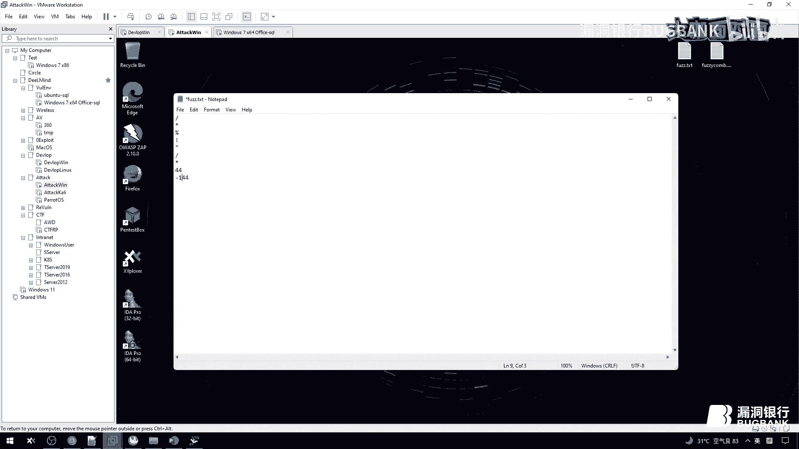

哎，在哪儿呢？呃，这个tempamper里面是吧？好我们打开我们的这个note band。这就是我们刚才的这个fa的这个这个符号，你可以随便用，就是不能随便用啊，一定是有原因的。

为什么用这些就是因为它的filter filterter了这些了，所以我们又用这些可能会达到这么个效果，对不对？可能会达到这么效果。当然你也可以硬看这个正则表达式硬看对吧？硬看它是怎么绕的。

但说硬看的话可能没有那么速度快，但是硬看也是没有问题的好？而且它这个过滤，它也有顺序的，它是它是从1234开2345这样顺序来，它也不是乱乱的来的对吧？所以它的顺序也会影响到它，对不对？

所以说你也不是随便来的，也不是随便来的，所以我们一定要用它的filter里面的那些它filter里面那些符号，用为这些符号干什么？我们可以组成一个组成一个随便组成个combine就组成这么个东西。

好像是个注释样的东西。但是这个东西我经过就是用这些符号就是我可以写一个什么随便写一个就是随便写一个排列组合，哎，把它排列组合成一些就是因为。我知道这是个注释嘛，对吧？

这个注释里面的东西它是不会执行的对吧？那这个这个一定得知道，这个都不知道，那那那就没有什么基础了，对吧？那么所以我们这里的话你看都是一些注释，对不对？里面就是加上我们这些filter的这些这些这些字符。

然后我们就尝试能不能绕过能不能去过，能不能去不叫绕过，能不能尝试绕过它的这个filter，让让filter之后能让我们的这个能让我们这个语句变成像这个样子的东西，对吧？比前面有个杠呀。

后面有个杠它就不拦你了，对不对？比如前面有个杠后面有个杠它就不拦，我们变成这个样子，它就不拦了，不拦之后呢，对吧？要做什么，我们接下来我们慢慢给大家讲，我先讲这个不栏之后，好，那我们去fa一下它。呃。

怎么fas呢？我也不会了，首际上我们把我们的断点断点轻了啊，断点轻了呃。嗯把它这个关闭掉，呃，先不是关闭啊，就是这个这个暂停一下暂停，因为我们一会儿还要用。为什么要暂停呢？因为你如果你要发子发质批量跑。

你这里都断下来了，那你就没有达到批量跑的效果了，对吧？打开我们的bp suit。

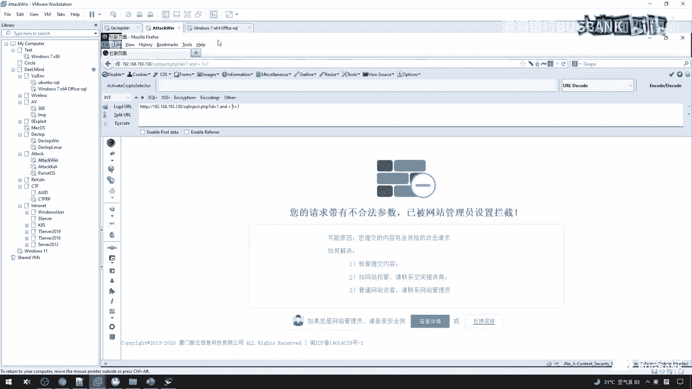

然后抓个包就，随便搞一个都行。呃，不要随便搞，我们在这里按前面随便加个东西，一会儿我们这个随便加什么的。因为我们知道一会儿我们要用那个in出的那个代替符号，把这个东西代替掉。那这个大家都知道。

这个不知道呃，那就不应该了，对吧？

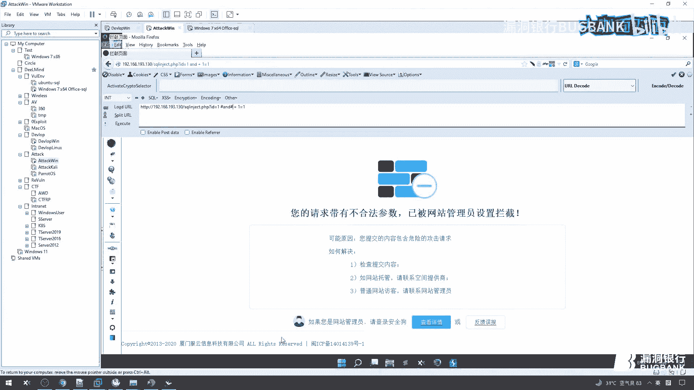

啊，我们执行起来。好，执行起来之后呢，我们这个把它发送到这个introderintror之后呢，然后我们的这个这个这个。配呃， payload的这里啊，我们把这个clear掉。

我们要在这个呃随便加一个and。一等于1。好吧，我们这里的这个符号，我们用这个添加这个这这这种这种符号，它会进这个字典去不做匹配。这个我以前讲过很多次了，这个不讲了，然后你可以用这个。嗯。

至于说这几个是什么意思啊，讲过啊以经讲过，然后我们去选我们的字典，好吧，我们选我们字典是run filerun filerun哪个呢？也就是这个这个是什么呢？也就是我们刚才生成的那个，因为我没有给他跑。

我已经生成了，对吧？所以说直接用就可以了，我已经把它移进来了，然后你就然后我们选中我们的字典。

然后字典在这个desk top的桌面上，然后我们选中它，然后open它，然后我们就可以点这个startan啊。tan之后呢，这就因为因为什么，因为它就没有多少个，对不对？因为它就我看看它有几个，对吧？

因为它好像就就这么些，那肯定很快嘛？对计算机一瞬间就完事，所以它完了完了之后，很多人说啊这个怎么去排序呢？你是根据状态排呢，还是根据arrow版排这个你要见机形式，对吧？

这个明显一看就是根据lessonless排就长度，对吧？因为它这个长度明显就不一样，对不对？

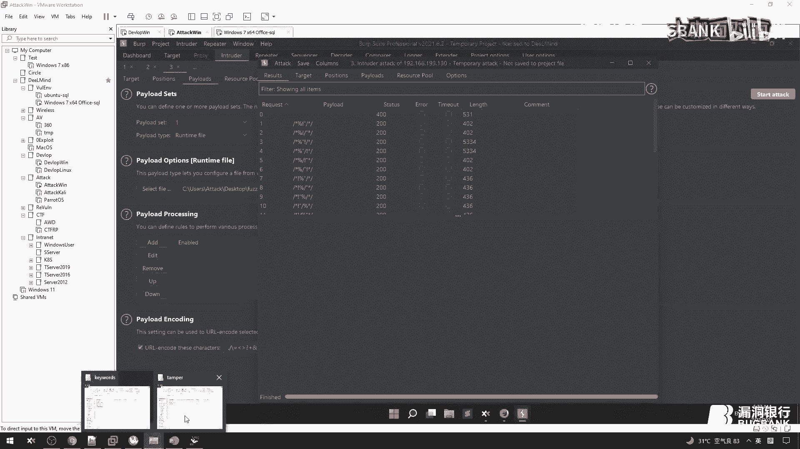

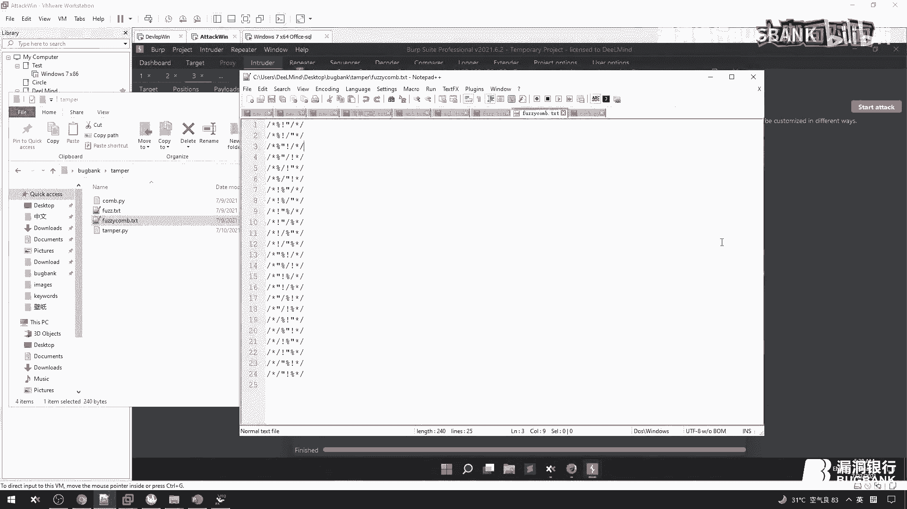

好吧，那么放大点，首先我们看一下长一点的，为什么看长一点的？长的人先看长点，对吧？我们看一下他这这是request，这是响应，我们看它响应是什么，响应我们个reader一下。

就是渲染出它这个响应的页面来，就相当于我们在浏览器里面直接看到它的响应效果一样。稍等一下，它正在loading。呃，这个loading的话，它显显显示出来应该是一个safe dog的一个拦截页面。

不知道它为什么这么慢。好，那就先不管它了吧。哎，我们先往下滑一划。看哎呀呀呀。我们就往下缓一缓，怎么这么卡呢？看到没？它这里有s dog的官网，这个就是它的fe dog的一个界面，对吧？这个他你看到没？

所以说这个这个长度这么多的都是fe dog的对吧？这个就不看了，这么长度这么多的都是。那我们要看什么，看一些短一点的有长就有短对吧？那这个短的这个什么都没有输入，那明显不是我们看看其他的对不？

看看这个看这个随便看一个这个看这个436的或者说看这个420的随便看看然后看这个响应他这个响应他说什么，他说这个不正确的这个这大家这个这叫什么myci语法里面大家一定都知道这些东西啊。

他说什么不正确的这个这什么行亚列对吧？你先那你怎么去测试它到底正不正确的怎么去测试它到底正不正确的你可以拷贝一下它的UR过去试一试就行了。你拷贝下R比如说我们可以拷贝这个。好，靠边这一个。呃。

我们去解个码嘛，我们解个码去哎。我们我们直接把这个东西拷贝过去，就是这个。因为我用靶场的原因啊，所以我把这个都打印出来了。这个打印出来就是我们的正儿八经语句，也就是在这里可以执行的。好吧。

我们来执行一下，看一下。

他说什么有语法错误，说明什么呢？说明这个绕过语句好像并不行，对吧？因为它在数据库里面出错了，你即便他绕过也有什么用的，没有用，对不对？那我们再看一看436的不行，我们看402的402的好像仿佛行。

因为它已经返回出页面来了，对不对？我们拷虑过去试一试。

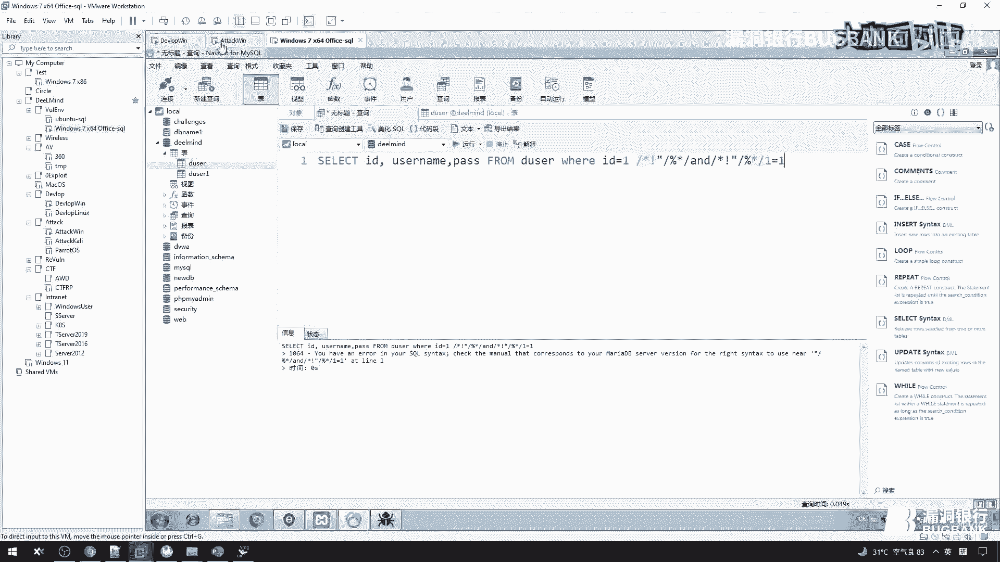

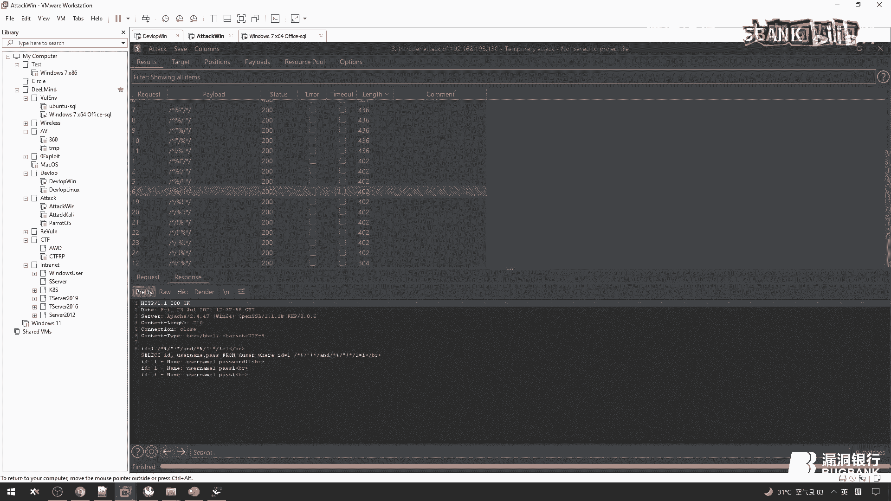

呃，我们执行一下，哎，好像可以啊，对不对？好，哎，好像可以，对不对？说明说什么呢？这条语句就可以绕过它的sfe dog，也就是and这个语句就可以绕过它safe dog。呃，这个看一下不看了。

这个不看了，这个不看了啊，呃这个先不看了，我先说也就是说这个语句就可以绕过它sfe dog，为什么呢？为什么呢？大家讲一下，再讲一下为什么，比如说我们输入。

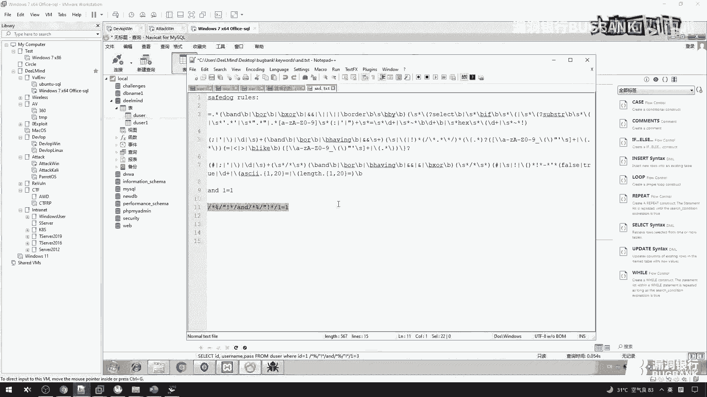

呃。我们先小化掉它吧。比如这边的话protex我们关掉它，然后我们打开我们的这个f f，然后我们输入我们的UR来输入我们的这个and然回车哎，看到没？它的确可以绕我。因为我这边安全格式跑。

我们下个断点看一看，把我们刚才的断点呃起来。

呃。Okay。好，把它断连起来了之后，我们就刷新一下，呃，把它漏了下来。好，你看这个这个这个软件就不知道什么，因刚才还不考，现在又行了，对不对？选学问题看到没有？我们进入正儿八经的这个，哎。

这就是我们刚才的这个语句，但是被他的那个filter那个东西给替换掉了，看到没有？我们copy一下，copy出来。拷贝出来，然后看到没？它是这样子的。哎。我我给大家讲一讲。

也就是说啊我们输入的我们输入的是这些，但是进入它的这个正儿八经，判断你有没有srcle住那个函数之前，它是传入了这么个东西。那这么个东西呃这么个东西对吧？这么个东西，它的正则表达是匹配不到。

所以他才不会拦你。那为什么这么个东西可以在数据库里面执行呢？不是这么个东西，也就是它过滤后的就是它过滤后，这是它过滤后的它的那个filter过滤后的是这个。但是它正儿八经发送到数据库。

也就是发送到后端语言的还是原本的东西，这也是很合理的。凭什么你过滤着，你把你过滤的东西能你也不知道过滤成什么样，你就发给后端的服务器不行，他要把原来的东西再发给后端的服务器。

所以说后端才可以执行这个语句。也就是说我们输入的是这个他把呃 dog把这个过滤成了，把这个语句过滤成了这么个样子。对吧然后经过他的这个判别函判别函数发现嗯。嗯，不能匹配到。

然后又把原本的东西发回给我们的这个阿帕奇服务器。然后就就相当于我们数据库里面直接可以执行一样，它是这么个东西。所以说他才不会拦你对吧？所以说他不会拦你。所以说有了这个问这么一个东西啊，你不要害怕。

你分析分析他发现就网上说的或者说自己所有的或者自己尝试的黑盒呃，怎么尝尝试的，他他是怎么拦你的，他这个过程是怎么样，你都得分析清楚，你分析清楚，我发现啊。他是这样拦我的，或者他这样拦不了我。好。

你以后遇到问题可能不止于此。但是啊你都要分析他能拦我是为什么拦了我了，他不能拦我是哪里拦不了我，你要分析清楚。如果你啥都分析不清楚的话，你就说啊他这样子，他那样子，那你说你们老大说凭什么这样子。

你又没分析清楚，这样不行的，这不叫一个解决问题的一个彻底，这不叫彻底解决啊。所以我们以后按照这样的思路，对吧？你就知道他凭什么拦你凭什么防你凭什么拦不了你凭什么防不了你，对不对？那这是一个案啊。

这个案大家可能觉得比较简单啊，那我们看看其他的。

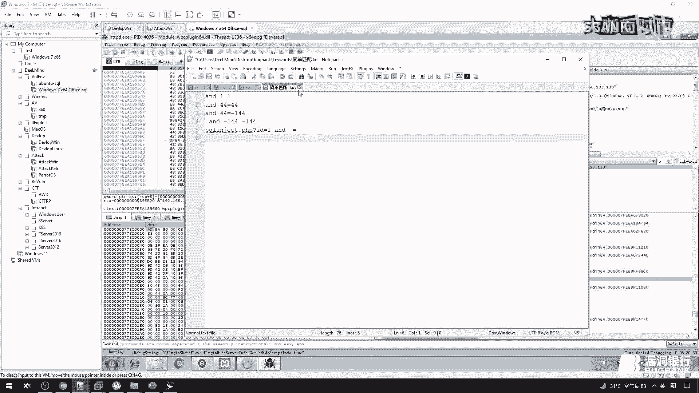

看看其他的。呃，看看还有啥呢？呃，还有啥，其实剩下东西都一样，没有什么区别。呃，我们看看，比如说大家想要的keyword的关键字，比如and，比如说or。

order呢order呢就是order是这条语句去匹配的，也就是拦截那你这条语句。

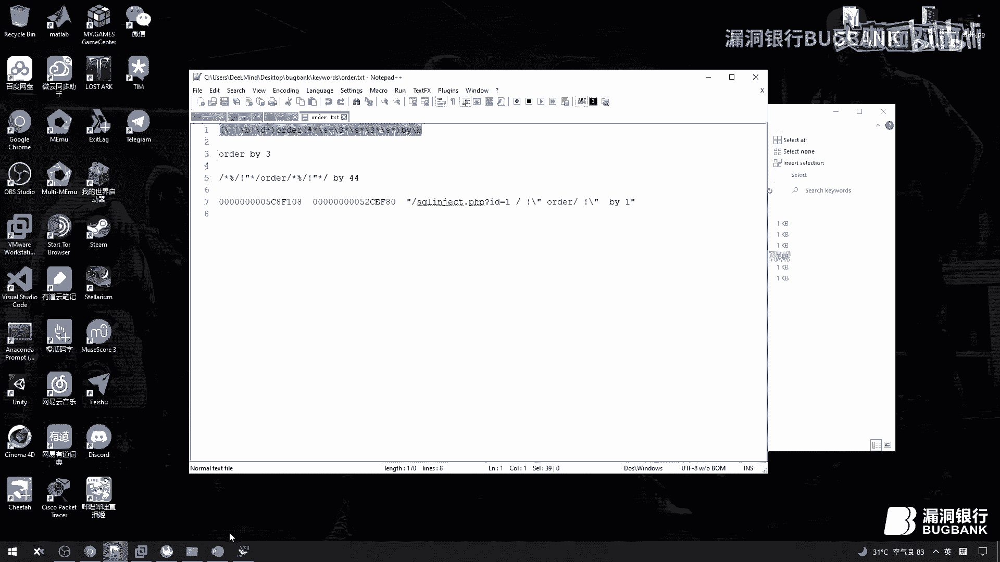

啊，比如说 orderder back。对。你看outder by他就拦你了啊，这个时候怎么办呢？哎，他拦你了，他是怎么拦你的，这样拦你的，你中间加一些什么东西，乱七八糟，你所谓的内帘注释呀。

凭什么能绕过呢？绕过绕不过，不知道。对吧但是你要知道它的流程，它一定它的流程是这样子，先把这个URR过滤一遍，怎么过滤呢？啊，刚才说了，就是基于这些规则去过滤的对吧？啊，不是这些规则去过滤的。啊。

就这些规则去过滤的那这些规则我没有列完，就列了一些好，根据这些过过滤完之后呢。然后呢，然后他再进入它的这个circle注的一些函数再去判断。那所以说这个东西啊。呃，那这个东西的绕过思路是什么呢？对不对？

你可以沿用这样的方式，刚才我的这个发子的这样的方式，对吧？你也可以去发子。发完之后，你就会发现呃，我们看看啊，比如说我们这里。不个。Order by3。哎呀，这边断下了，对吧？因为我这个断点啊。

我们先把断点取消掉啊。好，马上你取交了。好，他拦掉你了，对不对？alder by3来order by它这个东西肯定拦，你这很正常，对吧？那我们这就是我fa子后的那些语句啊。

那和刚才大家见到的刚才那个fa的过程是一样样的和那and是一样一样的的。至于说为什么要加到aler或按 by这里呢，那你我是都加了的，我发现加到order这来管用，对不对？那你就加了呗，然后你执行哎。

发现可以了哎哎44个没有44个字段怎么办？有没有一个呢？啊，字段有没有两个呢？字段有没有三个呢？字段有没有4个呢？还，没有4个，那三个字段加下来就可以用你们常见的union注入了，对不对？好吧。

这就是alder by，这个也可以绕过，对不对？好，这就是它的alor就一句啊，就这么个拦截。那这个拦截。

对吧然后我们看所以alder的绕播手法和这个and是一样样的。

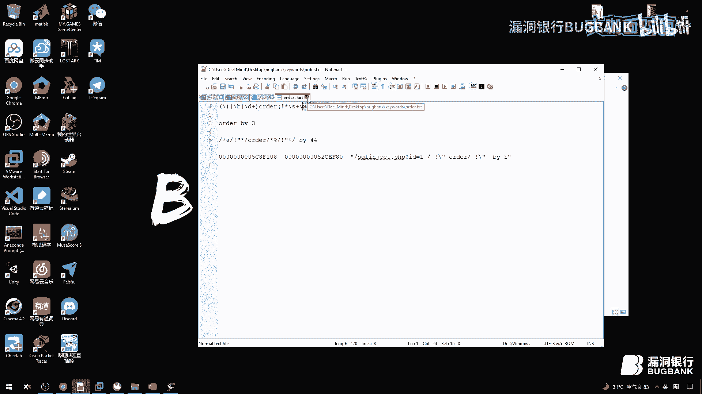

对吧那alder完了之后，大家都想用union好，都想去un念那优ion我能说也是一样一样的好也是一样，你就按照我那个思路就也是可以的，只不过它可能好像也没有什么区别，对吧？

这是只不过是拦截的这个语法能不能长一点，对吧？假设如果你只懂只懂这个看表达式，其实发现你是不是也不太行，对吧？如果你不会发子硬看的话，当然也可以硬看出来，比如说你这里输入什么。

它或者加上这个过滤的里面这些过滤符，你去判断，当然这个东西也是可以，但是这个东西非要非常好脑子，对吧？因为我们有更简单的这个白盒的发子，我们只要输入一些，它可能会过滤掉你的关键字的。

我们用这些发子这些关键字去发子它就一定没有问题，对吧？因为这是我能确定的，然后去发的，然后你还是这样子，对吧？还是这样，还按照刚才的思路。所以说发现没有很多都是一样的东西啊。

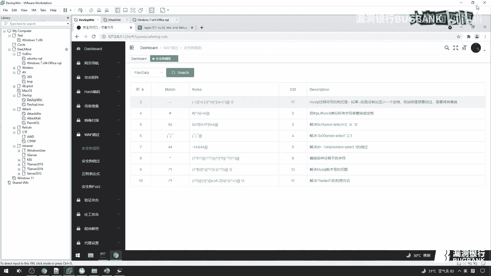

好，那我们看一下。看一下，比如说我们我们的这个呃slect呃ex呃，这个这个这个东西这个这个以前那个手工助大家需要用不完了，你可以用用也行，不用也行都行嘛。

比如说我们执行一下这个你看没到它这个东西肯定会拦你，为什么拦掉你了呢？

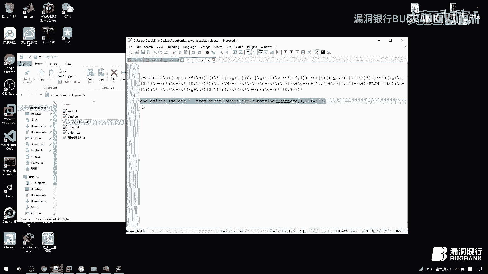

为什么拦教你？我们看看它是用的这这个拦截规则。他这个规则没有蓝嘛，呃这个。啊，他是没有开启这个大小写匹配啊。哎，也就是说为什么大小写，你们为什么去找大小写可以绕过？就是因为正则匹配。

它有支持有大小写有敏感的，有不敏感的，我们改成大小写不敏感。你的大小写绕过就全部都没有用了。所以说你凭什么天天就是大小写呢？也就是凭什么偏向注释呢？这些这个凭什么绕过，你都不知道，那我现在告诉你。

你知道了吗？他就是凭着这些，它有一个filter，它有一个roose，对吧？看到没？他会拦你。那这个呃这个很很很庆幸的是啊，它这个拦截规则呢，它只有一条啊，拦这个side exist，好像只有一条。

好像也有两三条。但是不要紧，因为它这里只有这条拦掉你好吧，最终那些规则在哪里？我刚才都给你弹幕出来，好吧，然后你要怎么过它呢，那你这个东西就是看的表达式对吧？因为我看过表达式，那你就就可以绕过了。

就这么简单，好吧。就这么简单就可以绕过了。啊，那你去看一下啊，看到没有？可以绕过了。那那这至于这些是什么东西，这你都不懂的话，这就是最基础的这些绕过的呃，不是这些注入的手法，你看到没？就它就不拦你了。

而且这些东西它是正儿八经可以在数据库里面执行的。好，我们去看一下。啊，它是可以执行的。你不能说我写个绕过语句数据库里面执行不了，那是不行的，对不吧？比如说117是可以的，113就肯定是false了。

对不对？这就相当于一个这个什么。呃，就只是相当于按一等于1一样，对不对？所以说exist select这种东西也可以绕过，对不对？而且方法方法更简单，对不对？更简单，它的那个过滤都没有过滤到那些东西。

对吧？比如说我们今天看一个比较呃好像好像还需要大家去思考一点的东西。比如这个find这个这个盲助啊，比如说我们通常的盲助就是呃。

从上的马就是什么来着？诶。我也记不得了，让俩拷贝一个吧。好，我们把我们的这个这个这个这个这个这什么鬼东西啊，把这些东西就过滤一下。

那这些东西呢是我从这个circle circlercle map里面抠出来的呃，对。哎。我们看一下那个sleep去哪了？哎呀，这个东西看的我都眼花，所以说。所以说我们再考的一个，怕一会儿丢掉啊。

把这个丢掉。呃，这个新号这个东西不要了。哎呦，我们把这个东西去掉了。这个这个这就我以前fa子过的对吧？fa子过的，但是fa子后发现不行。至于不行的原因的话，再大家找一找啊，这个也是非常简单的啊。

也是非常简单的啊，少了个S，对吧？然后我们去这里好。

好，这就是我们的这个语句。呃，我们执行一下。先去执行一下事实行不行？他说什么do mind这个什么鬼啊。少了个P是不是sleep没有打全看他这里正在查询查询4秒，对吧？为什么是4秒呢？

因为我们这里写的是4秒，这里写4秒，它就会反，这就是所谓的盲住，对不对？好，这个B是什么东西？如果连这个你都看不懂的话，你可以跟着我的课程慢慢看啊。因为我现在就要讲这个s。好吧，好。

那这个是可以过可可以可以正确的数据库里面，直让我们试一下这个这个里面好。and哎，拦了拦了你了啊，那这时候怎么办呢？拦掉你了，这个我们要怎么办呢？我们看一看它是怎么拦我们的。呃。呃。

首先呃我们看一下它的是哪条规则栏的那哪条规则栏呢，因为我已经看到它是这条我已经看过了，它是这条规则栏，我的呃，这条规则栏我的也就是这里，也就是把我们的这个这个语句拷贝过来。这个哎，为什么没有命中呢？

哎啊这个无武双大雅，他他一定是有这样子的一个一个东西才会命中的对吧？他会命中掉你。因为为什么呢？因为这就是人家自己设计的，他可能设计的不好，也可能设计的好，这就是他设计的。他就设计这么个样。

你能怎么办呢？对吧？所以你只要这样做就行了。好吧，那杨导他命中了。哎，我这个少了个P，是不是好吧？呃，哎他命中了，所以他会拦掉你。那怎么绕的？哎，怎么绕呢？就还是刚才我的方法。

fasfa fast这个select select。啊，哎，那我们看一下。我们去试一试。啊，这个fa子的话就是刚才我的那个字典，你为什么可以呢？因为它的filter对吧？不是瞎fa子的，不是瞎fas的。

好吧，不是随便找个东西去fa子。呃，他你看到他。这是怎么回事？我们去看看执行执行是不是我们的语句打错了，因为我们一定要确定我们的语句是正确的，好吧。呃。我们的P拿错了，对吧？P好。

那么这边的话我们加一个P select，你看这个就这个写的太多，很容易看混。好，他拦掉你了拦掉你了。对吧他拦掉你了，那他为什么拦掉你呢？我们去看一看，对吧？我们去下个断点看一看。好，我们去这个参的时候。

我们excuse好，看难道你。然后他把你的首先把你的输入的一些语句过滤了，过滤成什么了呢？过滤成这这么个乱七八糟的东西了呃。好好，过滤成这么个东西，我们把前面这些这些东西无伤大的都去掉。

前后前后他用引号引头，所以把前后的引号去掉，它过滤成这么个东西了啊，过滤成这么个东西之后，然后它经过这条语句，也就是我们刚才的这个东西它就匹配到你了。哎，这个没有匹配到嘛，这个什么鬼呀。呃，我看一看。

这个他好像是我他好，他还有一条，它是你看这条语句，也就上面这条其实已经绕过了，但是它还有一条会去命中，也就是这一条，对吧？它会它会命中这个sleep这个函数，那这个时候来了。

那怎么绕过这个sleep的那首先这个sleep这个这个前后啊，加这个东西是没有用的，也就是掐这个我的fas符号是没有。因为我试过了，它没有用的。或者说你在因为我只试了几个符号。但你可以把这个全部都加上。

或者说我已有的全部的这个符号，match符号全部都加上去fa一下可能也就行了。但是我这里想说的是，可能不行，不行的情况，你要怎么解决的那你要怎么办呢？为什么让大家去了解这个政策呢？

对吧是长期政则的那这个时候的用处就来了，对吧？那他这个东西哎我们。看到没？他这个就是正则，它匹配什么呢？就sleep后面要有0到4个，它就会命中。那么你这里多加几个1234哎，0到4个还会命，哎。

5个他就命不中了，那显然的话，sleep后面是不能加这些字符的，那么不能加空格呢？12345哎，可以了，能加空格，到底加了空格能不能执行的，那你也不知道我也不知道，大家假设都不知道的情况下，对不对？

我们去试一试啊，我们去试一试。呃，and这个我们这个sep，那这个语句能执行，是不是好，能执行执行4秒，好像有点长是吧？不过4秒钟来说挺短的是吧，挺短。234567把我们随便加多点，哎，发现它还能执行。

对不对的，还能执行。好，那就就那就那你要怎么怎么绕呢？sleep这里哎不要急极给他加多点。哎，你看忙住忙住来了，我对对方没有加断点啊，我断点，你看到忙住就来了，他就可以绕过了，对不对？

这就是你为什么绕不过我为什么绕过，或者说仅仅是 dog或者其他东西一样，为什么呢？并不是说你的技术菜或者什么当然可能是技术新手嘛很正常。那你新手直接就和老手比，那是不可能的你没有这样的思路。

你首先都不知道你要你首先遇到问题，你就不知道去分析你就不知道去分析这个页面是怎么来的那你就那你天天查一些资料那没有意义。好吧，你要去分析它是怎么。即便说你不会这样的逆向分析的知识。

但是你也要知道我哪里知识点出了问题，我是不会这里，那我学会这里分析了不就行了吗？好吧，那这些知识是什么是一定可以学会的，也就是说你遇到了这个问题，有了思路你把那些技术点那面技术点都是可以学会的。

没有学不会的东西好吧，大到是什么质简的。如果有人告诉你这个东西很烦那，他一定是在骗你大到。质检的好了。都是可以学会的，学会之后你就可以分析了。分析完之后，对吧？下个断点。

然后就可以可以知道它的规则是哪儿，知道它的filter是哪儿。知道你看遇到正则，我们就看的正则，他这里还写个4个。那我们他这里假设写写个什么呃写个什么。100那你这这显然就不行了，对吧？你加多少。

你必须加101个或者100之后的才行。那人家比如说我今天发了个视频，人家明天改了这个东西，你就绕不过了嘛。好吧，你就绕不过了。但一定不是的啊，一定不是我只能说我现在给你分析的是他很常规的。

就是我们怎么去绕他就面对的他的规则硬和他去碰对吧？硬和他去碰那我们有没有取巧的方式，去弯弯绕，就是我不会不和你正面接触，我们可以想其他办法去逼近他也是有的，也是有的。那我这里就先不和大家说啊。

先给大家讲讲怎么样和他硬刻对吧？怎么样硬刻，也就是他的规则我能找到他的filter，我能找到他的这个怎么去匹配，我知道因为他这里有写好？

然后我就和他写个脚本和他硬刻这磕肯定是磕出来的肯定因为写这些规则的也是人嘛。那他为什么就写4个呢？这个明显是很愚蠢的，对吧？愚蠢的。比如说他可以写个什么。写个什么新啊。

那写个心是不是就你你这个东西就过滤不了了，这就是什么找漏洞，补漏洞，对吧？就说补了这个bug，你这其实怎么也不会去绕过了，怎么也绕过。但是有没有方法呢？一定是有的，一定是有的。

那为我我因为我在给你们做课程间，我就发下来很多都是可以做到的，好吧。但是这些东西都不要紧啊，要紧的是什么？你要学会分析的思路啊，你要学会分析的思路啊。那我们看一下我们的实战的话基本上呃差不多了。

我给大家简单的总结一下。呃，总结一下，也就是安全狗这个东西啊呃它是有一个什么？它是有个规则库，就是我们今天给大看看啊看看。

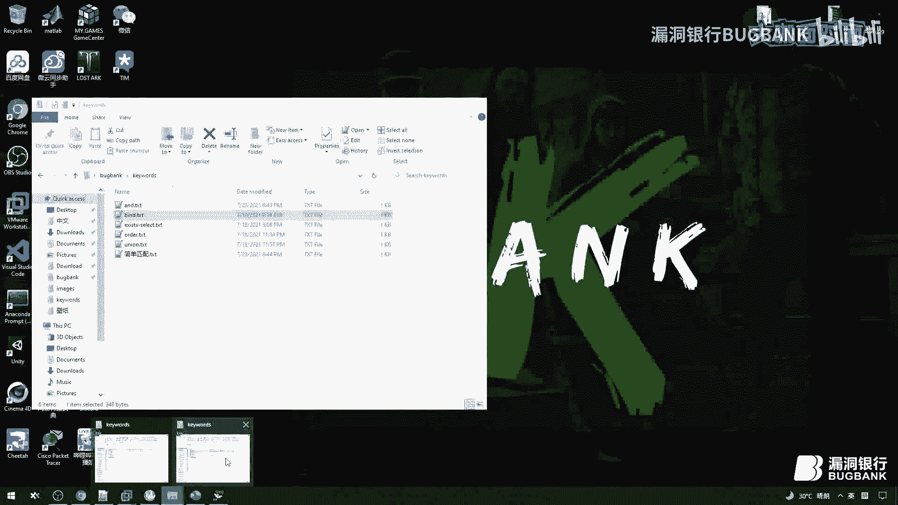

嗯，有一个这个规则库，也就是这个它这个规则库呢我们是可以解密出来的，也不难很简单。你学两天逆向就可以解会解完。解完出来的话，呃，然后就是这么个东西，然后你就可以看着它的表达式去绕它。我们看到哪个呢？

我们看的这个sleep这个函数。他这个东西你就写的是有问题，对不对？希望你们能补一补啊，呃，让大家增增加一些大家的难度，不然的话一分析就会了，也不太好，对不对？呃，好，哎这个点是有问题的。

我们可以分析出来那这样的函数有多少呢？可能很多都是有问题的，对不对呢？好，所以说第一步是什么？你首先知道它的规则也就是知己知彼的第二步嘛，我们已经知了几了，那我们要知彼呢，对吧？

要第二步就是说要知道它是怎么去拦我们的好。这些栏文的规则我们都有了，但是它里面可能也有叉S啊，比如说它一些有什么防你看有防这个W3AF这些扫描器，它都有，对不对？好，我们知道他拦我们了。

知道这些规则之后，我们就再分析分析的过程中发现哎呦它这个UIL好像是不太正常的。我们输入的是这么个东西，经过它有个过滤过滤成这么个破玩已了，哎，那我们知道再分析啊，它有个filter函数。

那这个他会把这些东西过滤。当然我只是列出这不止这个些，但是这些就对你来说很够用了，好吧，很够用，它会过滤之后呢，过滤的东西过滤成这么个破样子。然后导致它自己都识别不了了。

所以说这就是为什么我这里可以绕过为什么大家可以绕过的原因，并不是说你加个注释就可以啊，加个内联就可以啊，加个内联的执行就可以啊，对不对？不是这样子，而是它都是有原因的。因为它过滤掉一些东西。

它保留了那些东西，经过它的这个注注入的这些函数之后，它的这个正策表达式判断不出来了，所以他你绕过了，那如果他判断出来，那你就绕过他就弹那那个界面好吧，也就是说哎这就是为什么可以绕的过或绕。过的原因啊。

所以还是哪句话，遇到问题，你要分析问题，找到原因，然后才能解决问题。你都不找原因我，靠我就瞎试黑盒啊，找谁的也是。啊，那那你的东西是没有太大的意义，不能说是没有意义，只不过意义没有那么太大。好吧。

因为我们要大，对不对？我们要要对吧？好，所以说我们一定要把黑的东西转成白的东西。你看这些东西符号这些符号凭什么来的，哪里干的，我为什么用这些不用其他的呢？因为我分析过了对吧？这是它的filter。

它会filter这些东西。有可能我们输的这些东西啊，有可能我们输的这些就会把它过就会被它过滤掉，或者说没有过滤掉，对吧？所以说你用这些对不对？但然它还有这些符号，对？这也不知道是干啥的，对不对？好。

所以你一定要知道它并不是说fa子并不是爆破，它并不是瞎搞的，它是有原因的，有有有思路的对吧？啊，这就是我们刚才给大家写的这个怎么去combine，这这就是排列组合这个东西就是非常简单，就是随机组合一下。

然后前后面加个注释就行了。为什么加成注释呢？因为注释不会执行呗，这个就很简单啊。哎，我们就就弄成这个东西了。好，这个temper的编写啊呃，scleb的temper我就不大大家编写了。

因为你已经分析清楚这个东西了。你如果你还再不会写temper的话，那就不应该了，好吧。呃，比如说我这里给大简单写了，你可以把这个用正策表达出，把所有的哎把所有的字符都会替换成44或者-44。

但这个可能不太呃不太精确啊，可能会把其他的替换掉。但是这是我们写ter的第一步，对吧？你要这个东西我都给你分析清楚，你要哪里去绕过fa子了，你不会写temper嘛，我想一定不会，这一定会的。

如果你不会的话，你连sclement都不会用。那你可以慢慢跟着我的课程去学习，好吧。所以说再次总结就是遇到问题，你要学会分析问题，不要害怕它，你要分析问题。人生处处是问题，你要去分析问题。

那么计算机或者网络安全只是问题诸多问题中的一个点点点点点，你连这个小问题分析比有，那么些大事，你怎么分析的对吧？遇到问题，首先知道这个问题产生的原因，比如说sft dog他怎么拦我那些原因都找到了。

有filter有rose有过滤正则过滤啊，那我们知道原因，那我们去绕他们对吧？知道原因要知己知彼。还有就是由由白到黑啊，不是由黑到白啊，我这个写错了是吧？好，我们这个呃改一下，我们一定是由黑到白的。哎。

不是由白到黑的还没写错是吧？好，说错了啊，这个不要紧，由白到为什么由白到黑呢？因为新人嘛或者是还是不还不太熟的一些呃呃人，对吧？小伙伴，他可能不太熟对这些绕过。

那么他直接面对一个向来直接面对一些困难的问题，他可能不太好解决。那么我们先从简单的开始先从简单的白合开始开始开始积累经验积累多了，你再到黑哎，是不是就好点了，对吧？

这也就是为什么大家老师就先让你做练习题，然后再去让你去考试，而是不是让你直接上去考试。因为你要先练习练习，因为从白合同去练习练习，也就是有源码到无源码，很多同学都说什么今天教教我什么代码审计啊。

和逆向测试啊，你觉得逆向，我刚才的分析代码，和你的代码审计有什么区别没有，其实没有区别。我这里是看的二进制，你看的是源码，就这么简单，没有审核学。所以说白了什么逆向，代码审，说白了就是看代码呗。

一个人看的二进制汇编，一个人带的看的是源码，所以说。😊，嗯，对吧？没有什么区别的。你要把你的思维从发散的这些细细节点集中到一个点，然后知一知百嘛，就是九九归一了，然后你才可以学到更多的东西。好吧。

然后就是举一反三，你不会举一反三。我今天讲给你讲了sfe dog，你明天就不会其他的了。比如说3600锁可能这样的方式绕不过，但是他有没有其他方式一定是有的嘛。

因为它是人写的程序就一定可能会有问题的对吧？所是你分析分析哎，就会发现问题，这就是为什么能拦到它，对吧？然后你必须你必须得呃找到问题，分析清楚，你才才能说拦了你或者没有拦，你都分析不清楚。

你说可能是这样，可能这样，这没有意义，对吧？这没有意义，好吧，我们学习一定不要这样去学。如果你做工程的话，当然是可以好吧，那我今天给大家先讲到这里吧，我是面的周转丢慢的，我们以后再见呗，好。

那我今天讲讲完了，你。嗯，好，那非常感谢州长的精彩分享。听完本期的直播内容，相信大家都学到了不少有关byfa的干货知识了吧。那话不多说，接下来就是我们的行长问答环节。

我相信大家在听讲的过程中提出了许多问题，如果大家现在仍有疑问的话，也可以在聊天区提出州长会来给大家解答疑问。那么在稍后的福利赠书环节，州长会根据聊天区的交流情况，选出一位幸运观众。

所以大家抓紧机会提问啦。我们也请州长打开一下直播间，我看州长已经打开了，然后看一下，嗯观众的聊天页面，如果弹幕比较多，可以勾选直播间右上角的只看提问来解答问题。那么州长就开始解答问题吧。

呃，行，那我就先看问题啊。他说这个规则写的比较死嘛，所以他这是我刚才说了，他是他的filter，这是他filter，就是他就是这么做的。因为人人是会出问题的制度是不会出问题的那你没有建立一个很好的制度。

那你人出了问题很正常，要写就是这么写了，所以说你就可以这样绕过，对不对呢？这是很正常的，怎么判断是独立程序或者动态，这这是你要分析的呀，对吧，这是你要分析，通常情况下，你想象阿帕奇这样的东西。

可能都会有插件，这个一猜大家就得猜到对吧？因为我可能就是猜到了，为什么我能猜到呢？就是因为我。我做了很多的白盒，以前做了很多的分析，我有这样的经验了，我猜他肯定是这样的，他他其他的方式肯定很蠢，对吧？

那你猜可能就是这样，所以他他是这样做的，就写了个插件这样子工具分享什么工具啊，如果你用ID还是干我问一下可以问下，如果用IA还是怎么ID也行的。当然也用IA了。那么你这样按照我这样动态的话也是没有问题。

你把动态也可以把它的找到，可以把它的这个规则找到，可以把它的注入点找判断它有没有函数的注入点找都是可以的I肯定是会用到。但是我现在因为电脑太卡就没有没有给你没有用，因为可能会用不因为ID给大家看的话。

大家更看的晕了，吧？呃，我觉得注释这一属低版本的玩笑，现在高版玩笑好不好吧。因为我我是在给你讲什么的，讲怎么绕过sfe dog，我并没有给你讲Cci my circler的版本。好吧。

你买circle版本，你遇到这些问题，你可以自己去分析啊，对不对？马赛克指令上一等于一呃，什么鬼？参数污染。你要分析啊，你要分析你遇到的问题，你遇到的问题啊。

并不是说呃我也不知道你说的参数污染具体是什么东西啊，你要遇到问题，要怎么分析问题的原因，对不对？就当于你弹出那个页面来了，你要分析出它的原因啊，不能说瞎分析，对不对？呃深度学习大概没有什么深与浅啊。

就是说你有问题，你你知道他的问题的原因就可以了，对吧？你要找他的原因至怎么可能说逆向需要什么这你就学会它行这是新版的安全可能是新的吧我也没有看刚看了一下更新他说是新的我道是说是新的我假设是新的什么版本并不重要。

你就用个随便版本也不重重要你分析的思路，他这个版本更新了，你就不会分析了嘛，或者版本又降过去，你就不分析了不行，你不用管他什么版本这样分析是没有问题，是没有问题最起码不会太错。

因为我都是可以做到的再讲讲这个不用话这具不会用I不会用因为动态往往比静态简单多因静态你看看的现就不讲在不用讲为太卡了，电脑下开三个虚拟机脑。还顶不住。呃，关键词过滤有select，我不是跟你说了吗？

select刚才都啊，这可能是你看之前问的对吧？看之前问的啊，就是用我刚才那些东西。呃，什么还有提问的没有了，我不知道从哪里开始啊。嗯，有的把那个工具名字，工具名字。

你说那个啥工具名字是那个circle那个那个那那个那个啥正则表达那个工具嘛，那个叫bost，那个就是一个就是一个正则表达的工具啊，就没有什么，你说什么都行，用那个用用那个bost的那个酷写的都行。呃。

什么之前你用用发子上去跑去搜的呃你发子用什么跑并没有问题。你搜 pay也没有问题。我的意思是说，发子它不是爆破，他不是瞎发的对吧？你你找的那些东西都都你也不知道是咋来的，对不对？你也不知道咋来的。

然后你你本来就不知道他怎么绕过，你本来就不知道他是怎么防的，你又不知道这些发子是咋来的，然后你就去做了些莫名其妙的发，你觉得这和赌博有什么区别，就相当于你在搞股票，那搞到最后成赌博了，没有意义了，对吧？

所以说你一定要知道原因，你用什么样的方式都可以，你可以问别人这什么来的对吧？你一定要知道原因，这样才行，好吧？你要由黑有白转黑，由黑把它变成白的，就由难把它变成简单的就就比较简单了，对吧？

发那些知识如何绕知识点如何得知呃，得知的话，我那你正则表达式都有，你可以去看，正这里还要说一个点啊。

就是它的这些过滤点啊，你看到没有and这些符号，这些符号是它的这些分割符，后面这是它的具体的具体的过滤指令啊，它的指令有很多，这里只只有这么一点点，它指令有很多，有很多没有用到的呃，怎么说呢？

具体遇到了，你再这样分析我至于为什么要用那些符号呢，我这里说过了，它match的就是那些符号，你把这些符号都用就行，你不是随便去好吧，当然你也可以我也可以说你可以硬看你可以硬看，但是硬看的话。

硬看这么多正则表达式，你可能会头晕。那我们用白合的子对吧？我们已知的这些match的这些符号，我们就可以了，对不对？这样提高我们效率硬看也是有没有问题的。但硬看就比较可比较绕脑子了呗，我是没有硬看。

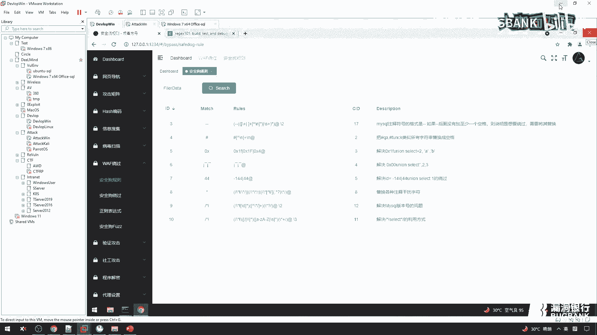

深度学习是指waft的功能，一般有什么防御思路啊？深度学习是指是指waF的功能，一般什么防御思路？呃，你说是wa夫的防御吗？呃，waft防御。

那这个就其实大家都在安全这个经常看这些别人发的这些什么绕步啊，什么一些指令啊。你就呃其前实我觉得你要不要更新这个库啊，你比如说安全狗它多久更新一次啊，这个都是比较就于说什么防御思路啊，这个就太大了。

这个太大了。我就暂时不说啊暂时不说，因为这个太多了，那个工具叫啥？哪一个工具啊，是那个正则表达式嘛，你就搜一个，不或者你发你发到我发到群里面也行。叫bost政则匹配啊。怎么快速定位到安全格的。

通过附加上结位，你可以通过导出函数去判断，你可以通过自己的经验，或者说是一些呃搜索字符串也行嘛，对吧？呃，这个就是一些这个没法说，就定位关键位，这个需要你的经验去判断一下，或者说你分析分析一下。

就相当于你的代码审计一样，你怎么判断它是有问题的。你分析分析他们，其实代码审计和逆向没有什么区别，一个区别就是我在看的是二进制，你在看的是源码，你再从源码中找问题，我再从二进制中找问题。

你再从源码中找关键位置，我再从二进制位置找关键位置，二进制代码中找关键位置。所以它的区别在哪里呢？对吧？和可能很没有什么区别。所以说哎你要知道呃你要知道这这些，所以说怎么定位它的关键位置。

这个就是我我分析了。所以我知道怎么分析呢？就相当于你你你你的代码审计一样，你需要经过这么个过程才行啊，对不对？并不是说我我上来就知道。当然说它里面有些比较简单的，比如说它导出函数都是写的明明白白的。

导出函数都是写死了的，对不对？或者它的一些里面有字符串都写死了，所以你可以分析出来。正则的话叫做这个看一看看一看正则叫啥。

。正则叫做这个bost这个这个呃这个正则playground对吧？叫这个这个哎，这我能发出去吗？

还可以哦。啊。哦哦，我发了会不会顶了，我靠顶了，是不是？没有没有没有呃，没有顶，那我在哪儿呢？啊，我看到了看到了，对于小白比较好入门的批量去尝试呃二进制很快，小白容易。然后呃是的。

你你可以只有这样的思路。呃，这个至于你用什么的方式并不重要，你要知道你解决问题的思路，对吧？你可能遇到你你在解决一个问题中会遇到很多的这个你不会的东西很正常。你学会它就行了。

你可能学它的成本可能是高一点低一点，但是你一定能学会，但是你一定要有这样思路，你没有这样的思路话，考就不行，对不对？你必须要有这样思路，至是说你学不学的会，那是一定可以学的会啊。

怎么可以那么世界上怎么会有学不会的东西呢？这也太扯了。好吧，所以说你知道你一定能学的会，你有思路，那说明你就可以绕我。

No。结果方舟论坛开放吗？呃没有开放没有开放filel是写在函数里面。filelter是它的过滤的，也是写在它的代码里面的，也是写在它代码里面的，就写就是相当于那个就是相当于它的那个呃判断它有没有绕过。

判断它有没有注入的那个函数一样，它也是写了一个函数，或者写了很多的一个代码去判去判断它这个去去通过正则，也就是通过这里的正则，通过这里的正则，然后根据它里面的这个根据它后面的这个控制码。

然后去判断它到底它到底应该对这些匹配到的这些呃这些东西做一个什么样操作，对吧？怎么样去过滤，它是这么个做的。

所以说filter也是写在它的代码里面的知识库，不知道你说的什么知识库啊，政则，比如sublime的一些编辑器所索文知识啊，是的，这你用什么都行嘛。但是可能有的有的不行，可能不行的原因是什么？

就是因为它是用的这个它是用的bo这个Z加加的这个库对吧？那么我们知道政则表达式可能也不是都是全部都通用的，对吧？它可能GS那些比如说有很多有一些是不是通用的，所以你不行，你就换一换就行，好吧。

火狐浏览器可以通用火狐浏览器不是在群里面发的嘛。match符号是wa里的函数嘛？match符号看看啊match这些符号是它的库是那个m DB里面的它也是写了一个过滤的一些库，过滤的一些库。

它也是写了一些过滤的库，所以说呃和这个和我们见到的这个这个这个这个什么。和我们见到这个这个库一样，它也是写了一个过滤的库，这个过滤的库只不过是我这个工具把它解析成这个样子。

它要匹配哪个哪个哪个这个字符串，我已经写好了，就大家就不要去再去看了，我已经写好了，对吧？所以说这就分析完了，我已经知道他是在过滤哪个字符了就行了。

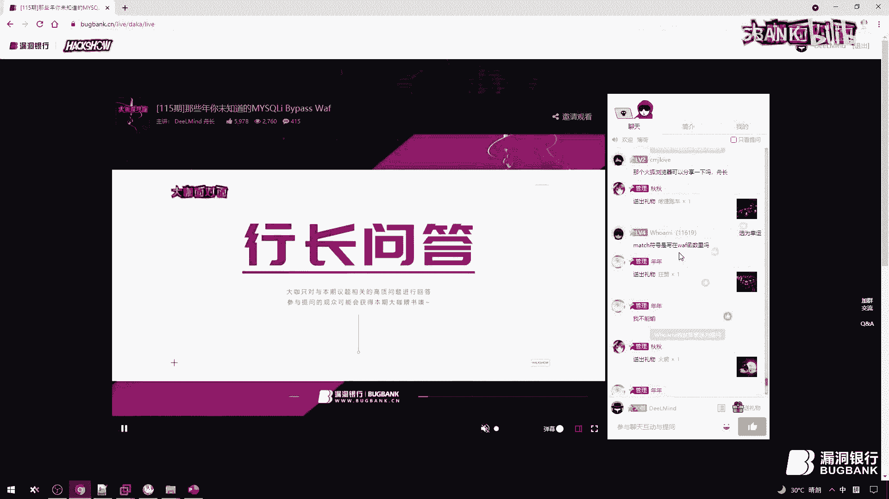

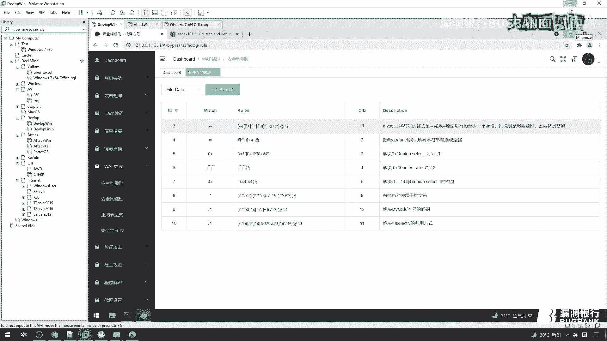

呃，火锅浏览器我有分享啊，在群里面的。然后的话啊对对对，就是这个boss啊，这是我自己发的。呃，后续有没有文件上传之类的课程，后续再说吧，后续也不确定啊，后续不确定。好了，这就是分析这个东西啊。

你可能说是啊靠我分析个问，我分析这个东西里面不会一些知识点没有问题。但是你一定要知道分析的思路是什么，你不能说遇到个问题，我就在ge up随便搜搜点东西，我也不知道他是怎么拦我的，我也不知道它是怎么。

我也不知道这个你搜索这些东西是什么，然后我就去做了一些莫名其妙的操作，你得到的结果一定是模糊的呀。所如果说侥幸你绕过去了，那这个对你的学习有帮助吗？可能帮助性很少嘛？不能说没有，那就是很少了，对吧？哎。

所以说就是这样，你们看还有问题吗？啊，大家没有问题了是吧？好，大家还有什么问题想要问州长的吗？那嗯那暂时没有了，我看今天晚上提问情况也差不多了，那非常感谢我们州长的耐心解答。时间有限。

大家如果后续还有问题的话，可以到我们的技术设计群里继续交流。那么接下来就是今晚的福利放送环节啊。州长亲自挑选的书籍逆向工程核心原理即将要送出，然后州长可以谈谈为什么想要赠送给大家这本书呀。呃。

跟大家说一说啊，为什么这本书呢？因为呃因为这个逆向和渗透这方面可能我侥幸都会一点，对吧？呃，所以说我觉得啊理解一个东西要往根儿上去理解，对吧？你往根上去理解。哎，这样你才可能把它整个的本质了解清楚。

但是如果你不想这么做，也没有问题，也没有问题，我只是想说你想的话，我有这么个书给你看看，对吧？然后就是为什么他为什么还要前提要说一点，不要去拿这个逆向工程师和这个渗透测试工具做比较。

他们俩不是一个行业没有必法没有办法去比较，相当于拿一个厨师和和一个开呃司机去比较这个有什么可比性，没有可比性啊，他俩不是一个行业的，对不对？那比如说一个人他又会厨师，他又会开车，那这个东西对吧？

他是可以，但是他俩没有什么可比性，你不要去比啊。所以说你不要去这样比较。但是说如果你是想往根里面去跑一跑的话，你可以去看看这本书，为什。因为逆向它这个东西，比如说你这个PGP的代码。

它凭什么可以那个PP解析器，凭什么可以解析PP代码，这些都是有原因的对吧？都是有原因的，都是可以找到根的对吧？都是可以找到根的。所以说呃你想往往根上去刨跑到人家的组坟上面去，你就可以去看看之类的书。

如果你不想哎就想做好渗透这一块的一个本职工作当然也没有问题，非常好的非常好的，你不要跑根就就就想做这些东西也是没有问题的，也是没有问题的。这样对你来说也没有什么。比如说他们写这个GS的写前端代码。

他们也可以不用考虑不用考虑这个这叫什么这个浏览器是怎么解析它的，或者说他底下浏览器底层怎么实现，他也不用考虑吧，他只要做好他本职工作性。如果你你仅仅想在渗透可以做的话。

那你也没有必要去考虑这些逆向的东西。如果你想从根上去了解了解他到底是怎么实现的。你可以去看看好吧，这就是我为什么觉得因为我看了很多书，觉得这本书还不错，以给大家我也没有看很多书啊。

但是我觉得这本书真的不错。你就推荐嘛？对对对，挺好的那那好，那究竟这份幸运的礼物要落到哪位观众的头上呢？有请我们的州长来选出幸运观众，你可以在想要送赠书的观众ID边上点击设为幸运。

然后给我报一下他的昵称，然后我们后台的运营小姐姐也帮忙记录一下，大家就开始混入其中，那那我我也混入其中随机一点嘛，随机一点嘛，世界上没有没有没有规律的事情，只不过是你我不清楚而已。好吧。

所以我的随机看似我是随机，其实可能还真不是随机。那至于说谁知道最后的规律，那我好吧，那我就不知道了好吧，那我就随机一点，不要选fancy吗？不能选管理员，选管理员太过分了。那我就那我就闭上眼睛。

这样随便拉拉到的第一个行不行？的可以吗？看似是很随机啊，其实好像真的不太随机。至于说谁能找到这后面的规律啊，就交给你，或者我以后找找或者大家找找，你要知道世界上没有随机的事情。好吧，那我们开始哦，别了。

幸运的轮盘滚起来，这谁这谁。😊，是你你你停了吗？停了停了。呃，你说的第一个是那个什么风是不是？对对对？峨眉峰是吧？对对对，这随机的。好的，好。

那我们恭喜这位直播间ID叫峨眉峰的小伙伴即将获得这一本逆向工程核心原理，需要你根据直播间的获奖提示在相应的区域留下正确的收获信息，或者在直播后私聊我们兑奖，我们会尽快把书给你寄出，希望你耐心等待。

那到这里今晚的直播就要结束啦。州长还有没有还有没有什么想跟大家说的呀。嗯，希望大家能哎呃就是搞安全吗，不要去吹太多的牛逼去慢慢的学，就什么都可以学得会，这就是对大家的也尤其是新人啊最终的忠告了啊。

最终的忠告。呃，这忠告非常的诚恳啊。对对对。好的，那再次感谢州长的用心准备和精彩的演讲。希望本期知识内容大家都能学有所得，有所启发。如果想回顾本期直播，我们将在下周五的时间发布录屏。

尽请关注官网的更新或者群里的录屏更新通知。那今后大家也可以多多关注州长，还有他的团队即特方舟。最后感谢所有观众伙伴们的守候，还有对咖面的支持和喜爱。如果你也想像大咖一样分享，欢迎找我报名。大咖面对面。

是一个展示白毛风采和传播技术的舞台。不具年龄不畏资利，只要你有才花敢分享，我们都欢迎如果想进行交流的话，可以在页面的底部找到群号。本直播间地址固定，大家可以收藏到浏览器。那么今晚的直播到这里就要结束啦。

感谢小伙伴们的积极参与。大咖面对面。周五8点见我们下。

下次再约吧。