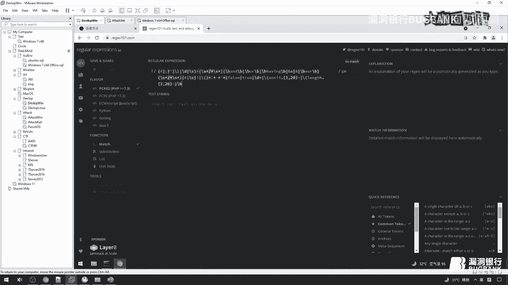

# 课程P1：MySQLi Bypass WAF 实战分析教程 🛡️➡️💻


## 概述


在本节课中，我们将学习如何分析并绕过一款常见的Web应用防火墙（WAF）——安全狗（Safe Dog）对MySQL注入（SQLi）的拦截。课程将从理解“绕过”（Bypass）的概念开始，逐步深入到分析WAF的拦截原理，并通过实战演示如何找到并利用其规则库的弱点，最终实现有效绕过。我们的核心目标是掌握“遇到问题 -> 分析问题 -> 解决问题”的系统性思路，而非简单地记忆几个“绕过技巧”。

---

## 什么是Bypass？🤔

在开始之前，我们首先要明确“Bypass”的含义。简而言之，Bypass就是“绕过”。但关键在于，你要绕过的是什么？

上一节我们介绍了Bypass的基本概念，本节中我们来看看具体要绕过的目标。通常，你需要绕过的可能是：
*   **语言层面的拦截**：例如PHP的PDO预处理机制。
*   **框架层面的过滤**：例如某些Web框架自带的过滤函数。
*   **客户端/服务器软件**：例如安装在服务器上的WAF软件（如安全狗、云锁、360等）。


我们今天聚焦于最后一种：**绕过基于MySQL数据库的、由WAF软件（安全狗）实施的SQL注入拦截**。明确目标至关重要，很多人在提问时甚至不清楚自己要绕过的是什么。


---


## Bypass的现状与常见误区 🚫

许多人在进行SQL注入测试时，习惯使用以下“黑盒盲猜”式的方法：

1.  输入 `id=1 and 1=1`。
2.  看到WAF拦截页面。
3.  尝试搜索“安全狗绕过技巧”，复制一些如“注释绕过”、“大小写绕过”、“内联注释”的Payload去尝试。
4.  运气好可能绕过，运气不好则放弃。





这种方法存在很大问题：
*   **不知其所以然**：你不知道为什么这个Payload能（或不能）绕过。成功是侥幸，失败是必然。
*   **无法举一反三**：换一个WAF（如云锁）或同一WAF的不同版本，之前的“技巧”可能全部失效。
*   **学习效率低下**：这并非一种有效的学习方式，你只是在机械地试错，没有建立真正的知识体系。


**核心问题在于：你面对的是一个“黑盒”，对其内部机制一无所知。** 我们的学习思路应该是：**将黑盒转化为白盒**。即，通过分析，尽可能地去了解WAF内部的拦截规则和运行逻辑，从而进行有针对性的绕过。


---

## 如何学习与分析：知己知彼 🎯


要将黑盒转化为白盒，我们需要做到“知己知彼”。

### 知己：夯实自身基础

在尝试绕过之前，你必须熟悉以下知识：
1.  **正则表达式**：因为许多WAF（包括安全狗）的核心拦截引擎是基于正则表达式匹配的。如果你看不懂正则规则，就无法理解它如何拦截你。
    *   **示例规则**：`/\band\b.*?\b\d+\s*=\s*\d+/i` 这个正则可能会匹配 `and 1=1`。
2.  **SQL语法，尤其是偏门语法**：WAF的规则是人编写的，编写者的知识可能存在盲区。如果你掌握的偏门SQL语法比规则编写者更多，就可能找到绕过点。
3.  **软件底层原理（可选但强力）**：了解WAF作为二进制程序是如何嵌入到Web服务器（如Apache）中工作的。这能帮助你进行动态调试分析。


**注意**：学习逆向分析或底层原理，并非意味着“逆向比Web渗透更强”。这就像厨师和司机比较谁更强一样没有意义。我们学习这些，是为了在“分析问题、解决问题”时，拥有更多、更有效的工具和思路。你需要知道“坐直升机可以去北极”，即使你现在买不起直升机，但知道了这个思路，未来就有可能实现。


### 知彼：分析WAF如何拦截


我们需要分析安全狗拦截我们的具体流程。根据分析，安全狗主要有两种拦截方式：
1.  **SQL注入规则匹配**：有一套正则表达式规则库，用于匹配疑似SQL注入的请求参数。
2.  **URL过滤**：在请求进入SQL注入检测函数之前，会先对URL进行一层过滤和清洗。


我们的目标就是搞清楚这两套机制的具体规则。


---


## 实战分析：逆向安全狗拦截逻辑 🔬


上一节我们建立了分析思路，本节中我们进入实战环节，看看如何具体操作。


### 实验环境搭建
*   **目标WAF**：安全狗（Safe Dog）最新版（运行于虚拟机）。
*   **靶场**：一个存在SQL注入漏洞的简单PHP页面（`id`参数可控）。
*   **调试工具**：x64dbg（用于动态调试Apache进程，因为安全狗以插件形式加载到Apache中）。


### 第一步：触发拦截并定位规则


1.  访问 `http://靶场地址/?id=1 and 1=1`，触发安全狗拦截。
2.  使用x64dbg附加到Apache进程，并在安全狗插件相关的函数上下断点。
3.  重新发送请求，程序会在断点处暂停。此时我们可以观察栈内存和寄存器，找到传入检测函数的参数（即我们请求的URL）。
4.  通过分析，我们定位到安全狗用于SQL注入检测的核心函数，并从中提取出**正在用于匹配的正则表达式规则**。


**关键发现**：我们找到了拦截 `and 1=1` 的规则，例如可能是：`(?i)(\b(and|or)\b\s*(\b\d+\b\s*[=<>]|\b\d+\b\s*\b\d+\b))`。使用正则测试工具验证，该规则确实能匹配 `and 1=1`。


### 第二步：分析URL过滤机制

我们发现，仅仅在正则层面绕过（例如将 `and 1=1` 写成 `and+1=1`）在实际请求中依然会被拦截。这是因为在进入SQL注入检测之前，URL已经被“过滤”了。

1.  再次调试，观察传入检测函数的字符串。我们发现 `and+1=1` 中的 `+` 号在进入检测函数前被移除了，又变回了 `and 1=1`，因此被规则命中。
2.  我们需要找到这个“过滤”逻辑。通过逆向分析安全狗的配置文件或二进制文件，我们找到了一个“过滤规则库”（filter rules）。这个库定义了哪些字符或字符串会被预先过滤或替换。
    *   **示例过滤规则**：可能会将 `+`、`/*!` 等字符过滤掉；或者将 `4444` 和 `-44-44` 这类无意义的数字串替换为空。

**核心流程总结**：
```
原始请求 (如 and+1=1)
        ↓
    URL过滤层 (Filter) -> 移除`+`号
        ↓
过滤后字符串 (如 and 1=1)
        ↓
SQL注入规则匹配 (Rule Match) -> 匹配成功，拦截！
```


### 第三步：制定绕过策略

我们的绕过策略变得清晰：**构造一个Payload，使其经过URL过滤层清洗后，变成一个无法被SQL注入规则匹配的字符串，但这个字符串在最终传递给后端数据库执行时，依然是有效的SQL语句**。

1.  **利用过滤规则**：我们已知过滤规则会处理某些特定字符。我们可以尝试在 `and` 和 `1=1` 之间插入这些会被过滤的字符组合。
2.  **Fuzz测试**：编写一个Fuzz字典，包含各种过滤字符的排列组合（如 `/**/`、`-`、数字串等），将它们插入到关键字（如 `and`）周围。
3.  **自动化测试**：使用Burp Suite的Intruder模块，载入Fuzz字典，对参数进行批量测试。
4.  **筛选结果**：根据响应包长度、状态码或内容，筛选出未被安全狗拦截（即返回正常错误页面或数据）的Payload。

**成功案例**：通过Fuzz，我们可能得到一个Payload：`id=1 and-44-44-1=1`。
*   **过滤前**：`and-44-44-1=1`
*   **过滤后**：安全狗的过滤层将 `-44-44` 移除了，剩下 `and-1=1`。
*   **规则匹配**：`and-1=1` 无法匹配之前 `and\s*1=1` 这类规则，因此绕过检测。
*   **数据库执行**：后端PHP收到的是原始字符串 `and-44-44-1=1`，经过数据库解析，`-44-44` 被当作数学运算结果为0，整个逻辑变为 `and 0-1=1` 即 `and -1=1`，这是一个有效的布尔表达式，可用于盲注判断。


### 第四步：扩展绕过其他关键字


同样的思路可以应用于其他SQL关键字：
*   **`order by`**：在 `order` 和 `by` 之间插入可被过滤的字符组合，例如 `order-44-44by`。
*   **`union select`**：在 `union` 和 `select` 之间插入字符。
*   **`select` 函数**：对于 `sleep()` 这类函数，安全狗的规则可能是 `sleep\s*\(\s*\d{1,4}\s*\)`，只匹配1到4位数字。我们可以通过添加多余空格或数字来绕过，例如 `sleep(5 )` 或 `sleep(12345)`。

---


## 总结与核心思路 🧠


本节课中，我们一起学习了如何系统性地分析并绕过WAF对SQL注入的防护。


1.  **明确目标**：知道你要绕过的是什么（特定WAF，特定数据库）。
2.  **转变思路**：拒绝黑盒盲猜，坚持将黑盒问题转化为白盒分析。
3.  **知己知彼**：
    *   **知己**：掌握正则表达式、SQL语法等基础知识。
    *   **知彼**：通过动态调试、逆向分析等手段，弄清WAF的两层拦截机制：**URL过滤层**和**SQL规则匹配层**。
4.  **制定策略**：利用过滤层的行为，精心构造Payload，使其过滤后能逃逸规则匹配，同时保证数据库可执行。
5.  **工具化与Fuzz**：将分析得到的过滤字符集用于生成Fuzz字典，通过自动化工具批量测试，高效发现有效Payload。
6.  **举一反三**：此分析思路不仅适用于安全狗，也适用于其他WAF。关键在于理解“分析原理”而非“记忆Payload”。


**最终要义**：网络安全技术的学习，乃至任何问题的解决，都应遵循“遇到问题 -> 分析问题根本原因 -> 系统性解决问题”的路径。掌握这种思维方式，远比记住一百个“漏洞利用代码”更为重要和持久。


---

## 课后思考 💡

1.  如果安全狗更新了版本，修改了过滤规则或正则表达式，你如何快速适应并找到新的绕过方法？
2.  面对一个完全未知的WAF，你计划如何开始你的分析第一步？
3.  “由黑到白”的分析思路，是否可以应用到其他类型的漏洞挖掘和防护绕过中？例如绕过客户端输入校验、混淆恶意代码等？


希望本教程能为你打开一扇新的窗户，让你看到漏洞挖掘背后更深刻的逻辑与美感。