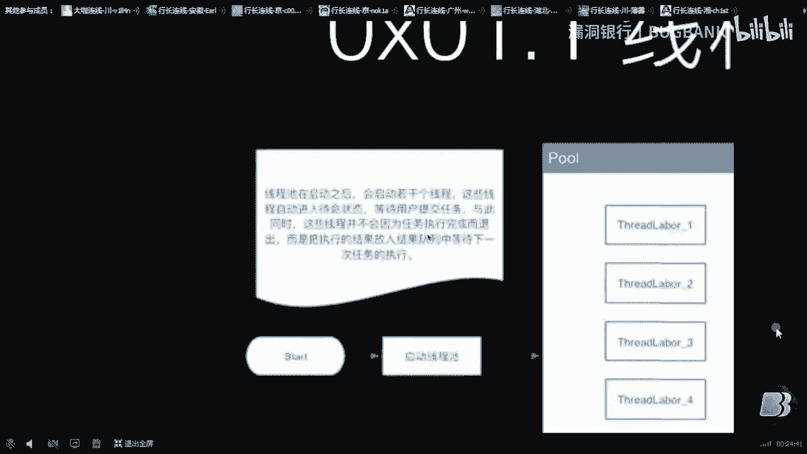
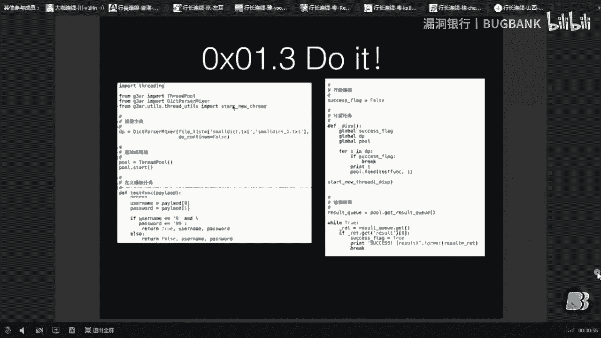
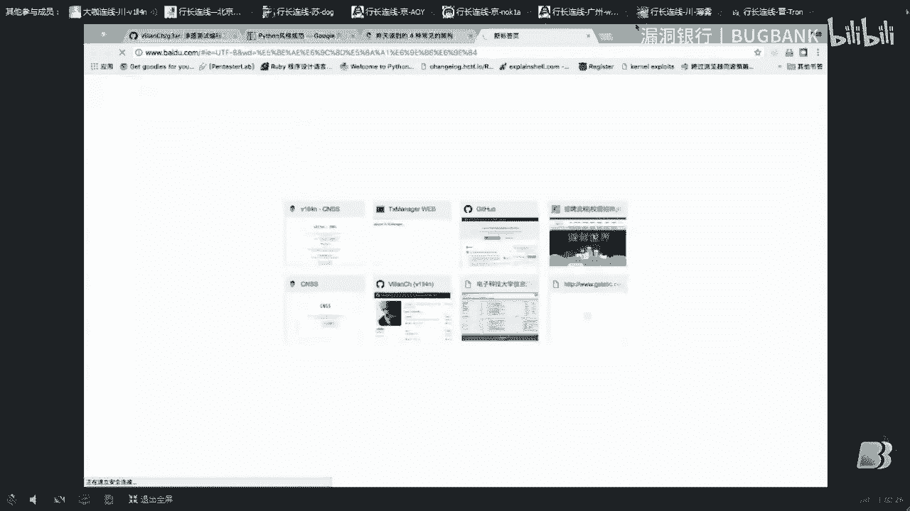
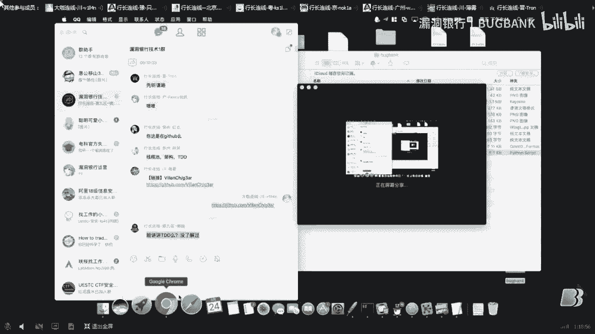

# P1：【大咖面对面】python安全工具开发详解——第15期大咖 v1ll4n 分享 - 漏洞银行BUGBANK - BV1RX4y1G7vb

好的，現在說話大家應該都能聽得到了，聽得到的話，今天就來給大家做一個小的分享，就是關於滲透測試工具的開發，因為大家可能在一開始做滲透測試的時候，或者是做了一段時間都是用現成的工具。

不管從Github上來，還是從什麼網上FB搜到的一些工具，可能會拿來自己去用，然後還有一些比較出名的像AppScan， AWS這些，然後可能拿去掃漏或者是做一些其他的事情，但是我可能覺得大家有沒有想過。

有些東西的話可以自己嘗試去開發一些滲透測試的工具，然後去完成自己想做的事情，這樣的話就不侷限於像普通的工具的限制，舉個例子，比如說Burbsweeper。

Burbsweeper這個東西在你加載大字典的時候會特別難受，你加載一個幾十兆幾百兆的字典它就會特別特別的慢，而且加載的過程特別長，主要是這些問題，其實這些問題不是說沒有辦法避免。

我們其實完全有技術手段可以解決這些問題，只是大家可能沒有深挖過這些東西應該怎麼寫，應該怎麼去解決，然後今天的話我們就主要來講這個滲透測試工具的開發，問題應該怎麼去解決。

然後我在這邊給大家帶來一個我個人覺得比較經典的一個例子吧，然後希望大家能夠喜歡這個東西，好，那接下來我們開始講一下今天主要要講的幾個大的點，主要是四個點，第一個是Python最基礎的規範問題。

然後接下來會講一些比較細節的編程上的一些東西，然後這些東西的話，我也只能說講兩個比較經典的例子，不能說面面俱到的給大家講，然後其他的話就是一些宏觀上的一些東西，就比如你完成一個滲透測試工具。

你這個工具應該怎麼樣去做你的架構這一塊，怎麼樣去設計它，然後這個是宏觀上的一些問題，然後第四點就是兩個我個人覺得比較有用的忠告吧。

就是我寫這些東西寫了挺長時間，然後總結出來兩個挺有用的點，然後關於這些，第一點的話就是要講的Python的規範問題，我看大家很多人都寫那個Python寫的怎麼說呢，你當腳本來寫的話。

其實寫成那樣是沒什麼關係的，但是如果是真正在做工程做項目，做開發，你用Python那肯定是不能像你隨便寫的那些東西一樣，它是有一定代碼規範的，舉個例子就是這個，這個是怎麼找到這個呢。

就是先打開不管你用百度還是Google。

然後你就直接輸入Google Python規範，然後直接能找到這個，直接從百度裡面找，能找到Python的代碼規範，哎呀，我要把這個全屏吧，然後就能看到這個Python。

你寫Python的時候應該寫成什麼樣子會比較好看一點，或者是比較符合規範一點，然後它會有一些編程上的忠告，當然這些問題都是屬於比較基礎的，屬於基本的編程四網的問題。

但是除了拋開這些，我們Python還需要了解什麼東西呢，也就是我今天要給大家講的這些。

(聽不清)，那個不好意思，請您稍等，(聽不清)，嗯，好，我看到群裡有人說那個PyCharm的話，對，它確實是會對你的Python代碼做一些，就是怎麼說，如果你Python寫的不是特別規範的話。

它會給你畫黃線或者是做一些代碼提示，我個人覺得這樣做非常好的，因為不管你看不看嘛，反正人家該提示的還是要做的，然後這個是代碼規範的問題，我今天要講說的其實就是Python編程的時候要注意的一些。

要深入骨髓的一些東西，就是OOP這個就是面向對象編程，這個東西我在這肯定會影響Python基礎語法和OOP的一些東西，這個下去大家自己看嘛，然後反正要聽懂今天的東西的話，就下面這三個點就夠了。

比較重點的是前面兩個，你有Python的基礎語法和OOP的基礎，然後我覺得已經完全足夠了，因為今天講的內容並不是特別多，在正式開始之前我們以一個例子來開始說，怎麼樣去開發一個Python安全工具。

我們以一個，我看群裡說什麼，群裡沒有說其他什麼很重要的事情，我就接下來自己講吧，以一個爆破工具為例，這個爆破工具我給它的定義是什麼呢，就是說我們可以多現成，很容易的多現成去爆破用戶名密碼。

或者是爆破或者是進行Fuzz，這些都稱之爲爆破工具，所以這個爆破不只是用戶名密碼，它實際上就是對那個CircleMap，它實際上也是類似Fuzz的一種辦法去做的，那我們不多說了，就直接開始說吧。

就我們如果想要開發一款爆破用的工具的話，它應該滿足什麼樣的一些功能，或者我們編程中需要注意什麼樣的一些功能要素呢，我在下面列了三點，列了三點肯定是從小到大來說的，當然最微觀的點的話就是這四個點。

實際這四個點再精簡一點，前三個多現成我們怎麼去安排，然後關於任務的分發我們怎麼樣去做，關於字典的問題我們怎麼樣處理，可能大家有些有寫過程序的人會覺得，這三點其實都特別好做，我也承認這三點確實都特別好做。

但是你完成基本功能是一方面，你能做得更優雅又是另一方面對不對，可能我給大家演示的時候大家會覺得，哇原來還可以多現成，然後任務分發和字典還可以這麼完，其實怎麼說呢，大家如果去進一去思考的話。

肯定會有找到更好的解決方式的對不對，然後當你這些微觀的東西都做，都自己覺得已經了無職掌，都已經肯下來之後，可以嘗試去做一點更高級的東西，就是你做這個報告工具一開始的話。

如果不熟悉可能是只針對某一項功能去做的，但是你就想我如果，我又想做一個法子的東西法子的工具對吧，但是我把之前的工具拿來改一改好，還是我只添加一小塊代碼，我就可以完成新的功能好，肯定是後者好對吧。

然後後者的話就要涉及到你原來的那個工具，它架構可能寫的稍微有一點問題，然後你可以在原來那個工具的基礎上，對它架構進行優化，然後去讓它完成各種各樣更新的任務對不對，這就涉及到一個多種類型任務的爆破。

就是實際上已經從一個很小的工具升級為一個框架了，可以很輕鬆，然後但是你的框架就做出來之後，你會覺得還是不夠用，你甚至想說我可以把它放在好幾台服務器上同時跑，然後它們又中間又不會出現任務衝突。

然後去同時爆破一個東西或者同時發的一個東西，那麼那個東西應該怎麼做呢對不對，那是一個更高級的話那個叫分佈式的，就是你不管是分佈式爆破還是分佈式發的，其實都是一樣的，然後至於分佈式的話我們今天不會講了。

我們今天主要講的是前兩個步驟，這是從一個微觀角度來說，從一個最基本的功能來講，然後我們要完成一個爆破工具，需要用到這些東西應該怎麼做，然後從架構上來說我們應該怎麼去安排。

然後這些都是我個人覺得還是講得比較清楚的會，首先第一個就是講那個微觀上的東西，微觀上的東西來看嘛，就多線程任務分發的字典，然後我只挑多線程和字典解析這兩個，這兩個的話可能大家會覺得就多線程嘛。

然後你每一次啟動任務的時候，你開一個線程就好了，但是實際上怎麼說呢，你並沒有，就是你每一次開啟一個線程你會想，我每一次執行一個任務我都要先開一個線程，一個任務先開一個線程對不對，那麼你的消耗權都。

你的消耗就有很大一部分都消耗在，開啟一個線程和銷毀一個線程，這個上面對吧，如果你就是線程和進程那個搞不清的話，你甚至還會說我可以開啟一個進程對吧，我開啟一個進程，然後再銷毀一個進程。

這樣的話你的資源是我個人覺得是更加浪費的，其實這可以怎麼樣解決這個問題呢，我們當然是後面會講到，這個是我要講的第一個問題，然後第二個問題的話就是關於字典的解析問題，字典解析的話可能大家覺得這個也很簡單。

就是用open，用python裡面的open打開一個文件，然後打開文件的fp fp read一下就讀完了對吧，可能大家是這麼覺得，但是實際上這個字典解析裡面也有，也是有一點小學問的。

如果說你這個字典特別大的話，然後你應該怎麼去辦對不對，你這個字典動輒幾個G的字典，然後我電腦的話讀幾個G的字典出力，那種數據的話，十幾秒鐘能處理一次還是挺慢的，但是實際上它有更加優雅的解決方式。

然後甚至你可以做到什麼呢，這個字典我今天假如我爆破了20%，我明天可以接著剩下的20%進行落魄，完全可以這樣做，然後後面也會給大家講到解決方案，嗯啊好的，接下來我們很細的來講一下。

這個現成詞到底是怎麼一回事，首先就是照顧到大家的，有些同學可能不是特別理解這個，這個現成和進程的概念，我就在這啊給大家舉個例子吧，就是大家看看這兩個是我上網搜的圖啊，牽手觀音啊那個那個圖應該。

嗯大家都能看清吧，然後你就把這個一整個人當成一個進程，然後他有他有很多隻手嗎，他有很多隻手都當成現成去想，然後也就是你啟動一個進程的時候，然後這個進程可能會啟動很多很多個現成對吧。

然後你會這些這些現成都擁有共同的資源，然後你可以去做一些事情，如果你啟動一個啟動另一個進程的時候，這個另一個進程可能會包含各種各樣的現成，很多個現成，然後這些現成其實跟進程的關係是什麼呢。

一個進程可以包含包含很多個現成，大概就是這樣一個關係，然後我我們理解這個有什麼有什麼意義呢，就是說兩個現成它兩個現成，其實是互不關聯的，除非你用一些通現成通信的方式，比如管道呀或者是現成通信的對列呀。

或者是文件的io讀取，然後各這種方式你去讓這兩個進程之間有交流，如果說你不通過這些進程交流的方式的話，兩個進程之間的內存啊資源啊都是不共享的，然後也就是我們就可以推斷了。

進程的開銷就是你啟動一個進程的開銷，你是要比啟動一個現成的開銷要大很多的，這個確實是這樣的確實是大很多的，然後我們把這兩個概念搞清楚之後，你就可以看後面，就是講了這個現成池，然後現成池是什麼呢。

就我一開始給大家講到了嘛，然後大家在完成，完成很多個任務的時候可能會選擇，就是我一個任務給開一個現成去做，然後這樣的話就是假如你有100個任務對吧，你要開100個現成去做。

然後這樣其實是我更覺得特別虧的，你可以說你開10個現成，然後這10個現成去不斷的完成你100個任務，就是說你每一個現成，然後他在等待的狀態，他去完成你的那個你提交的一個任務。

完成之後他不會退出，他會再次進入等待狀態。

然後再去等待你下一個任務，這就是我這邊的，這邊的。

這邊有一些字，不知道大家能不能看清。

這邊的字大家能看清嗎，就就是這個這一坨好了。

能看清就是說現成池在啟動之後。

他會啟動若干個現成，然後這些現成自動進入待變狀態。

然後等待用戶的提交，然後用戶提交任務之後，然後這些現成開始去取出任務，然後執行，執行完了並不是退出，而是把執行的結果放在下一個，放在結果對列中，然後繼續這個現成進入一個待變狀態，然後等待任務的執行。

這樣的話，哦有人說。

沒什麼這個PVT的話，我下去之後會共享給大家，然後，我剛說哪了，對就是把每一個現成，他會把執行的結果，然後放在結果對列中，然後他再繼續進入待變狀態，然後等待下一個任務，就是他拿到下一個任務去執行。

然後這個結果對列呢，是你編程人員可以拿到的，你可以拿到這個結果對列，結果對列裡面的東西，都是可以隨便拿出來用的，嗯，然後這個流程的話，大致就這樣，你通過start去啟動一個現成池對吧，你啟動現成池之後。

這個現成池就成形了，然後裡面有很多個現成，然後你通過外部，往這個現成池提交任務，然後這個任務完成之後，他會把結果放在結果對列中，然後你根據需要，你拿到你想要的結果，你就把結果對列關掉就好了。

大致是這麼一種。

然後呃待會的具體的應用，具體的怎麼樣去編程，怎麼樣去做這個，我待會又給大家講到，那我們先把這個文件操作，這一個呃最基礎的一個知識，給大家補一下，就是我們在讀取一個文件的時候，我們在讀取一個文件的時候。

然後是實際上你剛open，剛打開它的時候，其實是並沒有把它整個文件的內容讀完了，它裡面是存在一個指針，存在一個標記的，就是你這個標記，你標記的那個位置，然後比如說呃就就我們拿這個圖來說吧，對吧。

然後我們打開一個文件，此時你指針的位置在零這個位置，這大家能看清對吧，就是你剛打開，你剛打開一個文件，它指針是指向文件的最開始的，然後你讀取了5個字節，它就往後讀5格對吧，你讀取5個字節，它往後讀5格。

然後這5格的內容就被你讀取出來了，對吧，它實際上是這樣一種方式讀的，但是就是使用者使用不當的時候，然後它裡面有一些函數，它會把整個文件都讀出來，然後這個函數在排審裡面就叫read。

然後還有一個叫readlines，我這邊給大家舉一個例子吧。

就是呃這邊大家能看到我的那個console。

這邊大家可以看到我的console界面對吧。

可以看到我的命令行是不是，嗯好的，那我就直接開始演示了，然後我這邊，嗯剛才我看一下有什麼東西，然後大家看看這個看這個文件1。4G對不對，對1。4G的一個超大的字節，然後我們去讀一下它。

來注意呃大家在我看我操作的過程中啊，一定要注意看這個電腦的實驗，啊就是說我我看我回去了之後，他等多長時間，然後去體會一下這個東西到底應該是怎麼樣的，呃怎麼一回事，pickdit，啊看我現在讀取這個文件。

按理說這應該是沒有實驗的，就是說他只設置了一個指定人的位置，對大家看沒有實驗，然後嗯我現在想要把這個文件全部讀出來，大家看會延長多長時間，會會有一個多長時間的實驗，大家看我現在要回車。

1234567891011121314，大家看現在因為這個文件是什麼原因，他特別的他他他基本上有1。4個字，然後我們去讀他的時候，他會特別的大，然後就導致你把它整個讀進你的內存啊。

然後他現在在text裡面，我現在稍微打印一下text，哦對直接打，打印的是他的長度，然後這個其實其實講講的這個東西，就是說我們這個大字典的話，肯定不能像處理小字典一樣的去處理，對不對。

然後我們有我們有更多的，正確的方法，然後再把text這個給刪掉，我們正確的方法應該是怎麼樣做呢，沒錯還是讀這個字典，但是呢我們可以說，可以說去，哎等等我們我們可以說依次讀這些，就讀多少行啊。

大家看我如果這麼樣，我如果以這種方式去讀的話，他是不是沒有時間的，他讀取速度特別快，你看就每讀多少立馬就能讀出來，這沒錯，其實處理大字典就是這種方法，利用文件指針，然後去分段讀取。

而且而且就是這樣做的話，就是不會影響到你說你正常操作一個大文件啊。

你讀取要多長時間，要多長時間都不會影響這種操作。

然後啊這兩個東西弄懂之後呢，我們就來做一個小實驗吧，然後這個實驗怎麼說用到了模塊，就是一個現成詞和字典處理，這個東西是我已經寫好的，然後原理呢在給大家已經都講清楚了。

如果說大家是現在有電腦在身邊想一起用的話。

也是可以的，然後怎麼樣就是pipe install g3ar。

然後大家可以去安裝一下這個模塊。

嗯嗯看一下有沒有，嗯好的，我看群裡面有沒有什麼問題，我就繼續我就直接來講這個代碼吧，就是這些東西應該怎麼樣去使用，其實嗯怎麼說，如果是有興趣的朋友的話，我建議你可以去自己寫一下這個，sweatport。

然後呃自己寫一下這個字典解析，然後我這邊也有原來的碼，可以給大家稍微稍微看一下，因為這個東西，我看了有有同學說，不是特別清楚這個好像不會對嗎，然後大家對這些有什麼問題，可以在群裡面直接。

那我我現在雖然我電腦屏幕沒有看清，但是我手機開著，然後大家有什麼問題可以直接問，然後他寫出來基本上就是，差不多200多行代碼就可以完成這個事，然後這個事是幹啥的。

大家看這個api就知道有什麼save對吧，save是什麼保存進度，然後呃有什麼獲得當前指針的位置，然後有什麼獲取整個，文件的大小，然後獲取文件描述符，然後他本身定義了next，next是什麼呢。

就是迭代器的那個接口，然後我們可以像一個迭代器一樣，去使用這個dictparser，然後我們看一下，中間都用到了什麼，你看用到tail，tail是什麼意思呢，我在這邊重新給大家看一下。

tail就是告訴你現在指針的位置在哪，嗯，對我們直接直接tail的話，讀取那個大文件，我們直接tail的話，他是領隊吧，我們讀取幾行。

我們呃，我們先讀一行讀一行之後，然後再去看，他就變成了13，然後我們數一下，我們到底讀了多少個字符對吧，12345678910111213，總共是13個字符，我們讀了13個字符。

然後他的那個指針位置就跳到了13，然後我們想一下，就剛才講講的那個文件操作是不是，如果讀5個字符，他指針位置從0加5對吧，0加5，對說說明我們這讀了13個字符，大概就是這樣。

如果我們把這個13記錄下來怎麼辦，記錄下來會怎麼樣的。

我們把這個13記錄下來的話，我們下一次，呃現在我現在重新關掉吧，現在我重新關掉這個文件。

大家看我已經關掉這個文件了，然後你看已經是一個關掉的文件了，我把我再把這個fp給刪掉，哎，我再把這個文件描述給刪掉。

我重新開一個，嗯你要說等於我重新開一個，還是相同的文件嗎，我還是一個相同的文件，我重新去，嗯看一下他的文件位置對吧，他文件位置是0，如果我給他設置成是，設置成剛剛的13會怎麼樣。

嗯我給他設置成剛剛的13，然後我們再用他去讀一行，啊，你會發現這個讀的跟上一次的是不一樣的，對不對，這個兩行數據，但是大家可能覺得這個沒有什麼用，然後那麼我就給大家設一個，是一個大一點的。

我我設我設置在這裡，然後我重新去讀一下，發現哎他讀到的是這個位置的這個數據，其在讀取的過程中沒有花，沒有花任何的電腦去讀取整個文件的時間，對不對，他只是設置了一個指針。

這樣就是說這樣去讀取一個超大的字典的時候，他會變得非常非常的方便，而且沒有什麼速度的問題，所以就是基於這種方法呢，我做了一個呃字典解析器，然後這個字典解析器就可以說，你按行來讀出來讀出來之後呢。

他會記錄自己記錄一個指針的位置，你可以調用C5，C5的意思就是你可以把這個這個位置，這個數字給記錄下來，記錄下來之後，然後你下次打開這個文件，然後你把這個數字給設置進去，他就可以接著上一次的。

呃接著上一次那個叫什麼，接著上一次的位置重新讀。

然後這樣的話也就是你可以實現一個字典的保存，也就是說你實際在使用的時候並不需要，要說什麼，就是說我今天，然後讀了這一半我明天就得從頭開始讀啊，這樣就完全解決這個很尷尬的問題，然後除了這些呢。

就剛剛講到現成詞，那我給大家看一眼現成詞是是一個什麼樣的東西，來看他實際上也不是特別複雜，就兩個東西。

第一個是slide，labour slide，是這個這個labour slide。

就是我說那個就是他完成一個任務。

他不會立馬退出對吧，然後他不會立馬退出，他就是像什麼呢，他完成一個任務，他把任務結果然後給你輸出出來之後，他會重新進入一個待命的狀態。

重新進行，那大家看他的核心函數其實非常非常的簡單，然後一個run對吧，然後他有一個相當於一個死循環，這個死循環就保證這個現場不會退出，然後在期間，他執行各種的操作呢。

怎麼說比較核心的是他這個process task，他就是執行了一個任務對不對，你看他就是運行了一個函數，如果這個函數不出於AI的話，他會把這個函數只返回過來，返回過來之後。

最後的結果會放在結果對列裡面對不對，這些這幾行代碼很關鍵的，這個就是執行這個函數，執行函數的結果會直接給你放在結果對列裡面，然後你就可以，你用戶就可以控制這個結果對列了，拿到這個結果對列以後就去。

直接把結果拿出來，你不需要一次去管理現場，你為什麼要，你為什麼要花那麼大力氣去管理現場，你要記住你做滲透測試，然後你寫代碼最重要的是什麼，不是說你寫代碼你用了多長時間，或者說你寫了多少行代碼就怎麼樣。

你現在寫代碼完全不會說，按照你的代碼量去給你計算你的成果的，它是按照你代碼現在完成的功能啊，工作啊，工作量啊，對不對，所以說你這些東西基礎設施的話，我個人覺得你是沒有完全沒有必要。

把時間都浪費在這些基礎設施的建設，這些基礎設施是什麼呢，現場進程管理，然後智能解析，這些完全都是基礎設施，你完全可以很容易的去解決它們，看到有些同學說那個，Python語言有點讀不懂對吧。

我個人覺得還是抽空去看一下，就是Python這個東西呢，用起來個人覺得還是比較方便的，那除了這些，我們接著來講這個程序到底怎麼一回事，嗯，其實這兒的話，我現在這段代碼其實是沒有用到OOP的。

它整個都是過程，過程那個面向過程的，然後我們看從那個G3AR裡面導入一個，現成詞導入一個字典解析器，這個字典解析器呢，是兩個字典的混合，然後這個兩個字典的混合的話，有興趣的話我給大家細講這個問題。

怎麼把兩個字典或者是很多個字典混合起來，當然肯定不是說你簡單的寫幾層後循環就可以了，對這個你們其實還是有一點學問的，然後這個的話有空再說了，以後有機會的話再來大家詳細講這個東西。

然後這個就是啟動一個新現成這個快捷方法，shortcut我也不計劃多說，然後具體應該怎麼做呢，我們裝載一個字典對吧，我們通過具體的方法裝載，裝載了兩個字典，這個兩個字典就是模擬用戶名和密碼。

然後doContinue設置為false，doContinue是否要繼續上一次的進程我們設置為false，然後待會我們看一下我把它改為true會發生什麼樣的變化，然後接下來就啟動現成詞。

然後啟動現成詞的話，大家看我創建了一個現成詞，然後啟動這個現成詞的話是有一個參數的，大家看我點到這的話它有個svdmax，就是最大現成是30，為了實驗方便我可以設置為4，然後大家好看的其實都一樣的。

然後現在啟動，我再把後面打開，把調試功能打開，然後現在啟動了，接下來就會啟動這個現成詞，然後啟動現成詞定一個爆破任務，就是說我們爆破怎麼樣爆破呢，當我們輸進來之後用戶名等於9，密碼等於99的時候。

它會返回true其他就返回false，然後接下來開始爆破設置一個flag的false，然後待會如果說成功之後呢，這個flag就會變為true，然後我們就可以根據這個flag去結束任務了。

然後這個分發任務就是說，我們定義了一個定義了一個函數，然後啟動這個函數之後，這個函數會把自己裡面讀到的東西，然後去丟出來給那個，給這個什麼啊，給這個任務，然後去執行這個任務，然後任務執行之後呢。

它會把結果放在這個結果對列裡面，是不是嘛，我們從進程詞拿到了它的結果對列，然後我們去讀取結果對列，如果結果對列出現了成功的話，就是出現了返回之地，一個是true的話。

我們就可以把這個success flag設置為true，然後它設置為true的時候呢，就是這個任務分發就會結束，它就會跳出來，跳出來就不會再分發任務，不會再繼續了，然後這樣的話。

就一切都結束之後會打印一個成功，然後再返回這個結果是什麼，我們可以啊就是這樣嘛，然後我們接下來，跑一下這個程序，看會出現什麼樣的狀況，對不對，一下就跑完了，說明這個程序還比較快，我們發現嘗試了什麼呢。

用戶名是1的時候嘗試了這麼多，然後沒有成功，用戶名2的時候嘗試了這麼多，3，4，5嘗試了這麼多，嘗試到9的時候，成功了對吧，成功了，它輸出了一條成功的語句，然後也就是成功什麼什麼什麼，哎呦。

也就是成功了，然後從某一個現成裡面拿到了結果對吧，然後我們為了看得更清楚呢，我們可以就把一些這些輸出全部都刪掉，然後我們可以再輸出在，嗯什麼地方呢，這樣吧，我們就輸出在這裡吧，好我們重新看一下。

這樣會輸出一些什麼樣的東西，對不對，我們我們只啟動了4個現成，然後我們如果你你自己去讀取一下這個服務，從哪一個現場執行任務的話，我們會發現這一些值裡面只有4個值，然後只有4個值是能讀得到的，哎有點亂啊。

有點亂的話，我們就直接把這個，嗯讀continue設置為true，就是哎呃不是不是讀continue，我們就把這個clean mode設置為true吧，也就是精簡模式，那我們是精簡模式的話。

我們看讀到了些什麼，這是1，files files files，全是files，當讀取到999，用戶名是99，密碼99的時候，就說明爆破成功了，爆破成功之後，成功結束掉了我們的這個。

嗯任務分發和各種各樣的亂七八糟的東西，這個就是一個非常非常，嗯經典的一個例子吧，就是說用戶名和密碼爆破，我們自己寫代碼的時候應該怎麼樣去做，這樣的話個人覺得是，比較理想的。

就是比較理想的一個一種解決方案，就是說你事先寫一個現成詞，事先寫一個字典解析，嗯當然說，就是如果你自己想要，呃不你你自己不想寫這個現成詞和，嗯這個字典解析的話，可以來用我的，其實就非常非常簡單吧。

我個人覺得，因為這個東西本身沒有什麼，沒有太多的技術含量，然後這個東西在哪，我直接開PitHub，嗯，這個的話就是這一個。

嗯我把我把這個這個叫什麼，這個PitHub網址貼在。

嗯群裡面，就在這裡，然後大家可以去看一下，這個模塊，然後具體的使用方法，就其實就是Pipe in Store，G3AR就好了，然後裡面有一些測試的代碼，然後大家可以去嘗試著使，嘗試著用一下，嗯嗯。

關於這個剛那個腳本的源代碼，我也給發在群裡面，然後待會這個資料都會打包發上去的，大家不用擔心。

嗯然後講這個例子呢，主要就是說我們，我們想要完成一個任務的話，如果你事先有做過現成詞，或者是這些字典解析模塊，現成的模塊的話，做起來會特別的輕鬆愉快，然後我我跟大家說，就這一個，這一個嗯。

就這一個腳本吧，然後我們可以拿去爆破其他東西，你只需要把這個任務爆破的，這個函數給換掉，換成你自己的，然後再把字典換成更加強大一點的字典，你什麼都可以拿來爆破的對不對，這些東西其實都非常簡單的。

但是呢我寫這個東西用了多長時間，就這一個腳本，然後我跟大家說就四五分鐘的樣子，四五分鐘然後隨便寫隨便寫一寫，就可以寫成這樣，其實大家現在就會覺得，你去做一個滲透測試工具，你的基礎設施。

其實你之前做過功夫的話就這麼簡單，對吧它難是難在什麼地方呢，滲透測試工具難是難在流程，你怎麼樣去完成流程，就比如說你如果想要做，XSS的那個檢測工具的話，你是不是污點檢測的整個流程，你都要去寫一套對吧。

然後那些流程，你如果事先有做過功夫的話，都是完全可以很容易的都解決掉的，對不對，然後你要去做Circle注入對吧，你完全可以寫一個比，CircleMap更加優秀的工具。

但是難點是什麼地方，那些資料就是說，你怎麼樣去想注入的那個流程，你怎麼樣去讓你的滲透測試自動化。

對不對難點是難的那一些，然後其實難點都不在這些基礎設施上對吧，但是呢有一點一定要跟大家講清楚，雖然說難點不在這些東西上，但是這些東西是很多很多人，都沒有掌握到的，就很多很多做滲透測試的人。

他們說你看起來說什麼，啊又寫腳本又幹啥，其實他們也就只能寫個腳本而已，對不對，然後你如果想要真正測，真正真正滲透測試做成一個產品的話，你的基礎的編程知識，你的編程的一些東西肯定是要有的。

然後你有那些編程基礎的話，你再去做滲透測試，其實自動化就是一個經驗的問題，就是一個經驗積累的問題，不存在說你變成成為難點對吧，其實大致就是這麼一個東西。

這個代碼希望就是大家如果有興趣。

可以去研究一下，因為這個東西流程實在是我個人覺得實在是太簡單了，一點技術含量都沒有。

它就幾行啊，就三四十行嘛，三四十行，然後就可以完成一個爆破的功能啊，我看就網上很多啊，各種求爆破的那種什麼求程序啊什麼的，其實這沒有必要的對吧，你自己寫一個完全可以寫得更好，然後你的字典解析啊。

什麼進度存儲啊。

都可以做得到的，接下來我們講微觀的東西就不多說了，嗯啊好有問題可以直接再問，嗯，看群裡面剛剛有人提到了一些問題，存在多線程爬蟲，判斷一段代碼的技術含量是多大，技術含量，其實我這麼跟你說吧。

你寫的代碼你嚴格按照那個Google Python的那一套開源代碼的規範來說，你嚴格按照那一套規範去寫你的代碼，寫出來大家看了就算你寫的架構不怎麼樣，大家第一眼看上去還是覺得你是個高手對吧。

其實就是第一個是代碼規範，然後一個牛逼的編程的就是寫代碼的，你的代碼規範沒有，你寫出來代碼亂七八糟，那我不管你寫的有多高，反正第一印象就不好，然後第一印象不好的話，其實你怎麼說呢，你的代碼都不規範。

你的水平在哪呢，對不對，其實這些東西，判斷代碼水平高低這個東西還真不好說，你有些東西架構上本身就有問題，你不能說他細節做的不好，對不對，有些上他架構很優秀，但是細節欠缺一點。

你也不能說人家寫的不好水平不高對吧，其實這個東西，我覺得這個問題不是特別好解的，然後我們接下來講架構的問題，剛剛我看有一個同學誕生，就是有個同學說的，就是說一個牛逼工具的誕生，絕不是簡單的功能拼湊對吧。

絕不是簡單的功能拼湊，當然肯定啊，然後他當然是要經過不同的，不停的重構思考，然後細節，對不對，然後這些的話，我接下來就來講這些問題，然後講一些很宏觀的東西，講一些很宏觀的東西，首先第一個就是要講的。

要講的就是。

關於代碼的架構問題，關於你的工具的架構問題，今天網址，對大家現在能看到這個網頁嗎，就是昨天讀到的，Spanian架構這一個，話音不清。大家可以看到這個嗎？可以看到這個網頁嗎？好的。

我把這個文章的鏈接發過來，嗯，好的，這個前端啊，前端就是一個 Canvas，然後這個倒不是重點，然後結束之後，結束之後可以給大家講，然後就關於這個架構問題嘛，然後原文的話是一篇英文，然後英文我個人覺得。

如果不是專門去研究架構這個東西讀的其實沒必要的，首先我們來講第一種架構就是，分層的架構，這個分層架構是什麼呢？就是Java那一種，Java特別喜歡分層架構這些東西，就比如SS和H框架。

Structs那個框架，大家都知道吧，然後你用Structs，Structs R加HabitNate加Spring啊，這些東西，然後去做的話，就是有什麼觸覺表示層，業務層，服務層和持久層，然後這樣去做。

然後這樣做有什麼缺點呢？特別的龐大，你會發現，雖然是關注點的分離，但是它整個東西會寫出來，你中間假如你業務層改動了一點東西，你的持久層，然後你的服務層，甚至說你的表象層都會去改動，然後也就是越來越臃腫。

而且說就是偶合度上要相對高一點，因為你的每一層其實都跟其他層都有一些聯繫的，但是我們做一個滲透測試工具的話，肯定不會使用這種辦法，其實用這種辦法是特別特別蠢的，我們要講的肯定不是它，但是它有一定優點。

它的開發成本，它的難度要相對低很多，當然這個不用多說也能想到，第二種是事件驅動架構，事件驅動架構呢，我個人覺得這種架構是特別特別難實現的，確保它難在哪裡呢？第一個是它的調情角模式，它的調情角模式就是說。

它後面有，它整體就有一個現成池或者進成池的東西，然後你傳入一個任務，你註冊一個事件，然後你就可以直接你的事件任務丟到現成池裡，然後或者進成池裡，它完成然後給你返回結果。

其實就是我們看到的那個現成池類似的東西，但是它實際上要難很多，就是它的一個對列其實只負責任務調度，然後只負責接納和任務輸出，然後它其他的東西，它細節是根本不關心的，細節都是你自己在維護。

所以我個人覺得這種架構的話比較適合像什麼流水線處理的，就比如我們電腦的CPU，它其實就是用到了事件處理，就是中斷事件處理的這一整套的東西，它其實就是一個事件驅動的架構。

一定要記住CPU本身就是一個事件驅動的架構，然後它連線啊什麼的都是針對事件驅動架構的優化，然後還有一種事件驅動架構就叫代理鏈架構，如果有同學就是進場機了解比較多的話，他可能會不知道hook啊。

hook這個東西，大家知道hook是什麼吧，在windows上特別出名的一個東西，比如你hook了windows的鍵盤，你就可以獲取鍵盤的輸入，早期的道號公版就是利用這個辦法去做的，然後這種東西怎麼說。

就說你，啊對，有人說了，對吧，勾子，其實就是的，hook就是勾子，它勾子用到的事件架構就是一個叫什麼，就是代理鏈的事件，就是代理鏈的，代理鏈模式的事件架構，事件驅動的架構，除此之外還有菊花鏈是走線結構。

它其實也是代理鏈模式的事件驅動架構的中的一種，然後這個就沒必要多講了，我覺得比較重點的其實是第三種，內核架構，V-Net架構，其實這個東西也是，怎麼說，它有另外一個名字，大家可能聽V-Net有點懵。

它另外一個名字叫什麼啊，它另外一個名字叫插件框架架構，就是說它是，不，V-Net架構的另一個名字解釋其實就是一個框架，然後它擁有各種各樣的插件，最典型的大家可能Eclipse都用過，對吧。

Eclipse的話它本身是一個內核，然後你裝一個PHP插件它就可以寫PHP，對吧，你裝一個像什麼Python，PyDevelopment，就是PyDeV這個東西，它就可以去寫Python，對吧。

它其實就是一個非常典型的V-Net架構，除此之外如果大家對這台機器有了解的話，就是Enox，Enox本身就是一個為內核架構的操作系統，然後這個東西呢，怎麼說，它其實不嚴格是。

Enox的話它不嚴格是為內核，它做了一些改進，然後它的那個，就是插件其實就是它的各種各樣內核，它內核是有分子的，它的內核其實是一個內核集，然後外部你可以動態加載像什麼KVM啊這些外部的內核，其實都。

這個的話它做出來的效果是什麼，你做了一個框架或者做了一個平台，然後你可以通過編寫插件去完成各種各樣的功能，然後你通過你的內核，然後去調用各種各樣的插件，然後去完成插件的功能，對。

然後微服務架構這個的話就是更加抽象更加難以理解，就其實更簡單的你就可以把它理解為，當一個插件發展的對比特別大的時候，它已經就是超出了內核的控制，就是它比你的內核功能還要多還要龐大。

那麼這個時候應該怎麼做呢，就是把內核升級成一個平台，然後你的插件作為一個服務放在平台上，你的平台為你的插件提供了一個基礎，然後用戶可以直接去使用你這項服務，這個就是非常典型的微服務架構。

然後這種架構一般不適用於滲透工具，我個人覺得比較經典的，你做滲透工具的話，比較經典的一個東西就是微內核架構，然後你可以把這個東西稍微了解一下，然後自己嘗試去實現一下這個微內核架構。

然後再去構造你的滲透工具，你會發現另外一個很神奇的，就是怎麼說呢，直接從架構上給你優化掉的一個，解決掉你很多的問題，然後最後有一個對比圖，這個對比圖的話大家有興趣可以自己看一下，然後這個伸縮性。

為什麼說微內核架構的伸縮性不是特別好的，就是因為它的插件有個大小限制，這個大小限制是，如果你插件過於龐大的話，你的內核是控制不了的，這邊我說清楚了，有同學問微服務能再多講一點嗎，微服務的話，微服務。

我看這個東西怎麼理解，這個東西是挺新的一個概念，有人說它，舉個例子的話，我直接在群裡面打字可以說嗎，就直接來舉例子，就比如說亞馬遜平台那個東西，亞馬遜平台的話，亞馬遜雲那個，就是說你在亞馬遜。

在一台服務器或者申請了一個空間，然後你在空間，你拿到這個空間之後，你可以部署各種各樣的東西，你可以部署像什麼，你寫了一個排程應用啊，或者是你申請了PHP空間，你可以寫一點PHP代碼，然後部署上去。

然後大家可以去訪問你申請的那個，微信公眾平台其實也是微服務架構的一種，然後這種的話，其實很多概念沒有明確提出來的，你可以自己去思考一下，有哪些東西像，然後正常的話，你直接搜，直接百度，然後搜微服務架構。

哎呀，真的是，直接去搜這個關鍵字，你看你能搜到什麼東西，然後微服務架構的實戰什麼什麼亂七八糟的，這邊我個人覺得不是重點，然後我們，哎呀，現在時間，我們繼續往下講吧，剛剛說哪了，我們，哦。

就講到這個伸縮性，就是說，微內核架構它其實有缺點，有伸縮性的問題。

它的插件不宜過大，如果它的插件太大的話，會造成整個系統穩定性的一些小問題，其實如果你控制的好的話，也是可以避免的，這個東西，怎麼說。

我個人覺得應該是，就是說你從你開發一個滲透測試工具來說的話，伸縮性這個東西應該是要考慮的稍微少一些，因為你的插件，它能大到什麼程度，對不對，其實說到底就是一個很小的功能單元，然後我們接下來舉這個例子。

就是我要給大家看的一個示例，就之前我寫過，我看，是一個小東西，它是大，哦，對。

比較大型的東西，就是說你的插件特別特別複雜，需要提供對外提供的服務特別特別多的時候。

然後就不太適合用那種微內核架構去做了，你的插件對外提供的功能特別特別多，它每個服務號，每個公眾號對外提供的功能對不對，很多很多的，它雖然有重複有交叉，但是它都是獨立的。

然後那些服務其實就是一個比較典型的微服務架構，然後，哎，我剛剛想說什麼，對，接下來我們做一個，因為，怎麼說，微內核架構是我們今天的重點，所以我們就直接來講一下，這個微內核架構它是怎麼樣做出來的。

大家能看到這個代碼對吧，打開，打開，我這邊專門把這個名字寫的，寫的比較明確一點，它這邊有個Core，Core的話，就關於這個Core的話，就是我們完成這個的內核，然後Modes就是插件。

我們發現內核裡面有這麼多，有這麼一堆東西，這些東西到底應該怎麼去做呢，就先打開Base，我發現它裡面有一個ModeBase，然後你所有的插件都是去繼承ModeBase的，重新我在這邊開吧，我在這邊開。

現在這個代碼的結構大家能看到嗎，應該可以看到吧，這些代碼結構，這個Core就是內核，然後內核的話它裡面有這麼一堆東西，這些東西其實都是屬於內核功能的。

它的功能是什麼，就是配置解析啊。

什麼定義了幾個異常，然後插件管理，然後插件生成，就是API接口生成的插件啊，然後還有一個叫什麼，就是基礎的，然後基礎的裡面的話，你會發現它有一個插件的基礎類，然後這個基礎類裡面定了一堆方案法。

然後你的每一個插件，大家看插件是什麼樣的，就以這個FTP為例子吧，它插件是什麼樣的呢，它插件其實就這麼簡單，然後我就寫了一個類，然後這個類繼承了這個插件的基礎類，然後它裡面定了一個方法。

這個方法就是我拿到Payload之後，取出用戶名和密碼，嘗試進行登錄，如果登錄出現意外的時候，就返回force，如果登錄出現，如果登錄沒有意外，然後登錄成功了，那就證明用戶名和密碼正確。

那就把用戶名和密碼輸出，對不對，然後它其實完成的功能就這麼簡單，這就是一個插件，它插件就這麼小，它的功能就是，哪裡了啊，小夥伴們，你剛剛在講什麼，拿來給他一點提示，小夥伴們，你知道剛剛說到哪裡了嗎。

還是有，好吧，應該是，剛剛應該是說到這了，就是這一個Avene核架構的寫出來是什麼樣子，大家看過嗎，就是一個curl，一個curl，然後一個mod，mod，大家看名字，ftp就是針對ftp的爆破。

然後ssh就是針對ssh的爆破，然後tilenet就是針對tilenet的爆破，然後template和template是測試和做模板用的，對吧，然後這些的話就是我們啟動這個東西之後呢，它會使用。

讓你想就看你隨便了，你使用其中的某一個插件，它就可以完成特定的功能，然後具體的我們怎麼樣用呢。

我把這個程序啟動起來了，它大致是這個樣子。

然後我說，就幫助然後它有一些，然後我知道就比如testmod測試。

然後，這個的話就是基礎的使用。

就是說我啟動一個任務，我啟動了然後Gang這個任務，Gang這個任務的目標，就Gang target，直接start，Gang h，大家可以看吧，就是Gang t是Gang target，Gang t。

t就是Gang target，然後Gang c是continue，然後Gang m是使用的模塊的名稱，然後剛剛有同學問，就是基於Hydra有什麼優點，怎麼說呢，其實這個東西跟Hydra一點關係都沒有。

然後這個東西，是，我呢，起個名字叫什麼迷你Hydra，其實就是因為，以前知道Hydra是做密碼爆破的，然後我正好也要做一個爆破或者發作工具，然後我就給它取名叫迷你Hydra好了，對不對。

剛開始只是這麼想，然後這個名字做出來之後呢，因為它python寫的又是開源，然後，又支持大字典讀取，而且所有字典隨便讀，其實都沒有什麼關係的，這個的話我個人覺得要是要比Hydra要更小。

比Hydra還要小，但是功能肯定要比Hydra要齊全一點，它什麼進度保存什麼其實都有了，然後，對，Hydra是針對爆破的，但是那個東西，大家自己下去玩吧，然後這個東西其實，目的不是說寫出來拿來大家用。

這個其實就是一個實驗用的東西，然後我寫出來，大家可以看一下這個東西到底是什麼樣子，可以自己嘗試著去寫一下這個東西，其實你自己寫一遍你就知道。

其實你不管什麼Hydra啊，還是什麼EtherCube。

什麼亂七八糟的工具，都，到一定程度之後。

你去讀那些工具的原代碼，你會發現，啊我操這工具寫的什麼啊，其實一點工具寫的，怎麼說，就那樣了。

對不對，然後這個是架構上，架構上我就不講這麼多。

然後，因為我準備的時間也都差不多，怎麼了，對，然後還有一個，關上了，這是，使用TDD的，TDD是什麼。

Test Drive Development，對，這什麼，嗯，然後，呃，關於第三個點的話，就是使用TDD去開發，TDD是什麼呢，就是Test Drive Development，然後關於這個東西呢。

然後我把這個之前，哎呦，之前寫過的一篇文章。

我把它發在群裡面，大家可以看一下這篇文章，嗯，然後，就是關於TDD的，TDD方法，進行開發生物的設計工具，然後TDD是什麼。

嗯，策動驅使開發，哎這個東西，我特別建議大家去學一下，因為你學會TDD之後，可能寫代碼的時候，就不會，會是只寫一兩個腳本一樣，就不會是，就是簡單的，進行功能拼湊一樣，你就可以嘗試著進行一些，框架的開發。

然後你就可以，嘗試著進行一些框架的開發。

或者是一些很，很牛逼的程序的開發，嗯，大概是這麼一些東西，然後接下來就最後提了兩點忠告，然後第一架構先行，就是你，你如果說你是寫腳本的話，嗯。

這一定要提清啊，如果說你是寫腳本的話，那就無所謂啊，你隨便寫，只要完成功能就行了，腳本講究的是什麼，腳本講究的是什麼呢，短平快，就是簡短，然後高效快速，就是這個，如果你是想寫一個程序，真正的程序。

一個框架，那麼你應該講究什麼呢，首先是架構設計，架構和設計，這兩個地方，然後之後再考慮，具體的功能單元是怎麼樣的，然後你在寫的過程中，如果你使用的測試驅動開發，這種方法的話，一定要說一邊測，先有測試。

然後再去寫代碼，然後雖然說你表面上看起來，你寫了雙份的代碼，但實際上的話，你的那個，嗯就是那叫什麼呀，你的收穫在於，你寫代碼時候，隨便什麼時候都能停下來，不會不會說你今天停下來了，明天來寫代碼。

就不知道寫在哪裡了，然後你又得重新看一遍，不會不會存在這些問題的，然後，哎，這邊講的大內容就講完了，然後附一些常見的模塊，常見模塊上面這個這些，可能大家有的見過，有的沒有見過，對吧。

然後沒有見過的就比如說，嗯，這個inspect，大家可能用的很少，但是我跟大家講這個，這個模塊特別特別有用，對吧，這個就是類似驕傲的反射機制，它其實就是一種，嗯，幫助你在，幫助你在運行時，隨時查看那個。

資料在你編寫模塊，或者編寫框架的時候特別有用，然後再一個就是單元測試，unit test，這個東西，是，嗯，這兩個框，這兩個模塊，大家可以學習一下，這兩個模塊怎麼用。

就是在你成為一個真正的python程序員，或者是你，你想用python解說工程及代碼的時候，這個模塊是我個人覺得，幫助會特別特別大，然後關於。

具體我用的，到的東西呢，就是今天講到的什麼。

嗯，現成持技術啊，然後字典解析啊，還有什麼進程管理啊。

然後和這點什麼什麼亂七八糟的，其實我都是，直接放在了這個編程包裡面，然後這個的話，嗯，這個模塊是我自己開發的，然後大家如果想用，就是看那個安裝，然後不管你python2，python3其實都可以安裝。

然後因為我那邊專門做了一下python3的支持，但是python3我不保證，嗯，就是不會沒有小bug，但是python2是我自己在用的，然後支持也是比較好，就是，你可以通過py去安裝。

也可以通過easy install去安裝，或者你直接下載原代碼，然後下載原代碼去安裝，然後幫助手冊的話。

就是打開你下載好原代碼之後，有個docs build html index，點開它就能看到，然後裡面，就還有一些示例代碼，就是告訴你，這些模塊都應該怎麼樣去使用，然後個人覺得用起來的話。

也會相對簡單一些，嗯對，就是在github，我可以把這個地址發給大家，大家有興趣的話可以看一下，嗯對，大家有興趣的話可以去看一下，也可以說，拿著對著這個框架的原代碼去寫一下，自己要用到的東西，就比如說。

大家覺得現成詞自己可能會用到，然後那麼你就可以，可以去寫一個，去寫一個，然後去自己實現一個，更加符合自己功能的現成詞，或者說你覺得這個字典解析會比較有用，然後，你可以去了解一下字典解析，東西怎麼說。

怎麼樣去做，然後啊對，有同學問到了這個TDD，對吧TDD，TDD的話，我之前在Furibuff上寫了兩篇文章，然後這個是第一篇，你可以去看一下，然後我可以在這邊簡單的話，兩三分鐘說一下這個東西。

現成詞希望補充，對嗎現成詞是有原代碼的，然後原代碼的話，我給你發一下原代碼的頁面。

然後，我先發了這個現成詞的原代碼，我直接開這，(咳嗽)，(咳嗽)，哎，等等啊，我把這個，這個給你，我直接，直接給東西發在，原代碼發在群裡吧，這樣是不是不太好，這個，現在把地址發過去吧，嗯。

這個是現成那個現成詞的原代碼，就我剛發這個github，然後你可以去看一下這個原代碼，是怎麼一回事，然後嘗試著自己去寫一下這個東西，然後當然我也不是說這個東西，大家嗯就鼓勵大家非。

完全可以寫出一個比我這個更好用的，對不對，如果說懶的話呢，可以隨便用啊，這個也無所謂了，然後主要是大家學到這個東西，覺得這個東西有用就行，然後這個，那個朋友們要求我們說一下那個問題，就是TDD這個東西。

哎呀，對剛剛有同學把那個地址發過去了，測試驅動開發的話，這邊就是之前我發了一篇關於，滲透設計工具開發框架，然後有有的同學就問，就第一步做什麼，第二步做什麼，然後之前當時我沒有什麼體會，我沒有回答。

後來自己寫東西有點多了，然後就會思考這些東西，TDD的話它是最大的一個優點，就相對於瀑布是開發瀑布是開發什麼，就是你寫一個，嗯工程下的代碼的時候，是先有需求，然後根據需求然後去寫代碼對吧。

你寫了一大堆代碼，然後寫完之後開始做測試，然後測試完之後呢不聞到，對吧，嗯這麼比較傳統的開發，怎麼說不能說不好也不能說差，因為它畢竟是特別方便的，而且思路特別明晰，但是就是說。

相對於這個傳統的瀑布開發來說，TDD的話優勢它會，嗯，怎麼說如果你真正做工程的話，你會感覺TDD的優勢巨大，就是說，你先寫了這個，你先寫了測試測試方法，然後你的測試在沒有代碼完成之前。

你的測試都通過不了的，然後你就為了通過你的測試，然後去寫各種各樣的，寫寫代碼要求通過你的測試，然後也就是說你你是為了，你是帶著很強的非常強的目的性，去寫這個代碼，而不是說你的目的就是完成需求。

你的目的甚至可以精確到某一個函數，某一個單元某一個類，他都要他要實現什麼，什麼樣的目的，你都是可以這樣去要求自己的，然後，當然這邊有一個滲透工具，從零開始這個的話也是對應的。

也是我的一個GitHub的一個項目，如果如果說大家有興趣的話，嗯，如果說大家有興趣去了解一下，TDD這個開發模式的話，可以順著這兩篇文章讀下去，然後讀下去之後呢，我個人覺得肯定是會有一些收穫的。

就是說至少你開發性的工具，整個流程是相對能清楚的，就是自己能知道這到底是怎麼一回事，然後同時也會學到一點，嗯，怎麼說就是你上網搜各種代碼的腳本，然後學不到的一些東西。

我覺得至少說這兩個東西肯定是你會有一定收穫的吧，不能說收穫有多大，但是肯定是要稍微好一些，嗯，剛剛有同學發了兩個鏈接，就是就是這個吧，剛剛有同學發了一下，沒發現吧，然後現在現在有什麼有其他的問題嗎。

現在分享就要講的東西基本就講完了，大家有什麼問題的話可以在這邊問，嗯，你講完了嗎，嗯，大概講完了嗎，嗯講完了，好的好的那非常感謝V1144大咖的分享，接下來就進入我們的行長問答環節了。

然後還有什麼提問要問的嗎，關於科學內容的有疑問的小夥伴可以提問，嗯，拍攝工具開發的話，工具開發書我個人覺得是沒有的，書的話就是我沒有專門讀到，我沒有專門看到過有那種專門針對python工具開發的。

python滲透測試工具安全工具開發的書，然後是沒有的，然後python的系統學習呢，就是就是首先你應該去學習一下python的最基礎的語法，然後嘗試著去讀一下那個，嗯。

OOP的代碼或者是嘗試著去寫一些OOP的東西，然後我寫一下那個基礎語法，嗯，其實就是那個python的一個學習路線的話，其實就是這些東西，嗯，你首先要你首先要看一些python的基礎語法。

然後嘗試著去理解OOP這種思想，然後接下來去熟悉一些常見的python模塊，然後在最後一個比較高的一個層次的話，就是你嘗試著去發佈一個自己的第三號模塊，然後這個第三號模塊給別人去使用，嗯，哦，對。

看過什麼，這個還還有大家還有什麼其他問題嗎，還有什麼其他問題嗎，這是一些基礎的問題，大家可以去讀明，對課程的問題，python2和python3的問題的話，其實都是無所謂的。

就是就是你完全可以寫出一套代碼，同時兼容python2和python3，然後，嗯，你同時你你完全可以寫一個代碼，同時兼容python2和python3，然後至於你剛開始應該學習什麼。

然後你是學習python2還是學習python3呢，嗯，我這麼跟大家說，現在就是工程上80%用的還是python2，然後python3也有很多人在使用。

然後對於這個這個有同學說python2的庫支持比較好比較多，然後這個的話確實是有一些比較古老的庫和和有一些python2獨佔的庫，然後是這樣的，但是呢就是python3是未來，然後。

三用的相對在在工程上三用的稍微稍微少一點，但是二的話其實也並並沒有太不佔優勢，就是python2和python3其實是無所謂的，然後我我寫一下，嗯那個吧，嗯。

就完全說嗯不可能說兩年之後兩年之後二和三都會存在的，兩年之後和三都會存在的，然後你我我因為我是一開始就使用python2，然後轉python3的話我也是需要的時候我會寫python3。

而且現在現在我的代碼習慣是什麼呢，就是我經常寫代碼的時候會主動的看一下就是我能不能寫出代碼同時兼容python2和python3，其實完全可能的，二和三，哎，然後呃初學的話。

你初學的話如果是你你上網上搜代碼的話對吧，你會發現你搜到的挺多的是python2的代碼，然後python3的代碼會稍微那麼少一點，但是不影響的其實真的不影響的，我個人覺得是一點都沒有影響的。

然後你學python2學python3都無所謂的，這個這樣說大家能懂嗎，然後非要建議一個的話，嗯python3是未來，然後你可以去先看一下python3，然後python2嗯抽時間再看了其實無所謂啊。

這個東西嗯，在我我個人覺得是無所謂的，你随便选，24層的保護墊。

