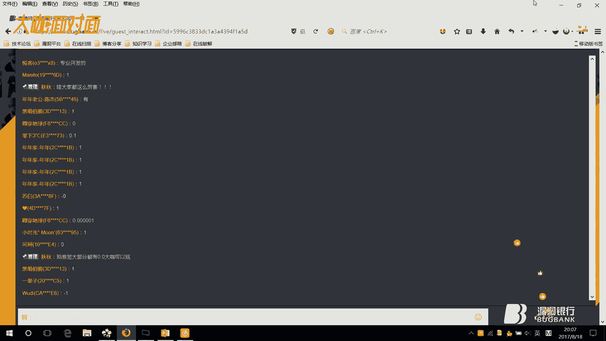

# P1：【录屏】0DAY挖掘巧思-代码执行之漏洞审计——第35期大咖水清云影 - 漏洞银行BUGBANK - BV1MZ4y1w7ok

(音效)。

為知識而存，因技術而生，小夥伴們大家晚上好，歡迎參加漏洞一堂細心學習式講座，這是我們大咖年年麵第35期，我是主持人年年，相信你們對今天的大咖已經有了更深的了解，沒錯。

今晚的嘉賓是國家性安全漏洞庫的白帽子，水清靈影，今晚靈影帶大家玩轉代碼審計，輕鬆挖靈被，這些奇蹟巧技別處可學不到哦，接下來就歡迎水清靈影開始今晚的講座吧，大家好，我是本期的大咖水清靈影。

也是眾多白帽子中的一員，也曾發表過一些原創技術性的文章，參加過互聯網大會的一些深度測試，但涉及的東西比較多，但代碼審計來說，它也是現在的安全開發人員必備的能力之一了，它不僅可以檢查遠代碼中的一些缺點。

錯誤的信息，同時它還能挖掘更多一些有意思的一些漏洞，今天會給大家一一的講解一下，是如何去挖的，同時又給大家分享了兩個比較好的一下例，今天內容大體上會整體的講一下代碼審計的思路。

然後會帶大家快速的預覽一下這個基礎的內容，最後我們就是最有意思的領袋的，漏洞的一個環節。

不管是什麼來說，要整體的來有一個思路是最好的，這個思路大家是總共分為了四點，第一點是通讀原文，他不管是什麼，他只有了解了整個的應用的業務邏輯，他最好是可以挖掘到有價值的漏洞，但我說的幾個技巧。

大家可以認為有用的可以記一下，因為不只因為有的通讀原文，不只是從index文件主格開始讀的，我們可以從第一是從函數級的這個文件，就是一些有公共函數的地方可以統一調用的，比如說一些防守common。

這兩個關鍵字一些入手，其次大家可以再關注一下這個配置文件，比如說一些config關鍵字，就是web程序運用時，必須有一些功能以及數據庫的配置信息，第三個要關注的一個點，就是關注到大家能不能利用一個程序。

就有一個漏洞，大家是可不可以利用，他就是一個安全過濾的文件，比如說檢查，也比如說CIFO的關鍵字check的關鍵字，這個是也是挺重要的一個點，因為他在是整體的一個過濾，他是給這個一個。

這一個CMS一個整體的過濾，其次也可以從index文件入手，我不是說不可以，就通常讀一遍index文件，可以大致的了解一下程序的架構，運行的流程，包含的一些文件等等，不同目錄的index文件。

可能也有不同的那個實現方式，就如果想從這個方面入手，也可以把幾個核心的index文件讀一遍，從整體來看通通原文，大體上看一些主目錄有哪一些文件，模塊目錄有哪一些文件，又比如說插件目錄一些等等。

其次就是最多的敏感關鍵字回復，這個是利用最多的，我也不多說了，就是根據一些敏感函數，逆向追蹤參數的一個過程，第四個第三個是功能點審計，其實這個我認為是比較好的，就最簡單一個例子。

你在網上下載了一個普通的一個CMS，你可以先給他打鍵上，到處點一點瀏覽一下，看看一些程序有哪一些功能，程序的一些文件是怎麼樣的，它是一個獨立的模塊呢，還是插件的形式在一起，或者說是有一個框架。

還是有一個通用的類來多出調用，一般漏出漏洞的就那麼幾點，比如說找回密碼的功能，文件上傳的功能，登錄認證的功能，留言板的功能這些，其實這些漏洞的地方，可能是網上其他的程序也是包括的，大家可以沒事多看一下。

其他的一些分析，多給自己積累一些漏洞的知識，可能是有那麼一個學以致用的過程，可能是別的CMS，這一個功能點有問題，也可以聯想到下一個CMS，這樣也是可以的，第四個查找可控變量，就是一個。

在對代碼進行一個追蹤的工程，對一個可控的變量，追蹤起危險的函數，這裡我能給大家推薦一款，比較有用的工具，IPS工具，它這裡有一個是，User Input的功能，就是可以查看一些可控的參數。

再通過可控的參數，可以查找一些危險的函數，當然進入我們代碼執行漏洞，也是今天主講的漏洞，其實說了這麼多，它是利用條件就是兩點，第一點它有一個危險的函數，第二點就是這個參數可以控制，想要執行這個函數。

就是這兩個點，一些危險的常見的函數。

我不知道大家有沒有代碼基礎，我這邊能不能看到。

大家有代碼基礎的可不可以，我看一下有沒有基礎，如果有代碼基礎，我這一部分就很快的瞟過了，沒相對象，看來大家都是有基礎的。

我這一部分就是快速的過一下。

這個是沒有函數，毀掉函數，動態執行函數，當然了這個我得要詳細的講一下，因為這個是挺有特色的一個漏洞，接下來的一些演示，它也是這一個，它這一個函數裡面是有三個參數的，其中它第一個參數是什麼意思。

它是一些需要一些正則匹配的一個內容，第三個參數是我們要傳入的一個字符串，第二個參數是我們正則匹配到，要執行的一個部分，當然了一些正則匹配，有一些模式修正符，其中的如果加上了-e，這個模式修正符。

它是一個允許代碼執行的，就是將第二個參數來一個，p2p代碼來執行，這裡這個函數，它總共三個參數，它都是可以控制的，比如說第一個參數，我們這裡可以，它沒有-e的形式，沒有-e模式修正符。

我們可以傳入一個-e的模式修正符，來讓它有這一個可執行的效果，第二個也是一樣，第三個都是一樣的，第三個就是讓，第一個可以匹配到字符串的內容，下面一些正則表達式的指示法，因為有一些內容。

它肯定是要涉及到正則表達式的，這裡我就給大家列出了幾點，大家如果有興趣的，可以再下去看一下，是普通字符作為原子也好，還是在特殊符號作為原子，它前面加一個反寫線，或者是通用字符類型作為原子，比如說這一些。

代表，比如說這個-d，代表了0到9，-d代表a，a到z代表到他自己什麼的，這些等等，大家如果有興趣的話，都可以去看一下，這個修復方案最好的，最好的也就是一個，作為白名單的限制，比如在企業中的話。

你把這些點都是標記出來，就都會寫一個整理一個報告裡，然後他丟給開發去做，所以這裡我也是不細講，重點的是講解一些咱們的案例，把案例的時間最好調整的多一些，因為這個東西，我認為它是比較有機動人心的。

相對理論來說，我也更喜歡一些操作的東西，這是某公司MS，在這裡我們可以看第一個，咱們漏洞的出發點，還可以看到這裡，還是我們剛剛講的危險函數，我們可以找一下這個文件。

Lib，還記得我們剛剛說的。

要滿足代碼執行漏洞，那個兩點是什麼，第一點就是要有危險函數，第二點是什麼，肯定是要看這個參數，是能不能控制的，他如果能控制的話，這裡就是可以讓他匹配，一些政策的內容，要導致一個代碼執行的結果。

這裡我們從上看一下，它是什麼意思，他顯示判斷是否設置了，這個GETABLE內幕的數字，是否傳過來，所以說我們現在就要看，是誰調用了這個函數，以及可不可以控制，這個數組裡面的內容。

我們可以現在跟一下這個函數，這裡我們是不是調用了，這個函數的方法，該的這個函數，就是我們剛剛看的那一個，我們可以看這裡面的一些參數，是從哪裡進入過來。

我們的下一頁PPT，他看傳過來的這個參數。

只有那個參數。

是能控制的情況下，我們才可以選用他一些字符，然後達到一些匹配，政策的這個內容，這是數據庫的，在這裡，這裡該的函數，他是先返回了一個數組，然後他有這個開頭ID，這個同樣他也是給了一個數組。

這裡還記得我們剛開始，咱們的那個。

可控的這個什麼嗎，這裡有個default的值。

就是我們這裡。

就我們想辦法要控制的，這一個東西，這裡該的什麼意思，他是這個CMS裡，他已經一個封裝好的一個函數，就不是說HTTP傳入的一個參數，是這個意思，所以我們再看這個函數，他又是被怎麼調用的。

在這裡剛剛有個小夥伴就說，是面向對象的這個問題，覺得是這裡應該是可能了解的不太深吧，這裡他是先初始化一個，ynt這個方法，然後在這裡，disk是在當前的情況下，使用的這個類。

然後創建了一個new table，最後調用了這個函數。

我們整體來看一下，他是怎麼的一個過程。

他是先初始化的，這個intel的方法，然後又new了一個table類，然後這裡會有這麼一個方法，這個方法是怎麼來的呢，是在這個文件裡，他的一個方法，他這個該的form，他是收入了一個數組，他這個數組。

他有一個default的值，可以蓋他ID，然後這個數組的內容，他把這個值，傳給了這個函數裡，他這裡有個參數，最後最終的，他是傳到這個魔法裡調用的時候，他是給了這一個，他是讓他可以執行，最後就達到一個。

可以代碼執行的這個效果，就咱們想這個poc的構造，他是想辦法用這個數組裡，傳的這個值，來匹配到他這一部分的內容，是不是就可以代碼執行，來給大家看一下這個。

例子。

在優特投稿功能，在這裡我們先看一下，他的這一個正格表達式是什麼意思，為大家新建一個批評。

新建一個，這裡來我們構造這個poc是什麼呢。

他現在是要傳過來的，這個cat ID的這個值，來匹配到這個內容，來就可以進行一個代碼執行，那這裡有一個指示點了。

就是咱們剛剛提到，正格表達的一個指示點，就是特殊符號做原子。

特殊符號做原子的話，他前面就會有一個反斜線，這裡也會有一個反斜線，其實正格的內容他就是這一個，後面有個-1的模式符求是。

還這裡我們來可以構造一下，cat ID的值，等於，這裡是什麼。

必須要以這個形式開頭吧。

+號的意思是什麼呢，+號的意思是後面可以匹配一些0或1的這些東西，但是也是屬於，這個限定符，有一些如果想深思研究到，有一些他樂模式和非他樂模式，也比較有興趣的，這裡大家已經看一下，(打開CAT ID)。

看這裡就造成了一個代碼，執行了這個效果，當然他這裡也可以執行一些系統的命令，比如說，看這裡也是可以執行，借用一個函數也可以執行系統的命令，但我們再看看，這裡是不是不止存在CAT ID的這個值。

type ID他是不是也是有一個default，也是可以控制的吧，這裡咱們再試下。

這個是可不可以的，type ID，type ID是不是也是可以控制的，我們要回到最初的咱們講的代碼執行漏洞的這一點，第一必須有危險函數，第二這個參數必須是可控的，最後這是一個相對來說比較好。

又比較好理解的一個東西，比較好入門，下面我是給大家講一個比較有意思。

思路比較奇特的，比較騷的一個姿勢，影視類的一個CMS，他是一個CNPP框架，一般來說，如果是要審計框架類的話，他最好都是從一些控制器入手，一般控制器在哪，審計就到哪，審計到哪，這是CNPP的一些。

我們可以看一下這個，其實CNPP。

CNPP也不是那麼難，不是大家想像的那樣，這裡來。

我先給大家先普及幾個。

咱們以後會用的最多的一個小姿勢，一些CNPP比如說幾種訪問方式，一般來說也就是這幾種，當然了。

他不是說每一個CNPP，他都是這幾種，大家在找的時候。

可能會遇到一些URL訪問機制的問題，大家看一下CNPP開發手冊。

在URL裡，他一般給列了幾種，不管是大小寫的方式，普通模式，還是充寫模式，還是兼容模式，其實這裡那道程序，還是用了兼容模式的，給大家看一下，出現點小問題，大家看這個訪問的模式訪問的機制，是不是大體相同。

但又有些不一樣的地方，對吧，這邊是鋼鋼這邊是斜線斜線，其實最主要是在這個地方。

咱們可以把這個東西，風格符給修改掉，就把這個斜線改成斜鋼，就是同樣可以一些訪問的，我們入手這個在說這個之前，是怎麼是找的這個呢，他是通過一個744MS，當時爆出的這個漏洞，來找到的這個。

他當時是有一個Display這個函數，他是CNPP一個模板展示的函數，通過這個函數來引發的一系列的問題。

我們看一下，也是在這個控制器裡，這個麥，從代碼中是怎麼看的呢，他是首先檢測TPL的值是否為空值，如果不為空的話，他就會把這個TPL參數負的值給蓋特過來，然後複製給這個變量ID，其次呢，他會進行一個拼解。

通過這個麥拼解，但是這個變量ID給前面給了一個函數，大家可以查這個函數是什麼意思，他不是一些過濾的東西。

其實，移除字幕串兩側的字符，其實。

其實他這個是沒有什麼威脅的，所以這個傳過來的，就比如說我們傳過一個SQYY吧，他就會顯示一個，他就會顯示一個這個顯示，就是前面加了一個，然後在下面再進行一個判斷，再再次添加一個。

不過這個是沒有什麼利用的，然後我們就到了這個Display這個函數，我們繼續看一下，進入Public，進入這個View的類裡，這裡，這裡是什麼，這裡是傳入了一些值，然後同樣又也弄一個Fast這個函數。

在上一個引用的時候，他是並沒有進行一些過濾的，我們再往下可以看這一個，其實這些都是模板類的東西，什麼定義模板文件，獨立載入，其實他歸根結底來說，他就是獲取到一個文件的這個內容，獲取到這個文件的內容。

然後再把這個東西給傳過來，就是我們的傳遞的這個字符模板，他是一些不能正常的一些解析，那麼他就會一個報錯，那麼報錯問題來了。

咱們可不可以利用這個報錯的這個功能，來想像一些什麼思路，我們可以看一下，這個參考，抽離的這個功能，收集，在在在在在，萬純，調適力，對，下這個記錄這個日誌功能，這裡，他首先可以。

大家可以看一下這是什麼意思，會記錄一個日誌，但前提是需要設置一些這個，那種，要我們看一下他這個三馬是他設置沒有。

如果設置的話，我們可以利用這個抽離的這個東西來思想一個頭腦風暴。

是在哪裡，我也忘記哪個文件。

應該是在配置文件，我找一下，我先找看文件能不能找到，對應該是在這裡。

業配置文件數據庫設置，數據換取設置錯誤設置，預設在這裡，他可以看一下在這裡，還是不開啟了日誌記錄。

是否記錄異常信息，調到下面又設置了一個允許記錄的，級別，再看一下，有一些嚴重錯誤，一些警戒性錯誤，一些零件指出，一般性錯誤，就錯位置功能了解之後。

他們可以看一下，咱們這一個是總共通過這個錯位置的這個功能來進行的一個。

代碼執行，在這裡。

首先我還必須要帶大家回來看這麼一個內容，還是訪問訪問的內容，他第一個還是說的是模塊名，第一個是模塊名，什麼是模塊名。

就像這種my action控制下，這個是my action，他就一個控制器，要收呢是一個方法，tbl呢就是我們傳入的這個建置，然後我們來通過這個sync pvp裡面的一些。

url訪問機制我們來看，如何調用在裡面，每一個文件每一個使用，就不至於說找到一些漏洞的點，但不會在在這個url中找到這個一面，模塊控制器操作，我們剛剛找的是什麼，兼容模式裡的吧，在這裡。

可以看一下咱們是在什麼呢，是不是my控制器下，看一看，這個my的控制器下，要用什麼方法呢，收的這個方法，這個my控制器下，收的這個方法，然後我們怎麼樣，傳入一個tbl的值吧，對不對，tbl傳什麼。

我們就可以，傳一個我們詳細的一些，比如說pvpinfo，我就可以這麼傳一個，dhtml，這裡會進行一個報錯，來我們可以看一下這個報錯的文件在哪，在日誌下面，今天是8月18號，就我前幾天測試的，是吧。

來看裡面是什麼內容，是不是也有一個這個info的這個內容，還有我們，來構造下一個poc，這裡我們就要訪問到那個剛剛的他們的日誌文件，在哪裡呢，啊，我們訪問這個就大家就可以看到，可以執行了這個代碼。

其實我在大家旅旅旅邊這個思路，他就是利用tbl這個參數，他沒有進行一些過濾，然後呢，就這個錯誤日誌的這個功能，要先把這個錯誤信息，也就是說咱們剛洗過那個pvpinfo，在寫入到這個錯誤日誌這裡。

然後再進用tbl再進一個收的這個方法，然後poc中的日誌文件，他是以一個年月日進行命名的，然後大家也可以通過美舉去裁減，然後就導致了這麼一個通過錯誤日誌來包含一個代碼執行的這個漏洞。

就帶帶大家再看一下這個，可以回復壓他這個默認的那個訪問方式，嗯，嗯。

嗯，而且我們可以回復壓默認的訪問方式，看看在默認的在tp的寫法裡，他是什麼樣子，我們再刷新。

對我們重新訪問一下，他沒法。

這裡保存，其實其實默認的話，他是在這裡一些修改一些東西，大家就是可以一些在ur中一些訪問的不同而已，這是對大家比較好的一些兩個思路。

其實不管怎麼說，這是一個拋磚引玉的這個方法吧，他可以通過這些錯誤日誌文件幹一些許多的東西，他不只是有這麼一個功能，就大家可以有一種這個舉一反三的思路，如果今天我可以用這個錯誤日誌可以進行代碼執行。

那明天我可以用這個可以幹一些別的呢，或者下一個CMS再遇到這個single pvp這個框架，同樣還是開啟了這一個錯誤日誌的功能，那麼是否還是有同樣的一個漏洞在裡，其實大家也可以想想。

在下面也可以去找一些這種框架的一些可以去試一試，然後今天的兩個小阿力呢，就是帶給大家帶到這裡。

高效收割零備技能大家都get了嗎，感謝你講得很棒，問答區我們看到已經有很多問題了，那想獲得代碼審計，企業機關代碼安全架構的小夥伴，可以抓緊時間在提問區提問，哪方適量的問題會被篩選到我們的問答區。

也可以把聊天室切換到問答區的版塊，然後開始今天的十分鐘問答環節，大家可以都先寫出來，我等一下一次的可以給大家解答，代碼審計需要什麼基礎，當然他首先要有一個編碼基礎了，代碼審計不可能一個皮皮皮的。

比如說一個調用的方式都不懂的話，他肯定是不可能深入了解的，就是有一個什麼呢，是從滲透是先從滲透學還是還好，還是先從開發學好，其實我最好的建議先從開發再轉到安全，這是最好的，就一些好多漏洞的原理。

他都可以更深入的去了解，可控的編量是什麼樣，就是自己可以控制的一些東西，比如說自己傳入的一些參數，比如說我想傳入SQYY，我就可以傳入SQYY，比如我想傳入一個CMD，我就可以傳入一個CMD的值。

是這個樣子，審計一般是從控制器著手嗎，一般來說有框架的，他要先從控制器入手，像沒有框架的可以從一些功能點入手，其實這個問題是問的挺好的，最好就是我在這裡PVT裡最先打出來了。

框架的問題一般都從控制器入手。

7XT文件是當做PVP執行嗎，其實錯誤日誌，他是被當做一個代碼，當做一個模板才導致的代碼執行，最後的日誌文件被當做模板來執行，被當做模板來執行了，是CN寫入錯誤，CN寫入錯誤，這是PVP。

首先咱們的這一個是，看可不可以控制這一個參數，如果這個參數控制不了的話，那寫入的這些功能他就肯定實現不了的了，他肯定會給你一些限制，所以首先還是那兩點，第一是有危險函數，第二是參數可以控制。

在這裡控制的情況下，咱們可以先寫一個PPIN，放錯誤的信息，然後再調錯誤的信息訪問這個log日誌，就可以，先看這有沒有一些過濾，利用代碼，其實這兩個都是沒有區別的，就比如說。

我舉的這兩個例子，如果把這個換成這個函數，他也是可以一樣可以執行的。

他兩個本質上他就沒有大的區別，文件包含最後最後的那個應該也算是一個文件包含吧，這是一個URL的一些訪問機制。

一些設置的這些東西，使用的一些建值，一些建一個值被當做一個html，就是這麼說吧，就是如果你不知道的話，大家也可以看我在這裡給大家找一下，就算你不知道的話，他這裡也是一個。html的值，html的後綴。

如果你不知道，請問一下你通過四處一些瀏覽，可以找一些關鍵的地方都可以看，對於這一套CMS肯定是要有MVC這個架構的知識才可以。

為什麼為什麼日誌裡的語句被執行，他他這個錯誤日誌裡，他是被當做一個模板來執行的，他不是指裡面語句，他是那個日誌文件被當做一個模板，要導致執行的，不要生個屁屁，MVC這個架構，如果日誌寫入的是木馬。

其實這個時下你可以找一些類似的東西可以去試一試，這這是一個很好的問題，是一個有思想性的，但是你可以去自己嘗試一下，找一些有這個文件的，有如果有什麼需要不懂的，在可以私下問我都是可以的。

如果不清楚CMS架構，大型公司用的CMS沒有辦法自己搭建，但是只是手裡有這套源碼嗎，還是怎麼樣，就是如果是這個樣子的話，其實一些大型的像這種企業的，如果先是從一些用一些好的簡單的一些工具，大概看一下。

然後其次呢，可以是讀幾個index文件，這門入手是最好的，其實也沒什麼大的區別，這個就是也是通過訪問的一些東西，訪問那個錯誤日誌，也有文件包含在裡面，其實其實其實我講這個漏洞。

不是去講文件包含的這個漏洞，是想講什麼呢，想講這一個通過錯誤日誌，可以把這個P2P引擷的這個可以代碼執行的，這個東西寫在裡面，然後去訪問，對原理也是一樣的，審計工具，一些大型的工具的話。

還是一些faulty，我是比較推薦的，一些faulty，然後其次呢，一些IPS啊什麼的，安全編碼的事，我等一下我找一個文檔吧，是一些文檔，我給大家發給大家，也是一些安全編碼的這個東西。

可以參考一下這個文檔，一個網站能從哪個地方，最簡單的，他可以從比如說一些文件的這個尾頁的下面，下面的這個標籃裡，有可能暴露，其次呢，你可以看他的一些後台，因為後台的地方，也有可能有一些這個標示符。

也有一些指紋在裡面，怎麼樣能更快的找到可以利用沒過濾，既然想做這個的話，他不可能是有更快的了，先把這個信賴下來之後，其次可以慢慢的去通過，找過濾的話就推薦IPS那款。

那個工具，就這項工具，你把這個代碼放裡面就審計之後，他旁邊會有user input這個功能。

這裡面全都是一些過濾的，能回溯，那是不是會存在一些便利，是一些什麼便利的漏洞，還是，正常回溯參數的話，他是可以慢慢往上逆向追蹤的，比如說你上一個文件找了一些什麼方法，你可以先查這個方法。

然後方法裡掉了哪些東西，可以繼續去往上一步一步往上找，最後的漏洞的出發點肯定是在你原始找的那個地方，這個一般都是single PAP自帶一些是寫詞的這個東西的，就是他single PAP已經有的時候。

他是有的，而且他是一年命名，也都是可以通過美舉的一些，拆解，PAP審計會不會被加入順序，一般來說吧，一般一些大的企業來說，他都是用java寫的，這個是確實，如果想想在一些小眾的話。

PAP審計確實是很大眾化，但是java審計來說，可能是還沒有那個沒達到那個層次吧，因為你看咱們咱們傳的也是網上最多的，也都是一些PAP的一些東西，都是PAP的一些審計，java的一些資料呀。

什麼東西都很少，但是但是這兩個語言肯定是不會是說誰被誰取代的問題，因為存在PAP就存在PAP代碼審計，存在java就存在java代碼審計，如果說哪一天java真的game over了。

那可能就不存在這一個了，有辦法繞過過濾規則實現命令執行嗎，有是肯定有的，那看他寫的一些過濾文件如何，他設計的一些白名單又如何，一些他的一些過濾機制，這些等等都要看的，如果簡簡單單的設置幾個白名單。

設置了幾個字符，那也都是都是可以簡單的繞過。

如果是他把一些東西都寫死了，那可能就是沒法進行繞過的，但最最根本的原因，他還是要看這一些東西，他是怎麼寫是最重要的，方法肯定有的，千奇百怪的方法，還是要看這個代碼本身，他是一個什麼樣的。

大家還有什麼問題嗎，還有問答環節還有最後的兩分鐘，如果想要問問題的好辦，可以聽一下手速，期待你們的提問哦，危險函數定位原代碼不審計啊，剛才的日文地方除了新聞信息，一般解析的話，他是沒有太多的一些涉及的。

他只不過是通，如果有包含漏洞，他確實是有個簡單的小小的一個包含漏洞，這個是確實的，代碼誰中注入包錯有有兩點滿足條件，一點是，這像這像這一個兩點滿足的需兩點的話，他肯定是看是否有沒有一些過濾的。

這一點是很重要的一點。

比如說你過濾了一個，比如說你過濾了。

ICRCT等等等等，比如說你過濾這些東西的話。

那他也是沒有辦法的，首先是要看是否有這個過濾，安全開發是是專門修這個代碼，執行的這個漏洞嗎，指的是，如果是單獨的修復，這一個還是建議自己寫一個過濾，自己寫一個白名單來限制，如果說命令執行的話。

他會會有兩個函數，是給有兩個函數，他是可以的，但是用函數的方法也都是不太安全，還是自己寫一些自己寫一些過濾，加上配一些可以過濾，這個危險函數的這個東西是最棒的。

而且一般你是一般在一些企業做代碼審計的時候，他是先把這個東西告訴他，然後具體是建議是什麼，然後把這個建議整理成一個報告，然後發給這個開發的那個地方，他具體他是怎麼一些設置白名單也好，還怎麼樣。

那是開發的一些做的事情，那我們規定的提問時間也差不多了，感謝予以的耐心解答，下面就是我們最後的福利環節，大咖贈書，那今晚上大家的表現都超級棒，現在就要選出一位最認真聽講的小夥伴，送上房這本代碼審計。

企業級web代碼安全架構，只有一個名額哦，云云命運就掌握在你的手裡了，別猶豫，雙擊一下他，然後看誰運氣好的，白鶴，我覺得這應該是比較有前年這個，什麼的。

那就選他吧，請用觀眾，其實這裡說黑河肯定是越來越難做的。

絕對是黑河是越來越難做的，因為因為不管大的企業，他有很多都買了一些Valve啊，一些防火牆，這些可能在以後可能是很難再通過黑河進行進去的了，但是但是黑河不會代替白河。

只能白河的重要性肯定是比黑河的重要性越來越高，肯定是這一點，但完全替代是肯定不會的，行，那今天晚上的新一位觀眾就已經選出來了，就是monito，好恭喜你獲得了代碼審計。

企業級Valve代碼安全架構這個書，然後需要你填寫正確的技術信息，我們稍後會將贈書寄給你。

那到這裡，本期的大咖面對面又要和大家說再見哦，感謝水清雲影帶來精彩演講，也感謝觀眾們的熱切互動，認真學習積極討論的你們是好樣的，可以給自己點贊一波，下周晚8點漏洞一行大咖面對面第36期，我們不見不散吧。

大家拜拜，雲影你可以關一下開螺了。

大家拜拜，(字幕製作：貝爾)，(字幕製作：貝爾)，(字幕製作：貝爾)，(字幕製作：貝爾)，(字幕製作：貝爾)，(字幕製作：貝爾)，謝謝大家，XXXXXXXXXXXXX，吧。

