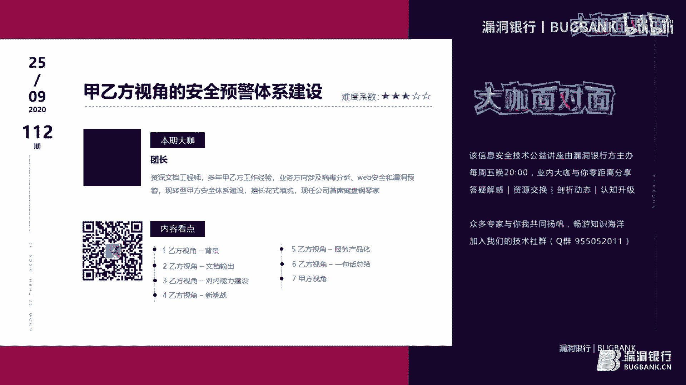
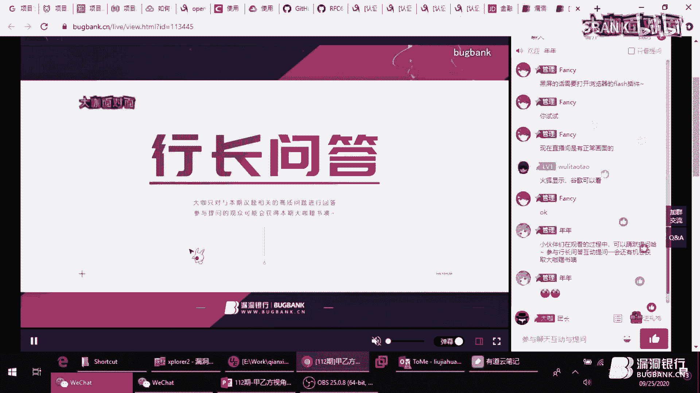
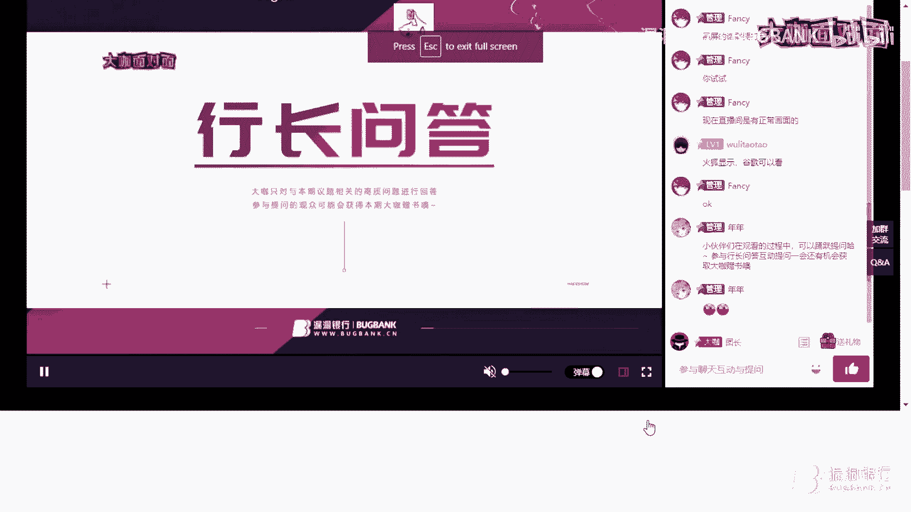
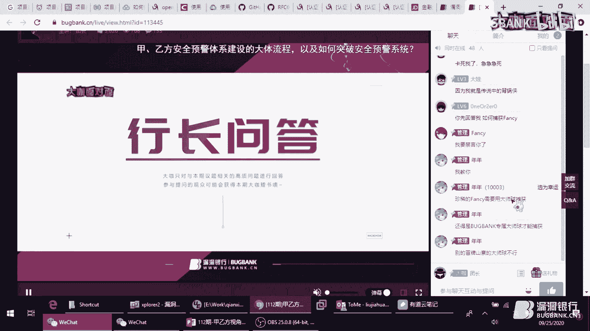
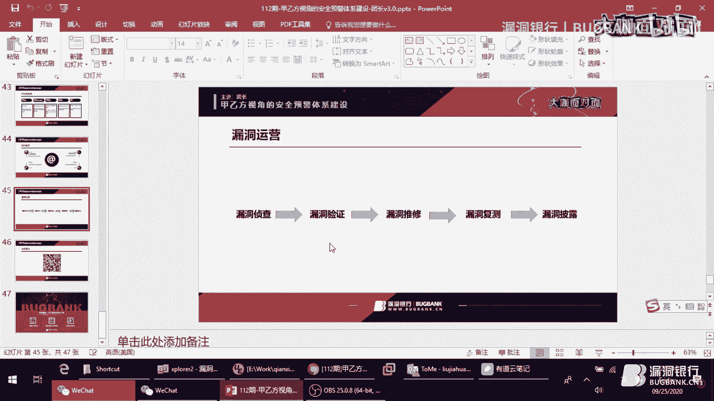
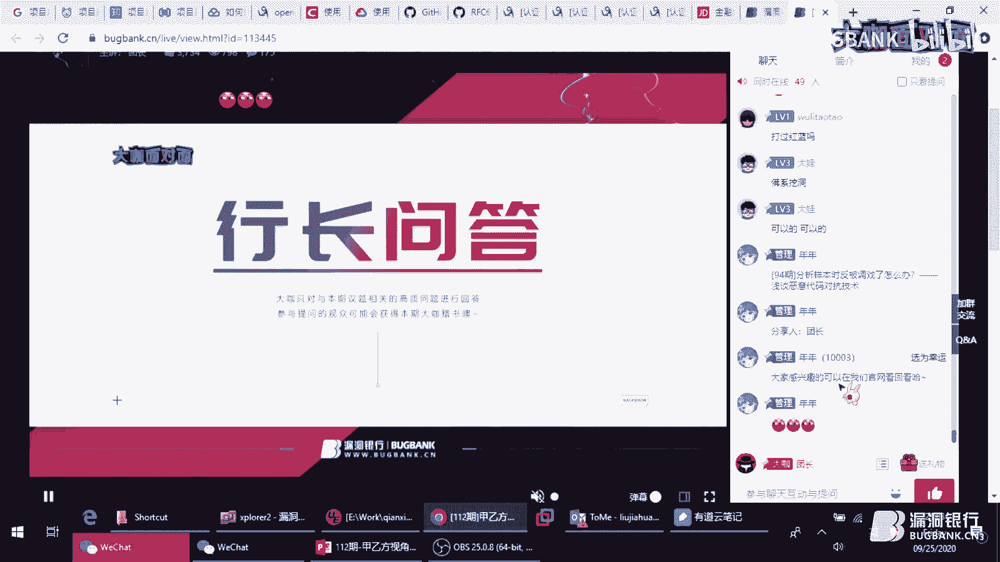
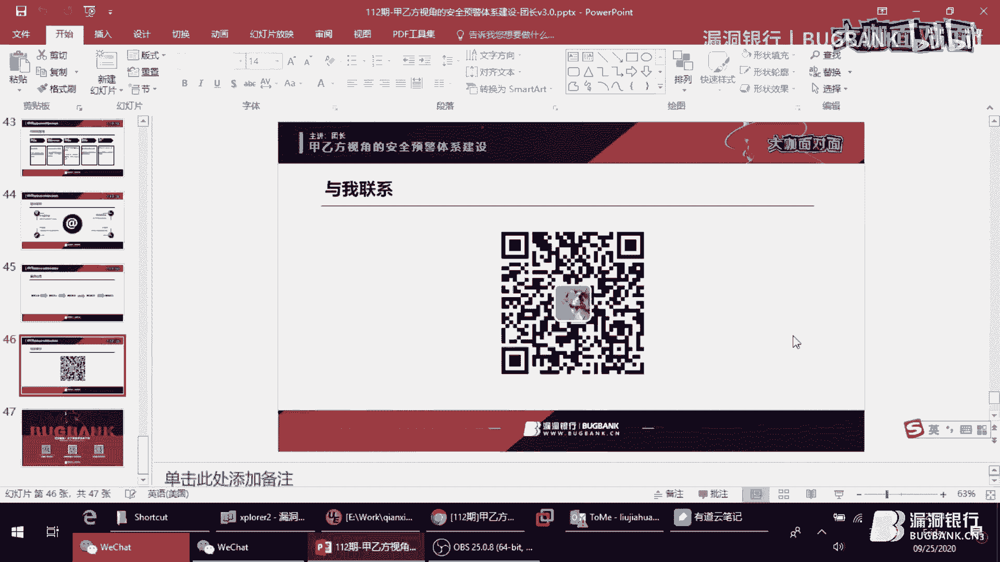
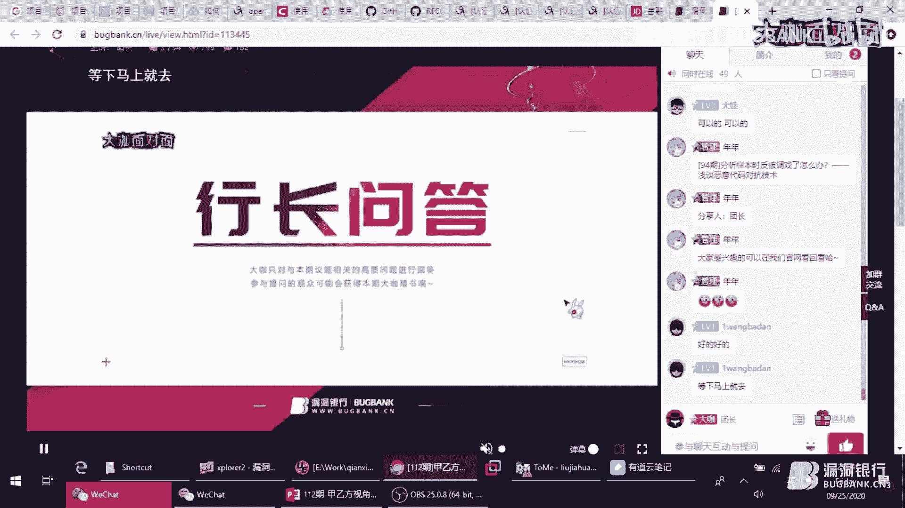
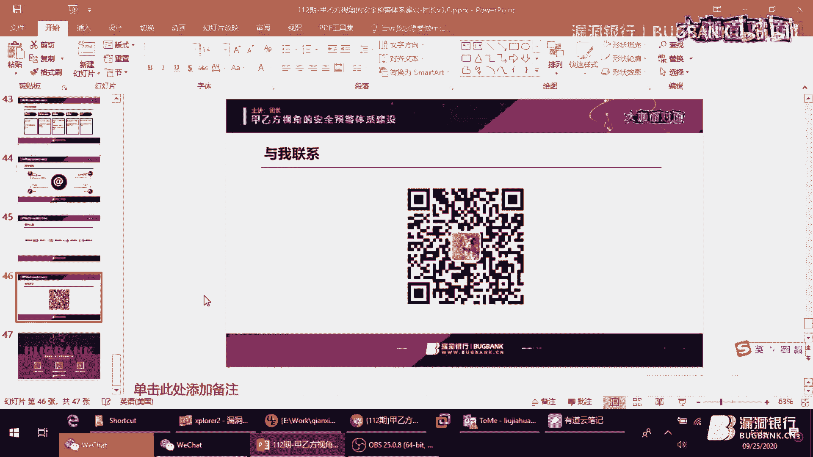
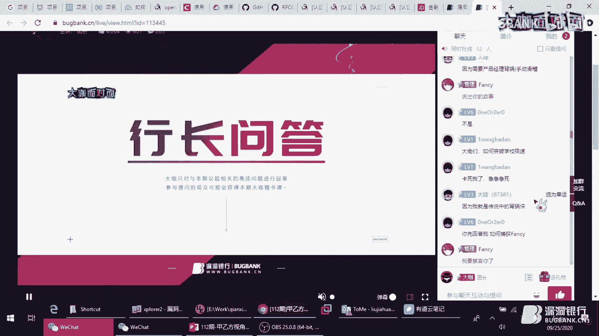

# P1：【录屏】112期-甲乙方视角的安全预计体系建设-团长_v2_脱敏 - 漏洞银行BUGBANK - BV1TA411E7Si

为知识而存，因技术而生。小伙伴们晚上好，欢迎大家来到漏洞银行heck show直播间，参加第112期打开面对面直播。甲乙方视角的安全预警体系建设。😊，我是今晚的主持人fancy。

今晚将要直播分享的团长大咖，有着多年的甲乙方安全工作经验。业务方向涉及病毒分析、外部安全和漏洞预警等等。现转型甲方安全体系建设，负责漏洞预警、安全运营、应急响应、零信任等安全体系的规划和落地。

那今晚的议题呢不是那种特别硬核的技术项议题，而是更加偏向实践经验类的分享。而且团长大咖也是一位演讲经验丰富的讲师，他将会化繁为简，并且结合案例和自身的工作经验。以生动的方式来给大家讲解。

所以这一次小伙伴们不用再担心，听不懂啦，相信大家都能从今晚的分享中学到很多关于安全预警体系建设的专业见解。另外，大家在登录直播间后，可以在聊天区里发言。听讲过程中有任何疑问都可以随时提出。

在稍后的问答环节，大咖会挑选高质量的提问进行解答，参与互动，还有机会获得大咖证书，企业安全建设指南、金融行业安全架构与技术实践。好啦，废话不多说，下面就有请团长大咖正式开始今天的分享吧，大家欢迎。😊。

嗯，那那我就开始了啊啊，像f自说的，今天的内容呢比较比较轻松，大家就嗯当故事来听。然后毕竟最近也是刚结束的那个最大型的攻防演练嘛，然后大家可能身心都比较比较疲惫，嗯，学习技术来，估计可能身体更吃不消是。

嗯。所以呢今天就准备了一个这样的一个主题，然后偏向于嗯偏向于偏向于规划方面的吧。哦，也没有不会涉及到工作的技术问题，所以嗯没有那么烧脑。嗯，大家就把自己当成老板，然后把我当成你你下面的员工。

你就当听下面员工给你做工作汇报就行就行了。按照这个心态来听就OK了。嗯，也欢迎大家多多指正我的问题啊。然后嗯左下方这个二维码，就是我的微信，然后有。有兴趣的小伙伴可以可以加一下我们。保持沟通，多多交流。

好，那我就进入主题了。

啊，今天讲的主题呢就是甲乙方视角的安全预警建设。啊，首先呢。先说一下这个乙方视角。介绍一下背景。嗯，现在呢啊我问大家两大家一个事情啊，就是2017年嗯安全圈发生了两件大事儿。大家有。

可可以可以发挥自己的发表自己的看法是哪两件大事？嗯，当然我这看不到你们你们的弹幕嗯。可以互动起来啊。然后我这边嗯我这边就总结了两件最大的事儿，我认为最大的事情。一呢是S2045。

当时这个漏洞的POC报出来之后，也是全网大范围的在打。而且最坑的是因为S2这个框架当时用的还非常广泛，很多嗯很多甲方，包括一些金融类的客户，就很重要的这个客户都用的这个s two的框架。

所以当时这个045报出来之后引起了很大的风波。啊，第二件事，我想可能有的人不认同我认为的这个第第第一个这个事件。但是第二个事件我我相信大家没没有意议吧，忘得快。当时真是席卷了全球的一个大事件。好。

这就是先介绍一下这个大背景。啊，当时出了这个事，我们是怎么应对的呢？因为当时也没有经历过这种大规模突发的大规模啊网络安全事件，所以我们也是实际上也是缺乏一些经验和准备的。当时的方法就是硬钢。

然后领导呢亲自带队，然后协同我们的产品，还有工程人员，连月连夜的通宵，加班去出方案，去解决客户的那边的实际的问题。啊，这也也是乙方所特有的一个一种一一个特色吧，永远都是在在在。在在这种在背锅在背后背锅。

好，所以我们当时的做法呢就这样了嗯。启动这个安全预警的一整个流程。首先呢通过这个有一个情报监控，然后去实时监控一些最新的一些一些动态。然后呢结合自己的技术分析，然后协同产品的一些防护和检测能力。

然后依托呢安全服务的能力，然后结合本地的这个人员的一个团队，然后最终把整个整个的一个预警的这个从头到尾，从云端从从后端嗯从乙方，然后一直传递到甲方。把这个整个的嗯预警的这个流程给他闭环啊。

去真正的去解决客户的测的一些问题。所以呢我们就准备了一套类似这样的。嗯，一套那个流程和方案，正所谓有备无患，你们要不打无北无准备之仗。好，后面呢下面就正式讲一讲这个。我们是在乙方是怎么做预警的？

首先呢就是说一下这个文档。嗯，文档是啥呢？就是其实现在大家经常会会在朋友圈啊，包括一些平台啊，经常会看到一些关于漏洞预警的文章。实际上这就是我们所说的文档。嗯，初期阶段我们在稿的时候。

前期也是做了很多模板调研，就是说我们这文档怎么写才更合适。嗯，也是调研了很多厂商的一些文档。嗯，当时发现了一些通用的问题吧，比如说有的。有的嗯有的有的厂商的文档可能更嗯。关更关注于这个技术缺少防护。

可能有的就是按照官方的一些通告去做执译。因为很多那个原原始文档都是一些英文的嘛，就做一些直译。而且好多呃内容都不是很详细，像我下面截图这个大家可以看一下影响版本，salSfeder这些嗯。

其实非常写的非常模糊，等于是你这样一份你这样一份预警预警的一些文章发给客户，他是不知道该怎么解决。嗯，我现在遇到的问题了。所以我们也是结合自己大量的依托这大量的这个客户群。

然后去梳理了一些甲方关于预警的一些需求。嗯，我这边总结了3点。一是。当漏洞来了，然后一是我有什么这个漏洞有什么危害。第二呢就是我我到底受不受影响。第三呢就是如果受影响了，我该怎么办？好。

为了解决这个甲方的三个需求呢。我们也是梳理了我们该怎么做。然后首先呢就是下面这个模板的的这个这个模板的这个这个结构呢，就是我们嗯当时经过了一番调研，最终确定的。然后第一部分就是漏洞概述影响范围啊。

检测方法，防护方法。后面还会有一些持续的一些跟进技术分析。最后呢就是结合产品的一些解决方案嗯。可以毫毫不夸张的说，当时这套模板是应该是呃开创了整个预警这这这个。这一块行业的一个立了一个标杆吧。

然后这套模板定了之后，后面很多的友商都开始模仿我们。而且现在大家看到的这个模型基本上都是按照这个这个套路来做的。Yeah。好，这个我们下一步就是质量把控。既然是公开对外发的。

那么这个文字不能呃内容不能有太大的一些偏差。嗯，我们通过主要是通过慢审快审，还有多次交交叉校对，还有就是最后就是惩罚措施的方法。去保证这个文文那个文字的质量。所谓慢审呢就是慢审的要求呢。

就是没有语病是最低标准，也就是我们一字一句的去读，然后去扣里面那些细节。快审呢就是嗯我们定的标准是这样的，就是以300字每分钟的这阅读速度呢，那读者不会有理解障碍，是什么意思呢？

这种场景就是应对那种嗯碎片化时间去阅读的那些人。比如说上下班路上的时间，然后刷一下公众号，他不会特别仔细的去看。如果一般都是速读，很快的去扫这个内容，嗯，大家也不会不会特别仔细的去去看。

所以呢这时候你的文字写的简单易懂是非常有必要的。然后第三呢就是交叉校对呢就是组内互审。嗯，小组内几个人大家嗯互相的去去再仔细的按照快审和慢审的方法去仔细的去查有没有什有没有什么其他的一些问题。啊。

最后就是惩罚措施，这个是一定要有。啊，也就是假如说啊出了文文章出了一些重大问题导致了那个。撤回之类的这种这种事件啊，我们全组是要罚钱的。所有组员，因为我们有交叉校队这个校这个过程，所以每个人都参与。

所以每个人都要都要负责任。然后同时呢向上连带三级，包括我们的从从我们的总监，再到网上副总裁都要罚钱。所以。所以怎么说呢？所以我们手下人也是压力也也非常大。所以这个通过这个惩罚来倒逼我们去做的更好。

因为谁也不想希望自己的老板掏这份钱是吧？老板掏完钱，你想想你的日子，后面日子还好过吗？嗯，然后我这边总结就是文档能力是非常重要的软实力。大家平时工作中可能会经常会用到这个经常会写文档。所以平时嗯。

大家可以嗯按照我这个上面说的这个标准，然后去自己去磨练自己的一些文档水平。啊，同时呢我再总结一句话，就是所有工程师到最后都是文档工程师。大家不信不信可以可以看。看自己后面会不会稳档的工作会越来越多。好。

下面来一个水糖测验吧，找病具。Okay。嗯，咱们先看第一段啊，大家可以踊跃的去。发言留言，虽然我看不到你们弹幕嗯。嗯，那我就先说了啊。大看一下第一第一段第一段这有啥问题吗？嗯，随我读一遍啊。

随着企业越来越重视服务器和应用漏洞，挖掘难度越来越大。知乎上有一篇帖子，现在网站越来越难渗透了，渗透测试这个方向有前途吗？这个介绍这种情况。那么接下来终端上的安全对抗将会是个趋势。大家有没有觉得？

不好的地方了。首先第一句就有问题，是不是重视什么？缺少宾语是吧？大家再仔细读，随着企业越来越重视，是不是感觉这句话没有说完。这是缺少宾语，这是很典型的一个嗯。中学的一个找病句的问题是吧，这是。然后呢。

我们再看第二段。第二段就是。这个这个例例子呢就是找的一个是一快审的例子，上面这个例子是一个慢审的例子，大家需要慢慢读才能体会得到。下面这个就是一个快审的例子，大家快速的扫回去这一段。嗯。

可能会发现自己没看懂他要表达什么主题是吧？我我这我这边我也读一下，大家感受一下啊。另外，随着网络层流越来越多流量加密，导致NTA监测失效EDR终端终端数据安全防护技术发展。

主机端上有安全agent也是个大趋势。终端测的趋势更是更新换代，服务器测试从无到有，开始部署HIDSIPS增强主机层防护检测能力。不知道大家听我读完有有什么感觉。有没有抓住这这一段要表达重点呢？嗯。

我对这这段话的定义呢就是嗯逻辑混乱。哦，没有体现不出这句话的要表达的中心中心思想。嗯，我我我呢对这一段做了一个简单的调整，大家可以作为参考。大家再听一下，我再读一下，然后改过之后的。

大家是不是就能更方便更容易去理解这句话要表达的意思呢啊。另外呢，随着网络从越来越多流量加密，导致NTA监测失效。所以主一端上有安全agent也是个大趋势。

EDRHIDSHIIPS终端数据安全防护技术发展。啊，增强了主机层防护检测能力，不仅仅弥补了终端安全在服务器侧的缺失，更代表着终端安全技术的更新换代。啊，这句话就体现了这个前后的一个逻辑性、因果关系。

所以大家更容易抓住重点。嗯，当然我改的也不一定不一定准啊，这只是一个案例样例。好，下面就是乙防建设这块的乙方视角的一个重点，就是对内能力的一些建设。首先呢你要建设一项嗯。

要想把把一项业务从无到有建建立起来了。首先嗯我觉得最重要的就是调研。嗯，我这边总结了一句话，就是当你不知道该做什么的时候，就多看看别人在做什么。调研呢这种工作呢也是周期性的，不是一次性的。

就是你做做完一次之后，建议每年再做一次，然后看看嗯看看别人在这一年当中都有啥变化。同时呢，当你业务进入瓶颈期的时候，也建议再做一次。也就是说你不知道该怎么突破的时候。也许我调研能给你带来很多思路。嗯。

然后呢就是一些情报的监控和下发。你们知道做预警，首先得有消息来源。我们消息来源呢主要是其主要的渠道还是官方发布的漏洞渠道。然后一些像第三方的这种各类新闻网站啊，第三方的这种渠道。嗯。

对于我们来说还是一个补充。因为毕竟官方呢是最可靠的，我们。嗯，我们贴一些参考链接的时候，肯定也从来不会贴那种第三方来自第三方新闻网站的这些文章，从来不会一般都是一些官方的渠道，就是首发的渠道。啊。

对于推动方式呢，我们当时也设计了两种，一种是通过邮件的方式下发。嗯，这个有一个好处就是方便回溯一些历史消息。啊，还有一个呢就是我们自己开发的一个微信机器人，这个呢最大的优势就是时效性比较高。然后呢。

我们有了销，我们有了监控员，下一步改就是一个。做一个可量化的评价模型的问题了。也就是也就是我们常常遇到一个问题，就是监测到了一些公开的情报。那么接下来该怎么处理呢？要不要启动预警呢？因为我们知道这个。

每每天这个漏洞非常多，你如果每个漏洞能去处理，肯定是精力是不够的。啊，而且同时啊也遇到一个很现实的问题，就是领导经常来挑战你，就是某某漏洞为什么不处理？好，这个时候一个评价模型的价值就体现出来了。嗯。

我这边提供一个解决方案，参考国家的标准，使用这个红黄那个红橙黄蓝四色的预警级别来对威胁进行定级啊，也就是什么大家经常听到那种天气的那种那个四色的预警是一样的。参考这个这个标准。嗯，那么我的问题来了啊。

这种标准是否合理呢？嗯，大家也可以踊跃的发弹幕，虽然我还是看不见。嗯。其实这种这种，那我就直接说答案吧，其实答案就隐藏在这个这一页的标题里啊。这种标准呢它的问题在于不可量化。也就是说我们每个人对看。

比如说像这个红色预警。判断为高风险。那什么什么样的风险叫高风险呢？还要影响客户广泛，什么到底什么样是算广泛或者是极大的社会影响力。这种什么叫极大？每个人对这种词的定定义还是非常模糊的。所以说。

以这种标准去评判的话，主观性就会非常强。所以你就很难说服别人。然后我们这边定的一个漏洞评价模型呢，就是要体现量化。你看左边大家以看左边这个这是当时我们定的一个主要参考的几个点啊。一是嗯POC是否公开。

这是可以量化的，就是零和一的区别。然后呢，互联网公开的情况嗯，这也是可以查的。比如像嗯我我们有自己的V胁情报。可以去查这个互联网上的一些端口啊，服务的开放情况。这是有有可以查到具体的数据的。

还有呢就是CVSS评分，这也是很量化。官方给的一个官方给的一个评价。啊，还有就是一个漏洞的一个类型啊，通过类型可以给这个数据，最后你评判的数据分配一个权重。比如说像命令执行类的漏洞。

可能就要可能就多给一点权重是吧？那新泄露的这种漏洞权重就会低一些。最后通过一个综合的一个算法，把这个针对一个漏洞算出一个评分来，然高于多少分，我们就启动一行，低于多少分，我们就就pass掉。

然后就会启动。其实我们还有一个还有一个还有一个情报体系，就会走一些情报体系，就不走运警体系了。右面呢这个大家看一下，这后面这几个呃评价模型都是一些官方给的。

比如像第一个这个就是微软的然str呢就是O o组组织给提供的。大家可以私底下有有兴趣可以去自己去查一下，这里我就不讲了。好，那么决定了决定了那个漏洞是不是。是不是启动预警呢？

后面呢就是进入了漏漏洞分析这个阶段了。啊，其实说来也比较惭愧，当时漏洞分析做的其实并不好，主要主要原因还是因为资源有限。嗯，说的再直白点，就是那个。部门里不给招人，不给招这样的人。这也没办法。

然后我们当时也是。想了两个招吧，一一是没有相关的人，那么就自己学呗。啊，但是这也是有有问题的，就是我们和每个人身上都并行着很多任务，特别是像像研究类型的这种任务，又特别占用时间。

所以我们很多时候这种效果并不好。只是应急的时候可以这样这样搞一搞。哦，然后呢想了一个长期的一个办法呢，就是打通公司的一个研究团队。也就是说也就是说给研究团队留作业，假如事儿来了之后，你搞不定你就甩给他。

让他给你去做一些专业的一些分析，然后给你一些结论。好，下面呢就是一个联动产品的过程了。产品的闭环率也是我们当时考核的一个重要指标。比如说像一些检测类的产品，就是漏洞来了之后。

我们要提供给客户提供一些检测的方法。也就是刚才说的一个客户需求之一就是。嗯，我怎么知道我有问题，就是漏总来了，我怎么知道我我到底受不受影响，所以这就需要一我们的一检测的方案。

比如说比如说可以结合给给漏扫团队去提供一些需求。比如态势感知的团队和云端检测的团队提供一些嗯提供一些检测的方案。然后让他们去从产品层面去实现。然后呢，防护类呢就是我们也会提供一些防护的一些建议。

比如说呃呃于POC的一些分析。或者是对一些端口的一些封禁，或者或者是一些那个像一些升级的方案。嗯，如果产品方产品像IPSIDS这种防火墙wauff能做的话。

我们会把一些检测会把一些防护的一些思路会提供一些产产品团队，让他们去做。啊，同时呢我们其实和。嗯。和这些情报也是。联系也是非常紧密的嗯，我们也是给情报团队提供了很多很多很多信息。

因为我们也会有嗯刚才说的也会有一些监控的渠道嘛，我们也是等于是我们也是那些情报团队的一个输入员。好。嗯，刚才说的是漏洞预警，其实我们大部分遇到的预警类型都是漏洞型的预警，实际上还是有一类比较少见的。

虽然说不多，但是也有就事件型的预警。事件型预警主要是目前我们遇到的就是最多的就是恶意软件。然后还有一些低do类的攻击，然后还有一些供应链的攻击。这三类应该是用遇到的比较多的。啊，实验型预警有它的特点。

就是它往往并不是什么大规模官方公开的一些事件，都是一些。比如说在行业内流行的一些事件。嗯，这又有有一个问题啊，这就是我们怎么去拿到这种就是小圈子内的一些信息呢？我们的办法呢就是打通那你响应小组。

就是和影响团队去建立一个长期的一个合作关系。然后从他们那边去呃拿一些最一手的资料啊。因为公司的应急响应团队是经常奔赴在一线，然后客户那边出了啥大事儿，都是这个小这个团队去过去处理。

所以呢他们对于一线的这些事件型的预警，还是事件型的事件。事件型的预警，他们是有很多的情报的。好，这一。下面说一下推广。我们整个方案定出来之后呢。嗯，当然也不能不能让这个让本着这个价值最大化的原则。

我们要利用最。最广的这个渠道去进行向外对外宣传。这也是我们当时做的也比较比较多的一个一项工作吧。我们一个最重要的一个大也是大家感知度最高的就是公众号。嗯，但我我们的这个公众号呢定位就是内容专注。

只发运营相关的文章。所以所以我们后台的这个读者质量还是还相对来说还是比较高的。而而且我发现一个现象，就是慢慢的我们这个公众号也变成了别人的监控员。就是开始开始有爬虫来爬我们了。

这是也比较有意思的一个事情啊。啊，同时呢这个当时主要是还是为了专注于这个内容。慢慢的延申了两个我们到一开始也没想到的一个两个点，一个就是。这公众号慢慢的做成了一个商务接口。

因为你是直接可以对外的嘛啊然后陆续的就开始有一些客户的咨询了，还有一些业务合作的一些一些合作机会，慢慢的就通过公众号为入口，然后去寻寻求这个。慢慢的就有一些商务机会了。

同时呢这个通过运营呢也积累了一些数据。嗯，呃通过这个后台公众号的一些数据啊，也会可以给我们提供很多参考。我们也是嗯。在去年的时候吧，去年的时候做了一次运营分析的一个年报。嗯，提供这个。工号云数据。

占了很大一部分比重。好，下面一个渠道呢就是打通公司的营销线。啊，原则呢就是让专业的人干专业的事儿，然后利用公司现成的渠道去做一些推广。哦，公司营销线的推广渠道也是很多的。啊。

这里嗯特别特别说一下这个最后一个吧，就海外推广渠道，这个还是还是我觉得是别的公司可能不具备的一个一个一个条件。我们公司也是有自己的一个国际版的博客。包也。

然后公司也会提供专门的翻译小姐姐给我们去做一些英文翻译。啊，比如像右面这个截图，就是一篇翻译成英文的一篇文章。啊，讲的是thinkPP的一个漏洞。嗯。嗯，除了这些呢，还有一些其他的一些渠道。

比如说把我们的产出灌输到一些我们自己的产品里。比如说微业情报啊，还有一些平台类的产品结合，然后让买了我们嗯产品的一些客户也能感知到啊，还有第二呢就是一些公开对外的。

比如说像这个我们伟大的这个漏洞银行的这个平台是吧？公益通过一些公益宣讲的方式。啊，第三呢就是我们自己还研发了一套我们自己的发布平台。啊，说到推广有几个有两个地方需要注意啊，就是法务问题要注意。嗯。

特别是特别是嗯有想做自媒体的新媒体的这种小伙伴，嗯，特别要注意这个这一点，因为很多人就容易犯这个错误。一是版权问题。嗯，像版权像一些商标啊，一些品牌啊，这个大家应该都知道，还有知识产权，大家应该都知道。

我就嗯不说了。我这里需要提醒大家注意的是有三个点，一是图片，二是字体，三就是颜色。啊，什么意思啊？就是除了除了除了这个版权，除了商标以外，像图片也是有版权的。就是我们从互联网上随便找的那些图。

我是不我们是不能随便用的，图片也都是有版权的，还有就是字体。字体之前也是因为那个方正是吧，然后把把一个公司告上了法庭，是不是因为字体侵权。那这个大家一定得注意。啊，第三个有颜色什么意思呢？

实上颜色呢就是我们每个公司都有自己的主题主题色。我就比如说你看漏洞银行，这个，你看看这PPT这个背景，这紫色，这实际上就是一种主题色。这个实际上也是有版权的。我举个例子，比如说你要想。

打着漏洞银行的起旗号出去做宣传，结果你把漏洞银行的logo颜色配错了。那么你这也是要吃官司的。啊，第二个要注意的问题就是广告法，我们搞自媒体的一定一定要。嗯。书读广告话。比如说像里面这种罪呀。

第一啊、领先顶级啊，这种词是坚决不能出现的啊，这种出现了，大家就现在市面上有有专门有一波呃靠这个吃饭的公司啊，就是各种搞这种。各种搞这种嗯宣传文案，写的写的不好的，或者是触犯法律的这种。

他们去从中赚这种赚黑钱。啊，为了解决这个问题，我们也想了很多招。比如说像解决字体的问题。颜色的问题，我们可以通过全局CSS去去做一些控制。啊，对于图片呢，还有一些版权问题，我们就。采用最最直接的手段呢。

就是买花钱买。同时呢也制定一些标准模板，就是把我们的一些，比如说像像字体颜色什么的就。固定到一个我们的嗯模板里面，就防止大家就是每个人都用自己的一套嗯一套一套规则去写，然后每个人都不一样。

还容易遇到法律风险。然后最后呢，就是对编辑人员要进行必要的培训，这是非常重要的。好，下面这一块讲的就是一个赋能的过程，就是我们。嗯。我们的产出能体现出什么价值呢？嗯。

很多时候我们做工作其实也要经常反思自己自己的这个工作，就是我们的工作。价值点在哪里？就是你这个工作意义在哪里？假如说给你砍掉了，把你这块业务砍掉了，或者被你被优化了。然后。

你得让公司嗯公司到底会不会觉得心疼？所以这就是要体现你的价值，赋能就是一个很重要的一个点。嗯，首先呢就是我们把自己的一些处置过程中产生的各种各样的经验。然后。嗯。积累到自己的知识库里面，方便后面就查阅。

同时呢我们呃做一些漏洞研究的时候会。产生出很多的中间产品。比如说像我们的这个漏洞复现的环境，还有就是漏洞利用的是E叉PPOC。嗯，这些都是可以作为一个经验的积累。然后呢。

就可以我们还是像上面说的产品闭环，我们还可以为产品提供很多检测防护的思路。啊，最后呢就是我们把我们整个研究的成果向一线传递啊，通过全员培训的方式啊，去体现你的价值。好。刚才说了也这么多。

其实大家应该也嗯。也多少有点了解。其实我们嗯。有很多工作实际上是要和其他部门联动的是吧？比如说像应急响应刚才说的，然后还有一些结合要要需要一些研究团队的支持。啊，然后讲到这工作汇报了是吧？啊。

其实工作汇报最主要就是为解决一个问题，就是。解决这个因为漏洞不是经常有嘛。然后假如说你一周没有发漏洞，领导就会觉得你没有干活是吧？有。要跳出这种这个怪圈里，所以你要体现嗯体现你的工作价值和工作量。

所以数据呢就是一个非常重要的一个指标。然后呢说一下这个团队设置。嗯，根据刚才说的一些我们的业嗯业务方向啊，主要分为了这4以下4个一个岗位。一是情报分析师专门负责这个做一个情报研判的，也就是一个技术岗。

第二呢就是工具的开发。比如像比如说像一些情报监控的一些工具化，还有一些内部业务自动化。啊，还有一些像漏洞利用的这种武器化啊。一键修复的这种这种工具呢，都是需要有一些研发人员来支持。啊。

第三呢就是有要有这个运营专员，因为有很多跨部门协调，还有一些啊公众号的一个维护。嗯，还有各种数据化的分析啊，这些就需要一些运营人员来来做。最后呢是一个产品经理，为什么需要产品经理呢？

这个我先给大家卖个关子，后面大家可以先考虑一下，问这个为什么要需要一个产品经理。这后面我会专单独来讲。啊，这个小图就是我们当时整体的一个流程啊，其实其实是个大图啊，看不清楚是吧？简单说一下。

就是嗯我们这整个流程呢就是从启动从发现，从监控发到发现啊，然后再联动各个部门。比如像。嗯，研究团队产品团队。然后还有启动公司的一些应急的一些应急的流程。然后最后呢。还有联动公司的一些营销啊，培训啊。

一线客户。啊，一线一线我们的一线兄弟，然后最后呢到用户啊，实际上我们看到这个整个的这个。通过这个预警的这个大流程，去把这个各个部门去串起来。好，下面呢就是我们遇到的一些挑战。啊。

最大的挑战呢就是监管来自监管的压力了，大家应该很清楚。之前嗯工信部，还有网信办都对外公开发了一些漏洞，关于漏洞的一些管管理办法是吧？啊，特别是有特别是那个网信办之前发的嗯。

明确的说预警两个字不能不能不能用预警两个字。啊，其实当时也发生了一些很很有意思的事情啊，就是当时这个因为这网信办发了这个。嗯，调纹之后呢，当时连续两个月嗯整个安全圈都安静了，没人再发漏洞了。好。

第二个来自第二个那个挑战呢就是。就是来自一些友商的一些一些一些情况吧。比如说像我们一年一度的这个大事儿是吧？刚刚结束的这个大事儿。啊，各方都在积极备战啊，就会导致导致这个。

各个乙方公司安全公司手里都手握着大量的一些呃零被漏洞。也就是说我们现在面临的问题呢，就是信息来源越来越少，但是的漏洞却越来越多。好，下面呢就是。讲一下这个乙方视角的一个服务产品化。这个就是刚才我说的。

为什么需要产品经理这个角色。因为我们毕竟是一个站在乙方视角来看的话。你毕竟是要为公司来赚钱嘛。所以说你做的事情要得嗯对公司来说得有得有产出才可以。最直接的就是你能你的业务能卖钱，能变现。嗯。

现在也是流行一个趋势了，就是叫。嗯，服务产品化。然后反过来呢，对于产品来说，反也有一个产品的一个服务化。也就是说现在产品和服务是实际上是分不开的。啊，也是就是这接书书接上回啊。

就是刚才说的一些来自监管上的一些一些挑战。我们现在漏洞越来越多了，但是我们的情报却越来越少了。嗯，这就是一个很很直接的一个一个问题。但是呢我们也做了一次乐观的绿测。当我们的信息来源减少的同时呢。

对于客户来说，他的信息来源也少了。也就是说，客户实际上他是也是有对于这些情报有需求的。所以那个时候呢，我们当时接到就接到了很多。嗯，接到了很多关于这方面服务的一些咨询。啊。

有很有很多客户表示愿意呃付费来购买。我们嗯也是接了一些定制的一些预警项目，所以所以也是通过一些定制项目来收集了很多用户需求。哦，为我们把这个服务做成产品啊积累了非常多的一个一些经验。嗯。

搞产品呢我们就得有有管理体系是吧？这个呢其实参考了这个华为的这个IPD的一个产品管理一个模型一个流程。嗯。这个我就我就不细说了，主要是分为一个预言立项，还有一个开发阶段然。

开发阶段还会有定期的那个呃产品review的会会议。啊，最后呢就是一个服务结项服务发布的一个流程。啊，我们产品试水的第一阶段，就是刚才说的，我们有自己的自研的一些渠道。比如说像这个就是其中一个。

去公开我们发的一些。分钟。啊，第二阶段呢就是一个商业化的阶段，就是我们会提供一些呃后台的定制服务。比如说给客户提供一些高位的漏洞通告啊，比如一些漏洞的一些汇总啊，当天的一些漏洞的一些汇总情况啊。

还有一些行业事件的一些通告。主要还是以这种知识付费的模式。好，最后呢就是一句话总结乙方视角的漏洞预想。啊，我们的宗旨呢就是。希望能在一线落地，然后帮助客户真正的解决漏洞带来的危险。但事实上。

经过我们的实际运营啊，发现。其实并没有做好。为什么呢？好，下面我们来看一看甲方对于安全预预警的一个。建设思路。甲方的视角。其实最大最大的问题，为什么在乙方做不好安全预警呢？做不好漏那个客户侧的闭环呢？

就最主要最主要的原因是我们没有。没有实际的资产资产信息。比如说客户那边的情况我们是不了解的。他有什么有什么产品，有什么呃用了哪些用哪些服务，然后他的一些。啊，他的一些这个资产的情况我们都是不了解的。

所以说你要是在甲方做安全意警建设立安全意警的体系呢，首先重中之重。第一点就是要做好自己的资产管理。就是首先我们要清楚我们都有哪些资产，然后这些资产里头嗯要丰富我们的资产属性。比如像我们的嗯IP属性。

端口域名、网段系统中文件业务是吧？包括你的这个服务器的部署位置，还有最重要的是一个负责人，这些东西一定要越权越好。也就是也就是我们当遇到了一些嗯突发的事件，我们能快速的定位问题，问题出在哪。

然后找到对应的负责人。啊，后面才能去推动解决问题，这才是闭环的一个关键。啊，同时呢我们要做好甲方的一个安全呢，我们还要有有一些我们的自动化的一些工具。比如像代码审计，做白科测试，代码审计啊。

从嗯从代码层面去发现一些问一些漏洞。然后呢，一些黑盒测试漏洞扫描，我们去主动的去。嗯，去探测一些我们没没有发现的一些漏洞。然，还有针对一些重大突发漏洞，我们还有自有要有自己的1个POC应急扫描。

也就是说呃要结合前面的这个资产管理。举个例子，比如说像外 logic又暴漏洞了。嗯，我怎么能快速的定位哪些哪些资产有这个问题呢？啊，结合资产管理，我们把外包这个标签的所有的呃资产信息IP信息。

我们全全搜出来之后呢。然后把我们的POC导入进去，然后结合我们资产管理去自动化的去扫描，然后来判断这些资产到底有没有问题。最后呢这个基础支持呢就是一个嗯SCMDB啊。嗯，CMCMDB大家应该都听过。

叫资产管理系统。然后我们这边。给这个资产管理系统做一个定义叫SCMDB，也就是安全资产管理系统。它呢也是在资产管理系统的一个基础上呢啊去结合业务，然后增加了一些安全需求。比如说像这个POC应急扫描啊。

或者是一些像一些白盒代码审计啊，漏洞黑盒的漏洞扫描，都可以集成到这个安全CMDB里面。啊，去提高我们的一些工作效率。还有一些就是包括一些因为结合了呃结合了一些像负责人这些的信息。

我们还可以实时的去推动问题。比如说发现了问题，我们可以在第一时间通知到那些负责人。嗯，这要结合每个公司要结合自己的具体业务去设计。同时呢我们重中之重要制定自己的一个流程和制度。

比如是比如像现在最最流行的这个两套流程呢，一是安全开发流程，就SDL。然后还有就是呃d赛ops炒的比较火的，前段时间炒的比较火的概念啊。啊，就是一个运维流程。

还有就是要有我们对于漏洞应急的一个突发的处置流程。同时呢也要配合相应的一些制度来对啊对一些员工的一些，比如说像员工的一些行为啊，或者是是像我们的这个新系统上线啊。

去做一些安全的安全的一些最基础的一个意识的一宣贯吧。让大家都让大家了之后提高自己的安全意识。要明白这个安全无大小是吧，什么事儿都。要从这个意识上去解决。然后呢，这也是甲方供应链管理。

也是甲方比较特有的一个特色。这样这些在乙方可能都会遇不到遇不到的一些问题。就是我们可能会有很多外采的一些产品。假如说外采的产品出了问题怎么办？就会影响很多这个供应链条。啊，为了解决这个问题呢。

我们也是从流程上做管控。然后结合公司的一个采购流程，然后去提提对一些第三方厂商去提一些安全要求。比如说。比如说我会会要求那个厂商提供嗯。提供这个黑盒和白盒的测试报告。

或者是第或者是一些评委那个权威机构的一些评一些评测，或者是我们自己亲自去评测。啊，还会提对些厂商提一些安安全一些嗯。必要的一些安全要求。比如说像不允许用一些包危的一些组件啊啊。

这些都可以写在啊写在我们的制度里面，直接作为非标象。假如说你不满足，我就不考虑你的产品。总之就是把。安全。贯穿到整个流程，在各个流程里做一些安全卡点。毕竟这时候作为采购方，我们是甲方嘛。

我们甲方还是有很大权利的，是吧？啊，下一个是这个组织架构。其实嗯按照正确的正确的逻辑来讲啊，我们应该是先有组织后才有的各种各样的一些流程。实际上实际上从呃从我在讲解整个。

这份这一份这个PPT的这个逻辑上来说，应该是先有组织，先应该先讲组织。但是为什么我把它放在后面了？其实主要原因还是因为很多时候我们在做事的时时时候，在做事之前。其实根本就没有没有想好我们要怎么做。

也就是很多事儿，实际上是做着做着才开始摸清楚套路，摸着石头过河，慢慢的把体系建立起来。也就是说我们是先做事儿，后线组织。啊，像了这个。在公司有一些权威的机构啊，去推动一些安全的工作。

其实还是非常有必要的。因为很多时候我们嗯我们都知道安全在公司一个地位就是。特别是做甲方安全的，大家应该都感同身受。虽然要。从公司高层层面上来，建立一个能主导能决策、做安全决策的一些组织。

比如像安全委员会啊，产品研发委员会啊，或者是像一些。批色的组织，这产品解决产品安全问题的，还有一些我们像公司内部的一些色的组织。好，这个马上就要接近尾声了，这就是一个最后的一个过程了。

就是一个嗯我们漏洞运营的一个过程。啊，同样和乙方的。从乙方的那个也差不多。首先我们得有自己的一个渠道来源是吧？漏洞侦查。然后呢，就验证我们有哪些资产有有问题，有漏洞。哦，就是定位问题的一个过程。

然后第三呢就是但定位到问题，你就要要推动修复。这这一步呢就要。需要我们要明确责任人。同时呢要给他设置严格的SLA响应时间，就是你要保证在多长时间内。嗯，修复完成。就要用一些强硬的一些制度是去去要求。

然后修复完之后呢，我们会启动一些复测的流程。嗯，好，就嗯特别是针对一些特别是针对一些产品漏洞，嗯，可能还会涉及到最后的一个步骤，就是一个漏洞披露。

就是说像最最典型的就是这两天嗯各大各家安全公司的安全产品都会爆出一些漏洞问题是吧？然后各个厂商也会嗯启动一些对外公开的一个漏洞披露的一披露，就是给大家做一次公关嘛。

就个大家嗯官以官方的口感去解释一下这事到底怎么回事。嗯，这也是一个嗯。也是一个比较比较有特色的一个一个一个点吧。好，那今天啊我要讲的就就这些了啊，这是我的一个二维码。大家有兴趣可以可以加我的微信来交流。

嗯。OK我演讲结束，谢谢大家。好，OK那我重新上麦了。嗯，感谢团长大咖嗯，果然内容非常的丰富啊。那可以呃可以说是一份保姆级的这个预警体系建设指南了，内容非常全面。啊，大咖也辛苦啦。

那接下来是我们的一个互动问答环节。在刚刚我们认真听讲的小伙伴们可能针对今天的内容，还有一些疑问，想要向大咖请教。那下面就进入行长问答环节，大家可以继续在聊天区里面发送你们的问题。嗯。

大咖会选择一些高质量的提问来进行解答。参与聊天互动，还有机会获得今天的大咖证书。呃，企业安全建设指南金融行业安全架构与技术实践。😊。

嗯，所以现在我们就请团长大咖打开直播间来看一下大家有什么问题。嗯，好的。我去爬楼看一下啊。可以。😊，啊，看来还是有有很多人跟我互动啊，当时就是嗯提的对现场提的一些问题。啊。

大家可以有啥问题可以直接发弹幕，我是能看到的。嗯，可能中间因为卡顿时影响了一些体验是吧？这个非常抱歉。嗯，还好吧，问题不大，我们抢救的及时嗯。我，看群里呃看来有有有同名相连的小伙伴是吧？

需要产品经理背锅。嗯，我看到这个问题了，就是这个流程啊。我可以再翻回去看一下，其实李方的这个建设流程，这只是一个我们当时建设的一个思路。这个图因为因为比较小，但看不清楚。

这就是一个呃在乙方里做预警的流程，实际上就是联动各个公司的各个部门去怎么把这个流程打通，是吧？嗯，可能前期要做大量的沟通工作。

可能要涉及到自己的产品，涉及到研发啊，涉及到这个研究啊，涉及到对外的一些营销推广。然后还有你们。嗯，很多乙方的一些客户是吧，就会涉及到非常多的这些部门。这就是一个乙方的一个大体的流程。对于甲方的流程呢。

主要就是这个最后主要就是也是最后的这个图。然后最最终结底，其实我对于这个运行体系。我是我个人是这么定位的啊，就是刚刚说的也不一定对。我个人定位这个漏那个预警体系，实际上就是一。就是一个。

漏洞生命周期管理可能说的比较狭呀。这实对于甲方来说，最后就是落地到这个漏洞运营上面，是怎么把漏洞从发现到到修复，啊后再到这个对外的一个公开的一个公告的过程，要把它给跑通。

然后当然这个如果你要能做到这一点，必不可少的，一定要做一个自己自己的资产管理。就是你要清楚自己有哪些资产。你才能定位有哪哪里有问题，是吧？然后怎么突破这个。怎么突破这个体系呢？

实际上这个预警体系并不是一套防护体系。嗯，呃这个实际上更偏向于业务吧。

就是假如说嗯今天讲了谁主要目的也就是。未来这个小伙伴们可能有可能会有身兼重任的这种可能是吧？或者甚至可能也真的有很多level比较高的。嗯，我我在这里先就就是观我面前耍大刀了啊。

就是可能未来要是有机会去承担一部分业务的建设。可能今天的内容可能会大家对大家会比较有用。其实突破的其实我理解啊，突破的这个体系并不是一个预警体系，而是。啊。根据我目前的一个掌握情况。

大家应该突破的应该是一个纵身防御体系才对。啊，坐人防御体系嗯，有机会下次还可以跟大家聊一聊啊，今天啊时间关系我就不说了，因为这个要说的话话也比较多。嗯，大家还有啥要要聊的吗？对。

小伙伴们如果有什么问题的话，现在都可以跟啊团长带咖多多沟通。我看到有个小伙伴问晚上的测试任务一周推几次，这个是问我们平台发个 bank那个公众号吗？还是团长大咖，还是还是跟今天团长大咖的内容有关系的？

我感觉你好像是在问我们平台的，嗯，是吗？嗯是。😊，是吗？你是问我们平台的那个公众号吗？因为我们呃我们平台那个任务上行，每次会有公众号推送的。嗯，我可以简单透露点商业数据啊。嗯，根我根据我们之前的这个。

这个经验大概是一周一周会预警一次比较大的漏洞。嗯。然后每一年都会每一年这个每一年都越来越多，就是这个频率会越来越快。看一下这个问题。哦，这是这样的，这个渠道是吧？渠道其实是。

其实是做预警最最重要的一点就是它因为它是驱动，有了数据才能驱动后面整个流程。因为他是一个开头。这渠道呢是这样，就是我们有自己的一套。嗯，现在说爬虫叫叫违法了是吧？我们不能这么说了。

我们就有一套自己的监控系统嗯。主要呢就是嗯。主要呢就是盯着那些啊官方的发布一些一些信息。这个时效性还是非常高的。啊，当然这种小圈子也是小圈子来的这个渠道也是非常也是不可忽视的。其实我们。呃。

非常惭愧的说啊，因为刚一开始刚才刚开始搞这段这嗯这一套事儿的时候，嗯，研发也是。嗯，也是没有没有那么多的资源去做研发。那个时候基本上靠人工。啊，渠道基本上基本上靠朋友圈。嗯。

而且这种小圈子来的这种信息通常也都嗯。嗯，怎么说呢？可通常可能也都价值会相当相对来说更高一些。嗯，还有还有别的问题吗？加我QQ，我是凡喜凡译发的，我还以为哪个小伙伴发的呢。没有了。

是我大家还有什么问题吗？关于今天的议题内容，或者是你们别的一些嗯，不管是学安全还是工作方面的问题，其实也都可以跟我们团长交流一下。因为团长是一位安全工作经验非常丰富的大佬，就是大家有什么问题。

今天都可以。向他请教一下，哎，算不上大佬。你有谦虚啊。现在基本上。每天的工作内容就是在键盘上弹钢琴嗯。う。啊，我们突然沉默了，应该。看来应该是今天因为今天的问题也没有啥那个技术上，主要是技术上的难点嗯。

对我觉得而且就是。对你讲的就是特别清晰了，我觉得就是基本上都能听懂，应该。所以今天的内容我觉得他们也不会，估计也是因为这个原因，所以提不出太多问题嗯。现在讲的非常好。挖栋现在。很少了。嗯。

其实我之前也打过呼啊，攻击队参加过，然后成绩也还不错嗯。这都哎这都是曾经的曾经的辉煌历史了，现在也不搞这些东西了。现在主要是做嗯甲方的这些安全建设。比像最近就在推公司的一个零新任的项目。嗯，哎能听到吗？

能能听到能听到哦，说屏幕不动了，我还以为我这又卡了呢。大家大家现在卡吗？是不是有卡？如果卡的话，可以直接在弹幕里面说我们。可以调试的这个大家也都可以随时有问题也可以随时提出来。

大娃大娃刚刚说听了今天团长内容，对于他这个创业党来说真的觉得很有帮助。你要不要再交流一下创业方面的经验？哦，有我创业的师傅是吗？要不带带我吧。Yeah。二进制安全。二进制安全嗯，我上一期分享过嗯。

我应该上一期分享的就是这个主题的。当时是嗯。偏向于病毒分析吧，还不是那个漏洞这块。而进制这块其实入门门槛还比较高的。首先你得要了解。了解汇编也能看得懂汇编。然后呢。然后呢。

你还要了解一些操作系统的一些运行机制。嗯，其实涉及到的涉及到的那个东西还挺多的。因为很多时候你要分析二进制，可能要要去抠细抠细节了。比如说一个字节一个字节的这么去分析。啊，任重而道远。啊。

红蓝也打过红蓝嗯在客户那边有一些客户会买我们的那个红蓝对抗的服务。嗯，现在做甲方安全，也就是我们自己也会搞一些红蓝。对，刚刚我们团长大咖说的，他之前在大咖面对面第94期也是他我也也是我们团长大咖分享的。

如果感兴趣的小伙伴也可以去看一看之前的录屏，我们官网上也都有的。嗯，感谢原件课代表已经把标题发出来了。😊，好，大家还有什么问题吗？如果没有的话。今天时间也差不多了。

然后我们团长大咖真的是答回答大家问题好详细啊，简直就是金牌售后。收获这么好，对你回答的真的好详细啊。😊，你膨胀你完全可以膨胀。好，大家还有什么问题吗？要不再等大家。😊。

这样吧，我倒数十0个数好吧，如果大家没有提问的话，我们这个环节就差不多结束了。啊，如果有问题的话，现在赶紧提出来啊。1。有巴知。没有。54321好，看完大家。😊，看大家是不是都交流的差不多了，好吧。

那我们今天呃就时间也有限，今天的答疑环节就到此结束了。那非常感谢团长大咖耐心的解答。大家如果还有问题的话，也可以私下在交流讨论。那刚刚我们大咖也留下了他的微信嗯二维码嘛。😊。

要不那个团长，你你再把二维码放一下。好，如果他们有想要和你交流的话，对，可以直接加他的微信。然后呢呃呃也欢迎大家加入我们漏洞银行的官方交流群。群弟也有很多呃友善又热心的安全爱好者可以与大家一起交流。

技术学习成长。

那我们呃下面就抓紧时间进入下一个环节吧，也就是我们小伙伴们最期待的赠书环节。我看到弹幕已经有人在说抽书抽书了。好好好好，来了，本期证书是由团长大咖精晶挑选的企业安全建设指南、金融行业安全架构与技术实践。

😊。

团长大咖，你能不能就是简单的说说为什么想送这本书呢？啊，这本书嗯因为是我个人觉得是做，假如说你做我我以前是乙方嘛，然后现在是转甲方安全了。然后甲方这应该是一个，我觉得是甲方安全里涉及的面还是比较广的。

虽然说它是一个金融领域的，但是实际上做任何甲方安全都可以参考里面的一些。一些很好的经验。我在。嗯，这是一本比较偏甲方安全的一本书是吗？对，企业企业安全建设。

然后作者呢也是嗯OK圈子里比较有名的聂军大哥是吧？大家应该很多人都知道这个人。啊，所以就是我们小伙伴们如果有正在从事呃这方面工作，或者说将来有意向从事的，真的可以好好把握一下这个机会了。

我们团感大咖极力推荐的这本书。好，那究竟谁会是那个被选中的幸运的小朋友呢？团感大咖，你现在就在直播间里选择一位呃你喜欢的你或者你看着顺眼的，或者是你觉得互动比较积极的就听讲比较认真的，反正你选就可以了。

啊选择一位幸运观众，对，点那个选为幸运就可以了。😊，嗯。OK我现在就点了。好点吧。几位啊选几位，你选的是谁只能选一位对吧？你还你还想搜几个只能选一个。对。😊，哎呀，我忘了。好看看一下，还有。5。

你选的是哪个？瞅一下他的ID。突然找不到了，咋整？对的。那我这边看一下，因为选了之后后台嗯有记录，别慌，我看一眼。呃，是这个。直播间的ID12698，名字叫一。一王王八蛋一王八蛋，我不是在骂你。

这是他的ID就叫这个。好吧。一王八蛋，就是刚刚那位有提问题的小伙伴。嗯，好，对，是他吧。是他吧。对对，是他是他一王什么的。😊，好的好的，那恭喜这位直播间。😊，对不起，恭喜说，为什么在ID为一网八在的时？

😊，恭喜你成为今晚的幸运观众，请你根据我们直播间的提示，留下你的联系方式，或者直接在呃直播结束后私聊我们任意一位你喜欢的运营小姐姐来兑奖也可以。那其他没有中奖的小伙伴们也不要灰心哦。

因为我们开面每期直播都会送出一本书。所以说今后还有很多的机会的。😊，好了，那亲爱的观众朋友们，今天团长大咖的技术分享就到这里啦。最后大咖你有没有什么话啊想要跟大家说的，我们差不多结束了哦。

因为还有嗯嗯最后想说的就是因为一年一度的这个安全圈的大事结束了，是吧？呃，也祝大家好好休息嗯。哦，听好好好，没有，不占用大家时间了嗯。可以，这是一个很实在的一个祝福啊。好。

那最后再次感谢团长大咖的用心准备和精彩演讲啦。啊本来按照惯例呢，我们他们的录屏应该是下周五发布嘛。但是因为下周五正好是在国庆假期期间，所以本期直播录屏的发布时间暂时不确定。我们公司毕竟也是要放假的。

所以我们可能会提前也可能会延后，这个还不确定啊，因为我们的录屏啊导出和剪辑也需要一定的时间啊，我们表姐能会努力一下。如果时间来得及，我们就在放假前发，来不及呢，我们就等放完假再发了。好吧。

所以确切的发布时间，还要请小伙伴们关注官网更新或者群内通知。好，再次感谢团展大咖，也感谢每一位观众伙伴的支持和陪伴，谢谢大家。😊。

如果你也想像大咖一样直播分享，就快来找我们报名吧。大咖面对面是一个展示白毛风采和分享技术知识的舞台，这里不具年龄，不为自利，只要你有才华敢分享，我们都欢迎好啦，今天的直播到此就全部结束了。大咖面对面。

周五8点见，我们下次再见吧。大家拜拜，早点休息，晚安，也提前预祝大家中秋节快乐，假期愉快。好啦，团长大咖，你这边可以停止推流了。いて？🎼有的我。🎼The two couldn。

🎼me more than the。🎼到有可。🎼Here is。🎼放そ。🎼Somebody。🎼有可。🎼いたな。🎼Is。いや。🎼いかれくれ。Because？🎼心不。🎼那个。Yeah。🎼我し。🎼歌送。🎼F。

🎼的分。

