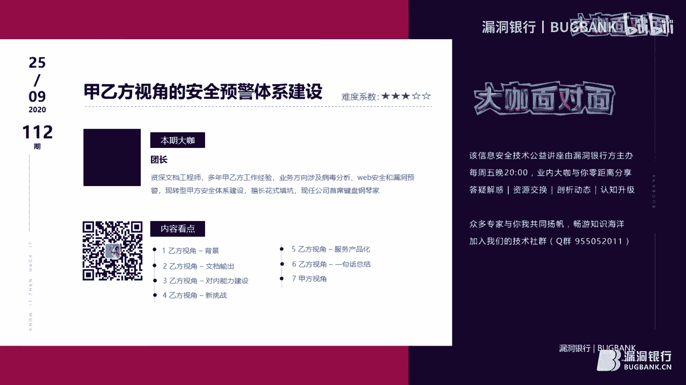
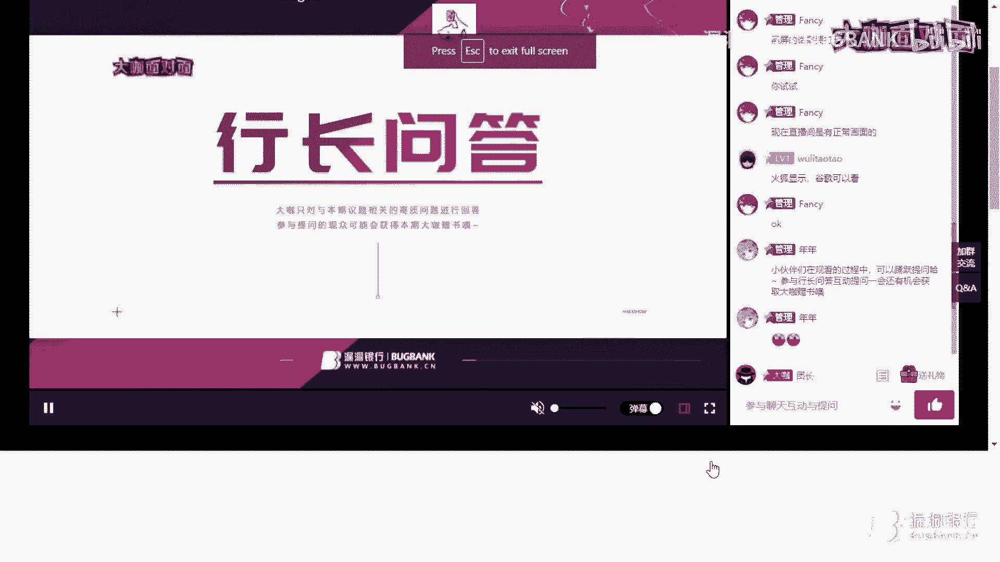
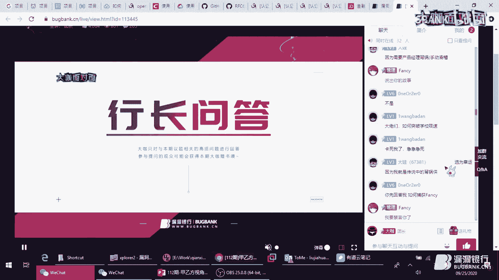

# 课程P1：甲乙方视角的安全预警体系建设 🛡️

在本节课中，我们将学习如何从甲方（企业内部安全团队）和乙方（安全服务提供商）两种不同视角，规划和建设一套有效的安全预警体系。课程内容基于实践经验分享，将化繁为简，结合具体案例，帮助初学者理解预警体系的核心概念与建设流程。



## 概述

安全预警体系是网络安全工作的“雷达”和“警报器”。它旨在及时发现、评估和响应各类安全威胁与漏洞，从而将可能的损失降到最低。本节课将分别剖析乙方和甲方在构建这套体系时的不同侧重点、核心流程、面临的挑战以及最佳实践。

---

## 第一部分：乙方视角的安全预警建设

上一节我们概述了课程目标，本节中我们来看看作为安全服务提供商（乙方），应如何构建一套能够服务众多客户的安全预警体系。

### 1. 背景与挑战

2017年，安全圈发生了两件影响深远的大事：
1.  **Struts2 S2-045漏洞**：该漏洞利用广泛，对大量企业客户构成严重威胁。
2.  **WannaCry勒索病毒**：席卷全球的网络安全事件。

当时，乙方安全团队缺乏应对大规模突发安全事件的经验，通常采用“硬扛”的方式，由领导带队，协同产品、工程人员通宵加班，为客户解决问题。这种被动响应模式催生了建设标准化预警流程的需求。

### 2. 核心预警流程

乙方预警的核心目标是将威胁情报从云端传递到客户侧，形成闭环。基本流程如下：
```
情报监控 -> 技术分析 -> 产品防护/检测能力协同 -> 安全服务落地 -> 本地团队支持 -> 客户侧问题解决
```

### 3. 预警文档的标准化

一份好的预警文档是传递价值的关键。甲方客户最关心三个问题：
1.  漏洞有什么危害？
2.  我是否受影响？
3.  如果受影响，我该怎么办？

以下是经过调研和优化的预警文档标准模板结构：

*   **漏洞概述**：简要说明漏洞基本情况。
*   **影响范围**：明确受影响的系统、版本。
*   **检测方法**：提供客户自查的具体步骤或工具。
*   **防护方法**：给出修复或缓解措施的建议。
*   **技术分析**（可选）：深入的技术细节。
*   **解决方案**：结合乙方自身产品的防护方案。

### 4. 文档质量把控

为保证对外发布内容的质量，需建立严格审核机制：

*   **慢审**：逐字逐句检查，确保无语法错误和歧义，这是最低标准。
*   **快审**：以每分钟300字的阅读速度通读，确保读者在速读时不会有理解障碍。
*   **交叉校对**：组内成员互相审查。
*   **惩罚措施**：出现重大错误导致文章撤回时，实行连带责任制，倒逼质量提升。

**文档能力是工程师重要的软实力。** 所有工程师最终都可能成为“文档工程师”。

**病句修改示例：**
*   **原句**：“随着企业越来越重视服务器和应用漏洞，挖掘难度越来越大...”
*   **问题**：“重视”缺少宾语，句子不完整。
*   **修改建议**：“随着企业对服务器和应用漏洞的重视程度越来越高，漏洞挖掘的难度也越来越大...”

### 5. 内部能力建设

建设业务，调研先行。应周期性调研行业做法，为自身工作提供思路。

**情报监控与下发**：
*   **主要渠道**：依赖软件/设备厂商的官方漏洞发布渠道，确保信息权威。
*   **下发方式**：
    *   **邮件**：便于历史消息回溯。
    *   **微信机器人/即时通讯工具**：时效性高。

**漏洞评价模型**：
面对海量漏洞，需要可量化的模型来决定是否启动预警及响应级别。
*   **避免使用不可量化的标准**（如“影响广泛”、“风险极高”），这类标准主观性强。
*   **应采用可量化的指标**，例如：
    *   POC/EXP是否公开（是=1， 否=0）
    *   互联网受影响资产数量（通过扫描获取具体数据）
    *   CVSS评分（官方定量评分）
    *   漏洞类型（如远程代码执行赋予更高权重）
    *   结合算法公式计算综合风险分，根据分数阈值启动相应流程。

**漏洞分析**：
在资源有限的情况下，可与公司内部专业研究团队建立联动机制，将深度分析工作“派单”给专家团队。

**产品联动**：
预警的最终价值需要产品功能来实现闭环，例如：
*   **检测类产品**：为漏洞扫描、态势感知等产品提供检测规则。
*   **防护类产品**：为WAF、IPS等产品提供防护策略或虚拟补丁。
*   代码示例（概念性）：`IPS.update_rule(vulnerability_id, new_protection_rule)`

**事件型预警**：
除了漏洞，还需关注恶意软件、DDoS攻击、供应链攻击等事件型预警。这类情报常来自小圈子或一线应急响应团队，需与内部应急响应小组建立紧密合作。

### 6. 成果推广与价值赋能

建设好的体系需要推广才能价值最大化。

**推广渠道**：
1.  **自有媒体**：如技术公众号，专注优质内容，可吸引高质量读者，甚至衍生商务机会。
2.  **公司营销线**：利用公司现有的市场、销售渠道进行推广。
3.  **产品集成**：将预警信息输出到自身的安全产品（如威胁情报平台）中。
4.  **外部平台**：通过漏洞银行等公益平台进行技术分享。

**法律风险注意**：
推广时务必注意：
*   **版权问题**：包括图片、字体、公司主题色的使用，需购买版权或使用免费授权资源。
*   **广告法**：严禁使用“最”、“第一”、“顶级”等绝对化用语。

**价值赋能**：
将预警工作中产生的知识（漏洞环境、POC、分析报告）沉淀为知识库，赋能给产品团队、一线服务人员及客户，通过培训等方式体现团队价值。

### 7. 团队设置与整体流程

一个完整的乙方预警团队可包含以下角色：
*   **情报分析师**：负责情报研判。
*   **工具开发工程师**：负责监控、自动化工具研发。
*   **运营专员**：负责跨部门协调、内容运营、数据分析。
*   **产品经理**：负责将预警服务产品化，实现商业价值。

整体流程是一个串联公司内多个部门（研究、产品、营销、服务、客户成功）的协作网络。

### 8. 挑战与服务产品化

乙方预警面临两大挑战：
1.  **监管压力**：相关政策对漏洞披露和预警提出更规范的要求。
2.  **情报来源减少**：重大攻防演练期间，各方手握大量未公开漏洞，导致公开情报减少。

**服务产品化是破局关键**。当公开情报减少时，客户对情报的需求依然存在，甚至愿意付费获取定制化预警服务。这要求团队以产品思维管理预警服务，参考产品开发流程（如华为IPD模型），从定制化项目入手，逐步将其标准化为可售卖的安全产品。

**乙方视角总结**：乙方预警体系的宗旨是希望在一线帮助客户解决实际问题，但往往因缺乏客户的具体资产信息而难以完美闭环。这引出了甲方视角建设的必要性。

---


## 第二部分：甲方视角的安全预警建设




上一节我们了解了乙方如何构建面向广泛客户的预警体系，本节我们将视角转向企业内部，看看甲方安全团队应如何建设贴合自身需求的安全预警体系。


### 1. 核心基础：资产管理

甲方建设预警体系的重中之重是**资产管理**。必须清楚掌握自身的所有资产（IP、端口、域名、系统、业务、负责人等）。这是后续所有应急响应动作能够快速定位和推动的基础。理想状态是建设一个**安全资产管理系统（SCMDB）**，在传统CMDB上增加安全属性和管控能力。


### 2. 技术能力支撑

在资产管理基础上，需要一系列自动化工具作为支撑：
*   **白盒测试**：代码审计，从源头发现漏洞。
*   **黑盒测试**：漏洞扫描，主动探测风险。
*   **POC应急扫描**：针对突发高危漏洞，结合资产标签快速定位受影响资产并进行验证扫描。
*   代码示例（概念性）：`scanner.scan(asset_list.filter(tag=“WebLogic”), poc=latest_cve_poc)`

### 3. 流程与制度保障

技术需要流程和制度来落地：
*   **安全流程**：推行安全开发生命周期（SDL）、DevSecOps，将安全嵌入研发运维流程。
*   **安全制度**：制定员工安全行为规范、新系统上线安全要求等。
*   **供应链安全管理**：将安全要求嵌入采购流程，对第三方产品提出安全测试报告等要求，作为采购的否决项。

### 4. 组织架构支持

安全建设需要高层支持。应推动建立公司层面的安全决策组织，如安全委员会，从顶层推动安全策略和资源的落实。


### 5. 漏洞运营闭环


甲方的预警体系最终体现为**漏洞运营**的闭环管理：
1.  **漏洞侦测**：通过内部工具和外部情报发现漏洞。
2.  **影响定位**：基于CMDB，快速定位受影响的资产和责任人。
3.  **推动修复**：明确修复责任人与修复时限（SLA），强力推动。
4.  **修复验证**：修复后进行复测，确认问题解决。
5.  **漏洞披露**（如涉及自身产品）：必要时进行对外公告和公关。

**甲方视角总结**：甲方安全预警体系的核心是 **“基于精准资产的闭环运营”** 。它高度依赖内部的资产管理和流程制度，目标是将外部威胁情报与内部风险管控高效结合，真正解决自身的安全问题。

---

## 课程总结



本节课我们一起学习了安全预警体系建设的双重视角：
*   **乙方视角**侧重于**情报的广度、分析的深度、服务的标准化和产品的闭环**，核心挑战在于如何将通用能力与客户具体环境结合。
*   **甲方视角**侧重于**资产的精度、流程的刚度、响应的速度和内部的闭环**，核心基础是完善的资产管理和内部管控流程。


无论从哪个视角出发，建设一个有效的安全预警体系都需要将技术、流程、人和管理有机结合。对于从业者而言，理解这两种视角的异同，有助于更好地开展本职工作或进行跨角色协作。