# P1：【录屏】ByPassWAF安全狗、云锁自动化注入——第十一期大咖倾旋分享 - 漏洞银行BUGBANK - BV1ur4y1K7zX

好了我们继续啊，这块反正是刚刚开始嘛，第一章了已经，然后这个cd呢就是用来做这个嗯网络负载均衡内容分发的呃，提高这个用户对这个访问响应速度，还有命中率嗯，他现在扩展的这些功能呢呃有关于安全的。

还有文件缓存的等等等等啊，这个原理呢给大家先看一下嗯，这边有三个三个客户嘛，然后他们各个地方都有一个cdn节点，然后最后这边到达这个web服务器，假设客户在浙江的话。

他的这个请求会经首先会呃经过这个cdn节点，cdn节点呢它在分发就是说呃分发到一个离你最近的这个呃这个线路，然后去到达这个服务器端，这样的话就少走很多路啊，这个速度呢会比普通。

就是说假设你这个很远的一个服务器，比如说国外啊等等等等，这些速度会非常快啊，就是提高了用户的这个响应速度，嗯他这边有几个特点呢，就是文件缓存，还有缓存静态文件，使这个访问速度加快嘛。

啊就这些我们平常看到那些图片啊，呃c s s啊，还有g s这些文件，还有静态的html文本文件，它都会缓存，那么他们识别这个用用户是否更改了这些文件呢，一般都是用来做那个呃文件的指纹，比如说嗯哈希值啊。

对不对，那个还有一些md 5值，只是一些就是最基本的一个概念，然后还还还还可以隐藏这个网站的真实地址，保护这个服务器的安全，你像这个服务器端，你只要不知道这个服务器端的地址。

那么这三个客户在就是三个地点啊，任意访问这个服务器的话，他们都会就是直接访问这个cn节点，剩下的注意就是经过cd节点再把这个数据再发送给服务器端，服务器端在处理完再发给这个cd节点，吉林杰也在处理。

把这个数据处理完，就是再返还给这个客户端，那整个过程都是经过这个cdn节点c d解解，就相当于一个中间人，还有加快我就是访问速度等等等等，我们再往下看啊，首先第一点呢呃是这个绕过就是架构层少写了一个字。

架构层绕过waf给大家先看一下，呃，我只是简单列了几个几个就是几个内容内容点啊，呃静态层呢我给大家先给他截图一下，因为这个内容比较，我大概把这个我们就是渗透测试的这个呃外部框架列了这么四个层。

你可以有更多的层啊，就是根据根据这个人理解了，in test呢就是我们经常访问的js啊，图片，html啊，还等等的一些就是静态文件，他们由这个服务器端返回来的这些内容都是不是动态的。

然后这个动态层呢就是这些p p p p s p a s p a s p啊，等等的动态脚本语言，而且还就是构建了一些开发框架，对不对，jsp有这个spring框架，ph p有这个就是lo，还有一些e框架。

还有think pvp这些开源框架呃，服务器层呢我们用这个开源的阿帕奇，还有个s还有n g x这三种比较常见的web服务器，然后系统层的就是windows linux啊，那整个我们在渗透测试呢。

它这个权限有没有感觉到就是从静态层一直向系统层延伸的，就是权限会从小到大嗯，就是当你真正就是刚开始接触渗透测试，可以从这个静态层慢慢了解，然后学习啊，一步一步像这个系统层进发，你就像这个静态层js呀。

html等等等等，html它不是有一些那个嗯节食嘛，就是页页面劫持啊，就是用js来做的嘛，动态叫这个就是js可以让这个简简单这些文本节点，然后动起来做一些动画，对不对，那g它引发了一些安全隐患。

就是一些呃那个反射xxx啊等等，就是dom x x x那x s可以留到这个静态层学习呃，动态层呢一般就是文文件读取，对不对，文件上传还有一些变量覆盖啊等等，这些就是代码审计的内容。

我们也可以放到这个动态层来学习呃，像这些语言它都有各自的特性啊，d版本的pvp也有很多这个缺陷，然后这个服务层就是阿帕奇啊，sn gx等等，阿帕奇呢它有一些解析漏洞，对不对，s也有，gx也有。

那你可以在这个服务层上面先去，就是让他了解了解呃，系统层呢就是我们平常说的有些溢出啊，对不对，还有提权呀等等等等，你可以放到这个层面去学，所以你只要是你入门这个生存测试，可以把这个层心理清楚。

就是在大脑中有这概念呃，其实还有一个就是网络层，网络层它这个你可以了解一个大致就是tcp ip协议，还有ios模型这些去看一看，你就大概知道你这些数据它是如何走他的这个走向，还有这个服务器端如何处理的。

这个过程，平常在遇到一些问题的时候，就很好解决了，然后呢，第一个呢我们一般就是绕过这个外服呢，假设就是这个服务器啊，他自己在这个域名上加了一个cd n，我们就是第一个就是查询这个历史的dns解析嘛。

然后第二个就是查询这个子域名解析地址是否和主域名的ip地址相近，然后再查这个c段，就是慢慢去测试，然后第三个就是社工d，这个就是比较苛刻了，还有就是cdn节点的分发缺陷。

有的是各个有的地方它没有节点会直接指向这个真实ip地址，知道了吧，那么我们拿到这些真实ip地址呢，如何绕过这个cd呢，就是呃直接就是来一个那个啥本地的这个house文件修改一下就可以了。

就是直接就是把这个数据发送到这个这个服务器上，不经过cd n了，这个cd他就他的这些防护措施都没有，都没有用了，懂了吧，然后就是第二个就是匹配资源大小限制，我们呢就是我们一般在访问网站的时候。

大部分都是两种请求，一个是get，一个是post get方法，提交的数据长度大小没有限制，只是说是浏览器和限制的，你的这个浏览器里面的地址过程，浏览器就是发送不出去了，或者造成一些呃崩溃啊等等这些问题。

嗯那外服在处理get请求的时候，他会就是有可能会根据这个客户端的浏览器规定的长度去匹配，他可能认为就是比如说这个长度是1000个字符，1万个字符，浏览器规定的是，比如说是500个字符。

假设你提交了1000，就是1000个字符，剩下500个字符就是外服，他是不会不会去处理的，就它只处理前面500个字符，这就达到了一个攻击效果，还有pos它有没有大小限制啊。

它的这个限制作用就是服务器的处理程序的这个处理能力，可能就是根据这个网络带宽，还有服务器的这个呃硬件硬件配置，还有这些环境的一些优化，对不对呃，如果在这个pv p。

假如p h p进行这个pos提交的时候，那么这个配置配置文件里面它的这个最大的字节就是最大的，你请求的这个数据大小就是两兆字节呃，如果就是说你提交一个就是八兆的。

或者说大于这个就是你当前这个服务器端能接受的这个字节的话，那wife的话他就不会去匹配剩下的一些东西，那这个脚本语言它就根据这个脚本语言他自己的配置，然后再加上web，他认为他能取多少去匹配的。

中间它会可能会造成一些偏差，知道吧，假如我这个服务器配置说只能接收八兆的字节数据包大小，那么web呢它只处理就是说两兆或者四兆，那我剩下的这是8-2=6那六件，那剩下的六兆也是发送到服务器端的服务器。

当它也接收，因为它最大是八兆，对不对，那么剩下的六兆我们可以在里面填充一些，就是呃攻击，那么这个外部它也是拦截不了的，这这些都是以前的老的理论，就是以前那种老外婆，他是一般现在你去去用这些方法。

它是不起作用的，就是完全就可以绕过的，那么现在呢他们这些外部的一些产品就是慢慢的已经很强大了，我们再看就是协议为正确解析这个是什么，我给大家慢慢讲一下啊，我要我要换个表情，算了不发了。

可以可以可以这么读，我只是个人记个人就是喜欢这么多，好了吧，这是一个数据请求，可以看到这边我查询了一条数据，对不对，这是一个get请求，我们现在把就是啊拦截打开哦，安全果的拦截。

有的有有的同学可能都没用过这个软件。

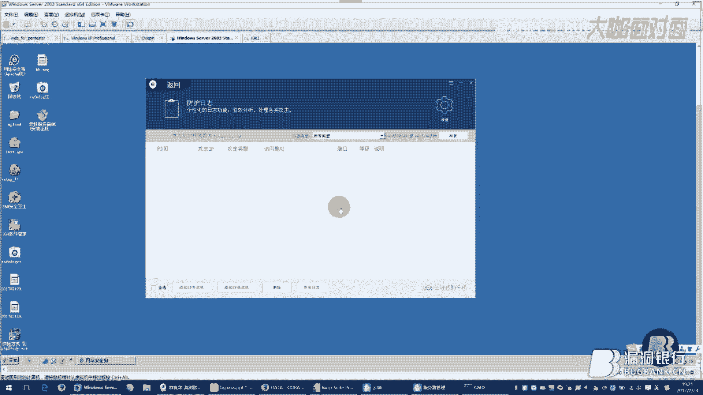

好的我们我们看一下，在后面就是假设来一个按1=1，二打一等于他没有拦截，我再调试一下，重启一下，不要让我难堪，对不对，一般开车我都不翻车的，所以大家配合一下，啊可以看到它已经拦截了。

就证明这个安全狗已经起作用了，已经起作用了，可以看到这个cookie里面装了一个云锁，那云锁这个拦截防护没有开，我们先从这个这个协议方面讲起啊，我们先不讲猪肉什么的，呃，假设这是一个页面。

我就访问一个普通的页面，然后这个页面就是响应回来，那么这是一个get请求，而我的当前脚本呢它只接收就是一个get提示的就是i d i d的这个值，假设我发送一个post的请求。

就是他这个u r l也是帮我传值的，就是这个地址也是帮我传值的，懂了吧，那么他也是可以查询出来，比如说我查询一，查询一对不对，他把第一条也是查询出来的，可见就是说这属于这是属于一个方法污染。

就是假设你这个get请求可以接收到带的行秋可以接收掉，我们直接用post就把这个地址里面就是船上参数直接post的过去，这样脚本他也是接受的嗯，还有一种就是一些其他的参数污染，比如说cookie啊。

或者说我们把cookie设置一个非常非常大的一个值，然后我们go一下，有时候它会出现一些错误，因为这个语法是错误的，我们把这个字符放大一点，字符放多一点，这样可以看到它也是可以处理的。

就是有些外国他是承受不了就是这么大的数据包，或者说一些其他参数的污染，那么就需要定位它的匹配，匹配了一些关键字，知道吧，就相当于我们做免杀一样，秒杀不是要定位就是特征码吗，这是我们定位这个拦截特征。

然后再进行绕过，这就是大概这么个意思啊，现在就是给大家演示那个上传上传，演示上传，这是选择一个文件啊，抓包什么的，大家应该都会啊，千万不能发到我的小黄片，我们找一个一句话木马嗯，这个代理我打开一下。

然后这边是点上传，可以看到这个数据包已经走进来了，我们放到repeter这里面测试啊，你看啊我们先测试他这个拦截点在哪里啊，先测试它的拦截点，我们改成一个p c p，你看它拦截500，看到没。

这证明也拦截，我改成一个txt啊，你看他拦截不拦截，改成一个t s g是上传成功，对不对，呃，我们要做的就是把这个p p t文件上传上去，该怎么办呢啊有一种就是把一个文件呃，把这个双引号改成单引号。

或者说不写引号等等等等这些，那么他匹配的时候，他的正则是什么，我们在下面写啊，这个vr p带带正则啊，带正则，然后fname对不对，一个等号后面是，一个双引号或者一个单引号，对不对，然后后面是一个字符。

后面是跟上n个点，对不对，我们先写一个简单的任，然后后面是我们的一些正常的一些文件，其他t对不对，然后p h p啊，不是p h p g p1 p，然后是g pg，这是一个简单匹配啊，然后我们把这个n。

t t t x已经取出来之后呢，证明这个正则就是可以做一个就是简单的拦截，你看啊这个政策该怎么绕过呢，该怎么绕过呢，我们假如改成一个单引号啊，你看啊，这个后面肯定也是要带这个单引号或者双引号的。

你看到他也是匹配匹配到的，你看啊，假设我这个正则加一个双引，加一个双引号，单引号可以看到它已经不匹配了，知道吧，我给大家再截图一下，他已经匹配不到了，那我们放到这个里面了，看一下它的规则。

我们把它改成p h p，可以看到它也拦截了，就证明他这个单引号双引号，就是说已经就是无法绕过这个外服了，但是可以看到你这非要name了，他肯定就是匹配fil name后面的这个值，对不对，呃。

前一段时间我就是i n a他不是讲过吗，就改一些前面的一些内容，或者说填填充一些垃圾，这是垃圾纸，知道吧，我们那个博客也是讲过的啊，所以说现在假设如果把这个单单引号和双引号去掉的话。

我们看一下能不能成功啊，可以看到它也是拦截的，那假设我在后面加一个这个呢在http协议里的http协议里头，就是他前面是一个键值，就这个feel your name，它是一个键，然后这个等于号。

后面是一个value value，就是值吗，键对应值，然后后面是可以允许加分号的，知道吧，就是一个分号，那么到这个pv结束的时候呢，这个阿帕奇他会把这个封号自动去除掉，知道吧，那么pv他接受的就是n。

p c p，也就是说他会直接写入这个文件，我们看一下，看到没，就是直接绕过了他这个上层拦截就是已经成功了，那可以看到之前我们就是可以采用hp就是参数污染啊，我给大家写到ppt里面。

htp参数污染就可以调用，就是使用使用多个无用的纸或者重复的是提交到数据包中，达到攻击，这是这是呃叫什么攻击效果，这个是取决于web服务器的特性，这是我自己的理解，你们可以看着是喷我一下，知道吧。

然后呢就是这个值我们也可以在前面填充一些其他的指纹，比如说feel your name，大家听说过那个双文件上传没有，双文件上传，它的原理是什么，就是后面的一个值把前面的一个值给覆盖了。

就相当于提交了两个非要内容，我们在这里面试一下啊，把这个分号去掉，然后面改成一个t h p，可以看到它也拦截，比如说现在双文件已经不行了，但是你也可以多加一段试一下，我们把双文件的数据包给放进去，n。

ppt，是这样的，对吧，然后把这个放在最后面，然后这些呢是两个数据包，对不对，两个数据包我们再把这个p p c p啊啊，不用改，直接提交，可以看到它也是拦截的，这个是大概那个双文件的上传数据包。

就是在数据包里面也可以做到的，也就是说这个参数污染已经不行了，我们再试一下，再试一下，就是在这个feel your name后面也再加一个fname，我看对，就是这个我们先购入一下。

我在这个feel your name前面加个feel your name，fil name，前面是一个图片吧，我们改成图片，然后后面是一个p h t，可以看到它也是拦截的，完全不行啊。

这是一种参数污染啊，就是把两个相同的值放到就是重复一遍，最后一个值它会接受最后一个值，但是这个取决于web服务器的特性，阿帕奇他可以做这个参数污染ngx。

大家可以就是查一查他到底是接收第一个值还是第二个值，就是相同的，他到底接收第一个值还是第二个值，然后我们再往下走嗯，到了，这个c输入先给大家就是过一遍简单c输入呃，大概有这么四种，大概有这么四种。

如果你有更多的话，我们就先不扩展了呃，首先就是union注入联合联合查询嘛，但是他要求的是资源数目必须相同啊，还有不值输入，他们必须要参与这个逻辑运算，然后去穷举，我们要得到这个数据。

然后time就是时间输入，要根据这个web的这个响应时间，就是说你这个数据库方面他没有处理完毕的话，这个脚本会一直等待，那么脚本等待呢这个阿帕奇也会等待，阿帕奇等待呢，他这个数据就不会返还给你。

这个客户端了，懂了吧，那这个error呢就是数据库bug错误处理方面的，这个数据库bug呢也有人提交过，但是这个就是数据库房数据库，他们这些就是程序员的那些生产商吗，算是生产商。

他们并没有就是说去着重就是做这些错误处理啊等等等等，那有可能去卖其他其他的产品去了吧，我们再往下看啊，这里面我是今天用的一个mysql环境，mysql加p6 p l加阿帕奇，阿帕奇是2。24的。

然后大家现在看ui输入在在这个文件夹水煮，我把这个代理给关了，我们直接用手工。

嗯我把这个安全狗先关了。

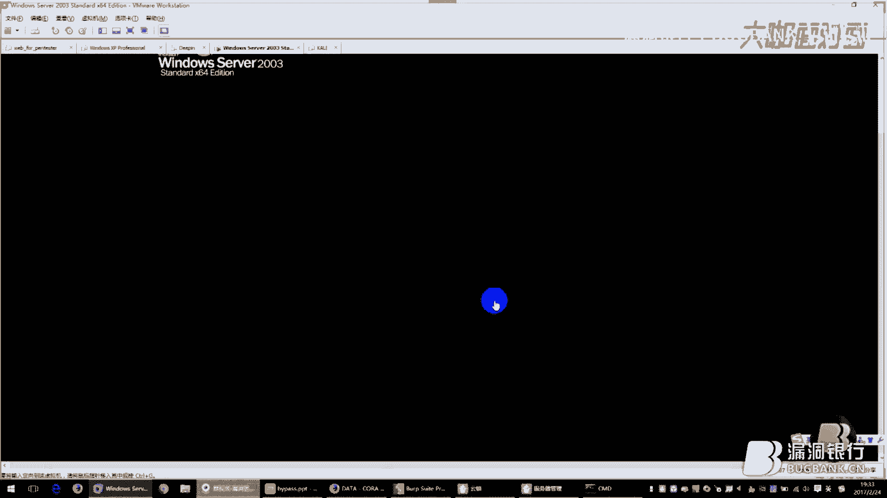

先从就是不过狗就是不过这个外国先先来练习一下，给大家讲讲这些原理啊，我把这个房费关了，好了防护已经关闭了。

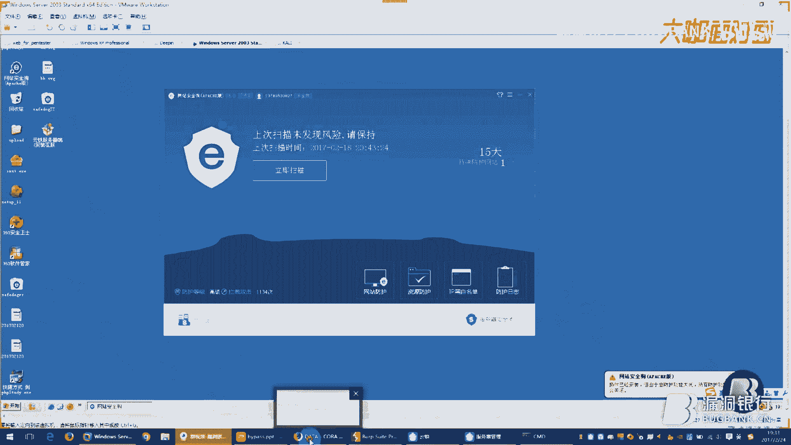

我们现在先看一下，这是查询第二条，我们的查询第一条看到没，它是可以运行的，而且最后一局也是输出在这里面的，嗯，我们现在先就是假设先来一个按的1=1，对不对，看看能不能能能不能输入，对不对。

这个2=1=1，还是有必要讲到后面再讲，我们现在先就是优点输入，首先就是先判断当前这个表的字段数目到底有几个，一般用order by，或者说直接用union联合，这样的，那么只要他不报错。

我们可以继续往后加，知道吧，这个不是说是必须是123等等等等，我们是一全部都是一，也可以，全部都是字符，也可以知道了吧，比如说逗号s还是都是可以的，然后我们要让前面的语句报错，看到没。

我这个内容就已经放到这个内容，就是网页里面了，给大家讲一下，为什么要让这个语句报错，我先把这个。

终端打开。

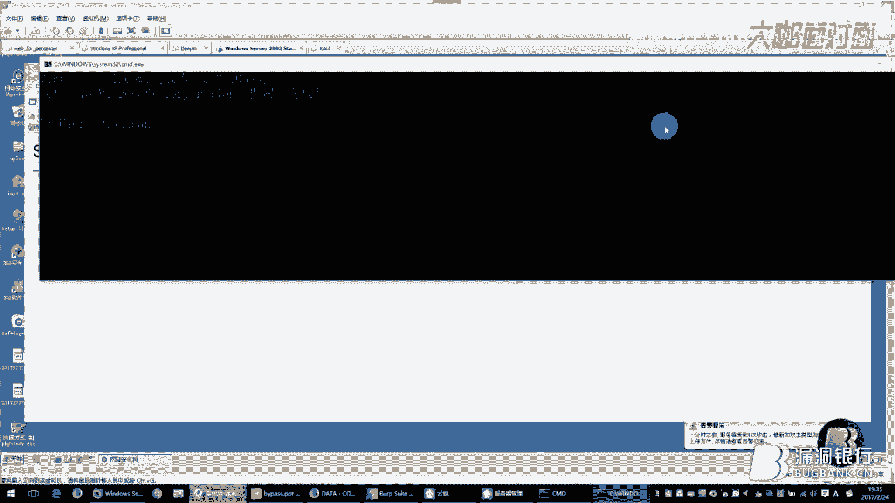

现在大家都能看清楚吧，在这里面我创建了一个数据库的子账号，它没有肉的权限，但是我pvp它用的是肉的权限。

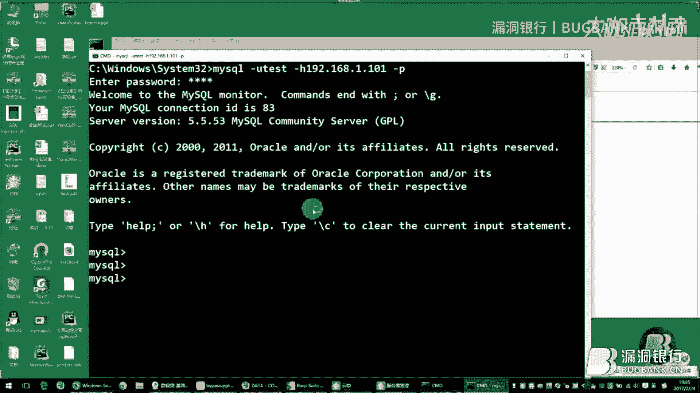

我们现在现在看我们先使用一个，就是就是调到这个数据库里面，然后看一下还有这么一个表，然后这个表里面呢可以看到他放了两条数据，对不对，我们把那个刚才那个web上面呢就这个条件写一下，id等于1度的。

i d等于一，然后呢我在后面又加了个ui，对不对，大家可以看啊，他到底返回了几条数据，可以看到它返回的是两条数据，这就是说为什么我让我要让前面的这个语句报错了，就是说让前面的查询返回一个空。

大家可以看什么是空号，什么时候就是空，结果就是查询一个不存在的一个条件，比如说where id等于三，我们有三六条记录，看到没。

他就反了一个emt，就是说这条记录返回的结果是空，你可以看提交一个三，它是空的，意思就是在到pp这里面，它反映的是一个数组，这个数组它常用出来的全部都是空。

知道了吧，不会把这个查询结果格式化成一个数组，我们在网上看，我们假如让前面的这个报错，它会返回第二条数据。

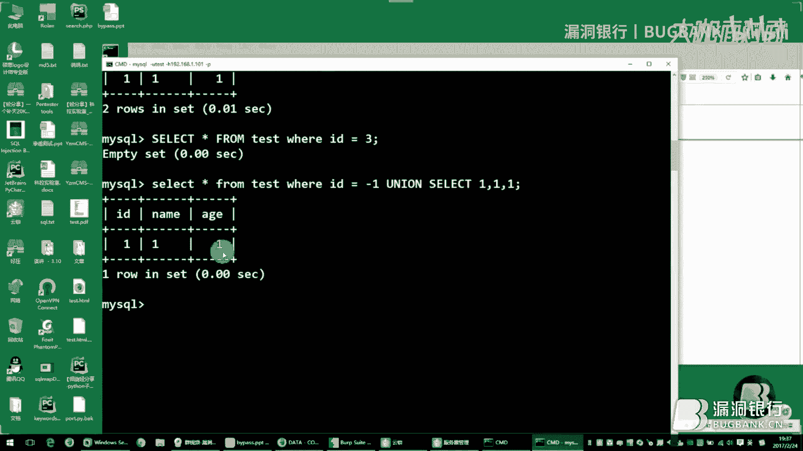

这就是为什么我们要把这个就是前面这条参数值变成一个负数，或者说其他条件，知道吧。

只要让前面的查询不出来，它就会返回第二条数据，其实它默认情况下，如果你这些条件都符合的话，它会返回两条数据，懂了吧，那我这个unit select呢，我们也可以调用，就是mysql的一些全局变量。

这个大家不陌生吗，数据库版本对不对，我们也可以查他的当前用户名，对不对，这是用户名，我们可以查他的数据库名称，就是用data base这个函数，我们也可以就是甚至可以用他的数据库来做一些其他操作。

比如说做一个md 5加密，看到没也是可以用的，就是说这个数据完全就在你的掌控范围内了，知道吧，只要你对这个数据库比较了解。

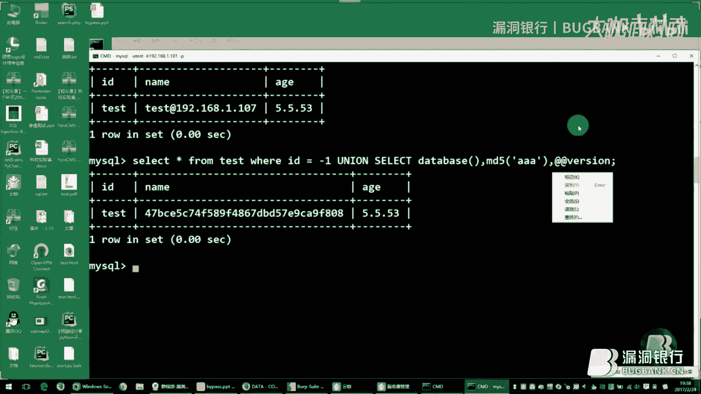

我们现在先往下，我们先往下，那么现在呢我们再往下注入，就是该注入，比如说这个站里面还有这个管理员的这个呃数据库的表。

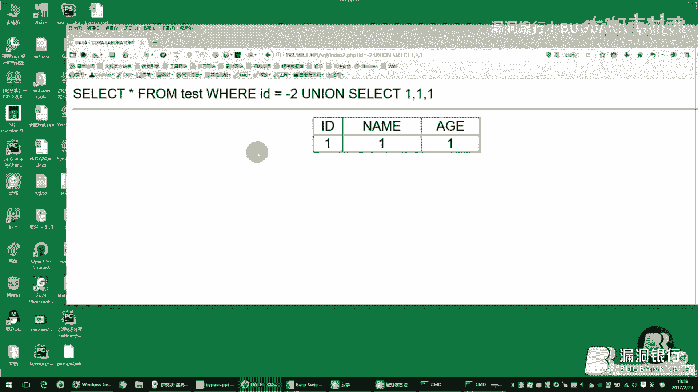

我们要查清它的数据库里面的内容该怎么办。

给大家先看。

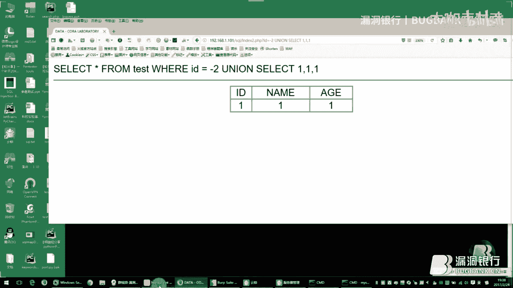

先看一个知识点啊，就是数据库的特性，可以看这个information schema这个数据库里面，它存的是就是当前这个用户对于这个数据库里面的所有的权限，然后当前数据库里面对应的所有的知道吧。

还有数据库明全部都在里面知道吧。

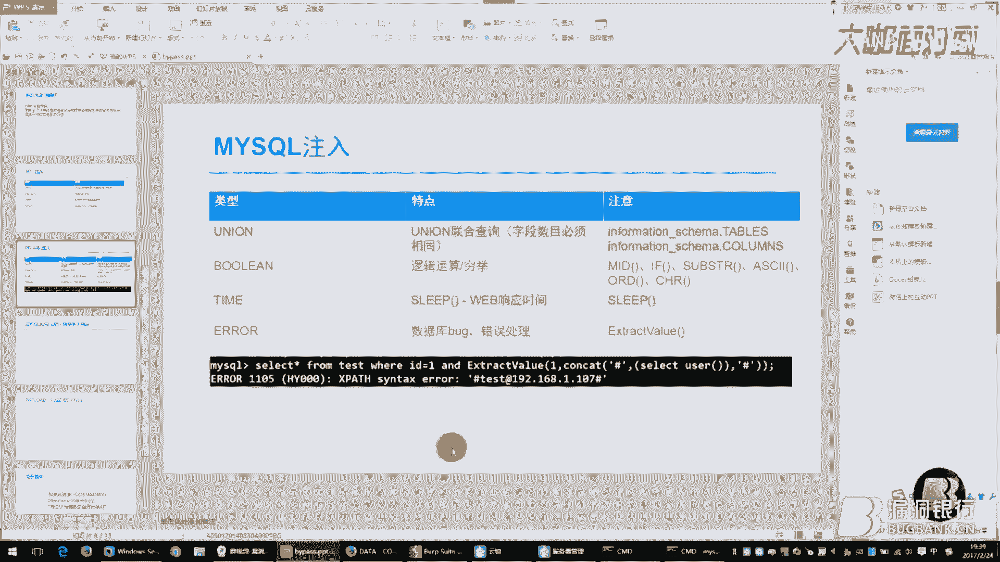

我们可以看一下收接到贝斯，手有点快，可以看到它返回的是两条数据库，两个数据库就是这是一个降权的用户，降权用户它也是有这个数据库的，也能操作，也能查询数据库里面的内容，知道了吧，我们再往下看。

那怎么样去爆破。

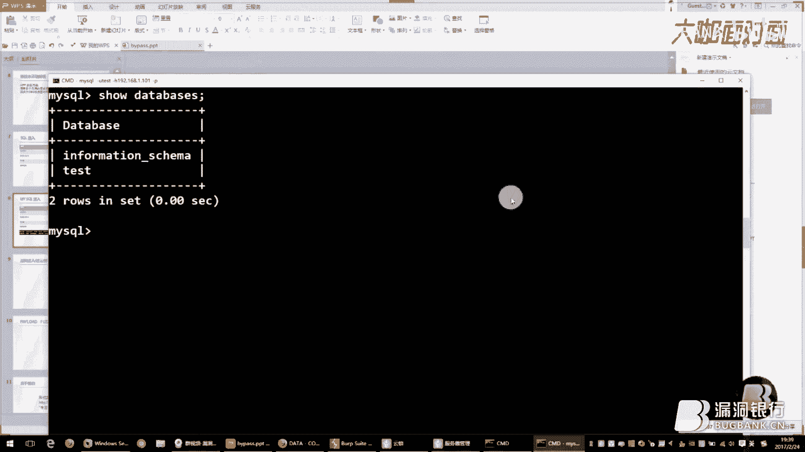

就是怎么去查询我们当前的这个其中的一个表呢。

这需要联合查询嘛，对不对。

我们先看一下这个数据库的结构，数据库的结构，我新建一个连接吧，我们可以看到他这个表，我们首先看k boos这个表，它里面存的是什么，可以看到在这里面存的是一个test，就是当前这个库是test。

它里面存的表示test，就说test数据库下面有一个test表，是这个关系，知道吧，向全用户他拿不到最高权限，拿不到最高权限，然后这里面有一个column字段表，我们再看一下这个color os的结构。

就是当前这个库为test库，当前这个表为test，那么它里面就是存了三个列，就是三个字段名，可以读取关联密码的，主要就是在当前数据库可查询的情况下，我们假设要读就是我们读i d为二的。

就是i d为二的这个内幕的名称啊，我们要达到就是这个假设管理员的密码，就是存在这个name的这个字段里面，我们先往下该怎么输入啊。

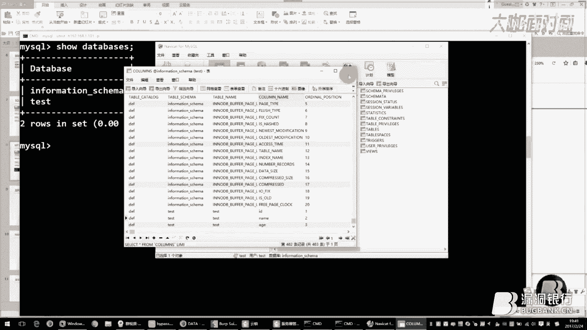

首先要暴露他的数据库，对不对，首先报出他的数据库，我们再直接调用这大贝斯函数，嗯，看到没，当今法的这个数据库名的是test，完全访问的数据库名是test，我们在就是这个数据库名我们已经知道了。

那么就根据这个information schema这个表去继续注入tables里面，呃，刚才已经看了它里面就是假设这个条件为test，我们可以查询，我们已经知道这个table schema值为test。

那么在查询这条件，就根据这个条件来查的话，再查询到这个完全不难。

我们先在这里面，在这个终端里面试一下，我们把这个把这个还原啊，改成16161，它返回的是这个，我们再往下输入，就是查询查询什么查询就是我们的这个table name。

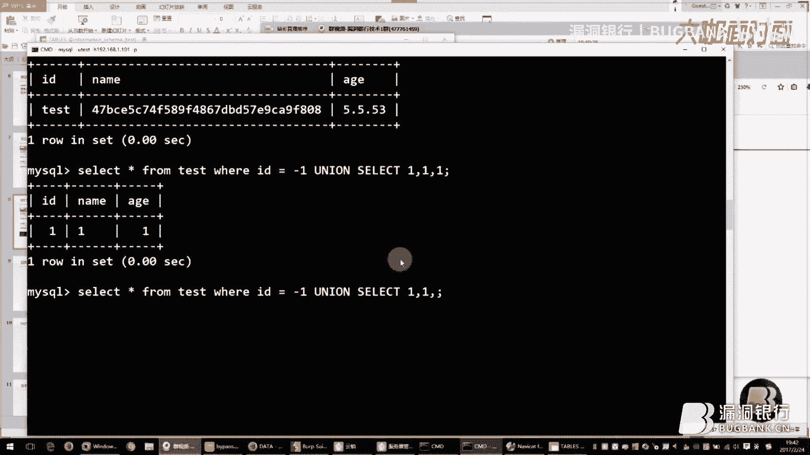

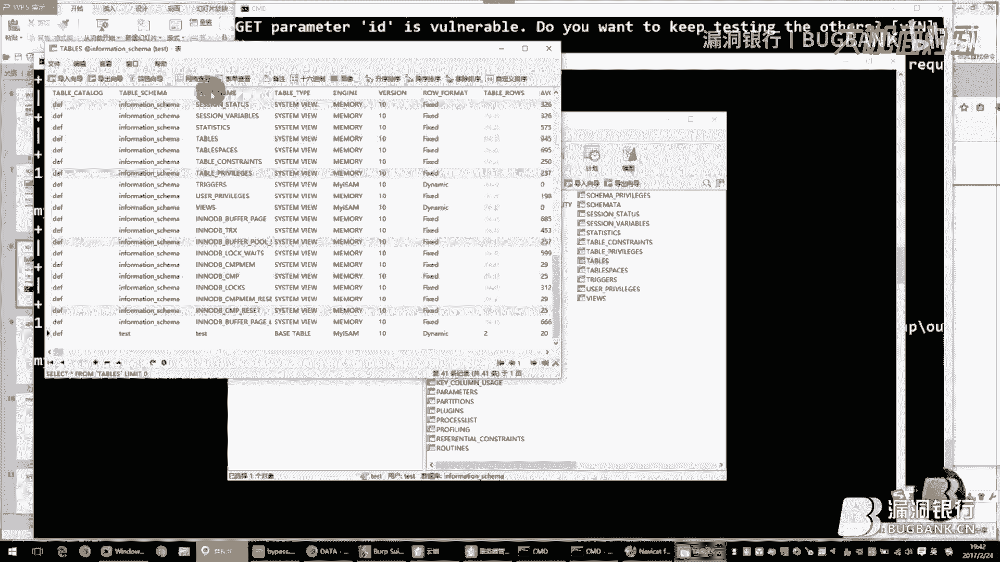

就是查询当前这个表，这name，然后from，来自哪个哪个数据库呢，就是用formation schema这个数据库。

然后information schema这里面还有一个就是说table schema就是当前数据库名，就是tables这个表，tables这个表，然后where加一个条件约束。

就是table schema，s c h e m a等于我们的这个数据库，数据数据库名称，我们可以看他常用的是test，给大家看一下，可以看到他查到这个表表名称为test。

那么我们知道表名称再继续向下查，就是根据这个column s这个表。

我们其实如果要查下一个表的话，加一个limit就可以了，条件就是他这个条数约束，大家去看一下那个思路的基础，我们再看看到没，test数据库里面有个test。

test下面有id name和age这三个字段，我们知道test这个表以后，知道test的数据会有，我们完全就是根据这两个条件再查询到这个i d懂了吧，我们再把这个改一下嗯。

现在这个表是colummos，这个表我们把tabs改成coloms，然后我们再把我们要查什么，不是table name了，而是columns，column name。

c o l u m n大写小写都无所谓，然后是，这个条件是table name，内部等于tes，可以看到它返回了三条，对不对，那是在在我们的这个页面里面，它不会返回三条的，知道了吧，他不会返回三条的。

那我们该怎么办呢，就加个limit，就是条数限制，首先是你查询几条，那么每一条它取就是我当前结果返回几条，返回是一知道吧，这是从哪一条开始，那从零它是默认是从零开始的。

我从零开始的话再取一条就是返回的是i d，知道吧，从零开始取一条向下取回的是i d，就是当前字段名为i d，对不对，我们在选name呢，就是从第二条开始，从从一嘛对吧，它是计算机里面它是从零开始的。

那在人类的这种世界观中，二才是第二个，对不对，但是在计算机里面，一是第二个，你看他查询出来的，给大家都截图一下，这个慢慢理解，其实就是两个，你可以可以用contact等等啊，contact给大家讲一下。

come cat就是拼拼接啊，这个慷慨的话貌似拼接不了，貌似是拼接不了。

除非你要在这里在这里面加一个紫砂型，这样的，我这样讲的话就有点复杂了，能听懂是好的，然后我们再往下就是现在就是搬到这个web上面该怎么办，搬到这其实相当于讲了第第二遍了。

我们现在假设已经获取了这个数据库名了，the test，对不对。

我们在首先要查什么，我们根据这个来这个table name，对不对，产生这个表明，直接把这个后面复制过来，也可以，当过我没有。

就是给大家讲的更详细一点啊，我给大家再看一下这个数据库的结构，我们要查表的话，就需要去这个table information camera这个数据库里去看一下它的结构，退一步你看tables这个表。

当前数据库，当前数据库下面有很多的表，我们只需要在乎就是说这个user这个这个这个读什么来着，高材生说一下，这个是用户权限表，我不太会读这个后面这个单词了啊，它里面是存在。

就是当前用户它允许哪些主机登录，是你看到百分号，百分号在这mysql里面代表的是任意主机，然后啊这个就是用来判断它是否是root权限啊，一般就是那个circmp，它会逐步的时候会查询这个表。

这个你先不要去管，先把这个基础的先练扎实，这个tbs呢这是一个information schema这个数据库里面的这个表的位置，这个表里面呢它从来就是有有好多数据库吗，那数据库里面对应有一些表明嘛。

对不对，那更详细的就是有一个字段字段表，对不对，hello，在columbus这个表里面，然后我们现在就是取table name，我们知道数据不明了，只需要加一个条件约束就可以了。

直接可以查询到这个table name，就是table name，我们要查table name，对不对，然后from来自哪个表，来自哪个数据库，来自数据库这个数据库里面的这个tables。

tables这个表，然后条件呢就是where，然后呢他的这个table schema，意思就是这个数据库名table，sc h c h e m a ma等于我们当前数据库名。

可以看到它返回的是个test，完全没有毛病的，这个语句已经打在这个就是这个上面了，很大，你可以仔细的看一下，语句很大，这个留个地址栏里面呢，你必须要去在乎了，主要是前面一个报错嘛，然后后面一个优点。

给大家发出来了，然后呢我们再往下取到这个里面的内容之后，我们再比如说再取它的字段名，我们把这个再改一下，改成什么呢，这个column对不对，字段我们看这个column这个这个表。

然后里面搬到我们的那个test里面，就是这个table name，对不对，然后取了个column name，对不对，然后他这个这个表面上是color os，我们from color mos。

然后呢查询这个hello name，然后呢它的条件是什么，就是table name，由于数据库和这个表明是相同的，我就不需要改了，对不对，他取回的是个id，给大家再看一眼，他求的是个id。

那在四go map里面，它是怎么样去获取这个数据的呢，我们先获取id啊，我们先查询一下id，假设我们有已经有id了，对不对，那这个union select它是一个优on联合联合查询嘛，对不对。

我们也可以就是说select from哪个表，我们把这个来自这个test表，对不对，我们已经知道这个表，我们查询id，等一下啊，看到没。

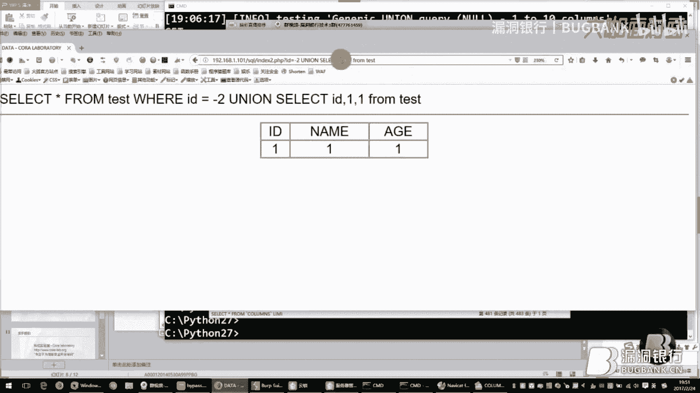

直接就可以查询数据了，直接查询就是test里面那个name后面其实还可以加条件。

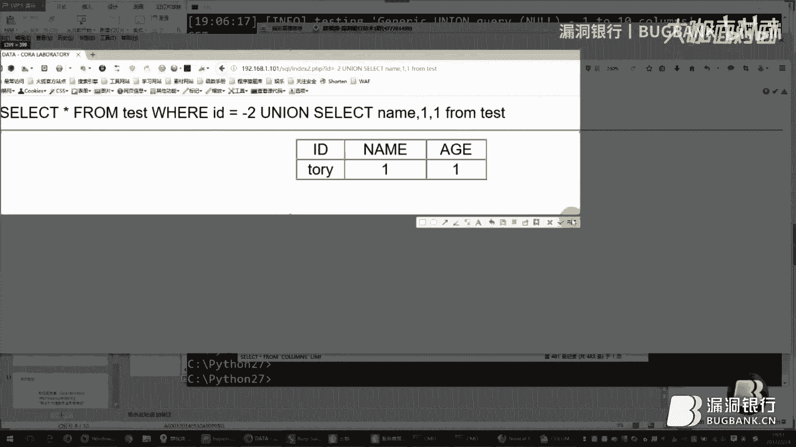

where i d等于几等于2v2 的话，它的这个name就是泡芙，唯一的话就是tory，他是后面取数据啊，取数据sq mb它是这样子的，他加了一个慷慨的，为了让这个爬虫更好的就是抓取这个页面上的内容。

它会加个慷慨的，就是比如说用一个井号来来，就是让这个字符左右两边让爬虫去更好的匹配啊，我看一下contact，可能是单引号的问题，我们改成16进制吧，好不好，就是030x5 c，可以看到它是这样的。

两个斜杠中间是一个toy，对不对，他是这个样子的，就是说他要写就是sq mb，他要匹配正则的话，只需要就是匹配两个两个斜杠中间的任意字符，知道吧，直接这样取就可以了，这样很方便的，知道吧。

就是写爬虫的时候，所以说这个注就先讲到这里面，如果是呃，我们现在先问一下大家，因为现在我准备了很多就是不值注入啊，时间注入，报错注了，还有后面的这些，你觉得大家觉得这个后面的这些需不需要再再讲一遍。

比如说不忍直注入，时间注入，报错注入等等等等，有没有觉得必须要讲一下的，或者说直接就是讲后面的，讲一遍啊，题还原理，你看布尔值注入，布尔值输入它是比较有意思的，布尔猪猪猪，你可以看我，我在这里面啊。

大家可以看普通的布尔猪猪，就是不需要管它了，我看只需要一个按的用and成为你的神话，成就你的梦想啊，你可以看啊，我们加一个and的1=1，按照1等1假设反馈正常的话，对不对。

那这个案子呢后面就是按照后面我们可以加任何的逻辑判断，知道吧，先让大家学一个函数，给大家看这个函数。

这个终端回到最初始的状态，你看啊，我们查询一对不对，就是一个虚拟表，返回一击，对不对，我们查询位移，他返回一路的，我们先把先不管这个，我们直接select 1，这个都能看懂吧。

就是你后面那个select跟什么，它就会查询出来什么，懂了吧，那么我们学一个函数，if if函数，它有你要不要新建一个。

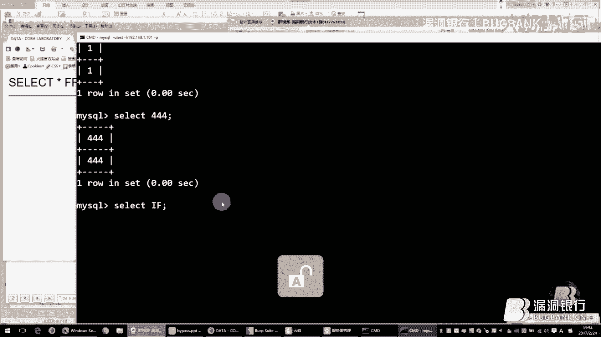

新建一个，我这里面列了几个函数，慢慢给大家给大家讲。

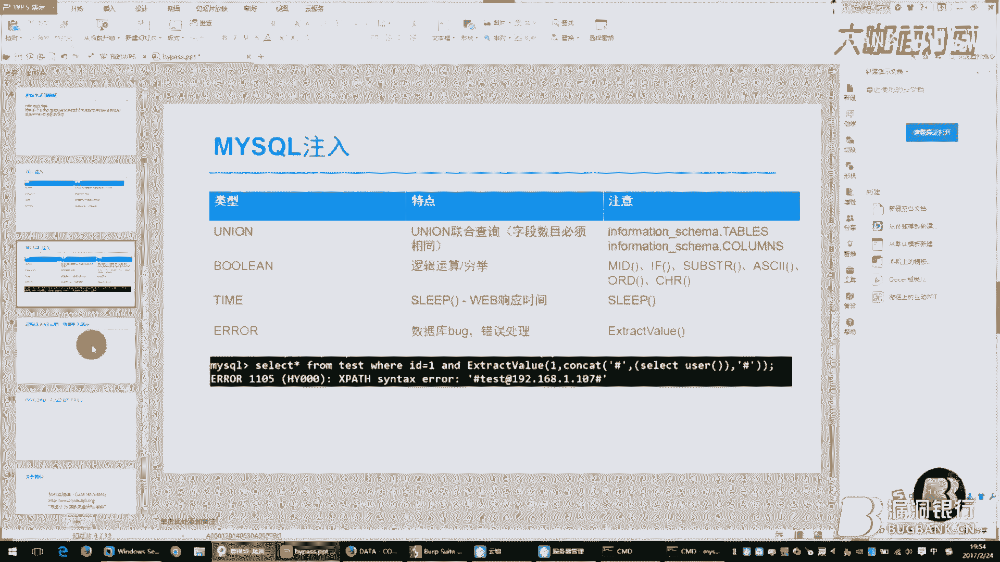

你看啊，11=1，if一等于一，然后做好返回一，然后逗号是二，你看大家可以理解一下，你看他为什么要查询出来的是一这个函数到底是做了什么运算，就是说他会判断前面这个表达式啊，前面是一个逻辑逻辑运算。

逻辑运算表达式就是假设1=1的话，它就会返回一，假设一不等于一的话，它会返回二，懂了吧，我们看比如说假如1=5，那就返回二了，知道吧，这个原理大家能听明白吧。

那么我们再往下走，知道这个条件之后，我们可以做一个简单的就是用户名。

用户名叫什么来着，用户名爆破数据库的用户名，包括大家都知道user这个函数他是返回当前数据库的用户名的，对不对，你看我们按的。

音乐，他也是返回正常的，我们看一下，假设我们后面替换成一个user该怎么办，他返回是空啊，他返回的是个空。

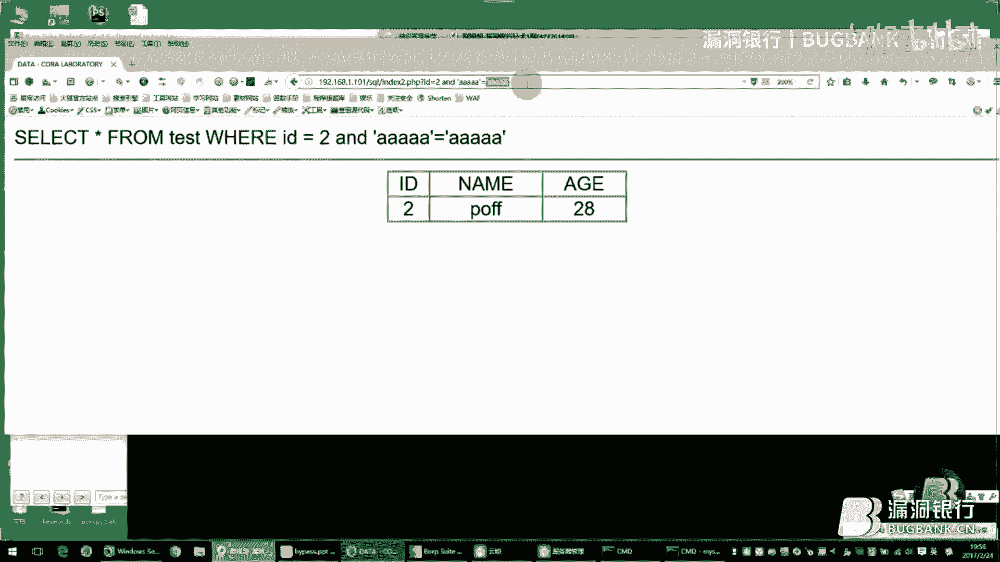

那如果这个条件如果后面这个条件成立的话。

前面成立的话，那么这个页面会返回一个正常的页面，而不是说这个连结果都没查询出来，对不对啊，这个爆破呢也是属于这个用户名的爆破，你假设我换成user了，换成这个，但是这个字符啊。

你让他会不会返回正常。

你看到没，它返回的是不是正常的，为什么在这个终端里面。

你取的时候，它会带上这个地址，知道吧，他会带上这个地址的，它是用户名，就是用户名，我们直接就是取钱的用户名就可以了。

纳尼，等于217s7 ，等会儿我缓一缓就懵逼了。

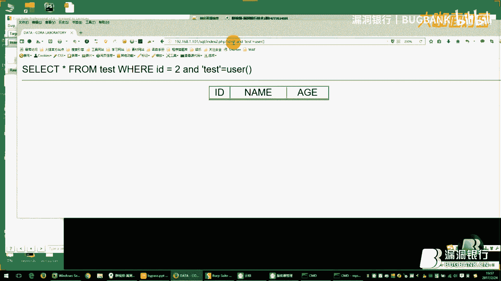

我是从来不会翻车的。

我们看一下啊，嗯我们先把这个user查询出来好不好，user查询出来，联合注入，他是root啊，我知道了，我刚才已经强调过了，就是我的这个服务器端，它是用了root用户，为了给大家演示。

后面就是查询密码嘛，对不对，知道吧，我这用的不是一个一个账号。

这个是用的test账号，就是降权账号，就是用的root账号，知道吧，这个能理解吧。

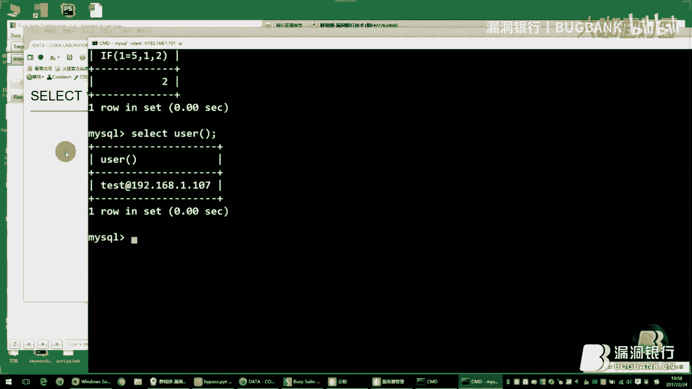

这不是，这是一个不算是一个翻车原理问题，and你看啊，假设我们是root，等于就是user的话，他也没有返回，我们加上logo号是吧，boss也不行，s2 ，-2的-2-2了啊，对社会正常。

这是条件问题，对不是一个库的权限，你可以看到就是在这里面的话，它就正常运行了，那么你要是如果写一个脚本爆破，就是假设这一个布尔值输入的话，你就可以写一个脚本去爆破这个用户名了，知道吧。

就是包括这个用户名，就是很多p c他都是这么写的，就是他也不需要去验证你这个诸如漏洞能注入出来什么数据啊，或者贴不贴数据等等，别人就写一个python脚本就跑出来这个用户名就可以了，是一个简单的方式。

还有的就是用的盲注，我们现在就在讲盲注啊，这个条件稍稍告诉大家一下，这个就当前这个是可以过狗的啊。

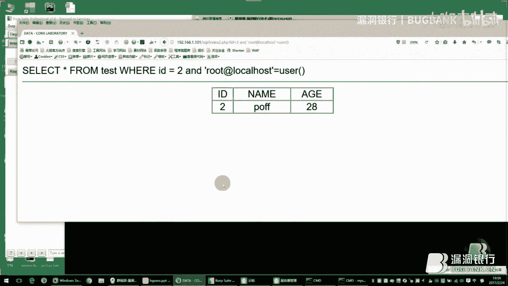

你你可以去测试啊。

当年是过过的，就是可以啊，写个脚本一直循环，把这段字符一直向这个服务器请，如果这个最后这个页面返回正常，那么当你请求的这个字符串就是用户名，知道你可以给大家看一下吧，还是你看我把这个安全给我打开。

是过狗的，就是当前的这个我们把它从防护开启，我这边对照两个，对照两个，1=1没有拦截，我们再重启下web服务，这个比较麻烦，重启成功，我们再看一下好了，已经拦截了。

我们再看这个请求，看看会不会拦截，看到没，完全没事，完全没事，比如说这个完全就是属于过狗的，你要求取当前数据库的用户名的话，完全可以过过的。

就是把这个rot at local house改成一些常用的用户名，知道吧，用户名字符串，你就是只要字典强大，就可以获取当前数据库的用户名，我们再把这个外服给关了。

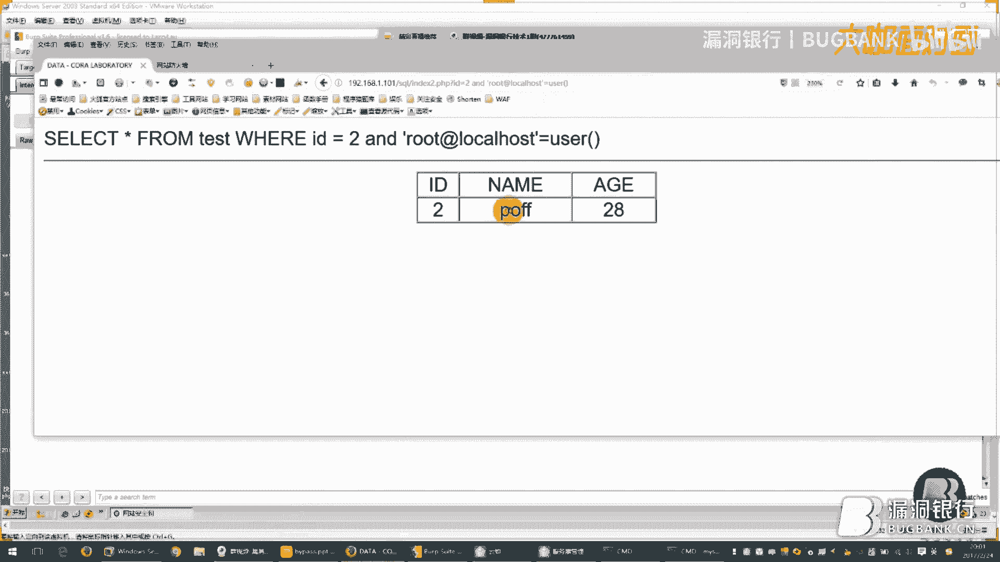

我们再往下讲讲这个叫什么。

位置盲注if了对吧，我们再回过头来if它就是做了一个逻辑值判断。

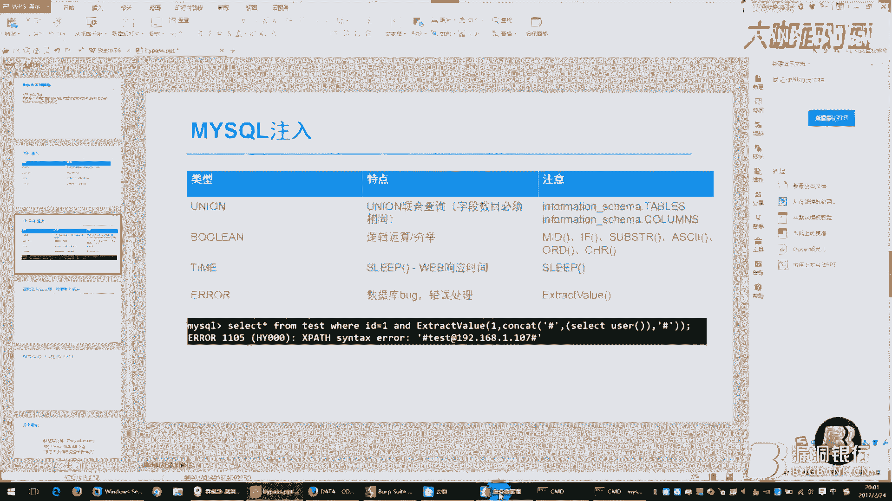

我们先就是因为这个函数可能会有一点多。

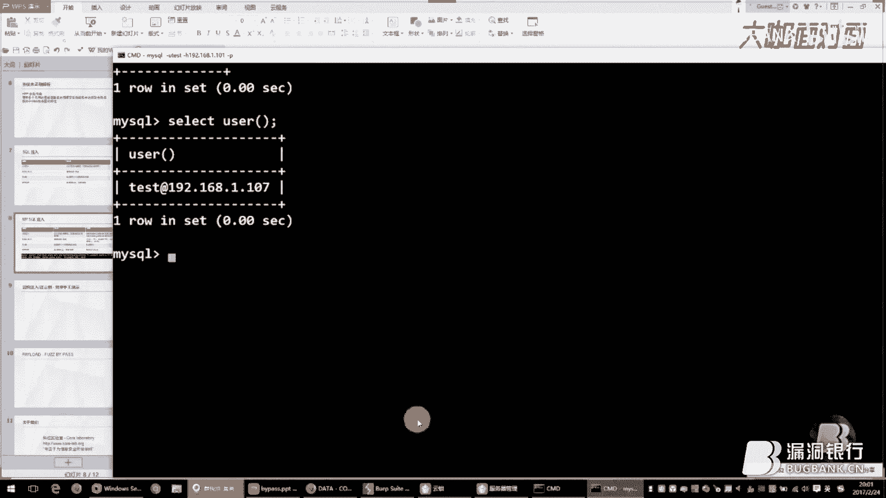

比如说1=1，1=2，大家可以看这个页面到底是返回正常还是错误，一起互动互动，他返回正常还是返回错误，大家可以看一下，能回答出来的吗，这个页面是返回正常还是错误，就是请求提交过去。

我刚才改了一下他的衣服和衣服1=1，1=2，然后是，本来是这么改的吗，对前面还有个一等于，对它是错误的，因为就是说在这里面运算1=2的时候，它会返回啊，对不对，因为一不等于二，它会返回最后面那个值。

那么二返回之后呢，他在与与这个一做比较，一不等于二，它会返回一个就是布尔值的一个f，然后前面呢它是一个返回的是true，对不对，true和false在一起的话，它会返回false，懂了吧，对。

那么我们再往下这个理解了之后，我们再就是再判再学一个函数叫count。

再回到前面那个，看一下七，创口函数它是一个聚合函数，属于聚合类的函数，就是说你当前这个数据库表中有几段，有几个就是有几个几条记录，它会返回返回一个数字，这个数字就是说你当前这个表里面有几条数据。

你可以看一下它到底有几条，刚才刚才已经看过了，其实看到没，它是有两条数据，这是一条两条，那么count它是二，就是说当前数据表这个表中还有两条数据，我们再往下走，就是假设我也可以就是统计这个列数。

就是统计这个列里面还有多少多少多少条数据啊，a级它有两条，我们再就是现在插入一下，你sr我们插入一个，比如说test，插入一条数据名字叫什么，叫fancy吧，然后呢这个年龄呢年龄我不知道。

我们填一个叫什么，乾隆100，我们不舔不舔不舔，看能不能不舔啊，钱还不行，我这数据库设计有问题，怎么说呢，我只要是给大家想证明一下，就是有的数据库表中啊，这个28它是没有填的，默认是空啊。

如果聚合a级车的a级这一列的话，它会返回一，知道吧，可能某个字段它没有直，但是整条记录它是一条记录，它是一条完整的记录，懂了吧，那么通过这个count函数，我们可以就是说可以去做判断。

就是如果我给大家看一下。

如果，一大于，等一下，如果这是select里面要加括号的，c o u n t count，位置，我们先count心啊，count心count星来自哪个表，开始条件就是说大于零的话，那就返回返回一。

他是执行正常的，它会返回1d也说这个表是存在的，知道了吧，这表是存在的，就是说这个test可以任意改动，这样就是相当于我们那个穷举这个表，知道吧，比如改成arm是不存在的，有时候它会会报错吗。

因为会报错等等等等，假设我们知道这个就最后穷举出来这个test的这个表了，再往下穷举就是穷举这个count了，就是count里面某个字段就是穷举一举，当前这个结果就是返回我现在是三条吗。

它返回三三肯定是零的，对不对，那么他就返回一了，懂了吧，像这种这种这个布尔值输入，他就是这么来的，知道吧，就一直这样穷举这个count，还有if啊等等等等，那么还有一种呃在后面取数取数值的时候。

用这个截取函数，用那个阿斯克码做数值逻辑值运算，我们假设我们先构造一下，我们在外面加一个，我们在这里面构造在在那个上面看的有点太小了。

然后呢假设我这后面还能就是说还能插入，test where id等于一，然后按的对不对，并且呢我们在后面再加一些逻辑值运算，就是1=1，这个首先是第一个条件，然后是e按e按e等于e大写的好看一点，卧槽。

给按没了，cmd一点也不好，等于1n的b服，我要先执行一遍，可能他就没了，衣服对不对，然后后面是一个条件，就是1等1说一个子查询select c位置，test对不对。

假设我们这个表和这个小明和列宁都得到以后，然后呢limit一从第一条开始取一条，对不对，然后呢它的这个大于零的话返回一，否则返回于二，然后呢我们在外面呢要截取，知道吧，m a d，有三个参数。

首先第一个参数就是你要截取的字符串，截取一位，知道从哪一位开始，截取几位，是这样子的，我们再用阿斯克转一下，阿斯克码还是再转一下，转一转成一个阿斯克码，它是正常查询的，正常查询的。

我给大家看一下这个语句啊，这是嵌套了两三个函数吗，那掌门我们查询的结果长成一个阿斯克码，再继续判断，就是阿斯克码，他有个戒指啊，我们可以看好像是20几到100，100多少来着。

我们肉眼可见的字符能就是能输入数据库的，我们看如果它大于100的话，它正常对不对，判断大于一，大于200还是正常，300，md一斗于8月，什么情况好像永远返回啊，对对对对对，我忘加了约束条件，1=2。

我们再再再继续，从100开始，我就说嘛不可能有大于二三百的，这样大于22才是正常，对不对，大于50，50是空，对不对，现在是22~22~50之间，我现在就是30，正常30~50之间，我们在30。

37 37是正常，我们在40是正常，哎呀挡住我了，是正常，就是40~50之间就慢慢就趋趋近了，知道吧，是根据算法问题，有的是就是可以那个，去这样穷举，知道吧，现在是45，48也正常，49，49是空。

对不对，证明他是48，我们再用这个直接用数据库来转了啊，是，对不对不对，我们我们应该用叉传一个就是48，看它返回的字符是什么，是零，不会吧，48对对对，大于48，我们看等不等于48，换成等号不等于48。

那么它应该是49，有几只有问题，看到没，它是等于49，当然你也可以就是循环上100多下，判断是不是等于知道吧，我们再转一下，用那个阿斯特转成49，看到没，它是一，h它的第一个字符就是第一条记录。

第一个字符是一，我们看一下他这个应该是一了，懂了吧，他反应的是这个一，所以说这个就比较麻烦，就是那个布尔值忙碌。

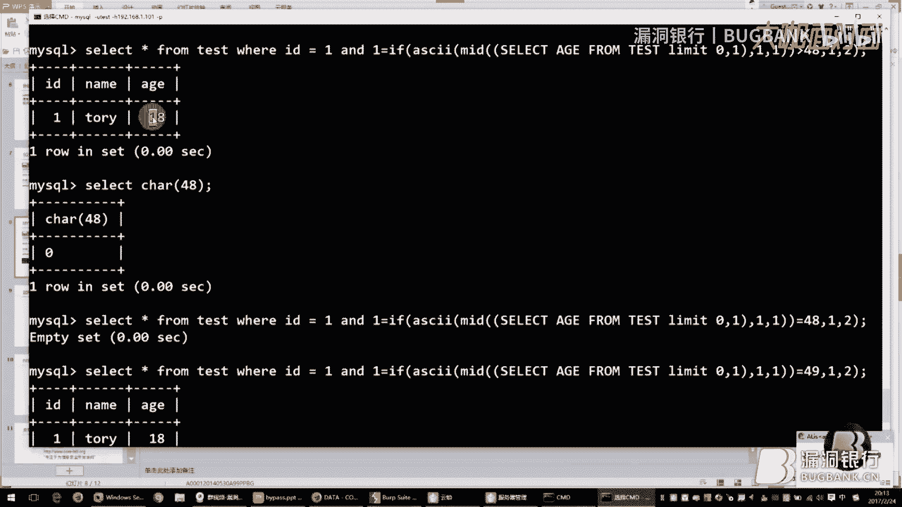

那我们如果是时间注入呢。

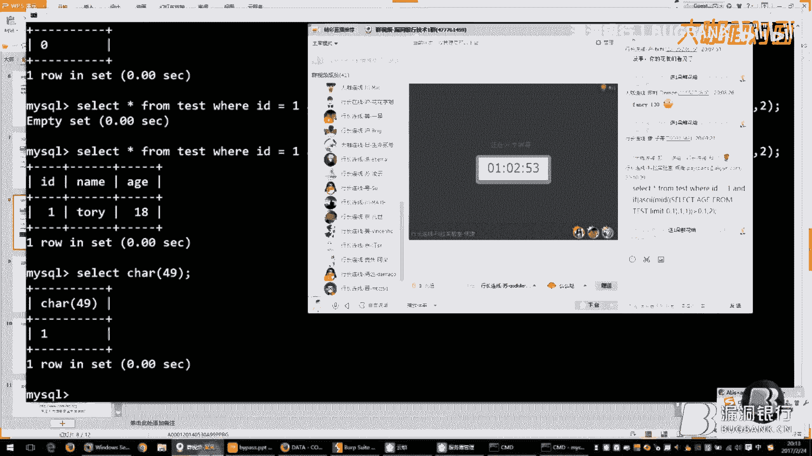

你该怎么办啊，注入了，其实我们看一下sleep函数，sleep函数，他是等待一秒，对不对，可以看到它的值是零，对不对，不是零是零吧，我们在只需要把这个改一下就可以了，其实这个我们也可以不用阿斯克。

等大家先扩展一下，不用阿斯克，不用阿斯，阿斯克怎么办呢，也可以啊，就是直接用字符去判断，字符判断所知有很多。

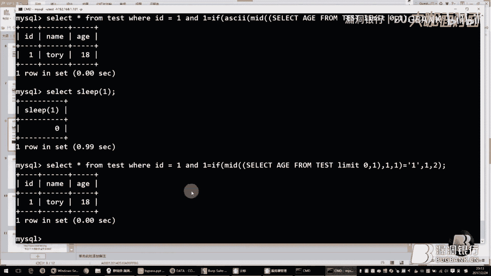

很多方法也都是小a到小z，你知道吧，小a到小z这样穷举或者大一到大z穷举，知道吧，就是26个字母等等，还有数字0~9，它是这样，一直这样判断字符如果相等，这样也可以，也可以用阿斯克码。

当你就是说这个它过滤这个单引号的时候，我们就必须要用这个阿斯克码了，知道吧，就可以用阿斯克码了，然后我们在就是看到那个sleep后面就不需要改啊，不需要改，就是假设他，好and等于一，对不对。

后面这个条件我们直接改成sleep就可以了，二我们看看后面有没有加阿斯特，阿斯克函数返回的不是阿斯克吗，看到他等待了两秒，只剩一个时间吗，注，加那个字符串的截取啊，是这样的，注入了，知道吧。

他是这样的注入的。

我们再往下走，这个时间啊，我们在这两个就差不多讲完了。

主要是穷举吗，报错了报错，我认为给大家就是贴了一个简单贴了一个函数，其实它有很多函数先看啊，我们先比如说查询id为一的。

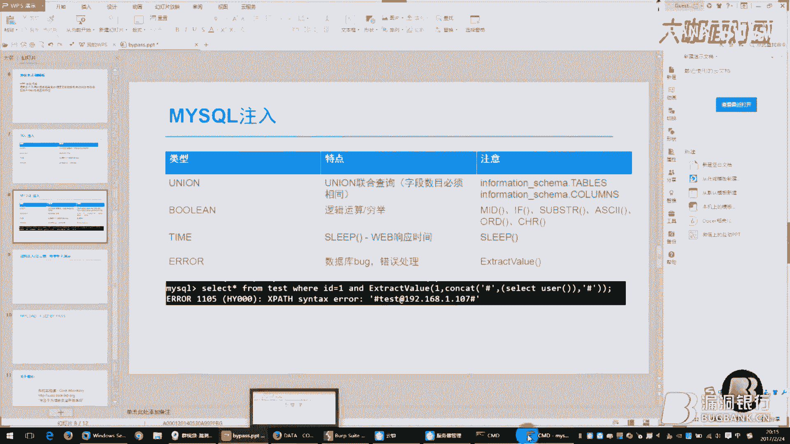

然后直接跟这个函数，你刚才是有一个那个换行符导致的，我查询一，我用一个慷慨的，我要查这个数据库当前密码，我们查就是，我这个终端不是root用户，我假如要查一条数据所带的信号rom，然后一个表。

字符不是他，我们查fancy，fancy就是查，对不对，name from test，i d等于三，它返回的是一个字符嘛，然后用contact在拼接的话，到达就是把这个语句直接执行了，知道吧，我们看啊。

函数后面应该没有没有参数了，可以看到他反的是fancy，这是个fc。

把这个子句直接就执行掉了，并且并且返回的结果就解析了。

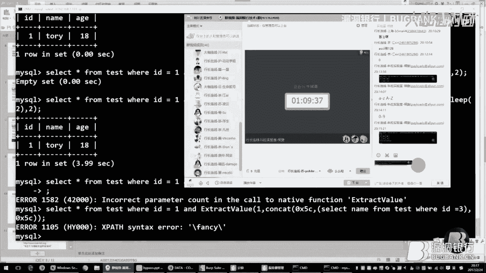

知道吧，大家可以看一下，就是查一下这个函数的一些用法，还有还有些其他的函数，我们要查这个版本，把这个中间这个子句换成一些全局变量就可以了，返回的是5。55。5，5。53。

如果就是如果当年我这个页面没有写这个报错啊。

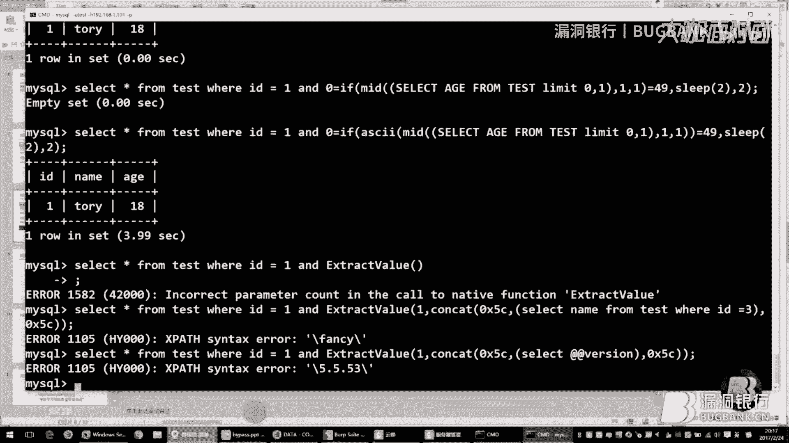

可能就是说用利用那个报错注入的，没有没有这个错误回血，它是利用不了的，我们现在在讲今天的重点就是这个过瘾所过过狗之路，各种猪肉，我们现在先把这个安全口的打开了，重新重新再来。

刚才那些就是没有拦截的情况下，输入已经讲清楚了，开启，然后再重启一下web服务，黑板可以敲头吗。

放一下包，然后，放到这个repeter里面，可以看到它已经拦截了，对不对，然后我们再看他的日志啊，是什么鬼，它的日志没有的话，就证明这个番茄录没有，流量吗，这是今天的，你可以看刚才那个就是他拦截原因啊。

原因是什么，单的按照a方式注入，对不对，它有一些特定的规则，我们先它的规则慢慢就是通过手动操作来研究它这个规则，我们先就先绕过这个案子了，怎么绕，你可以看按照它到底是拦截什么，先把这个代理装了。

手动测试，就是按照1=2，它是拦截的，对不对，就是可以分析一下，按照后面有个空格，对不对，空格后面也是1=1，对不对，是一个数字，对不对，一个整数，然后后面是一个整数。

就是按照它也可以参与这个字符串的运算。

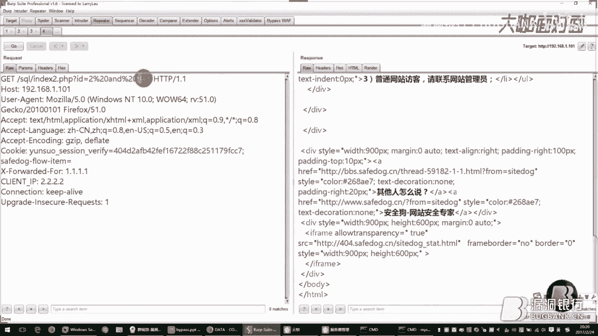

我们在这个终端里面看一下，这些都删掉了，然后是1=1，对不对，他是可以执行的，我们假如换成换成一个字符，比如说a你a执行的，知道吧，我们测试一下，就刚才我给大家已经说过了。

就是刚才那个配套的是可以拆解那个用户名的。

有用户名的，and就刚才那个一个字符串，对不对，主要是root host，对不对，我们等一个u的，它是可以过勾的，对不对，返回正常了。

证明这个当前数据库的用户名是root at local house的，对不对，我们根据这个条件，你看啊，这边是一个英文，对不对，是一个字母，这边是一个字符，对不对，也就是说在and的左右。

就是and的右边是一个字符啊，它如果是一个整数，等于一个整数啊，会拦截，知道吧，但是他这样的一个条件，就假如是一个字符的话，或者说一个一个英文字母或者是一个函数，它就不会拦截了。

也可以就是查询他的版本啊，这个版本函数是什么，5。55。35是吧，看到它也返回正常哦，没有返回正常，因为这些数据没出来，我们在这个里面看一下版本啊。

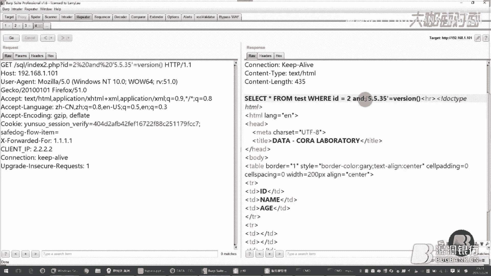

5。53，我再调用一个函数，5。53我看了5。5。53。

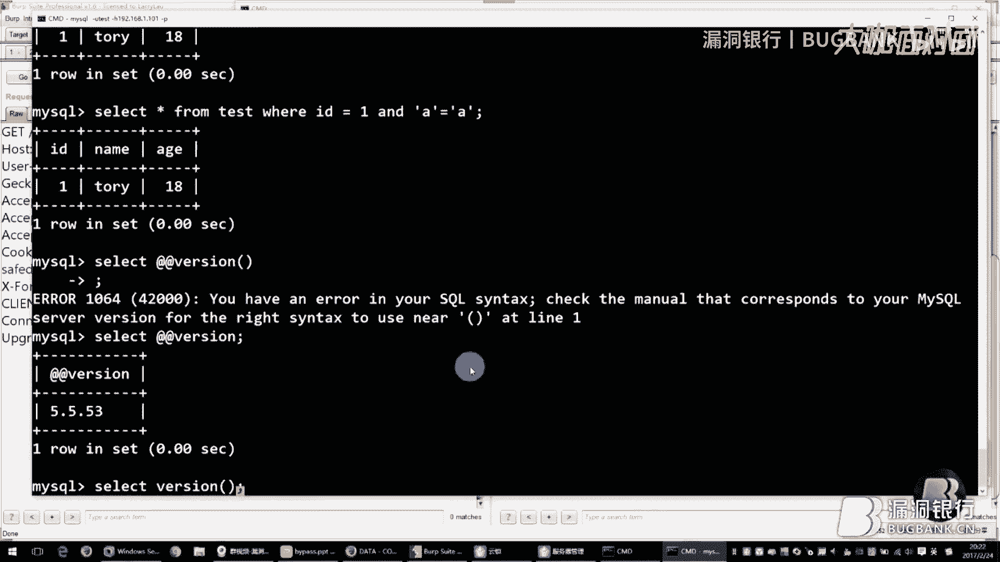

是不是三五就可以一直穷举他的，只要有字典可以停止啊，也就是说现在已经返回返回正常了，可以说自比较字符串或者是字符串和函数的比较，它是不拦截的，不拦截的，那我们再继续往下。

就是首先就是order by或者union，对不对，我们就是先过狗on，比如说加一些注释啊等等等等，对不对，我们先在浏览器里面吧，因为这里面还要把那个ur要转码，然后1度2度3度3，看到它拦截了。

对不对，我们再继续测，就是假设在这个先把这个select去掉，看到拦截不拦截，可以看到它不拦截，也就是说union和select在一起的时候，一起的时候他才会拦截，懂了吧，和select在一起的时候。

他才会拦截我们再继续往下，就是或者是说用大小写，或者说用u r l编码等等等等，这些我都全部试过了，主要是给你提供一种思路啊，还原他的正则好不好，先还原他的正则，这里应该是这样的，select对不对。

先发现他的症状，它会抵扣的一下，就是这边他会就是安全狗，它会把这个ul解码一下去匹配，主要是先把这个20%给去掉，因为安全管它会自己解码的，就是可以用那种嗯叫什么杠啊，我们先匹配，就是空格吗，一个空格。

嗯，加一个空格，这样能不能加，我，们先这样写吧，简单匹配出来，这里面发现它是不区分大小写的啊，后面是一个数字，它可以是这样子的，放低放低心跳，正在桌上，是简单是简单，是这样理解的。

就union和select在一起的话，后面再加一个就是数字的话，它会就拦截了，我们讲就把这个改成一个字符，看看看他会不会拦截，我先首先查询一条，就查询一个20%，因为你不传这个空格的话。

他会永远都不会接收的，他也难，比如说unit和slash不能在一起，那么怎么样去过的过掉这个呢，那只能加注释量对，那么考虑到这个注释呢，我们可能又会想一些其他的原因，就是这个注释太有正则呀，对不对。

你看我给大家写几个，写几个小的配套的，里面写了，还有一个表格，把它放在上面，这种的对不对，是这种空的里面没有任何东西，再唱一，还有这种就是中间加一些数字，对不对，就是加一个叹号，然后去去执行一个优点。

对不对，还有还有的就是加一些叫什么英文字母加数字，对不对，在这里面加个叹号等等等等，就是有一些其他的思路都可以在里面试哦，哦大写的o等等等等，或者说双引号，单引号，或者说下划线等等等等。

这些就是在mysql里面，它是不会被运行的，给大家讲几个注释。

找到这个，800sli 47182，我们现在假设在这个union和select中间加一些注释啊，对，注释可以看到它是完全可以运行的，对不对，注释他还有一些我们就是需要写一个f u c c脚本。

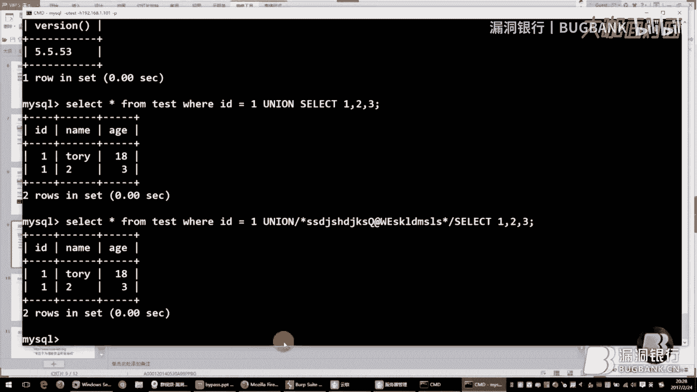

知道吧，脚本你可以看到他这个状态码，我看一下他的状态码是什么，也是200，我们首先要取这个标题，对不对，这个标题之后，只要不是网站防火墙的，就证明我这个内容是可以绕过的，对不对。

那个配套的就要你自己去写了，就是字母加字符的组合，知道吧，就是计算机中只要是不影响这个mysql执行的，连特殊特殊符号加进去，就可以绕过它的这个拦截。

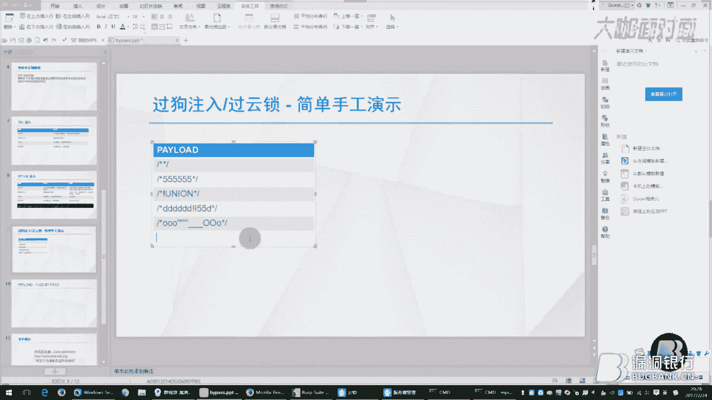

知道吗，这种呢对不对，其他的一些符号比括号对不对啊。

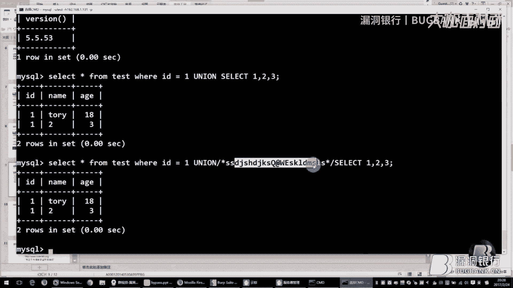

对不对，我们全部都加进去，那看看他能不能接绕过，我们现在先union和select中间，我们把这个特征和select中间要么是20%，要么是空格，不区分大小写又会拦截，对不对，我们现在先把这个加个内联。

慢慢去去绕过，比如一个一串数字它也绕过，对不对，还有个叹号，它也拦截，对不对，再加这些反反引号，它也是就是左斜杠，它也是拦截，那么就要去写个写个fc脚本，知道吧，我测试这个时候手工测试就是测试了很多遍。

但是最后还是用那个i p u z z脚本跑出来的，这因为他的条件太多太多了，只有一个正则，他能匹配很多很多数据，需要找到它的一些就是没有拦截的一些点，这个正则给绕过呃，你我匹配，你看啊。

我我提我提交一些字符来看，我有一些字符它并没有过滤啊，啊这个你看这个它匹配它有可能会匹配，就是二后面优点不就是参数，后面这个优点，我们只要把这些全部添加进来，都测试一下，那么此时他可能是拦截的死掉的。

我们把这个内援助是放到后面了，那么他这些全部都拦截了，那我们就就是要加更多的这个字符，知道吧，更多的字符去照顾，每个都要改，所以说建议大家写那个脚本知道吧，测试，是拦截的嗯，我这边就是写u z z。

我这边写好了一个脚本，看一下叫c fw。

此时他是开启的，你可以看看这个u2 l是就是这个i一等于二的，跑一下，我这里面有缓存吗，我给他删掉，这边是我们能清屏一下，他的debug是调试啊，他是正在时间帮助。

你看我这些字符如果加一些那个啥英文单词，你可以你可以看一下，它就不拦截了。

f u c a出来的成果，测试其他的一些安全厂商的时候也可以这么这么搞，看到没，它反馈的是正常的共享这一个脚本的话，你们自己去写，因为厂商也跟我们就是聊过很多。

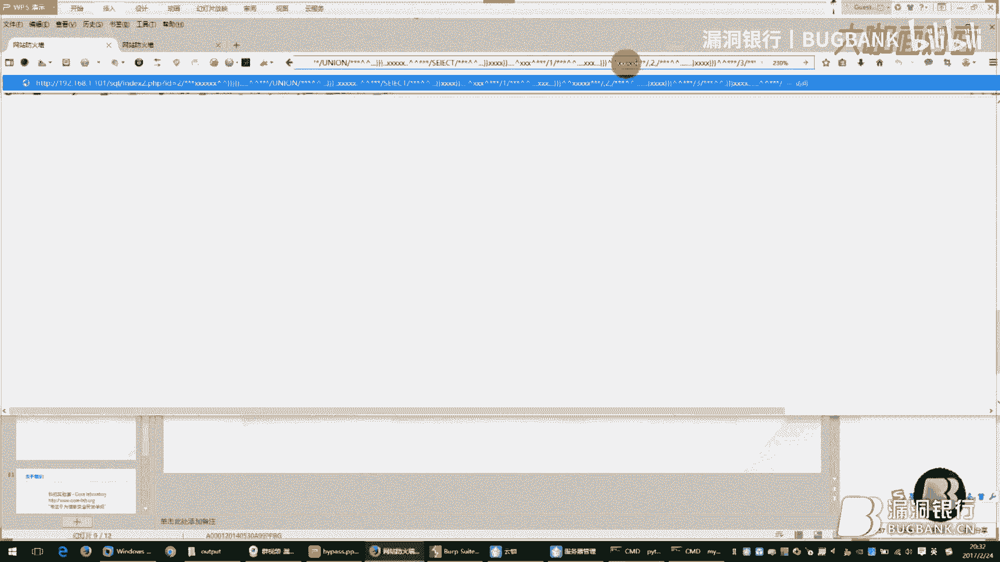

知道吧，如把这些东西共享出去的话。

你包括就现在云锁，还有那个安全狗，他们的漏洞我们也是经常在挖掘的，包括他们的服务器端，还有这个产品，这里这方面这方面都是去跟他们交流的，我们漏洞一般都是不是去提交或者怎么样，因为一个安全厂商。

他的东西做的有缺陷的话，客户用起来也会有一些那个什么，你知道吧，现在已经可以绕过了，我们再再往下，我们手工啊，手工手工，对不对，那这个三也是相当于一个填充嘛，我让前面的报错是他根本不会拦截的。

把这个三然后改成那个uber，看到没，输入了已经，懂了吧。

绕过了，所以说云锁还有f u c by pass的话。

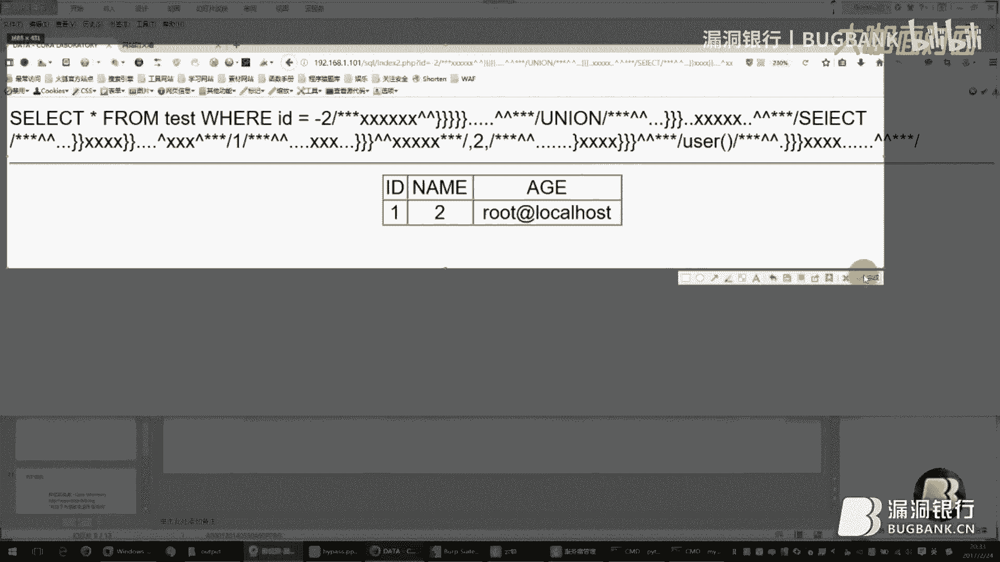

大家建议大家学python，我也是刚入门，不算溢出，它这个get我讲过了，浏览器它没有限制的放到服务器端安全度。

但是就是做了一个阿帕奇的插件，像监听服务，你知道吧，你每个数据请求过来，他都会去做匹配。

我研究这个也是研究很多，而且你看到没，我这个桌面上有两个日志，它会导出它的日志去看一下它的拦截特征，你知道吧。

都会查看他的拦截特征。

字符不是特定的啊，不是特定的，没看到，我都是瞎打的吗，你可以慢慢尝试尝试更多，我们见证奇迹啊，这个潘森的自动化自动化输入的结果看到没有，他跑完了，已经看到他这边union还有布尔值时间是不是都出来了。

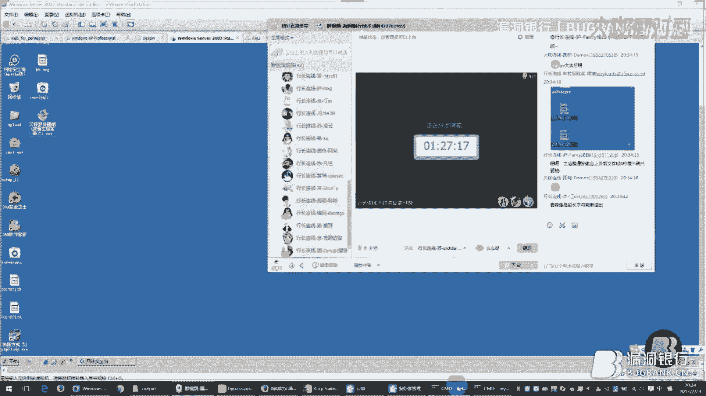

看啊再看，取得数据不明，完全没毛病了。

我们再再取他的，比如说pass word，爆破，他已经把密码给取出来了，就是它那个自动化嘛，嗯脚本的话你们自己去研究，这个我估计我就不公布了，反正方法都有，你只要手工手工扎实的话。

再去定位他这个拦截点啊，我现那我现在演示的并不一定，它这个所有的都不拦截一刀，他会拦截的，还有一些其他的东西啊，期待已久的这个，这是四点啊，我给大家看一下，看一下这个版本，而且还是最新版那个体验版。

什么鬼的，嗯，截图出来无图无真相，我的手机号也在上面，没关系，欢迎骚扰我，厚脸皮的，你可以自己去p u z z，首先你要写一个注入点，对不对，你要会p h p构造一个输入点，然后再去，对不对。

会手工之后你要会写这个潘就是自动化的脚本，自动化的脚本。

你写出来之后再慢慢的把这些拍到的慢慢完善，知道吧。

他自己跑懂了吧，你让他跑，假如这个没有返回，就是就是网站什么拦截网站防火墙什么的字眼，就证明你过了，知道吧，下面给大家看一下那个云锁啊，云锁绕过云锁很强，我只能这么说，很强很强，我把这个缓存给删了。

这是我写的这个语音锁的脚本。

也是这个注入点，我把这个我的拦截打开啊，可以看到这边有个服务器端管理，然后这边有个网站漏洞防护全部开启。

pos u21 全部都是拦截的。

我们现在把它的这个这个按到1=1。

对不对，现在好像是安全狗和云锁。

一直两个都开着呢，两个都开着呢，是最新版，是最新版，跑一下，如果这能过的话，那真的是无敌了，我们再看，可以看到他这边已经爆出特征了。

已经爆出特征了，等他跑完先不管，因为我这个脚本还有很多缺陷，见证奇迹的时刻出来了，你输入可以看到时间忙碌，它是不好拦截的，就没有开那个debug，因为比较敏感。

我现在把这个ppt稍微完善一下。

那你们有没有说要加什么其他的东西的。

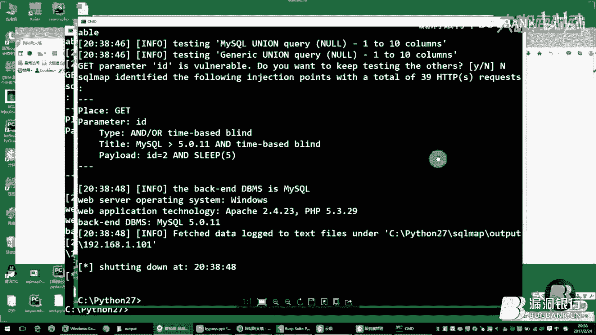

我是不会分享的，你要会手工珠也可以慢慢来嘛，并不并不是一定要会写这个脚本，对不对，脚本只是带去的人去操作，去工作的，那个有没有需要就是把前面的东西要讲再扩展扩展一点的，要再扩展一点的，没毛病。

老铁双击评论666，到了那个问答问答环节啊，很配合这些妹子的工作的，对对对，我讲完了，让我们感受一下精神打开的分享，然后你先留步，帮我们进入讲座的时候环节，第一个我们会先进入一个小小的互动环节，嗯好的。

今天的互动环节是这样，你提前来带我们，今天在讲课过程中有参与讨论的小伙伴，选出一位你认为的尽管听课最认真积极的小伙伴来选择行吧，你选一个选出来，然后呢，你先洗啊，好啊，等一下我找一下嗯。

好其实我感觉最积极的应该是那种不说话的人，知道吧，因为这种不说说话的人呢，他在用大脑跟我互动，再用心跟我互动，你说的很有道理，但你但你还是得在评论中选出院，因为他们他他越讨论，但你产生了互动。

好嗯我在我在翻，诶怎么没了，你们顶没了，我找完了，哎别动别动别动，就这个就这个就他了就他了，人家说了一句，思路很重要啊，我确定我是跟感觉走的好的好的，那黑橙黑橙在吗，a，好，但估计是在城，好的好的。

那恭喜黑群小伙伴今天分享了，就是相当于是我们的幸运观众，然后七选你还在吗，我在我在我在那你嗯，你来选一本书，然后可以是跟英文所讲主题相关的书籍，也可以是其他技术相关的吧，就ok然后由你选出各个银行。

或者帮你改成，就是是代表我送给黑人，还是代表漏洞，银行送给你，你送给黑犬，然后我们来送，是选一本书是吧啊，任何名字吗，我跟我技术相关的，可以可以可以跟你今天晚上讲的相关的，这样子啊，我装吗。

嗯我们我们帮你买呀，唉那那个要不我们协商一下，哎黑城你想要什么书，对不对，根据人家的来来送的计算机安全了，这方面对不对，网络安全的可以，你说一下吧，你想要什么书啊，这样慢慢找不着急，嗯好就。

我们之后让四辆黑车，然后再询问他想要什么数，然后我们再等下，我们会嗯，我们那代表听听选，可以共处，可以吗，可以可以可以啊，这样的小伙伴们就先定了哈，好那我们接下来就进入问答环节啦，小伙伴们久等了。

大家可以提问了吧，问答，内容就是这个数据库方面的，哎我可以分享一下我那个看什么心得什么的，就简单的一些东西。

那个没有问题。

