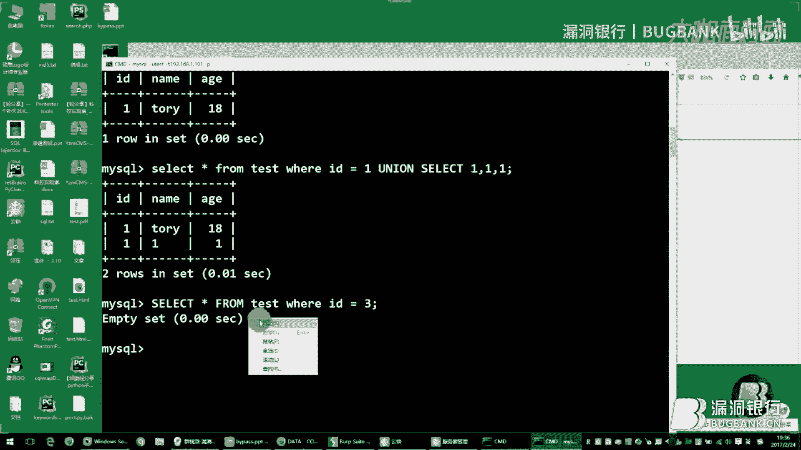

# 课程P1：绕过WAF（安全狗、云锁）自动化注入教程 🔐


在本节课中，我们将要学习如何绕过常见的Web应用防火墙（WAF），特别是安全狗和云锁，以实现自动化SQL注入。课程将从基础概念讲起，逐步深入到具体的绕过技术和自动化脚本编写。

## 概述：CDN与WAF基础

CDN（内容分发网络）用于实现网络负载均衡和内容分发，以提高用户访问的响应速度和命中率。它现在扩展的功能包括安全防护和文件缓存等。

其原理是：假设有三个客户，他们各自所在地都有一个CDN节点，最终请求到达Web服务器。如果客户在浙江，他的请求会首先经过CDN节点。CDN节点会将请求分发到离用户最近的线路，然后到达服务器端。这样就减少了网络路径，访问速度会比直接访问遥远的服务器（例如国外服务器）快很多，从而提高了用户的响应速度。

CDN有几个特点：
*   **文件缓存**：缓存静态文件（如图片、CSS、JS、HTML文本文件），使访问速度加快。
*   **文件指纹识别**：通过文件的哈希值（如MD5值）来识别用户是否更改了这些文件。
*   **隐藏真实地址**：保护服务器安全。只要不知道服务器的真实地址，客户从任意地点访问服务器时，都会直接访问CDN节点。剩下的过程是：经过CDN节点将数据发送给服务器端，服务器处理完后再发给CDN节点，CDN节点处理完数据后再返还给客户端。整个过程都经过CDN节点，CDN节点相当于一个中间人，主要作用是加快访问速度。

## Web渗透测试框架分层

上一节我们介绍了CDN的基本原理，本节中我们来看看渗透测试中Web应用的分层架构。理解这些层次有助于我们定位和绕过防护。


我大致将渗透测试的Web框架列为四个层（根据个人理解可以有更多层）：
*   **静态层**：我们经常访问的JS、图片、HTML等静态文件。服务器端返回的这些内容不是动态的。
*   **动态层**：PHP、JSP、ASP、ASPX等动态脚本语言，以及构建的一些开发框架（如Java的Spring、PHP的Laravel、ThinkPHP等开源框架）。
*   **服务器层**：开源的Apache、IIS、Nginx这三种比较常见的Web服务器。
*   **系统层**：Windows、Linux操作系统。

在整个渗透测试过程中，权限可以感觉到是从静态层一直向系统层延伸的，权限会从小到大。当你刚开始接触渗透测试时，可以从静态层慢慢了解和学习，一步一步向系统层进发。

以下是各层可能涉及的安全问题举例：
*   **静态层**：例如JS引发的安全隐患，如反射型XSS、DOM型XSS等。
*   **动态层**：一般是文件读取、文件上传、变量覆盖等，这些属于代码审计的内容。不同语言有各自的特性，低版本的PHP也有很多缺陷。
*   **服务器层**：Apache、IIS、Nginx都有一些解析漏洞。
*   **系统层**：通常说的溢出、提权等。

只要你入门渗透测试，可以在大脑中理清这些层次的概念。其实还有一个**网络层**，你可以大致了解TCP/IP协议和OSI模型，知道数据如何走向以及服务器端如何处理。这样在遇到问题时，就更容易解决。

## 绕过WAF：架构层与协议层

理解了Web应用的分层，我们开始探讨如何从架构层和协议层绕过WAF的防护。

### 1. 架构层绕过（寻找真实IP）

假设目标服务器在其域名上加了CDN，我们可以尝试以下方法寻找真实IP：
1.  **查询历史DNS解析记录**。
2.  **查询子域名解析地址**，看是否和主域名的IP地址相近，然后再查C段IP，慢慢测试。
3.  **社会工程学**：这种方法条件比较苛刻。
4.  **利用CDN节点分发缺陷**：有的地区没有CDN节点，请求可能会直接指向真实IP地址。


拿到真实IP地址后，如何绕过CDN呢？可以直接修改本地的hosts文件，将域名指向真实IP。这样数据就直接发送到服务器上，不经过CDN了，CDN的防护措施也就失效了。


### 2. 协议层绕过（匹配资源大小限制）


我们一般在访问网站时，大部分是两种请求：GET和POST。




*   **GET方法**：提交的数据长度大小没有限制（但浏览器地址栏长度有限制）。WAF在处理GET请求时，可能会根据客户端浏览器规定的长度去匹配。例如，浏览器规定长度是500个字符，如果你提交了1000个字符，WAF可能只处理前面500个字符，剩下的500个字符WAF不会处理，这就可能达到攻击效果。
*   **POST方法**：其限制取决于服务器的处理能力（网络带宽、硬件配置、环境优化等）。例如，在PHP中，配置文件里可能设置了最大接收数据大小为2MB。如果你提交一个8MB的数据包，WAF可能只匹配其中2MB或4MB，而服务器最大能接收8MB，那么剩下的数据（如6MB）我们可以在里面填充攻击载荷，WAF可能也拦截不了。


这些都是以前的老理论，针对老式WAF。现在WAF产品已经强大了很多，这些方法可能不完全适用。


### 3. 协议未正确解析（参数污染）


我们来看看什么是协议未正确解析。假设一个页面接收GET请求的参数`id`来查询数据。这是一个GET请求，当前脚本只接收GET方式传递的`id`值。


但是，如果我发送一个POST请求，在URL里同样带上`id`参数，脚本也是可以接收并查询出来的。这属于一种**方法污染**，即GET请求可以接收的参数，用POST方式传过去脚本也接受。


还有一种**参数污染**，比如在Cookie中设置一个非常大的值，有时WAF可能承受不了这么大的数据包，或者因其他参数污染而导致匹配规则定位出现偏差。这就像做免杀时要定位特征码一样，我们需要定位WAF拦截的特征，然后进行绕过。


## 文件上传绕过WAF演示


现在给大家演示文件上传如何绕过WAF。假设有一个文件上传点，我们选择一个文件进行上传并抓包。

我们测试WAF的拦截点。将文件扩展名改为`.php`，WAF拦截了（返回500）。改为`.txt`，上传成功。我们的目标是把`.php`文件上传上去。


该怎么办呢？一种方法是把`filename=`后面的双引号改成单引号，或者不写引号等。WAF匹配时可能使用正则表达式，例如：`filename=`后面是一个双引号或单引号，然后是任意字符，接着是若干个点`.`，最后是`php`等扩展名。


如果我们把双引号改成单引号，WAF可能依然能匹配到。如果WAF的正则同时匹配单双引号，那么单引号也无法绕过。

`filename`这个键值对，在HTTP协议中，等号后面是值（value），值后面是允许加分号`;`的。Apache服务器在处理时，会把这个分号自动去除掉，那么PHP接收到的就是`xxx.php`。通过添加分号，我们可能直接绕过上层的拦截。

此外，还可以尝试**HTTP参数污染**，即提交多个无用的值或重复的键到数据包中，以达到攻击效果。这取决于Web服务器的特性。例如“双文件上传”，原理是提交两个`filename`内容，后面的值可能会覆盖前面的值。但测试发现，现在这种方法可能也被拦截了。

## SQL注入基础与手工注入


在了解了文件上传的绕过思路后，我们进入SQL注入的核心部分。首先回顾SQL注入的基础类型和手工注入方法。

SQL注入大概有四种主要类型（不限于此）：
1.  **Union注入（联合查询）**：要求前后查询的字段数目必须相同。
2.  **布尔盲注**：根据页面返回的真/假（正常/错误）状态来穷举数据。
3.  **时间盲注**：根据Web的响应时间来判断。如果数据库查询没有处理完毕，脚本会一直等待，Apache也会等待，数据就不会返还给客户端。
4.  **报错注入**：利用数据库报错信息来获取数据。数据库厂商可能没有着重处理错误信息。


### Union注入原理与实践


我们使用一个MySQL环境（MySQL + PHP + Apache 2.4）进行演示。首先关闭WAF防护，进行手工注入练习。


假设有一个查询点 `id=1`，可以正常查询。我们尝试注入 `and 1=1`。


进行Union注入，首先需要判断当前查询的字段数目，一般用 `order by` 或者 `union select`。只要不报错，可以继续增加字段数进行尝试。字段内容可以是数字1，也可以是字符串。


**为什么有时要让前面的查询语句报错？**
例如，查询 `id=1 union select 1,2,3`，如果`id=1`能查到数据，那么页面会显示两条记录（第一条和union查询的结果）。为了让页面只显示我们union查询的结果，通常需要让原查询条件失效（例如 `id=-1` 或 `id=1 and 1=2`），这样原查询返回空结果，页面就会只显示union查询的结果。


在Union查询中，我们可以调用MySQL的全局变量或函数，例如：
*   `version()`：数据库版本
*   `user()`：当前用户名
*   `database()`：当前数据库名称
*   甚至进行MD5加密等操作


### 利用information_schema进行深入注入


要查询数据库中的其他表（如管理员表）的内容，需要利用 `information_schema` 数据库。这个数据库存储了当前用户对数据库的所有权限、数据库名、表名、列名等信息。


手工注入步骤示例：
1.  **爆出数据库名**：`union select 1,database()`
2.  **查询当前数据库下的所有表名**：
    ```sql
    union select 1,table_name from information_schema.tables where table_schema='当前数据库名' limit 0,1
    ```
    使用`limit`来逐条获取表名。
3.  **查询某张表的所有列名**：
    ```sql
    union select 1,column_name from information_schema.columns where table_name='表名' and table_schema='数据库名' limit 0,1
    ```
4.  **查询表内数据**：
    ```sql
    union select 1,列名1,列名2 from 表名 limit 0,1
    ```
    可以使用`concat()`函数将多个字段值拼接，方便爬虫或工具提取。

## 盲注：布尔、时间与报错


上一节我们介绍了Union注入，本节中我们来看看当页面没有直接回显数据时，如何利用盲注技术获取信息。


### 布尔盲注

布尔盲注利用页面返回正常或错误的状态来进行判断。例如，注入 `and 1=1` 页面正常，`and 1=2` 页面错误，说明存在注入点。

关键函数：`if(condition, value_if_true, value_if_false)`
例如：`if(1=1,1,2)` 返回1；`if(1=5,1,2)` 返回2。


我们可以利用这个函数进行判断。例如，判断当前数据库用户名的第一个字符：
```sql
and if(substring(user(),1,1)='r',1,2)
```
如果页面正常，说明第一个字符是'r'。通过脚本循环遍历所有可能字符，即可爆破出整个用户名。


另一个有用函数是 `count()`，用于统计记录数。可以用于判断表或列是否存在，例如：`and (select count(*) from 表名)>0`。


在取具体数据时，会结合 `substring()` 或 `mid()` 截取函数，以及 `ascii()` 函数将字符转为ASCII码进行逻辑运算，通过二分法或遍历来逐位判断字符内容。这个过程比较繁琐，通常需要自动化脚本完成。


### 时间盲注


时间盲注利用 `sleep()` 函数，根据页面响应时间来判断条件真假。
例如：
```sql
and if(ascii(substring(database(),1,1))>100, sleep(2), 1)
```
如果数据库名的第一个字符的ASCII码大于100，则页面会延迟2秒返回。通过判断延迟时间，可以逐位推断出数据内容。


### 报错注入


报错注入利用数据库执行函数时产生的错误信息来回显数据。
例如，使用 `extractvalue()` 或 `updatexml()` 函数：
```sql
and extractvalue(1, concat(0x7e, (select user()), 0x7e))
```
这个函数会执行中间的SQL子查询（如 `select user()`），并将结果以错误信息的形式返回。前提是页面会显示数据库报错信息。


## 绕过安全狗WAF进行注入


掌握了手工注入技术后，我们现在面对开启WAF（如安全狗）的环境，学习如何绕过其防护规则进行注入。

开启安全狗后，普通的 `and 1=1` 会被拦截。我们需要分析其拦截规则。


**观察与测试：**
1.  测试发现，`and 1=1`（数字比较）被拦截，但 `and 'a'='a'`（字符比较）可能不被拦截。
2.  `and user()='root@localhost'` 这种字符串与函数的比较，也可能不被拦截。这意味着我们可以通过布尔盲注来爆破用户名等信息。
3.  `union select` 在一起时会被拦截，但单独出现 `union` 或 `select` 可能不拦截。说明WAF匹配的是 `union` 和 `select` 的组合。


**绕过思路：**
在 `union` 和 `select` 之间插入注释或特殊字符，干扰WAF的正则匹配。
例如：
*   `union/**/select`
*   `union/*!50000select*/`
*   `union/*!select*/`
*   `union all select` (有时`all`可以绕过)
*   使用内联注释 `/*!union*/ select`


WAF可能会对URL进行解码后再匹配，所以简单的URL编码（如`%20`空格）可能无效。关键在于找到WAF正则没有覆盖到的特殊字符组合。


**自动化Fuzz：**
由于可能的字符组合非常多，手工测试效率低。建议编写Python脚本进行Fuzz（模糊测试），自动在 `union` 和 `select` 之间插入各种字符、数字、符号的组合，然后根据返回页面是否包含“拦截”、“防火墙”等关键字来判断是否绕过成功。


通过Fuzz，我们可以找到能绕过特定WAF规则的“载荷”。例如，最终可能找到像 `union/*!11440select*/` 这样的形式可以成功绕过。然后就可以在此基础上进行后续的Union注入。


对于布尔盲注和时间盲注，由于语句构造更加灵活，且不依赖`union select`这种明显特征，往往更容易绕过WAF。


## 自动化注入脚本与云锁绕过


最后，我们探讨如何将绕过技术自动化，并简要提及云锁的绕过。


**自动化脚本思路：**
1.  首先需要手工发现一个注入点，并判断注入类型（Union/布尔/时间/报错）。
2.  针对目标WAF（如安全狗），使用Fuzz脚本生成绕过特定关键词（如`union select`）的载荷。
3.  编写自动化注入脚本，集成数据获取逻辑（如通过`information_schema`获取库、表、列、数据）。
4.  脚本需要能够识别WAF拦截页面（通过页面特征关键字），并自动切换或生成新的绕过载荷。


**云锁绕过：**
云锁是另一款强大的WAF。其绕过思路与安全狗类似，但规则集不同。同样需要通过手工测试或Fuzz来定位其拦截特征，然后构造绕过语句。例如，时间盲注在云锁环境下可能相对容易成功，因为其规则对时间延迟的判断可能不那么严格。


**重要提示：**
*   本文分享的技术思路旨在用于安全研究和授权测试，帮助安全人员理解WAF原理并提升防护能力。
*   不建议将自动化攻击脚本公开或用于非法用途。安全研究人员应与厂商积极沟通，共同提升产品安全性。
*   扎实的手工注入功底是编写自动化工具的基础。


## 总结

本节课中我们一起学习了以下内容：
1.  **CDN与WAF基础**：了解了CDN的工作原理及其在安全中的作用。
2.  **Web渗透分层架构**：建立了静态层、动态层、服务器层、系统层的概念模型。
3.  **绕过WAF的多层思路**：包括架构层（找真实IP）、协议层（大小限制、参数污染、方法污染）。
4.  **文件上传绕过**：通过修改分隔符、参数污染等方式绕过WAF对文件扩展名的检查。
5.  **SQL注入核心**：详细讲解了Union注入、布尔盲注、时间盲注、报错注入的原理和手工方法。
6.  **绕过安全狗实践**：分析了安全狗的拦截特征，提出了通过注释、特殊字符Fuzz来绕过 `union select` 等规则的方法，并强调了自动化Fuzz脚本的重要性。
7.  **自动化与云锁**：简要介绍了自动化注入脚本的编写思路和对云锁WAF的绕过考量。


核心在于理解WAF的匹配原理（通常是正则表达式），然后通过构造非常规的、但数据库又能正确解析的语句，来绕过这些匹配规则。这需要耐心、细致的测试和扎实的数据库与HTTP协议知识。