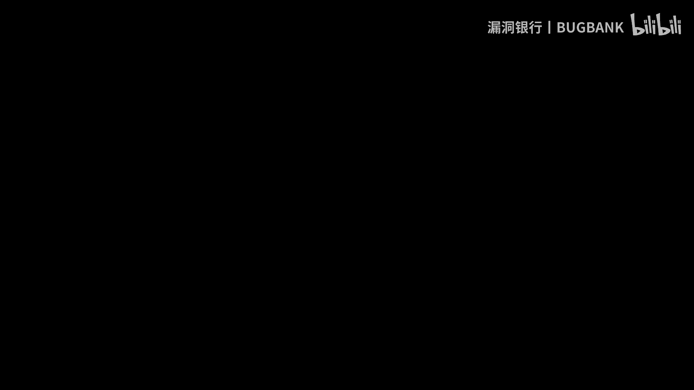

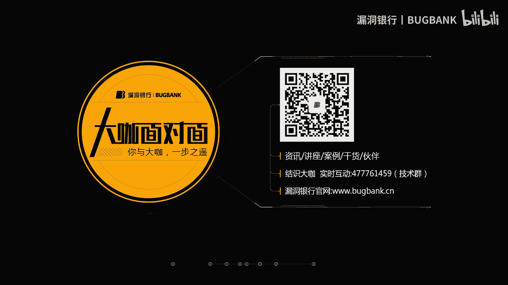

# CTF图片隐写术入门教程（第25期）🔍

在本节课中，我们将学习CTF（Capture The Flag）竞赛中常见的图片隐写术。隐写术是一门关于信息隐藏的技巧与科学，其核心目的是不让除预期接收者之外的任何人知晓信息的传递事件或内容。在CTF比赛中，选手需要从看似普通的图片中，通过各种技术手段找出隐藏的“Key”（密钥）并提交。本节课将介绍几种主流的图片隐写术类型、核心概念、常用工具及解题思路，内容力求简单直白，适合初学者入门。

## 概述：什么是图片隐写术？🤔

隐写术算是一种加密技术。权威的说法是，它是一门关于信息隐藏的技巧与科学。所谓信息隐藏，指的是不让预期的接收者之外的任何人知晓信息的传递事件或者信息的内容。

现在各大CTF比赛中都有关于图片隐写术相关的题目。出题者通过将Key隐藏在图片中，或者通过图片的其他方式隐藏起来，选手则需要找到各种方式找出正确的Key并提交。这就是图片隐写术的简单介绍。

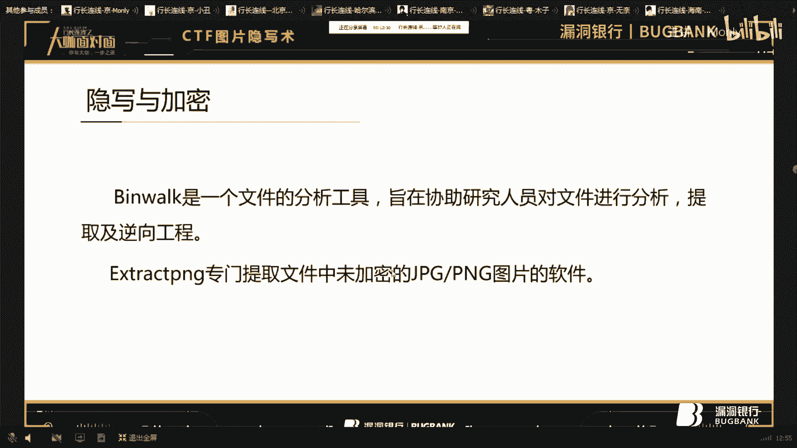

## 第一类：修改数据（LSB隐写）💻

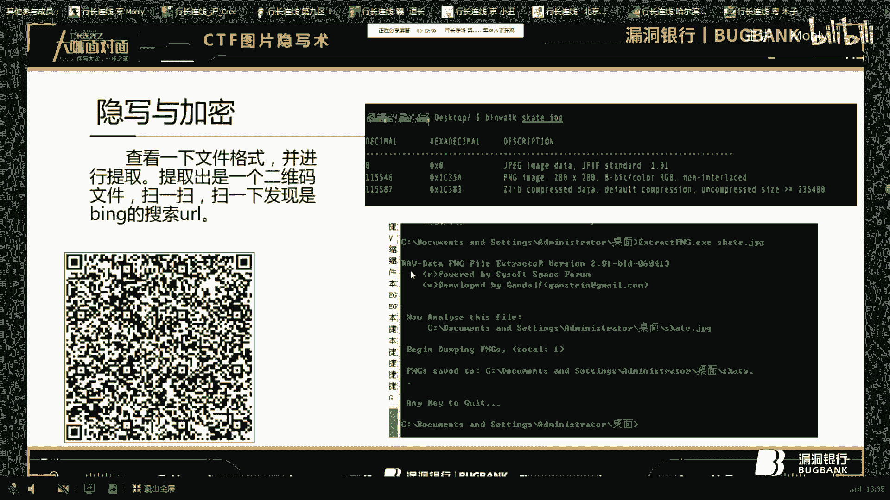

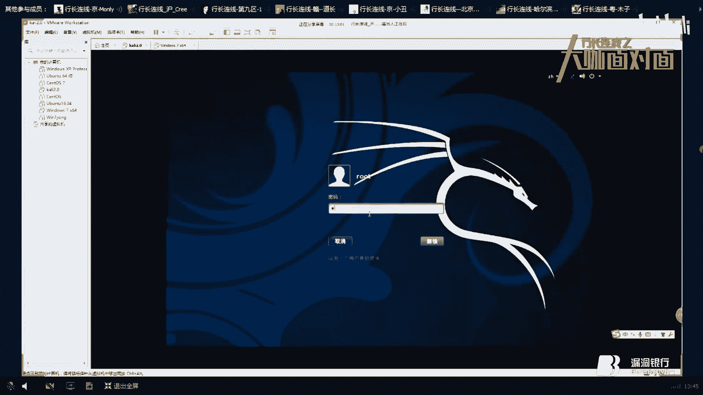

上一节我们介绍了图片隐写术的基本概念，本节中我们来看看最常见的一种类型：修改数据的LSB隐写。

LSB（最低有效位）隐写是修改像素中的最低一个比特位。由于人眼难以察觉这种细微变化，信息就被隐藏起来了。这种方法通常用于PNG格式的图片。

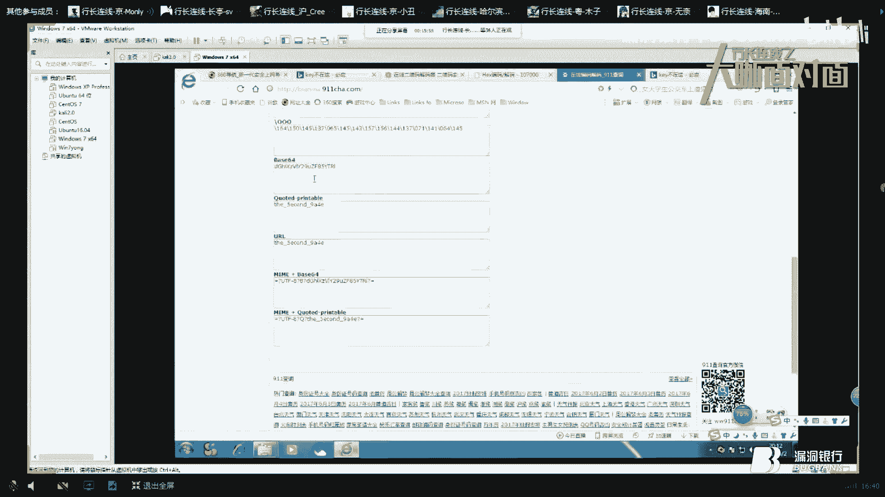

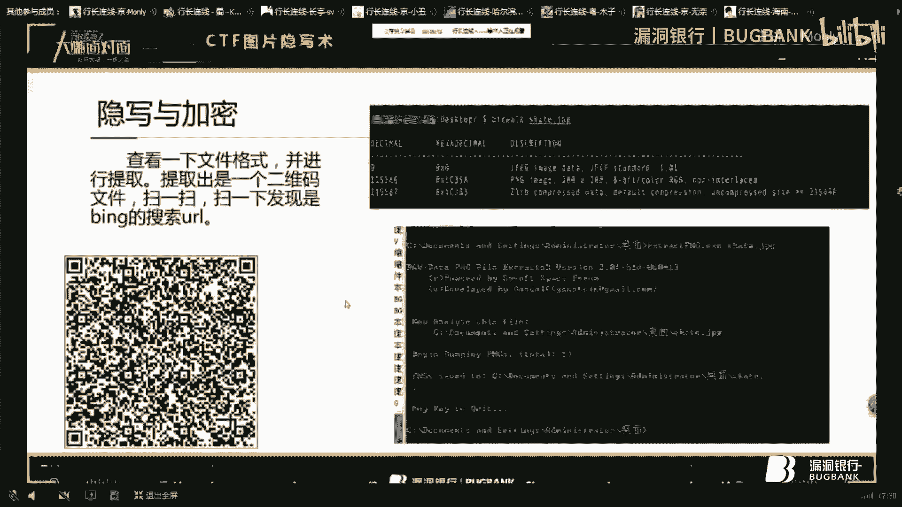

**核心概念**：
PNG图像一般由红（R）、绿（G）、蓝（B）三原色组成，每种颜色占用8位，取值范围是 `00` 到 `FF`（十六进制），即十进制的0到255。因此，总共可以表示 `256 * 256 * 256` 种颜色。LSB隐写就是修改每个颜色通道最低位的值（例如，将最后一位从0改为1）。

以下是LSB隐写常用的工具介绍：
*   **工具名称**：Stegsolve（图片通道查看器）
*   **工具描述**：这是一款用Java编写的工具，用于查看和分析图片的各个颜色通道。
*   **使用场景**：当你拿到一张PNG格式的图片时，可以先用这个工具切换不同的通道（如Red plane 0, Green plane 0等），观察是否在某个通道中隐藏了额外的图像（如二维码）。

**案例演示**：
1.  用Stegsolve打开一张PNG图片。
2.  通过不断切换不同的色彩通道和位平面，最终在某个通道中发现了一个隐藏的二維碼。
3.  用手机扫描该二维码，即可得到Key。有时Key可能还需要进一步解密。

## 第二类：隐写与加密结合🔐

在CTF比赛中，隐写术常常会与加解密技术或编码方式结合起来。选手需要先提取出隐藏的数据，再进行解密或解码才能获得最终的Key。

以下是这类题目中常用的分析工具：
*   **工具名称**：Binwalk
*   **工具描述**：这是一个文件分析工具，旨在协助研究人员对文件进行分析、提取及逆向工程。在Kali Linux等系统中通常自带。
*   **工具名称**：Foremost / dd
*   **工具描述**：这类工具专门用于从文件中提取未加密的JPG或PNG图片。

**解题流程演示**：
1.  **分析文件**：使用 `binwalk` 命令分析图片文件，发现其中隐藏了一个PNG文件的文件头和数据。
    ```bash
    binwalk image.jpg
    ```
2.  **提取文件**：使用 `foremost` 或 `dd` 命令将隐藏的PNG图片提取出来。
    ```bash
    foremost -i image.jpg
    ```
3.  **分析提取物**：提取出的文件是一个二维码图片。
4.  **扫描解码**：扫描二维码，得到一个URL（例如一个百度搜索链接）。
5.  **深入分析**：仔细观察URL，发现末尾有 `%3D%3D`，这在URL编码中代表两个等号 `==`。在CTF中，`==` 通常是Base64编码的填充符。
6.  **解密获得Key**：将URL中 `?key=` 后面的参数进行Base64解码，即可得到最终的Key。

这个流程展示了如何将文件分析、数据提取和密码学解码结合在一道题目中。

## 第三类：利用文件元数据（EXIF）📸

有些题目会将信息隐藏在图片的元数据（EXIF信息）中。EXIF信息记录了拍摄设备、时间、GPS位置等数据。

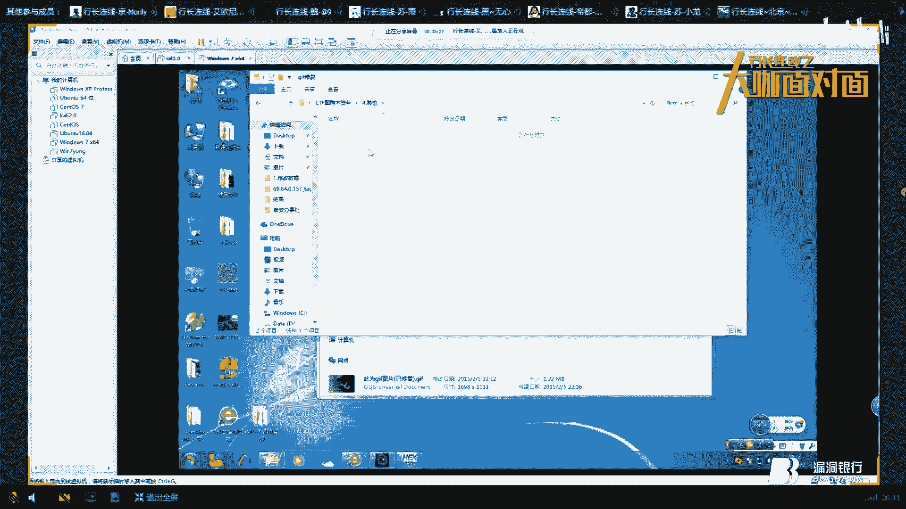

以下是查看和编辑EXIF信息的工具：
*   **工具名称**：Magic EXIF 或 exiftool
*   **工具描述**：这是一款强大的照片EXIF元数据编辑器，可以读取和编辑大量图像格式的元数据。

**解题思路**：
1.  **注意提示**：题目描述可能会给出线索，例如“用Pad拍了一张”，这暗示可能需要查看图片的EXIF信息。
2.  **查看元数据**：使用 `exiftool` 或 Magic EXIF 打开图片，仔细查看所有字段。
    ```bash
    exiftool suspicious_image.jpg
    ```
3.  **发现异常**：在某个字段（如“制造商注释”、“用户评论”等）中发现一段很长的、非常规的十六进制字符串。
4.  **解码数据**：将该十六进制字符串进行解码，可能会得到另一段字符。
5.  **进一步解密**：对得到的字符尝试常见的编码（如Base64），最终解密出一串有意义的单词，这串单词可能就是解压密码或最终的Key。

这类题目的关键在于对题目提示的敏感度，以及知道去哪里查找这些隐藏信息。

## 第四类：文件结构利用与修复🔧

信息也可能隐藏在图片的文件结构本身，或者题目给出的是一张损坏的图片文件，需要先修复才能看到内容。

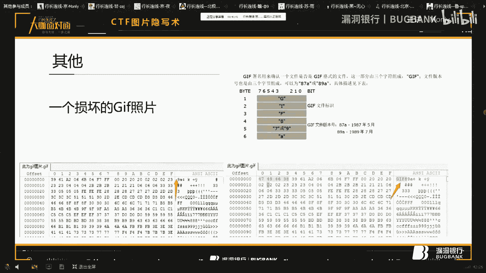

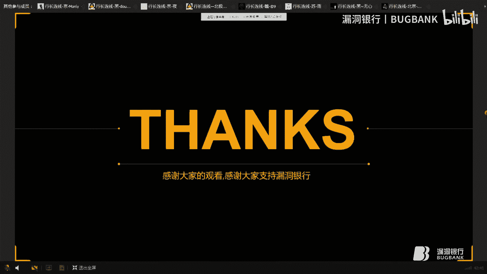

**案例：修复损坏的GIF文件**
GIF文件有固定的文件头（Signature），通常为 `GIF87a` 或 `GIF89a`。
1.  **分析文件**：使用十六进制编辑器（如 `010 Editor` 或 `WinHex`）打开一个无法显示的GIF文件。
2.  **发现问题**：发现文件开头缺少 `GIF8` 这样的文件头标识。
3.  **修复文件**：在文件开头插入正确的文件头（如 `GIF89a`），然后保存。
4.  **查看内容**：用图片查看器打开修复后的GIF，它可能是一个多帧动画，Key就隐藏在某一帧或需要组合多帧信息才能获得。

**核心工具**：十六进制编辑器（`010 Editor`, `WinHex`, `HxD`）。

## 其他类型与技巧💡

除了以上类型，还有一些其他脑洞大开的隐写方式：
*   **截图拼接**：题目给出一系列截图，每张截图上有部分字符，将所有截图上的字符按顺序拼接起来就是Key。这通常是送分题。
*   **文件格式伪装**：将一个非图片文件（如文本、压缩包）的后缀名改为 `.jpg`，让人误以为是图片。解题时，尝试用 `file` 命令识别真实类型，或用十六进制编辑器查看文件头，或直接修改回正确的后缀名。
*   **多技术混合**：隐写术可能与其他领域结合，例如将图片数据转换成音频波形，其中可能隐藏着摩斯密码。

## 总结与建议📚

本节课我们一起学习了CTF中图片隐写术的几种常见类型：
1.  **LSB隐写**：修改像素最低有效位，使用Stegsolve等工具分析通道。
2.  **隐写与加密结合**：使用Binwalk分析并提取隐藏文件，再结合Base64等编码解密。
3.  **利用元数据（EXIF）**：使用exiftool查看图片属性，寻找隐藏信息。
4.  **文件结构修复**：使用十六进制编辑器修复损坏的文件头。
5.  **多种其他技巧**，如文件格式伪装、多帧动画等。

对于初学者，建议：
*   **积累工具**：将本节课提到的工具（Stegsolve, Binwalk, exiftool, 十六进制编辑器等）收集起来，形成自己的工具箱。
*   **多做练习**：隐写术的套路有限，通过大量练习可以积累“题感”，看到图片就能产生几个可能的调查方向。
*   **耐心尝试**：解题时往往需要将多种方法逐一尝试。思路可能就在“灵光一现”之间，而经验能增加“灵光”出现的概率。

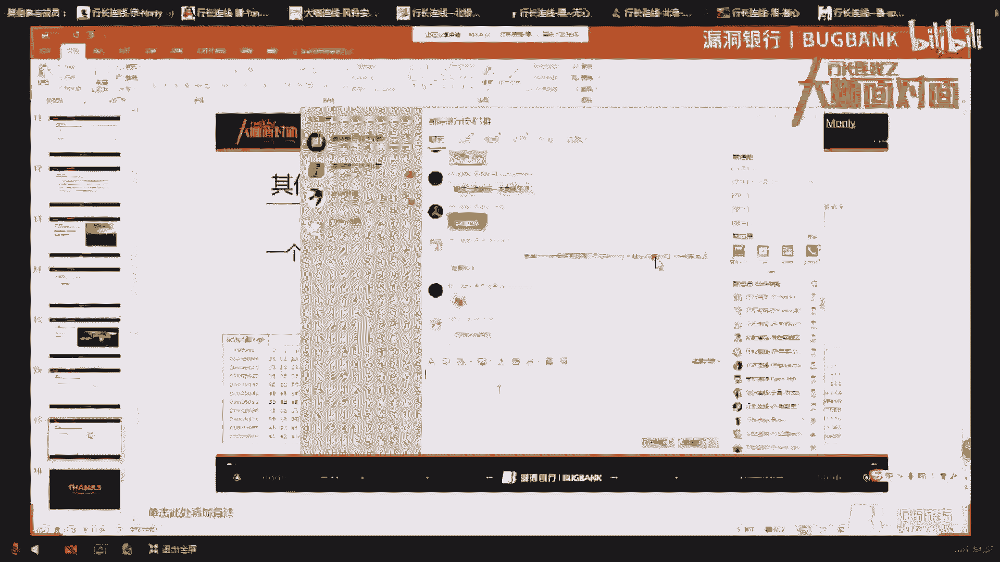

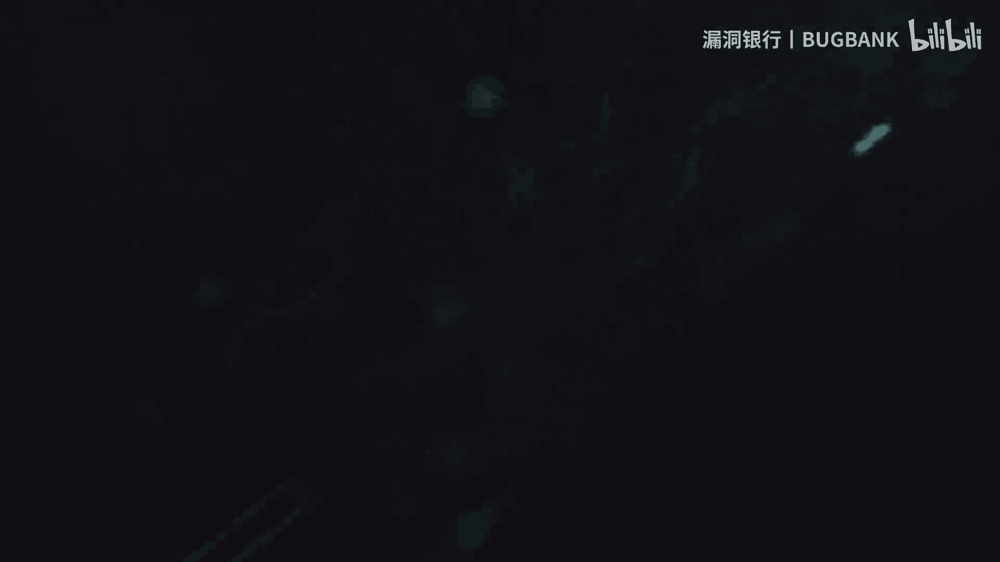

CTF图片隐写术就像侦探游戏，需要细心观察、大胆假设和耐心验证。希望本教程能帮助你打开这扇有趣的大门！