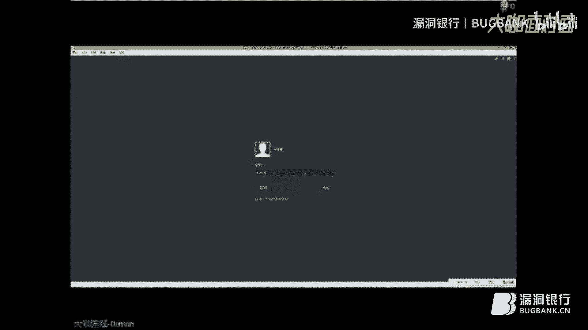
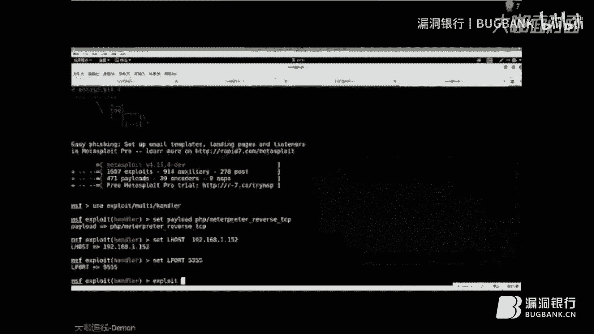

# P1：【录屏】Metasploitable3专题课程——大咖Demon分享 - 漏洞银行BUGBANK - BV1ry4y1m7gh

欢迎来到由极客安全出品的MindSphere F3专题课程。

我是主讲人Demofu，首先来一段简单的自我介绍，我是来自极客安全团队的一名成员，我对MindSphere和黑苹果都比较感兴趣，目前对Web渗透这一块比较对它一个深入学习。

平时在爱春秋和团队的博客更新一些技术文章，同时也希望借助的这次课程能给各位带来不一样的思路，最后希望各位表哥表姐能在课程中指出一些不足之处，我可以来简单的介绍一下我们这次的一个靶机。

MindSphere F3，在此之前呢，大家都知道，看不到吗，看不到这个PPT吗，喂，有实战有实战有实战，不要哄不要哄，在此之前呢，大家都知道这个奥的版本呢，它是基于Ubuntu这么一个系统。

它是一个渗透演练的这么一个环境，然而在这个MindSphere F2的一个不足之处呢，再加上Revit 7，它的官方社区没有对它一个及时的一个更新和维护，导致最后呢，越来越不适用于这个当前的系统环境。

最后在一个今年的11月份，MindSphere F3发布了这么一个靶机环境，正好弥补了这些缺陷，OK让我们看一下啊，这个二的二和三的这么一个区别，在之前的二呢。

它是可以根据什么MytusPrize这么一个模块利用啊，基本上不用花费更长的一个时间啊，比如说拿起MS08067就可以啊，干嘛远程的这个溢出漏洞啊，然后就可以拿到这么一个权限了。

在MytusPrize F3中的啊，这两位小哥就给自己的一个设计的靶机，加上一个防火墙啊，全线设置啊，等等的一些东西，而包括里面增加一个什么Blank，可以让我们玩一些什么CTF之类的一些东西。

而且还里面可以增加一些什么拓展性的一些东西，可以建立一些什么相关的一个节点啊，安装在一个多台的一个中端设备，对吧，OK让我们首先在之前的我们参考一下PTS的一个渗透执行标准。

里面我们可以看到几个重要的环节，其中包含了一个什么信息收集啊，还有一个是渗透攻击以及后渗透攻击的这么一个阶段，在此之前的这个信息收集的这么一个环节，需要我们去花大量的时间来进行这么一个信息收集。

我们基本上是才会用什么50%的这么一个时间呢，去对他一个信息收集这么一个过程之后呢，我们会短短的那么，短短的那么是一点时间会去对他一个渗透攻击这么一个阶段，在此之前呢，我们要说的是前期的一个信息收集啊。

会对一个后期的渗透测试起到一些什么，引导性的作用，决定我们后期的一个渗透测试的这么一个工作啊，是吧，能否一举拿下这个服务器的这么一个权限，因此呢，我们在没有在这个前期的充分准备啊。

信息收集这么一个工作啊，那么我们会在一个后期的渗透测试过程中，你会拿他毫无办法，毫无办法啊，首先让我们来思考一下，我们在做这个渗透测试时候。

一般会通过什么样的方式或者工具来完成这么一个前期的信息收集这么一个工作，群里的伙伴可以啊，说一下你们一般都会采用一个什么样的方法，有人回答我吗，有人说到MF了，耶稣，卡丽也可以，耶稣也可以，还有吗。

八个Scan也可以，百度，我可以刚才有，阿迪也可以，可以很6的，我比较喜欢这个什么卡丽夏的阿迪对吧，OK，回到正题啊，我们之前有小伙伴来也会刚刚有有人说啊，MF对吧。

我们当我们面对的是Minecraft，三的这么一个靶机的时候，我们就要可以用到什么MF这么一个啊，网络扫描工具对吧，去扫他一个端口啊，啊，以及什么操作系统等等的一些方面对吧，OK，让我们啊。

让我为大家简单的演示一下这个MF的一个初步兴起这么一个过程啊。

OK，各位能看到吗，能看到我的屏幕吗，能看到了扣个一扣个一啊，看到扣个一，啊，OK，首先呢，首先呢啊能看到这个画面吗，能看到这个画面吗，啊，111啊全都一样，好激动啊，啊，首先呢。

让我们来介绍一下这个把机的这么一个环境大件啊，啊，他是由一个什么Windows server2008R这么一个系统版本，啊，首先让我们简单的来看一下他里面啊，一个IP地址啊等等的一个信息，啊。

这个可以看到是什么啊，我们是在一个内网搭建的这么一个环境啊，OK我们这次利用到的这么一个系统是卡丽，Linux这么一个系统，没关系啊。

QQ看不到没关系，到时候会录播的，以及啊，我之前录提前录制好的一份视频，到时候可以参考一下，各位能看到这个里边的一些信息吗，以及我这个鼠标晃动的一些东西，能看到的可可依，OK，啊。

这个是我之前的对一个这么一个把机的信息的一个收集，这么一个结果，各位可以看一下啊，这边是一个什么，IP地址，对方的这么一个把机的一个IP地址啊，以及这么一个端口，以及啊，协议系列型。

以及这个端口开放的这么一个，这个东西还有还可以看到什么，协议的这么一个版本信息的吧，很很清楚都可以看到什么版本7。1，2。0等等的，我们需要去给他一个啊，详细的信息去利用怎么去利用它对吧。

OK我们对一个我们首先使用Nmap，对他一个信息收集的这么一个过程，这样能看得到吧，我把画面调的很大了，对吧，OK，我们使用一个Nmap，对吧，然后我们可以啊，加上一些参数，比如说是Syn的一个扫描。

对他一个半开式的啊，对吧，呃，以及我们需要加上一个什么，刚刚我说到的是一个信息的一个版本的一个扫描，这么一个参数，这个是信息扫描的一个版本，对他一个啊，协议类型啊，去给他一个列举出来一个啊。

软件的这么一个版本，然后我们需要加上一个什么啊，杠逼对他一个是Nmap一个扫描的这么一个详细过程，以及我们需要啊，一些Nmap解析的这么一个工作啊，我们因为是打击啊，而且是内网搭建的一个环境。

我们就不需要去让他去解析DNS的这么一个解析过程，我们省了一个一些时间，然后我们还要去再加上一个什么去对他一个端口的扫描啊，我们这边也可以啊，针对性的可以啊，扫一些什么二端口或者3389这么一个端口。

以及什么21端口等等一些信息，然后我们这边的是啊，可以针对他一个什么，所有端口的一个扫描，我们可以加着杠批，然后后面加上一个杠，然后也可以啊，加上一个什么杠哦的这么一个参数。

我们去也可以什么让他去列举出来什么啊，对方的一个啊，操作系统，对吧，我们还需要可以啊，干什么呢，在这边我啊，已经是之前是对一个Nmap一个扫描导出的一个结果，然后再导入到这里边，这边可以加上一个杠哦。

然后再加一个。x，我们需要对他一个Nmap信息扫描的结果，把它导入导出来，对吧，我们比如说可以重新命名一个名字，是一个XML的这么一个格式，然后呢啊，要跟上一个什么目标的一个IP地址，对吧，192。

168。1。151，我们这边可以看一下啊，这么一个把击啊。

一个IP地址，对吧，然后我们去这边去对他一个扫描。

OK，在这边呢，啊，我们就不去等他一个扫描的时间了，我们就直接可以看啊，看一下我这边对他一个啊，一个信息的一个扫描的一个结果，啊，我们之后呢，可以啊，到会儿可以可以导入一下我们刚收集到的这么一个结果。

OK，我们这边可以看一下啊，看一下我之前的对一个把击的这么一个扫描，我们可以看到什么，有一个21这么一个ftp的这么一个端口，以及SSH22端口，以及web服务的这么一个默认的一个80端口，嗯。

还有其他一些什么我们不知道的一些其他的一个web端口啊，我们可以手动测试一下啊，测试一下啊，这些工具有没有什么误报啊，误报的可能性，对吧，嗯，嗯，我们这里边可以看到啊，80端口他的一个默认的80端口。

我们可以手动测试一下，对吧，默认的端口，我们可以看到这里边啊，看到一个信息是啊，一张图片，对吧，他其实里面包含了一个什么flag的这么一个信息，对卡丽安装的就是啊。

最新版本他就是安装的这个火狐火狐这个浏览器，我们这里边啊，可以看到什么啊，5985这么一个端口，可能有点出了问题，8022，看到了一个8022这么一个端口，还有一些什么登录的一些信息，对吧。

OK我们这边不去管他啊，我们再接着可以测试一下其他的这么个啊，其他的端口啊，比如说是，嗯，8585这么一个端口，我们今天主要是啊，重点讲的是8585这么一个端口啊，我们看一下。

可以看一下这么一个8585，OK我们可以看到他是由WAMP的搭建的这么一个集成环境啊，我们啊，8585他里面，你看看一下啊，他里面包含了8585啊，包含什么信息呢，一个APA齐，以及PHP啊。

一个是DVA，DVA是什么呢，是一个web，DAV的这么一个网盘，这么一个服务，其实他是在国外比较流行，国内的话可能很少啊，可能会很少用到这么一个DAV的这么一个东西，OK我们让我们浏览一下啊。

他里面包含了有哪些东西呢，只能我们这边可以看到啊，啊，WP的这么一个博客啊，我们可以点进去看一下，OK我们可以看到啊，我们可以看到WP的这么一个博客服务啊，以及我们这边还可以看到一个什么信息呢。

Upload这么一个上传这么一个信息，我们可以点进去看一下，我们然而我们这边是什么都看不到啊，什么都看不到，我们点进去也没反应，而且这边给我们的一个信息，他又是一个上传点。

然后我们这边就看不到他有个什么上传按钮，对吧，我们点进任何一个按钮都没用，对吧，反而看不到一个上传按钮，这时候我们就可以利用什么呢，什么什么工具呢，可以想一下，有知道小伙伴们啊。

怎么去啊利用一下这个上传，上传，不知道吗都不知道吧，OK，啊，这样，这边能看得到吗，能看到我的这个PPT里面的内容吗，能看得到吗，OK，我接下来要说的是，他是一个DVTex的这么一个web。

DAV的这么一个漏洞扫描工具啊，他里边啊，可以让我们去干嘛，上传一些可执行文件，以及啊，可以可以选择性自定义上传一些文件啊，等等的一些啊，这么一个工具，他会自动发送一些什么，自动发送一些文件漏洞啊。

以及目录自动随机帮助隐藏文件啊，发送发送文本文件等等一些内容啊，我们这边啊，可以手动去测一下啊，我们这边可以测一下。

拓啊，我们首先利用卡利的一个DVTex的工具，我们看一下这边的一个帮助信息，我们这边可以看到什么，这边让我们加上一个什么UR地址，对吧，UR地址以及什么上传文件啊，上传文件还要跟上一个什么。

UploadLC啊这么一个参数啊，我们手可以测试一下对吧，DVTex的，然后加上一个UR地址。

缩小一下，OK，那我们看一下是否啊，有没有上传成功啊，可以看到他里边啊。

给我们已经成成功的上传了一些文件，我们这边可以点进去看一下，可以看到他一些啊，一些脚本文件，我们这边可以在中端下可以看到我们对他一些什么脚本文件的一个上传的一个类型。

对吧，这边呢，我们可以看到什么啊，对他一个发送一些测试文件啊，已经发送了一些这么多内容，比如说TXT，PHP啊，以及HTML这么一个信息文件，而且呢，我们这边还可以看到什么啊。

他对发送的文件进行一个检测性的一个执行啊，检测下他这些脚本文件能否正确的一些执行，我们可以看到什么啊，这个是成功意思啊，以及是失败的意思，我们这边可以看到TXT已经执行成功，以及PHP可以执行成功啊。

还有什么，HTML啊，对他一个能成功执行啊，这么一个解析的这么一个啊，这么一个过程啊，这是我们可以刚可以利用什么，呃，呃，比如说是可以上传一些什么，PHP里面包含了一些什么，啊，一句话木马啊，一些呃。

然后再用菜刀去连一下，呃，去啊，拿到这么一个这么一个权限啊，然后我们也可以利用什么，Mytasprite里面啊，给我们的一些自带的一个，呃，什么payload的工具自带盒啊，可以去增加一些什么，后门啊。

后门网页啊，我们可以什么去给他啊，弄一些什么，Mytasprite里面的，去指定一个啊，啊payload的一个文件，比如我们是啊，PHP的一个反向建立链接，嗯，这么一个工具在后啊，我们去指定一个。

比如PHP啊，嗯，啊，sorry，啊，我们这边要需要加上一个参数，就是一个本机去本机的一个，监听的一个IP地址，看一下我们，啊，这边的一个IP地址，192。168。1。152。

然后我们这边需要再加上一个参数，就是啊，一个监听的这么一个端口啊，我们我们这边可以任意指定一个，监听端口，比如说是666啊，或者777啊，这些我们任意去监听这么一个端口啊，比如我们监听一个555啊。

这么一个端口啊，我们需要加上一个输出，什么一个文件对吧，一个文件格式，我们任意取一个名字，比如说是，啊，dv text，txt这么一个文件，PHP，可以让我们耐心等待一下，OK他这边已经成功生成了一个。

PHP的这么一个反向的，这个攻击在后，也就是说是我们啊一个后门，我们同时需要开启这个，Mytus Prime里面的一个后门的监听模块啊，使用一下，xplayload，然后我们刚刚设置了一下这么一个。

PHP的这么一个后门攻击在后，我们也要去手动设置一下这么一个，Payload，嗯，我们稍等一下，OK他这边已经啊，设置完成了，我们可以看看一下他里边啊，有什么需要我们啊，设置一下。

我们用share options这个选项，我们去查看一下他里边啊，需要我们去设置一些参数，我们这边可以看到什么啊，一个payload的一个这么一个选项，以及这一个监听的这么一个地址，以及监听端口。

监听端口啊，监听这么一个端口，我们首先要设置一下手动设置一下，Lhost的一个监听端口啊，就是这些信息呢，需要我们啊，刚刚跟我们刚才生成的一些啊，木马脚本文件啊，信息所有的需要相对应的。

然后在手动设置一下，我们刚刚设的一个555，这个监听端口，然后我们运行一下这么一个监听模块啊，OK我们啊，等一下啊，我们这边还没上成功上传这么一个啊，木马文件，我们需要去干什么上传一下上传这个PHP。

这么一个文件，我们刚刚啊，说到的是什么，这边他一个帮助信息，Dbtext里面的包含的帮助信息，我们可以参考一下，他这边让我们去干什么，一个，上传文件啊，以及我们需要啊，加上一个什么，相对啊，相对路径。

以及这个文件名啊，我们可以构造一下，upload，然后我们刚刚生成了一个什么，什么文件啊，Dbtext上面一个PHP啊，这么一个文件啊，Dbtext PHP啊，以及我们后面还要跟上一个什么。

upload loc，这么一个参数，loc，我们需要跟上一个什么啊，相对路径啊，啊，以及这这个文件名。

啊，我们取他一个什么。

比如说是demo。php，对吧，这么一个脚本文件，OK，我们这边可以看到啊，已经发送成功了，这么一个啊，脚本文件啊，这是一个脚本的一个地址啊，我们这边可以看看一下。

是否成功上传了，我们来刷新一下，我可以这边可以看到有个什么，demo。php啊，我们可以，同时运行一下这么一个脚本文件，以及我们可以同时可以看一下。

我们刚设置的这么一个监听。

我们点击运行一下，OK，我们这里边啊，可以成功得到一个什么，meta private这么一个绘画啊，清评一下。

嗯，我们看一下他里面的一个帮助信息，我们可以看到啊，帮助信息给我们得到一个什么，这是info啊，可以去看他一个什么远程主机的这么一个信息啊，我去敲一下，可以看一下我们这边可以看到什么。

windows server 2008 R2这么一个系统啊，跟我们的这个把击环境是相对应的啊，啊，以及可以看用一下什么ps去看一下他里边啊，一个进程啊，而不是进程啊，对是进程是进程啊，有点搞混了。

有点小紧张，OK，我们这边可以看到对方服务器开的是什么，一些一些啊，进程，就是说system啊，这些一些乱七八糟的一些进程。

文就对了啊，我们这边还可以看一下什么啊。

他里边的这么一个我们成功对他一个什么，当前的这么一个路径对吧，我们可以看一下，啊，可以看到什么，C牌啊，Wamp啊，3w。upload对吧，这么一个脚本文件的这么一个路径对吧，然后去可以还可以去干什么。

列举一下对吧，他里边，包含了哪些什么文件呢，啊，以及这么一个监听端口的监听这么一个地址啊，以及这么一个权限可以等等等等啊，我们还可以看一下这边啊，需要我们去看一下哪些信息啊，他这边啊。

有一个什么文件系统命令啊，比如说CD啊，对吧，upload我们这边还可以看到什么，upload还可以上传一些文件对吧，上传文件到这个服务器上面，对吧，还有一些什么核心命令啊，一些等等的，其实我们这边啊。

可以啊，执行一下啊，这个share这个命令，share这个命令的啊，他其实运啊，执行完之后就跟我们啊，到是见面的一个差不多到是命令的差不多啊，我们可以执行一下，但是在此，在这之前呢，啊。

我需要说的是我我测试的时候，不管我敲在这里边，我不管去敲什么命令啊，也好，他都是延迟的这么一个状态啊，不管用，可能是一个吧机的问题，或者说是啊，嗯，可能我这边没搭建完整啊。

因为我去随便去敲一下什么CD命令，他都会什么延迟的一个状态，啊，我看我这边啊，重新关一下，重新建立一下，重新建立一下这个meterprice，重新建立一下这个meterprice的这个每个汇缓啊。

各位稍等一下，在此之前呢，我给各位一个思考的时间，我们还可以利用什么，我们平时会用到什么一个，有什么我们会啊远程登录远程正登录啊，对方的服务器，比如说我们去登录一下，他这个3389这么一个端口，对吧。

嗯，我这边重新建立一下，新的payload，note，嗯，嗯，设置一下，我重我这边重新设置一下，重新设置一下，各位消化不了没关系，我到时候让球球姐他们发一下，我之前录制的一个这么一个视频。

各位也可以看一下，也可以参考一下，哦，sorry，我这边出了一个出一个问题啊，没对他一个设置完完整，sorry，命令刚刚命令可能敲错了，主要是啊，第一次录制录制啊，不要紧张，我耐心等一下。

然后我先设置一下，嗯，嗯，嗯，嗯，实在感到很抱歉啊，谢谢，谢谢，谢谢各位的支持啊，我也会也会继续努力啊，OK。

我我这边啊成功得到这么一个meet pride，这么一个会话啊，我看一下这边的一个帮助信息，我们还需要去做什么一些工作，我们刚刚说到的一个什么啊，远去远程登录一下他的一个3389这么一个端口啊。

我们通常也会去探测一下对吧，探测一下他是否呃，有没有防火墙拦截呀，或者过滤这么一个3389这么一个过程啊，我们去手动连一下，我们连一下，3389，OK，我们这边可以看到啊。

我们去登录的时候是一个连持连持的这么一个状态啊，我们停止一下，我把画面加大一下啊，我们刚刚可以看到什么，他这边有个什么啊，端口转发由这个本地端口啊，转发到一个远程服务端口，我们去利用他这么一个meta。

快的这么一个功能啊，我们去啊，去利用一下，对PHP生成的一个脚本木马，那个是metaspire里边啊，带的一些啊嗯，后门模块啊，后门一些编码器啊，给他一个生成的一个木马。

课后也可以说一下怎么可以去懒人化的去啊，有个这么一个工具，我们到时候课后可以说一下，OK，我们先来看一下这么一个啊，这么一个端口转发的这么一个命令啊，看一下他一个帮助信息，我们这边可以看到什么。

-L他一个什么，本地端口啊，今天啊，以及什么远程端口啊，-P一个远程端口，以及什么远程主机这么一个连接的过程啊，我们在此之前的需要加连一下ADD，这么一个命令，命令，然后ADD，然后加上一个-L。

我们需要一个啊，设置一下，我们需要啊，监听的这么啊，端口啊，我们可以随意设置一下啊，比如说是啊777啊，对吧，需要我们本地去转发一下，然后我们还要加上一个-P，-P我们一个什么目标的一个端口啊。

比如说是一个3389这么一个端口，啊，以及-R，-R是加上一个什么，目标主机啊，目标主机，也就是说他一个IP地址，这边是192。168。1。61，我们去转发一下，OK，我们这边已经成功啊。

有本地的一个477转发到一个3389，这么一个端口，我们去连一下，OK，清评一下，我们去远程登录一下啊，因为我们转发的是本地，所以要输入本地的一个IP，然后去加上一个什么777啊，OK。

我们这边可以看到啊，已经成功转发了，对吧，成功转发了一个本地的这么一个端口，我们可以手动测试一下啊，手动测试一下啊，这个账号呢，是由官方提供这么一个账号测试账号，OK，我们这边可以看到啊。

可以看到已经成功转发了，而且已经成功的登录了啊，OK，我们关掉它，我们其实还有一种办法，也可以去转由本地去转发，转发这么一个端口，我们可以利用到一个什么信息呢，我们这边可以看一下啊，我这边先退出。

我们可以看一下我们之前的啊，MEMP这么一个扫描的这么一个结果，我们之前也是刚进行了一个MEMP扫描，扫描这么一个结果，我们这边我们新建一个工作区，加上一个-a参数，我们重新命名一个MEMP。

这个工作区的一个名字，比如我们去命名一个什么DV text，这么一个名字，我随便这边就取一个吧，OK，OK，我们这边看一下工作区的列表，这个是我之前的对MEMP扫描的导入。

我们还可以用Mytaspark里边的一个数据库的这么一个功能，我们可以看一下啊，它里边支持的什么数据库连接啊，以及一个数据库导出，以及数据库导入啊，它一边可以干嘛，调用MEMP这么一个功能啊。

我们这边啊，用到的这么一个功能是DV数据库导入啊，导入我们刚刚输出的一个是什么的，什么内容我们看一下啊，demo。xml这么一个格式，OK，我们去导入一下，OK，它这边啊，已经导入完成了。

我们看一下它里边啊，一个扫描的这么一个结果的那个报告，OK，OK，我们可以看到刚刚和刚刚我扫描的，啊，效果是完全一样的，一致的，我们这边可以看到什么，二端口，ssh这么一个端口啊。

我们可以看一下它一个版本信息，啊，以及这么个80端口啊，IS 7。5啊，对吧，OK，我们啊，可以利用到这么22端口，ssh这么一个特性，可以利用它一个什么高级语法啊，它一个ssh的这么一个端口转发啊。

由本地啊，转发到远程转发啊，就是意思就是说呢，本地本地转发在这个本地的这个这台机器，机器上的一个监听端口啊，然后去所有访问这个端口的数据啊，都会通过啊，ssh隧道传输到这个远程的一个对应端口啊。

我们可以利用到这么一个，它里面的一个高级语法，我们加上一些什么一个ssh的一个参数啊，-l，比如我们去啊，转发一个本地的这么一个端口啊，需要什么3389啊，加上一个localhost。

这个IP是可以随意填的，我这边直接填了一个3389啊，OK，去啊，转发他啊，对方的一个什么3389这么一个端口，以及我们需要加上一个什么，ssh的这么一个通道，账户啊，账户名，加上一个这么一个IP地址。

啊，OK，我们这边可以看到啊，我们已经成功登录了，ssh的这么一个东西，在这边我要需要说一下，我这边先留一个小坑啊，我这边先不说啊，我是怎么得到这么个ssh账号和密码啊，我先留着这么一个小坑。

在之后的我会专门录制一个小视频去去讲，他怎么去找到这么一个账号，以及这个密码等等的这些信息啊，OK，这边我们已经可以看到什么，已经成功转发到了啊，由这个本地的3389啊，转发到了这个对方的一个3389。

这么一个状态，我们可以什么，干什么去使用Nmap去扫描一下，我们再去检测一下扫描一下，OK扫描一下，我们对方的一个什么3389这么一个端口，是否还是一个挂掉的这么一个状态啊，OK我们可以看到什么。

Nmap对我们一个3389这么一个扫描式啊，他是什么，对他一个3389啊，一个过滤的状态说明他对方开启的是什么，开启的是一个防火墙，可能开启了一些什么防火墙啊，或者一些过滤机制啊，对吧。

我们再去扫描一下我们刚刚啊，一个本机本机已经转发过的啊，3389这么一个端口，OK我们这边可以看到啊，3389他显示的信息是什么，Open状态就说明我们已经成功的啊，由本地转发到这个什么。

对方的服务器的什么3389的状态啊，OK，我们去远程登录一下啊，我们再去远程登录一下，3389，3389，Derry Bird啊，本机的一个3389，嗯，是我失误了吗，哦，这边是我之前的延迟了。

在这边测试测试，可能我说了太久，他这边啊，所以我这边再重新登录一下吧，重新登录一下，啊，对，localhost，没错，就是localhost，到时候可以去啊，网上找一下他一个高级语法，哦，sorry。

所以说打错我的毛病，我都过我都过我都过，太紧张了吗，真的是啊，讨厌，啊，啊，啊，我看我们这边可以啊，通过他一个SS这个，SSH的这么一个通道，OK，不要在意那些细节，OK，不要在意心灵细节。

我们反正已经通过这边，我们可以看到是吗，额，OK，啊，我怎么接不了屏了，OK，就将就将就看一下吗，这边我们可以看到是吗，本地的一个IP地址啊，我们可以成功转发，OK，我们同时也可以测试一下啊。

测试一下能否成功登录啊，OK，OK，我们这边还是可以成功登录的，OK，我们这边可以成功登录啊，不要在意那些细节，OK，OK，我们这边还可以说一些什么呢，我给各位找了一些好玩的一个例子，好玩的例子。

比如说是由官方啊，给我们一个漏洞百科，由他们啊，他们的一个靶机的这么一个百科啊，里边儿啊，加上一个他里边有个什么，中国菜刀啊，他里面给我们加了一个中国菜刀，我们可以手动测试一下他一个菜刀。

他靶机里面给我们增加一个中国菜刀元素，我觉得国人很骄傲啊，对吧，国人很骄傲，国人很骄傲，菜刀点，OK，我们这边可以看到啊，他可以他什么都看不到，就说明他里边儿啊，可能隐藏了一些信息啊，啊。

就说明他里边包含了可能有可能什么，什么的，我们去啊，使用Mytaspire里边儿啊，一个扫描模块啊，去对他一个什么，啊，一个账号密码，一个密码，一个爆破啊，去给他一个密码爆破，我们这边清评一下。

然后我们这边啊，需要说的是一个search，一个搜索啊，然后我们这边的啊，一个搜索的例子不再是MS08067，这么一个经典的啊，一个例子，然后我们可以是什么菜刀对吧，菜刀这么一个新经典的一个例子。

我们这边可以利用到他吗，他这边啊，一个菜刀，一个扫描模块啊，还可以利用什么，他里边啊，跟菜刀和Mytaspire的里边的这么一个结合啊，我们可以利用一下啊，利用下去爆破一下，爆破一下爆破一下。

他的一个菜刀的一个密码，scan模块啊，http，菜刀登录，然后我们看一下他一个show options里边的啊，一个参数啊，我们需要去给设置一下他里边的一个什么，什么参数呢，调整一下格式，sorry。

OK，我们这边可以看到他什么一个URL地址啊，菜刀点，他默认的是菜刀点PHP啊，我们这边待会要设置成是吧，菜刀点ASP啊，OK，我们这边还要设置一下什么啊，rowhost啊，远程的这么一个目标IP。

OK，我们需要设置一下，设置一下一个远程的这么一个IP，rowhost啊，192。168，168。1。151，然后我们去啊，再设置一下这个菜刀的这么一个啊，绝对路径啊，不对，相对路径，OK，相对路径。

而这边我们还可以设置一下什么啊，他里边的一个线程啊，可以设置一下，比如十个线程啊，再设置一下，菜刀路径啊，斜杠点啊，斜杠菜刀点ASP，是吧，然后去运行一下，让他去扫描啊，去爆破，OK，我们这边啊。

已经可以看到什么爆破啊，去给他什么爆破啊，他里边其实我们有，他里边有增加了一个什么密码字典啊，password file啊，他里边啊，有一个什么默认的，就我们默认的，其实我们这边啊。

也可以指定一下我们啊，自己的一个字典啊，我们去也可以去设置一下，然后我们这边的我们啊，是可以干嘛，使用他一个默认的这么一个字典，OK，这边我们可以看到什么，他的一个密码是password啊。

这么一个路口令啊，啊，绿色的代表是啊，成功的去成功的去破解爆破的啊，OK，然后还这边有个什么，红色字体啊，红色的自己有个什么，啊，可以看到什么啊，这些路口令啊，是失败的啊，可以是失败的，我们可以去什么。

使用一下菜刀啊，菜刀去连一下，然后我之前的啊，使用他mysql里边自带了一个菜刀啊，可能是因为我把击的问题啊，可能是因为把击的问题，然而是连不上，是连不上的这么一个状态，我们啊，直接是啊。

我重新用的一个，重新下载了一个菜刀啊，去连一下，连一下我们这边的菜刀，菜刀，OK我们这边，我们这边去什么添加一下，添加一下菜刀啊，菜刀这个地址，因为我刚刚爆破成他一个密码，对吧，password。

OK我们去点击一下，我们这边可以看到啊，我们可以看到他已经成功连接上了，对吧，成功连接上了这么一个啊，这么一个菜刀啊，我们也可以什么，啊，去模拟终端啊，LSR这些等等的一个信息，我们还可以看一下什么。

官方给我们看看的是一个，推出的这么一个，我觉得比较好玩的一个，啊，蓝屏代码远程攻击啊，远程溢出漏洞，MS15-034，这么一个，漏洞。

我们去可以看一下啊，去搜索一下，MS这个，那我关掉啊，在这边，清评一下，我们去搜索一下，MS啊，MS15-034，他可以成功执行之后，他他可以啊，是，成功执行之后，他直接可以执行什么蓝屏代码。

直接把他服务器给他搞挂掉啊，我们使用一下，使用上这么一个模块，我们看一下，show options，我们可以看一下，他里边的啊，一个帮助信息，我们只需要填他一个什么，目标IP，目标IP，我设置一下。

load，host，192。168。168。168，而啊。

这边的啊，我们稍等一下，OK。

调整一下屏幕，给各位看一下这个这么一个蓝屏的这么一个效果，我们，这样，OK，他已经直接是这么一个挂掉的这么一个状态，OK，我差不多讲完了。

给各位推荐的一些啊，干货啊，是由国外的一个黑客啊，他对Mytosprite App2中的啊，对他一个详细的一个使用教程，他里边啊，分三级，一共有九个小时的这么一个教程。

作为耿直的我怎么可能只有这么一点呢，当然了，还有Mytosprite的一个精华啊，是由这么一位小哥在今年的11月份发布的，在YouTube上面，总时长是13小时02分，OK。

然后我这边推荐的一些优秀教程的，以及书籍推荐的是啊，菜鸟腾飞Mytosprite渗透测试应用平台，啊，飞飞老师啊，做的这么一个视频啊，以及Tools官方出的一个Mytosprite第一和第二季度的。

由于大牛啊，啊，出的，而书籍呢，是由一个魔鬼训练营Mytosprite测试的魔鬼训练营，还有的是渗透测试啊，渗透测试指南啊，OK，在这里边呢，我仅代表我们团队的全体成员，预祝大家元旦快乐，谢谢各位。

嗯，嗯，嗯。

嗯，嗯，嗯，嗯，嗯，嗯，嗯，現在受保全中 B3 / B 2 / A1 / C 2 / C 3。