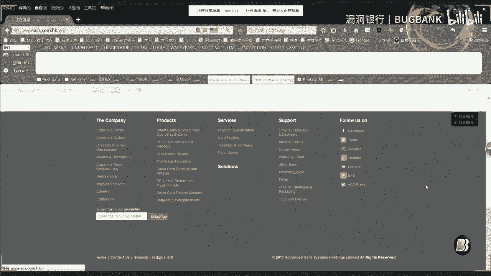
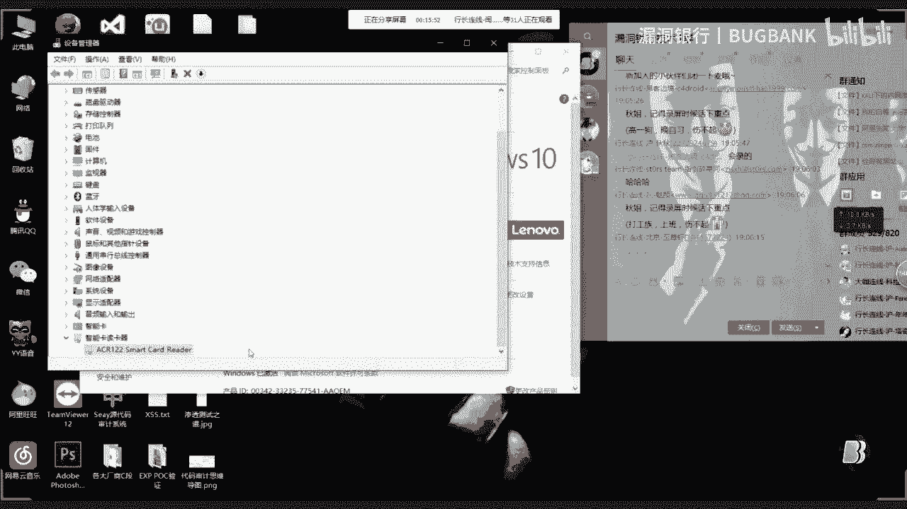
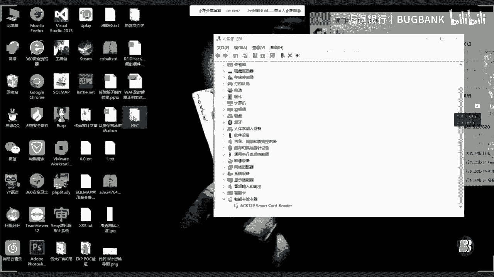
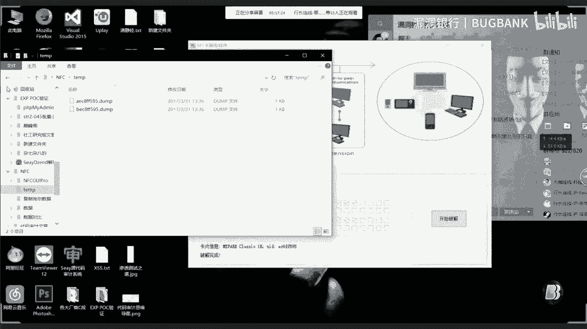
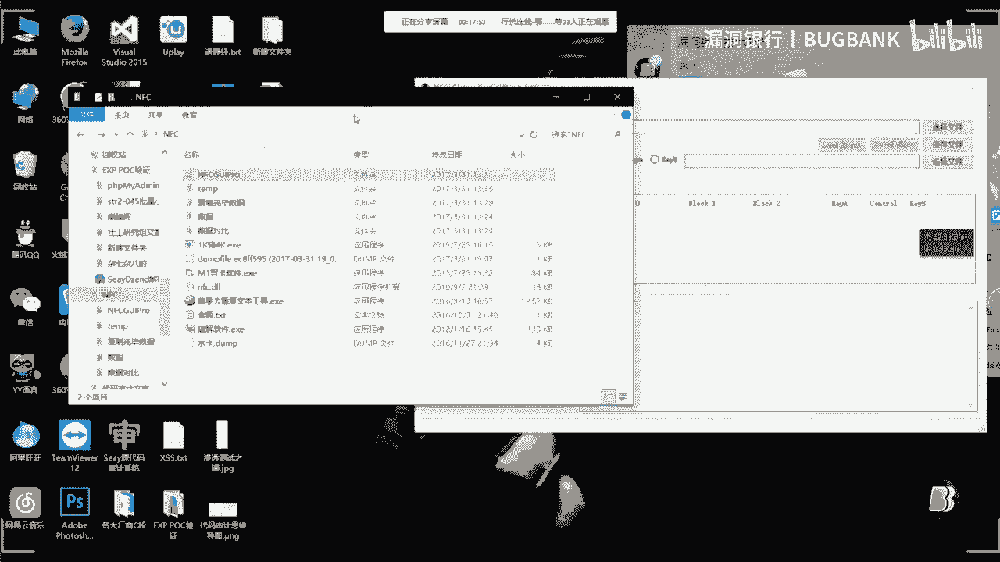
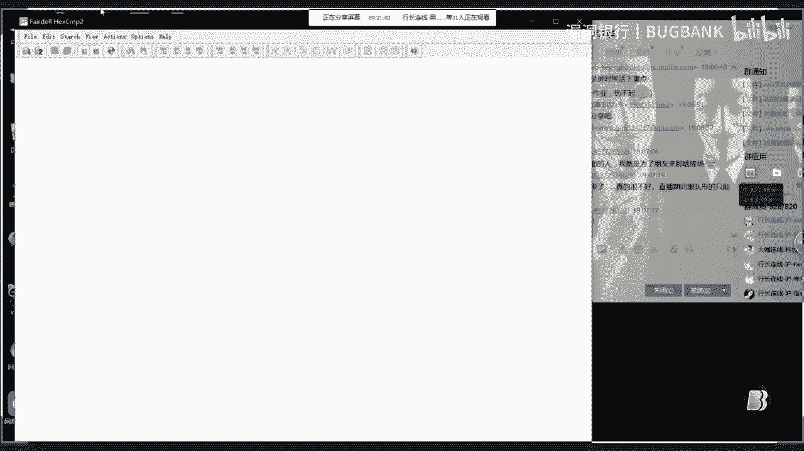
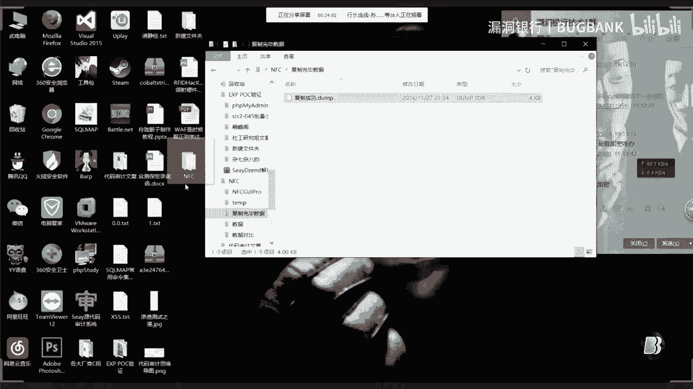
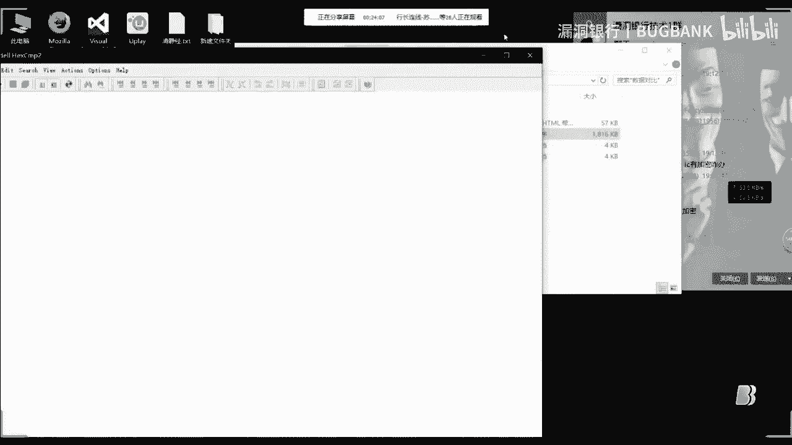
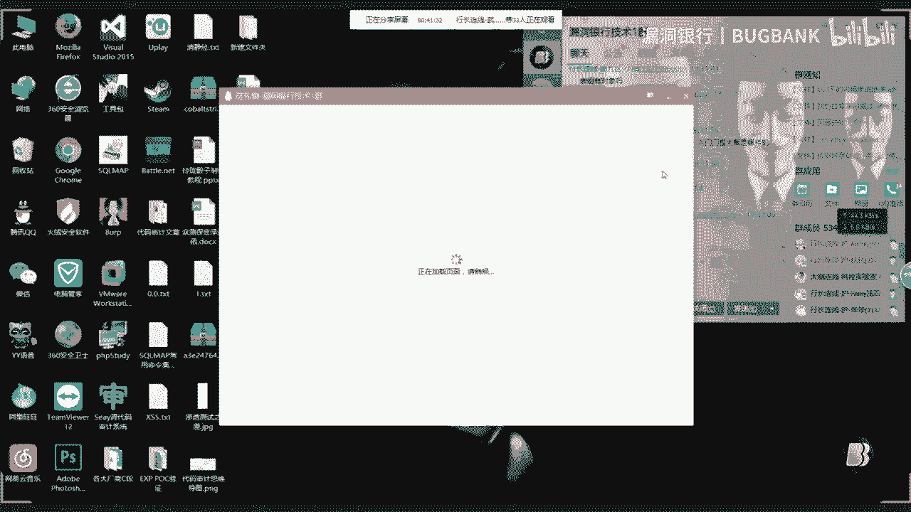

# P1：【录屏】RFIDHacKing硬件入门——大咖MAX分享 - 漏洞银行BUGBANK - BV1Gv411h7u9

今天我給大家帶來是那個智能硬件的一個小入門吧，我個人就是比較喜歡一些就是智能硬件，人家也是因為我個人就比較喜歡一些，類似於common go一些的遊戲吧，所以說對這方面就是比較著迷。

然後我就入了一個最流行的一款智能硬件，就是讀取卡片的一個acr122這個硬件，然後呢如果有資金資助的就是資金比較多的呢，還是建議大家買這個puremark3這個，這款就是讀寫器是，哇。

這這個沒有你想像的那麼貴，acr122差不多就是100到200之間，不會超過200的，然後這款呢是是我在淘寶上見了，是沒有超過1000的，最多是不沒有超過上千是最多就是500多吧，不會超過700。

沖死700啊，這款這款硬件，然後沖死700，然後如果想深入了解的話，還是買這個買這個比較玩的是比較開一點，然後今天呢我帶來是這款，然後個人沒有資金沒法買這款工具，所以說今天給大家帶這款是我自己買的一個。

那個這個，買了這個來給他做講解吧，主要今天，我看一下，主要就是安裝這個環境，環境呢，他有那個他官方有個安裝環境，等一下讓我找啊，這個是官方，如果你把那個硬件買來了，以後需要先安裝他的一個官方驅動，哦。

大家等一下打開這個網頁就有點慢，需要，需要他安裝一個官方驅動，哎哎哎哎，這網絡速度不得了，什麼，哇，現在唱歌，然後官方驅動，不過我看他那個還是給大家講一下，不過我最近就是看他這個官網又出了一個新的一個。

就是讀取硬件，不知道。

出了一個新款的一個讀取軟件，不知道好不好用，估計功能是比比這個ACR12這個功能是更好點的吧。

有可能，這個然後新出了一個這個這款讀取軟件讀取讀取硬件，嗯，然後我們看一下就是驅動吧，哇，這個網站就卡呀，算了先先給大家講下面大家就有哎，哇，這裡是那個安裝的一些驅動之類的，然後下來下來。

我們安裝好了以後，比如說安裝好了，我們安裝好了驅動以後，我們插上，我們插上這款，我們插上這個讀取軟件，他這裡會有顯示。

可以是，然後我，哦，在這，他插上會有下面就會自動會彈出來，他的那個，啊，彈出來這個這就表示那個驅動和那個讀卡器是可以就是可以使用的。

然後，我我經常用的工具都是，這裡有兩款軟件。

一款就是官方這款是官方的，官方的官方的一款軟件，還有這個是就是某位牛寫的一個就是民間的吧，屬於民間的一款，先給大家看看這兩款軟件，這個話這個是就是只能用於破解，然而這個呢。

就是既可以就是讀取他裡面的數據，又可以就是進行就是寫入一些就是把原來卡片就是寫入進去，不過我個人讀取的話是喜歡用這款的官方的，因為他那個他的官方的是比比這款就是讀取的要快。

我們就是我把我我這邊我學校的水卡放上去吧，水卡放上去我們來進行破解，然後，大家看第一次，如果你剛買來的話，剛買來這款軟件，剛買來這款硬件，你如果你拿一張就是新卡就放上去讀取的話，他有可能是。

破解過程是非常緩慢的，因為就是時間關係，我事先就是已經破解過了。

然而這個就是他那個破解過的一些緩存，所以說這次是非常快的，然後，破解出來有良工，破解出來他是這種1KB的文件，我們1KB打開是無法進行一些數據對比，然後我們可以用這款可以用這個民間的。

可以把它轉為4K4KB的可讀文件。

也可以這樣，這款軟件可以轉寫，然後我們就是再破解一下，再複製一份吧，這是另一份1KB的文件，我們也可以用這款這款軟件，他也是可以轉為那個4KB的，就是按照大家的喜歡，喜歡的話，喜歡用哪一款就用哪一款吧。

我個人還是比較喜歡用這款，比較方便吧，然後這是一個就是，這個是個滿金額的，滿金額的一些，這是一個滿金額的水卡，然後這個是我已經用過的，用過的金額的水卡，如果我們就是，讓我看一下，環境這個卡片講完了。

然後我們講一下就是卡片的結構吧，然後講完卡片結構，然後再給大家講一下，就是如何對比一些數據，他這個我們這個，我們這個讀取鍵盤，只能讀取一些就是M1卡，然後像一些就是CPU卡。

還有那種ID卡也是可以讀取的，只不過ID卡就相當於是那種身份證，這樣的就是讀一讀啊，你沒法修改，只能進行複製，然後呢，他那個M1卡和IC卡，和那個ID卡裡面的那個內部結構也是不一樣的。

他那個，他那個芯片是，他芯片的那種纏繞方式是不一樣的，M1卡的芯片纏繞方式是那種正方形的，就是同時進行纏繞，然後進行他那個刺探印，而那個ID卡呢，他是那種圓形，就是你大家可以拿自己的一些卡片。

然後用手電筒，就是在邊緣部分，然後照一下，可以清楚看見有那種纏繞了方線，就是那種方線就是那種，就是可以了解一下，就可以區分出，就是那種卡片是什麼卡片，然後卡片區別好了，然後我們看一下，就是我剛才說的。

卡片的就是裡面數據對比，放小點。

我把我那個兩個。

這個是滿就是滿前數的卡片，然後這個是我使用過了，如果就是來進行對比，然後這裡我這款軟件，這款軟件就是對於就是對比，不我今天是M1卡，IC卡我那個不行的，IC卡我這款就是硬件是不可以的。

這裡就是相同地方的數據，就是可以就是清楚的表示出來，我這個是滿數據的，然後這個是用過的，然後他那個加密方式是那個，16進制進行加密，然後如果想修改裡面的金額，可以就是到版，就是到百度上找一些。

就是16進制轉16進制的一些，計算器吧，然後進行轉換過來，然後就修改裡面，然後進行進行那個數據的修改就可以了，主要修改的軟件是這個，個人喜歡用這款修改軟件，嗯，這款修改軟件，修改的軟件是直接就是。

選用就是你想就是，比如說我這個是滿稅卡的，我們可以就是添加進去，然後如果你不滿裡面的金額的話，你可以把你用的一些金額的錢數，給修改多一點，或者什麼可以修改，就是進行比較方便。

還有呢，就是修改成功了，然後我們也可以就是進行，如果就是看它裡面的，就是如何看它那個兩個是否就是寫進去了，金額寫進去，我們可以就是進行破解，破解完以後，然後我們可以把破解，破解好的。

就是根據我剛才的那種一系列的方案，然後把它轉為4KV，然後這裡呢，這裡我是，準備好了一份就是，就是複製裡面成功的，然後拿到桌面，然後進行數據對比。

這兩款。

全滿金額了，還有這款金額了，然後進行對比，看是否就會出現剛才就是，就不同數據會出現，這裡就是紅色的標示，一般是還有一些加密是CRR，CRR，CRR什麼來著，加密，我忘了，反正就是，比這更就是更難破解吧。

不要說，操作操作操作基本都弄完了，然後就比較像，你們就是一些問題，我解答一下，可以在公平上打回來問一下問題，像這，水卡是記名的，是記名是怎麼樣記名的，比如說就是有那種後台驗證的。

或者是只有你一張姓名的那種記名，就是如果我就是學習應該是你那個是飯卡吧，飯卡是個人是不建議的，如果你要是被抓到的話，你既要賠償學院的損失，你也可能是面臨開除的那種風險，建議有這種是不建議搞的。

就我這個是一卡通，一卡通是更不可能的，一卡通他那個比如說一卡通，你刷了一些金額，就是他會有那個後台進行驗證，如果你那個信息不符合的話，學校是肯定會查出來什麼的，然後找到你，然後你就完了，主要金。

你撿別人飯卡，別人飯卡，萬一萬一就是那種掛失掛失以後，他那裡面的一些，就是就是你原卡裡面的一些，就是怎麼說呢，就原卡裡有一些就ID數，他是會變動的，然後你原卡那個那個數據，他是直接消除，你用都用不了的。

還有什麼，主要，你是ID卡還是ME卡，ME卡我剛才就講了，就是你可以看裡面的就是線圈的不同，他那個ME卡裡面的線圈，他都是那種正方形的線圈，正方形的線圈，然後接了一個小型的芯片，而ID卡和。

ID卡是那種的，ID卡就是一個圓形的，他裡面是個橢圓形的那種同線圈，然後進行橢圓形的線圈，然後裡面跟著一個小型的芯片，而像CPU卡都是那種帶芯片式的，就是類似於銀行卡那種門卡，一般都是屬於ME卡。

就是完全就是，就是你刷一下，然後裡面就沒有任何信息，就是刷一下，就是只是管他那個，數據驗證，然後驗證你是否是屬於這個信息的，然後進行一些東西，方卡都是帶一些就是後台驗證的，你們就是別亂搞就行，沒有啊。

主要是現在就是我操作的問題，圓形的，對裡面是那個圓形的同型圈，IC卡，IC卡就像於，IC卡就是相當於那種公交卡那種，公交卡現在公交卡不是出現了一些，就是易卡通的那種嘛，易卡通那種是屬於別的。

別的一種卡片，IC卡是可以複製的，只不過，門禁，破解門禁的話是屬於那個，你必須要有一張原來就是他那個本來的門禁卡，你可以就直接複製上面的數據，然後替換到一個新的卡裡面，請期我那個操作完了，裡面的就是。

大概已經講完了，next你就在講完了是嗎，對裡面就是基本的這些很容易的，好的，那現在我們就開始行政問答環節，然後大家剛剛對剛剛的講課內容，什麼問題現在都可以提了，像剛剛那個黑客監禁的C4D。

那個你可以回答一下他的問題，怎麼複製門禁，門禁門禁就是需要那個門禁卡，一般都是一張，就是裡面就是只是一張就是出入門，那個刷一下感應，然後門開了那種，你就是有兩種辦法，一種就是你獲得一張。

就是獲得一張就是他那個那種開門卡，開開進門卡，然後你拿出來，然後就進行，我剛才就是講解了，就是把數據就是讀出來，讀出來以後，然後你再拿一張白就是空白卡，然後把裡面的數據進行寫入，一進去就好了。

還有一種呢，如果你拿不到的話，拿不到那種卡片的話，就是你需要就是另換硬件，就是非接觸式的，非接觸式就是讀取，讀取硬件，就是比如說你就是拿著類似於公文包，就是不小心就是不經意間，就蹭過別人卡，他那個裡面。

另換硬件就是可以把那張卡裡面數據給讀取出來，然後再進行白卡複製，好還有什麼嗎，還有什麼沒，好的還有什麼問題嗎，有問題的趕緊提問，好，(煉獄之聲)，(空洞之聲)，(空洞之聲)，噓！噓！(螢幕之聲)。

(空洞之聲)，公交卡是可以的，就是，公交卡現在不是，我上次就是遇到的，就是那種，公交卡是可以的，就是直接就是把裡面數據讀取出來，然後複製一張白卡，白卡就是可以用的，它那個是，數據，是抓不到你的。

這樣說吧，就是你讀取這個別人的公交卡是，就找的話只能是找到它，公交卡現在是一般，現在公交卡都是CPU卡，就是，我這款硬件是讀取不了那種CPU卡的，必須用我剛才說的這款這款軟件，就可以讀取那種CPU卡。

然後你這個，你還是一款，就是關鍵數據，關鍵數據在，主要是看你想改裡面什麼東西了，改了裡面東西它是，不導致，公交卡，哇！這公交卡這個是違法的，抓到你，要賠償加坐牢的，你決定你還要，改公交卡嗎。

還有什麼別的問題，還有什麼別的，別別的別的問題，那這樣還有什麼技術上的問題嗎，還有什麼別的，哇！你別搗亂好不好，步驟完畢之後，這邊會同意上傳取文件的，步驟文檔，步驟文檔在這，我已經寫過了。

已經寫過了步驟文檔，對，就是原理和逆向逆向的那個差不多，還有什麼問答，大家還有問題嗎，沒有的話我們問答環節就結束了，好的那我們今天的問答環節就先結束了。

然後今天非常感謝MaxDaka的分享，我們接下來進入我們的今天的互動環節，請MaxDaka在直播過程中，所有和你交流互動的小夥伴選擇其中一位，然後我們由我們漏洞銀行代表你為他送出一本書。

希望他能夠在技術的路上越走越遠，然後你先選一位吧，爸選誰啊， DAKA選你不就。選你不就。選你不就。選你不就感覺那個了嗎，咱倆那麼熟選你不就走後門了嗎，選個不認識的吧，看看誰問的比較好吧。

這個人吧感覺這個吧，吳峰是嗎，對，好的，看他寫的也比較好，好的好的那我們吳峰小夥伴帶嗎，冒泡冒泡，門禁卡是可以的，就是可以複製的，你可以把裡面的數據讀取出來，以防萬一你哪天把那個把卡給丟了。

然後重新寫一張新卡就可以了，不在我就選你了，吳峰小夥伴你帶嗎，帶嗎帶嗎，如果現在暫時走開了的話，那我們之後那個客家再跟大家聯繫，然後今天就由吳峰小夥伴抽我們今天的幸運兒啦，然後我們大家都恭喜他一下。

那麼之後我們會私下聯繫吳峰，然後會向他詢問今天所想要獲得的書，然後我們之後會代表NEXT和我們肉動銀行為他送出書，然後後續大家可以關注我們的微信公眾號，然後對今天的課程內容有什麼疑問的小夥伴。

可以之後聯繫NEXT或者在群裡，然後大家討論一下多多交流，今天的硬件課題很有意思，沒有選到小夥伴不用擔心，好那我們今天的課程就先到這裡結束了。

大家就直接文字在群裡討論交流吧，好嗎NEXT你這邊好可以嗎，好，結束了那大家就是退下群吧。