# 课程 P1：RFID硬件入门与M1卡基础操作 🛠️

在本课程中，我们将学习RFID硬件的基础知识，重点介绍如何使用ACR122U这类读卡器对M1卡进行读取、数据对比与修改。课程内容涵盖硬件选择、驱动安装、软件使用以及卡片数据结构分析，旨在为初学者提供一个清晰的操作指南。

## 硬件选择与驱动安装 💻

上一节我们概述了课程内容，本节中我们来看看所需的硬件工具及其准备工作。

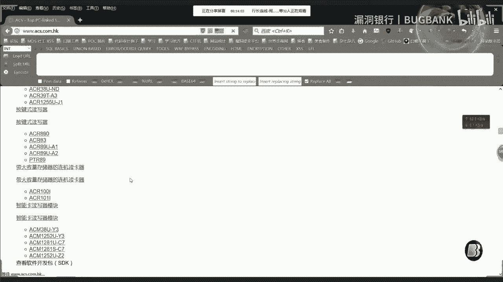

市面上常见的RFID读卡器有ACR122U和Proxmark3。ACR122U价格较为亲民，通常在100至200元人民币之间。Proxmark3功能更强大，但价格也更高，大约在500至700元人民币。

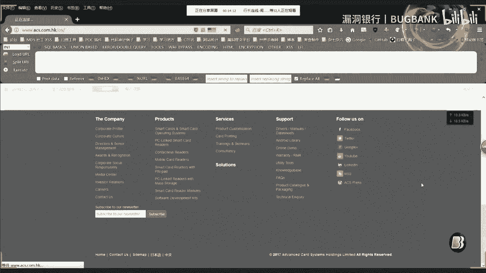

购买硬件后，首先需要安装官方驱动。

以下是安装驱动的步骤：
1.  访问读卡器制造商官网。
2.  找到与你的硬件型号对应的驱动程序下载页面。
3.  下载并安装驱动程序。

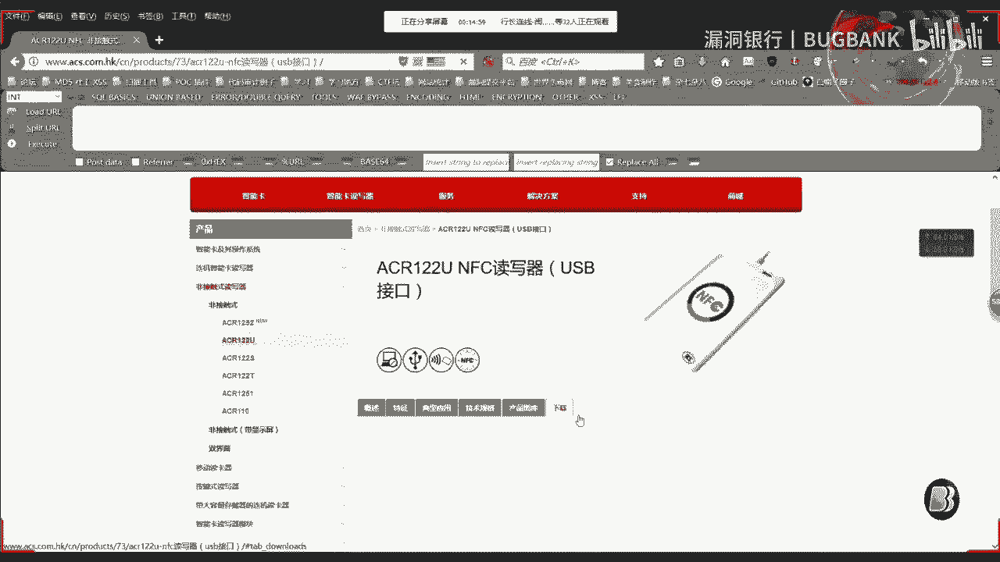

驱动安装成功后，将读卡器连接到电脑。系统通常会识别设备并提示安装完成，或在设备管理器中显示相应的端口。

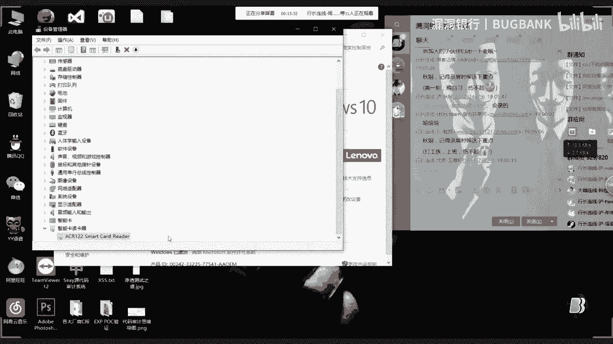

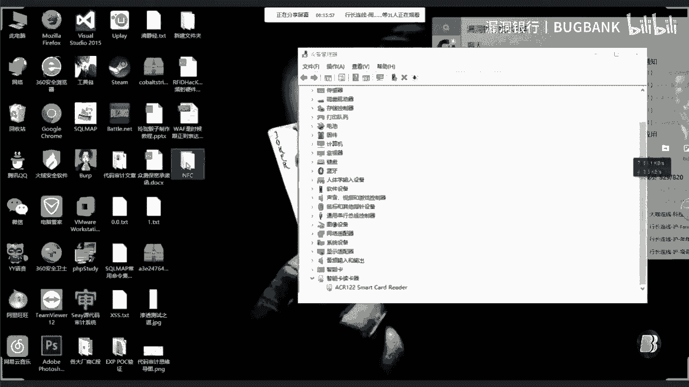

## 常用软件介绍 📱

驱动安装就绪后，我们需要借助软件来操作读卡器。常用的软件主要有两款。

一款是读卡器官方提供的配套软件。另一款是由社区开发者编写的第三方软件，例如MFCuk或MFC GUI工具。

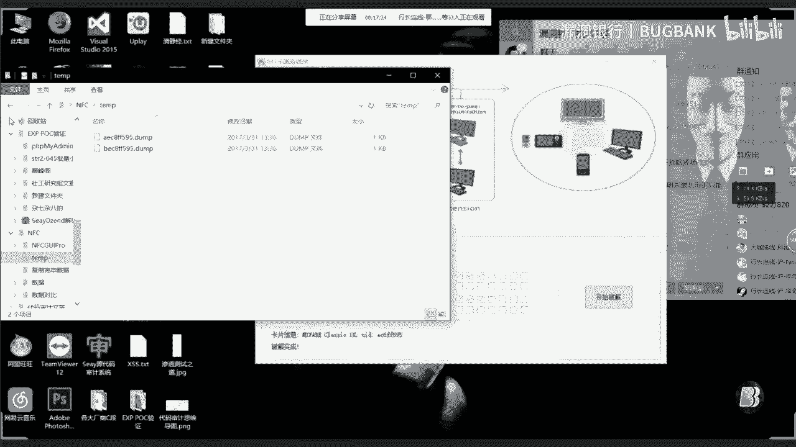

官方软件通常读写速度较快且稳定。第三方软件功能可能更全面，例如集成了数据转换、对比和高级破解功能。

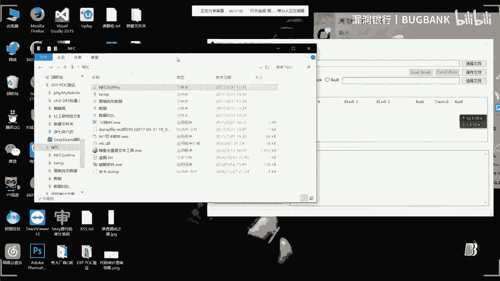

## M1卡数据读取与破解 🔓

有了硬件和软件，我们就可以开始操作卡片了。本节以常见的M1卡为例，演示数据读取过程。

将M1卡放置于读卡器感应区。在软件中选择“读取”或“破解”功能。对于未破解过的卡片，首次破解可能需要较长时间。破解成功后，软件会生成一个存储卡片数据的文件，通常是1KB大小的二进制文件。

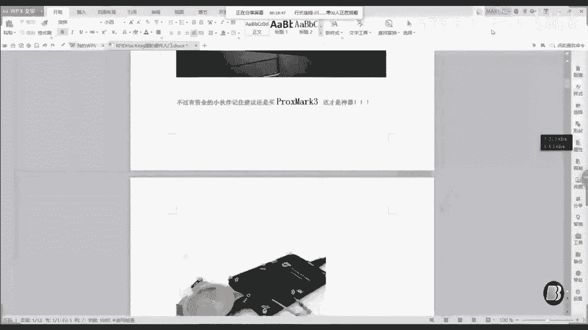

为了方便查看和编辑，我们需要将这个1KB的文件转换为可读性更强的格式。

以下是转换文件格式的两种方法：
1.  使用第三方软件内置的转换功能，将1KB文件转换为4KB的文本格式文件。
2.  使用专门的十六进制编辑工具打开1KB文件，并手动分析或转换。

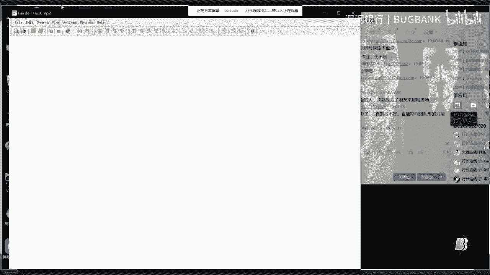

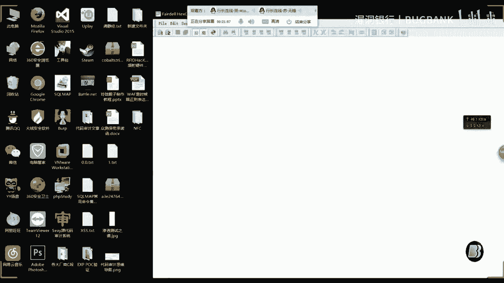

## 卡片数据结构与数据分析 🧩

成功读取数据后，我们需要理解数据的含义。不同类型的RFID卡其内部结构差异很大。

常见的卡片类型有：
*   **M1卡（Mifare Classic）**：芯片线圈呈方形。可用于门禁、水卡等，数据可读写。
*   **ID卡**：芯片线圈呈圆形。通常仅存储一个固定ID号，只能复制，无法修改数据。
*   **CPU卡**：内置微处理器，安全性高，如银行卡、新一代公交卡。普通读卡器难以破解。

对于M1卡，其数据通常以**十六进制（Hex）**格式存储。要修改金额等信息，需要找到对应的数据块。

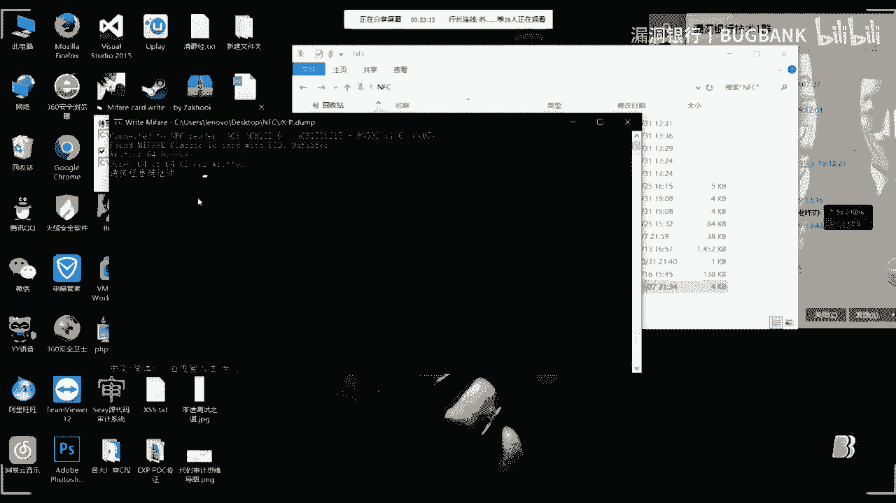

假设卡片金额存储在特定扇区，其数据可能表现为 `0x00001388`（十六进制），对应十进制5000分（即50.00元）。

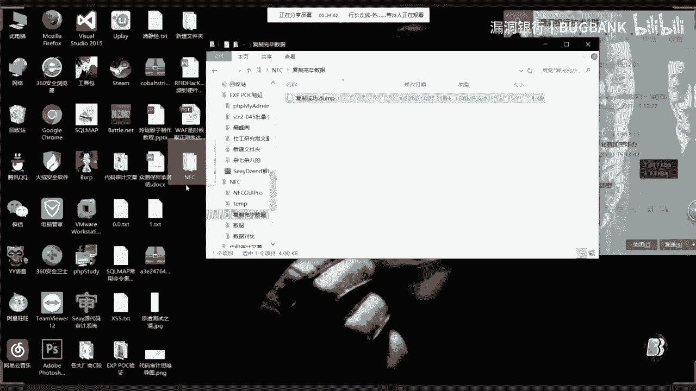

我们可以使用十六进制计算器进行转换和计算。

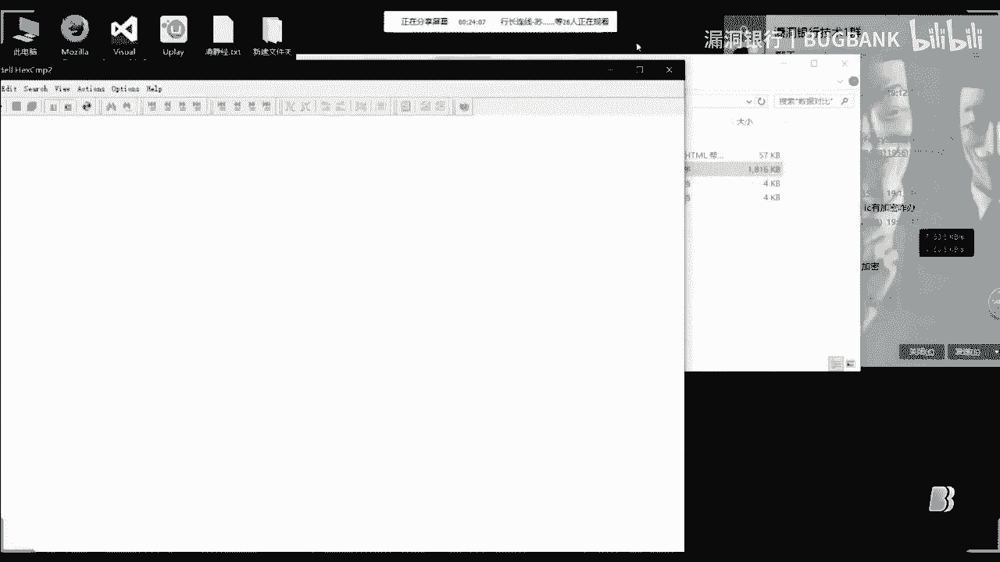

## 数据修改与写卡 ✏️

分析出金额对应的数据位置后，就可以进行修改了。

以下是修改卡片数据的基本步骤：
1.  使用十六进制编辑软件打开之前转换好的4KB数据文件。
2.  定位到存储金额的扇区和块。
3.  使用计算器将新的金额数值转换为十六进制格式。
4.  在编辑器中修改对应的十六进制值。
5.  保存修改后的数据文件。

修改完成后，需要将数据写回卡片。

在写卡软件中，选择“写入”功能，加载修改后的数据文件，并将空白卡或原卡放在读卡器上执行写入操作。

## 数据验证与对比 ✅

写入操作完成后，必须验证是否成功。

重新读取被修改的卡片数据，得到一个新的数据文件。使用数据对比工具（如WinMerge、Beyond Compare或软件自带的对比功能）对比修改前后的两个文件。

在对比结果中，被修改的数据会高亮显示（如标为红色）。确认只有目标金额部分发生了变化，其他系统数据保持不变，即表示修改成功。

## 安全与法律声明 ⚠️

本节我们探讨了技术操作，但必须强调其法律与道德边界。

本教程仅用于安全研究、学习及个人合法用途，例如复制自己遗失的门禁卡。**严禁**用于以下非法活动：
*   修改他人的饭卡、公交卡等涉及资金的卡片。
*   破解并入侵受控的門禁或支付系统。
*   任何违反《中华人民共和国网络安全法》及相关法律法规的行为。

擅自修改他人卡片或系统数据，可能导致经济损失、法律诉讼（如盗窃罪、计算机信息系统犯罪）及严重后果（如被学校开除或承担刑事责任）。

## 问答环节精选 ❓

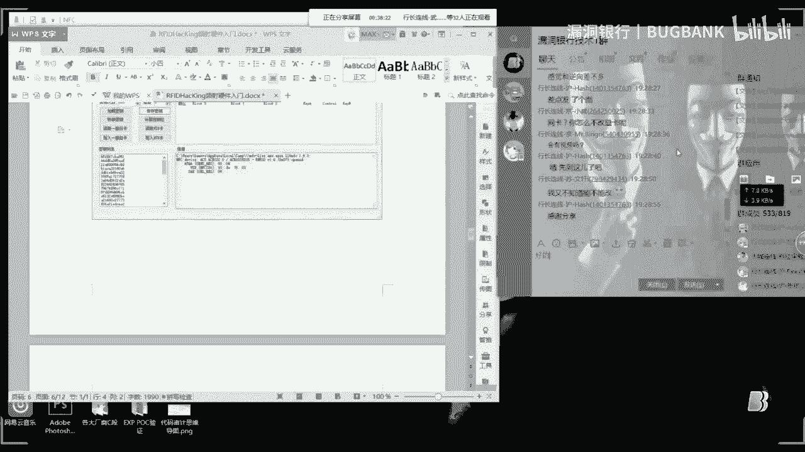

在课程的最后，我们整理了现场问答中的关键问题。

**问：如何复制门禁卡？**
答：需要原门禁卡。使用读卡器读出原卡数据，然后将数据写入一张空白M1卡即可。

**问：ID卡和M1卡如何区分？**
答：通过手电筒照射卡片边缘观察线圈。**方形线圈**对应M1卡，**圆形或椭圆形线圈**对应ID卡。

**问：CPU卡（如公交卡）能破解吗？**
答：ACR122U等普通读卡器无法破解安全性高的CPU卡。需要Proxmark3等更专业的设备，且破解难度极大，法律风险极高。

---

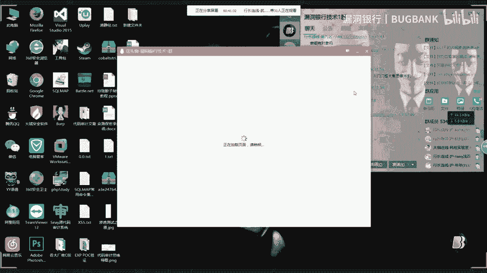

在本节课中，我们一起学习了RFID硬件ACR122U的基本使用方法，包括驱动安装、软件选择、M1卡的数据读取、结构分析、十六进制数据修改以及最终的数据验证流程。请务必牢记，技术应在法律与道德框架内使用，用于提升安全意识与个人学习，切勿用于非法用途。