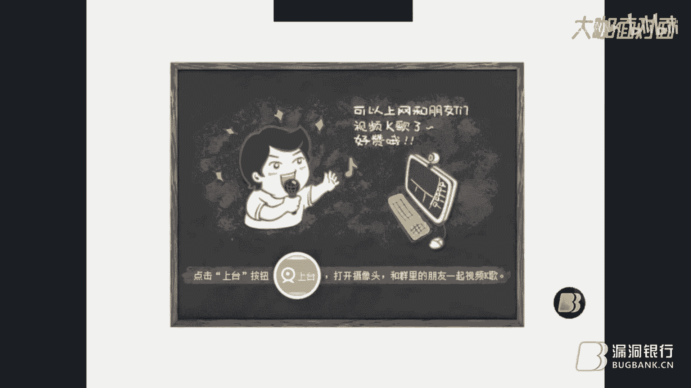

# 课程P1：Web安全基础入门 🛡️

在本节课中，我们将学习Web安全的基础知识。课程将从回顾2016年发生的重大安全事件开始，引出Web安全的重要性，接着介绍常见的Web安全问题及其原理，最后讲解渗透测试的基本概念和流程。内容力求简单直白，适合初学者理解。

## 一、 安全事件盘点 📅

上一节我们概述了课程内容，本节中我们来看看2016年发生的一些引人注目的安全事件，这些事件凸显了网络安全形势的严峻性。

以下是2016年部分重大安全事件列表：
*   **1月8日**：时代华纳数据泄露。
*   **1月18日**：凯悦连锁酒店超过50%的系统遭恶意软件入侵。
*   **2月**：敲诈勒索病毒爆发。
*   **3月**：OpenSSL曝出高危漏洞“DROWN”。此漏洞危害严重，利用了过时的SSLv2协议和脆弱的加密算法，攻击者可对服务器的TLS会话进行破解，发起中间人攻击，窃取HTTPS通信中的密码、信用卡号等敏感信息。该漏洞影响了包括阿里巴巴、雅虎等在内的众多知名网站。
*   **3月**：Struts2框架爆出多个远程代码执行漏洞。Struts2是Java Web开发中常用的框架，此类漏洞屡见不鲜。
*   **其他事件**：包括20万儿童信息泄露、土耳其5000万公民数据泄露、2.73亿邮箱信息被盗卖等。
*   **8月**：Zabbix（一款开源的企业级性能监控解决方案）报告存在SQL注入漏洞，攻击者无需授权即可通过此漏洞获取服务器操作系统权限。利用前提是Zabbix开启了访客权限且密码为空。
*   **8月**：美国国家安全局（NSA）的大量黑客工具被泄露到互联网上，这些属于国家级攻击工具，危害巨大。

## 二、 Web安全知识概述 🌐

在了解了严峻的安全形势后，本节我们将探讨为何要重视Web安全，以及当前Web攻击的主要特点。

随着Windows XP系统开始自带防火墙，传统的缓冲区溢出攻击威力大减，攻击重心转向了Web层面。进入Web 2.0时代后，攻击不仅发生在后端，也大量延伸至前端。

目前，75%的攻击发生在Web应用层。开发环节是应用安全中最薄弱的一环，程序员在编码或框架设计时若考虑不周，极易引入漏洞。同时，Web系统已成为企业安全边界的重要组成部分，而传统的网络层防护设备（如防火墙、IDS）难以有效阻止Web应用层的攻击，因此Web应用防火墙（WAF）等防护手段变得日益重要。

## 三、 Web攻击面与方法 ⚔️

上一节我们介绍了Web安全的重要性，本节中我们来看看黑客发起Web攻击的动机、方法和可利用的攻击面。

### 1. 攻击动机
以下是常见的Web攻击动机：
*   恶作剧，篡改网页。
*   损害企业名誉。
*   参与黑色产业链，入侵数据库窃取数据。
*   以用户身份进行非法操作获利。
*   以网站为跳板，攻击企业内网其他系统。
*   网页挂马。

**注意**：对未授权网站进行渗透测试属于非法行为，必须在获得授权或目标明确允许测试的情况下进行。

### 2. 常见攻击方法
以下是黑客常用的Web攻击方法：
*   **谷歌黑客（Google Hacking）**：利用搜索引擎语法查找网站敏感信息、后台地址等。
*   **网页爬行与暴力破解**：使用工具如Burp Suite对登录框等进行暴力破解。例如，PKAV出品的HTTP爆破工具可以识别验证码。
*   **Web漏洞扫描**：使用AWVS、AppScan等企业级扫描工具进行自动化扫描，但需手工验证结果以减少误报。
*   **错误信息利用**：利用网站返回的错误信息，获取服务器版本、内网地址等敏感数据。
*   **构造恶意输入**：包括SQL注入、命令注入、跨站脚本攻击（XSS）等。
*   **HTTP协议攻击**：如拒绝服务攻击（DoS）。
*   **业务逻辑测试**：寻找程序业务流程设计上的缺陷。

### 3. Web攻击面
Web攻击面远不止浏览器中可见的内容。使用抓包工具（如Burp Suite）可以捕获HTTP请求，其中包含多个可被利用的输入点：
*   **GET/POST参数**：直接在URL或表单中提交。
*   **HTTP请求头**：如 `Referer`、`User-Agent`、`Cookie`。
*   **其他输入点**：如XML（Web Service）、JSON等。

以CSRF漏洞为例，其成因往往是网站未对请求来源（`Referer`）或令牌（`Token`）进行验证。测试时，可在Burp Suite的Repeater模块中修改`Referer`值为其他域名并提交，若返回成功（如200状态码），则可能存在CSRF漏洞。

## 四、 常见Web漏洞详解 🔍

在明确了攻击方法后，本节我们将深入剖析几种最常见、最危险的Web漏洞的原理与防范。

### 1. SQL注入漏洞
**核心概念**：由于程序未对用户输入进行充分过滤，攻击者可将恶意SQL代码“注入”到后台数据库查询中，从而窃取、篡改或删除数据。
**漏洞成因**：输入验证不严格，用户提交的非法数据被直接拼接到SQL语句中执行。
**攻击示例（万能密码绕过）**：
假设正常登录查询语句为：
```sql
SELECT * FROM users WHERE username='admin' AND password='输入的密码'
```
如果用户在密码框输入 `admin' OR '1'='1`，查询语句则变为：
```sql
SELECT * FROM users WHERE username='admin' AND password='admin' OR '1'='1'
```
由于 `'1'='1'` 恒为真，导致整个查询条件成立，从而绕过登录验证。
**防范措施**：
*   **参数化查询（预编译）**：最有效的方法，能从根本上防止SQL注入。Java中采用此方法的注入漏洞远少于PHP。
*   **严格的输入验证**：明确参数类型和边界，在服务端对所有输入点（GET, POST, Cookie, HTTP头）进行验证。
*   **数据库端加固**：为Web应用创建仅具有必要权限的数据库账户，限制其访问敏感系统存储和数据库表。

### 2. XSS（跨站脚本）漏洞
**核心概念**：攻击者在网页中插入恶意脚本代码，当其他用户浏览该页面时，代码会被执行，从而盗取用户信息或进行其他恶意操作。
**类型**：
*   **存储型XSS**：恶意代码被保存到服务器数据库（如论坛发帖），用户每次访问相关页面都会触发。
*   **反射型XSS**：恶意代码通常存在于URL中，需要用户点击特定链接才能触发，是一次性的。
**攻击示例**：在论坛留言板输入 `<script>alert('hello')</script>`，其他用户查看该留言时浏览器会弹出提示框。
**防范措施**：
*   **输入过滤与输出编码**：对用户输入进行严格过滤，并在数据输出到页面时进行适当的HTML编码。
*   **内容安全策略（CSP）**：通过HTTP头定义允许加载资源的来源，可以有效缓解XSS攻击。
*   **用户端加固**：谨慎点击不明链接，为浏览器安装安全插件。

### 3. CSRF（跨站请求伪造）漏洞
**核心概念**：攻击者诱导已登录目标网站的用户，在不知情的情况下执行非本意的操作（如转账、改密）。
**与XSS的区别**：XSS是让恶意脚本在用户浏览器执行，以窃取信息或执行操作；CSRF则是利用用户的登录状态，伪造一个完整的请求来执行操作。XSS危害更广泛，可利用XSS发起CSRF攻击。
**攻击流程**：
1.  用户登录银行网站A，会话保持。
2.  用户在不登出A的情况下，访问恶意网站B。
3.  B的页面中隐藏了一个指向A网站转账操作的请求（如 ``）。
4.  用户的浏览器自动向A发送带有会话信息的转账请求，完成攻击。
**防范措施**：
*   **验证Token**：在关键操作的表单或请求中加入随机生成的Token，并在服务端验证。
*   **验证Referer**：检查HTTP请求头中的Referer字段，确保请求来源于本站。
*   **使用POST请求**：敏感操作尽量使用POST方法，避免参数暴露在URL中。

### 4. 文件上传漏洞
**核心概念**：网站对用户上传的文件检查不严，导致攻击者可以上传可执行的恶意文件（如Webshell），从而控制服务器。
**常见绕过方式**：
*   **前端JS验证绕过**：直接禁用浏览器JS或修改提交数据包。
*   **黑名单绕过**：上传特殊扩展名文件（如 `.php5`, `.phtml`）或利用解析漏洞（如Apache解析 `test.php.xxx` 为php文件）。
*   **%00截断**：在特定条件下利用空字符截断文件名。
**防范措施**：
*   **服务端验证**：文件类型检查必须在服务端进行，不能依赖前端。
*   **白名单策略**：只允许上传指定的、安全的文件类型（如图片）。
*   **重命名与隔离**：对上传的文件进行随机重命名，并存储在非Web目录或禁止脚本执行的目录。
*   **限制执行权限**：配置Web服务器，使上传目录不可执行脚本。

## 五、 渗透测试简介 🧪

在学习了各种漏洞之后，本节我们来看看如何以合法、规范的方式去发现这些漏洞，即渗透测试。

渗透测试是在获得明确授权的前提下，由安全专家模拟黑客的攻击手法，对目标系统进行非破坏性的入侵尝试。其目的是评估网络防御措施的有效性，发现逻辑性更强、更深层次的安全隐患。

一次完整的渗透测试流程通常包括：
*   **信息收集**：收集目标系统的域名、IP、员工信息等。
*   **漏洞扫描与分析**：使用工具结合手工方式探测系统脆弱点。
*   **漏洞利用**：尝试利用发现的漏洞获取权限或数据。
*   **权限维持与内网渗透**（在授权范围内）。
*   **报告编写**：详细记录测试过程、发现的问题及修复建议。

测试范围不仅包括Web应用和服务器操作系统，还可能涉及数据库、网络设备、安全防护体系，甚至物理安全（如机房访问控制）。

## 六、 总结与工具推荐 🧰

本节课我们一起学习了Web安全的基础知识。我们从2016年的安全事件认识到网络威胁的普遍性，理解了Web成为主战场的原因。我们详细剖析了SQL注入、XSS、CSRF和文件上传这四大核心漏洞的原理、危害及防范措施。最后，我们了解了以渗透测试为代表的、正规的安全评估方法。

**核心要点回顾**：
1.  **安全形势**：Web应用层是当前攻击的主要入口。
2.  **漏洞根源**：多数源于开发阶段对用户输入信任过度、验证不足。
3.  **防护核心**：贯彻“数据与代码分离”原则（如参数化查询），对所有输入进行严格验证和过滤，对所有输出进行编码。
4.  **合法测试**：渗透测试必须在授权下进行。

**工具与资源推荐**：
*   **学习环境**：DVWA（Damn Vulnerable Web Application），一个专为安全测试设计的脆弱Web应用。
*   **测试工具**：Burp Suite（抓包、重放、爆破）、PKAV HTTP爆破器（带验证码识别）。
*   **推荐阅读**：《Java安全编码》、《Web前端黑客技术揭秘》、《XSS跨站脚本攻击剖析与防御》。
*   **编程语言**：从事安全相关工作，建议学习Python 2.7，因为大量安全工具基于此版本开发。





希望本教程能帮助你建立起Web安全的基础认知。安全之路漫长，需要不断学习、实践和交流。