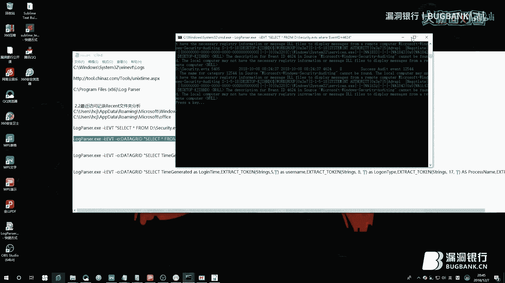

# P1：【录屏】Windows取证艺术赏析-大咖tdcoming-漏洞银行大咖面对面第85期 - 漏洞银行BUGBANK - BV1Et411Y7PY

为知识而存，引起神而生。小伙伴们晚上好，欢迎参加第85期漏洞银行安全技术直播，在咖咪的面，我是陈秋秋。

那今晚来直播演讲的是来自豌豆科技大咖TD康明，他也曾担任过CTF web安全的课程讲师。今晚呢，他将带我们了解windows取证之美，一起来关注取证的相关的技法操作和原理。那欢迎各位观众伙伴登陆直播间。

早前去讨论或自由提问，那TD康明讲结束之后还会有互动问答和福利环节，大家可以一起加入探讨。那结束后，TD康明还会选择明星观众，曾于书籍电子数据取证与拍摄方法。好。

那下面我们就先有请TD康明大概开机分享吧。Hello，小伙伴们，大家好，欢迎在周五的晚上跟大家一起分享windows取证这一堂课，我们今天就直接开始我们的一起学习吧。这是我们今天的一个分享内容。

首先就是带大家了解一下什么是我们的一个取证，然后我也分析总结出了在我们的实际的工作学习中，可能在取证的时候能够提取到我们的一些重要数据的一些地方。那么什么是我们的一个电子取证呢？

电子取证用官方的术语来说就是利用我们的一个计算机的软硬件技术，对我们的一个犯罪行为进行一个证据的获取保存分析跟处事的过程。作为一名安全人员，可能很多小伙伴们经常会遇到这样的一件事。

就是自己的电脑被入侵了，或者是接到客户的一些需求，说网站服务器被入侵了。那么我们遇到这种情况，我们怎样去进行一个取证？或者是以怎样的一个规范的手段去进行一个取证？希望今天的一个分享能够带给大家一点思路。

一些帮助。因为之前在一些取证鉴定实验室做过一些事，然后对于我们的一个取证的流程有一个标准，有一个基本的了解。如果说大家感兴趣，以后可能从事相关的取证行业，或者是你以后取出来的电子证据。

它需要作为一个具有法律效应的一个证据文件的话，那么这些步骤的话需要我们去严格的遵守。今天作为技术交流就不深入的去给大家探讨。大家在学习之后，如果说感兴趣的话，我可以发一些这方面的学习材料给大家。

然后这也是一些取证公司或者是鉴定实验室，它可能会用到的一些取证软件，还有一些取证设备。有些取证设备都是一辆车，这边是常见的一些取证设备，然后可能没有玩过取证的小伙伴，可能对这些软件不是很了解。

那么那个WinHex可能大家之前在打一些比赛，CTF比赛，或者是在做一些数据恢复的时候，可能会用到WinHex，它其实在取证方面也是一个比较不错的一个软件。那么我们这是使用我们的一个取证软件。

取到的一些详细的信息，可以看到这边的信息还是非常的详实的，它这边有系统的一些信息，以及我们的一些上网记录，还有你的一些电脑，如果说你使用的Windows电脑，它上面的一些浏览器。

还有一些邮件等等一些信息都可以取出来。那么我们的一个取证软件，它是从哪些方面去对我们的一个信息进行一个取证呢？我们今天就通过我们的一个手工取证的一个方法，带大家一起，我们一起来做一些实验。

对我们的Windows的一些信息进行一个取证。首先带给大家的是我们的一个痕迹的提取跟分析，说到痕迹，就是我们在破案的时候，就是在一些警察在破案的时候，经常会去发现一些犯罪的痕迹。

那么我们对于Windows的一个取证，其实也是同样的一个操作了。痕迹有很多方向，其中就包括我们的系统痕迹，还有一些用户的一些行为痕迹，他什么时候开关机啊等等，用电脑做了一些事，做了一些什么样的事。

或者是他的在电脑上运行过怎样的一些软件等等，这些我们都可以通过我们的一些文件啊，一些日志可以分析出来的。好，那么我们首先讲到的是我们的关于系统痕迹的一个提取，系统痕迹又分很多方面。

我这边就给大家就简单的啊，举了一些例子，比如说我们要提取一个系统的安装时间。说到这个的话，我们怎么去提取呢？为什么要去提取我们的一个系统的安装时间呢？可能一些高级的犯罪，就是他在用计算机进行犯罪之后呢。

他可能为了掩盖他的犯罪事实，将他的电脑啊，一些数据格式化，然后甚至是重装系统啊啊等等，做了一系列的行为，或者是修改他的一个系统的时间，所以说我们需要对我们的一个时间属性去进行一个深入的讨论。

深入的分析啊，说到啊，不知道大家就是对于我们的。不知道大家对于我们的一个系统时间的一个提取，不知道大家知道有什么方法吗？可能大家刚才看到我这个。

嗯。呃，这条命令的话，大家应该经常会用到在做一些啊，内网测试的时候啊，或者是。

因为这边的话，我们可以看到他的一些补丁啊等等，就是能够看到我们的计算机的一些详细的信息啊。

我们要找的就是我们的一个系统的一个啊，一个安装时间，就是他的一个初始系统的一个安装时间，我们可以看到是啊，2018年啊，9月12然后13分就进去到他的一个秒，那么这个时间是怎样来的呢？啊。

我们如果说想要修改他，想要修改他的一些时间属性，我们能不能做到的啊，答案肯定是可以的。啊，这个建制我们可以带大家一起看一下，就是打开我们的一个注册表。

来到我们的这个麦讯就是这个下面，然后software啊，然后就是我们的一个麦克思的。

然后。就是windows NT在这个下面。啊，大家可以看到在这边有一个一个他的一个安装时间。我这边给大家放大一下看一下。大家可以看到就是在这个建制下面，我们就是。提起了这个建制，我们把它转化为实境制。

就得到了这么一串数字，可能有经验的人来说，看到这一串数字就知道他可能是一个一个牛逼死的一个时间，说那么我们怎么去把这个时间进行一个转换呢？我们把它拷贝下来，有专门的这样的工具啊，或者你可以自己去算一下。

这边就啊，不跟大家一起算了，就是。我们可以直接来到这样一个解密的一个网站，我们可以就直接解密得到。可以看到在这边就是2018年9月12日，跟这边的一个时间就是非常的啊，吻合的。

那么我们如果说想要去修改这个属性的话，我们就可以进行一个相应的一个修改，或者是对他的痕迹进行一个相应的。这就是我们关于我们的一些属性的一些提取。好，我们继续。

我们除了可以提起到我们的系统的一些痕迹之外呢，我们还可以去提起我们的一些用户的痕迹。啊，我们经常使用我们的一些办公软件啊，就可以看到在我们的这边，比如说office或者是这是我打开了一些。

就是用这个软件打开文档的时候，我们在他的左下角就可以看到我最近打开了一些文档。啊，如果说我们在拿到一个计算机之后，我们想要对犯罪的一个行为进行分析的话，我们可以就可以从我们的一些软件。

他自带的一些功能可以就这样去分析我们的一些。啊，这里面的一些文档的话，可能就可以找到我们的一些比较重要的价值。当然，我们说到windows起传的话，我们还有没有其他方向啊，会隐藏我们用户的一些痕迹。

就是我们用户他在最近可能访问过哪些文档，打开过哪些文档啊，可以的，我们分别可以从这两个方向啊，还有更多的方向，我这边就是给大家啊，简单的就。给了这两个方向，一个是注册表分析，一个是我们的一个啊。

理赛的一个文件分析。好，我们可以一起去看一下。首先，我们来到我们的这个文件夹。

这个文件夹其实就在我们的c盘，然后用户就选择你的这个用户。然后在这边的话，我们打开。麦克思奥斯的。

在这边有个windows，我们可以看到，呃，这边的话，我们的windows为了我们的一个友好的界面，他其实这边就是一个文件，一个文件夹，但是他这样就为了我们很好的能够找到这个位置，然后展现给我们。

然后在这边我们有一个最近使用的一个项目，好，我们点进去的话。可以看到我最近就是在我这台电脑上打开过哪些文档，当然，我这边为了一些隐私保护，就是把原来的一些文件给删除了，你们可以在自己的电脑上去看一下。

就是能够发现啊，你最近原来使用过这样的一些软件，然后我们在内网测试啊，或者是一些啊，方便也可以去关注一些这样的一个文件夹，能够也能够提取到啊，你想要的一些信息。这是关于我们的一个用户痕迹的啊。

一个简单的分析，当然，我们也可以从我们的注册表去提醒，就是我这边的啊，这个注册表中也可以从他的建局中提取到我们最近使用的一些文档啊，或者一些啊，东西。谈到我们使用的文档，那么我们的用户运行的一个啊。

程序当然也是我们关注的地方。为什么要去对我们的一个啊，这个这台计算机运行的一个程序去进行一个分析呢？可能很多时候我们的电脑被恶意软件啊，就是运行了一些恶意软件，然后呢，呃，犯罪嫌疑人。

他可能就用了一些他自己他们自己的一些软件，我们拿到证据之后需要去对我们的一个应用的一些程序进行一个分析。我们就可以从以下几个方面啊，我这边也简单的给大家罗列出几个方面。

首先是我们的一个windows的一个预读文件，首先讲一下原理吧，就是为什么会有我们的这个一个预读文件，就是为了我们的windows系统为了提高它的一个性能。就是在啊，运行一些程序的时候。

就是把就是会生成这样的一个文件，就把它装入内存里面去，比如说我运行一个qq的时候，它可能就是会生成一个qq点pf的一个文件，然后啊，就会在这个文件夹下面就会生成生成一个pf文件。

我们就通过分析这样的一些文件啊，能够分析出我们的这台windows系统，它运行过哪些啊，软件。当然的话，我们啊，也可以从制作表中啊，去分析，好，我们一起去啊，分析一下吧。好，首先的话，来到我们的一个。

不理取这个文件。啊，首先是不理取这个文件，C盘。

我们直接啊，搜索到这个文件。可以看到。这边。可以看到在这个文件下面啊，我们有很多这样的一个preview就pf点pf啊，后缀的这样的一个文件，可以看到这边啊，我这台电脑上就曾经运行过的哪些软件。

当然我们直接这样去看。可能说还是看不出什么好东西来啊，我们就专门有这样的一些分析工具，我们就可以就现在就介绍给大家。

比如说这种工具。

这个工具如果说你运行的话，在这台机器上直接去运行的话，它就会直接去打开这个文件夹下的一个，呃，一些。这个pf文件，然后你也可以就是打开这个文件，把它把那些文件考到别的计算机上去，然后对它进行一个分析。

我们用这个软件去打开的话，我们直接看到的东西就很明显了，我们在这台电脑上曾经运行过的一些软件，这个在我电脑上带的安全软件，这是还有一些，就是我们刚才听歌用的那个网易音乐。好，我们可以直接双击双击。

我们先放大一下，给大家看一下，就是双击，我们可以就是打开这个篇幅文件，然后这边有它的一个创建的修改的一些时间，以及它的一个大小，它的一个这个程序的一个名字。还有就是，如果说你发现这个软件。

它可能是一个恶意软件，就是你不知道的一个软件，或者是你需要分析的一个软件，你可以在这个目录下去找到它，然后也有它的一个最最后的一次，就是最近的一次运行的一个时间。

然后这边也有在这段时间内它的一个运行的一个次数。好，你就可以通过这些细节去把这个情节给还原，就基本上知道我们的这个做了一些怎样的操作。好，当然我们除了就是我这边把这个。

我们除了从我们的这个文件夹下面去分析一些信息的话，我们还可以就是从我们的注册表中去分析，注册表的话，我们从哪些方向去分析呢？就是在这个优色下面。好，我们去分析我们的一个运行的一个痕迹，就在我们的优色。

然后在我们的software，然后是在麦克索的。在这下面，然后。windows。然后这边有个塞了这个外选，然后是一个不落。麦克索。嗯。然后在这个建议下面。啊，我找一下，应该是在一个不落。然后是。优色。

这个下面可以看到在这边的话有很多建议，我们打开这样在这下面打开这样一个下面，我放大给大家看一下，可能大家看不清，就是在这么长的一个路径下面，我们可以找到这个点RKR为后缀的一个软件。

可能熟悉我们的一个注册表的一个加密方式的小伙伴就基本上就知道它是一个点ES1的一个后缀的一个东西，那么我们的首先讲这个之前可能要了解一下，先了解一下，介绍一下我们的这个注册表。

它是它的一个直式采用的这个加密的这个加密，可能打CDF的人也解过这样的一个加密。如果说不知道的话，我们一起来看一下，就是这个加密就是这个。它其实就是一个古典类型的一个加密，比如说我ABCDFG就是这样。

如果说我A加密的话就是N，然后N解密也是A，所以说就是这样一种情况。好，那么我们就是来到这，我们可以看到。对这个进行一个解密的话。我们把这个放大一下。然后我们就大概的对它进行一个解密，比如说这边的话。

A的话，这样可能直接去，我们有这样的软件，我们直接去解密一下吧。

这样其实这个软件也很好写，就是一个一一对应的一个关系。然后这边。我们直接就使用这个加密进行一个解密，我们可以看到。

这个加密解密之后就是我们的这样一个软件。

然后的话，我们分析的时候，我们可以写一些分析的，把那个。

注册表的件子给提取出来，然后分析我们的一些这个windows上他曾经行过哪些软件。这就是对于我们的一个运行痕迹的一个分析。那么经常除了分析我们的一些文件夹日志啊。分析也是我们的一个比较关注的地方。

我们知道在我们的透过时的漏洞里面有一个这样的一个漏洞，就是。不足的日志访问记录也算是我们透过时的之一的一个比较重要的一个漏洞，那么我们的windows系统就是这么多年已经可以来说是比较完善了。

然后我们也很多人使用我们的一个windows系统，那么我们的windows系统他自己自带的一个事件日志，他是不是。够不够我们足够去分析，如果说发生了一些事故，我们应该怎样去分析啊？

当然我们的windows事件它是比较充裕的。我们可以分析一下，就是通过分析我们的这个windows事件日志，我们可以干嘛。我们可以就是了解到我们的这台计算机，如果说我拿到我这台计算机的一个事件日志的话。

我就可以去分析我这台电脑，他今天是什么时候开关机的，或者是用户是谁？然后是是不是他曾经就是在这台电脑上插过什么设备是什么时间插的，然后我的电脑就是连过哪些网络。

然后一些网络接口等等一些细节的问题都可以提取出来，那么这么神奇的话，我们这个事件日志，呃，它是保存在哪个位置呢？就是在这个文件夹下。我们可以就是用这条命令去直接启动我们的一个事件日志的一个分析器。好。

我们就是继续一起来分析一下吧，就是。首先我们就是来到我们的这个保存事件日志的一个文件夹里面。啊，这边我。给了一些tips。然后我们可以来到这个文件夹下，我们可以看到就是在我们这个文件夹下。

就是保存的大量的我们的这种点EVTS的这种后着名的一些日志可以看到就是在这边每天我们的windows记录的一些事件发生，它都是会把它的一些信息就是储存在这些文件夹下面，那么这么多的话。

我们不可能一一分析。然后我也就是挑起了一些比较重要的一些东西给大家一起分享。好。那么我们就是首先分析一下我们的。

首先分析一下我们的用户登录或者注销吧，为什么要去分析这个呢？分析这个的话就可以就是了解我们的一个windows，它大概是什么时候进行一个开关机的一个操作？

然后啊，这台电脑如果说拿到了之后，我们的方式协议呢？它在这段时间内使用了多久啊？是哪个用户登录的干了一些什么事啊？就可以通过这个去啊，对他进行一个深入的分析。首先，我们一起实验之前就是带大家啊。

了解一下这些一个完整的用户的登录或者注销的啊，这样的操作是怎样的？可能大家每天啊来，然后使用我们的一个计算机，然后在我们按一下我们电源键的那一刻，就是我们的电脑啊，它是啊，做了一些怎样的事？

在你输入账号密码登录的那一刻啊，你的信息被记录到日志里面去了啊，它是怎样去啊？用哪些的事件日志去记录你的啊？我们今天就可以通过今天的学习，然后能够有一定的了解。首先，我们基本上如果说是一个正常的一个啊。

用户的登录或者注销的话，它一般是遵从啊，这样一个步骤。首先就是事件一的发生，就是接到我们的用户在绘画仪上的一个登录，然后加载一些啊文件。然后事件二的话，就是一个登录，就是我已经登录成功了啊，然后就是三。

就是就是使用了一段时间之后，我要关机了啊，就收到了一个注销的一个通知。最后就是完成一个注销啊，那么储存这个事件的这个日志就是啊，我这边给出了这个，那么怎么去打开这个日志呢？我们有两种方式。

一种是一种是使用我们这个电脑，它自带的一个事件日志分析器，我们可以直接在这边输，搜索就可以打开啊，我这边的话就是啊，之前已经打开了，就打开之后是这样一种情况。好，我们直接就是来在这边的话。

有我们的一些啊，安全的事件日志啊，以及我们的这种事件型的日志，我们如果说要找到我们的那个登录或者注销的一个日志的话，就在我们的这个下面windows下面，然后有一个。

这个user profile service就在这个下面。好，我们一起来分析一下，是不是我刚才就是跟大家一起说的，我们的一个标准的一个。他是怎样的啊？就是有一个玩笑是这样说的。

就是在取证光公司上班的人就基本上不用每天打卡上班，就是每天给老板交一份这个日志就行了，就是能够分析出你是什么时候上班的啊，我这边就给大家看一下，就是。首先我们来看一下，就是事件一的话。

大家还记得是一个怎样的吗？就是告诉我们的计算机，我准备在这个时候就登录了，也就是我们的。可以看到我这台计算机在12月5号的时候，也就是上班时间啊，就大概这个点啊，可以看到他就是发生了事件日志一。

然后加载了一些注册表567啊等等啊的话，就是。在这个8点30分51的时候，就在这个的同时，就基本上输入账号密码，就就基本上登录成功了，然后4的话就是我们最后啊，结束了一个注销。

所以说你们也可以就感兴趣的，可以你们在结束之后，你们可以去分析一下，但是你们不知道这个事件日志啊，是什么意思？没关系，就是。在这边的话。在这边就基本上给出了他的一个解释，当然有很多不知道的事件日志。

你们可以去百度一下，就是了解一下，他是发生了一些什么样的事，这是我关于我们的一个登录或者注销的一个介绍。当然，我们之前说过，对于一些网络取证来说。无线网络的一个揭露啊。

或者是你的电脑揭露了一些怎样的有线网，这些信息在网络犯罪的时候，或者在一些网络取证的时候是一些细节是非常重要的，我们就可以通过分析这样两个事件日志。这样一些事件日志就可以可以发现啊，有很神奇的地方。

如果说你去分析你的笔记本，你就可以你就可以提取到我们的一个。这个WiFi他的一个名字，或者是一个网络他的一些接口。如果说在细的话，你可以去提取他的一个网络的一个密码等等啊。

这些东西都是可以从我们的一个无线的也是事件日志分析出来的啊，这边就差不多一种类型，我就不跟大家一起去啊，做这个实验。然后有一种一种设备，我刚才就是跟大家说过，呃，就是在我们的一些公安的内部里面。

他的一些内网他是不允许外接设备的。如果说有人外接设备了，然后需要做一些取证，或者说在我们的一些啊，重要一些公司，他的一些啊，重要的文件啊，或者是一些服务服务器，他是不允许你外接一些设备的。

除非是他公司内部的一些设备。如果说你公司里面这些计算机啊，或者服务器啊，或者是你一些重要的机密泄露了，需要去进行一个调查取证的话，你就需要对这个移动设备去进行一个深入的调查取证。好。

那么其实从很多方向可以去调查，所以说你在使用电脑去窃取别人的一些消息啊，一些信息的时候，其实如果说是windows系统的话，会留下很多的一个很重要的信息。比如说，我这边先说一下这个文件的一个记录。

就是在我们的这个文件夹下面，是在这个文件夹下面，如果说windows的话是在这个文件夹下面，会生成这样的一个日制的一个文本文件。如果说你插了一个U盘的话，或者是某个移动设备相应的会在这边会记一些记录。

你可以在这个文件夹下去找一下，可能如果说你没有去进行一些垃圾的清理的话，这些东西就基本上能够找到，它能够分析出你是在什么时间点插入了就设备的名字，然后什么时候拔出了。就根据这些的话。

就大概能够分析出你使用的一些行为，然后我们现在讲到我们的一个事件日志分析的话，当然我们肯定要就当从这一方面我们去讲一下，事件日志的话有很多，比如说这个事件日志的它的EVID400，410，430。

它就记录了这么一些行为。然后这个事件日志的8001，8002，以及我们的一个系统事件日志的2001，2001，2003，这么多的一个事件编号，让我们一个一个去找的话，可能头都大了。

所以说我们要善于利用我们的一个windows，它这个事件日志它的一个过滤，这边有一个过滤筛选的功能。我们可以根据它的一个EVID号，我们如果说很熟悉的话，我们就可以去过滤，比如说我们就可以过滤我们的。

我们来一起看一下这个2001，这边的话我们如果说是多个的话，我们就可以用逗号，这边也有相关的使用说明。我们就通过过滤，我们把这个可以看到，我们可以在这边的话就有2001，2003。

我们可以看一下它是一个怎样的一个行为。可以看到这两个都是结束为设备安装驱动等等，我们经常会，然后这边也有一个它的一个时间，我们经常使用我们的电脑插移动设备的时候，大家会不会仔细的观察。

就是在我们的计算机上面，它会有这样的一个行为，就是如果说比较慢的话，它会显示你正在安装一个驱动。好，那么我们的这个事件，这两个事件的话，就是记录你这样一个它的一个驱动的一个安装。

或者是结束的一个驱动的一个安装的一个行为，我们就可以通过这样的一个事件日志去分析它的一个U盘的大概的插入跟拔出的一个时间。这个就简单的跟大家说一下，大家感兴趣，继续可以去把那些日志都分析一下。

说完了我们的一个移动设备的一个分析，现在来到我们的一个远程桌面，也是我们经常可能会关注的一个地方，就是我的这台电脑，如果说开启了一些远程连接的话，为了安全，就是可能会经常你的一个计算机或者服务器被黑了。

然后你需要去进行一个相关的取证。因为有很多一些路径行为，它都是通过远程或者是一些方式给登录进来的，我们除了可以去分析我们的一个登录或者注销的一些事件，分析出的登录的时间或者是登录的一共互明。

我们也当然可以分析出他登录的一个IP等等。我们怎样去进行一个相关的取证呢？在有很多方向可以去取证，如果说是通过事件日志的话，在这边的话，我这边给大家就是简单的提提讲介绍这两个事件日志吧。

然后就是先大概的也是跟大家了解一下我们的一个，就是你进行一个远程登录，它是一个怎样的一个过程？首先，我这边没有按顺序，应该是首先的话，就是接到需要的一个启动等等。

然后最后可能是我们一起去分析一下我们实际的它的一个远程登录是一个怎样的一个行为？好，我们来到我们的事件日志，远程登录的话是在Microsoft的，然后是在windows，然后这边的话。Windows。

然后。T一起来找一下，就是。啊，这个。我们就随便就先找一下，这个当然这个也是。这下面还有一个这个也是啊，我们先就是随便找一个这样的一个分析，我们可以来分析它的一个行为。我们可以看一下。

它其实也是一个循环。我们读日志的话，就是按照时间的顺序的话，就是从下往上，我们可以看到在这边的话，我们也是一个循环在。看到在这边注销，这是注销。24的话，就是断开一个远程。21的话，就是登录成功。

我们一起我放大给大家看一下。21的话，就是一个登录成功。就在这边，就是登录成功。这是本地的一个。我们可以就是去提取一下他的一些信息。在这边的话，如果说你要去分析一些啊，一些ip的话，就是在这边。

如果说你是远程连接过来的，我们看一下能不能找到一个远程的一个连接的。啊，可以看到这边啊，我这台计算机，它是一个。

呃，我们看一下它的ip。我这台计算机是24啊，我之前就是做事的时候，就是用我这台28的计算机去。

来连我这台24的这台计算机，可以看到就是我的一个ip的话，就是在这边就记录下来了。然后也可以通过分析啊，这些事件的日志。可以分析就是大概什么时候连过来的，然后什么时候进行一个注销啊，这样的话。

可以就基本上确定这样一个录信行为。啊，这是讲了我们关于一个远程桌面的一些啊。分享啊，当然我们就是刚才我们一起分析的是使用我们的一些windows系统自带的一些事件日志分析器。当然，你在取证的时候。

你不可能就是直接在我们的啊，取证有一个比较重要的原则，就是你要保证这个证据的完整性。我们在取证的时候，很多就是我们把c盘一下，呃，那个那个落个文件就考到别的计算机上，然后用那个啊。

事件日志分析去去打开它，然后进行一个相应的分析。啊，这样这样复制多份的话，就是啊，能够保证我们的一个证据的完整性，而我们直接去那样分析，直接使用那个事件日志分析器去分析。

我们大家可能还会感觉还是比较繁琐。当然，所以说我们今天就是。呃，介绍这样一个工具，就是也是我们的这个微软，他为了专门分析他的一个日志，就是做了一个软件，我这边也给出了这样一个下载地址。大家感兴趣的话。

可以去学一下这个软件，其实比较简单，它的功能也比较强大，这边也是它的。功能图可以看到，它可以去分析一个它的IS日志啊，以及它的注册表，我们的注册表，以及是文件系统啊，这事件日志啊等等。

就是能够分析比较多种的一些日志啊，今天我们的话主要是讲这个。啊，然后其他的，大家后续可以去学习一下怎样去分析IS等等一些啊，事件日志，然后你去分析的话，能够得出比较不错的痕迹。当然，我们分析之后。

跟很多软件之后，我们写代码也是这样，就是能够输出一些东西来，比如说它可以输出到我们的数据库，以及表格啊，系统日志啊，以及直接在我们的屏幕上打印出来，或者是一些文本的一些方式。然后使用方法的话。

其实非常的简单，只要稍微有一点那种secure的语句的这种方法，它都是你看它这边的使用的一个语句都是secure like，也就是类似于secure语句的这种方式。然后这边的话，我也挤了一些例子。

我们怎样去进行一个分析啊，我这边的话，就是带大家一起分析一下我们的这个啊，也是我们经常分析的，就是这个这个事件啊，这个事件的话，我们为了分析方便，我把它考到第一盘下。

然后分析我们的这个4624这个这个ID这个ID是怎样的啊，我们一步一步来跟大家讲。首先就是讲一下啊，我们实际的在取证过程中啊，会怎样去取证？首先我们会来到啊，把它的这台计算机的一个事件日志。

比如说在这边。

好，我们找到我们要分析的一些啊，试制，比如我就现在分析的是这个事件日志，我把它拷贝到别的计算机上，比如说拷贝到地方啊，我就把它放在这里，因为为了软件分析的时候，它的路径啊，比较好。

好，然后讲之前就是给大家科普一个4624的这些试制是一个怎样的一个事件日志啊，这是我总结的一些常见的事件日志啊，这个百度上也可以找到。

然后我们的一个4624，它是怎样的一个这样的一个事件ID呢？就是成功登录我们的一个系统啊，之前我们就是讲过那个登录注销，它是另外一种记录我们的一个用户行为的一个事件日志啊。

在我们的一个安全这个事件日志里面，就有这样的一个4624这样的一个事件日志，可以记录我们的一个所有用户一个登录事件。我们去分析这个事件啊，我们就可以知道我们这个计算机，如果说是我这台计算机的时候。

我就可以去分析我的这台计算机。有没有被别人登录过登录的话，它是以怎样的一个方式登录，它是在什么时间登录，它的登录，它的IP是多少啊，我都要记录记录下来，所以说我们就今天的话一起去分分析一下啊。

我把它考到这个下面啊，这个地板下面了。

好，我们就是这个软件。好，我们直接运行一下。啊，直接运行的。

直接运行一下，可以看到跟大多数软件一样，它也有它的一个使用说明啊，当然也是比较简单的，这是我之前说的干爱的话，就是指定我们输入的一个格式，然后以及干欧就是指定它的一个输出格式等等啊，这些的话。

大家继续想要深入了解，可以去学习一下，这边也给出了它的一个格式。

我这边今天的话就带大家一起了解一下啊，怎样去用，首先啊，我们就直接在这边讲吧，只能切来切去，当然可能有点视觉疲劳。首先，我们就是使用这个软件，我把它放大一下，不晓得因为屏幕分辨率有点高。

不晓得大家能不能看到，就是这个软件，然后干爱的话，就是指定我们的一个事件，它还有IS等等，我们今天分析的是这个之前说过，然后我们如果说要分析的一个软件，比如说我要分析。

分析这个事件日志，我就直接这样写，然后。而外我们经常会使用的就是外然后什么什么ID等于我们的一个事件ID，就是啊，就是登录我计算机的这个行为进行一个分析，登录成功，我们直接。

拷贝，然后去运行一下看看。而我们直接运行的话可以看到这么一大串这个东西，呃，这这样很乱，我们很难去进行一个分析，所以说我们要对它进行一个优化，而优化的话，我们就看到第二个。

因为我们第一行没有指定它的一个输出格式，所以说我们优化一下这个，呃，就优化一下，我们可以看一下它的优化之后它的一个效果。

呃。这边我们先停掉，这也是我经常如果说不输出一些报告的话，经常会使用的，就是它系统自带的，就是生成这样一个表格的一个东西，在这边的话可以，它是显示出只有这么几行。

你可以在右下角，然后啊，多显示几行，或者是所有的行，这太多了，所以说我就我就分析一下。然后在这边我们可以发现有很多东西，我们一一来了解我们这个使用这个软件能够提取到的一些东西，比如说在这边的话。

我们可以提取到我们一个它的一个创建时间，以及这是我们一个事件日志。然后我们的一个事件类型啊，事件类型的话，之后这个文档也会给大家，就是我们常见的一些事件类型，比如说我们的台版。

它不三就是一个网络的一个登录啊，比如说你有你有那个。计划任务的话，它就会以太不四去记录，就是我们这边看到的。我这边看到的一个这个太晚。好，我们依赖就是如果说你是锁屏，然后再回来，然后就解锁的话。

就是7啊，这样的话，大家可以就是就基本上了解我们是怎样的一种事件的一种类型，你登录进来是怎样的一种方式登录的。

好。我们就是，然后在这里面啊，我们说的ip或者什么东西从其实都在这个死去里面，但是这里面有很很大一创，所以说我们需要分析的话，我这边就是给大家。呃，把这个死去这个死去，我把它拷贝出来了。

然后我们可以发现，它是这个死去的话，呃，它是以这个。这个货的这个。这种符号分割的，然后分割之后啊，我们就有很多列，那么我们如果说要去提取的话。

我们要去提取的话，我们可以看到。

可以看到这么一个函数，就是我们使用这个函数。比如说就是这个函数，我们要提取我们的，我先把它弄过来一点。如果说我们要去提取的话，提取它的一个第5项就是用这个函数。呃，我们知道它的第5项其实就是它的一个。

呃，某个人登录的话，它的用户名就是记录在第5项，我们。

呃，就是这0，这是0，啊，真算的话是从0项开始，然后这是12345可以看到这个训我们拷贝下来就是系统一个系统用户登录的。

好，我们就是基于这种原理，当然也基于这种原理的话，我们可以去对我们的信息进行一个提取，比如说我们的第5项是我们的一个用户名。然后第8项就是我们的一个登录的，我们之前讲过的一个登录的事件，啊。

它的一个类型。以及我们的第18项，也就是我们的一个原IP，好，我们就是一步一步优化之后，我们最后把优化的这个答案，我们去运行一下，它会是一个怎样的结果。最后我们也是以这种方式输出的。我们多看几行。

我们来分析一下，就是在我们的一些，啊，就是。可以看到，就是正常的一个用户的话，是呃，就是我的一个用户，我经常使用，然后你会发现就是有很多系统用户啊，还有这种dwm1等等啊，你会看到这些账号的时候。

尤其是我第一次分析事件日志的时候。我在学习的时候看到有这样一个账号，就是。呃，大家知道这个英文的意思就是匿名者的一个意思，然后我看到这个账户的时候，如果说我没去看这些事件日行啊，啊，没去看这些原IP啊。

我会我会很慌，你知道吧，看到这样一个账号的话。所以说我们可以多方面去干，我们可以看到这些其中其实就是我们系统的一些服务啊，这个service等等。啊，这边有他的这个程序，他的一个路径啊。

其实这些用户都是正常的一个用户，然后这个这个匿名者的一个用户啊，我们通过IP可以看到，就是我局于我里面的一个。文件共享的一个方式，我们怎样还可以就是判断他怎样是一个文件共享了，我们可以看到他的一个。啊。

他的一个登录的一个类型是3，我们来回顾一下3的话。啊，可以看到。啊，可以看到就是网络共享文件，或者是打印机啊，或者是一些网络登录啊，所以说这个就基本上确定这个这个账号登录的这种东西是没有问题的。

这就是一步一步的，就是对我们进行一个事件日志的一个分析。

啊，当然，我这边的话就是取了一些啊，举了这样一个例子，这样一个事件去带大家一起去了解这个软件，当然啊，就拿我们之前的一个那那么多的一个事件日志，我们也可以去用这个工具去批量的去进他对他进行一个分析。啊。

能够输出我们想要的一个结果，这些语句可以自己去变通，自己去构造好。那么我们讲完了一个事件日志，继续讲我们最后一个就是我们的一个内存的一个取证，内存取证的话也称作是一个活取证，就是我们在取证的时候。

就是大家都知道我们的内存的数据，它是一时的，就是你在对计算机进行一个关机的时候，这些信息都会丢掉。啊，但是这里面又有很多我们需要的信息，比如说我们经常会使用麦拉斯波利达或者一些啊。

就是一些密码的一些工具，可以直接从我们内存里直接把这个windows的账户的哈希密码给提出来，或者是一个明文的一个密码，或者是在这里面有一些我们加密的密钥啊，聊天信息啊，网络的上网痕迹啊等等啊。

如果说直接关机的话，如果说有必要的话，我们还是。呃。在现场的话，需要进行一个对计算机的一个活取证。啊，对于内存的取证的软件有很多啊，这边就给大家简单的演示一下，如果说感兴趣，大家可以继续学。

我们就演示这样一个软件啊，这个软件，然后提取我们的一个内存。最后对我们一个分析。啊，这个我们就简单演示一下吧。嗯。啊，就使用这个软件，大家都知道就是我们在运行这个软件的时候。

按道理你这个软件是不能在这台机器上运行的，大家都知道，如果说如果说你运行的话，肯定会占一定的一个内存，所以说这个软件它要尽量的去很少的去占用我们的一个内存，我们去运行一下。

我们看一下它占的内存可以看到是6。6，可以说已经也不是很小，但是已经相对于来说，相当于已经非常的小了，你看我们一个浏览器是250多。所以这个要保证它是非常小，然后我们直接取证的话就是。

它就会把你你的电脑它的一个内存是4G的，你点击yes之后，它就会在这边生成一个你的一个内存的一个数据，我这边因为内存比较大，我就不给大家就是直接这样使用比较简单，就直接yes，然后它就会在这边生成。

一个这样的一个内存文件，然后我们就要使用这个经常会内存分析的一个软件，就是这个工具也是很多大牛经常会使用的一个内存取证的一个工具，那么这个工具的话。

我这边也有一些。一些。命令我们就简单取几个吧，让大家就是大概的了解一下，因为深入的话这个方面就是太多了。比如说我们可以取到我这台计算机上，如果说我当破了我的这个内存。

我就可以去发现我的这台计算机的一个进程数。我们可以去看一下。然后他这边就开始进行一个进程数的一个分析。我看一下有什么，大家就可能会经常使用的。经常使用的话就是。

我们的一个哈希密码的一个这个时候大家可以看到先看一下这个就是。可以看到这是我好早之前当破的一个内存文件，你可以看到在这边的话，就可以分析出我们的这台计算机的一些进程，我们还可以。就是弄一个这样的。

就是把我们的内存提起出来，是不是能够拿到我们的一个哈希密码。我们就等他大概的分析一下。这边的话还有很多也可以看到内存中阿姨的一些访问的一些痕迹，都知道就是在浏览器的一些痕迹都是在取证的时候比较关注的。

你可以去看一下你的浏览器里有没有泄露一些怎样的一些密码等等。因为我们经常在上网登录的时候都会输入一些账号密码，然后有些人经常会点保存，这边就是我们熟悉的一个哈希的一个账号密码的一个提取。

这个内存取证的话，就这样给大家就是大概的讲一下了。

好。那么我们今天就是基本上给大家就基本上分享到这里了，然后就就我这边基本上可以了。

嗯，好的，好，感谢提提抗命带开了分享，大家应该对以后是如何上班不用打卡，不如何认真的做取证研究有更深入的了解了吧？

那下面我们就在行走问答环节吧，那大家刚刚有什么问题呢？都可以现在啊，想再提问的可以再提问一下，刚进入的提问了，那大家可以挑选一些你觉得比较好的问题来解答。

嗯，这边有那个不会无罪小伙伴提出了，就是如果说入侵者把日志的一些信息给删除了，当然就是删除是以怎样的一种方式删除？当然有很对于取证来说，有很多东西是删不掉的，就是我们如果说你当然就是。这是一个方面吗？

就是首先这个东西是你是否你把它删掉了？你是以怎样的一种方式删掉了？我们取证这一方面有很多，就是有一个数据恢复这一说，就是你删掉的东西可以恢复回来。这是第一个，然后就是入侵的日志，你一件事的入侵。

它可能会产生很多的日志，大家可以看到就是一个登陆的事情日志，我们可以从很多方向去分析。就是你删除的人他要有，如果说他是高级犯罪的话，他需要对我们的一个事件日志非常了解，如果说他真的这么6的话是吧？

那这是。注册表的毁了。注册表我们把注册表取证只是这样一个方面，当然我们注册表毁了也可以非互码或者是做一些其他的。我们取证不一定说非得从注册表方向去进行一个取证。影子账户这样的重启之后，痕迹还会保存吗？

影子账户，我不知道他的一个原理，应该我之前也用过，但是没有对影子账户这样的系统去进行一个取证。这个后续我再研究一下。如何比较干净的清理计算机的使用记录啊？高格就是我们普通的格式化之后不是右键吗？

然后格式化，然后还有一种就是使用微信还是来获得一些软件直接写0就是全部写然后再覆盖，就是只能这样反复的，因为毕竟你做了一些事情还是有痕迹的。虚拟机文件其实他跟我们本地的文件，其实他也是一个NT。

如果说是我们的Windows系统的话，他其实也是虚拟出来的一个这样的一个分区啊等等，其实原理是差不多的。怎么在没有进行备份过如何不破坏原来的电脑痕迹下？这个的话就是我们取证的话就一个取证的完整性。

一般取证的时候就基本上不会拿我们的原来的计算机是去直接取证的，一般会有这样的一些设备，就是只读设备，比如说如果说你非要拿我们的一个计算机的硬盘去分析的话，那么你插入只读设备，也有一种设备叫只读所。

就是你插上之后，然后你再查到你的一个分析设备里面去。他那个里面的数据只是只读的，你读的时候也不会去损坏它。还有一种就是一般在取证之前会复制复制，如果说是硬盘的话，他会复制下来，就是有那种硬盘复制机等等。

他会复制下来，然后拿的一般是基本上都是拿了他的备份去进行一个分析的，所以说原数据一般不会去进行一个损坏。然后我们再来看一下，什么是活取证，活取证就是对内存的一方面的取证，就是活取证。

然后就像我们的内存取证，他也是活取证的一种，然后怎样去对一个浏览器的记录进行一个提取。我之前就是也说过，就是有很多分析软件，我这边应该有一个吧，我看一下。我这边有一个类似的这样的工具。

就是可以去提取我们的浏览器的一些信息。我这边因为涉及到一些隐私，我就你看这个软件我等下会分享给大家，就是使用这个软件的话，你可以分析IE或者是一些火狐等等一些软件。

可以看到它里面可能能够提取到Cookie，或者提取到你之前上网留下的一个账号密码，这些是可以提取到的。

这个PF文件是正在有很多不是中断，就是他为了就是比如说我们启动我们的一个软件，他需要发挥我们的系统很长时间的时候，我们的系统为了优化我们的这个性能，就一般会把它放到这下面，然后下次在运行的时候就比较快。

事先日志的时间能不能修改，可以的，所有的关于操作系统的一个时间都可以修改，然后但是修改的话会有一个比较明显的，就是你修改过的一个痕迹。机器重启之后是不是很多事件日志是查不到了，没有啊。

就是你机器重启之后，他的一些行为就是你我刚才说的那些行为都可以分析到，那些事件日志就放在那个C盘那个文件夹下，可以去重复的分析的。除非你就是沦为的把它删掉，或者是我们使用的一些安全软件，你去运行的话。

他就会那个。安卓手机的话，有的安卓手机有专门的取证工具，然后可以的，他可以就是你安卓手机也有取证软件，可以就提取出软件手机的一个使用者一些信息啊，或者是一些聊天软件的一些信息。

安卓手机的取证一般是去分析。我们的一个一些聊天记录，然后看他是怎样的一个犯罪的一个过程。如果目标有很强的几个人是相关文件删除的，可以的，我之前就说过，就是看你怎么样去删除。有专门的软件。

只有硬盘怎么算哈希，有这样的一个软件工具，有小工具可以直接把它丢进去，又把哈希算出来了，这个取证软件都可以做到了。火狐浏览器或者其他浏览器无痕浏览有没有日日记录，无痕浏览。

但是我们正常的使用浏览器就基本上有痕，如果说无痕的话，我没有深入的了解浏览器取证方面，无痕是怎样做到无痕的，当然我们可以去了解无痕它是一个怎样的原理，然后他肯定会留下一些痕迹的。

在新的环境下完美的运行起来，这样有一些软件，如果说你需要的话，我可以就是课程之后你可以联系我，我给他，你可以就是把它用VHAC或者用什么，就是生成一个镜像，然后用一些软件，就是把它重新虚拟化起来。

就是重新还原一个患者选用的一个电脑，这种技术是有的，只需要接触这样一个软件。好，这边的话，基本上回答了小伙伴的一些问题，如果说大家还有什么问题的话，可以我们私下交流吧。

大咖你这边你愿意把联系方式给大家分享吗？我的QQ经常使用啊，就可以加一下我的QQ，好的，那那个一会儿我往直播间里面发一下你的QQ，然后大家可以去添加一下大咖，然后之后再问题的话，可以再多多交流。好。

那下面我们来到下一个福利环节吧，就是我们要给大家送书了，今晚的送书是TD coming，大咖亲自挑选的电子数据取证与派生方法，这本书，那大咖你可以说一下为什么想送这本书吗？这本书因为派生嘛。

就是我之前读的时候也是在学派生的时候，读这本书的时候，虽然说这本书是派生2写的还是，但是里面你通过写一些代码去学习它的一个取证的思路还是很有必要的，如果说感兴趣，不仅可以去锻炼你的一个编程的能力。

还有更多就是一个取证的一个思维吧。嗯，好的，那正好也是今天的一题内容相关的，对大家应该感兴趣会很有帮助，那请提提抗命大咖来说一下想怎么送这本书吧，呃，我可以来选这个新的观众，嗯，呃，直接。从提问里选吧。

从提问里选吧好的，啊，这是。锁定中奖范围，大家可以选选选这个吧，这个小伙伴我知道我名字好长，好，我看那恭喜这位小伙伴，你获得这本大咖赠书，恭喜你成为今晚的幸运观众，你将获得这本大咖赠书。

那请你根据直播间的提示，留下你的联系方式，我们会留意联系你或者在直播后直接来找我对讲也可以。

那好，那今晚的直播内容就到这里就告一段落啦，让我们一起再在此感谢提提抗命大咖的用心准备和精彩的演讲，给大家解答了非常多的问题，那希望大家今天取道之后呢，把内容多多利用在好的方面啊，不要真的拿去啊。

做一些不可言喻的事情，如果想回顾本期直播呢，在下周五我们会放出今天的录屏，大家可以关注一下官网更新和视频通知，也欢迎大家今后多多关注提提抗命大咖和豌豆科技，期待再次看到今天。

提提抗命大咖的分享的声音，那如果你觉得他讲的非常棒，也想和他一样在台分享的话，我们也随时欢迎，那咖面对面是一个展示和分享的舞台，不具年龄不会资历，只要你有好的技术内容。

我们不限形式可以主动找我报名来做技术分享，那提提抗命大咖您这边还有什么想跟大家交流的事情吗？

没有，如果说大家有什么交流的话，我也很希望跟大家一起交流，可以加一下我，然后带我们后期的学习一起交流，然后也很感谢这个平台，嗯，好，我们也很感谢提提抗命大咖就慷慨的上来演讲，今天大家都非常踊跃。

给大家一个点赞，那今晚的直播内容就到此结束了，我们一起感谢一下提提抗命大咖。好，那那个今天的直播内容就到这边了，大家如果想要进行交流的话，可以点一下页面底部的加权链接或者直播间加sense表姐进行沟通。

那今天我也和大家报备一下，我们今年的大咖面对面技术直播，今天其实是最后一场了，然后我们下一场直播就是要约这个月的月底12月28日，我们漏洞银行的年度直播，然后后面两周我们会专心的准备这个直播。

这次直播的内容会非常的精彩，大家可以期待一下，嗯，也会有各位表姐的表演的节目啊，然后唱歌啊，讲段子呀，开开车呀，还有一些大咖的新年祝福，然后还有一些白帽子的才艺展示。

那都会在今年的年底就是12月28日远端放假前，大家可以来放松一起来玩一下，那下周我们会正式开始发预告，也希望大家可以奔走相告一下啊，我们漏洞银行年底的这个欢乐的直播，欢迎大家来一起来参加。

那今晚直播我们就到这边结束啦，感谢大家的支持活跃，然后也感感谢TDcomming大咖带来的精彩的分享，我们大咖面对面周五8点见，我们明年再约啦，好，大家拜拜。第一件事，我必须说出我的所有话。

我热烈的热爱这种生活，这种生活，第二件事，你告诉我，你觉得我能做什么，我就是这个销售，我是我的CEO的老板，我的老板，Midnight，I come out my mind。

I don't have to go out to draw the sky，I don't have to go out to see the sun。

I don't have to go out to make the dreams，I don't have to go out to walk the moon。

I don't even have to go down the line to wake up the sun to go to see your moon。You turn me up。

you turn me up，believer，believer，You turn me up，you turn me up，believer，believer，You turn me up。

you turn me up，believer，believer，You turn me up，you turn me up，believer，believer。

I was choking in the crowd，building my brain up in the cloud，falling like ashes to the ground。

hoping my feelings，they would drown，but they never did，ever lived，ebbin' and flowin' inhibited。

limited，till it broke open and rained down，it rained down like，You turn me up，you turn me up。

believer，believer，You turn me up，you turn me up，believer，believer，You turn me up，you turn me up。

believer，believer，You turn me up，you turn me up，believer，believer，未经许可，不得翻唱或使用。

