# 课程 P1：Windows取证艺术赏析 🕵️‍♂️


在本节课中，我们将跟随大咖TD康明，一起学习Windows取证的基础知识和实用技法。课程将涵盖从取证概念、系统痕迹提取到事件日志分析和内存取证等多个核心环节，旨在为初学者提供一个清晰、实用的Windows取证入门指南。

---

## 概述：什么是电子取证？🔍

电子取证，用官方术语来说，是利用计算机软硬件技术，对犯罪行为进行证据获取、保存、分析和出示的过程。


作为一名安全人员，你可能会遇到电脑被入侵或客户服务器被攻击的情况。这时，如何进行规范、有效的取证就变得至关重要。本节课将为你提供一些基本的思路和方法。


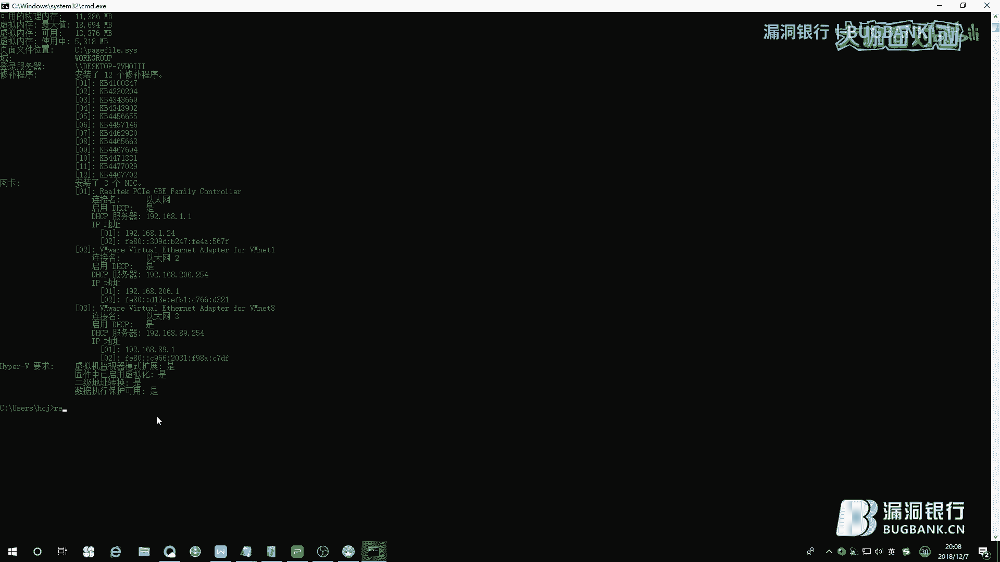

---


## 取证流程与工具简介 🛠️


在正式的取证鉴定实验室中，取证流程有严格的标准。如果取得的电子证据需要具备法律效应，这些步骤必须严格遵守。本节课作为技术交流，不深入探讨法律流程，但会介绍一些核心概念。


以下是取证公司或鉴定实验室常用的一些软件和设备：
*   **软件**：例如 WinHex，它在CTF比赛和数据恢复中常用，在取证方面也是一个优秀工具。
*   **设备**：有些专业取证设备甚至集成在一辆车内。

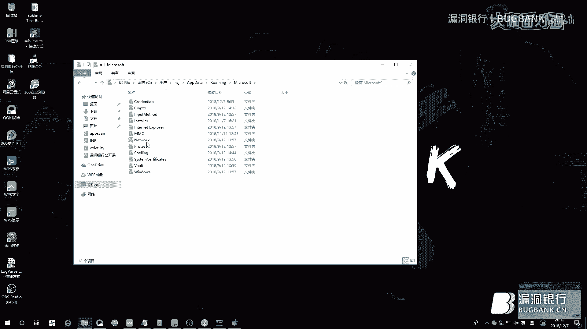

使用取证软件可以获取非常详实的信息，包括：
*   系统信息
*   上网记录
*   浏览器历史
*   邮件信息等

那么，取证软件是如何获取这些信息的呢？接下来，我们将通过手工实验，探索Windows系统中的信息取证方法。

---


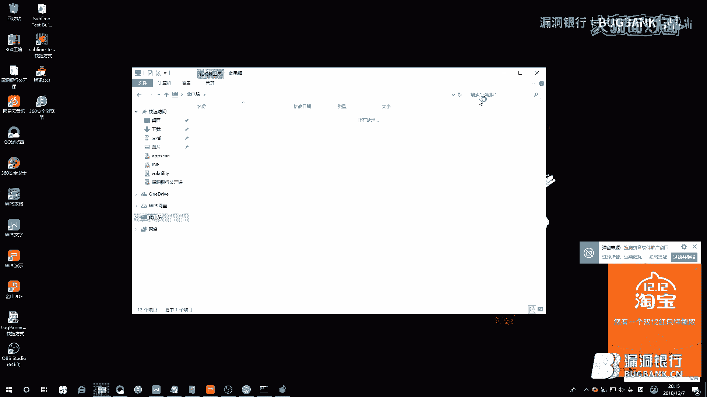


## 系统痕迹提取与分析 🧩

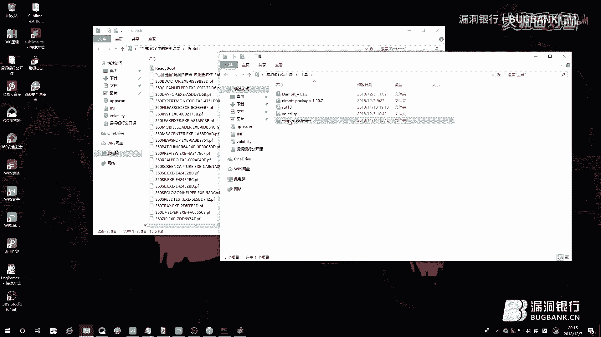

在刑侦中，警察会寻找犯罪痕迹。Windows取证也是同样的道理。痕迹包括系统痕迹和用户行为痕迹，例如开关机时间、运行过的软件等。这些信息可以通过分析系统文件和日志来获得。

### 系统安装时间提取

首先，我们来看如何提取系统的安装时间。提取这个信息有什么用呢？一些高级犯罪者为了掩盖事实，可能会格式化硬盘甚至重装系统。因此，分析系统时间属性非常重要。


提取系统安装时间的一个常用命令是：
```cmd
systeminfo
```
运行这条命令后，在输出信息中可以找到“初始安装日期”。这个时间通常记录在系统注册表中。

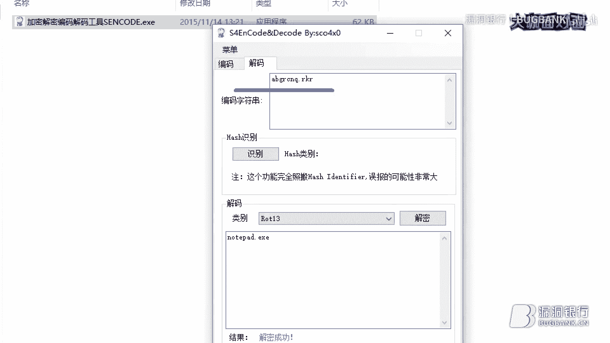


注册表中对应的路径是：
```
HKEY_LOCAL_MACHINE\SOFTWARE\Microsoft\Windows NT\CurrentVersion
```
在该路径下，找到名为 `InstallDate` 的键值。其值是一串数字，它通常是Unix时间戳（自1970年1月1日以来的秒数）。你可以使用在线的Unix时间戳转换工具，将这串数字转换为可读的日期时间，这与 `systeminfo` 命令显示的结果是吻合的。

如果需要，这个注册表键值是可以被修改的，但修改行为本身也可能留下痕迹。

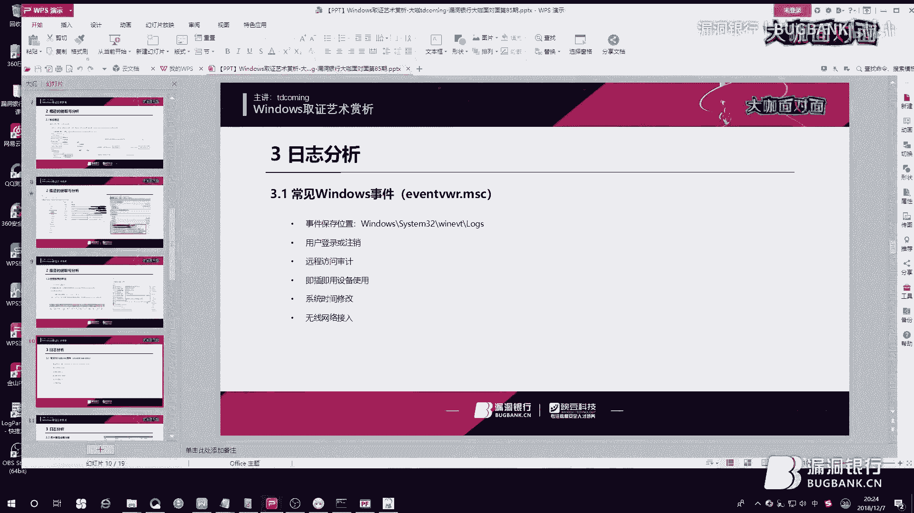

---


## 用户痕迹提取与分析 👤

除了系统痕迹，用户的操作痕迹也至关重要。例如，用户最近访问过哪些文档？

我们可以从两个主要方向进行分析：
1.  **注册表分析**
2.  **Recent Items 文件分析**

### 通过Recent Items文件夹分析

Recent Items（最近使用的项目）文件夹记录了用户近期访问的文件。其路径通常为：
```
C:\Users\[用户名]\AppData\Roaming\Microsoft\Windows\Recent
```
在这个文件夹中，你可以找到用户最近打开过的文档快捷方式。在内网测试或取证时，关注这个文件夹可能发现有价值的信息。

### 通过注册表分析

同样，在注册表中也能找到用户最近使用文档的记录。相关的注册表路径需要进一步分析，其原理与上述文件夹记录类似。

---

## 程序运行痕迹分析 ⚙️

分析计算机运行过的程序同样关键，这有助于发现恶意软件或犯罪者使用的特定工具。

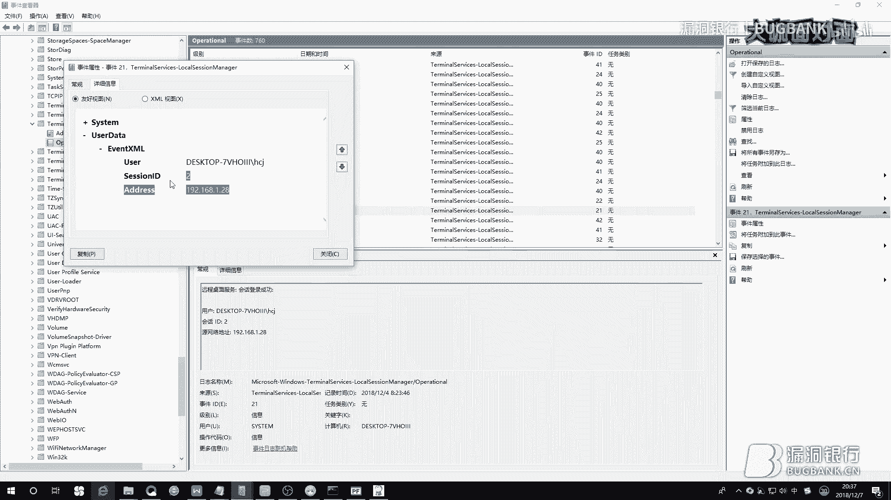

我们可以从以下几个方面入手：
*   Windows预读文件分析
*   注册表分析


### Windows预读文件分析

为了提高性能，Windows系统在运行程序时会生成预读文件（.pf文件），并将其加载到内存中。例如，运行QQ会生成 `QQ.pf`。

这些.pf文件存储在以下路径：
```
C:\Windows\Prefetch
```
直接查看这些文件可能不够直观。我们可以使用专门的预读文件分析工具（如WinPrefetchView）来打开它们。使用这类工具，可以清晰地看到电脑上曾经运行过的程序名称、运行时间、运行次数等详细信息，有助于还原操作情节。

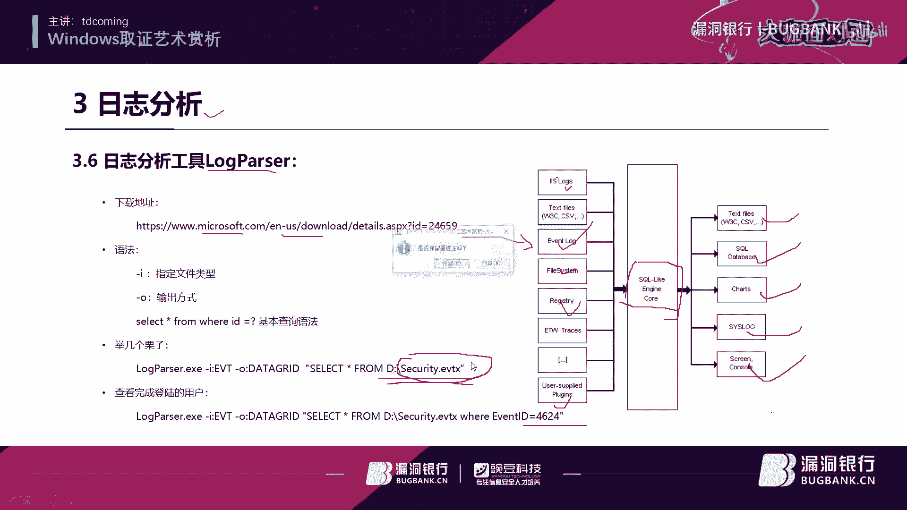


### 注册表运行痕迹分析

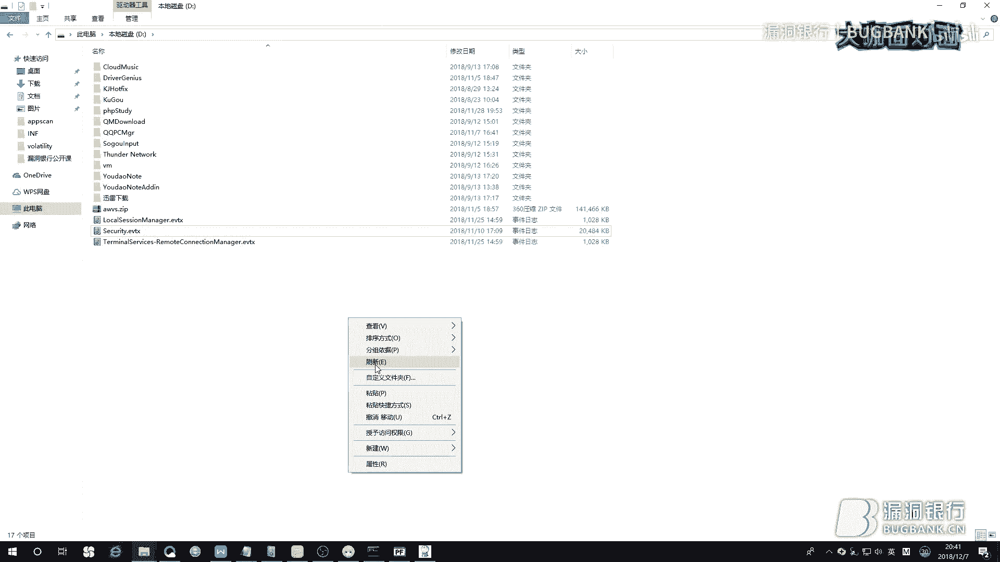


程序运行的痕迹也会记录在注册表中。路径通常位于用户配置下：
```
HKEY_CURRENT_USER\Software\Microsoft\Windows\CurrentVersion\Explorer\UserAssist
```
在该路径下，你会找到一些以 `{GUID}` 命名的子项，其中的键值可能使用了ROT13加密（一种简单的字母替换密码，A->N, B->O...）。解密这些键值后，就能看到运行过的程序名称。你可以编写脚本批量提取并分析这些注册表键值。

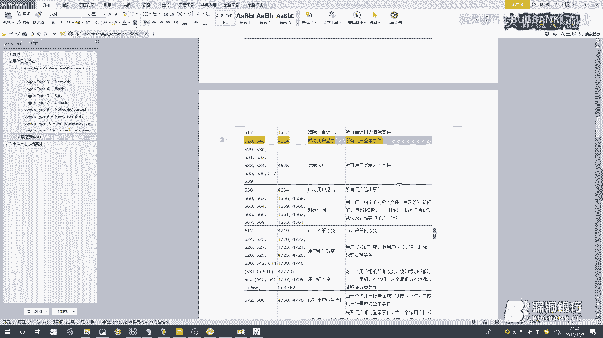


---

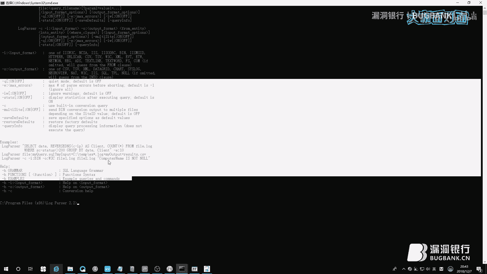

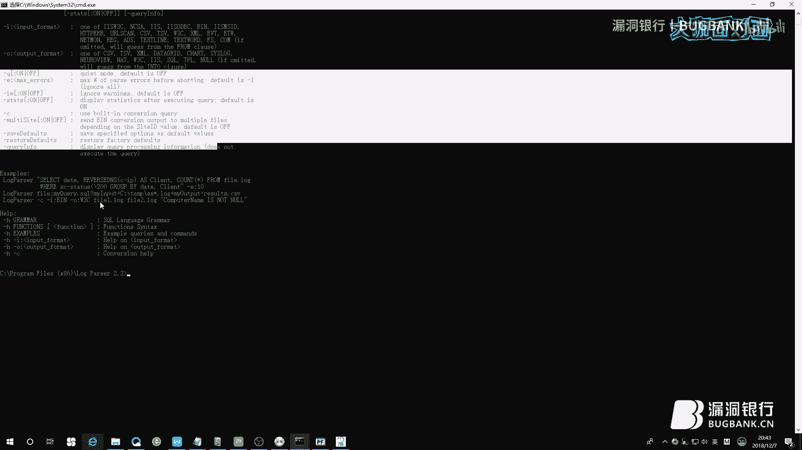

## Windows事件日志分析 📊

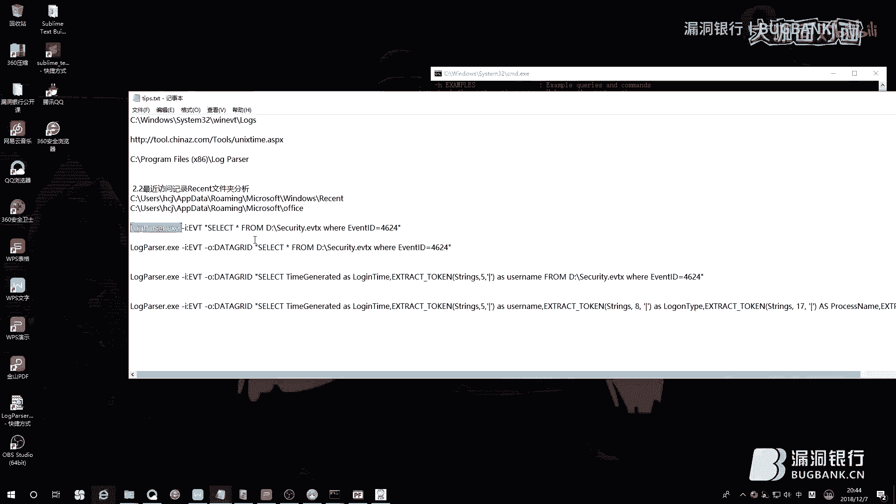

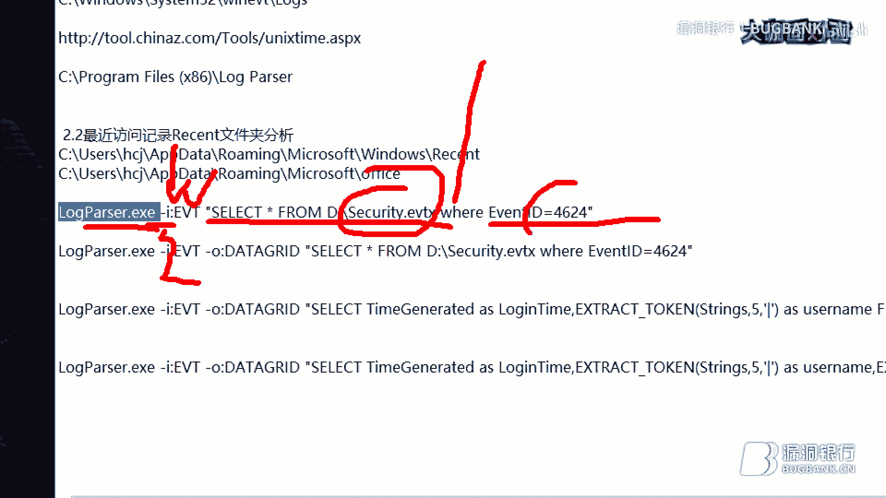


Windows事件日志是取证分析的宝库。通过分析事件日志，我们可以了解计算机的开关机时间、用户登录行为、外设连接记录、网络连接情况等。

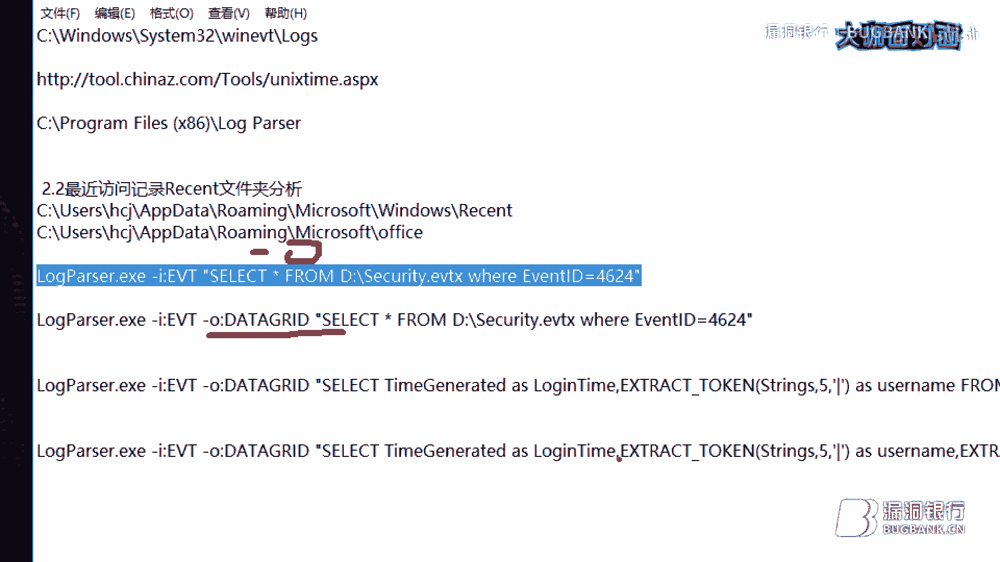


事件日志文件通常保存在：
```
C:\Windows\System32\winevt\Logs\
```
文件后缀为 `.evtx`。你可以使用系统自带的事件查看器（`eventvwr.msc`）打开分析，但更专业的做法是将日志文件复制到其他机器上进行分析，以保证原始证据的完整性。

### 用户登录/注销分析


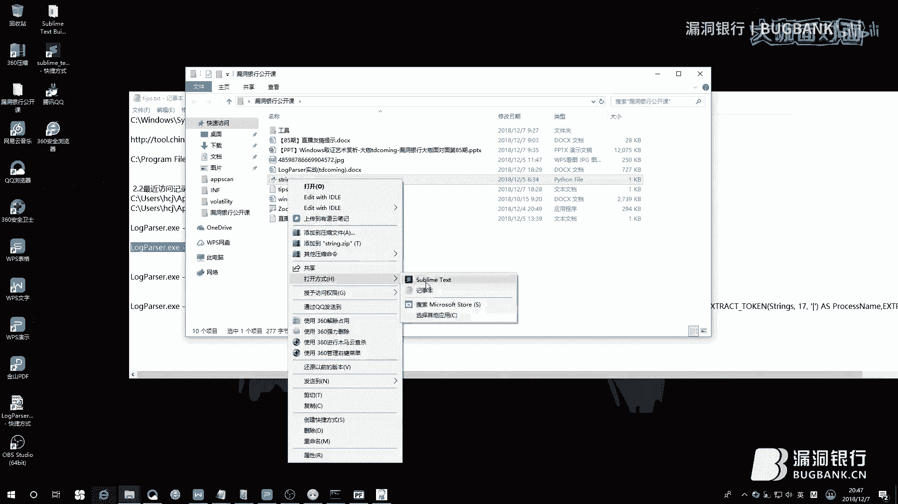


一个完整的用户登录/注销过程通常遵循以下事件序列：
1.  **事件ID 1**：用户配置文件加载开始。
2.  **事件ID 2**：用户配置文件加载成功。
3.  **事件ID 3**：用户收到注销通知。
4.  **事件ID 4**：用户配置文件卸载完成。

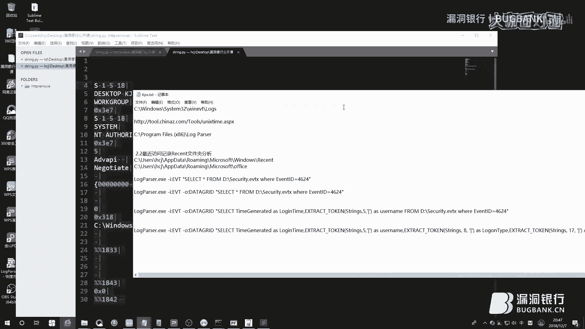

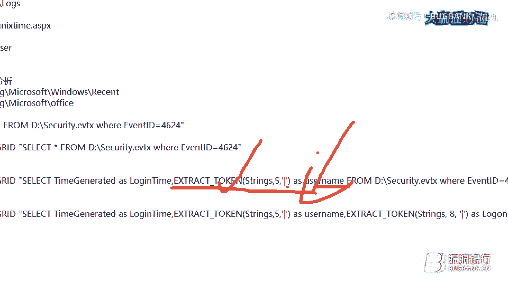


通过分析这些事件（位于 `Windows Logs\Application and Services Logs\Microsoft\Windows\User Profile Service\Operational`），可以精确知道用户何时上班（登录）、何时下班（注销）。

### 外设连接分析

对于U盘等移动设备的连接，Windows也会记录。相关的事件ID包括：
*   **系统日志**：ID 2001, 2003, 2004（驱动安装事件）
*   **设备管理日志**：ID 400, 410, 430等


在事件查看器中，可以使用“筛选当前日志”功能，通过指定事件ID来快速过滤出相关记录，从而分析设备插入和拔出的时间。

### 远程桌面连接分析


如果计算机开启了远程桌面，分析远程登录行为至关重要。相关事件日志位于：
```
Windows Logs\Security
```
以及
```
Microsoft-Windows-TerminalServices-RemoteConnectionManager/Operational
```
等路径下。

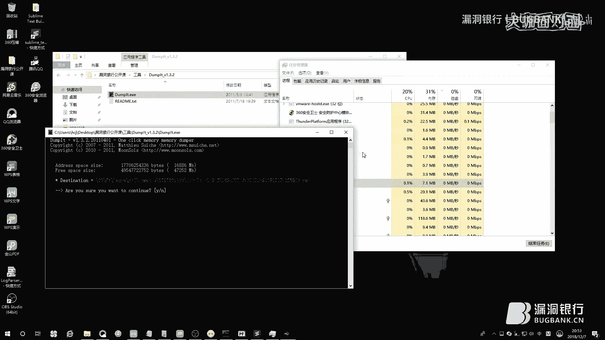

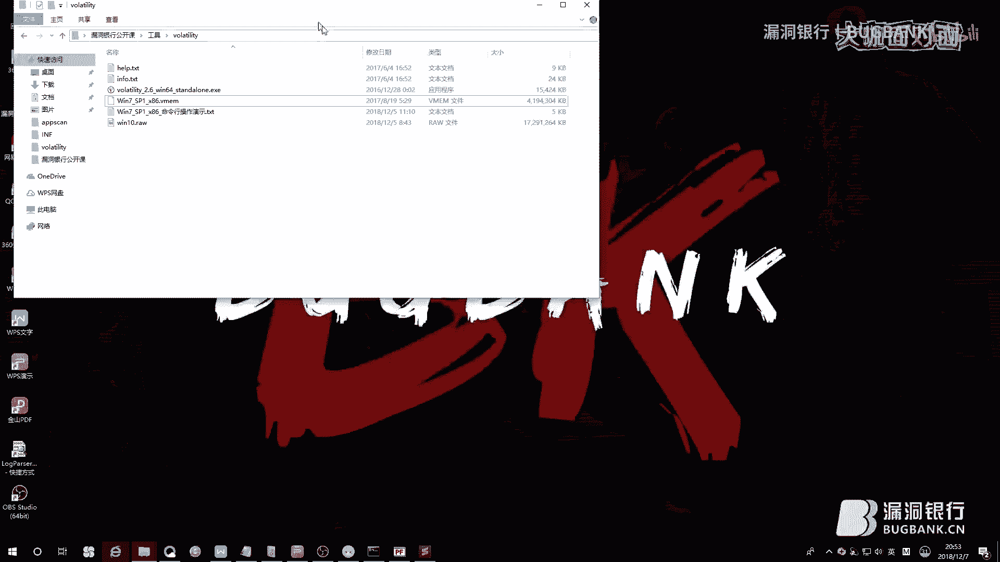

重点关注安全日志中的**事件ID 4624**（登录成功）和**事件ID 4634/4647**（注销）。在事件详情中，可以提取到登录账户、登录类型、源网络地址（IP）等信息。例如，登录类型（Logon Type）为3通常表示网络共享或远程登录。

### 使用LogParser进行高效分析


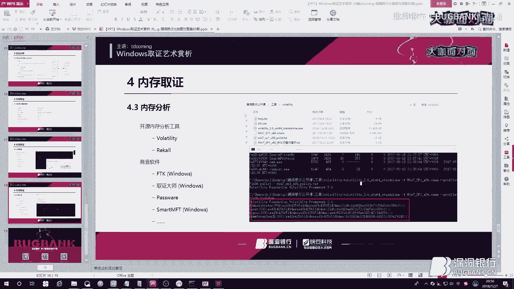

手动查看日志效率较低。微软提供的 **LogParser** 工具可以用类似SQL的语法高效分析日志。例如，分析安全日志中所有成功的登录事件（ID 4624）：
```bash
LogParser.exe -i:EVT "SELECT TimeGenerated, EventID, Strings FROM 'D:\Security.evtx' WHERE EventID=4624"
```
为了输出更清晰，可以优化查询，提取特定字段。例如，提取用户名、登录类型和源IP地址（它们分别位于Strings字段的第5、8、18项，索引从0开始）：
```bash
LogParser.exe -i:EVT "SELECT TimeGenerated, EventID, EXTRACT_TOKEN(Strings, 4, '|') as User, EXTRACT_TOKEN(Strings, 7, '|') as LogonType, EXTRACT_TOKEN(Strings, 17, '|') as SourceIP FROM 'D:\Security.evtx' WHERE EventID=4624"
```


---

## 内存取证（活取证） 💾

内存取证又称“活取证”，因为内存中的数据在关机后会丢失。但内存中可能包含正在运行的进程、网络连接、加密密钥、甚至明文的密码哈希等宝贵信息。

进行内存取证时，需要尽量减少对目标系统内存的干扰。常用的内存提取工具是 **DumpIt** 或 **WinPMEM**，它们体积小，提取速度快。


提取到的内存镜像文件（.raw或.mem）可以使用 **Volatility** 框架进行分析。Volatility功能强大，常用命令示例：
```bash
# 查看进程列表
volatility -f memory.dump --profile=Win10x64 pslist

# 提取用户密码哈希（如果存在）
volatility -f memory.dump --profile=Win10x64 hashdump

# 查看网络连接
volatility -f memory.dump --profile=Win10x64 netscan

# 提取浏览器历史记录
volatility -f memory.dump --profile=Win10x64 chromehistory
```


---


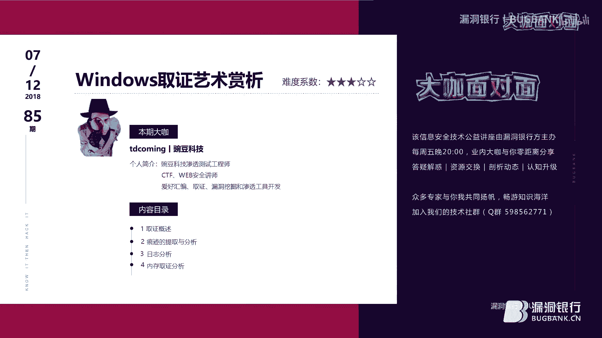

## 总结 📝


本节课我们一起学习了Windows取证的基础知识。我们从取证的概念出发，探讨了如何提取和分析系统痕迹（如安装时间）、用户痕迹（如最近文档）以及程序运行痕迹。

我们深入研究了Windows事件日志，学习了如何分析用户登录、外设连接和远程桌面行为，并介绍了使用LogParser工具进行高效日志分析的方法。

最后，我们了解了内存取证（活取证）的重要性及基本工具Volatility的使用。

取证是一个涉及技术、流程和思维的综合性领域。希望本节课的内容能为你打开Windows取证的大门，在需要时能够有条理地发现和分析数字证据。

---
*注：本教程根据TD康明在“漏洞银行大咖面对面第85期”的分享内容整理而成，侧重于技术原理与操作方法。在实际取证工作中，请务必遵循法律法规和标准的取证流程。*