# P1：【录屏】linux web安全加固——21期大咖裤衩哥 - 漏洞银行BUGBANK - BV1jZ4y1P7ys

(音樂)。

小夥伴晚上好。

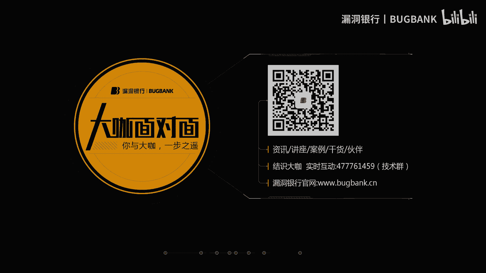

歡迎收看漏洞銀行第21期的大咖面對面，我是主持人年念，今晚我們邀請到了，星辰安全團隊的核心成員庫查哥，庫查哥來為我們分享Linux Web安全加固這個主題，難度係數為兩顆星，大咖分享期間。

希望大家能多和大咖進行互動和交流，希望大家避免探討與分享內容無關的話題，保持對大咖的尊重。

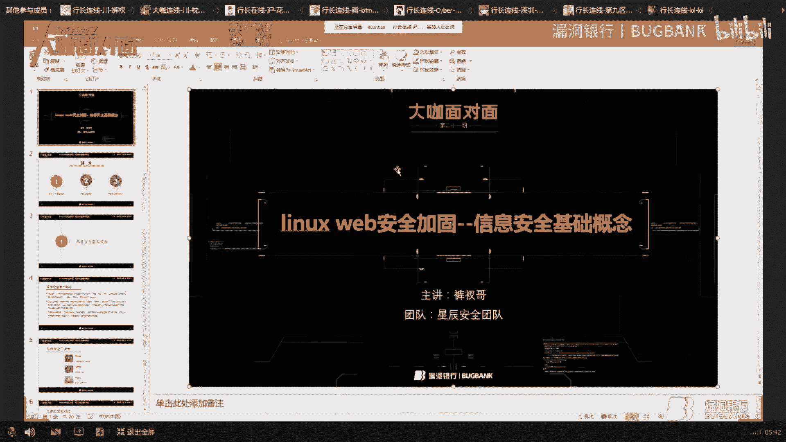

好的那現在就有請庫查哥開始今天的分享吧，大家好，我是庫查哥，今天給大家簡單講一講這個關於Linux安全加固這塊，本來想出什麼課題來，然後看到有一個鐵人三項，然後他們有樣題，就這個給大家講一講。

先講一講技術概念和安全加固的一些方向，一些方式吧，Linux分三個方向，一個是新鮮線技術概念，新鮮線技術的基本概念，都是典類的一些法要，剛剛詳細的我都刪除了，新鮮線技術的基本概念，新鮮線技術的基本概念。

新鮮線技術是信息和信息系統不被未經授權訪問，使用、泄露、中斷、修改、破壞，為信息系統的保密性、完整性、可用性和可控性，保密性、完整性、可用性和可控性和否認性，是新鮮線技術所面向的對象。

信息安全保障是保障信息與信息系統的，保密性、完整性、可用性和可控性，我們國人還是來自於國內的，信息保護的防禦過程，它要求加強對信息和信息系統的保護，加強對信息安全事件等脆弱性的檢測。

需要應急反應能力和企業恢復能力，信息安全保障體系有的是短保，這是全職要求的，新鮮線技術三要素，第一要素是DNA，保密性，保密性是指沒有經過授權的用戶實體進程，發掘信息，信息原始體制，三個方面，完整性。

沒有經過授權的用戶不能改變或生成信息，從而信息傳輸中不會再偶然或故意破壞，保持信息的完整統一，保護信息的處理方法準確性和完美性，不應用人為的原因，因此改變了內容，保證不被非法改動和銷毀。

通常系統性和不完整性，可用性，如果傳輸的數據並不可用的話，那你想訪問的東西無法保證可用，那你還要這個系統做什麼，信息安全模型，有一個叫P2D2模型，信息安全模型，PT表示防護時間。

理解為入侵者攻擊安全目標所花費的時間，ET代表入侵者從發動入侵開始，系統能夠檢測到入侵行為所花費的時間，RT代表從發現入侵開始，系統能夠做出足夠的響應，同時是GT大於ET大於RT，這個公式的意思就是說。

如果說你的防護時間，大於他的攻擊時間和響應時間的話，那你這個系統是安全的，這也是很重要的一個，怎麼認定一個系統是安全的，通過P2D2這個模型和這個公式，信息安全保證技術，防護牆防護牆技術。

控制信息的服務，防護牆是一端連接在內網中，另一端是直接連接到互聯網，互聯網傳輸的數據，通過過濾或傳輸匹配這些東西，通過了發明檔案或黑名單的這些東西，可以給後台的遠處器進行傳輸，遠處器給別人發回的數據。

也會經過防護牆來進行檢測，檢測成功後再給用戶，這也就是說為什麼有的是，WAPT過了防護牆認證這個技術，保護內部網絡免造母機，第一步有的攻擊，都通過它進行公轉，所以說防護牆的，能夠補助兩端的攻擊。

網絡存取和訪問進行監控統計，訪問和存取的數據進行通過審計，通過防護牆的話，有通路還有特別組，有些特別組會盡在它的任務，通過這個審計，防止內部網絡信息洩露，一些敏感信息洩露之類的，比如說今年WAPT2。

為什麼有的障礙，剛出來的時候為什麼有的障礙，是未修補，但是卻返回了頁面，你說或許不到一個星期，或許執行不了，今天有這個風險，有可能是在防護牆的攻擊安全，這是您返回的一些前面的其他頁面。

防護牆進入其他功能，還保留了安全策略，防內部網絡解鎖細節，因為外部人訪問的話，已經進入了防護牆，已經進入了防護牆，防護牆進入了防護牆，這樣的話它能禁止你外部探測，那個局網內的網絡信息，防密通信功能。

內部通信是不會對外界傳輸，身份證明身份認證，其實互相系統說是以身份證明，相同的過程同樣認證，相同的過程同樣認證，相同的過程同樣認證，相同的過程同樣認證，相同的過程同樣認證，相同的過程同樣認證。

相同的過程同樣認證，相同的過程同樣認證，相同的過程同樣認證，相同的過程同樣認證，相同的過程同樣認證，相同的過程同樣認證，相同的過程同樣認證，相同的過程同樣認證，相同的過程同樣認證，相同的過程同樣認證。

相同的過程同樣認證，相同的過程同樣認證，相同的過程同樣認證，相同的過程同樣認證，相同的過程同樣認證，相同的過程同樣認證，相同的過程同樣認證，相同的過程同樣認證，相同的過程同樣認證，相同的過程同樣認證。

相同的過程同樣認證，相同的過程同樣認證，相同的過程同樣認證，相同的過程同樣認證，相同的過程同樣認證，相同的過程同樣認證，相同的過程同樣認證，相同的過程同樣認證，相同的過程同樣認證，相同的過程同樣認證。

相同的過程同樣認證，相同的過程同樣認證，相同的過程同樣認證，相同的過程同樣認證，相同的過程同樣認證，相同的過程同樣認證，相同的過程同樣認證，相同的過程同樣認證，相同的過程同樣認證，相同的過程同樣認證。

相同的過程同樣認證，相同的過程同樣認證，相同的過程同樣認證，相同的過程同樣認證，相同的過程同樣認證，相同的過程同樣認證，相同的過程同樣認證，相同的過程同樣認證，相同的過程同樣認證，相同的過程同樣認證。

相同的過程同樣認證，相同的過程同樣認證，相同的過程同樣認證，相同的過程同樣認證，相同的過程同樣認證，相同的過程同樣認證，相同的過程同樣認證，相同的過程同樣認證，相同的過程同樣認證，相同的過程同樣認證。

相同的過程同樣認證，相同的過程同樣認證，相同的過程同樣認證，相同的過程同樣認證，相同的過程同樣認證，相同的過程同樣認證，相同的過程同樣認證，相同的過程同樣認證，相同的過程同樣認證，相同的過程同樣認證。

相同的過程同樣認證，相同的過程同樣認證，相同的過程同樣認證，相同的過程同樣認證，相同的過程同樣認證，相同的過程同樣認證，相同的過程同樣認證，相同的過程同樣認證，相同的過程同樣認證，相同的過程同樣認證。

相同的過程同樣認證，相同的過程同樣認證，相同的過程同樣認證，相同的過程同樣認證，相同的過程同樣認證，相同的過程同樣認證，相同的過程同樣認證，相同的過程同樣認證，相同的過程同樣認證，相同的過程同樣認證。

相同的過程同樣認證，相同的過程同樣認證，相同的過程同樣認證，相同的過程同樣認證，相同的過程同樣認證，相同的過程同樣認證，相同的過程同樣認證，相同的過程同樣認證，相同的過程同樣認證，相同的過程同樣認證。

相同的過程同樣認證，相同的過程同樣認證，相同的過程同樣認證，相同的過程同樣認證，相同的過程同樣認證，相同的過程同樣認證，相同的過程同樣認證，相同的過程同樣認證，相同的過程同樣認證，相同的過程同樣認證。

相同的過程同樣認證，相同的過程同樣認證，相同的過程同樣認證，相同的過程同樣認證，相同的過程同樣認證，相同的過程同樣認證，相同的過程同樣認證，相同的過程同樣認證，相同的過程同樣認證，相同的過程同樣認證。

相同的過程同樣認證，相同的過程同樣認證，相同的過程同樣認證，相同的過程同樣認證，相同的過程同樣認證，相同的過程同樣認證，相同的過程同樣認證，相同的過程同樣認證，相同的過程同樣認證，相同的過程同樣認證。

相同的過程同樣認證，相同的過程同樣認證，相同的過程同樣認證，相同的過程同樣認證，相同的過程同樣認證，相同的過程同樣認證，相同的過程同樣認證，相同的過程同樣認證，相同的過程同樣認證，相同的過程同樣認證。

相同的過程同樣認證，相同的過程同樣認證，相同的過程同樣認證，相同的過程同樣認證，相同的過程同樣認證，相同的過程同樣認證，相同的過程同樣認證，相同的過程同樣認證，相同的過程同樣認證，相同的過程同樣認證。

相同的過程同樣認證，相同的過程同樣認證，相同的過程同樣認證，相同的過程同樣認證，相同的過程同樣認證，相同的過程同樣認證，相同的過程同樣認證，相同的過程同樣認證，相同的過程同樣認證，相同的過程同樣認證。

相同的過程同樣認證，相同的過程同樣認證，相同的過程同樣認證，相同的過程同樣認證，相同的過程同樣認證，相同的過程同樣認證，相同的過程同樣認證，相同的過程同樣認證，相同的過程同樣認證，相同的過程同樣認證。

相同的過程同樣認證，相同的過程同樣認證，相同的過程同樣認證，相同的過程同樣認證，相同的過程同樣認證，相同的過程同樣認證，相同的過程同樣認證，相同的過程同樣認證，相同的過程同樣認證，相同的過程同樣認證。

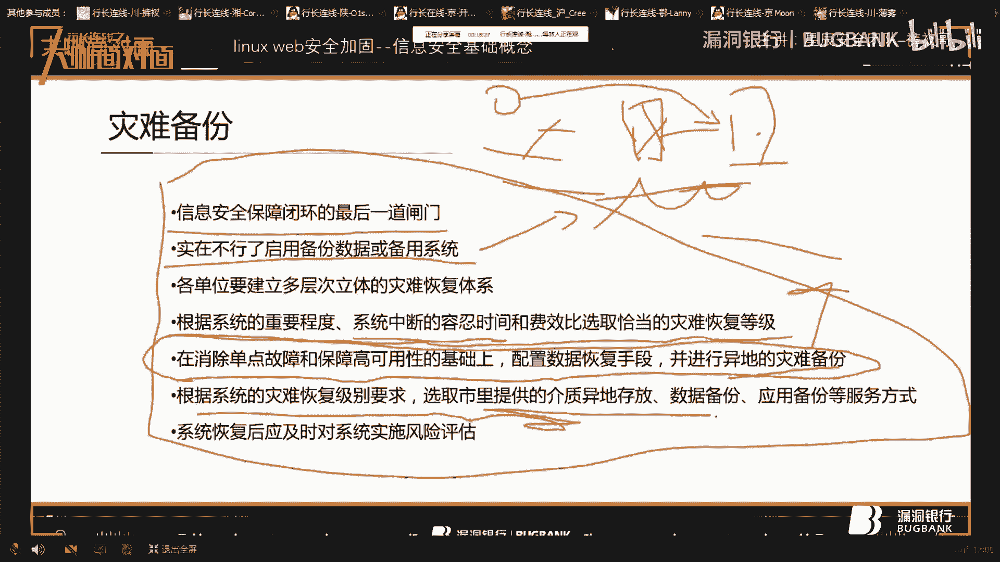

相同的過程同樣認證，相同的過程同樣認證。

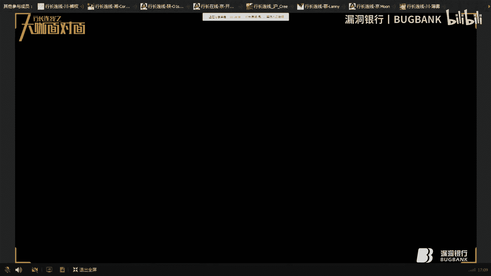

相同的過程同樣認證，相同的過程同樣認證，相同的過程同樣認證，相同的過程同樣認證，相同的過程同樣認證，相同的過程同樣認證，相同的過程同樣認證，相同的過程同樣認證，相同的過程同樣認證，相同的過程同樣認證。

相同的過程同樣認證，相同的過程同樣認證，相同的過程同樣認證，相同的過程同樣認證，相同的過程同樣認證，相同的過程同樣認證，相同的過程同樣認證，相同的過程同樣認證，相同的過程同樣認證，相同的過程同樣認證。

相同的過程同樣認證，相同的過程同樣認證，相同的過程同樣認證，相同的過程同樣認證，相同的過程同樣認證，相同的過程同樣認證，相同的過程同樣認證，相同的過程同樣認證，相同的過程同樣認證，相同的過程同樣認證。

相同的過程同樣認證，相同的過程同樣認證，相同的過程同樣認證，相同的過程同樣認證，相同的過程同樣認證，相同的過程同樣認證，相同的過程同樣認證，相同的過程同樣認證，相同的過程同樣認證，相同的過程同樣認證。

相同的過程同樣認證，相同的過程同樣認證，相同的過程同樣認證，相同的過程同樣認證，相同的過程同樣認證，相同的過程同樣認證，相同的過程同樣認證，相同的過程同樣認證，相同的過程同樣認證，相同的過程同樣認證。

相同的過程同樣認證，相同的過程同樣認證，相同的過程同樣認證，相同的過程同樣認證，相同的過程同樣認證，相同的過程同樣認證，相同的過程同樣認證，相同的過程同樣認證，相同的過程同樣認證，相同的過程同樣認證。

相同的過程同樣認證，相同的過程同樣認證，相同的過程同樣認證，相同的過程同樣認證，相同的過程同樣認證，相同的過程同樣認證，相同的過程同樣認證，相同的過程同樣認證，相同的過程同樣認證，相同的過程同樣認證。

相同的過程同樣認證，相同的過程同樣認證，相同的過程同樣認證，相同的過程同樣認證，相同的過程同樣認證，相同的過程同樣認證，相同的過程同樣認證，相同的過程同樣認證，相同的過程同樣認證，相同的過程同樣認證。

相同的過程同樣認證，相同的過程同樣認證，相同的過程同樣認證，相同的過程同樣認證，相同的過程同樣認證，相同的過程同樣認證，相同的過程同樣認證，相同的過程同樣認證，相同的過程同樣認證，相同的過程同樣認證。

相同的過程同樣認證，相同的過程同樣認證，相同的過程同樣認證，相同的過程同樣認證，相同的過程同樣認證，相同的過程同樣認證，相同的過程同樣認證，相同的過程同樣認證，相同的過程同樣認證，相同的過程同樣認證。

相同的過程同樣認證，相同的過程同樣認證，相同的過程同樣認證，相同的過程同樣認證，相同的過程同樣認證，相同的過程同樣認證，相同的過程同樣認證，相同的過程同樣認證，相同的過程同樣認證，相同的過程同樣認證。

相同的過程同樣認證，相同的過程同樣認證，相同的過程同樣認證，相同的過程同樣認證，相同的過程同樣認證，相同的過程同樣認證，相同的過程同樣認證，相同的過程同樣認證，相同的過程同樣認證，相同的過程同樣認證。

相同的過程同樣認證，相同的過程同樣認證，相同的過程同樣認證，相同的過程同樣認證，相同的過程同樣認證，相同的過程同樣認證，相同的過程同樣認證，相同的過程同樣認證，相同的過程同樣認證，相同的過程同樣認證。

相同的過程同樣認證，相同的過程同樣認證，相同的過程同樣認證，相同的過程同樣認證，相同的過程同樣認證，相同的過程同樣認證，相同的過程同樣認證，相同的過程同樣認證，相同的過程同樣認證，相同的過程同樣認證。

相同的過程同樣認證，相同的過程同樣認證，相同的過程同樣認證，相同的過程同樣認證，相同的過程同樣認證，相同的過程同樣認證，相同的過程同樣認證，相同的過程同樣認證，相同的過程同樣認證，相同的過程同樣認證。

相同的過程同樣認證，相同的過程同樣認證，相同的過程同樣認證，相同的過程同樣認證，相同的過程同樣認證，相同的過程同樣認證，相同的過程同樣認證，相同的過程同樣認證，相同的過程同樣認證，相同的過程同樣認證。

相同的過程同樣認證，相同的過程同樣認證，相同的過程同樣認證，相同的過程同樣認證，相同的過程同樣認證，相同的過程同樣認證，相同的過程同樣認證，相同的過程同樣認證，相同的過程同樣認證，相同的過程同樣認證。

相同的過程同樣認證，相同的過程同樣認證，相同的過程同樣認證，相同的過程同樣認證，相同的過程同樣認證，相同的過程同樣認證，相同的過程同樣認證，相同的過程同樣認證，相同的過程同樣認證，相同的過程同樣認證。

相同的過程同樣認證，相同的過程同樣認證，相同的過程同樣認證，相同的過程同樣認證，相同的過程同樣認證，相同的過程同樣認證，相同的過程同樣認證，相同的過程同樣認證，相同的過程同樣認證，相同的過程同樣認證。

相同的過程同樣認證，相同的過程同樣認證，相同的過程同樣認證，相同的過程同樣認證，相同的過程同樣認證，相同的過程同樣認證，相同的過程同樣認證，相同的過程同樣認證，相同的過程同樣認證，相同的過程同樣認證。

相同的過程同樣認證，相同的過程同樣認證，相同的過程同樣認證，相同的過程同樣認證，相同的過程同樣認證，相同的過程同樣認證，相同的過程同樣認證，相同的過程同樣認證，相同的過程同樣認證，相同的過程同樣認證。

相同的過程同樣認證，相同的過程同樣認證，相同的過程同樣認證，相同的過程同樣認證，相同的過程同樣認證，相同的過程同樣認證，相同的過程同樣認證，相同的過程同樣認證，相同的過程同樣認證，相同的過程同樣認證。

相同的過程同樣認證，相同的過程同樣認證，相同的過程同樣認證，相同的過程同樣認證，相同的過程同樣認證，相同的過程同樣認證，相同的過程同樣認證，相同的過程同樣認證，相同的過程同樣認證，相同的過程同樣認證。

相同的過程同樣認證，相同的過程同樣認證，相同的過程同樣認證，相同的過程同樣認證，相同的過程同樣認證，相同的過程同樣認證，相同的過程同樣認證，相同的過程同樣認證，相同的過程同樣認證，相同的過程同樣認證。

相同的過程同樣認證，相同的過程同樣認證，相同的過程同樣認證，相同的過程同樣認證，相同的過程同樣認證，相同的過程同樣認證，相同的過程同樣認證，相同的過程同樣認證，相同的過程同樣認證，相同的過程同樣認證。

相同的過程同樣認證，相同的過程同樣認證，相同的過程同樣認證，相同的過程同樣認證，相同的過程同樣認證，相同的過程同樣認證，相同的過程同樣認證，相同的過程同樣認證，相同的過程同樣認證，相同的過程同樣認證。

相同的過程同樣認證，相同的過程同樣認證，相同的過程同樣認證，相同的過程同樣認證，相同的過程同樣認證，相同的過程同樣認證，相同的過程同樣認證，相同的過程同樣認證，相同的過程同樣認證，相同的過程同樣認證。

相同的過程同樣認證，相同的過程同樣認證，相同的過程同樣認證，相同的過程同樣認證，相同的過程同樣認證，相同的過程同樣認證，相同的過程同樣認證，相同的過程同樣認證，相同的過程同樣認證，相同的過程同樣認證。

相同的過程同樣認證，相同的過程同樣認證，相同的過程同樣認證，相同的過程同樣認證，相同的過程同樣認證，相同的過程同樣認證，相同的過程同樣認證，相同的過程同樣認證，相同的過程同樣認證，相同的過程同樣認證。

相同的過程同樣認證，相同的過程同樣認證，相同的過程同樣認證，相同的過程同樣認證，相同的過程同樣認證，相同的過程同樣認證，相同的過程同樣認證，相同的過程同樣認證，相同的過程同樣認證，相同的過程同樣認證。

相同的過程同樣認證，相同的過程同樣認證，相同的過程同樣認證，相同的過程同樣認證，相同的過程同樣認證，相同的過程同樣認證，相同的過程同樣認證，相同的過程同樣認證，相同的過程同樣認證，相同的過程同樣認證。

相同的過程同樣認證，相同的過程同樣認證，相同的過程同樣認證，相同的過程同樣認證，相同的過程同樣認證。

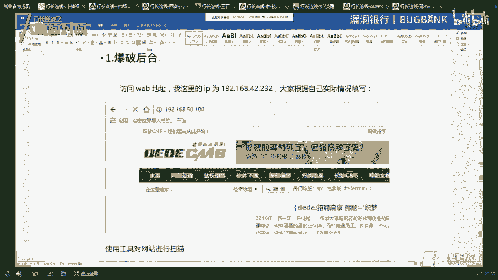

相同的過程同樣認證，相同的過程同樣認證，相同的過程同樣認證，相同的過程同樣認證，相同的過程同樣認證，相同的過程同樣認證，相同的過程同樣認證。

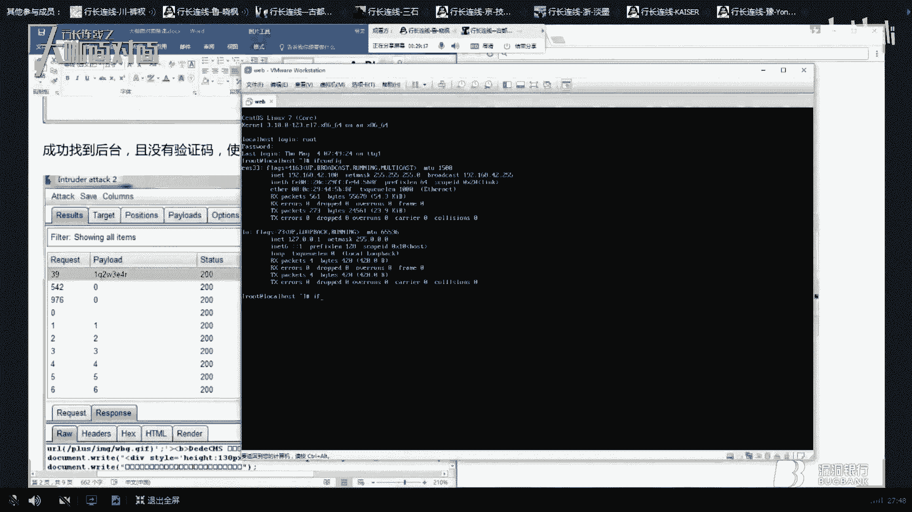

相同的過程同樣認證，相同的過程同樣認證，相同的過程同樣認證。

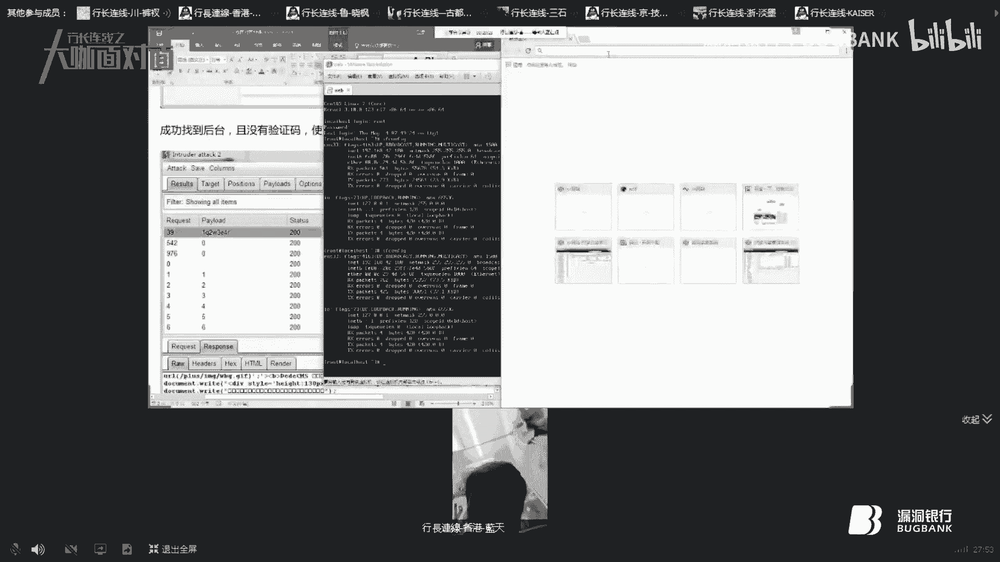

相同的過程同樣認證，相同的過程同樣認證，相同的過程同樣認證，相同的過程同樣認證，相同的過程同樣認證，相同的過程同樣認證，相同的過程同樣認證，相同的過程同樣認證，相同的過程同樣認證，相同的過程同樣認證。

相同的過程同樣認證，相同的過程同樣認證，相同的過程同樣認證，相同的過程同樣認證，相同的過程同樣認證，相同的過程同樣認證，相同的過程同樣認證，相同的過程同樣認證，相同的過程同樣認證，相同的過程同樣認證。

相同的過程同樣認證，相同的過程同樣認證，相同的過程同樣認證，相同的過程同樣認證，相同的過程同樣認證，相同的過程同樣認證，相同的過程同樣認證，相同的過程同樣認證，相同的過程同樣認證，相同的過程同樣認證。

相同的過程同樣認證，相同的過程同樣認證，相同的過程同樣認證，相同的過程同樣認證，相同的過程同樣認證，相同的過程同樣認證，相同的過程同樣認證，相同的過程同樣認證，相同的過程同樣認證，相同的過程同樣認證。

相同的過程同樣認證，相同的過程同樣認證，相同的過程同樣認證，相同的過程同樣認證，相同的過程同樣認證，相同的過程同樣認證，相同的過程同樣認證，相同的過程同樣認證，相同的過程同樣認證，相同的過程同樣認證。

相同的過程同樣認證，相同的過程同樣認證，相同的過程同樣認證，相同的過程同樣認證，相同的過程同樣認證，相同的過程同樣認證，相同的過程同樣認證，相同的過程同樣認證，相同的過程同樣認證，相同的過程同樣認證。

相同的過程同樣認證，相同的過程同樣認證，相同的過程同樣認證，相同的過程同樣認證，相同的過程同樣認證，相同的過程同樣認證，相同的過程同樣認證，相同的過程同樣認證，相同的過程同樣認證，相同的過程同樣認證。

相同的過程同樣認證，相同的過程同樣認證，相同的過程同樣認證，相同的過程同樣認證，相同的過程同樣認證，相同的過程同樣認證，相同的過程同樣認證，相同的過程同樣認證，相同的過程同樣認證，相同的過程同樣認證。

相同的過程同樣認證，相同的過程同樣認證，相同的過程同樣認證，相同的過程同樣認證，相同的過程同樣認證，相同的過程同樣認證，相同的過程同樣認證。

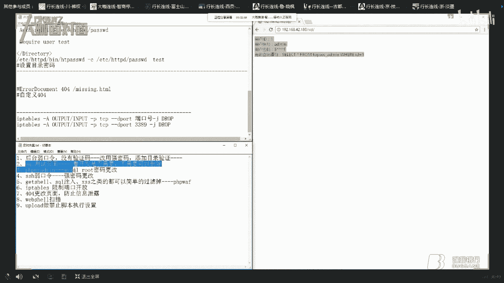

相同的過程同樣認證，相同的過程同樣認證，相同的過程同樣認證，相同的過程同樣認證，相同的過程同樣認證，相同的過程同樣認證，相同的過程同樣認證，相同的過程同樣認證，相同的過程同樣認證，相同的過程同樣認證。

相同的過程同樣認證，相同的過程同樣認證，相同的過程同樣認證，相同的過程同樣認證，相同的過程同樣認證，相同的過程同樣認證，相同的過程同樣認證，相同的過程同樣認證，相同的過程同樣認證，相同的過程同樣認證。

相同的過程同樣認證，相同的過程同樣認證，相同的過程同樣認證，相同的過程同樣認證，相同的過程同樣認證，相同的過程同樣認證，相同的過程同樣認證，相同的過程同樣認證，相同的過程同樣認證，相同的過程同樣認證。

相同的過程同樣認證，相同的過程同樣認證，相同的過程同樣認證，相同的過程同樣認證，相同的過程同樣認證，相同的過程同樣認證，相同的過程同樣認證，相同的過程同樣認證，相同的過程同樣認證，相同的過程同樣認證。

相同的過程同樣認證，相同的過程同樣認證，相同的過程同樣認證，相同的過程同樣認證，相同的過程同樣認證，相同的過程同樣認證，相同的過程同樣認證，相同的過程同樣認證，相同的過程同樣認證，相同的過程同樣認證。

相同的過程同樣認證，相同的過程同樣認證，相同的過程同樣認證，相同的過程同樣認證，相同的過程同樣認證，相同的過程同樣認證，相同的過程同樣認證，相同的過程同樣認證，相同的過程同樣認證，相同的過程同樣認證。

相同的過程同樣認證，相同的過程同樣認證，相同的過程同樣認證，相同的過程同樣認證，相同的過程同樣認證，相同的過程同樣認證，相同的過程同樣認證，相同的過程同樣認證，相同的過程同樣認證，相同的過程同樣認證。

相同的過程同樣認證，相同的過程同樣認證，相同的過程同樣認證，相同的過程同樣認證，相同的過程同樣認證，相同的過程同樣認證，相同的過程同樣認證，相同的過程同樣認證，相同的過程同樣認證，相同的過程同樣認證。

相同的過程同樣認證，相同的過程同樣認證，相同的過程同樣認證，相同的過程同樣認證，相同的過程同樣認證，相同的過程同樣認證，相同的過程同樣認證，相同的過程同樣認證，相同的過程同樣認證，相同的過程同樣認證。

相同的過程同樣認證，相同的過程同樣認證，相同的過程同樣認證，相同的過程同樣認證，相同的過程同樣認證，相同的過程同樣認證，相同的過程同樣認證，相同的過程同樣認證，相同的過程同樣認證，相同的過程同樣認證。

相同的過程同樣認證，相同的過程同樣認證，相同的過程同樣認證，相同的過程同樣認證，相同的過程同樣認證，相同的過程同樣認證，相同的過程同樣認證，相同的過程同樣認證，相同的過程同樣認證，相同的過程同樣認證。

相同的過程同樣認證，相同的過程同樣認證，相同的過程同樣認證，相同的過程同樣認證，相同的過程同樣認證，相同的過程同樣認證，相同的過程同樣認證，相同的過程同樣認證。

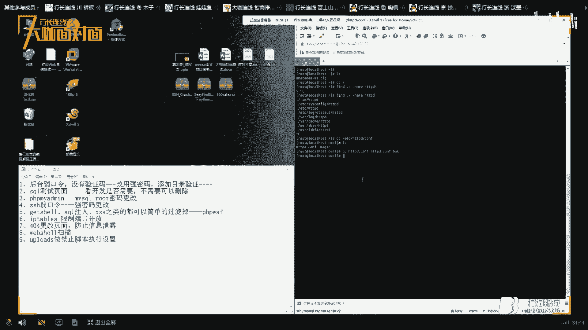

相同的過程同樣認證，相同的過程同樣認證，相同的過程同樣認證，相同的過程同樣認證，相同的過程同樣認證，相同的過程同樣認證，相同的過程同樣認證，相同的過程同樣認證，相同的過程同樣認證，相同的過程同樣認證。

相同的過程同樣認證，相同的過程同樣認證，相同的過程同樣認證，相同的過程同樣認證，相同的過程同樣認證，相同的過程同樣認證，相同的過程同樣認證，相同的過程同樣認證，相同的過程同樣認證，相同的過程同樣認證。

相同的過程同樣認證，相同的過程同樣認證，相同的過程同樣認證，相同的過程同樣認證，相同的過程同樣認證，相同的過程同樣認證，相同的過程同樣認證，相同的過程同樣認證，相同的過程同樣認證，相同的過程同樣認證。

相同的過程同樣認證，相同的過程同樣認證，相同的過程同樣認證，相同的過程同樣認證，相同的過程同樣認證，相同的過程同樣認證，相同的過程同樣認證，相同的過程同樣認證，相同的過程同樣認證，相同的過程同樣認證。

相同的過程同樣認證，相同的過程同樣認證，相同的過程同樣認證，相同的過程同樣認證，相同的過程同樣認證，相同的過程同樣認證，相同的過程同樣認證，相同的過程同樣認證，相同的過程同樣認證，相同的過程同樣認證。

相同的過程同樣認證，相同的過程同樣認證，相同的過程同樣認證，相同的過程同樣認證，相同的過程同樣認證，相同的過程同樣認證，相同的過程同樣認證，相同的過程同樣認證，相同的過程同樣認證，相同的過程同樣認證。

相同的過程同樣認證，相同的過程同樣認證，相同的過程同樣認證，相同的過程同樣認證，相同的過程同樣認證，相同的過程同樣認證，相同的過程同樣認證，相同的過程同樣認證，相同的過程同樣認證，相同的過程同樣認證。

相同的過程同樣認證，相同的過程同樣認證，相同的過程同樣認證，相同的過程同樣認證，相同的過程同樣認證，相同的過程同樣認證，相同的過程同樣認證，相同的過程同樣認證，相同的過程同樣認證，相同的過程同樣認證。

相同的過程同樣認證，相同的過程同樣認證，相同的過程同樣認證，相同的過程同樣認證，相同的過程同樣認證，相同的過程同樣認證，相同的過程同樣認證，相同的過程同樣認證，相同的過程同樣認證，相同的過程同樣認證。

相同的過程同樣認證，相同的過程同樣認證，相同的過程同樣認證，相同的過程同樣認證，相同的過程同樣認證，相同的過程同樣認證，相同的過程同樣認證，相同的過程同樣認證，相同的過程同樣認證，相同的過程同樣認證。

相同的過程同樣認證，相同的過程同樣認證，相同的過程同樣認證，相同的過程同樣認證，相同的過程同樣認證，相同的過程同樣認證，相同的過程同樣認證，相同的過程同樣認證，相同的過程同樣認證，相同的過程同樣認證。

相同的過程同樣認證，相同的過程同樣認證，相同的過程同樣認證，相同的過程同樣認證，相同的過程同樣認證，相同的過程同樣認證，相同的過程同樣認證，相同的過程同樣認證，相同的過程同樣認證，相同的過程同樣認證。

相同的過程同樣認證，相同的過程同樣認證，相同的過程同樣認證，相同的過程同樣認證，相同的過程同樣認證，相同的過程同樣認證，相同的過程同樣認證，相同的過程同樣認證，相同的過程同樣認證，相同的過程同樣認證。

相同的過程同樣認證，相同的過程同樣認證，相同的過程同樣認證，相同的過程同樣認證，相同的過程同樣認證，相同的過程同樣認證，相同的過程同樣認證，相同的過程同樣認證，相同的過程同樣認證，相同的過程同樣認證。

相同的過程同樣認證，相同的過程同樣認證，相同的過程同樣認證，相同的過程同樣認證，相同的過程同樣認證，相同的過程同樣認證，相同的過程同樣認證，相同的過程同樣認證，相同的過程同樣認證，相同的過程同樣認證。

相同的過程同樣認證，相同的過程同樣認證，相同的過程同樣認證，相同的過程同樣認證，相同的過程同樣認證，相同的過程同樣認證，相同的過程同樣認證，相同的過程同樣認證，相同的過程同樣認證，相同的過程同樣認證。

相同的過程同樣認證，相同的過程同樣認證，相同的過程同樣認證，相同的過程同樣認證，相同的過程同樣認證，相同的過程同樣認證，相同的過程同樣認證，相同的過程同樣認證，相同的過程同樣認證，相同的過程同樣認證。

相同的過程同樣認證，相同的過程同樣認證，相同的過程同樣認證，相同的過程同樣認證，相同的過程同樣認證，相同的過程同樣認證，相同的過程同樣認證，相同的過程同樣認證，相同的過程同樣認證，相同的過程同樣認證。

相同的過程同樣認證，相同的過程同樣認證，相同的過程同樣認證，相同的過程同樣認證，相同的過程同樣認證，相同的過程同樣認證，相同的過程同樣認證，相同的過程同樣認證，相同的過程同樣認證，相同的過程同樣認證。

相同的過程同樣認證，相同的過程同樣認證，相同的過程同樣認證，相同的過程同樣認證，相同的過程同樣認證，相同的過程同樣認證，相同的過程同樣認證，相同的過程同樣認證，相同的過程同樣認證，相同的過程同樣認證。

相同的過程同樣認證，相同的過程同樣認證，相同的過程同樣認證，相同的過程同樣認證，相同的過程同樣認證，相同的過程同樣認證，相同的過程同樣認證，相同的過程同樣認證，相同的過程同樣認證，相同的過程同樣認證。

相同的過程同樣認證，相同的過程同樣認證，相同的過程同樣認證，相同的過程同樣認證，相同的過程同樣認證，相同的過程同樣認證，相同的過程同樣認證，相同的過程同樣認證，相同的過程同樣認證，相同的過程同樣認證。

相同的過程同樣認證，相同的過程同樣認證，相同的過程同樣認證，相同的過程同樣認證，相同的過程同樣認證，相同的過程同樣認證，相同的過程同樣認證，相同的過程同樣認證，相同的過程同樣認證，相同的過程同樣認證。

相同的過程同樣認證，相同的過程同樣認證，相同的過程同樣認證，相同的過程同樣認證，相同的過程同樣認證，相同的過程同樣認證，相同的過程同樣認證，相同的過程同樣認證，相同的過程同樣認證，相同的過程同樣認證。

相同的過程同樣認證，相同的過程同樣認證，相同的過程同樣認證，相同的過程同樣認證，相同的過程同樣認證，相同的過程同樣認證，相同的過程同樣認證，相同的過程同樣認證，相同的過程同樣認證，相同的過程同樣認證。

相同的過程同樣認證，相同的過程同樣認證，相同的過程同樣認證，相同的過程同樣認證，相同的過程同樣認證，相同的過程同樣認證，相同的過程同樣認證，相同的過程同樣認證，相同的過程同樣認證，相同的過程同樣認證。

相同的過程同樣認證，相同的過程同樣認證，相同的過程同樣認證，相同的過程同樣認證，相同的過程同樣認證，相同的過程同樣認證，相同的過程同樣認證，相同的過程同樣認證，相同的過程同樣認證，相同的過程同樣認證。

相同的過程同樣認證，相同的過程同樣認證，相同的過程同樣認證，相同的過程同樣認證，相同的過程同樣認證，相同的過程同樣認證，相同的過程同樣認證，相同的過程同樣認證，相同的過程同樣認證，相同的過程同樣認證。

相同的過程同樣認證，相同的過程同樣認證。

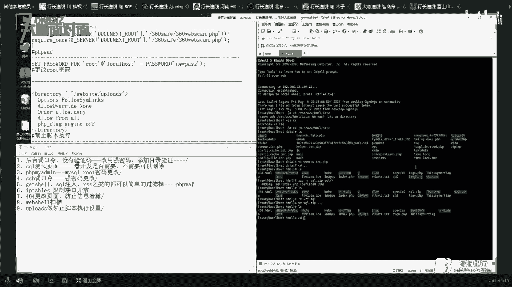

相同的過程同樣認證，相同的過程同樣認證，相同的過程同樣認證，相同的過程同樣認證，相同的過程同樣認證，相同的過程同樣認證，相同的過程同樣認證，相同的過程同樣認證，相同的過程同樣認證，相同的過程同樣認證。

相同的過程同樣認證，相同的過程同樣認證，相同的過程同樣認證，相同的過程同樣認證，相同的過程同樣認證，相同的過程同樣認證，相同的過程同樣認證，相同的過程同樣認證，相同的過程同樣認證，相同的過程同樣認證。

相同的過程同樣認證，相同的過程同樣認證，相同的過程同樣認證，相同的過程同樣認證，相同的過程同樣認證，相同的過程同樣認證，相同的過程同樣認證，相同的過程同樣認證，相同的過程同樣認證，相同的過程同樣認證。

相同的過程同樣認證，相同的過程同樣認證，相同的過程同樣認證，相同的過程同樣認證，相同的過程同樣認證，相同的過程同樣認證，相同的過程同樣認證，相同的過程同樣認證，相同的過程同樣認證，相同的過程同樣認證。

相同的過程同樣認證，相同的過程同樣認證，相同的過程同樣認證，相同的過程同樣認證，相同的過程同樣認證。

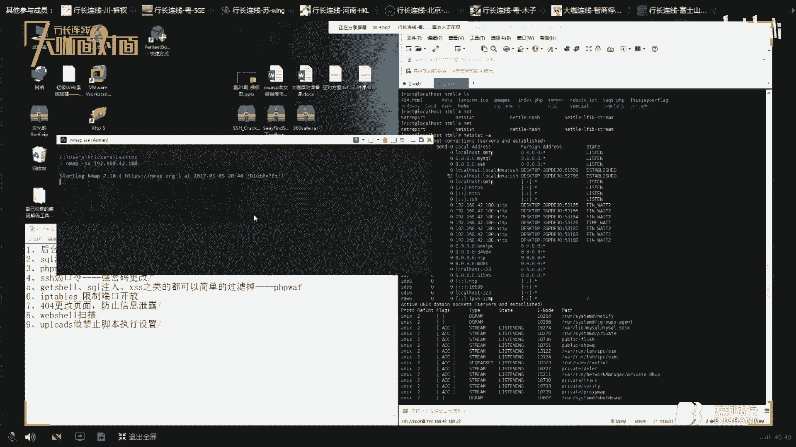

相同的過程同樣認證，相同的過程同樣認證，相同的過程同樣認證，相同的過程同樣認證，相同的過程同樣認證，相同的過程同樣認證，相同的過程同樣認證，相同的過程同樣認證，相同的過程同樣認證，相同的過程同樣認證。

相同的過程同樣認證，相同的過程同樣認證，相同的過程同樣認證，相同的過程同樣認證，相同的過程同樣認證，相同的過程同樣認證，相同的過程同樣認證，相同的過程同樣認證，相同的過程同樣認證，相同的過程同樣認證。

相同的過程同樣認證，相同的過程同樣認證，相同的過程同樣認證，相同的過程同樣認證，相同的過程同樣認證，相同的過程同樣認證，相同的過程同樣認證，相同的過程同樣認證，相同的過程同樣認證，相同的過程同樣認證。

相同的過程同樣認證，相同的過程同樣認證，相同的過程同樣認證，相同的過程同樣認證，相同的過程同樣認證，相同的過程同樣認證，相同的過程同樣認證，相同的過程同樣認證，相同的過程同樣認證，相同的過程同樣認證。

相同的過程同樣認證，相同的過程同樣認證，相同的過程同樣認證，相同的過程同樣認證，相同的過程同樣認證，相同的過程同樣認證，相同的過程同樣認證，相同的過程同樣認證，相同的過程同樣認證，相同的過程同樣認證。

相同的過程同樣認證，相同的過程同樣認證，相同的過程同樣認證，相同的過程同樣認證，相同的過程同樣認證，相同的過程同樣認證，相同的過程同樣認證，相同的過程同樣認證，相同的過程同樣認證，相同的過程同樣認證。

相同的過程同樣認證，相同的過程同樣認證，相同的過程同樣認證，相同的過程同樣認證，相同的過程同樣認證，相同的過程同樣認證，相同的過程同樣認證，相同的過程同樣認證，相同的過程同樣認證，相同的過程同樣認證。

相同的過程同樣認證，相同的過程同樣認證，相同的過程同樣認證，相同的過程同樣認證，相同的過程同樣認證，相同的過程同樣認證，相同的過程同樣認證，相同的過程同樣認證，相同的過程同樣認證，相同的過程同樣認證。

相同的過程同樣認證，相同的過程同樣認證，相同的過程同樣認證，相同的過程同樣認證，相同的過程同樣認證，相同的過程同樣認證，相同的過程同樣認證，相同的過程同樣認證，相同的過程同樣認證，相同的過程同樣認證。

相同的過程同樣認證，相同的過程同樣認證，相同的過程同樣認證，相同的過程同樣認證，相同的過程同樣認證，相同的過程同樣認證，相同的過程同樣認證，相同的過程同樣認證，相同的過程同樣認證，相同的過程同樣認證。

相同的過程同樣認證，相同的過程同樣認證，相同的過程同樣認證，相同的過程同樣認證，相同的過程同樣認證，相同的過程同樣認證，相同的過程同樣認證，相同的過程同樣認證。

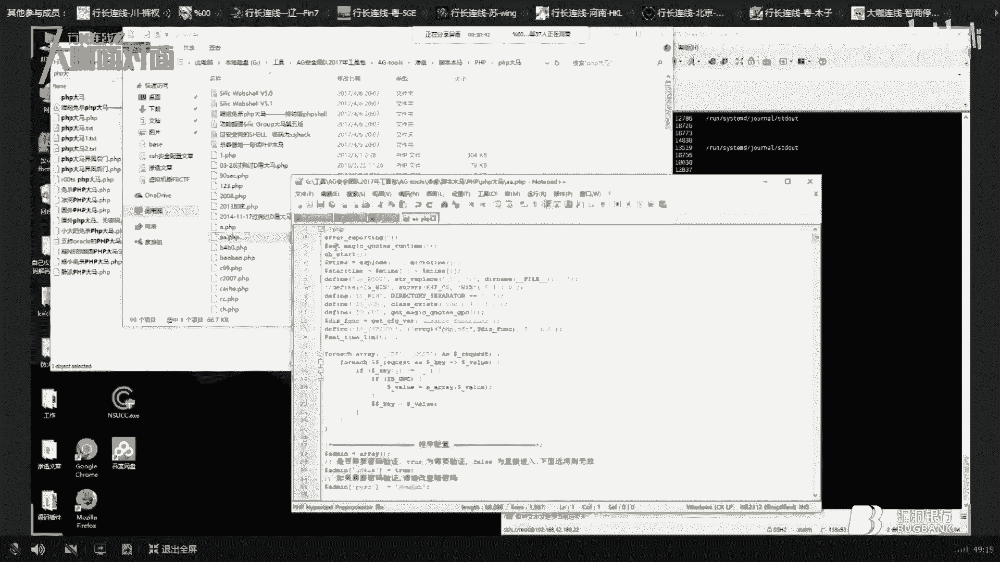

相同的過程同樣認證，相同的過程同樣認證，相同的過程同樣認證，相同的過程同樣認證，相同的過程同樣認證，相同的過程同樣認證，相同的過程同樣認證，相同的過程同樣認證，相同的過程同樣認證，相同的過程同樣認證。

相同的過程同樣認證，相同的過程同樣認證。

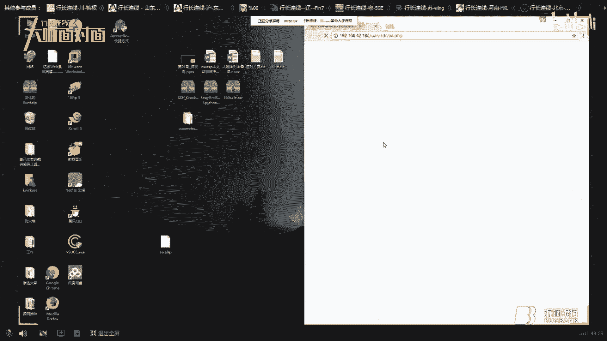

相同的過程同樣認證，相同的過程同樣認證，相同的過程同樣認證，相同的過程同樣認證，相同的過程同樣認證，相同的過程同樣認證，相同的過程同樣認證，相同的過程同樣認證，相同的過程同樣認證，相同的過程同樣認證。

相同的過程同樣認證，相同的過程同樣認證，相同的過程同樣認證，相同的過程同樣認證，相同的過程同樣認證，相同的過程同樣認證，相同的過程同樣認證，相同的過程同樣認證，相同的過程同樣認證，相同的過程同樣認證。

相同的過程同樣認證，相同的過程同樣認證，相同的過程同樣認證，相同的過程同樣認證，相同的過程同樣認證，相同的過程同樣認證，相同的過程同樣認證，相同的過程同樣認證，相同的過程同樣認證，相同的過程同樣認證。

相同的過程同樣認證，相同的過程同樣認證，相同的過程同樣認證，相同的過程同樣認證，相同的過程同樣認證，相同的過程同樣認證，相同的過程同樣認證，相同的過程同樣認證，相同的過程同樣認證，相同的過程同樣認證。

相同的過程同樣認證，相同的過程同樣認證，相同的過程同樣認證，相同的過程同樣認證，相同的過程同樣認證，相同的過程同樣認證，相同的過程同樣認證，相同的過程同樣認證，相同的過程同樣認證，相同的過程同樣認證。

相同的過程同樣認證，相同的過程同樣認證，相同的過程同樣認證，相同的過程同樣認證，相同的過程同樣認證，相同的過程同樣認證，相同的過程同樣認證，相同的過程同樣認證。

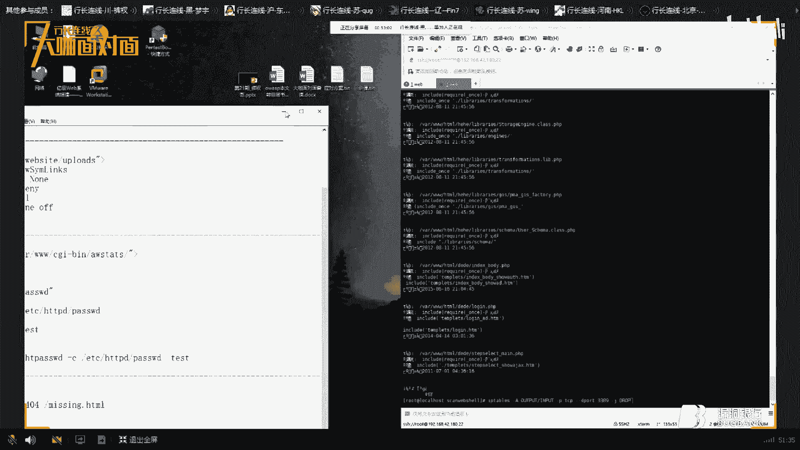

相同的過程同樣認證，相同的過程同樣認證，相同的過程同樣認證，相同的過程同樣認證，相同的過程同樣認證，相同的過程同樣認證，相同的過程同樣認證，相同的過程同樣認證，相同的過程同樣認證，相同的過程同樣認證。

相同的過程同樣認證，相同的過程同樣認證，相同的過程同樣認證，相同的過程同樣認證，相同的過程同樣認證，相同的過程同樣認證，相同的過程同樣認證，相同的過程同樣認證，相同的過程同樣認證，相同的過程同樣認證。

相同的過程同樣認證，相同的過程同樣認證，相同的過程同樣認證，相同的過程同樣認證，相同的過程同樣認證，相同的過程同樣認證，相同的過程同樣認證，相同的過程同樣認證，相同的過程同樣認證，相同的過程同樣認證。

相同的過程同樣認證，相同的過程同樣認證，相同的過程同樣認證，相同的過程同樣認證，相同的過程同樣認證，相同的過程同樣認證，相同的過程同樣認證，相同的過程同樣認證，相同的過程同樣認證，相同的過程同樣認證。

相同的過程同樣認證，相同的過程同樣認證。

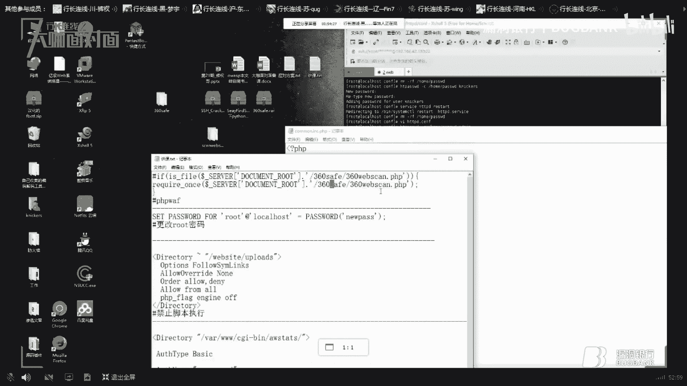

相同的過程同樣認證，相同的過程同樣認證，相同的過程同樣認證，相同的過程同樣認證，相同的過程同樣認證，相同的過程同樣認證，相同的過程同樣認證，相同的過程同樣認證，相同的過程同樣認證，相同的過程同樣認證。

相同的過程同樣認證，相同的過程同樣認證，相同的過程同樣認證，相同的過程同樣認證，相同的過程同樣認證，相同的過程同樣認證，相同的過程同樣認證，相同的過程同樣認證，相同的過程同樣認證，相同的過程同樣認證。

相同的過程同樣認證，相同的過程同樣認證，相同的過程同樣認證。

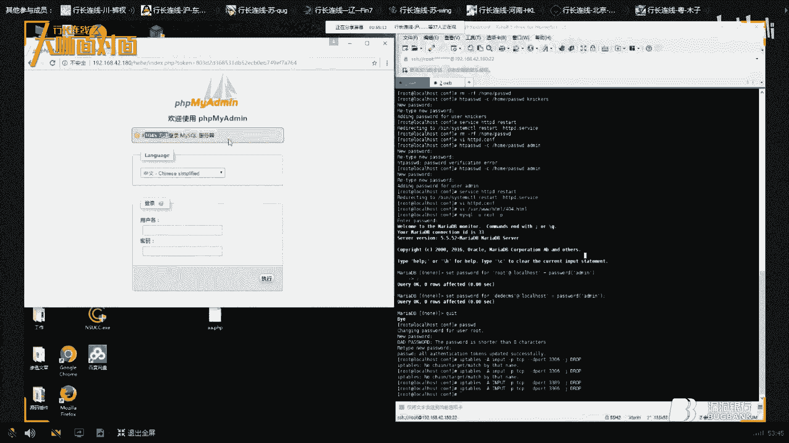

相同的過程同樣認證，相同的過程同樣認證。

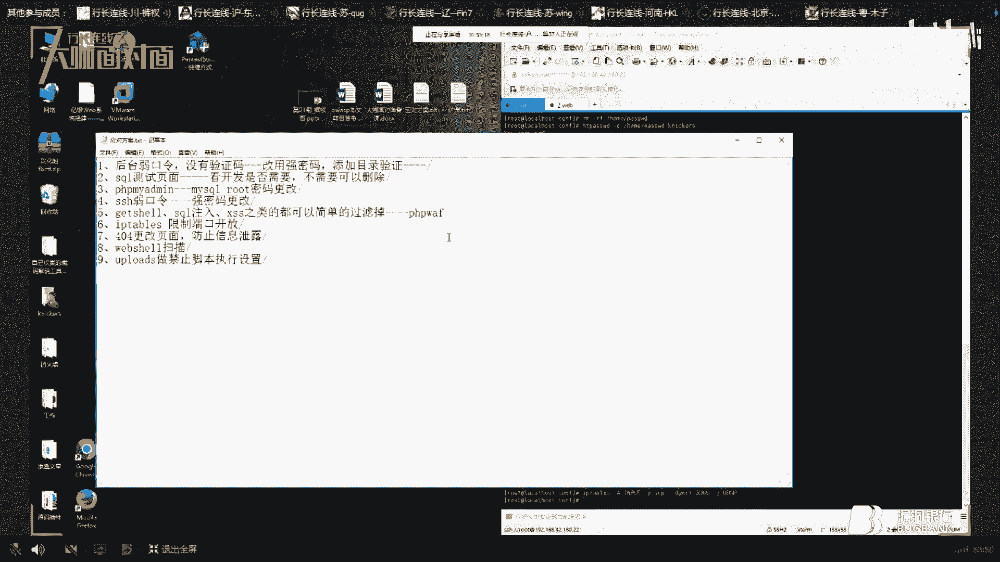

相同的過程同樣認證，相同的過程同樣認證，相同的過程同樣認證，相同的過程同樣認證，相同的過程同樣認證，相同的過程同樣認證，相同的過程同樣認證，相同的過程同樣認證，相同的過程同樣認證，相同的過程同樣認證。

相同的過程同樣認證，相同的過程同樣認證，相同的過程同樣認證，相同的過程同樣認證，相同的過程同樣認證，相同的過程同樣認證，相同的過程同樣認證，相同的過程同樣認證，相同的過程同樣認證，相同的過程同樣認證。

相同的過程同樣認證，相同的過程同樣認證，相同的過程同樣認證，相同的過程同樣認證，相同的過程同樣認證，相同的過程同樣認證，相同的過程同樣認證，相同的過程同樣認證，相同的過程同樣認證，相同的過程同樣認證。

相同的過程同樣認證，相同的過程同樣認證，相同的過程同樣認證，相同的過程同樣認證，相同的過程同樣認證，相同的過程同樣認證，相同的過程同樣認證，相同的過程同樣認證，相同的過程同樣認證，相同的過程同樣認證。

相同的過程同樣認證，相同的過程同樣認證，相同的過程同樣認證，相同的過程同樣認證，相同的過程同樣認證，相同的過程同樣認證，相同的過程同樣認證，相同的過程同樣認證，相同的過程同樣認證，相同的過程同樣認證。

相同的過程同樣認證，相同的過程同樣認證，相同的過程同樣認證，相同的過程同樣認證，相同的過程同樣認證，相同的過程同樣認證，相同的過程同樣認證，相同的過程同樣認證，相同的過程同樣認證，相同的過程同樣認證。

相同的過程同樣認證，相同的過程同樣認證，相同的過程同樣認證，相同的過程同樣認證，相同的過程同樣認證，相同的過程同樣認證，相同的過程同樣認證，相同的過程同樣認證，相同的過程同樣認證，相同的過程同樣認證。

相同的過程同樣認證，相同的過程同樣認證，相同的過程同樣認證，相同的過程同樣認證，相同的過程同樣認證，相同的過程同樣認證，相同的過程同樣認證，相同的過程同樣認證，相同的過程同樣認證，相同的過程同樣認證。

相同的過程同樣認證，相同的過程同樣認證，相同的過程同樣認證，相同的過程同樣認證，相同的過程同樣認證，相同的過程同樣認證，相同的過程同樣認證，相同的過程同樣認證，相同的過程同樣認證，相同的過程同樣認證。

相同的過程同樣認證，相同的過程同樣認證，相同的過程同樣認證，相同的過程同樣認證，相同的過程同樣認證，相同的過程同樣認證，相同的過程同樣認證，相同的過程同樣認證，相同的過程同樣認證，相同的過程同樣認證。

相同的過程同樣認證，相同的過程同樣認證，相同的過程同樣認證，相同的過程同樣認證，相同的過程同樣認證，相同的過程同樣認證，相同的過程同樣認證，相同的過程同樣認證，相同的過程同樣認證，相同的過程同樣認證。

相同的過程同樣認證，相同的過程同樣認證，相同的過程同樣認證，相同的過程同樣認證，相同的過程同樣認證，相同的過程同樣認證，相同的過程同樣認證，相同的過程同樣認證，相同的過程同樣認證，相同的過程同樣認證。

相同的過程同樣認證，相同的過程同樣認證，相同的過程同樣認證，相同的過程同樣認證，相同的過程同樣認證，相同的過程同樣認證，相同的過程同樣認證，相同的過程同樣認證，相同的過程同樣認證，相同的過程同樣認證。

相同的過程同樣認證，相同的過程同樣認證，相同的過程同樣認證，相同的過程同樣認證，相同的過程同樣認證，相同的過程同樣認證，相同的過程同樣認證，相同的過程同樣認證，相同的過程同樣認證，相同的過程同樣認證。

相同的過程同樣認證，相同的過程同樣認證，相同的過程同樣認證，相同的過程同樣認證，相同的過程同樣認證，相同的過程同樣認證，相同的過程同樣認證，然後你看看，對還有環境面量的問題，試試到這個文件。

這是你環境面量的問題，這是你環境面量的問題，這個環境面量你看一下，這個PenTestBox目錄下，有一個，有個Config的一個目錄，然後它裡面有個Allen。cs，有沒有，你看這個文件有沒有。

這個我是在法師的官網上，這個文件你有沒有，對對對，右鍵打開一下編輯一下，搜索輸入CircleMap，什麼那個剛才是不是，群裡有人問Centralize可能，外網反應不了然後可以Pin出去。

不能Pin進來，試試關閉一下IPTables，這個是應該沒有問題的，兩邊都關了兩邊都能Pin通，然後你再，看一下Apache能不能，重啟一下Restart一下，翻頁，然後，關於那個PenTestBox。

關於那個PenTestBox，既然是Win10的話，右鍵用管理員前線打開，右鍵用管理員前線打開，試試，應該是沒有問題的，通過強管了，對對對我看到了，看到了，不對不對，這樣你重啟你試試重啟一下。

等於硬硬的確實，它的系統不清楚是怎麼回事，你試一下管理員前線，使用管理員前線打開，右鍵管理員前線打開，右鍵管理員前線打開，也沒有用是嗎，我之前也有這個，但是我是管理員前線打開就行了，這個就不太清楚了。

PenTestBox，完全這樣，對應沒有問題，我一直都是在用Win10，不然的話，你試試，大佬有錢還是買台電腦算了，不用心急嘛，重啟後還是進不去，你主機是什麼呢，主機是Mac OS，主機是Mac OS。

是嗎，如果說你還是沒有訪問好的話，你不配置沒有配置好，Coolant Rebuild，鯉魚鳴沒有訪問，蛇是本機的嗎，沒有訪問，這種東西盡量是看報錯，去看一下報錯，然後反正查一下原因，比我想像的快很多。

D-box怎麼防禦，這個東西，你要是集群的話，集群打你，真的是不好防禦，頂多就是說，隨便，對防網線，防網線的話，關鍵是CD，安全狗的話作用不是很大，頂多是防CC，通過軟件來，獲取什麼，防地道膠粉。

安全狗效果不是很啥，最好的現在的防線還是加個CD，主要就是CD，他打你的話頂多是打個各個節點，還存活的話，網站還是能進行，你的服務器還是沒有問題的，起碼他打不到你本機上，或者說你可以，多做幾個，如果說。

再就是買硬房，買硬房防火牆，防火牆好一些，保證打不死的是6萬一年，6萬一個月，這個東西，然後如果說，這些東西CDN不足的話，還是CDN，相對來說好一些，防不住的，那是從，那個，那個叫什麼來的。

從內核修改，但是這個的話，限制你每次連接的防禦，流量大的話，我之前，我之前做過一次，做過一次安全，然後就是，按照那個防DDoS，也是你電腦設置的，不是防SVN吧，然後，80個G的流量，然後。

我那是CNR的服務器，不是雲主機，是服務器，對，所以說這種東西，想解決的話，沒什麼太好的解決方式，一個就是硬房防火牆，然後，再一個就是，但是，然後，我那個帶寬還是大的，10兆的，然後3個IP。

最後把我服務器打當機了，加固TCP/IP協議這種東西，我還能把這個Ignite Swap base 內核上來進行優化，我暫時我對這個優化的話只是說能，能優化併發連接。

像這種防DDoS的話我還不是很很研究，我現在我現在學的方向就是說Linux安全預唯，還有一個就是安全設備或一些畫布或者墻這方面的，有沒有對Linux安全預唯這方面，我幾句即興話也沒感興趣的。

冒險啊就這麼簡單吧，行吧主持，有底來，好由於時間問題呢，今天的行長問答環節就先告一個段落，如果還有疑問的小夥伴可以等講座結束之後，跟大咖一起繼續交流關於Linux之類的問題。

那我們就先進入今天的行長贈書環節，今天呢我們的大咖庫查哥為群內的小夥伴挑選了，跟老男孩選Linux運唯web集群實戰這本書，那只有認真聽講的小夥伴才有機會得到它。

接下來就有請庫查哥在剛剛所有參與交流互動的小夥伴裡，選擇一位你認為今晚聽課最認真跟你互動最積極的小夥伴，然後可以在心裡@一下他，西瓜吧，好的，西瓜你可以冒一下炮，那恭喜西瓜成為今天的新女兒。

你將獲得由漏洞銀行代表本期庫查哥大咖，為你送出的跟老男孩學Linux運唯web集群實戰這本書，一會活動結束之後我們會聯繫你，那關於送出環節後續的結果。

我們會在後期官方發佈的本期大咖面對面的推文當中公示給大家，那可以通過我們的微信公眾號或者是官方微博了解後續的詳情，沒有抽中的小夥伴也不要感到遺憾，今後我們可以多多關注漏洞銀行官方群的各種活動。

那今天晚上大咖面對面，視頻直播就到此結束，那大家如果對今晚收獎內容還有疑問，可以繼續在群裡和大咖進行交流，再次感謝大咖庫查哥的親情分享，我們下期再見，(音樂)。

