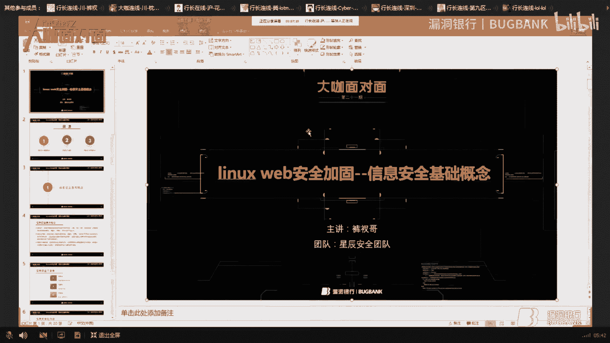
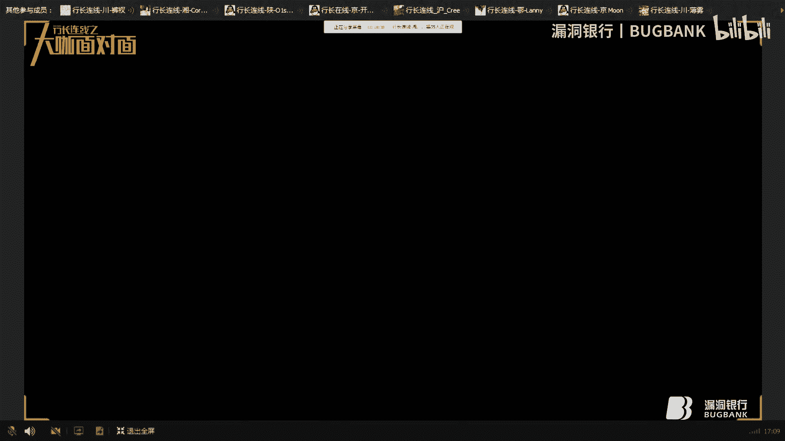
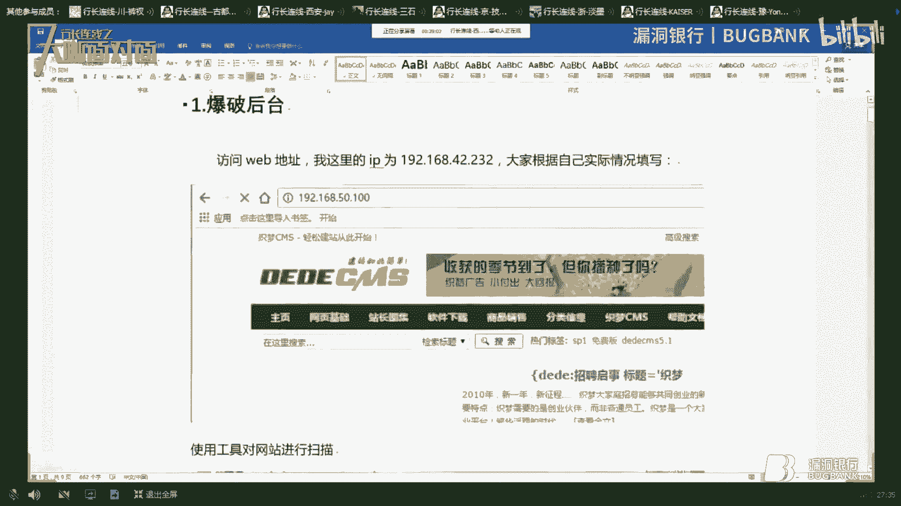
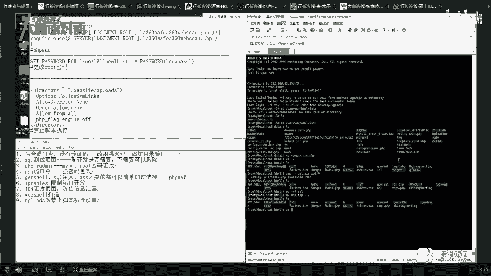
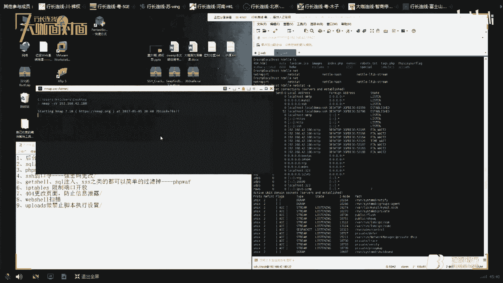
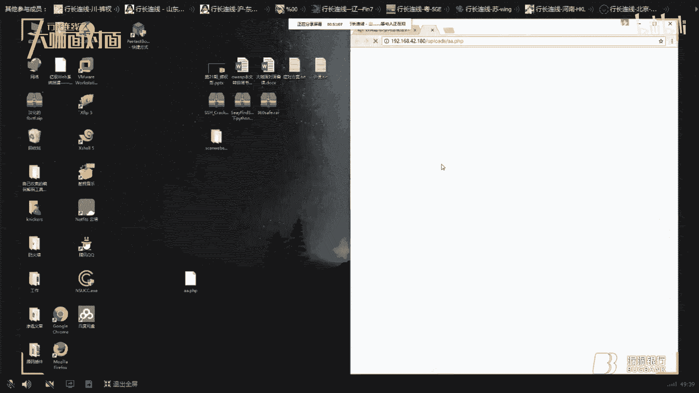
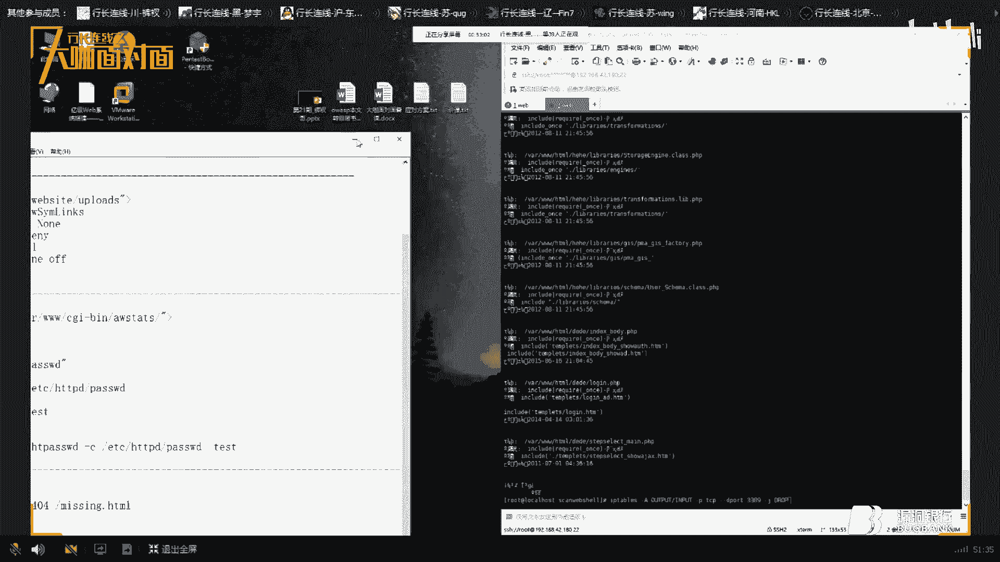

# 课程 P1：Linux Web安全加固基础概念 🔒

在本节课中，我们将要学习Linux Web安全加固的基础概念。课程内容主要围绕信息安全的基本定义、核心要素以及一个重要的安全评估模型展开，旨在为初学者构建一个清晰的安全知识框架。

## 概述：什么是信息安全？🛡️

信息安全是指信息和信息系统不被未经授权的访问、使用、泄露、中断、修改或破坏，其目标是保障信息系统的**保密性**、**完整性**、**可用性**和**可控性**。

信息安全保障是一个动态的防御过程，它要求我们不仅要加强对信息和系统的保护，还要提升对安全事件的检测能力、应急响应能力以及系统恢复能力。

## 信息安全三要素 🔑

信息安全建立在三个核心要素之上，它们共同构成了安全的基础。

以下是信息安全的三要素：

*   **保密性**：确保信息不被未经授权的用户、实体或进程访问。其核心是防止信息泄露。
*   **完整性**：确保信息在存储或传输过程中不被未授权的用户篡改或破坏，保持信息的准确和统一。
*   **可用性**：确保授权用户或实体在需要时可以正常访问和使用信息及系统资源。如果系统不可用，那么安全也就失去了意义。

## PDR安全模型 ⏱️➡️🛑

上一节我们介绍了信息安全的目标和要素，本节中我们来看看一个用于评估系统安全性的经典模型——PDR模型。

PDR模型包含三个关键的时间参数，用于量化评估安全防护的有效性。

以下是PDR模型的三个核心时间参数：

*   **Pt**：防护时间。指系统依靠自身防御措施能够阻挡入侵者攻击的时间。
*   **Dt**：检测时间。指从入侵发生到系统检测到该入侵行为所花费的时间。
*   **Rt**：响应时间。指从检测到入侵开始，到系统做出有效响应并遏制威胁所花费的时间。

一个系统被认为是安全的，需要满足一个核心不等式：**Pt > Dt + Rt**。

这个公式的含义是：系统的防护时间必须大于入侵者突破防护所需的时间（约等于检测时间加响应时间）。如果防护时间足够长，能够在被突破前完成检测和响应，那么系统就是相对安全的。

## 防火墙技术基础 🧱

在了解了安全模型后，我们来看一种具体的安全技术——防火墙。它是位于内部网络和外部网络（如互联网）之间的关键安全设备。

防火墙的主要工作原理是，根据预设的安全策略（如白名单、黑名单规则），对流经它的网络数据包进行过滤和检查。只有符合规则的数据才被允许通过。

以下是防火墙的几个主要功能：

*   **访问控制**：控制外部网络对内部服务的访问，阻挡恶意流量和攻击。
*   **网络隔离与隐藏**：隐藏内部网络拓扑细节，防止外部攻击者探测内网信息。
*   **审计与监控**：对网络访问和存取操作进行记录和统计，便于事后分析和追踪。
*   **支持VPN**：提供加密通信功能，保障内部网络通信在公网传输时的安全性。

## 总结 📝

本节课中我们一起学习了Linux Web安全加固的入门知识。我们首先明确了信息安全的定义和四大目标（保密性、完整性、可用性、可控性），然后深入探讨了构成信息安全的三个基本要素。接着，我们介绍了用于评估系统安全性的PDR模型及其核心公式 **Pt > Dt + Rt**。最后，我们简要了解了防火墙作为基础安全设备的工作原理和主要功能。这些概念是后续深入学习具体安全加固技术的重要基石。