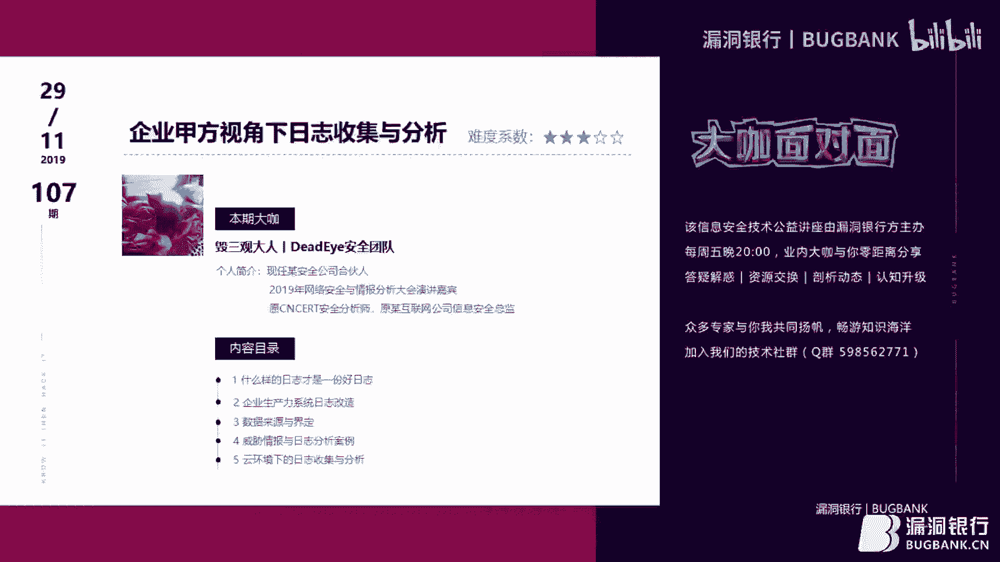

# 课程 P1：企业甲方视角下的日志收集与分析 📊

在本节课中，我们将从企业甲方（即防守方）的视角出发，全方位学习日志的辨别、设计、收集、分析与改造。课程内容涵盖从基础概念到实战案例，旨在帮助初学者构建系统性的日志分析知识体系。

---

## 概述

日志是安全运营的基石。本节课将系统性地讲解如何定义一份“好”日志，如何规划和收集关键数据源，以及如何利用日志进行有效的威胁分析和事件响应。我们还将探讨在云环境下进行日志收集与分析所面临的特殊挑战。

---

## 一、 什么样的日志才是一份好日志？🔍

上一节我们概述了课程目标，本节中我们来看看评估日志质量的核心标准。一份易于分析、能有效支持安全调查的日志，通常具备清晰的结构和关键的元数据。

### 1. 常见的日志格式
日志格式决定了其可读性和可分析性。以下是几种常见的格式：

*   **字符串分割格式**：使用固定分隔符（如逗号、空格、竖线）来分割字段。例如：`192.168.1.1 - admin [10/Oct/2023:14:30:01] "GET /index.html HTTP/1.1" 200`。这种格式常见但解析时容易出错。
*   **二进制格式**：如Linux系统的 `/var/log/wtmp`（`last`命令读取的登录日志）或Windows事件日志的一部分。这类日志需要特定的工具或脚本才能解析。
*   **键值对格式**：格式为 `key=value`，例如 `user=admin ip=192.168.1.1 action=login`。这种格式结构清晰，易于解析和查询，是推荐的格式之一。
*   **JSON格式**：结构化的数据格式，例如 `{"user": "admin", "ip": "192.168.1.1", "action": "login"}`。易于程序解析，但存储体积相对较大。

### 2. 日志格式的“时代”划分
根据可读性和结构化程度，可以形象地将日志格式分为三个“时代”：

*   **石器时代**：格式随意，分隔符混乱，解析困难。例如使用中括号、竖线、冒号等多种符号混合分割。
*   **青铜器时代**：开始出现部分结构，如将时间戳放在开头，后续使用冒号或等号分割，但格式仍不统一，有时包含引号有时不包含。
*   **帝国时代**：采用统一的键值对格式，所有字段都清晰定义为 `key=value`。这是最易于自动化处理的格式。

### 3. 日志分析中的关键挑战：时间戳
时间是日志分析中最重要的维度之一，时间戳问题常常导致分析失败。

*   **时钟不同步**：网络设备、服务器、应用程序的时钟未同步，或未启用NTP服务，导致时间存在误差。
*   **时区混乱**：自研程序可能使用错误的时区（如UTC、东京时间）记录日志，与系统时间不一致。
*   **精度不一**：有的时间戳精确到毫秒/纳秒，有的只到秒或分钟，在关联分析时造成困难。

### 4. 低效的日志分析方法
传统使用Linux命令（如 `grep`, `awk`, `sed`）进行日志分析的方式存在明显弊端：

*   **效率低下**：面对海量数据时，命令行操作速度慢。
*   **不可复制**：复杂的管道命令难以记录、复用和交接。
*   **无法闭环**：难以形成标准化的调查流程和可审计的报告。

---

## 二、 企业生产力日志改造 🛠️

上一节我们了解了理想日志的特征和常见问题，本节我们将探讨如何主动改造日志，使其更符合安全分析的需求。核心目标是将**不可关联的日志**转化为**可关联的日志**。

### 1. 日志加工的标准化流程
一个完整的日志处理流程应包含以下步骤：

1.  **提取日志**：从源头收集原始日志数据。
2.  **分割日志**：将日志文本解析成结构化的字段，识别出键和值。
3.  **日志重组**：通过关联其他数据源（如CMDB、HR系统），为日志字段补充上下文信息。例如，将IP地址关联到具体员工或资产。
4.  **结构化查询**：使用类SQL的查询语言（如Splunk的SPL、Elasticsearch的DSL）进行高效、可复制的搜索分析，替代复杂的管道命令。

### 2. 引入SOAR理念
SOAR代表安全编排、自动化与响应。其核心思想是将分析流程自动化：

*   **自动化数据丰富**：分析时，系统自动将IP关联威胁情报、域名、资产信息等，将原始数据转化为带有上下文的情报。
*   **流程化搜索**：将调查步骤固化、自动化，每次搜索的结果都可记录和追踪，提升分析效率和一致性。

### 3. 日志存储与通用模型
以下是关于日志存储和格式的建议：

*   **采用通用模型**：建议参考Splunk的通用信息模型或MITRE ATT&CK框架，定义关键字段，使不同来源的日志能基于同一套“语言”进行关联分析。
*   **权衡日志格式**：`JSON`格式对开发友好，但体积较大；`key=value`格式体积小，解析快。可根据存储成本和研发配合度选择。
*   **云存储方案**：在云环境下，可以利用对象存储服务来存放日志，如AWS S3、阿里云OSS、腾讯云COS等。

---

## 三、 数据来源的界定：收集什么？🎯

上一节我们讨论了如何加工日志，本节我们解决一个更前置的问题：在企业中，我们究竟应该收集哪些数据？没有明确的目标，就无法进行有效的收集和分析。

### 1. 以员工动作为视角梳理数据流
想象一名员工从上班到下班可能产生的数据轨迹，这有助于识别关键数据源：

1.  门禁刷卡记录
2.  连接公司Wi-Fi的记录
3.  办公网网络流量日志
4.  内部通讯软件（如企业微信、钉钉）的审计日志
5.  访问互联网的代理日志
6.  开发IDE的操作与代码提交日志
7.  服务器/应用系统的登录与操作日志
8.  企业打车软件记录
9.  VPN拨入日志

### 2. 关键数据源分类
企业需要关注的数据源可分为两大类：

*   **自建/自购系统**：
    *   服务器（系统日志、应用日志）
    *   网络设备（防火墙、WAF、VPN日志）
    *   内部系统（GitLab、NAS、OA、HR、财务、BI系统）
    *   认证系统（如LDAP/AD域）
*   **云/SaaS服务**：
    *   云主机操作日志（如AWS CloudTrail、阿里云ActionTrail）
    *   云存储访问日志（如S3、OSS）
    *   云数据库日志（如RDS）
    *   云VPC流日志
    *   企业SaaS账号（如邮箱、支付平台）的登录与操作日志

### 3. 容易被忽略但至关重要的数据
除了传统安全设备日志，以下数据对深度分析极为重要：

*   **CMDB数据**：记录IP、端口、服务、负责人等资产信息。能快速定位资产归属，是IP关联到人的基础。
*   **HR人力数据**：包括入职、离职、调岗信息。
    *   **入职初期**和**离职前期**是数据窃取的高风险期，可作为风险评分指标。
    *   离职员工账号未及时禁用是常见攻击入口。
*   **业务与行为数据**：如打车记录、消费记录等，在特定调查场景下可作为辅助判断依据。

### 4. 需要改造的常见日志示例
许多系统默认日志缺乏关键信息，需要进行改造：

*   **Apache/Nginx访问日志**：添加 `X-Forwarded-For` 字段以获取真实用户IP。
*   **Confluence/Wiki日志**：改造以记录操作用户身份，而非仅IP。
*   **GitLab Web日志**：改造以关联Web操作与具体用户。
*   **VPN日志**：确保能准确将连接IP/会话关联到具体员工账号。

---

## 四、 威胁情报与日志分析案例 🕵️♂️

上一节我们明确了要收集的数据，本节我们学习如何利用这些数据，结合威胁情报进行实战分析。核心是将抽象的IOC与具体的日志字段关联起来。

### 1. 重新认识IOC
IOC不只是一个IP或域名。它是一个具有**可信度**和**时效性**的入侵指标。例如，一个被标记为C2服务器的IP，其威胁可信度远高于一个普通的恶意IP。

### 2. 基于攻击链的分析思路
参考攻击链模型（如网络杀伤链或ATT&CK框架），在每个阶段寻找对应的日志证据：

*   **侦察阶段**：分析Web日志中的 `Referer` 字段，发现攻击者使用 `Google Hacking` (`site:xxx.com login`) 搜索后台地址的行为。
*   **武器化/投递阶段**：检测邮件网关日志中的恶意附件哈希值或可疑发件人。
*   **漏洞利用/安装阶段**：分析服务器日志中的Webshell访问记录、异常进程创建或敏感函数调用。
*   **命令与控制**：利用威胁情报，在DNS查询日志或网络流量日志中匹配已知的C2域名或IP。
*   **横向移动**：分析内网认证日志（如Kerberos）中的异常票据请求、或流量日志中的端口扫描行为。
*   **数据渗出**：监控云存储或NAS的大文件异常下载行为，特别是发生时间、来源地点是否异常。

### 3. 字段命中与强弱关系判断
分析的本质是在日志字段中命中IOC，并根据命中情况判断事件严重性。

*   **可命中的字段类型**：
    *   **哈希命中**：文件MD5/SHA1与恶意软件库匹配。
    *   **IP/域名命中**：连接地址出现在威胁情报的C2或恶意域名列表中。
    *   **行为命中**：执行了 `mimikatz`、`nmap` 等黑客工具，或访问了特定路径（如 `/etc/shadow`）。
    *   **函数命中**：Web日志中出现 `eval()`、`system()` 等危险函数调用。
*   **强弱关系分析**：
    *   **弱关系（疑似）**：单个可疑行为，如境外IP登录。需要进一步调查。
    *   **强关系（确信）**：多个IOC叠加或出现确凿证据，如内网中捕获到 `Mimikatz` 的进程创建日志，或发现已知Webshell的HTTP请求。

### 4. 案例分析：异常外联检测
当发现内网一台主机向可疑IP发起连接时，可以按以下思路自动化分析：

1.  **检查目标IP**：查询威胁情报，是否为已知C2？`whois`信息是否可疑？
2.  **检查源IP**：
    *   关联CMDB，这是台什么服务器？谁负责？
    *   关联VPN/认证日志，当前是谁在登录这台服务器？
    *   检查该服务器进程列表，是否有可疑进程（如 `python.1.py`）发起连接？
3.  **检查行为上下文**：该用户/服务器在此之前还进行了哪些操作？是否有登录失败、文件访问等异常？
4.  **综合判断**：结合以上信息，判断是误报、内部人员违规还是真实入侵。

---

## 五、 云环境下的日志收集分析 ☁️

上一节我们探讨了传统环境下的分析案例，本节我们聚焦于云环境。云平台改变了基础设施的形态，也给日志收集与分析带来了新的挑战和机遇。

### 1. 云环境带来的挑战
*   **数据不可见**：传统机房的网络镜像、串接设备部署方式在云上难以实现，导致东西向流量不可见。
*   **日志所有权**：云平台管理的组件（如负载均衡、数据库）日志，需要主动开启并配置才能获取。
*   **多云差异**：不同云厂商（AWS、阿里云、Azure）的同类服务，其日志格式、获取方式、命名规则各不相同。

### 2. 必须收集的关键云日志
云平台提供了丰富的API和日志服务，以下日志对安全至关重要：

*   **操作审计日志**：
    *   **AWS CloudTrail** / **阿里云 ActionTrail** / **Azure Activity Log**
    *   记录所有通过控制台、API、CLI对云资源进行的操作。**这是云上最重要的日志**，用于追溯任何配置变更、资源创建删除等行为。
*   **网络流日志**：
    *   **VPC Flow Logs** / **阿里云 流日志**
    *   记录VPC内网络流量的元数据（五元组）。用于替代传统网络流量分析，检测异常连接和扫描。
*   **对象存储访问日志**：
    *   **S3 Access Logs** / **OSS 访问日志**
    *   记录谁在何时访问了存储桶中的哪个对象。用于检测数据泄露和异常下载。
*   **云主机日志**：通过安装Agent，收集云服务器内部的系统日志、应用日志和安全日志。

### 3. 云环境特有的安全关注点
*   **访问密钥泄露**：AK/SK或API Key的泄露等同于账号泄露。需监控操作日志中异常地域的API调用、大量资源创建、数据打包导出等行为。
*   **公开访问风险**：定期梳理所有对公网开放的IP和端口（EIP、负载均衡、NAT网关、数据库公网地址），确保最小化暴露面。
*   **不当的存储桶配置**：云存储桶被错误配置为“公开可读”，导致数据泄露。需结合配置检查与访问日志进行分析。
*   **多云统一管理**：当企业使用多个云平台时，需要建立统一的日志收集和分析平台，以标准化处理不同格式的日志。

### 4. 学习资源与规则
“熟读唐诗三百首，不会作诗也会吟”。安全分析需要积累经验和规则：

*   **ATT&CK框架**：学习攻击者的战术、技术和过程，将其转化为检测规则。
*   **Snort/Suricata规则**：学习开源IDS的规则语法和思路。
*   **YARA规则**：学习文件与内存特征检测的规则。
*   **开源情报**：关注安全社区分享的IOC、分析报告和检测规则。

---

## 总结

本节课中，我们一起学习了企业甲方视角下日志收集与分析的全流程：

1.  **定义好日志**：追求结构清晰、时间准确、易于解析的格式（如键值对）。
2.  **主动改造日志**：通过标准化流程和SOAR理念，将原始数据转化为富含上下文、可关联分析的情报。
3.  **界定数据源**：从员工行为视角和系统分类出发，明确需要收集的关键日志，特别是CMDB、HR等上下文数据。
4.  **实战分析**：结合威胁情报和攻击链模型，在日志字段中命中IOC，通过强弱关系判断进行事件调查。
5.  **应对云挑战**：识别云环境下的关键日志（操作审计、流日志），并关注AK/SK泄露、不当配置等特有风险。

日志分析不仅是技术，更是艺术。它需要分析人员具备发散的思维、严谨的逻辑和对业务环境的深刻理解。希望本课程能为你打开日志分析世界的大门。