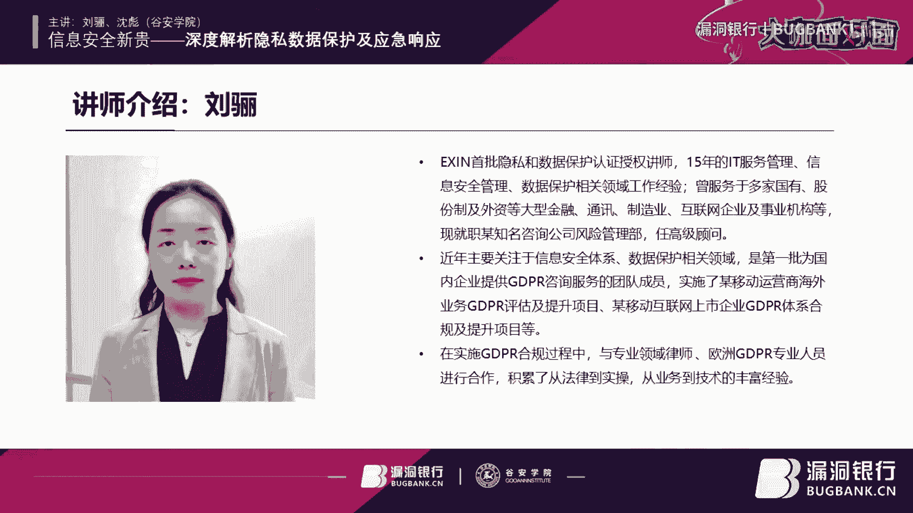

# P1：【录屏】信息安全新贵-深度解析隐私数据保护及应急响应-大咖刘骊、沈彪-漏洞银行大咖面对面第90期 - 漏洞银行BUGBANK - BV1J441177fX

为知识而成因技手而生小朋友晚上好。那欢迎参加今天的第97漏洞银行安全技术直播大咖面对面，我是陈秋秋。那今晚我们会有两个议题的分享。

分别是关于GDP啊通用数据保护条例及INPO认证体系和CSPE注册应急响应程师认证的内容。那并且会有两位对认证和有着丰富经验的老师来为我们进行专业解读。在每位老师的讲解后。

我们各有10到15钟的问答环节，老师会对大家提问进行解答。那在直播尾生，我还会给大家送出古安学院特别提供的三重直播福利供大家来领取。那今天首先为我们来分享的是安学院的刘利老师。

他会我们来讲解GDPR与XIN认证体系。那这里简单介绍一下刘老师。嗯，他是IN首批隐私和数据保护认证授权讲师有15年的IT服务管理信息安全管理数据保护相关领域工作经验。

他今年来主要关注信息安全体系数据保护相关领域是第一批。第一为国内企业提供GDPR询咨询服务的团队成员。那通过多次重大公司项目经历，刘老师也积累了丰富的从法律到实操，从业务到技术的经验。所以说了这么多。

大家肯定迫不及待想要听刘老师的分享了吧。那下面我们就请刘老师登场。嗯，各位朋友大家好，我是琉璃，大家叫我mry就好。我还是比较喜欢叫我mry，感觉更直接更亲切一些。嗯。

很高兴有这个时间来跟大家来聊一聊关于个人数据保护的一话题。

嗯，关于个人数据保护，可能每个人在生活中都有很多的呃遇到很多的经经历和一些案例。嗯，那么我个人以前呢是从事IT服务管理和新安全相关的工作。还有有时呃业务这个业务连续性相关的工作。最近几年。

随着GDPR的出版和生效。呃，工作中心呢转向了个人数据保护这个领域。啊，在这个领域确实是从个人经验也好，还是呃个人生活中呃的经验也好，还是从工作中。

还是从这个各个企业我们面对的这个客户面对的各种呃需求合规需求和业务压力来说，这个个人数据保护都是一个呃最近几年一个很热门，很受关注的一个话题。呃，那么在这个过程中，我自己也有很多的呃体会。

得到了很多的启发。在这儿呢我也很愿意跟大家分享一下。呃，首先我们都知道GDPR是欧盟发布的一个关于个人数据保护的法律。

那么为什么他在中国也会受到如此的重视呢？嗯，我们先举一个例子，前几天嗯微信朋友圈里边有一个呃事情大家可能都会看到，就就是我们的法学的一个博士。他起诉了抖音和多闪这个APP。因为他在刷这个抖音的时候。

把他的前女友刷出来了。啊，这个呢让他觉得非常的不爽，变成了不愉快。那么在这儿呢就引出了一个话题，嗯，到底什么是隐私，到底什么是个人数据保护？呃，隐私在GDPR的这个定义中呢，它其实是自然人的一个权利。

什么样的权利呢？它是我们每一个自然人不受打扰的一个权利。也就我们的日常生活，个人生活，以及我们的家人，能够不受打扰的这样的一个权利。嗯，那么个人数据保护呢是保证我们这个隐私权利的一个手段跟方法。嗯。

把这两个概念稍微区分开一些呢，我们就能知道我们每个人有什么样的权利。我们通过什么样的途径来保护我们的这个权利。那么GDPR呢其实就是为了通过个人数据保护来保护我们每个人的这隐私这项权利的一个法律法规。

那么我们先来看一下啊GDPR到底是什么。然后再来说一说为什么GDPR在我们中国也会这么受重视。嗯，GDPR是12016年4月份正式发布的一个呃通用数据保护条例。呃，这个数据保护呢。

这个数据是在这里是专指个人数据。嗯，是呃在这注意我GDPR中的数据就是指个人数据，它不涉及什么国家安全呀、企业商业信息呀，这些数据，就是针针对于我们每一个自然人的一个数据保护的条例。呃。

2018年5月25日呢，这个法律呢在经过了两年的准备期之后正式生效啊，成为了影响全球数据保护最大的一个法律法规。也就是从2018年5月25号之后。

我们可能也陆陆续续听到了很多关于GDPR的一些罚款的一这些新闻。嗯，包括前段时间有一项法国的这个CNIL这个机构对谷歌开出了一张5000万欧元的一个大罚单。嗯。

那么我们都人可能经常会听说GDPR呢是目前要史上最严格的一个个人数据法律呃，个人数据保护的一个法律。呃，我个人认为呢说他严格呃可能不是特别的确切。嗯，可能从他的罚款金额上限上来说。

他能开出一个全球营业额4%或者是2000万欧元这样的一个上限的这样的一个非常高昂的罚款上限。嗯，但并不表示说GDPR它就是以这个罚款为目的，然后通过罚款来威慑大家的这样的一个法律。

他GDPR的主要目的还是为了告诫惩戒我们的各个组织对个人数据保护的一些相关的工作。嗯，所以呢罚款不是他的目的，罚款只是他的一个手段之一。嗯，那么我认为说他是目前要求最全面的一个个人数据保护法律会更。

确切一些，这也是为什么全球各个国家都以GDPR来作为一个参考和呃标准来纷纷跟进来制定自己国家的关于个人数据保护的一些立法和一些标准以及一些相关的规范。另外有还有很还有很多国家呢也以这个还有很多企业。

也以这个GDPR作为一个对标。来这个完成自己企业内部的个人数据保护相关的这个合规的一些工作。包括我们国家也是在2018年出呃实施了个人信息的安全规范，也就是国标的35273。另外今年的话呢。

他也他也在刚刚这个安全规范刚刚出版了一年之后就做了一个更新与改版。可见我们国家对个人数据的这个保护的重视程度也是很高的。并且在这个过程中也是不断的摸索跟探索中的。嗯，关于。那么个人数据保护的这个话题呢。

并不是说呃这几年刚刚提起来的一个新的话题。那实际上在欧洲在二战之后的1957年的罗马条约中，就约定了这样一条，就是说每个人都有权利来保护他们的个人数据。嗯，二战之后的话。

可能是因为嗯欧洲那个时候刚刚经历了这种二次大战的洗礼，特别是经经历了这个嗯。嗯，纳粹纳粹对这个呃纳粹的这些呃对这个呃呃以色列人的这个迫害之后，他们的深深感觉到了自己的这种个人的种族信息呀。

个人的这种很多生活信息呢被国家掌握之后，感觉到自己的生命，感觉自己的自由受到了各种威胁。所以在二战之后，大家纷纷对这个个人数据保护，提到了一个非常高的一个一劣史程度。嗯，在1995年。

欧盟通过了一个数据保护指令，也就是我们所说的95号指令。呃，那么2016年发布了GDPR之后，呃，并且2018年5月25日呃，这个GDPR正式生效之后。

那么这个25号95号指定的也就正式的推出了历术舞台，被这个GDPR取代。嗯，在我们国家呢嗯3月份刚刚结束的这个两会之上呢，也把个人数据的保护的立法也纳入到了5年的立法规划呃规划之中。呃。

这就是关于个人数据保护欧盟的一个立法的简单一个历史，以及我们国家在这方面的一些立法和规范的制定上的一个简单的情况。嗯，我们其实GDPR的话呢都会说是它是一个欧盟的一个个人数据保护立法。

那么实际上它的呃适用范围呢是属于欧盟的经济区。那这个经济区的范围呢是包含31个国家，其中有25个国家是欧盟成员国。另外还有3个国家是冰岛、列支敦士登以及挪威。嗯。

但之所以为什么GDPR它在这个31个国家之外也引经引起这么大的波动呢？是因为GDPR它的生效范围适用范围是远远超过了这31个国家。嗯，在这里边呢有两个原则。嗯。

这是这两个原则来确定这个GDPR的适用范围。第一个范围呢是从数据处理者和数据呃控制者的这个角度，也就是从这个企业或者说这个数据的呃数据的应用者就于数据的掌握掌握数据的这个这个层面上来看。

如果这个企业或者这个人呃这个法人这个实体，它是位于欧盟，也就是它是位于这个欧洲经济区这个31个国家之内的这个实体或者是法人的话，那么它是要受到GDPR的管辖的这是第一个原则。那么从第二个原则。上来说嗯。

他是从数据主体的角度来看，也就也就是说是从自然人这角度来看的。如果这个自然人他是位于嗯这个欧盟经济区之内，不管他是不是有这个国籍有欧盟国籍的这个居民，还是他只是在这儿有一个居住权的的居民。

他只要是在这个欧盟经济区之内，然后。他接受到了来自于这个企业的服务，他的行为受到了。相关的这个产品或者企业的这个监控。那么。这个企业或者这家实体就要受到GDPR的管辖。也就是说。

如果一家企业它是面向于呃这个欧盟经济区的自然人提供产品或服务或者是进行行为监控。不管他这个行为是不是盈利的是不是挣钱的，他只要收集到这个自然人，他只要收集到这个欧盟经济区的这个自然人的数据。

并且进行处理的话，他就要受到GDPR的啊约束。从这个角度来说，全球很多很多的企业都要受到GDPR的管辖。嗯。那么我们来看。那么我刚才提到GDPR中的就关于自然人，也就关于数据主体的这个定义。

那么根据GDPR来看的话，个员数据到底是什么样的数据，然后又有什么样的数据，我们是不能收集，不能处理的呢？嗯，根据GDPR的规定，个人数据呢是指已经识别到的或者是可被识别的自然人的所有所有的信息。

那么这个自然人呢在GDPR中，他有一个呃专专门的定义，这叫做数据主体。那么这个数据主体它的所有的信息呢又简单分为两类，一类呢是直接的个人数据。比如说我们的照片，我们的指纹，我们的DNA。

他都吸信息呢都是直接绑定到我们的这些个自然人特定自然人的。那么这是我们的直接个人数据。嗯，还有一个数据呢是我们的间接个人数据，包括比如我们的手机号，我们的托牌号，我们的身份证号。

这些呢都是我们在社会生活中或者是在其他的通过其他的途径呃，绑定到我们个人每个自然人的。然后这些信息呢都会都可以唯一或者是经过组合之后能够识别到我们这些自然人。那么这些间接个人数据的话呢。

也是处于个人数据保护的范围之内的。所以我们在呃进行个人数据的这个处置的过程中的话呢，不要存这种小现金，或者是不要存这种资维。嗯，不管是直接个人数据和间接数据，间接个人数据都是在GDPI的保护范围之内。

嗯，在GDPR中呢，它也规定了几个特殊的个人数据。那么这些特殊的个人数据，我们在一般的处理过程中是禁止处理，禁止收集的。除非我们有其他的特殊原因和其他的合理合法的特殊原因来进行处理。呃，这些出数据呢。

我们看一下包含种族、民族，包含政治观点，包含宗教信哲学、信仰啊，包含工会，还有精因数据，还有我们的生物特征数据，还有我们的个人的健康数据，以及我们个人的性生国际性取向数据。嗯。

我想在这里面单独解释一下嗯，为什么工会会员身份在欧盟的GDPR中会成为一个禁止收集跟处理的数据呢？嗯，我们可能也经常听说过关于比如法国工会的这个这个大罢工。比如说呃某某一个城市，比如法国逻辑有一年。

法国一个城市，它的这个清洁工集体罢工，导致很长一段时间，法国的这个巴黎的满大街的街头全着垃圾没有人清理。还有这个德国的航空公司的这个飞行员进行罢工，嗯，导致很多的航班的呃取消。在欧盟这欧美国家呢。

工会是有很大的这种力量来代表工人进行与这个资方进行谈判，甚至是发动。啊，发动这个组织啊罢工啊，组织这个要求加薪这些活动的。所以呢这个工会会员身份呢，它是受到保护的。试想，如果您是一个HR的一个招聘人员。

如果有一个人是工会会员的话，那您还敢招聘他来做您的员工吗？您要把他招进来的话，随时他有可能会鼓动公司员工来进行罢工，或者要求加薪，对资方来说，这是一个很大的一个麻烦。所以呢工会会员身份在欧盟来说呢。

它是一个保密的一个信息。呃，另外还有一个需要跟大家聊一聊的是关于我们的生物特征数据。这个数据呢在我们中国其实是处于一种滥用的状态。嗯，我们每天上班打卡都要刷指纹，甚至还要刷脸。嗯。

甚至我们现在去银行取钱，有的银行都已经推出了这个刷脸取钱的这个功能。嗯，这些呢在GDPR的这个范围之内的话，其实都是。有点滥用的这种意味。因为生物特征数据呢它是个人的这个唯一数据。

它是处于这个严密保护的这样一个。嗯，这样的一个范围之内的。嗯，比如说包括我现在正在做的这个直播语音嗯的这个声音。嗯，如果呢嗯有人有兴趣把我的声音录下来，然后并且把它处理成了一个声纹，把我的声纹提取出来。

然后呢通过加工模拟我的声音，然后模拟出我的其他的一些声音，然后通过把这个声音，然后传达给我的家人，然后模拟模拟这个勒索的这个诈骗，这都是很大的潜在的危险因素。另外还有比如说这个面部识别特征。

也是我们的那个肖像。如果有人拿到我们的照片，嗯，在很多这个面部识别的系统中呢，这个二维照片也是可以识别出来的。他通过我的这个照片识别就可以。呃，就可以验验证我的身份，就是假冒我假冒我的身份。

可能就是取钱呀，或者是反正一些做一些其他的违法活动。所以生物特征数据的话呢，也是我们需要谨慎处理和收集的这么一个数据。嗯，关于个人数据，我我们先聊到这么多嗯。那么对于数据主体来说呃。

我们作为每一个自然人，我们有哪些权利呢？我们前面提到的隐私是我们保护我们自己的生活，以及我们的家人不受打扰的这样一个权利。那么这个权利具体到我们的个人数据保护的过程中，这些权利具体是哪些呢？

GDPR里边在这呃给我们做出了一个比较详细的呃界定。这些权利呢包含我们的知情权。也如说我们的数据被比如说被APP收集了，或者被企业被商家收集了，它用于什么目的进行了哪些处置。我们是有知情权的。

还有我们的这个数据访问。这个商家或者这个APP他收集了我们数据之后，他。做了收收了哪些数据产生了哪些分析，我们是有权利进行获取的。那么我们有同意和撤销同意的权利。

就我们可以同意授权用户或者商家或者是实体进行我们的这个个人数据，我们也可以撤销我们的同意。另外还有其他还有纠正的选择，对我们的个人信息的一个纠正。我们还有删除权也叫被遗忘权。以及还有限制处理权。

限制处理权也就是我们的这个对我们个人数据的处理的这个范围跟目的。的这个限制。那么还有一个数据可携带权。这个的话举一个例子，呃，比如说我们生病住院需要转医院。

我们需要把我们在上一家医院的病例转移到下一家医院，来以以便于这个下一家医院对我们进行继续的治疗。嗯，这是一个数据解呃转移的一个典型的一个例子。那么还有一个例子，就是我们的手机条手机号。嗯。

这个是大家争论了很多年的一个话题，就是我们有没有这个携号转网的这个服务。这个咱们国家以这件事情已经呼吁了很长时间，到现在三大运营商之间还没有把这件事情做通。啊其实这个呢就影响到了我们的数据可携带权。

然后还有拒绝权。呃，我们是有理由，我们只要有合法的理由，我们说可以拒绝实体或拒绝商家对我们的个人数据进行啊收集或者是进行处理。比如说做一些营销方面的个人用户画像啊，做一些广告推送，我们是有权利来拒绝的。

呃，GDPR为我们的个人数据呃，不是个人主体呃，自然人呢规定规定了这么一些权利。那么作为企业来讲，他又有哪些的义务跟责任来保护我们的这些呃权利呢？嗯，首先他规定了处理个人数据的这么几大原则。

首先是合法、公平、透明。嗯，合法的不用说了呃，公平透明。就是我刚才提到了啊，作为自然人，他有知情权和这个同意和促销同意的警限的权利。然后目的限制是指商家也好，啊，法律事也好。

他收集我们的这些数据进行处理，它是仅限于满足。他所明示的这些业务目的，或者是他只为了满足我们的这种某些约定或某些合同条款而收集我们的数据。超过这些目的的这些处理的话，全都是不合法的。嗯。

还有这个数据最小化。也比如说嗯呃比如说我们的APP收集我们的个人数据，它也只是在满足我们的业务处理目的的前提之下，能收集到的最小范围的这个数据。嗯，这个问题我们在APP中经常会遇到。

就是比如说我们的很多软件莫名其妙的都会收集我们的个人通讯录，然后会采集我们的这个地址也好。都是一些很不相关的一些信息，它也会收集到。那么其实这个呢就超出了这个数据最小化的这个。这个范畴。嗯。

还有关于数据的准确性、完整性与保密性。这个我们做信息安全或者做信息的工作过程中呢，也很容易理解，这就对应了我们传传统赛A这个这三个概念。那么存储限制的话呢，主要是指时间上的一个限制。

也就是说我们的数据在被收集处理的过程中，一旦我们的这个收集的目的跟这个业务功能实现完成之后，或者是我们的这个合同在这个履行结束之后，那么我们的数据就要从这个商家或者从这个APP中进行删除。

是这样的一个存储限制。嗯，企业呢嗯根据他在数据处理过程中的这个不同的决策地位，分成数据控制者和数据处理者。数据控制者呢。

他是指对我们的个人数据的处理目的以及处理方式进行决策跟决定的这个实体或者是法法人或者是自然人或者是公共机构。那么数据处理者呢，他是呃替代代表这个数据控制者进行个人数据处理的自然人或者是法人或者是机构。

嗯，这两个角色的话呢，他的权利就是他的义务跟呃责任是不同的。在GDPR中呢，他要求了数据控制者，他是承担最终的个人数据保护的这个最终责任的。他要规定约定好这个人数据保护的技术措施，组织管理措施有哪些？

他要将他的这些管理措施的约定和要求传达给他的数据处理者，并且监督他的数据处理者来满足这些要求。嗯，这是一个。这是他的一个责任，而他在这呢是他要承担这个所有的最终责任。

包括如果数据处理者啊有了这个违规违法的这个行为的话，最终的承担责任是他他是要承担这个责任的，而不是一个。而不是一个简单的转嫁，或者是嗯这个嫁祸于人的这样一个这种这种形式是这种这种想法是行不通的了。呃。

另外的话呢，GTPI中还规定了一个呃问责制。也就是说，不管是数据控制者还是数据处理者，他都要有责任来证明自己的这些数据处理的过程是合法合规的。嗯，比如说他要有相应的处理的记录。

或者他有相应的处理的合合理的这个依据来证明他的这些行为都是合法的。那么我们前面看到呃这个GDPR中对数据的控制者也好，对数据的处理者都有一些呃责任跟义务的约定。呃，那么对于企业来说呃。

在应对GDPR的合规要求的时候，会面临哪些风险跟挑战呢？嗯，首先我们刚才也提到GDPR中它有了一个很很高的一个罚款的一个最高限制。呃，这种最高罚额的话呃，最严重的罚款的话呢。

可以达到呃2000万欧元或者是全年营业额的4%这两中的最高者。刚才我们提到这个谷歌它就收到了1个5000万欧元的一个罚单。嗯，当然这个罚单最终会不会真的去呃落地。

真的会呃真的会变成嗯这种真的会让它付出5000万欧元的损失的话，这个可能还有待商榷。呃，因为谷歌它有这个有这个讨价还价或者有这个申诉的这个余地。嗯，但是至少这个数字上来说还是比较比较比较高的。嗯。

但是除了这个罚款之外呢，其实更高的这些风险是来源于我们企业的这个合规风险，包含这种市场跟客户对我们企业的这个信心跟信任程度，以及包含企业的这个生誉损失。另外呢还有这个市场的准入门槛。

以前我们中国的企业进入美国市场，或者是进入嗯欧盟的这个市场的话，我经常会遇到这种关税门槛。另外还有这种关于产品质量的门槛，或者是还有这种关于环保一些环保指标。啊，特别是还有包括一些食品方面的话。

也会有一些食品安全方面的一些指标。这样的种种门槛。那么今后的话呢，我们中国企业的话还会遇到这种信息保护跟个人数据保护方面的这个门槛。所以如果我们的企业在这方面如果没有跟上这个角步的话。

很有可能我们就连这个欧盟的市场都进不去。或者是我们进入欧盟市场之后就会受到。刚刚进入这个市场，就会受到一个一些惩罚。嗯，比如说前段时间我们有一个例子是小米，小米他在英国呃做这个市场推广的过程中。

他有一些不太合适的一些做法，然后通过这种类似于欺诈的手段嗯，引诱这些客户登录他的网站去注册的一些个人信息。嗯，那么这种情况的下呢，其实在欧盟来，可能在中国可能还属于这个法律法规的一个擦边球。嗯。

处于一个官不告名不究，或者是一个很难界定，很难认认处罚的一个边界。嗯是在欧盟国家的话呢。嗯，他非法的收集这些个人数据。进行了处理之后，就很有可能会受到欧盟的当地的监管机构的这个处罚。呃。

这个处罚还是一回事。其实另外的话就小米的这个行为，其实对。呃，中国企业整个的这个收益来说都会带来了很大的负面影响。嗯，那么为了为了避免这些风险。

我们的企业肯定要进行很多的合规上的一些嗯采取很多合规的行动。那么在这一系列的合规行动中，我们可能也会有很多的问题。比如说我们的业务是跨境的，那么我们一些数据的这个跨境过程中嗯，有什么样的要求。

我们哪些数据怎么跨境，如何跨境嗯，有什么样的安全限制？嗯，应该怎么去处理？然后包括你还有就是我们的数据，如果万一不幸发生了一些数据泄露，或者是如果我们发生了一些信息安全的一些事件之后。

我们应该怎么去处理？嗯，应该怎么去与监管机构进行积极的配合，来降低我们的损失，同时也最大限度的保护我们的用户的个人数据的这个保护。另外也最大限度的保护我们企业的声誉及一系列的要求嗯，应该怎么去做？

另外还有GDPI中，他明确提出了一个基于设计，基于默认的一个数据保护，或者说是GDPI中提出了一个关于始于设计，并且是默认的一个数据保护。那么怎么样才叫基于设计始于设计，怎么样才算是默认的数据保护呢？

呃，基于系列的问题？我们都要去考虑，并且要将它落实到我们的每一个工作流程中。嗯，另外我们还有在呃当我们在欧盟市场进行业务拓展的时候，有可能我们会在不同的国家、多个国家开展业务。

那么每一个国家它又有监管机构，难道我们每一个国家的监管机构都要去合规，都要去嗯说起手讲，都要去办一拜当地的把山头，都要去拜价茂庙门都要去接洽吗？那这个成本可能也会很高。

那么我们如何去界定我们的这个主主要的监管机构来进行这个合规，简化我们的这个合规的成本。另外我们在这个业务的开展过程中，我们怎么来评估我们的个人数据的收集过程以及这个个人数据收集处理的过程中的这个风险。

PPT列的问题的话呢，可能都是需要我们企业中的各个部门去考虑的那这不光是IT部门信息安全部门要考虑的问题，包括企业的法务部门、HR部门嗯，还有业务部门，还有市场营销部门、销售部门、各个团队都要去考虑的。

所以说个人数据保护，它其实是企业一个自上而下，从治理层面，从高管层面就应该引起重视这样的一个问题。嗯，可能今天在直播间里的大部分都是做IT的，都是信息部门的同事。嗯，我们在公司的工作中呢。

可能很多时候大部分企业的话，国内大部分企业的话，可能都会把个人数据保护的这些工作都会直接砸到我们IT部门的头上。那其实我们IT部门在做这个个人数据保护方面工作的时候呢，其实也有很多的问题。

包括我们到底收集的哪些数据，这些数据到底有什么样的，到底在我们的业务处理中是不是必要的，一定要收集的他的这个业务敏感度，这个信息的敏感度又是怎什么样子的。他应该受到什么级别的安全，什么安全级别的保护。

那么这些的问题都不是我们IT部门来。能解答的。那么另外还有就是如果一旦数据发生了泄露，或者是我们企业中遇到了这个信息安全的一些事件。那么这个后期的处置过程的话。

其实也不是我们ID部门自己来一个人自己来背锅的。它也涉及到业务部门的呃协调，配合法务部门的沟通，以及市场部门的这个舆论导向。各个部门的一个团体协作这么一个处置过程。呃，所以从这个角度来说呢。

作为一个IT人了解了GDPR了解个人数据保护这一系列的相关的知识之后，在我们与其他部门的这个沟通，个人数据保护，沟作信息安全相关话题的过程中，我们也能更加有底气，也能有理有据的跟各个部门来进行探讨。

这也是我们的一个在这儿的话，就是呃个人信息的，作为IT人的来说这样的一个优势。另外我们很多IT人的话，随着职业的发展，有可能会嗯有可能会转向数据保护、数据治理这样的一个职位。

或者是转向这个嗯信息安全的这个治理角度，这样的一个从安全管理的一个角度转向一个业务治理和这个业安全治理方面的一个层面。那么。对于我们的个人职业发展来说的话呢。嗯。

了解了这个个人数据保护或者是取得相关的一些资质认证的话，其实对我们的职业发展也是上升，也是一个有利的一个保有也是一个有力的支持吧。嗯，刚才说的是从欧盟的角度来说，对我们的企业或对我们的个人来说呃。

有什么样的要求。那么其实在咱们国家呃个人数据保护面也有很多已经呃采取的行动。比如包括我们现在很多企业都在呃做的这个网安法的合规。网安法中其中就有明确的关于个人信息保护的一系列的要求。

并且他也有一系列的处罚。我们最近也经常听到一些案例，就是某某企业他受到了惩罚，受到了处罚。什么样的处罚呢？就是未履行网络安全保护义务。这样的一个处罚。主要直接呢最直接的处罚，就是受到这个罚款。

罚款的这个处罚。嗯，另外的话呢我刚才也提到了，今年3月份的两会上呃，人大常委会也也已经把这个个人信息保护。列入了5年的立法规划之内。所以很快的话，我相信咱们国家在这个相关的立法很快也会嗯起草。

很快会发布的。嗯，还有呢就是最近呃是是去年年底的时候呢，中消协呃也做了这么一个。呃，相关的一个检查吧。嗯他抽取了100款国内比较流行的APP嗯，去检查这个APP的这个内容。

以及APP的这个对于个人数据的收集跟处理中一些嗯不合理或者是违规违法的这些现象。我们从机上能看到，我们目前国内这些APP的话，这种对个人数据的保护。

以及这个对这个隐私的这个尊重的这个程度上来说还是有很大的欠缺的。然后最近一条新闻呢就是国家已经勒令下线，勒令下线了2万多个APP都是因为关于呃个人数据保护不利而被而被勒令下线的。另外我们现在也开。

国家也开通了一个呃APP的个人数据保护的一个呃举报的一个途径。嗯，我看到这边是有一个微信公众号。嗯，另外大家如果关注安全游的话呢，我们在安全游的这个公众号中。

其实最近也经常能听到关于个人数据保护的一些案例和相关的一些信息。所以大家都能从呃各个渠道都能感觉到这个人数据保护。无论是从呃国家层面上来说，还是从我们的业务层面上来说。

都是一个非常亟待解决的这么一个问题。呃，那那在进入到我们下一话题之前呢，我还想再跟大家再多聊两句。就是有人会觉得个人数据保护其实是限制着我们的业务发展。因为呃特别是对于一些互联网公司，比如说像美团。

像阿里，像淘宝啊、京东。这些互联网公司他收及我们的海量的个人数据的话，这个对于他们来说是一个非常大的一个财富。嗯，他们会从这些海量的个人数据来说，这个人数据只中能挖掘出巨大的商业机会。嗯。

同时呢其实呃从一方面来说呢，这些呃这些互联网公司也在利用这些个人数据，也确实给我们每个人的生活提供了很大的便利，提供了很大的这个帮助。嗯，那如果是我不如，但是现在如果我们有这个个人数据保护。

如果按照像GDPR这种约束来说很严格的话呢，可能我们很多互联网公司的业务是无法开展了。这个会不会是限制了我们很多嗯企业的这个业务发展。嗯，所以呢很多人都会质疑这个关于个人数据保护。

特别是关于GDPR中一些条例已经都认为这些GDPR中的一些约束过于严苛。嗯，但是从另外一个角度来说的话呢，呃我们这个大数据的趋趋势呢，将来是不断向前发展的一个趋势。我们的海量的个人数据将来。

不会再是免费的，就将来我们会有面临一个数权时代的一个到来。面临一个数据资产这样的一个时代的到来。我们所有自然人的这些个人数据，对于我们来说都是我们的一个数据资产，我们都对它具有一定的数据权利。

那么这些互联网公司在利用我们的这些个人数据的时候。嗯，他不再是无他应该不再是无偿使用的。那么我们的互联网公司在面临这样的一个大趋势的前提之下，如果他能提前做好个人数据保护的这样一系列的合规工作。

其实是在为迎接这样的一个大趋势，是做好了一个准备。嗯，这个举个例子，我们可能很多年之前大家都习惯于从百度或者从网上去搜索免费的MP3来听歌。那个时候大家都会觉得听歌付钱的话是很不可思议的。

很难接受的一件事情。但是现在的话大家都已经很习以为常了啊，QQ音乐、网易音乐啊我们都已经很习惯了这种付费模式来听歌。那么可能很快嗯不久的将来嗯互联网公司的话。

各个互联网公司在利用我们的个人数据的这个时候的话，它也不再是免费的使用了。他也会面临到一个数据资产和数据权利的这么一个处理的一个过程。那么我们每个自然人。对我们的数据的掌控。

以及数这个互联网公司对我们数据的应用都会有上步入到一个更加规范的一个渠道。所以的话从这个角度来说，其实目前我们的个人数据的这合规工作，其实还是有一定的积极作用的。所以我们大家看问题的话。

都可以从两方面去看，希望能够从一个积极的角度来去看这件事情。那这样从这个角度来看的话，我们在沟通在处理这个人数据保护以及一系列的工作的过程中的话，呢，就能嗯感觉。呃，怎么说呢？抵触的抵触的压力会小一些。

都会有一些更积极的一些态度来面对他。嗯，那么好，我们介绍了这个GDPR的一些相关的背景知识之后，嗯，来回到我们的。下一个话题，那就是一个G的DPO运动体系。嗯，excel这个机构的话呢是。啊。

成立于河南的一个呃主要是从事IT人员的认证服务的一家机构。嗯，他是1984年就创办了。嗯，可能今天很多朋友的话都对ex个Z应该都会很熟悉。因为我们有很多人做itle认证，或者做礼节开发。呃。

或者做最近这个dellop的相关的一些认证，可能都拿到过这个ex办颁发的证书。那么一个镇他的呃。推出的这个DPO这个认证的话呢，是目前来说是目前还是唯一的一个基于GDPR的专有的一个认证体系。嗯。

DPO呢它是数据保护观的缩写，就是dta protectionoff这这样的一个缩写。嗯，在国内的话呢，我们目前能接触到的关于数据保护、个人数据保护和这个GDPR相关的认证的话呢。

目前来说嗯主要还是ex的这个呃DPO认证体系。嗯，另外还有1个AAPP呃，隐私呃国际隐私这个保护协会这样一个认证体系。我也了解过这个体系呃的认证。嗯。

首先的话它这个认证对于我们的这个大部分国内的这个成员来说，它的认证的时间成本跟这个呃价格成本相对还是比较高一些的。嗯，而且它是由通用的隐私保护的认证。嗯，相对于这个GDP啊。

相对于这个exin的这个DPO的这个认证的话，它可能的这个针对性可能相对不是那么呃不是那么强一些。然后它的这个可用性和这个性价比来说可能会稍微的会。不如这个ex的这个DPO的这个认证高一些。嗯。

当然材这可能是有一点点这个呃宣传的成度呢，大家如果有兴趣的话，也可以两个认证体系都去了解一下。啊，如果有兴趣的话，我们之后有机会也会跟大家分享一下这个AAPP的这个认证的相关内容。嗯。

那么这个认证体系包呃包含哪几个部分呢？既然它是一个体系，那它肯定是包含不同的呃部分了。嗯，这里面主要包含三个认证，也就是说嗯您拿到了三个证书之后，就可以自动升级为DPO的这个认证了。嗯。

第三个证书的话有两个是关于个人数据保护的，直接关于数据个个人数据保护的。一个是foation基础的课程，一个是呢呃ptition的课程，也就是实践者课程。那么还有一个呢是大家熟悉的一个语文器的一个认证。

是27000的一个foundation的一个认证。嗯，关于呃这个另呃关于这个个人数据保护的两个证书，一个foundation，一个poli呢，我们稍后为介绍。我们先来说一下这两两问题来特殊解释一下。

如果我们今天的这个听众中，有谁呢在呃今年的1月1号之前考取过其他机构的关于27000的foundation的，或者是27000的auitor的这个认证的话呢，在这个认证，在exent这个认证体系里面。

它也是有效的。那我们就不用再额外考取这个一次性体系里面的这个200的这个foundition的证书了。那如果在这个一年之后呃之前没有这个认证的话呢，那其他企业。

我们就还要再考取这样的一个foundition的27000的一个证书。就是先额外说明一下27000的这个啊证书。那么我们下面呢就重点来介绍一下这个。Oh。PDPF和PDPP这两个课程。呃。

PDPF就是个人呃w隐私及数据保护的基础课程，以及隐私和数据保护的实践者课程。我们先看finundation课程。 Foundationund课程它的内容的话主要是从GDPR这个法律法规的角度出发。

它对GDPR的法律法规的生效范围呃，各里边的主要的原则，以及个人数据个个人数据的定义数据主体的权利啊，组织的这个保护组织的这个权利跟组织的义务跟责任以及监管机构的这个权利跟责任。

从这几方面进行了一个系统的介绍。也就是说，通过 foundationundation性能课程呢，我们能了解GDPR里边到底有哪些约束，到底有哪些要求。当然嗯GDPR整个法律法规呢，它有130多条嗯。

130多条的这个呃这个前进，以及呢99条的重式的条款。它的这个而且每个条款底下呢都还有很多的这个分支条款和这个额额外的另另另外场景的这个约定。嗯，这是厚厚的一本书。

这个 foundationation课程呢也只是帮我们对整个GDPR的法律法规呢有一个总体的一个认识。嗯，有一个全面的系统的一个认识。嗯，那么技能课程了解之后的话呢。

我们会通过一个一通过一个考试来拿到这样一个防对性的证书。目前在国内技能考试是有中文的，而且它的时长还好是控制在一个小时之内的中文考试。我想对于大部分的这个IT从业人员来说。

这个考试都还不是难度还不是很大。嗯。😊，嗯，而且这也是我们认识个人数据保护的一个基本原则的一个很好的一个途径。那么拿到 foundation之后的话，可能我们在呃工作中到底应该怎么做，怎么来实施。

可能还是有一点点困惑。那么呢这就是下面有一个这个。这个PDPP课程啊。A private and data practiced practitioner practitioner课程。啊。

这是一个实践课课程。嗯，实践者课程呢从企业的角度来讲述描述我们的数据管理整个体系，包含数据管理的数据保护管理体系的如何建立啊，里边分了它的一个整个生命周期，怎么去管理的，包括这个体系的准备治理。

还有实施评估、持续改进这样的一个呃类似于类似于这个代名环DPIA的这么一个循环这么一个体系的构成如何构成。另外，作为数据的控制者和数据处理者，它的具体应该有哪些有哪些角色，要设定它的哪些义务。

如何履行哪些责任如何实实践。另外还有这个DPO，我们的这个技门课程的这个最主要的一个针对核心的这个角色数据保护观。这些数据保护观它要哪。哪些呃工作职责，他应该如何履行他的这些职责？

以及我们的这个数据保护影响评估过程，应该怎么开展，怎么去实施这样一系列落地的实践的一些工作。啊，都会在这个pition的课程里边来呃介绍。嗯，这能课程要想拿到这个证书的话，有两个步骤。

一个呢是要先参加这个培训课程完成相关的实践分析任务。这个实践分析任务的话呢，就是它会给出啊一些场景案例场景，然后提出一些问题，我们针对这些问题呢来提供我们的这个解决方案。嗯。

另外呢还会有一个2小时的英文的考试。嗯，通过这两个步骤之后，我们就可以拿到这个pition的实践者的技能证书。那么以上呢是关于这门课程的一个简单介绍。嗯，大家如果有兴趣的话呢。

我们也可以事后的话给大家啊分享相关的一些嗯这两门课程的一个认证准备的一些文档，给大家能够做一些详细的了解。那么下面我就把这个屏幕切回到这个秋秋老师这边，然后请秋秋老师来。嗯。那感谢刘老师的分享嗯。

就是我们下面抓紧时间会来到刘老师的一个答疑时间。那刘老师，你这边可以开始答疑了。😊，嗯，我看到呃有同学在问这个证书好考吗？嗯，怎么说呢？呃参加过一个镇考试的的话，就是我觉得一个的证书有一个优势。

它不会像PMP或者像比如像a或者像其他一些证书是每年都会要求我们去嗯交交这个会员的维护费或者有这么一个证书要刷新，或者我们要比如机构，比如考比如我们拿到的话，每年都要去攒一些积分。呃，一个的证书的话。

他没有这方面的要求。所以我们考过一次之后的话，这个证书是长期有效的。除非说GDPR或者个数据保护这个体系，它有了很大的变革性的改变。这个一个这个考试内容考试的这个内容不再适应我们的这个现实需要了。

那么他就那这个证书，那那么也就没有什太大价值了。嗯，考的深度怎么样？考深度的话，刚才我也介绍了这门课的话，帮我们对GDPR整个体系做一个全面的了解。然后但是具体的很多细节。

法律法规执行执行过程中的很多细节的话，我们一呢是要参考呃这个法律法规这个GDPR中的一些呃条款的一些明那个详细的约定。另外的话呢，欧盟它的有1个29工作组，他也针对GDPR出了很多的相关的呃指南。

我们也可以参考一些欧盟的一些指南。嗯，然后反正推荐到这门课程的话呢，他也是从管理的这个框架跟体系角角度来说啊，为我们提供了一些指导意见，让我们知道如何去落手嗯嗯入入手做这一份工作。

但是具体的实践过程中的话呢，也是要结合我们的业务业务场景，结合我们的信息安全保护的一些很多的知识来综合来实践的。嗯，还有这个证书在国内的认可度。嗯，这个证书嗯这轮课程的话，在去年下半年开始在国内进行。

嗯，开始有这个这个培训和相关的考试的。嗯，认可度怎么说呢？嗯，首先从GDPR来说，他在国内已经受到了很大的重视。那么作为这个专门专门针对于GDPR的一个认证体系的话呢，嗯通过这门课程。

它能对GDPR以及个人数据保护的体系有一个全面的了解跟梳理。另外有一个系统的一个认识。从这方面来说的话呢，考取这门证书，它还有一定的价值的。嗯。

另外现在很多企业也都在招聘数据保护官或者数据嗯数据治理的这个这个岗位上的，也也都会有很多数据安全、数据保护相关的一些职责。那么从这个发展上角度来，如果我们有1个DPO这样的一个认证证书。

再去应聘这样的一些职位的时候，也会很有优势。嗯。也还有同学就是担心嗯这个课程呢会偏偏重理论，然后这个实践起来可能还会有一定的距离有一定的差距。嗯，确实我们在任何就包括我们学PMP或者学sA啊。

这种偏管理型的这种培训过程中，可能都会面临到一个从书本到实践的这么一个跨越。呃，这可能跟我们比如说学我学学这个学呃微学微软的一些呃技术认证。学oracle学华为的这样一些技术呃。

技术的这个培训可能有一点点不同。就是我们学技术培训的话，学完之后能不能马上上手。但是我们学的这种管理认证的话呢，在实践过程中还是需要我们结合我们的企业的场景做一个融融会贯通的这个过程。嗯。

GDPR和个人信息安全规范的比较。呃，这个比较怎么说呢？要说起来的话也可能三言两语很难说，也很难能够概括全。嗯，基本总体上来说，GDPR中的呃要求的主要的内容在个人信息安全管理规范中呢。

都有基本上都有对应。那么这两者他可能他在个人数据的这个定义跟个人数据的这个呃分类上会有所不同，特别是GDPR中，他规定了我们刚才提到那几类特殊数据是。不允许使用，不允许处理的。

那么在我们国家的个人信息安全规范中呢，他对个人数据中个人信息以及个人敏感个人信息的定义规定义跟那个规定的话呢，会非常的宽泛。

所以我们在那个个人信息安全规范中看到那个里边他对嗯敏感信息有罗列了很多的敏感信息。这个可能在我们的落地实施过程中，反而会有一定的困扰。嗯，那么我们就把这个时间先交给秋秋老师。嗯，好的，那感谢老师解答。

如果有些问题大家觉得还是有疑问的话，可以到直播间的这个简介这一栏里面去看一下。我们有一个古安的老师的一个微信，大家可以扫码添加一下他。然后嗯其他问题都可以再咨询我们古安的老师，然后私下做交流。

那刘老师今天辛苦了。我们今天的直播，刘老师的分享部分就先告一段落啦。嗯，感谢刘老师，您可以先下麦休息了。嗯，好，大家再见，感谢刘老师。好。

我们今天的嗯GDPR和XINDPO的认证体体系相关内容就先到此告一段落。那下面我来介绍一下我们今天的第二个议题。我们下面将请出我们今今晚第二位老师来分享关于CISPIRE注册应急响应工程师的认证的解读。

那沈彪老师长期从事信息安全相关工作，有超过21年的网络安全集成项目经验，精通当今主流网络安全技术、网络安全规划、安全设计及安全域划分安全风险评估服务、安全策略咨询服务等。那同时他作为网络安全的一个专家。

还有主导推出并讲授国内首个网络安全人员相关的培训。同时，他自己已经获得了嗯多项信息安全方面的认证资质。所以嗯大家也可以下面继续认真听讲陈老师分享内容。

完了呢，现在我给大家现在介绍一下，就是那个呃CSB出的一个那个应急那个响应工程师的一个认证。这个应急响应程师的认证呢是一个就是CSP大家知道网络安全法出来之后，然后呢。

那个国家呢就对那个就是从事安全人员从事人员的那个资质和认证有了很多要求。呃，国家测评中心提的那个CSP呢，就是作为很多那个国家机构或是那个政府单位安全从事新息天源专业的一个专业认证。

得到了一大家的广泛承认。然后呢，结合当前的安全形式呢，CSP又推出了1个IRE就是应急响应工程师的一个认证解读认证。然后今天呢我们就把这个这个课程和内容给大家做一个解读。

首先呢我们大家看一眼，就是说本身这课程。分4块，一个呢是认证为什么重要，然后认证了知识点。然后呢，认证的含金量和从业方向给大家做个介绍。大家在那个报名这个认证之前呢，对这个认证的特点和内容。

对你们的收获。做一个了解。然后呢，之后呢，可能针对这个做一些解答。首先呢我们说这个认证为什么重要？这个呢实际上是首先我们要了解什么叫应急响应。应急响应呢。那个在那个很多企业。都有这么一个工作。

包括大家要了解，比如说很多那个从事IT运维的人群，包括安全运维的人都会知道我们一般的安全体系，一般叫做安全保障体系都分成什么？叫事前事中事后。事前呢就是相当于是事前预防，就是我们经常用的什么防火墙啊。

漏洞啊、漏洞修补啊呃基械啊包括一些安全设备叫事前预防。但是呢我们都了解，就是你再预防的话，有可能。很多安全事件也会发生，那就叫适中防护。适中防护靠的什么呢？就是识别和响应。

就是我们谈的今天的主题叫应急响应。所以呢国家现在也强调大家要了解，就我们国家的特点是什么？以前呃通过国家大家知道从去年开始，国家要建立一个部门，叫做应呃叫做你应急部。这个是什么概念呢？

是大家认为就是很多事情是防不胜防的对呢，那那我们就需要干什么呢？提高我们的抗击能力，对吧？就对抗能力，控制那个灾难的能力。国家现在所以就成立了一个叫应急应急部，在应急部成立之前。

大家知道很多企业有什么抗旱的什么防震的，但是但是呢。虽然做了一些工作，但是呢国家也认识到说。灾难还是会发生的。所以呢国家现在开始很重视应急工作。落到我们信息安全来说呢。

我们那个呃就发现了说你做了很多像等保啊，还有很多那个呃工作都是预防。但实际上呢，当灾难发生的时候呢，我们的应急能力靠什么呢？就是我们应急响应。然后呢，大家就明白我们应急响应在很多企业的重要性，强调对抗。

强调出了问题之后，我们的抗击打能力，这是很重要的一个一个概念。然后应急响应。依靠的什么呢？就是国家成立了以前就成立了专业的应急响应组织，就是那个呃CN尔，包括一些那个就这但是这是国家战略层面。就是。

从国家的网络安全来看，企业呢本身呢也会有自己的应急响应团队。然后呢，这个呢他参考的一般我们一般参考的都是谁呢？都参考的是那个很多人可能做过IT运维就知道有艾le艾le里有事件管理，对吧？事件管理。

包括呢还有很多企业呢，我们学习安全也谈过什么业务联续性，对吧？业务联续性计划中的一些应急的操作，都可以都等都跟这是类似的。我们要建立相应应急组织，然后一旦那个出现问题的时候，我们要及时应急。

这种能力的培养，原来呢基本都靠很多行业经验，就是很多从事信息安全的，或者从事IT工作的人，呃，靠自己的经验做一些专业手表叫traubporthooting，对吧？那现在呢由于我们国家开始重视这个问题。

认为这个应急响应一个安全硬事件的对抗能力，对于很多企业对于很多单位是很重要，那就需要专门的人才。这些人才的培养需要哪些知识构成，需要哪些那个能力，那就就是我们这个课程所要覆盖的内容。就大家要了解一下。

然后呢，我们的知识体系。包括三个维度。第一个呢是从管理角度来说。就是应急组织，我们只要做任何事情，你都都需要靠什么？我们的流程靠管理，一套行之有效的方法。然后呢，第二个呢，就是这个光有好的方法。你需要。

相应的技能就是你光有好的方法，你人的素质能力不行也不可以。这样的话呢，我们就第二个就提提交了什么应急的技能，包括针对的不同的操作系统，包括日志分析。因为其实这些应急，你看windows系统lin系统。

日志分析。其实日分日钟可能我们还包括什么一些网络攻击。像包括一些网络的攻击中的网络协议分析，对吧？这个能力类似于怎么用完了呢用的工具，包括什么一些什么snier啊，或者说一些专专业的那个呃日日志分析啊。

包括专业的一些查找的工具包啊等等这些工具的使用，提高我们应急响应的效率和能力。最后呢还有一个呢就是应急响应。我们也谈到了，对于很多企业来看。应急响应它属于叫做事中管事中事中的这个就事前预防事中响应。

事后分析。事中的时候呢，实际上它有两部分组成，一个叫什么？发现。对吧第二个呢叫响应。首先你得通过集能够发现安全世界，然后呢针对不同的安全世界进行响应。咱们第3块监测分析处置呢强调的是什么？

我们的发现能力。因为一个应急响应的时间，应急响应的时间控制主要是。有两点，一个叫能够及时发现。一个呢是发现之后能够迅速响应。这样在单位时间。

我们也很能很多人很多学过咱们业有流性的知道RRTORPO根据在单位时间内才能保证你的那个事情事件被控制在一定范围之内，影响被控制一定范围之内，事情不能扩散。所以呢这个监测分析能力呢也是很重要的一个技能。

包括你设置很多监测的一些那个策略，包括对一些事件的阈值的设置，对吧？包括对事件的分类，因为只有做好事件分类事件分析之后，你才能把应急响应的这个呃后续工作发送给相应的团队。举个例子。

你判断这个事件是是网络事件，你就相当于发给对网络很熟的安全团队。如果是系统事件，可能你就分分在一个相应的比较专业的windows或linux或者防病毒专业人员手里。这就相当我们的事件分析。

完了呢完了同时呢我们应急处置技术，包括一些应急院的编写，就这个呢通过我们的学习呢，这三个技能呢，大家都掌握，因为实际上我们我们也明白，就说在那个在那个很多企业的应急工作中，他是一个团队。

它并不是分工那么需求，有些人专门负责监测，有些人专门负责响应，完了有些人负责组组织，往往他那个这个组织规模，国家可能比较大，对于企业来说可能他就是个小组，那我们呢需要的这个分工和知识呢。

就要需要全面了解。因为有可能你在应急重你的角色是说建立组织，对吧？组织这个事件升级啊，事件管控，然后呢，有的时候呢可能你就针对具体的事件进行处置，需要相应的技能，还有可能你都是做什么呢做监控，对吧？

咱们说7乘2次监控啊，5乘8监控，完了去对那个威胁情报啊，包括一些监。的那个呃阈值的设定，大家明白，就这个知识是全面覆盖了应急所有的所有的领域。然后这个咱们说含金量是什么概念？咱们刚才已经谈了，说呃。

在那个没有应急这个认证之前呢，很多那个应急呢，大家都靠着什么经验。靠很多从事应急团队的人都是什么人？都是说有长期工作经验的人。新手肯定做不了应急，都是有长期工作经验。做窗作书艇。

它是一个就是说呃一个自动的积累。但是呢如果我们要提高自己的应急能力的，需要更专业。专业的技能，针对性的知识。然后呢，所以呢我们应急响应IRE这个课程呢解决的就是这个专业的素质和技能。

而全更多的没有这个课程之前呢，大家都是自主，对吧？凭自己经验成功就成功了，失败呢，咱们在学习对吧？基本是这个套路。所以说大家知道应急响应的含金量是很高的，这可能是第一批。就是真正的具有专业素质。

真正具有专业性能的人。就跟就跟我举个例子，可能大家能理解，就跟救火似的对吧？很多人现在大家知道一着火就找专业的消防队员，但是呢。没有专业消防队员说，很多人自觉自己也能灭火，对吧？

但是由于我们经常看到很多企业火灾是由于那个灭火人员不专业，因为你知道引发火的那个各种原因，可能有的是化学产品，有的是因为煤气，有各种各种风险都不一样。

你呢业余人员可能就会导致说你的你的抢救会引发更大的灾难。所以呢就需要专业人员，这有点像什么就是消防队似的，需要专业的技能，就消防证，大家知道专门会有考的嘛。

我在网上经常看很多人说哎呀拿个消防工程师这种能够怎么怎么样，这个呢其实差不多这个概念，就所以说呢IRE的含金量是很高的。这大家要理解，而且呢这个这种人才按照咱们现在发展是或缺的。为什么呢？

你是你真是专业专业技能。然后呢，本身从那个考试的那个方式，大家可能后面会会说就是我们那个考点基本就覆盖了这个我们这个给大家讲这个考试方式多，种类比较那个这个题目结合特点主要是干嘛呢？

是给那些不是说给我们考试学员嗯来来看的。就因为我们由于我们考试种类比较多。呃，题目与实操相结合，这样能保证用人单位。对我们的培训的人员的技能的信任度就提高了，对吧？如果假设我们这个考试内容。

没有严格把关，对吧？很多人就会觉得哎你这个这个你这个这个就全是 paperper了，或者说你全的全你你这个呃考了以后，你这个能力我们不能信任，觉得你们这个考试能力或者考试题目做的不行。

那现在呢我们等于是做的方就考试内容角度比较多，呃，题目与实操相结合。这样的话呢真正获得获拿到这证之后呢，你的能力就受或受到应应用人单位的认可。这大家要理解。😊。

还有呢本身那个我们的那个认考试的那个就是那个题目的那个范围，它都符合。信息安全的实战，从实战出发，符合那个单位的实际需求。这样的话呢就有两个好处。一个是说刚才咱们也谈到了你的考试权威性得到了保障。

第二个呢是说，因为通过这种磨练，当你去应聘，当你在实际工作中。你就不会出现什么眼高手低。这有点像咱们我们觉得很多在IT行业，大家都知道，原来网络工程师最牛的叫思科的CCIE对吧？为什么呢？

因为CCIE考的题目比较难，都实操。这样的CCIE考出来以后，他这个人员的能力。得到了信任，而在工作中呢确实发挥作用。我们呢希望我们的考试呢也也是达到这个效果，按照这个方向来走。

就等于说我们把那个考生的掌握的实际技能和那个工作那个用到的技能相完美的结合在一起。如果你能通过这个考试，那大家对你的信任程度就提高了，而不是一些直面的。这大家了了解一下，就是咱们说从实际需求来说。

然后呢，工作方向工作方向其实我觉得。那个呃怎么说呢？就是呃严格说是说，如果你有这个能力，肯定你是在从就业经验，从那个从业经验能力都是一个大家都会认为你是高手，为什么呢？普通人。搞从事研研的人。

他的能力体现在哪呢？他知道正向怎么做。😡，对吧而正向怎么做就是该做什么，他明白。但是呢我们这个能力培养出来呢，就是所谓的逆向。就是说当出现意外，出现你其他特殊情况的时候，你的能力。怎么体现出来？

大家能理解这个概念，就是很多很多操作人，很多人是说你给我按照方法论怎么配。我能做，但是一旦出问题了，你让我怎么解决他能力不足。而我们培养的是什么？是第二种，一旦出现问题，出现异常。

与正常的工作节奏不符的时候，你的能力怎么体现。所以呢这种这种情况下，很多单位都需要。他因为他基本的是很很有经验的人。那他认为能够做信息安全应急响应的团队和人员都肯定是有实际经验丰富。

大家要想明白一个特点，就是安全事件往往是什么。是超出你预期之外的。是你没有想到的对吧？就trouble这个解决能问题能力。对于很多企业，他认为是获缺的。他就所以说从就业来说呢。

这些人呢可能会受到很多单位的欢迎。而且呢大家也知道呃我们这个讲课是呃呃这个可能我们就在内部透露一下，现在那个公安部那个和我们的网信办正在在搞一个什么活动，叫互网行动。

大家可能知道这个名词指导互网行动的风格是怎么做呢？就是。就是模拟黑客对很多重要的政府基本的呃基叫叫基本的基本设施啊，政府网站，什么关键旧础设施啊进行一些攻击。但是呢看你的抗欺诈能力，能不能及时发现。

能不能及时处置，这个呢叫真正的对抗。过去呢都是一些合规检查，对吧？按照登保。现在呢因为网乱形势比较严峻，那等于是国家就想到从实战出发，那这样的话，你想想这些单位当面临到互网行动的时候。

他们需要到什么人才啊。就需要像我们这样的认证的人才，能够对抗能够及时处置这种模拟攻击。当然了，你模拟攻击处置之后，我们想不起最真正的攻击的时候，你也有一定的抵抗能力。这个能力现在国家也很重视。

那意味着说由于国家这互网行动呢，导致什么呢？企业也会很重视，也需要这种人，对吧？你否则的话，你一旦攻击你手忙脚乱，没有经验，没有人能处理这事儿，大家都只会配防火墙，一旦别人穿越了防火墙了，怎么办？

你怎么解决对吧？你只会正向的配基线，一旦这个系统被黑了怎么办？啊，包括这个一些意外情况，你怎么对抗？所以呢大家明白这个这个我们我们就说这个就业前景其实是比较好的。

特别是我们在这给大家讲一个互网行动这个背景。国家很也很强调对抗。这样的话，大家就明白我们的认证工程师的价值。很多企业缺这种人，所以呢你肯定是有价值的。然后呢。

你说我们现在就说比如说组织啊、那个商业啊、厂商啊、公益啊，就是从这几个维度，他都缺这些人才。组织呢，你说政府机构，你说他面对的是什么？那个互网行动的时候，你需要这种人。然后商业机构呢。

你要提供这种给可以给企业提供这种这种服务，对吧？然后厂商呢厂商这个这个情况下，其实我们说厂商有这养这种人是什么呢？往往就应该说很多厂商养一些呃，咱们说的能做智能测试试的，证明你厂商的能力和水平。

对吧然后呢，最后公益呢当然可能就是说很多论坛呢，包括一些那个咱们说的那个开源的网站啊，包括这个就是整体的社区啊，整体提高你这个攻防能力。就现在攻防能力，原来呢很多时候强调防什么预敌于国门之外啊。

完了在以防为主。但是随着咱们现在这个互联网的发展，那个哎信息化的复杂程度，AP攻击的泛滥。所以呢很多人觉得呢很多时候是单纯的防可能做不到。那个不出事儿，那怎么办？那就我们强调一旦出了问题。

我们的抗击价能力就是我们命应集响应的能力。所以呢大家知道组织内部、商业机构，包括厂商当然公益可能就是这这种很多那个这个这些组织都缺这方面的人才。因为这个呢会成为一个重点，就是对抗能力，强调对抗。

当年那个前几年就去年的时候，谷歌的一个老总就说过这个国歌的副总谈信息安全就说到一个概念，这个概念现在很多企业都呃国外企业得到贯彻，国内慢慢也重视，就说我们现在说不出事儿不可能，谁能保证不出事啊。

因为你知道任何一个安全攻击，新的安全攻击都是以前未知的，你很很难用一个那个呃预知的手法去对抗它，对吧？那怎么办呢？就需要你的企业要强强强烈强要求一个抗击价能力。就是被一旦被攻了以后。

我能控制损失控制影响，就健壮，就抗击价能力这个概念，所以呢大家明白，我们我们反复说，就这个这个。东西呢在国外已经得到了一个那个广泛的认可，就是这个对抗抗击打响应能力。国内呢慢慢慢也重视。

因为大家知道国国内国际过去更多的什么防各种产品啊，安全方面堆砌，而呢并不重视说那个人员的响应。能力现在呢我们说已经已刚才也举了很多例子，一个是抗击打，一个是ABD攻击，一个是咱们说的安全法。

包括我们最后谈到的了一个互网行动。国家也强调了这种对抗，人与人之间对抗出问题怎么响应这个能力。所以大家知道这个工作方向肯定是很有前途的，需求量呢。

我们就就这个这个就是说就是咱们说的原来很多企业靠产品靠方案。那现在是靠人，你靠人的话，你说这个。😊，我们就我们就不不说什么缺多少万了。至少你你每个企业如果假设你要需要攻方能力的话。

你就得有这么一个人到两个人去解决问题。而且这种人那能力的要求会很高。那自然说这个能力这个这个能力要求高，那个能力的不可或缺。自然我们说从薪酬啊，从其他方面当然就。😡，就不会低的。

所以呢这个这个认证还是对我们的就业，对我们的工作是很有帮助的。这大家要了解一下。最后呢我们看一眼，就是我们一个就是呃下面这些微信和那个手机联系方式，大家可以拍一下。然后呢，一旦有些比如说那个报名啊。

包括一些那个呃交费啊，这些商部分呢，可以跟下面这些呃我们那个就就梅老师啊，这个手机和微信加一下，跟他沟通。那然后呢，我们现在呢可以负责解答一些关于应急响应方面的一些形式啊，包括一些技术概念啊。

可以跟大家做一些答疑。呃，那个CSP它转那个刚才你有同学说有时CSP能不能转成IRAA，它是不一样的，这个肯定是转不了的。实际上呢有人问到一个问题，就是说那个是不是以实战为主，理论为辅，其实不是这样。

就是他这个体现的能力肯定是实战。但是呢实战中的技能。还是偏理论的。我不知大家理解不理解，就是说你得你得做好很多准备，知识储备，然后呢你才能在实战中发挥作用。因为实战说句实话很难模拟。

但是呢他会有一些以前出现的过安全的案例，包括攻击的方式，我们可以模拟。然后呢你去进行对抗。但是大家明白一个一个一个特点，就是任何灾难事件永远是以以你想不到的方式出现在面前。

你不要指望说所有的灾难问题都是你那个都是在你意料之中，我们没这么好命。😡，然后应急险工程师刚才已经说了，就是现在这个这个专业是没有的，大家以前都靠经验靠自发的能力去去做，也没有标准，也不过专业。

那现在呢我们提供这个架构，更专业更职业的解决这个问题。就好比说一个消防似的。原来可能没有消防队，没有消防员这个认证的时候，大家可能都按照自己的经验，对吧？土方土法上马各显其能。但是呢会不可控。

那现在如果有这专业的话，那那你想想我们更需要的是这种专业人士解决问题，包括咱们说的现场急救啊，包括一些那个灾难的响应知识啊，就这个概念。然后呢，那个呃说IRE和那个CCISSP不一样。

CSP呢更多的是一些就是大家知道CSP更多的技术是正向的。就是比如说防火墙怎么配呀，呃网络怎么配呀，但是他很少说一旦不正不正常，出了问题，你会怎么解决。我说我们这个呢更多的是通过这个去分享的经验。

那个认证呢管理上一部分就是相当于说应急组织的。有人问说这个管理就是管理上有一部分是应急的组织。因为大家知道应急肯定不不可能是靠个人英雄主义，一个人能搞定所有事情。

你应该是这个团队一个组织各方面的人才去解决这问题。所以呢你的组织方式，包括应急流程很重要。因为如果应急流程做的不到位的话，你可能那个时间控制啊，包括很多东西都有问题。所以呢它是多多部门多多人员的协同。

所以呢管理成分有，但是管理光有管理成员不行。为什么呢？最后真正解决还是靠技术人员真正的落地。所以呢就相当于说管理和技术都包含。那个呃呃课程线上的实际上哎这个课程我不知道那个咱们回答课程是线上的吗？

我记得好像是线下也有吧。嗯，这个课程的话是纯线下课程8天的这个对授。他要实验环境。其实我们刚才大家没发现我们的课程讲的，有人提说那个应急应都是新问题，我们讲的不是案例，我们讲的是方法。比如如何分析日志。

如何设置设置那个你的那个监控策略，然后呢，那个一些套路，明白这个逻辑，我们不是说我们不是说那种就是被病例对吧？给你一个给你一个现象，然后告诉你怎么解决，那个不是我们可能强调当然了。

很多企业为了提高自己的应急响应的效率会把它写成应急预案，对吧？写成各种那个专项应急预案，现场操作预案去解决。但是呢我们更强调的是你的分析能力，就相当于sni，我用我告诉你ser怎么用。

告诉你那个这个TCPI协议，然后呢，然后根据这个你去分析，你去你去分析这个它是不是安全事件，如果安安全事件ker怎么上来的。它的攻击的特点是什么？然后呢，应该怎么解决，包括你一些行动操作是这么一个套路。

😊，这个问题可能因为这种专业人员不多，这样的话大家知道很多工资工资取决于什么呀？叫边界效益，就是这种人员越稀缺你的那个薪水越高。你觉得这个目前有认证的人多不多，几乎是零。那意味着说你要有这个能力的话。

你的底薪你用担心吗？总的来说，应急响应流程大家就知道就一般的参考的是itle叫什么？就是准备，就是把一些应急的呃呃一些那个呃预案呢，包括一些工具啊，包括一些那个知识储备准备好。

然后呢就开始叫做第二个叫做及时的识别判断，判断完了就叫响应响应之前呢，包括什么意志，包括我们的那个解决，然后就恢复。然后最后是问题总结，这是国内国际国内一般都是这这几个步骤。

应急响应功能这个实际上大家要明白，就是那个环节，其实你学个学个什么itle啊，ISO的那个事件响应响应啊，包括那个业务连性BCM就可以，但是我们在工作中，它每个环节都是要落地的。

比如说我们说的识别怎么识别，那就取决于你监控策略，包括有的还要是不是要做一些那个咱们说的那个沙箱啊，什么密罐啊，密网啊，这种设置，对不对？完了一些那个监控工具的部署，agent的部署。

这个东西的它是就是它那个环节落地需要很多技术，否则你光有环节没用，意味着说我给你个菜谱，你能成为名厨啊，不行，颠锅呀刀工你还得练。所以他你说他是个管理，他不是他也要落地。

但落地之后的管理你要要有套路要有。但是每个套路落地是技术，没有套路，你做的就乱。本能的东一郎的西一棒式做，那肯定效果就有问题。大家明白这概念吗？但是流程那东西大家可以看一些，就是itle啊。

ISO2万啊，BCM啊。那个呃你说的是底dos攻击一般有两种嘛，就一种是基于流量，一种是基于链接。现在底dos攻击其实往往是说句实话，有通过工具就防住了。我们更担心的攻击往往是说正常工作中的异常流量。

包括漏洞利用，包括一些欺骗，还有而且还有的时候有可能会出现你那个已经是由于你自己的疏忽不包括你的那个呃账号的丢失啊等等其他原因，导致你被黑了以后，完了呢，出现异常，你怎么如何判断如何发现他装的木马。

如何发现对方的黑和进程，然后如何给他清除，如何给他隔离，这个这个是更重要的功能。😊，呃，你们刚才说的所有案件就各自其责。其实其实严格说，比如网就是说从专业来说，可能网络的工程师对协议分析很熟。

系统工程师对系统很熟，他就知道正常系统什么样的，异常进程是什么样的。但是呢我们来说呢，那个安全工程师呢，我们要求呢对这些都有了解，然后他去配合指导。因为那个网络工程师，他从专业角度来说，他能给你帮助。

但是他是否异常，可能一是否是攻击行为，你从安全从业人员，他对这更敏感。而且呢就是专攻的话，我倒觉得不是说特别特别强调。为什么呢？因为有些时候你很难呃就是就是咱们说的说的意义，说黑客攻击的话。

你面对的AAPT攻击那个黑客攻击手段，黑客的团队。多种各样，你你作为安全的应急人员，你很难知道他用什么套路，你也不能同时聚好多人。你但是呢你今天你说那些专业人员可以当做三线。😡。

就当你需要搞你你判断可能是网络的个异常的时候，你要进一步分析的话，你可以开case或者调用专业人员去对你去支持。但是前面这个安全事件这些初步判断你要有。就是我我觉得是这个就是呃原来我们做那个信息安全。

我像我们像我我我也做了很长时间信息安全应急什么，更多的是靠自己的经验总结。但是呢确实不够系统。现在呢这个这个这个课程呢相当于说有那个从很多专家去支持我们。然后呢。

他都系统呢给大家做这个梳理应该具有哪些能力。安全人员知识面要广，这个必然是要广。因为应急的时候刚才不说了嘛，你攻击的来源你不可预测。但是呢深度呢呃怎么说呢？有的就说你我觉得这么说吧。

就是当你解决问题的时候，往往最后靠的是系统安系统人员网络网络网络的专业人士，你把你的需求，把你的那个结果告诉他，然后呢，他去根据他的专业，他可能会支持你一下。因为你不可能学的太深。那样的话，你说句实话。

你你你咱们的时间和那个精力都不够，你不可能又懂网络，又懂安全，又懂代码，又能开发，你这个太全能了，对吧？但是呢那些哪个方面的特征，或者是一些攻击的形态，你应该有所涉猎，有所了解，你知道什么叫异常的。

你应该有个经验。那些网络安全专家一般都是这个特点。而专业人士更多的他了解，什么叫正常。我觉得那个这个一个大家剩下的问题可以在课上进行进一步探讨。我们只是说呢这个这个从这个能力来说，目前来说呢。

确实从专业性上这方面是是比较稀缺的。大家学这个呢肯定是是是是就第一个是这个东西没有。第二个呢，从国家刚才说了，互网行动啊，包括刚才咱们说谷歌的副总的谈的概念，就这个这个能力确实业界认可认可是需要的。

这还有必要的，因为我们时间有限嗯，那好吧，今天我沈老师内容就先到这边吧。好吧，石老师辛苦了啊，不客气，那大家再见嗯。😊，那感谢沈老师的分享和答疑，您可以先去做休息啦。

我们今天技术内容分享到此就先告一段落。下面即将进入到今晚由古安学院给大家提供的多重福利环节。那具体要怎么获取呢？我们来揭晓一下获取方式其实非常简单，大家看一下屏幕哦。国安学院本次又给大家提供了3个福利。

第一个是会抽出30位观看直播的吸引观众赠送安全牛2018精选100篇网络安全管理者必读。第二个呢是大家可以免费申请6000元的CISPIRE应急响应工程师认证的学习基金。

第三个是会提供给大家EXIMPDPF500元的优惠券。那获取方式是需要三个人来组团报名即可获得。所以大家如果想要获得福利的，可以直接扫描屏幕上的二维码来填写表单，勾选你需要的福利就可以啦。

那特别提醒一下，如果需要证书的话，请务必准确的填写你的收件地址，我们会直接抽取30位幸运儿邮寄给你们哦。那如果关于本次的福利内容有任何疑问，我们可以扫描右边的二维码，加古安学院梅老师的微信做咨询。

那可以说今天所有的答疑相关的内容或者福利领取相关和考证相关的，都可以进行一些咨询。最后我们今天就来到直播的尾声啦。然后再最后再强调一下，大家刚刚两位老师讲的内容，其实这样都非常刚讲的都非常好。

大家如果有任何疑问，或者没有听呃非常明白的地方的话，都可以去加我们古安的梅老师的这个微信，也可以继续提问或做咨询。梅老师也是个非常专业的安全方面的老师。

所以大家嗯可以大但放心的添加我们老师都是非常欢迎大家跟大家讲做交流的。好，那最后再次感谢大家的参与，也感谢古安两位老师的精彩分享。那让我们来对现在信息安全的两大认证新贵有了更深的了解。

那如果我们直播小伙伴有人已经摩拳擦掌，想要获得这方面认证的话，可以考虑一下我们专业又靠谱的古安学院哟。

那另外我们还是老生老生常谈的说一下，就是我们大咖面对面这个直播栏目呢，长期欢迎有实力，有技术小伙伴来报名一展风采。只要你有这个想法，不具年龄不畏资历，都可以带着你的干货内容来进行直播分享。

随时可以联系我们运营小姐姐。那最后我们今天有一个优化的地方，就是也是想知道给大家对我们每次直播的一个反馈。所以也准备一个问卷给大家来填一下。那今天可能大家辛苦一下，要再填一个东西。

那里面会问到大家对今天直播的一个观看体验，还有嗯今后想要听到哪些方面的分享。那我们也会根据大家一个反馈来去有选择的去邀请一些呃这方面领域的专家来给大家做演讲。

所以请年念表年念表姐或者说分析表姐来发一下这个问卷链接，大家抽几分钟来填写一下。这个对我们嗯整体的一个直播后面开展的一个呃内容都会有所帮助。如果填了问卷，你跟我就是一辈子的好朋友好吗？

那最后如果想要进群交流的话，可以点击本页面底部的这个群后，大家可以加一下。然后本直播间的地址固定，大家可以收藏一下。我们下一次大卡米那边也会在这边进行。那今晚的直播内容就要到此结束啦，感谢大家参加。

面对面周五8点见，我们下次再约，小伙伴们再见啦。The only time you come around out。🎼Is this。You can make me。

🎼The only time you come around it。🎼Is this see。You can make me。Had you read where I want。🎼The thing。

Takeaking you for grantedny。いけど。🎼I brick your building。🎼そ。🎼To watch you。🎼Its this。🎼Can make me。F。

🎼It is see。🎼You can。🎼甜没听。🎼发。

