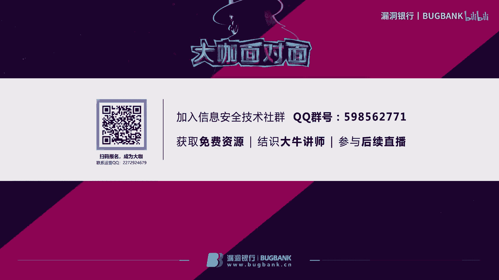
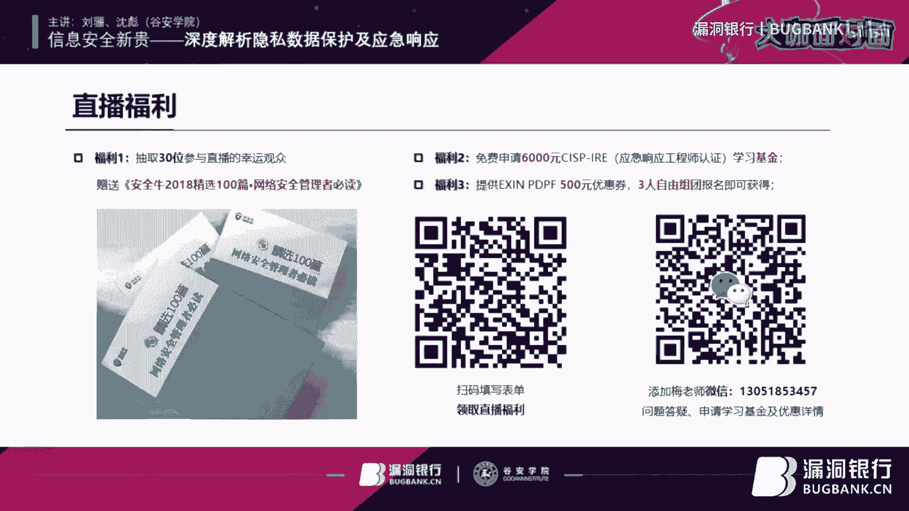
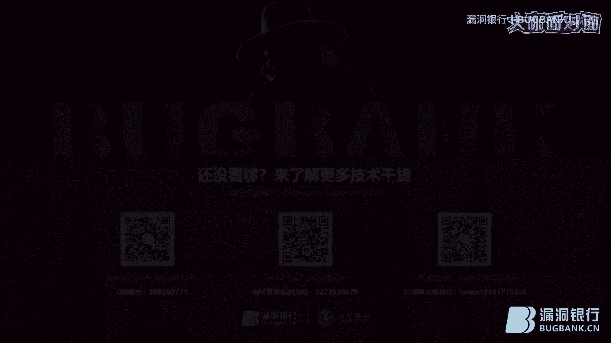

# 课程一：GDPR与EXIN DPO认证体系详解 🔐

## 概述
在本节课中，我们将学习欧盟《通用数据保护条例》（GDPR）的核心内容及其在全球的影响，并深入了解EXIN机构推出的数据保护官（DPO）认证体系。课程将涵盖GDPR的基本原则、数据主体的权利、企业的义务，以及如何通过专业认证提升个人在数据保护领域的专业能力。

---

## GDPR：史上最全面的个人数据保护法

上一节我们概述了课程内容，本节中我们来看看GDPR究竟是什么。

GDPR是欧盟于2016年4月正式发布的《通用数据保护条例》。此处的“数据”专指个人数据，不涉及国家安全或企业商业信息。该条例于2018年5月25日结束两年准备期后正式生效，成为影响全球数据保护最重要的法律法规之一。

GDPR常被称为史上最严格的数据保护法，主要因其高昂的罚款上限：**全球营业额的4%或2000万欧元（取较高者）**。然而，其核心目的并非罚款，而是通过全面、系统的要求，引导和惩戒组织做好个人数据保护工作。因此，称其为“要求最全面”的法律更为确切。

---

## 为何GDPR在中国也备受重视？

了解了GDPR的基本定义后，我们自然会问，一个欧盟的法律为何在中国也受到如此重视？

这主要基于GDPR宽泛的适用范围。它不仅管辖位于欧盟经济区（共31国）内的企业，还通过以下两个原则将管辖权延伸至全球：
1.  **企业所在地原则**：若数据处理者或控制者位于欧盟经济区内，则受GDPR管辖。
2.  **数据主体所在地原则**：若企业向位于欧盟经济区内的自然人提供产品或服务，或对其行为进行监控，无论是否盈利，只要处理其个人数据，就受GDPR约束。

因此，任何面向欧盟用户开展业务的中国企业，都必须遵守GDPR，这使得它在中国也成为了一个重要的合规议题。

---

## 个人数据与隐私权

明确了GDPR的管辖范围后，我们需要厘清其保护的核心对象：个人数据与隐私权。

*   **隐私权**：在GDPR中，隐私是自然人享有其个人与家庭生活不受打扰的权利。
*   **个人数据保护**：是保障上述隐私权的手段与方法。

GDPR通过保护个人数据来实现对隐私权的保护。个人数据指**已识别或可识别的自然人的任何信息**，可分为两类：
*   **直接个人数据**：如照片、指纹、DNA等直接绑定到特定个体的信息。
*   **间接个人数据**：如手机号、车牌号、身份证号等，可单独或组合后识别到特定个体的信息。

GDPR还规定了几类**特殊个人数据**，原则上禁止处理，除非有特殊合法原因。这些数据包括：
*   种族、民族
*   政治观点
*   宗教或哲学信仰
*   工会会员身份
*   基因数据
*   生物特征数据（如指纹、声纹、面部识别特征）
*   健康数据
*   性取向数据

其中，生物特征数据（如刷脸打卡、刷脸取款）在中国存在一定程度的滥用，其唯一性和不可更改性意味着一旦泄露，风险极高。

---

## 数据主体的权利与企业的义务

上一节我们定义了个人数据，本节我们来看看数据主体（即自然人）拥有哪些权利，以及企业相应地承担哪些义务。

GDPR为数据主体赋予了以下权利：
1.  **知情权**：知晓数据被如何收集与使用。
2.  **访问权**：获取被收集的个人数据。
3.  **同意与撤销同意权**：可授权或撤回对数据处理的同意。
4.  **纠正权**：要求更正不准确的个人数据。
5.  **删除权（被遗忘权）**：要求删除其个人数据。
6.  **限制处理权**：限制数据的处理范围和目的。
7.  **数据可携带权**：以通用格式获取并转移其数据至其他控制者。
8.  **拒绝权**：以合法理由拒绝其数据被用于特定目的（如营销画像）。

相应地，企业在处理个人数据时必须遵循以下原则：
*   **合法、公平、透明**
*   **目的限制**：仅为明示的、特定的目的处理数据。
*   **数据最小化**：仅收集处理实现目的所必需的最少数据。
*   **准确性、完整性、保密性**
*   **存储限制**：仅在实现目的所需的时间内存储数据。

企业在数据处理中扮演不同角色：
*   **数据控制者**：决定数据处理目的与方式的实体，承担最终保护责任。
*   **数据处理者**：代表控制者处理数据的实体。

GDPR还规定了**问责制**，要求控制者和处理者必须能够证明其数据处理活动是合法合规的。

---

## 企业面临的挑战与应对

明确了权利与义务后，本节我们探讨企业为满足GDPR合规要求将面临哪些具体挑战。

企业面临的风险远不止罚款，还包括：
*   **合规风险**：市场与客户信任度下降、企业声誉损失。
*   **市场准入门槛**：个人数据保护成为进入欧盟市场的新壁垒。
*   **实操难题**：例如数据跨境传输的要求、数据泄露后的应急响应、如何实现“**隐私保护默认设计与贯穿设计**”等。

个人数据保护是一个需要企业**自上而下**、全员参与的系统工程，涉及法务、HR、业务、市场、IT等多个部门。对于IT人员而言，理解GDPR有助于更有效地与其他部门沟通，并为向数据治理、安全治理等更高阶职位发展提供有力支持。

在中国，个人数据保护也日益受到重视，例如《网络安全法》的处罚案例、对违规APP的整治，以及将个人信息保护立法纳入五年规划等举措。

---

## EXIN DPO认证体系介绍

在学习了GDPR的理论框架后，我们来看看如何通过专业认证体系系统化地掌握这些知识并证明自身能力。

EXIN推出的DPO（数据保护官）认证是目前**唯一基于GDPR的专有认证体系**。该体系包含三个部分，获得全部三个证书即可自动升级为DPO认证：
1.  **隐私与数据保护基础（PDPF）**：系统介绍GDPR法律法规，考试为1小时中文。
2.  **隐私与数据保护实践者（PDPP）**：从企业角度讲解数据保护管理体系的建立与实施，包含实践任务和2小时英文考试。
3.  **ISO/IEC 27001 基础（或审计师）**：信息安全管理体系基础。若在特定日期前已持有其他机构的有效27001证书，可免考。

该认证的优势在于证书**长期有效**，无需续费，且能帮助从业者对数据保护形成系统化认知，在求职和职业发展中占据优势。

---

## 总结
本节课我们一起学习了GDPR的核心内容、其全球适用的原因、个人数据与隐私权的定义、数据主体与企业的权利义务、企业面临的合规挑战，以及EXIN DPO认证体系的构成与价值。理解并实践GDPR的要求，不仅是应对全球合规的必要之举，也是把握数据资产化时代趋势、提升个人职业竞争力的关键。

---

# 课程二：CISP-IRE注册应急响应工程师认证解读 🛡️

## 概述
在本节课中，我们将聚焦于信息安全的事中对抗环节，深入解读CISP-IRE（注册应急响应工程师）认证。课程将阐述应急响应工作的重要性、认证的知识体系、其市场含金量以及相关的职业发展方向，帮助大家理解为何应急响应能力已成为当前网络安全领域的稀缺关键技能。

---

## 应急响应为何至关重要？

我们首先探讨为什么应急响应能力在当今安全体系中变得如此重要。

传统安全体系侧重于“事前预防”（如防火墙、漏洞扫描）。然而，安全事件防不胜防，因此“事中防护”的核心——**识别与响应**能力——变得至关重要。这体现了从单纯“预防”向增强“抗击打能力”和“灾难控制能力”的战略转变。

国家层面成立应急管理部，网络安全领域开展“护网行动”（模拟实战攻防），都强调了对**实战对抗能力**的重视。对企业而言，应急响应能力意味着在遭受预期之外的攻击时，能够快速发现、控制并恢复，将损失和影响降至最低。

---

## CISP-IRE认证知识体系

了解了应急响应的重要性后，我们来看看CISP-IRE认证具体培养哪些维度的能力。

该认证的知识体系涵盖三个核心维度，确保人才能力的全面性：
1.  **应急响应流程**：从管理角度，教授如何建立有效的应急组织、流程和方法论。
2.  **应急响应技能**：从技术角度，培养针对不同操作系统（Windows/Linux）的日志分析、网络协议分析、专业工具（如Sniffer）使用等实操技能。
3.  **监测分析与处置**：聚焦“事中”环节，培养安全事件的发现、分析、分类与初步处置能力，强调设置监控策略、分析事件阈值等。

应急响应是团队工作，此认证确保从业人员既能参与流程组织与事件升级管控，也能进行具体技术处置或监控分析，实现知识面的全面覆盖。

---

## 认证的含金量与从业方向

掌握了知识体系，本节我们分析该认证的市场价值与职业前景。

CISP-IRE认证的含金量体现在：
*   **专业化与稀缺性**：将过去依赖个人经验的“排错”工作，转化为具有专业标准和技能的职位。目前此类持证专业人员几乎为零。
*   **考试权威性**：采用多题型且与实操结合的考试方式，确保通过者具备用人单位认可的实际技能，避免“纸上谈兵”。
*   **符合实战需求**：课程与考试内容从信息安全实战出发，符合各单位对安全对抗能力的实际需求。

其广阔的从业方向源于国家与社会对安全对抗能力的迫切需求：
*   **各类组织**：政府、关基设施单位需应对“护网行动”和真实攻击。
*   **商业机构**：安全厂商、服务商需要能为客户提供应急响应服务的专家。
*   **厂商自身**：需要顶尖人才进行攻防测试，证明产品与服务能力。
*   **公益社区**：提升整体安全社区的攻防水平。

随着“对抗”理念的深入（如“假定被攻破”思维），能够解决“异常”和“未知”问题的应急响应人才，其薪酬和职业前景非常可观。

---

## 总结
本节课我们一起学习了应急响应工作在现代安全体系中的关键地位，了解了CISP-IRE认证如何通过流程、技能、监测三大维度系统化培养应急响应人才，并分析了该认证因高度专业化、稀缺性且符合国家实战化需求而具备的高含金量与广阔职业前景。在安全事件难以完全预防的今天，专业的应急响应能力已成为信息安全领域不可或缺的核心竞争力。