# 课程 P1：偏门信息收集与反追踪 🕵️♂️


在本节课中，我们将学习网络安全渗透测试中一些不常见的信息收集方法，以及如何实施反追踪技术来保护自身安全。课程内容基于红发香克斯在漏洞银行技术讲座中的分享，将通过实际案例进行讲解。


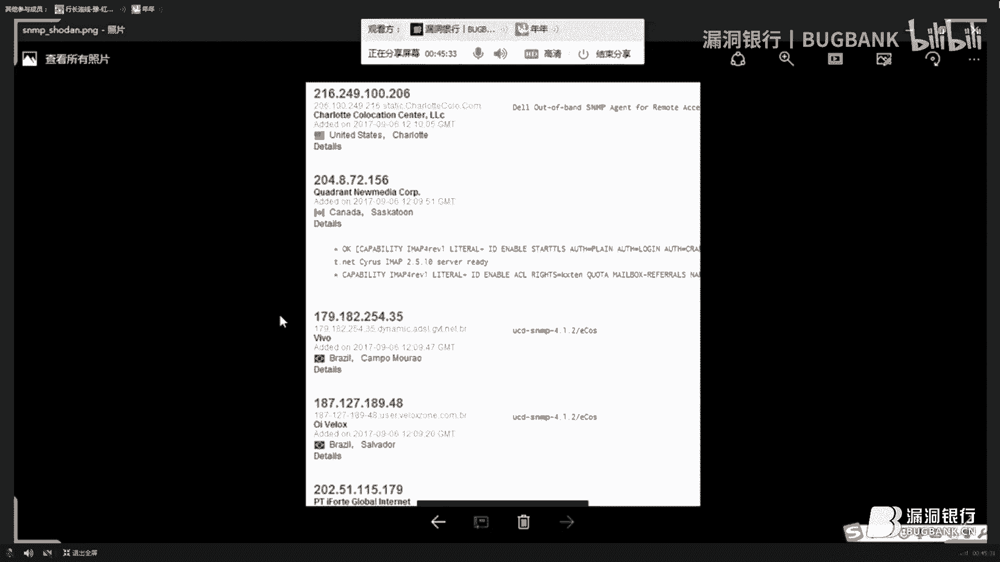


## 概述

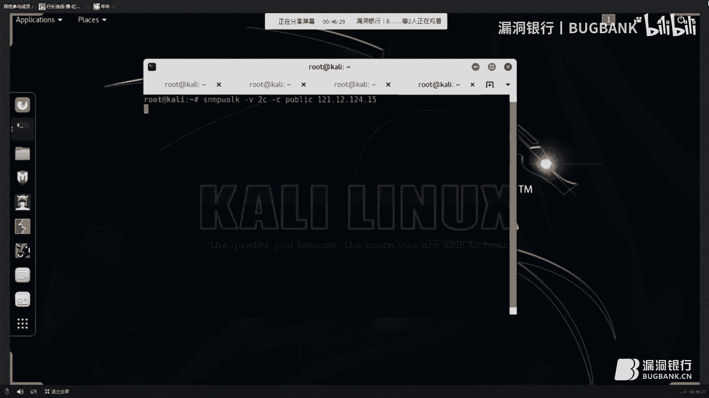

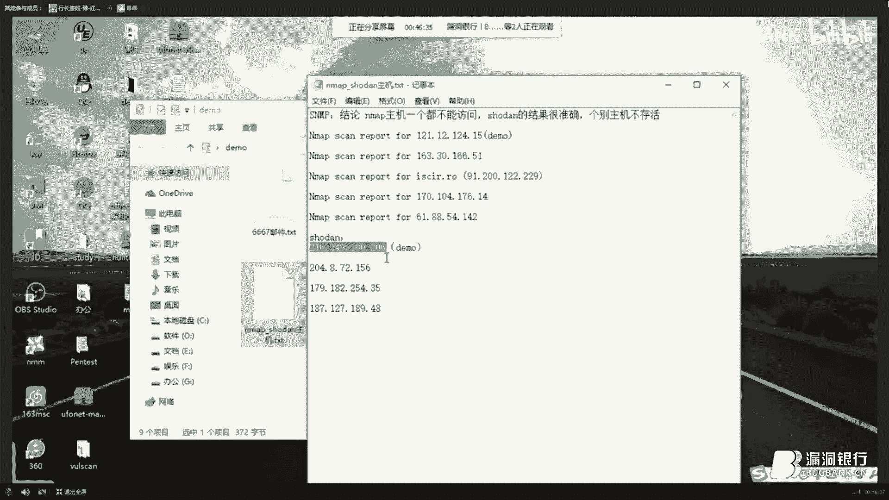


本次讲座主题为“从搜集到跑路：偏门信息收集与反追踪”。演讲者红发香克斯来自草帽团队，是一名网络安全从业者，主要从事渗透测试与应急响应工作。他将通过案例讲解较少见的信息收集方式，并分享反追踪技术。

讲座分为三个环节：主题演讲、问答环节以及赠书环节。

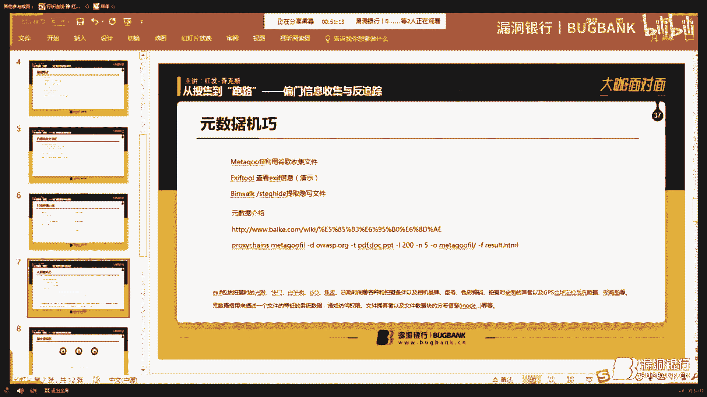

## 演讲者自我介绍

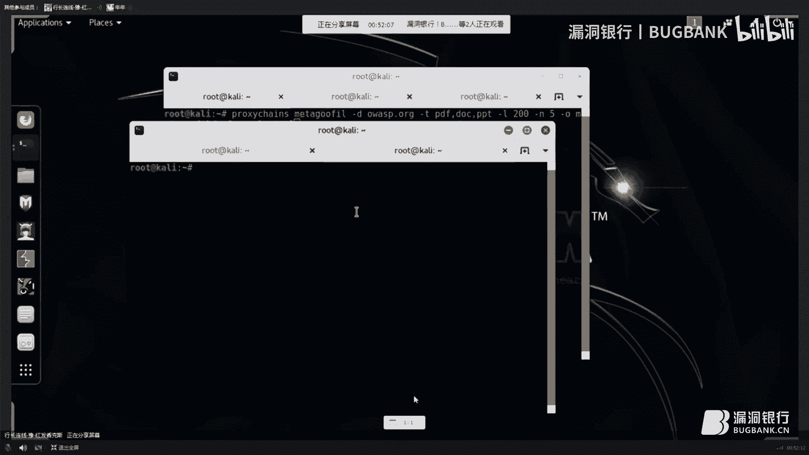


大家好，我是红发香克斯，来自草帽团队。我是一名网络安全爱好者与从业者，目前在公司主要从事渗透测试和应急响应工作。日常喜欢学习新的信息技术。


## 信息收集实战：Nmap 扫描与隐蔽技巧


上一节我们介绍了课程概况，本节中我们来看看具体的信息收集技术，尤其是如何低调地进行扫描。


在渗透测试中，使用 `Nmap` 进行端口扫描是常见步骤。但直接扫描容易被发现，因此需要采取隐蔽策略。


以下是进行隐蔽扫描时需要注意的几个要点：

*   **使用 `-sV` 参数**：此参数用于进行版本探测。如果不加此参数，Nmap 默认不会调用任何脚本进行深度扫描。
*   **调整扫描速度**：使用 `-T` 参数控制扫描速度。在正式环境中，务必保持低调，建议使用 `-T1`（最慢速度）以降低发包频率，避免触发防护警报。
*   **选择扫描时机**：避开目标网络管理员活跃的时段（如白天），选择夜深人静时进行扫描，以降低被实时流量监控工具（如 Wireshark）发现的概率。
*   **使用数据包伪装**：使用 `-S` 参数并指定一个内网中真实存在的 IP 地址进行伪装。这样，扫描流量在网络上看起来像是来自内网的其他合法主机。

一个结合了上述技巧的 Nmap 扫描命令示例如下：
```bash
nmap -sS -sV -T1 -S <伪装IP> <目标IP>
```

执行此类伪装扫描后，即使内网有抓包分析，流量也会显示为内网主机之间的缓慢通信，不易引起警觉，反而可能让管理员困惑。

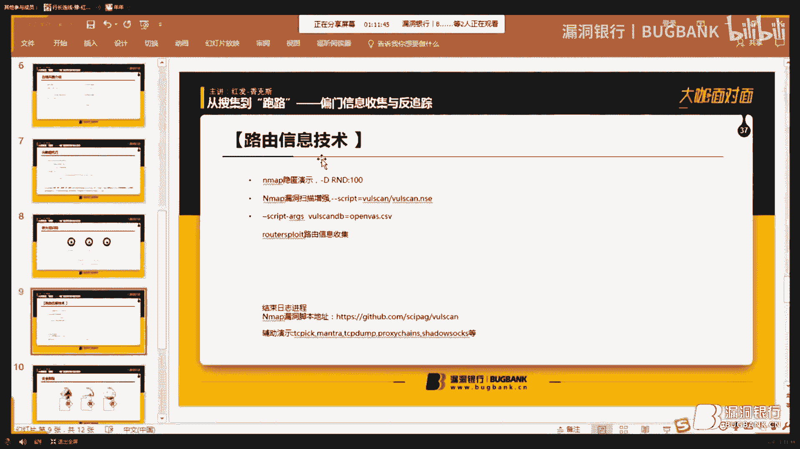

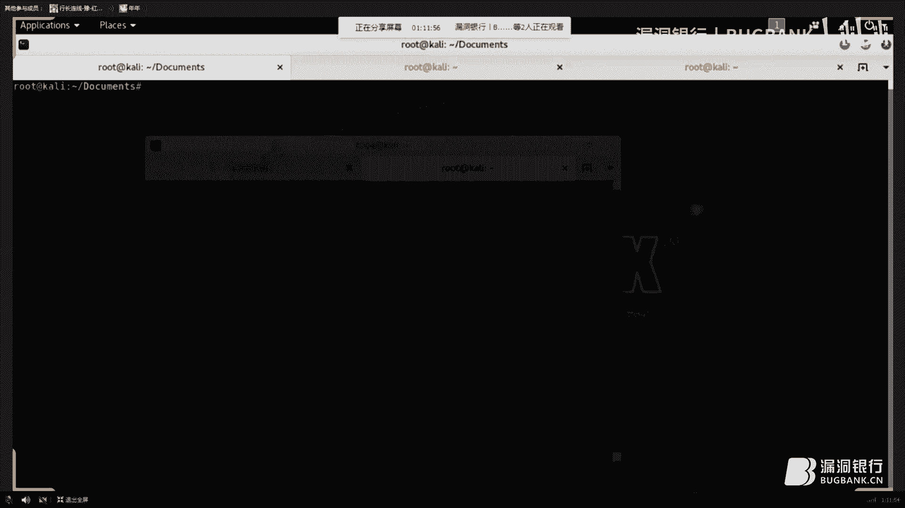

## 内网弱点识别与工具使用


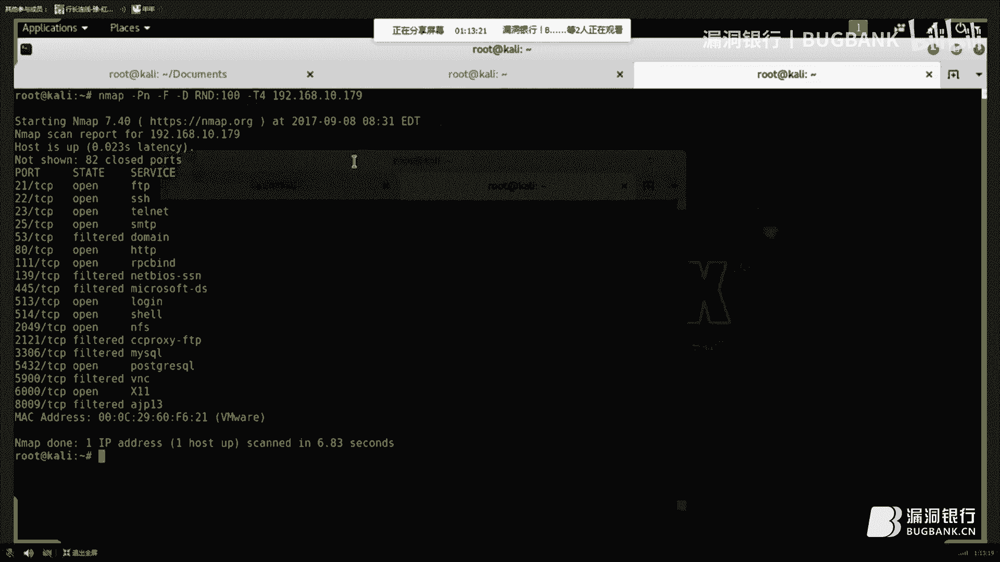

在成功进入目标内网并控制一台服务器后，下一步是识别内网中的其他脆弱点。内网的安全性通常低于外部边界，其中某些设备的安全性可能更差。

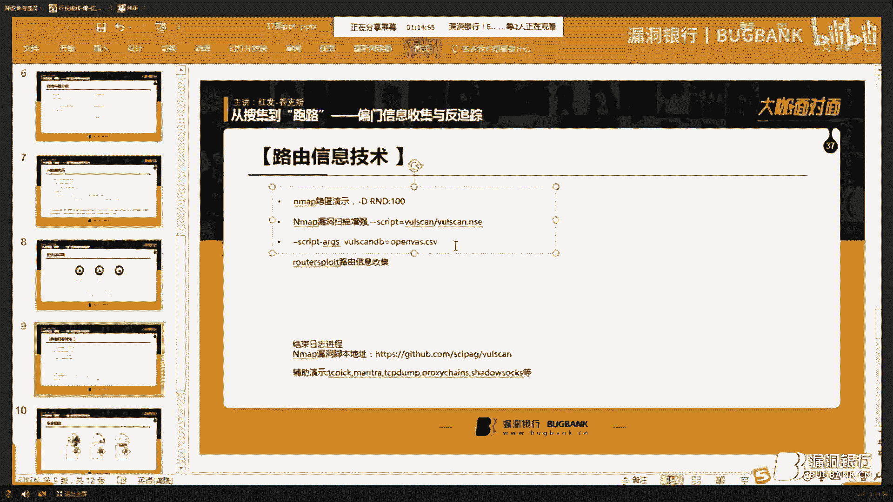

以下是内网中常见的安全薄弱环节：

*   **网络打印机**：许多内网打印机为了方便，常不设置密码或使用弱密码，是优先考虑的目标。
*   **路由器**：路由器是网络的核心设备，往往存在未修复的漏洞或默认配置。
*   **其他办公设备**：如网络摄像头、VoIP 电话等 IoT 设备，安全性普遍较低。

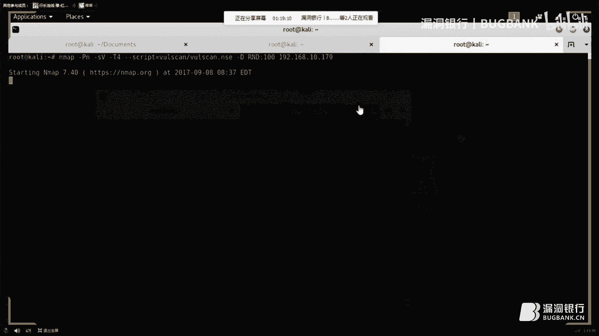

针对路由器等网络设备，可以使用专门的渗透测试框架，例如 **RouterSploit**。这是一个集成了多种路由器漏洞扫描与利用脚本的框架，可以通过 `apt` 直接安装。


## 安全擦除与反取证技术

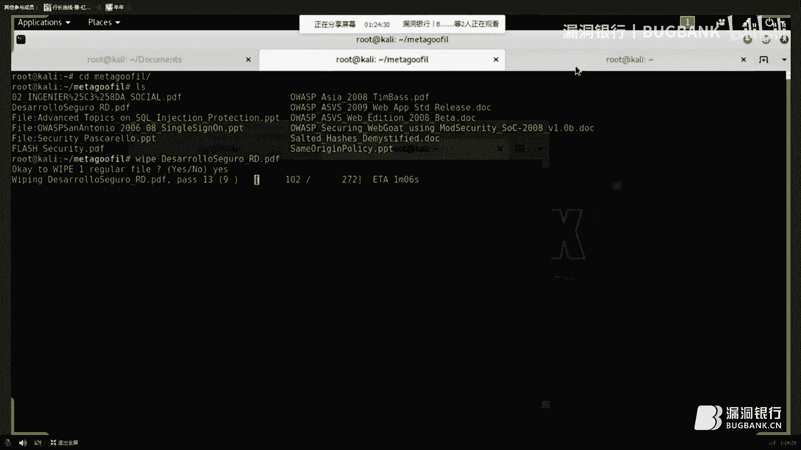


在渗透测试结束后，彻底清除行动痕迹至关重要。假设你将所有收集的信息临时存放在一个 U 盘中，万一设备丢失并被对手进行数据恢复，后果将非常严重。

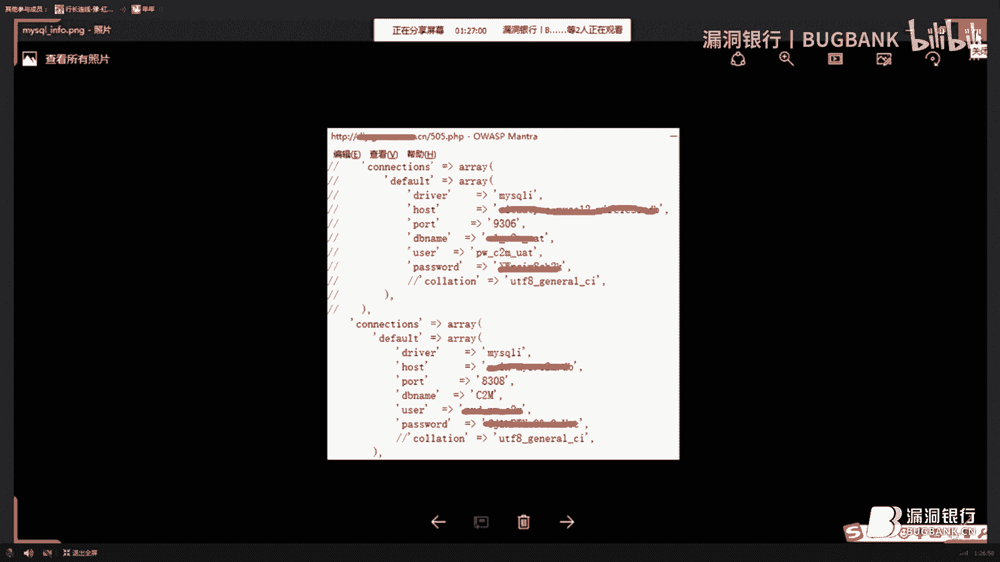

因此，简单的删除操作并不安全，必须进行安全擦除。以下是几款推荐的安全删除工具：

1.  **Wipe (Linux)**：一个 GitHub 上的开源安全擦除工具。在 Kali Linux 中，部分版本自带，未自带可通过 `apt` 安装。
2.  **HardWipe (Windows)**：适用于 Windows 系统的安全擦除工具，可彻底清除文件。
3.  **Ccleaner**：一款知名的系统清理工具，也包含文件擦除功能。

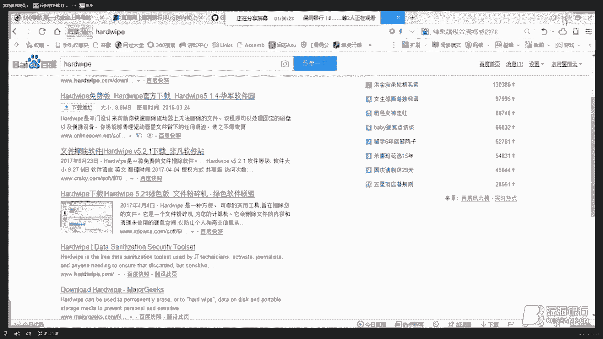


以 Linux 下的 `wipe` 命令为例，其擦除过程非常缓慢，因为它会对文件数据区域进行多次覆写，确保无法恢复。虽然耗时，但相比留下证据，这是必要的安全步骤。
```bash
wipe -r <文件名或目录>
```


## 渗透测试中易忽略的细节

除了自动化工具扫描，手动信息收集往往能发现意想不到的漏洞。以下是几个容易被忽略的细节：

*   **查看网页源代码**：开发者有时会将敏感信息（如测试账号、数据库配置）注释在 HTML 源代码中，甚至隐藏在页面底部的大量空白行之后。仔细审查源代码是发现信息泄露的有效途径。
*   **测试页面与备份文件**：匆忙上线的项目可能遗留测试页面，或将包含完整源代码的压缩包（如 `website.zip`）存放在 Web 根目录下，造成源代码泄露。
*   **非常用端口服务**：不要只扫描常见端口（如 80, 443）。一些生僻端口可能运行着有漏洞的服务。例如，6667 端口可能运行着 IRC 服务，历史上存在可被利用来伪造发送垃圾邮件的案例。
*   **系统配置文件与日志**：进入一台服务器后，应立即检查计划任务（crontab）、系统配置文件、应用配置文件等。这些文件中可能包含连接其他服务器的凭证信息，从而实现“跳板”攻击。
*   **蜜罐识别**：判断一个系统是否为诱捕攻击者的蜜罐，可以观察其是否有真实、持续更新的业务数据。纯粹的蜜罐往往缺乏动态、真实的用户内容。但高仿真的蜜罐识别难度很大。

## 总结

本节课中我们一起学习了网络安全中偏门的信息收集方法与反追踪意识。我们从如何低调使用 Nmap 扫描讲起，探讨了内网脆弱点的识别，强调了安全擦除工具的重要性，并列举了渗透测试中容易忽略的细节，如源代码审查、配置文件检查等。

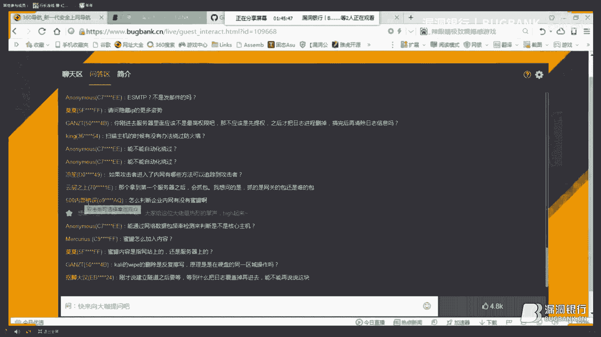


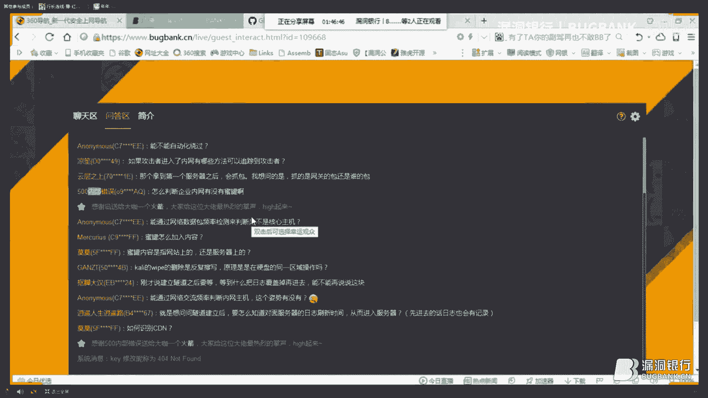

记住，渗透测试的目的是帮助改善安全，所有技术应在合法授权的范围内使用。保持持续学习，并始终将操作安全与隐蔽性放在重要位置。