# P1：【录屏】内网攻击利器_SSRF漏洞绕过与利用-大咖小透明-漏洞银行大咖面对面第78期 - 漏洞银行BUGBANK - BV1Bt411m7dY

为知识而存，因技术而生。小伙伴晚上好，欢迎参加第78期漏洞银行安全技术直播大咖面对面，我是陈秋秋。那今晚我们请来了一位非常低调大咖小透明。那小透明他对外应用安全测试有丰富的经验。

曾经参加过多个运营商项目，可以说是一位寸透老手啦。那他熟悉各类漏洞原理。所以今天呢他会为我们讲解一次SSI漏洞。所以今晚的直播如果你是技术新手，可以当做迈入SSI启蒙课。如果你是大佬为观。

也可以温故之心，看有没有什么新的思路带给你哦。😊，那直播也不是只有听讲。大咖的演讲结束之后，还会有问答和福利环节，大家可以登录直播间在聊天区进行提问或讨论。在问答环节之后，大咖会选出一名幸运观众。

作于书籍渗透测试高手，打造固若金涛的安全网络一书。那希望你能够成为幸运观众哦。好啦，那下面就请小透迷开始分享吧。😊，那现天的议题的话是那SSRF的绕过与应用，然后。我就直接开始了吗。

先说一下他这个原理吧嗯。原理的话，如这张图说。就是说当我客户端就是服务端的话有一个功能，功能的话就是去请求。呃，下载一些图片，嗯，但是它这个下载地址，我们客户端是可控的。

也就是说当我客户端把这个下载地址传过去之后，传到服务器，服务器去进行下载这种图片，下载回来下载到服务器上，然后再回响给我们客户端。这样的话会造成1个SSRF漏洞。它全称的话说是服务端请求伪造。嗯。

这个的话和CSR有点像。CSRF全称的话是客户端请求伪造。SSRF核心的话就是请求由服务端进行发起。分类的话是一个显行，一个盲行。显行的话是有返回，就是有回显。盲型的话只能通过。响应时间来判断。

然后就是这样。这里直接进入下一页。出现在哪些地方？第一个的话是一个远程图片下载。比如说DA3。2，它有个功能的话，就是远程图片下载。那样的话也程。RF漏洞嗯，加载远程文件。这里举个例子吧，就是某某办法。

他会要求你就是你插入视频的时候会。他服务端会去先检查这个视频是否存在，然后再插入进去。如果存在的话，插入进去不存在的话就算了。就会给你回选一个错误嗯。这里的话。检查存在这个请求是由服务端去发起的。

等一下。假说这是一个服务器，然后。这里是我们客户端，当我们客户端去向这个服务器去发起请求的时候。就是输一个这个。UR地址，比如说。比如说我这样输一个地址，想往一个网页插入这么一个视频。

这里的话是由服务端去请求这个视频地址。也就是说服务器它会去嗯请求一个请求。就说这个服务器会就请求bug bank这个嗯域域的服务器域名所指向的服务器嗯，下面的1点MP4这个。地址资源。

然后的话它会先检索一次存不存在。如果存在的话，才会去返回给客户端。也就是说，这里服务器对bug bank这里发起了一次请求。既然这里我们可以对外网发起请求，那肯定也是对。

可以对10172192这种内网段去发起请求的。嗯，我们外网。去请求内网流程的话。肯定会是走一个防火墙的流程，但是内网就内网它就有可能不走防火墙，这是。SSRF能对内网发起攻击的核心核心吧。

然后离线下载我就不多说了，一个是百度网盘，一个是迅雷，百度网盘修复过了。迅雷的话没测。嗯，远程头像这个网站基本上都有，就是很多都是都会有一个远程头像的功能，网页翻译我也不说了，这都是做烂了的事情。

还有一切需要服务器发起请求的地方。

这里常见的过滤与绕go方式。第一个的话是使用HTTP用户名密码语法，使用HTTP用户名密。

这个HTB用户密密码以法的话，我这里说一下吧，嗯，就是HB刚刚有1个301，不对，401。

认证403。它会弹出一个基础认证框，就是让你输入账号密码。但是如果它不是401的话，我们输入的账号密码是会被服务器无无视掉的。也就是说我这里输入一个。Back back。他。也说我这样输入的话。

它是会跳转到百度这个网址的。可以看见。但是服务端它是能接受到这一整串怎么串的。也就是说，当它正则去过滤这个bug bank，就是检查是否有bug bank存在的话，我们就可以使用这种语法去绕过。

这里的话可以看见我这里服务器是已经监听到了多级域名。

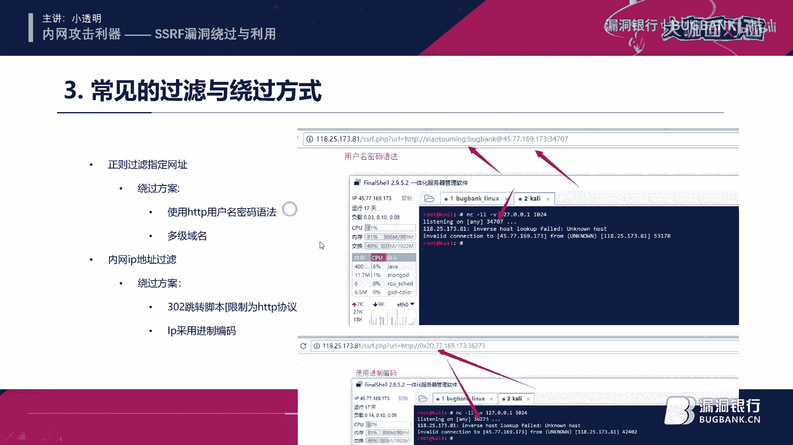

多取域名的话。呃，我也就不多说了，我们都知道就是嗯。一个网站去。一个网站他去嗯就是你访问一个网站，它资金流程的话是一个。然后去检索百度的IP地址。然后才会去嗯访问这个IP地址。对。

然后咱才会去把这个WWW绑定绑定到这个IP地址上。然后会先给客户端。这个IP地址哪里来的？就是DNS服务器。去查询的这个IP地址。嗯，也就是说我们使用多级域名，也就是说我们这里可以把我们一个域名。

比如说八个半可。You看。去给它绑定到一个内网地址，192。168。51。2。这样假如说嗯我们这个内网服务器它使用的是公共DNS。它使用的是公共DNS的话，那他是肯定会从逆向这里的，从逆向到这里的。

然后我们这里在它后面加入自己的域米，不要擦擦擦。点com。这样的话我们只需要访问嗯，就是用这个多级域名的方式去绕过它这个。

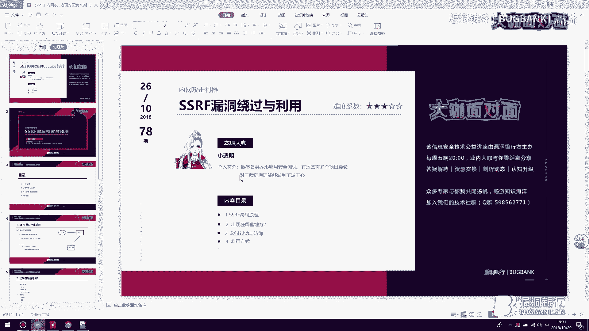

接下来我们说一下IP采用禁制编码，这里说一下是什么的情况，就是说IP地址它可以使用嗯。哪些编码一个是八进制？16进子。使进制。八进制在前面加016进制加0X10进制就是我们平时所见到的那个样子。

这里我案例的话是使用的一个116进制0乘以2D。77。169。173。这样一个台的302跳转交换。它主要是解决上限制为HTTP协议。和一个内网IP地址过滤。什么是内网IP地址过滤？就是不让你输入嗯。

不允许输入。172。10192。以这三个开头的都不允许输入。这个的话就是一个限制的内网I地址过滤。另IP地址过滤。这里的话可以使用302跳转脚本和IB采用静止变码的方式绕过嗯。3套跳展脚本有一个限制。

就是服务端必须支持302。就是代码支持302。可以攻击哪些应用？第一个内网所有的开放应用，什么是开放应用？也就是说不需要授权呢。这里举几个例子，嗯，360如果。

他有的时候问SSRF会问你可不可以更新mycycl。是否可以攻击myCl？这里是可以的，但是前提是买买s必须不需要输入密码，就是空密码才能进行攻击。还有的话就是radius。いです。

和一些不需要授权的应用，嗯，也是可以发送pos包的。pos也是可以的嗯。这里下一页啊，这里常见的协议的话是我们讲就直接叫他万金牛协议吧。嗯，他这个协议的话是在我们STP协议没出来之前都是使用的勾。

然后呢是一个置典协议。TP。CDB。最常见的话就是这四类协议。第一个的话是我们的主力区。第二个的话是试探一些版本信息。第三个的话是只能探测是否存在FTP而不能进行暴力破解。

第四个的话主要是用来检测SSRF这里的话。打开一下插项。等一下，我处理插销这个事情。那里说一下，如何去嗯判断是否存在SSRF。么得在自己服务器上。开一个监听。比如说我这里监听1024是端口。

然后我们这里的话是嗯bu个b提供了一台服务器。我上面搭载了1个SSRF的漏洞脚本。

然后可以看见我们这里是接收了请求响应了。嗯，可以看见是从118。25。39。146过来的请求。而我们这里的IP也是118。25。39。146。也就是说它是有个服务端发起的请求，而并非我们客户端去发起的。

所以它这里是一个存在SSRFO中的。但我们知道这里存在SSRFO到我们第一件事情要做的是去试探它所支持的协议。这谈支持协议。怎么置探？我前面说了这个字典协议可以置探版本信息。这里的话我们改一下就行。

把它改成字典协议。嗯，可以看一下，这里又接奏了请求了，然后它这里说明了它是使用服务端是使用的嗯CUL去发起请求的leb CUL7。2。9。0。嗯，这个版本的话，它支持一般的话都是默认不会改的。

我们去看一下它已支持的是些什么。问认协议。接这样去百度就行，我这已经不演示了，这里我直接在这边给你们看一下。可以看见它是支持如下协议，但实际上有用的就是我刚才列举出来的这几个。比如说我们这里1了7。0。

0。1B22。可以看见显示出来我们的open SSH的版本7。4，然后6739。379。这里显示的radeos的那个一些版本信息。呃，其余的我就不再多解释了吧，然后再说一下分要协议。

分要协议的话就是一个。访问本地的那个协议，这里的话可以尝试访问一下他这个W。paword的这个文件。看一下他有哪些用户。当然如果是盲形的话，那就没有这么轻松了。盲形呢。必须就是无法使用付用协议。

只能根据嗯响应时间的来判断是否执行成功，或者是监听这个秀探。嗯，这里我们再说一下，演示一下，就是我们所谓的这个。万一有些去攻击rad是吧嗯。首先我们有一个脚本，这里。C A点 SH。这样一个脚本。

我这里先解释一下它这些命令是什么意思。echo杠E。是格式化输出的意思。也就是说它会解析杠N杠N杠N这些字符，也就说会被当成换行来解析。我们先不用这个I考杠E试一下输出。

可以看见它输出来就是这样这样去输出。我们使用X杠1之后。换行了。呃，这里我们需要一些CD过去。你较文件。那我们接着来解释啊嗯这。管道福，他的意思是把前面的语句的结果当成后面的参数。来使用。也就是说。

这一套语句它实际上是这样的。3个。它实际上是这样一个状态。这才是这样这里的语句啊。而不是你们所看到的艾加E什么的。但是由于行列不能换行，所以说我们使用X加一。去去执行。然后这里面我说一下什么意思。

三刚我就不说了，换行符新斜杠一，这里是每每分钟执行一次。后面的我也就不说了，就是一个反弹向的操作。也就是说，每分钟反弹一次线而到我服务器的1024端口。后面这个st一。嗯是。这个一的话是king。

然后嗯这个东西话是值。都知道数据库的话，它是有一个K和一个值的。嗯，confi我就不多说了，配置的意思sDIR就是说s目录就是设置目录为这个目录的所有文件都是。都是一个。第四文件。

然后第一批fi name就是数据库名称，数据库文件名称为root。后面的话是开始，然后再后面是退出。等一下，但是光这还不够，我们得知道怎么样去把流量。

就是它到底是用什么方式去嗯对6379这个端口去访问的。它到底是以什么方式去对6379这个端口进行访问的？是什么协议？这里的话，所以说我们还得进行一个端口转发去嗯。去还原他这个发送的数据。

然后再以外金入协议去发送出去。用soet so这个东西的话，可以自己去嗯ym映去下载一下。这个语句的意思就是说。把本机的1234端口转发到6379上去。原理是什么？原理就是一个小型的代理服务器。

代理服务器是干嘛的嗯。就是说我们本来是想访问127。0。0。1。然后走代理走到192。168。1。32。再返回来。中间挂了一层代理，这个代理的话就是192。168。1。32。

既然我走了你这个代理的服务器流量，那我这个服务器是不是可以兼定到你所有的流量，就是说其中包括了一些。数据啊什么账号啊。之类的。可以把它理解为一个中间人。中间人攻击的原理也是这个嗯。7点。

然后这里我们就不能填留上祈求了，因为我们已经把。1234转发到6379上面了，所以说我们这里直接填1个1234。可以看见返回了5个OK在这我们来这里的话会生成一个root文件，我们去把它删掉。

你看这就是我们抓到的他发送的数据。也如说我们执行这么多语句，对637有这个。所发生的数据。这个数据是不能直接发送的，经过处理。首先第一步怎么处理啊，先说一下。把这些标示符全部给删掉。标注全部给删掉之后。

所有的杠R替换成0%A0%D。看全部提换这个这种空的话，我们全部提换成0%A。那个0%A，然后说一下这里642的意思，642就代表。整个数据包的长度为62，也就是说你要改它这个。改我这个东西的话。

你必须得重新去抓一次包，然后去生成一个配load的。要不然的话，数据长度不够的话，它是发送不过去的，它会舍去掉一些数据。就是说假如说你有70个字符，72个，你这里填的60个的话。

他就把最后10个给你舍去掉了，就是压那10个是到不了服务端的。嗯，然后拍到的话，我这里是这。这里的话就是我们的一个paon的。这里我们建立一下1024端口。但是注意这个配load的还是不能直接用的。

还你再进行语编码。嗯。完整的配套的应该是这样一个形式。这样一个配到才是完整的。把自己穿功。复制到这后面U按后面来。这里回显5个okK，然后可以看一下，我们这里应该是马上会反弹出来效果。稍微等待一下。

因为是一分钟执行一次。这里项已经反他来了，可以看一下目录情况。然后大致的话就是这样一个工具方案。嗯，mysql那些同理啊。假如说到攻击STP协议的话。那就是你把这里抓的包抓下来。

然后整个进行我刚才那样的编码。换行全部做杠20A0D处理。那样就行了。好，那感谢小透明大咖的分享。下面我们来到一个大家可以集中问答的环节吧。那大家如果现在有什么想要提问的，可以在聊天室里面发出来。

那大咖也可以挑选一些问题来做回答。😊。

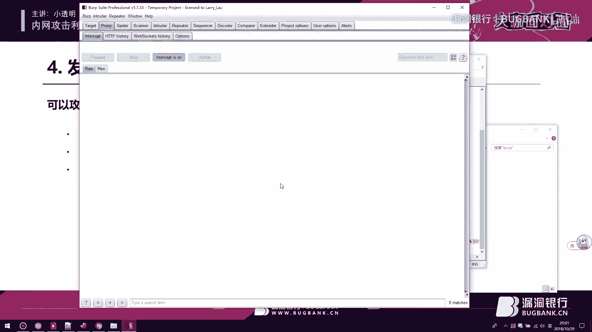

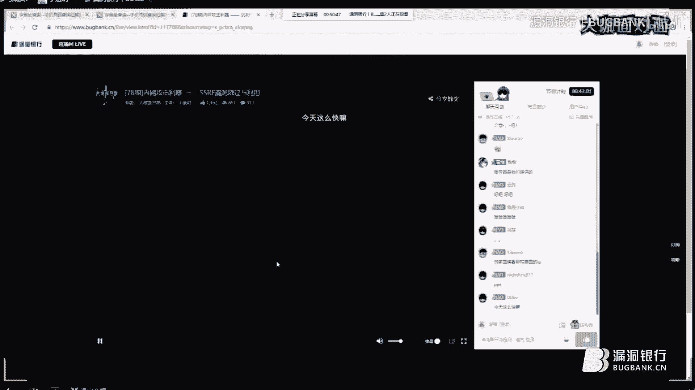

啊，回到常见攻击那一张。

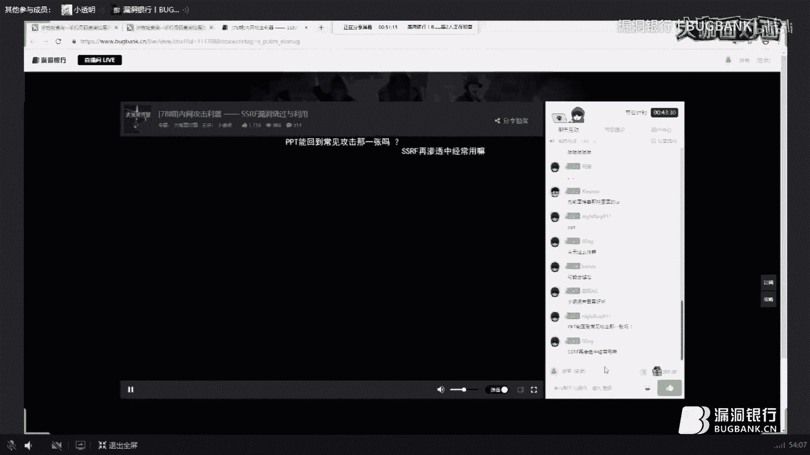

我给你们打开。渗透测试的话，是这里看什么站。如果是作为一个大型企业，嗯，大型甲方去做渗透测试的话还是比较常用的。但是如果你是呃怎么说呢？去做那种小的网站，那真的是不是很常用。

因为那种小网站可连连内网都没有。

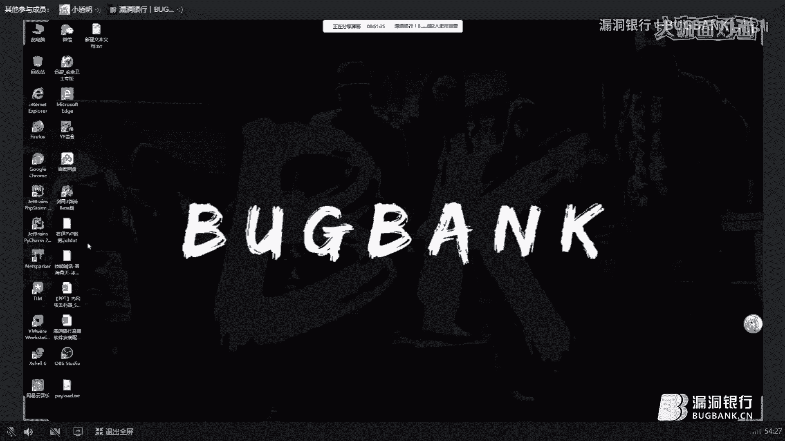

我估计你搞下来也是进查数据库看一下，它内网是没有资料的，就算有。

小网站连内网都没有，常见工资的话在这里。更本电S。公共DNS的话就是我们都在用的DNS你这里你这里IP地址配的应该是一个自动选择DNS它自动选择DNS应该是应该是电信或者是移动的DNS吧。

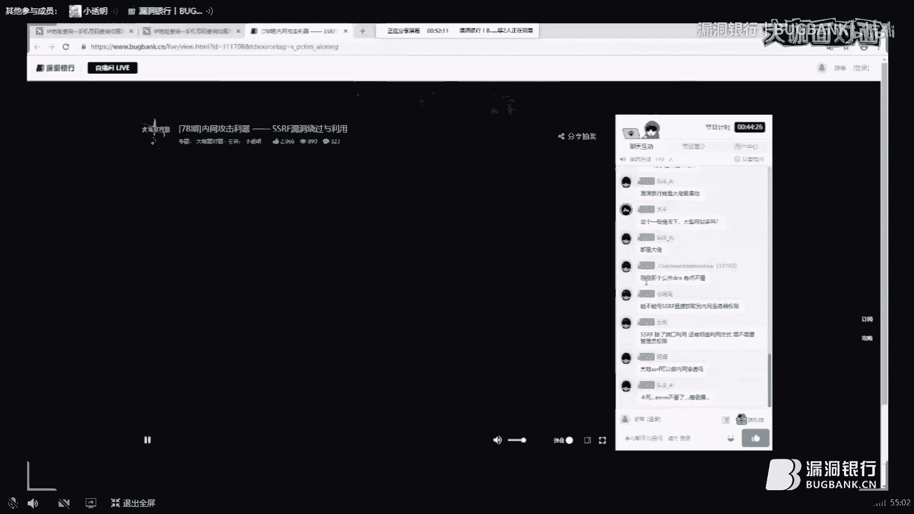

然后。可以直接获取到内网权限了，但是要结合开放式际应用。如果是单1个SSIF，它内网并没有任何开放式应用的话，是不可能获取到那个权限的。然后除了端口利用，还有哪些利用方式，就是一共立一个。开放式的。

那个应用。内网渗透是可以的，可以配合一个打洞，就是打洞出来。嗯，一般的话都是一个linux主说一下那个linux主题内网渗透测试的流程吧。拿到一个SSH就是反弹拿到一个反弹之后，它是需要去看一下权限。

如果是ro的权限的话，如果不是话，就提全。如果是ro的权限的话，嗯，就安装一个PM后门PM后门的话，它是可以截断截取那个用户名攻击密码的。用户名账号密码的。然后是中了PM后门之后是嗯留一个键盘记录吧。

然后的话是查看嗯SS。

H那个新能列表。如果新能列表存在的话，那某些机器可以直接。直接去登录的，就是连密码都不用。然后的话是锈碳，但是锈碳的话不建议去进行操作，因为锈碳动静太大了，很容易被发现。然后的话是扫描扫扫描内网嗯。

IP网段。然后看哪些开放了，就是万部端口，可以进行一个跨网站攻击。一般的话，油服。一般内网很多的话都是拿邮件服务器，邮服的话是隔离的比较开的。

。嗯可以配合ST2。没有可以没有用偏M，那你就留SSH后门呀。SSF就是用来扫内网的。不是漏洞啊。对，可以。前提是你必须得把这个bs给转发出来，bss给转发出来。不在同一网段。

这里看内网是否有开放权限了。

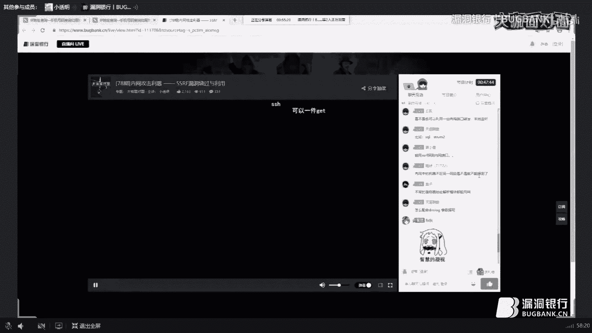

但是一般它都有几个隐蔽的网段，是嗯不允许访问的，是那种运维。运维才能访问的。这种。这种的话就得搞一台VPN，然后持续去扫描这台VPN。连上这台VPN的网站，比如说VPN是10。2。20。

1这个IP你就去扫他这个2次，看一下还有没有其他人连这个VPN的网站，然后用MS010。来017。17-10去打。打下来之后，嗯，因为运气运维的那个运气，就是管理的机器比较多。管理机器比较多。

所以他是会记录密码的，直接连就行。如果运气不好的话，那就继续扫继续打。

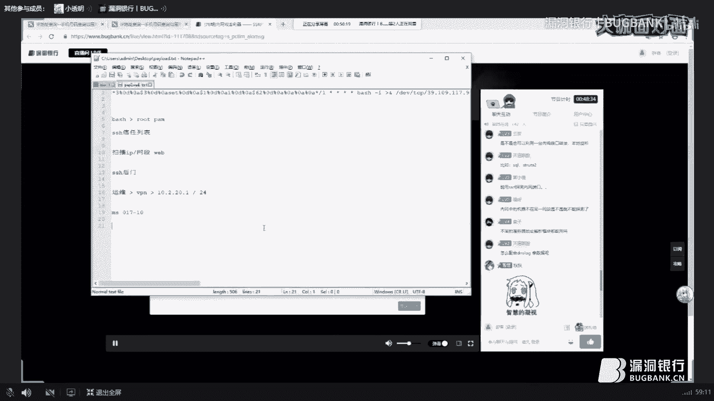

很像移动就是这样。拿数据的话。拿数据基本不可能吧，除非你有。啊，也可能你把你把那个b给那个。代理出来之后，直接去查外国应用，然后看配置文件，连数据库。配合DNSlogo。配DNS logo。

这我倒是不清楚，但是可以用DNSlogo来测试。那个。是否存在？可以用DNSlogo来测试嗯SSR是否存在。拿数据的话。这必须得去连接到数据库的。打反馈数据。

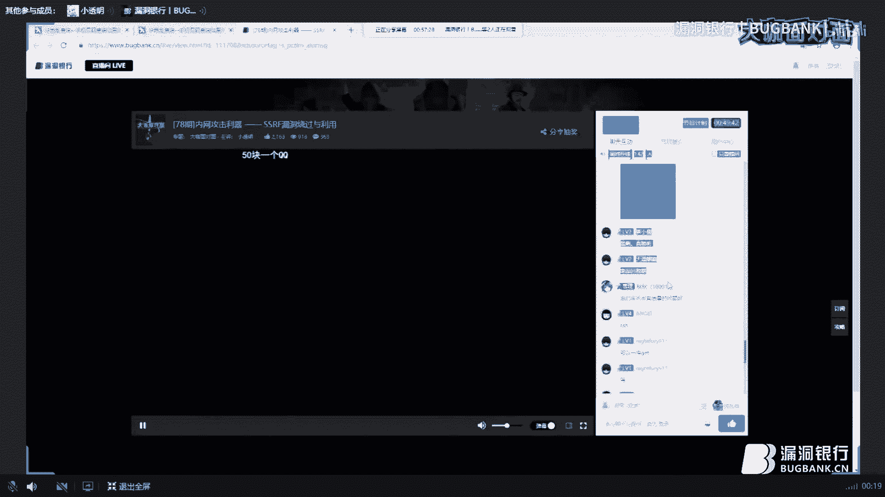

返回数据。应该不行吧，展会说学。比如说这里是1个DNS。应该可以可以，我试一下。

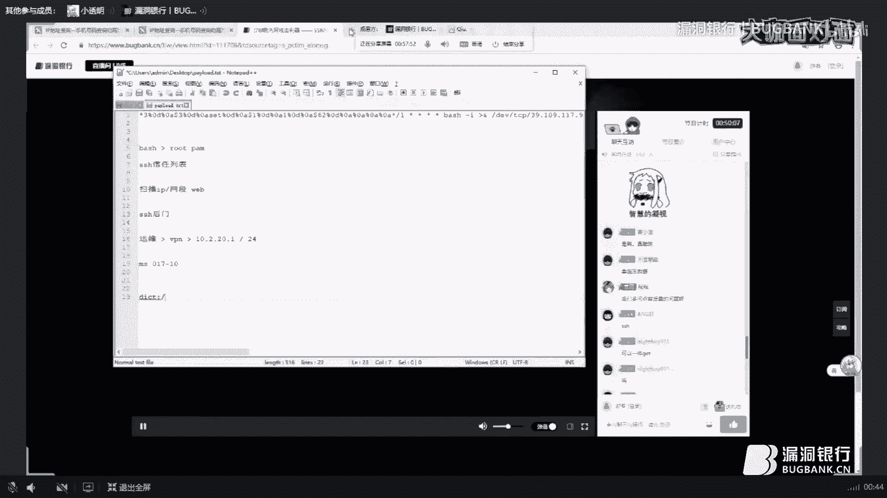

啊。所以不你响我想我记道bug干的话也有一个那个。Co렇期。测试一下能不能用吧。啊，可以用啊。不。是的。啊，这里好像是没有一个回显，如果有回显的话，它这里是会显示出来那个版本信息的。

但是bug是这样好像这个是没有。但看这个好像没有。

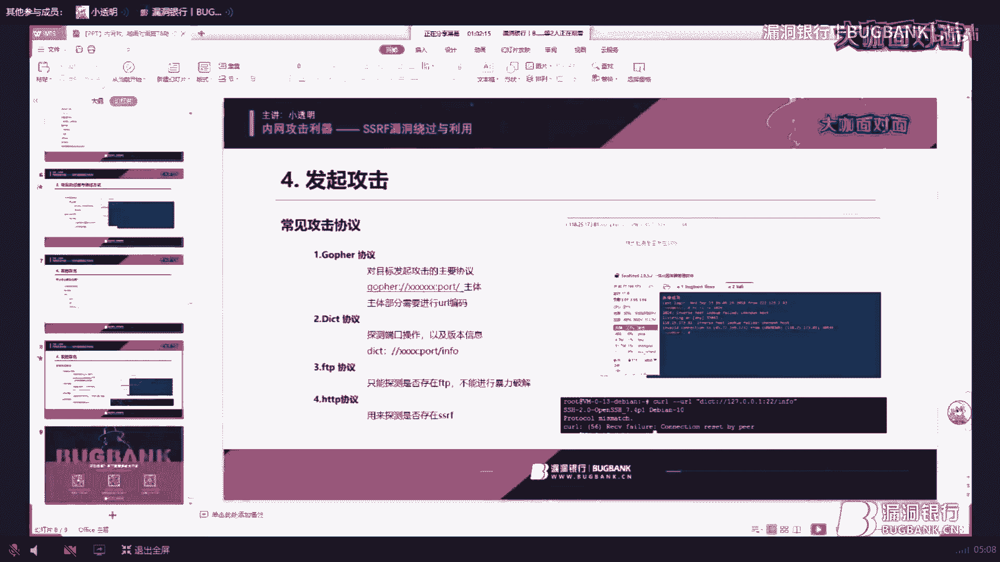

Yes。所以下一个问题。SS后S后门可以修换到密码，不行。SSRF有和CSF有什么区别？SSRF是一个服务端请求一个。CSF是客户端请求一张从名字就能看出来。区别很大了，一个是面向服务器的攻击。

一个是面向客面向用户的东西。所有面向用户攻击，它漏洞评级方式都是看网站的那个用户量，用户量越大，危害越大，用户量越小，用户越小，而面向服务器的攻击就不一样了。他再怎么都是。

能对你服务器造成一定伤害的漏洞，就叫面对服务器，面向服务器的攻击。DSlogo，你可以自己去申请一下。什么等级漏动，这里看是不是核心服务器。一般的话它有三个等级，像腾讯，它所有是加了内网隔离的。

腾讯是有内网隔离了，所以说腾讯的SSRF存在的几率很小。然后嗯如果是核心网段的话，一般都是穿高维。边缘网段的话是中维，再边缘一点的话就是低维。这里看是不是核心网段。嗯，感谢大咖的解答。

因为呃我觉得小透明大咖真的也是回答很多问题，而且听起来感到惊验就非常老叨。😊，嗯，所以那个如果后续还有什么问题的话，大家可以回头再交流吧。那下面我们到今晚直播的福利环节，我们要给大家送书。

那今天的这本书名字特别长啊，叫做渗透测试高手，打造固若金汤的安全网络。那小透明大咖，你可以收成选这本书来送给大家吗？另外我同事在看这本书，我还没看。因为同事在干。这个理由很耿直。😊。

那同事有没有评价这么说怎么样？我看书评还可以，他说是学内网渗入的，专门学内网上的，那正好跟这次一提有一点关系。😊，嗯，大咖跟我说SSF最厉害就是可以不用打洞就进内网。虽然我不知道什么意思。

但是我觉得很厉害的样子。😊，好吧，那那个这本书呢将由乐多银行出资采购小透明大咖来亲自选吸运观众。小透明这边就来看你想送给谁吧，然后把他的名字大声的说一下，我们这边会记录。那我还是截屏吧。

截屏的最后一个行吗？行呀，你来解伴来做。那就恭喜这位叫做云顶的小伙伴，就像我刚刚直播的时候也分享了很多东西，感觉是个硬仓大佬，是不是？那请你在直播后可以私聊我一下。那恭喜你获得这本大咖选择的书。

叫渗透测试高手，打造固若金汤的安全网络。那请在直播结束后就联系我这边，然后来进行对奖，来到今晚直播的尾声啦。再次感谢小透明大咖进行准备，分享的内容很丰富，然后也希望大家如果觉得有帮助的话。

来给大咖道一声感谢。今后请大家多多关注小透明大咖的发展。😊。

当然也感大家的踊跃参与。那这里也呼吁一下大咖运对面是一个传播知识技术，展现白毛风采的舞台，不过年龄不具资历。那大家如果也想分享的话，可以来找我报名，成为大咖。

那结交更多大咖伙伴也可以获得更多的骆洞银行的特别优待。如果大家想关注直播的话，可以点击页面底部的加群链接。那今晚我们的直播，就先到这里结束啦。那大咖还有什么想要说的吗？😊，好好学习，天天向上没了。哼。

好嘛，那今天我们这边直播就到此结束啦，那大家再见了。😊，🎼The taste so sweet。はい。あめ。🎼I'm searching。ない。🎼know了 stay。🎼Like to。🎼We主。

🎼いそ。🎼Baby one。🎼You in your town。But I't want to。🎼So发了。🎼的力。🎼緒？🎼That leads to。🎼That needs just。

